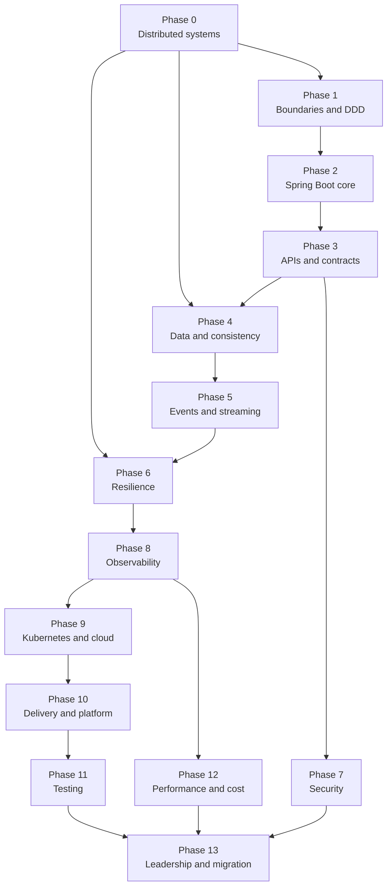

# The Roadmap — 90 Weeks, 14 Phases

Total effort: roughly **1,600–1,800 focused hours**. "Focused" means building and measuring, not
watching videos. The week numbers below assume ~20 hours per week; see
[Pacing](#pacing-pick-one-and-be-honest) to convert to your reality.

> Phase guides are published incrementally. Phases 0 through 12 are live; links to later
> phases activate as each one is written. The schedule, gates, and pacing below are final and
> usable today.

---

## Dependency graph

Phases are ordered by dependency, not by topic popularity. The arrows are hard prerequisites.

Two shortcuts are legitimate. If you already run services in production, skim Phase 2 and spend
the time in Phase 4. If you are interviewing within two months, jump to
[the interview fast path](#fast-path-interviewing-in-8-weeks).

---

## Phase schedule

| # | Weeks | Hours | Phase | Small projects | Large project | Exit gate |
|---|---|---|---|---|---|---|
| 0 | 1–4 | 80 | [Distributed systems foundations](phases/phase-00-distributed-systems-foundations.md) | S01 | — | Derive replica count from a durability target; explain why retries made an outage worse |
| 1 | 5–10 | 120 | [Service design and DDD](phases/phase-01-service-design-and-ddd.md) | — | Decomposition dossier | Produce a context map and defend two boundaries you deliberately did not split |
| 2 | 11–17 | 140 | [Spring Boot production core](phases/phase-02-spring-boot-production-core.md) | S03 S04 S05 | Platform baseline | A service that starts, drains, reports health, and survives a slow dependency |
| 3 | 18–23 | 120 | [Communication and APIs](phases/phase-03-communication-and-apis.md) | S02 S11 S12 | ShopKart edge | Ship a breaking-change-proof API with idempotent mutations |
| 4 | 24–30 | 140 | [Data and consistency](phases/phase-04-data-and-consistency.md) | S08 S10 | Order saga | Crash the system mid-saga and prove no money or stock was lost |
| 5 | 31–36 | 120 | [Events and streaming](phases/phase-05-events-and-streaming.md) | S09 | Event backbone | Replay a day of events without double side effects |
| 6 | 37–41 | 100 | [Resilience engineering](phases/phase-06-resilience-engineering.md) | S06 S07 | Resilience harness | Kill a dependency under load; the service degrades instead of collapsing |
| 7 | 42–47 | 120 | [Security and compliance](phases/phase-07-security-and-compliance.md) | S13 S14 S15 | Security baseline | Rotate a signing key and a database credential with zero failed requests |
| 8 | 48–53 | 120 | [Observability and operations](phases/phase-08-observability-and-operations.md) | S16 S17 | Observability stack | Diagnose an injected fault using only telemetry, timed |
| 9 | 54–60 | 140 | [Containers, Kubernetes, cloud](phases/phase-09-containers-kubernetes-cloud.md) | S18 S19 S20 | Cluster deployment | Rolling deploy under continuous load with zero dropped requests |
| 10 | 61–65 | 100 | [Delivery and platform engineering](phases/phase-10-delivery-and-platform-engineering.md) | S21 | Delivery platform | A canary that aborts itself on a real metric regression |
| 11 | 66–70 | 100 | [Testing strategy](phases/phase-11-testing-strategy.md) | S22 S23 | Test strategy doc | A contract test catches a breaking change before merge |
| 12 | 71–77 | 140 | [Performance, scale, cost](phases/phase-12-performance-scale-and-cost.md) | S24 | 10x optimization | 10x throughput with before/after profiles and a cost delta |
| 13 | 78–90 | 180 | [Architecture leadership and migration](phases/phase-13-architecture-leadership-and-migration.md) | ADR set | Migration programme | A migration plan a skeptical staff engineer signs off on |

Project IDs map to [projects/small-projects.md](projects/small-projects.md) and
[projects/large-projects.md](projects/large-projects.md).

---

## Milestones

| Milestone | When | What it means |
|---|---|---|
| **Foundations locked** | End of Phase 1 (week 10) | You can argue *against* microservices with evidence |
| **Can ship production services** | End of Phase 3 (week 23) | Contract, config, health, timeouts, errors — all deliberate |
| **Can handle distributed state** | End of Phase 5 (week 36) | Sagas, outbox, idempotency, replay — the hard half |
| **Senior-interview ready** | End of Phase 9 (week 60) | Design, resilience, observability, deployment all covered |
| **Owns production** | End of Phase 12 (week 77) | You can be handed an on-call pager for a distributed system |
| **Staff/Principal ready** | End of Phase 13 (week 90) | You can lead a migration and defend the decisions in writing |

Start interviewing at week 60, not week 90. Interview feedback is the highest-signal input you
will get, and the last three phases are exactly the material that turns a Senior offer into a
Staff one.

---

## Pacing: pick one and be honest

| Cadence | Hours/week | Calendar time | Realistic for |
|---|---|---|---|
| Intensive | 40–45 | 9–11 months | Between jobs, or a sabbatical |
| Committed | 20 | 21 months | Full-time job, no small children, disciplined evenings |
| Sustainable | 10–12 | 30–36 months | Full-time job + family; cut the optional projects |
| Targeted | 15, 12 weeks | Interview sprint | Use the fast path below, not the full roadmap |

The most common failure is choosing "intensive" while working full time, burning out around
Phase 4, and stopping. The second most common is reading everything and building nothing.
**Sustainable and finished beats intensive and abandoned.**

### Weekly shape that works (20 h cadence)

| Block | Hours | Activity |
|---|---|---|
| Mon–Thu evenings | 8 | Read the phase in 60–90 minute blocks; take notes as questions, not summaries |
| Sat morning | 5 | Build — the project, not tutorials |
| Sat afternoon | 3 | Break what you built: inject failure, load test, measure |
| Sun | 3 | Write it up (README, ADR), then answer 5 questions from the question bank out loud |
| Anytime | 1 | Review the phase exit criteria; mark the tracker |

---

## Fast path: interviewing in 8 weeks

You do not have 90 weeks. Do this instead.

| Week | Focus |
|---|---|
| 1 | Phase 0 core concepts + [system design playbook](interview/system-design-playbook.md) method and estimation |
| 2 | Phase 1 boundaries + Phase 3 API design; 3 timed design problems |
| 3 | Phase 4 — the whole phase. This is what senior interviews probe hardest |
| 4 | Phase 5 Kafka semantics + Phase 6 resilience; 3 more design problems |
| 5 | Phase 8 observability + Phase 9 Kubernetes essentials |
| 6 | [Coding drills](interview/coding-and-design-drills.md) D01–D15; 3 design problems under time |
| 7 | [Question bank](interview/microservices-question-bank.md) end to end, answered aloud; behavioural stories written |
| 8 | Mock interviews, weak-area repair, [negotiation prep](interview/career-leveling-and-negotiation.md) |

Non-negotiable even in the fast path: one large project you can talk about for 20 minutes with
real numbers. Interviewers can tell the difference between a system you built and a system you read
about, usually within two follow-up questions.

---

## How to know a phase is actually done

For every phase, all four must be true:

1. Every **exit criterion** in the phase file is checked, honestly.
2. The phase's **project is built and measured** — a number exists, written down.
3. You can **answer the interview drilldown aloud** without notes.
4. You can **explain one concept from the phase to a non-expert** using the analogy, not the jargon.

Item 4 is the real test. If you cannot explain backpressure to a product manager in 90 seconds,
you do not understand backpressure yet.

---

## Tracking

Use [progress/tracker.md](progress/tracker.md). Update it the same day you finish something;
retroactive tracking becomes fiction within a week.
