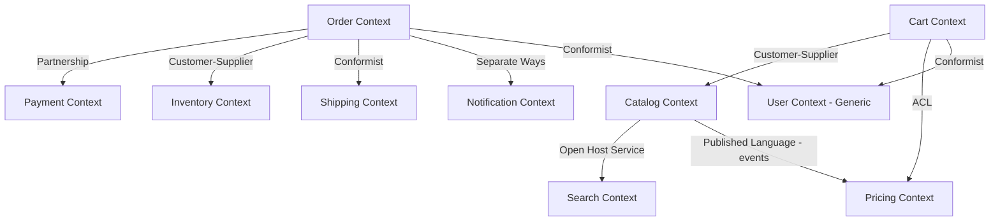
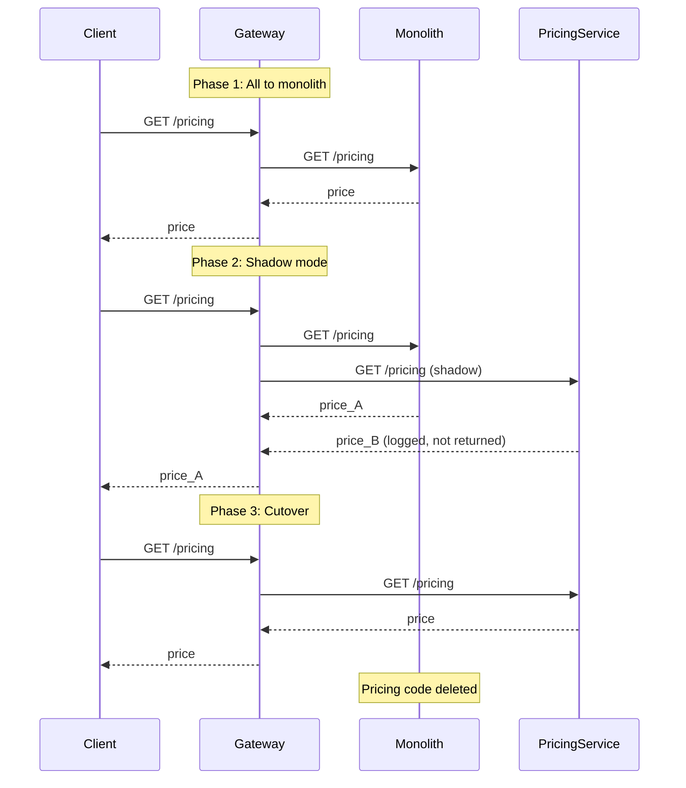
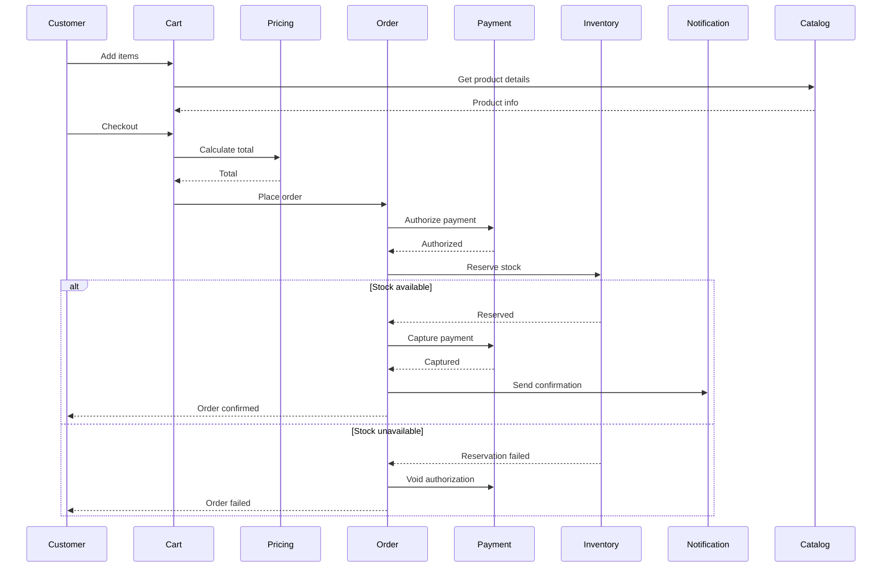

# Phase 1 — Service Design, DDD and Boundaries

> **Weeks:** 5–10 | **Prerequisites:** Phase 0 completed | **Time budget:** 60–80 hrs  
> **You finish this phase able to:**
> - Decompose a domain into bounded contexts using strategic DDD
> - Design service boundaries that minimize coupling and preserve transactional integrity
> - Recognize and avoid distributed monoliths before writing code
> - Run an event storming workshop and extract service candidates
> - Apply context mapping patterns to manage inter-service relationships
> - Justify when NOT to use microservices and defend a modular monolith

## Why this phase exists

Boundaries are the only decision that is expensive to reverse. You can swap frameworks in a quarter, migrate clouds in six months, replace your message broker in a sprint—but fixing a wrong service boundary costs years. Every other architectural choice is a library swap or infrastructure migration. A badly drawn boundary creates permanent coupling, kills independent deployability, forces distributed transactions, and turns your microservices into a distributed monolith that combines all the drawbacks of both architectures.

The industry's 2020–2023 over-adoption of microservices—teams splitting every CRUD entity into a service, creating 80-service estates managed by 8 engineers—has produced a visible correction. Amazon Prime Video's Video Quality Analysis team publicly reported a ~90% infrastructure cost reduction by consolidating one component from distributed Step Functions and microservices into a single scaled process. This was not an indictment of microservices; it was an indictment of applying them where the organizational preconditions did not exist. Boundaries drawn around technical concerns (databases, layers, entities) instead of business capabilities create services that must change together but cannot deploy together—the worst of both worlds.

This phase teaches you to get boundaries right the first time, using Domain-Driven Design to find the natural seams in your business domain, and to recognize when the monolith is the correct answer.

## Mental model

**Microservices are an organizational technique with technical consequences.** You adopt them to buy independent deployability and team autonomy. You pay for it in network latency, data consistency complexity, distributed debugging, and operational overhead. If you do not need the organizational property—if your team is 12 people who sit together and ship twice a week—you are paying the microservices tax for nothing.

**The unit of decomposition is a business capability, not a technical artifact.** A service is not "the thing that manages the User table" or "the REST layer for Product." It is "the capability that handles cart operations" or "the capability that prices an order." Capabilities align with how the business thinks and how teams are organized. Entities and tables are implementation details inside a capability.

**Coupling moves; it does not disappear.** In a monolith, coupling is in-process function calls and shared data structures—easy to refactor, debuggable with a stack trace, guaranteed consistent. In microservices, coupling is network calls, async messages, and eventually-consistent data—harder to refactor, debuggable with distributed traces, consistency guaranteed by nothing. You trade in-process coupling for network coupling. The question is not "how do I eliminate coupling" but "where do I pay for it."

**The modular monolith is the correct default.** For most teams, a well-structured monolith with clear module boundaries, independent build modules, and disciplined dependencies gives you 80% of the benefits (testability, team ownership of a module, understandability) at 20% of the cost. Only when the monolith becomes a deployment bottleneck or teams genuinely need to move at different speeds do you extract services—and you extract them from the monolith's existing modules, which are already isolated.

**Conway's Law is fate.** Your system's structure will mirror your communication structure whether you plan for it or not. If three teams own one service, the service will have three poorly-integrated parts. If one team owns six services, those services will start to couple because the team coordinates them together. Design services to match team boundaries, or redesign teams to match service boundaries, but never let them drift.

## Core concepts

### Monolith vs modular monolith vs SOA vs microservices

| Dimension | Monolith | Modular Monolith | SOA | Microservices | Serverless |
|-----------|----------|------------------|-----|---------------|------------|
| **Deployment unit** | Single process | Single process, modular build | Service per capability, often ESB-mediated | Service per capability, independent | Function per endpoint |
| **Data** | Single database | Single database, modules own schemas | Often shared databases | Database per service | Shared or per-function, often managed |
| **Coupling** | In-process, tight | In-process, enforced module boundaries | Contract-based, often ESB coupling | Contract-based, distributed | Event/API-driven |
| **Failure isolation** | None (one bug kills all) | None (one bug kills all) | Partial (ESB is SPOF) | High (service failure isolated) | Very high (function isolation) |
| **Latency** | Nanoseconds (function call) | Nanoseconds | Milliseconds (network + ESB) | Milliseconds (network) | Milliseconds + cold start |
| **Transaction scope** | ACID across modules | ACID across modules | Distributed, often 2PC | Eventual consistency, saga | Eventual, orchestrator-managed |
| **Ops complexity** | 1 thing to deploy/monitor | 1 thing to deploy/monitor | N services + ESB | N services | N functions + platform |
| **CI/CD** | One pipeline | One pipeline, modular tests | Pipeline per service | Pipeline per service | Pipeline per function or app |
| **Team size fit** | <15 engineers | <30 engineers | 30–100 engineers | 20–200 engineers | Variable, often small teams |
| **Typical refactor cost** | Low (IDE refactor) | Low (module contract enforced) | Medium (contract versioning) | High (distributed refactor) | Medium (event schema evolution) |
| **When to use** | Greenfield, small team, unclear domain | Stable domain, scaling within limits, disciplined team | Legacy integration, heterogeneous systems | Independent team velocity, polyglot needs, scale variance | Unpredictable load, event-driven workloads, minimal ops |
| **Example at scale** | Early startups, internal tools | Shopify (modular monolith core), GitHub | Traditional banks, telecom, government | Netflix, Uber, Amazon retail | Serverless backends, webhooks, cron jobs |

**The modular monolith is underrated.** Shopify's core platform runs as a modular monolith with enforced module boundaries and component ownership. GitHub ships a Rails monolith with clear domain boundaries. Both scale to millions of users. They pay the monolith tax (coordinated deploys, single runtime) but avoid the microservices tax (network, eventual consistency, distributed debugging). When they extract services, they extract them from well-defined modules.

### The microservices tax, itemized

Every microservice you add costs you. Estimate conservatively:

| Cost category | Per-service annual cost (eng hours) | What drives it |
|---------------|-------------------------------------|----------------|
| **Initial development** | 40–80 hrs | Service template, CI/CD pipeline, monitoring setup, initial deploy |
| **Data consistency** | 20–60 hrs/year | Saga implementation, compensating transactions, debugging eventual consistency bugs |
| **Network resilience** | 20–40 hrs/year | Timeouts, retries, circuit breakers, fallback logic, testing failure modes |
| **Distributed debugging** | 40–100 hrs/year | Correlation IDs, distributed tracing, log aggregation, reproducing cross-service issues |
| **Versioning and coordination** | 30–60 hrs/year | Contract evolution, backward compatibility, coordinated rollouts, breaking change migrations |
| **Operational overhead** | 60–120 hrs/year | Monitoring, alerting, runbooks, on-call, incident response, capacity planning, security patching |
| **Environment cost** | 10–30 hrs/year | Compute, managed services, inter-AZ bandwidth, observability platform, service mesh |
| **Test complexity** | 30–60 hrs/year | Contract tests, integration tests, end-to-end tests, test data management |

**Total per service: 250–550 engineering hours per year** after the service is live. At loaded cost, that is $50k–$120k per service per year. A 40-service estate costs 10,000–22,000 engineering hours annually just to keep the lights on. If your team is 10 people (20,000 hours/year), half your capacity is lost to the microservices tax before you write a single feature.

Modular monolith overhead is close to zero: one deploy pipeline, one runtime to monitor, no network, no distributed transactions, no cross-service versioning.

### Preconditions for microservices success

Microservices fail when the prerequisites do not exist. Checklist derived from Martin Fowler, Sam Newman, and hard-won production scars:

- [ ] **Rapid provisioning.** New service from idea to production in <1 day. If provisioning takes a sprint, you will not decompose.
- [ ] **Monitoring baseline.** Centralized logging, distributed tracing, metrics, alerting already working. Adding microservices before observability is malpractice.
- [ ] **Deployment automation.** Zero-touch deploy to production. Manual deploys are a nonstarter with 20+ services.
- [ ] **DevOps culture.** Teams own their services in production. "Throw it over the wall to ops" does not scale.
- [ ] **Mature domain understanding.** You know the business well enough to draw stable boundaries. Greenfield domains with unclear boundaries → modular monolith first, extract later.
- [ ] **Team size >15 engineers.** Below that, coordination cost is low and monolith deploy contention is rare.
- [ ] **Independent team velocity is a requirement.** If all teams ship together anyway, independent deployability buys you nothing.
- [ ] **Engineering discipline.** Teams that cannot maintain module boundaries in a monolith will not maintain service boundaries in microservices.

Missing 3+ of these? Do not go microservices. Missing monitoring or deployment automation? You will fail expensively.

### When NOT to use microservices

Blunt list, based on real failures:

- **Greenfield projects.** You do not know the domain yet. Boundaries you draw in month 2 will be wrong by month 8. Build a modular monolith; extract services when boundaries stabilize.
- **Small teams (<12 engineers).** You cannot afford the operational overhead. One engineer per service for ownership does not work when you have 6 engineers and 15 services.
- **Unclear product-market fit.** You are still pivoting every quarter. Refactoring across service boundaries is much slower than refactoring a monolith.
- **No budget for operational tooling.** If you are self-hosting everything and have no money for observability platforms, the microservices tax will crush you.
- **Simple CRUD apps.** If your app is "forms over database tables," adding network and eventual consistency is pure cost for zero benefit.
- **No dedicated DevOps capacity.** Someone must own the platform. If all engineers are feature engineers, nobody will fix the CI/CD pipeline when it breaks at 2 a.m.
- **Compliance-heavy domains where auditability is hard.** Cross-service audit trails are harder than single-database queries. If you must prove GDPR "right to be forgotten" compliance across 30 services, you added a year to your certification.
- **Because it is trendy.** If the justification is "everyone else is doing it" or "it looks good on a resume," you are adopting microservices for the wrong reason.

**War story composite:** A 10-person startup built 22 microservices for a B2B SaaS product because the tech lead's previous job at a unicorn used microservices. Six months in: shared test database because nobody had time to set up per-service data; deploy took 90 minutes because pipelines were copy-pasted and nobody maintained them; one cross-service feature took 3 weeks because it touched 5 repos and changes had to deploy in sequence. They rewrote it as a modular monolith in a quarter and shipped twice as fast afterward. The lesson: microservices are not a technical pattern; they are an organizational scaling strategy. Use them when you have the organizational scale to justify them.

### Strategic DDD: ubiquitous language

**Plain English:** Every team uses the same words to mean the same things in a specific business context, and different teams can use the same word to mean different things if they are in different contexts.

**Analogy:** In a hospital, "discharge" means releasing a patient to the ER doctor, sending a bill to the billing department, and sending used linens to housekeeping. Same word, completely different meaning depending on which department's context you are in. If you tried to create one unified "discharge" process, it would be incoherent.

**In the real world:** At ShopKart, "Order" means three different things:
- **In the Cart context:** An order is a draft, mutable, not yet paid, can be abandoned. Schema: `user_id`, `items[]`, `last_updated`, no `total` (computed on the fly).
- **In the Order context:** An order is immutable once placed, has a state machine (`pending → confirmed → shipped → delivered`), owns payment/shipping state. Schema: `order_id`, `user_id`, `items[]`, `total`, `payment_status`, `shipping_status`.
- **In the Pricing context:** An order is a calculation input: `items[]`, `user_tier`, `promo_codes[]`. The Pricing context does not care about shipping or payment status; it only cares about computing a price.

If you create a shared "Order" service that tries to represent all three, you get a god object with 40 fields, half of which are null depending on lifecycle stage, and every change to cart logic risks breaking order fulfillment.

**Mechanics:** Ubiquitous language is documented in a glossary per bounded context. When catalog says "Product," the definition is "an item available for purchase, with SKU, title, description, base price." When inventory says "Product," it is "a SKU with a quantity on hand and a reorder threshold." Same term, different models, intentionally. Forcing them into one "Product" entity creates coupling.

**What breaks:** Teams start using database column names or technical jargon ("the DTO," "the entity") in conversations. Business stakeholders and engineers stop understanding each other. Requirements written as "update the Order table" instead of "when a customer confirms their cart." The code stops reflecting how the business thinks, and every change requires translation.

### Bounded contexts and subdomains

**Plain English:** A bounded context is a boundary inside which a particular model is valid and a particular language is used consistently. Outside that boundary, different models and terms apply. A subdomain is a distinct part of the business problem space; a bounded context is how you organize the solution space around it.

**Analogy:** A bank has a "retail banking" desk and a "trading" desk. Both use the word "account." At retail, an account is checking or savings, has a balance, and supports deposits/withdrawals. At trading, an account is a portfolio of positions, has a margin requirement, and supports buy/sell orders. You would never use the same software model for both—they are different bounded contexts even though the word is the same. The subdomains are "retail banking" and "trading"; the bounded contexts are the software models you build to support them.

**In the real world:** ShopKart has these subdomains:
- **Core domain:** Pricing, order fulfillment (the unique competitive value).
- **Supporting domain:** Inventory management, shipping coordination (necessary, not differentiating).
- **Generic domain:** User authentication, notification delivery (buy or use SaaS).

The Pricing bounded context owns pricing rules, discount computation, tax calculation. Its ubiquitous language includes "pricing tier," "promotional campaign," "bulk discount threshold." The Cart bounded context has no concept of pricing rules; it calls Pricing over an API to get a total. Forcing pricing logic into Cart would couple them; extracting pricing into a separate service preserves the boundary.

**Mechanics:** Bounded contexts map to services (or to modules in a modular monolith). Each context has its own data model, persistence, and team ownership. Communication across contexts is via explicit APIs or events, never shared database tables.

**What breaks:** Teams ignore context boundaries and share domain objects across contexts via JSON or ORMs. The "Customer" object has 60 fields because it is used in catalog, cart, order, and support contexts. A change to catalog's customer view breaks order fulfillment. The system is theoretically microservices but behaviorally a distributed monolith.

### Context mapping patterns

How bounded contexts relate to each other:

| Pattern | When it appears | Integration mechanism | Risk |
|---------|----------------|----------------------|------|
| **Partnership** | Two contexts evolve together, mutual dependency | Shared roadmap, joint releases | Coordination overhead; if teams split, partnership breaks |
| **Shared Kernel** | Two contexts share a subset of the domain model | Shared library or database schema | High coupling; any change requires both teams to coordinate |
| **Customer-Supplier** | Downstream depends on upstream; upstream prioritizes downstream needs | API contract, SLA | Downstream blocked if upstream deprioritizes requests |
| **Conformist** | Downstream has no influence; must accept upstream's model | Consume upstream API as-is | Upstream changes break downstream; no negotiation |
| **Anticorruption Layer (ACL)** | Downstream protects itself from upstream's model | Translation layer, adapter | Complexity and translation cost |
| **Open Host Service** | Upstream publishes a stable API for many consumers | Versioned public API | API must be stable; breaking changes are expensive |
| **Published Language** | Standard integration format (e.g., XML, JSON schema, Protobuf) | Schema registry, OpenAPI | Schema evolution discipline required |
| **Separate Ways** | No integration; contexts are independent | None | Duplication; reporting across contexts is hard |
| **Big Ball of Mud** | No clear model; legacy system or rapid prototyping | Whatever works; usually database sharing | Technical debt; refactoring is painful |

ShopKart context map:



**Example:** Cart is a Customer to Catalog (needs product details, title, price), but uses an ACL to Pricing (translates Pricing's complex tier/discount model into a simple "get total for these items" call). Order and Payment are Partners (they must evolve together; payment state is part of order state). Order is a Conformist to Shipping (uses the shipping provider's API as-is, no negotiation). Notification is Separate Ways from everyone (fire-and-forget events; no response expected).

### Tactical DDD: building blocks

**Entity:** An object with an identity that persists over time. Two entities with the same attributes but different IDs are different. Example: two orders with the same items and total are still different orders.

**Value Object:** An object defined by its attributes; no identity. Two value objects with the same attributes are interchangeable. Example: two "Address" objects with the same street/city/postal code are the same address. In modern Java, value objects are records:

```java
// Value object - immutable, defined by equality of fields
public record Address(
    String street,
    String city,
    String postalCode,
    String country
) {
    public Address {
        if (street == null || street.isBlank()) {
            throw new IllegalArgumentException("Street is required");
        }
        // Other validations
    }
}

// Entity - has identity, mutable state
public class Order {
    private final OrderId id;
    private final CustomerId customerId;
    private OrderStatus status;
    private List<OrderLine> lines;
    private Money total;

    // Constructor enforces invariants
    public Order(OrderId id, CustomerId customerId, List<OrderLine> lines) {
        this.id = requireNonNull(id);
        this.customerId = requireNonNull(customerId);
        if (lines == null || lines.isEmpty()) {
            throw new IllegalArgumentException("Order must have at least one line");
        }
        this.lines = new ArrayList<>(lines);
        this.status = OrderStatus.PENDING;
        this.total = calculateTotal();
    }

    // Business method, not setter
    public void confirm() {
        if (status != OrderStatus.PENDING) {
            throw new IllegalStateException("Cannot confirm order in status " + status);
        }
        this.status = OrderStatus.CONFIRMED;
    }

    private Money calculateTotal() {
        return lines.stream()
            .map(OrderLine::subtotal)
            .reduce(Money.ZERO, Money::add);
    }

    // Prevent external mutation
    public List<OrderLine> lines() {
        return List.copyOf(lines);
    }
}
```

**Aggregate:** A cluster of entities and value objects treated as a single unit for data consistency. One entity is the aggregate root; all access goes through it. Example: `Order` is the aggregate root; `OrderLine` is an entity inside the aggregate. You cannot modify an `OrderLine` directly; you call `order.addLine()` or `order.removeLine()`, and the Order enforces invariants ("order total must match sum of lines").

**Invariant:** A rule that must always be true. Example: an order's total must equal the sum of its lines; an order cannot have zero lines; a confirmed order cannot be modified. The aggregate root enforces invariants.

**Domain Event:** A record of something that happened. Example: `OrderPlaced`, `PaymentReceived`, `OrderShipped`. Events are immutable, past-tense, and represent business facts. Other contexts subscribe to events to react.

**Repository:** Abstracts persistence. The domain layer calls `orderRepository.save(order)` without knowing if the data is in PostgreSQL, MongoDB, or a test fake. Repository interface lives in the domain layer; implementation lives in infrastructure.

**Domain Service:** Stateless operation that does not belong to a single entity. Example: `PricingService.calculateTotal(items, customer)`. Use sparingly; most logic belongs in entities or aggregates.

**Application Service:** Orchestrates use cases. Example: `PlaceOrderService` loads the cart, validates inventory, calls pricing, creates the order, publishes the `OrderPlaced` event. Application services are thin; domain logic stays in aggregates.

### Aggregate design rules (MANDATORY)

- **Small aggregates.** One root entity and a few value objects or child entities. Large aggregates kill performance (whole aggregate loads on every access) and create contention (concurrent updates conflict).
- **Reference other aggregates by ID only.** Do not embed a `Customer` object inside `Order`; store `customerId`. If you need customer details, load them separately or denormalize what you need into the Order context.
- **One aggregate per transaction.** Modifying two aggregates in one ACID transaction couples them. Use eventual consistency and saga patterns instead.
- **Enforce invariants within the aggregate boundary.** An order can enforce "total = sum of lines," but it cannot enforce "inventory quantity must not go negative"—that is a different aggregate. Use domain events to coordinate: `OrderPlaced` → Inventory reserves stock → if reservation fails → compensating transaction.

**What breaks:** Aggregates that span multiple services. Aggregates with dozens of entities (loading 50 rows to change 1 field). Aggregates that reference each other directly (Order contains Customer, Customer contains Orders → circular dependency, eager loading everything). Transactions that lock multiple aggregates (performance cliff, distributed deadlock risk).

### Domain events vs integration events

**Domain event:** Internal to a bounded context. Reflects a state change in the domain model. Example: `OrderLineAdded`, `DiscountApplied`, `OrderCancelled`. Published on an internal event bus (could be in-memory). Schema is unstable; it changes as the domain evolves. May contain internal details (user IDs, internal state). Consumers are within the same context or closely coupled contexts.

**Integration event:** Published across bounded contexts. Represents a fact that other contexts care about. Example: `OrderPlaced`, `PaymentCompleted`, `ShipmentDispatched`. Published to a message broker (Kafka, RabbitMQ). Schema is stable and versioned; breaking changes are expensive. Scrubbed of internal details (no internal IDs, no PII unless explicitly needed). Consumers are independent services.

**Critical distinction:** Do not leak domain events as integration events. `OrderLineAdded` is not interesting to Shipping; only `OrderPlaced` is. Publishing every domain event externally creates tight coupling: internal refactorings break consumers. Integration events are a public API; treat schema changes like API versioning.

**In practice:** Domain events trigger side effects within the aggregate or context. Integration events are derived from domain events: when `OrderConfirmed` (domain event) fires, the Order service publishes `OrderPlaced` (integration event) to Kafka. The integration event has a stable schema (`order_id`, `customer_id`, `total`, `items[]`); the domain event might have additional internal fields (`version`, `applied_discounts[]`).

### Event storming

**How to run the workshop:**

**Materials:** Large wall or whiteboard, sticky notes in five colors (orange = domain event, blue = command, yellow = actor/external system, pink = policy/reaction, purple = aggregate/system), markers, 3-hour time box.

**Participants:** Domain experts (product, support, operations), engineers, no more than 12 people. Non-technical people must be present—they know the business.

**Sequence:**

1. **Chaotic exploration (45 min):** Everyone writes domain events (orange sticky notes, past tense) and places them on the wall in rough chronological order. No structure, no facilitation, just brain dump. Go broad. Example events: "User registered," "Cart created," "Item added to cart," "Order placed," "Payment authorized," "Order confirmed," "Shipment dispatched."

2. **Enforce timeline (30 min):** Group debates and reorders events into a coherent timeline. Duplicate events (multiple people wrote "Order placed") get consolidated. Missing steps get added. Arrows show cause-and-effect.

3. **Identify commands and actors (30 min):** For each event, what command caused it? Who (or what system) issued the command? Blue sticky: "Place order" command. Yellow: "Customer" actor.

4. **Identify policies (20 min):** Pink sticky notes for "whenever X happens, do Y." Example: "Whenever OrderPlaced, reserve inventory." "Whenever PaymentFailed, cancel order." These are saga steps.

5. **Draw boundaries (30 min):** Look for clusters of events that are tightly related and loosely coupled to others. Draw boxes around them. These are candidate bounded contexts. Example: Cart context (CartCreated, ItemAdded, ItemRemoved, CartAbandoned, CartCheckedOut) is separate from Order context (OrderPlaced, OrderConfirmed, OrderShipped, OrderDelivered).

6. **Identify aggregates (20 min):** Purple sticky notes for the aggregate roots. In the Cart context: `Cart` aggregate. In the Order context: `Order` aggregate.

7. **Hotspots (15 min):** Red sticky notes for areas of confusion, disagreement, or risk. Example: "What happens if payment succeeds but inventory reservation fails?" These become design spikes.

**Outputs:** A visual timeline of the business process, candidate bounded contexts, aggregate roots, domain events, commands, actors, policies. Photograph it. Translate it to a Mermaid diagram and service candidates.

**Caution:** Event storming discovers the domain; it does not design the implementation. The contexts you identify are starting points, not final architecture. Validate them with code.

### Decomposition strategies

**By business capability (BEST DEFAULT):** Each service owns a capability the business understands. Catalog manages product listings. Pricing calculates prices. Order handles order lifecycle. Cart manages shopping carts. Aligns with how business stakeholders talk. Stable boundaries (capabilities change slowly). Team ownership is clear (the Pricing team owns the Pricing service).

**By subdomain (DDD ALIGNMENT):** Core domain gets its own service (or multiple services if large). Supporting domains are separate. Generic domains are SaaS or shared services. Focuses investment on the differentiator.

**By data cohesion (TECHNICAL):** Things that change together stay together. If every pricing change also requires a catalog change, they are coupled; consider merging them or rethinking the boundary. Risk: focuses on current coupling, ignores future evolution.

**By volatility:** High-change areas separate from stable areas. Pricing rules change weekly; user authentication changes yearly. Separate them so you can deploy pricing changes without touching auth. Risk: volatility can shift; yesterday's stable code is today's hotspot.

**By team ownership:** One team, one service. Conway's Law compliance. Risk: forces organizational structure to drive technical structure, which may not match domain boundaries.

**By non-functional isolation:** Separate services with different scaling, compliance, or performance profiles. The Catalog service needs CDN and read scaling; the Order service needs strong consistency and write throughput. Pricing is CPU-bound; Notification is I/O-bound. Risk: premature optimization; start with functional boundaries, split later if NFRs diverge.

**By transactional boundary:** Put things that must be ACID-consistent in the same service. Order and OrderLine must be in the same transaction, so they are in the same service. Inventory reservation and order placement are eventually consistent, so they can be separate services. Risk: trying to preserve ACID across too much scope forces a monolith.

**Decision rubric:**

| Boundary driver | When to prioritize | Signal | Anti-signal |
|----------------|-------------------|--------|-------------|
| Business capability | Default | Clear capability map, stable business language | Capabilities overlap heavily |
| Subdomain (core/support/generic) | Resource allocation | Know what is differentiating | Every subdomain is "core" |
| Data cohesion | High coupling pain | 80% of changes touch services A+B together | Coupling is low but will grow |
| Volatility | Frequent deploy conflicts | Pricing changes 2x/week, auth changes 1x/quarter | Volatility uniform across domain |
| Team ownership | Conway's Law mismatch | Teams stepping on each other | Team structure is flux |
| Non-functional isolation | Proven bottleneck | Catalog needs 100x more read capacity than order | Premature; no measurement |
| Transactional boundary | Complex consistency requirements | Multi-step workflows with rollback | Everything is "eventually consistent" hand-wave |

Start with business capability. Validate with data cohesion. Adjust for team ownership. Split for non-functional isolation only after measurement proves need.

### Service sizing

**Reject LOC heuristics.** "A service should be 500–1000 lines" is nonsense. A service handling complex pricing rules might be 3,000 lines. A service that proxies to a third-party API might be 150 lines.

**Right size = the team test:** One team (4–8 engineers) can own, understand, and operate the service. They can explain the whole domain model in 30 minutes. They can estimate any change. They can respond to a 3 a.m. page without escalating.

**Right size = the rewrite test:** You could rewrite it from scratch in 2–4 weeks. If a rewrite would take a quarter, the service is too big. If a rewrite would take a day, the service is too small.

**Right size = the aggregate test:** One primary aggregate or one primary capability. The Order service owns the Order aggregate. The Cart service owns the Cart aggregate. The Pricing service owns pricing calculation. If a service owns three unrelated aggregates, it is too big.

**Nanoservices (TOO SMALL):** 10-line functions deployed as services. Example: a "ValidateEmail" service that calls a regex. The operational overhead (monitoring, deployment, versioning) exceeds the value. Nanoservices are a code smell: insufficient decomposition thought, fear of in-process calls, resume-driven development. Guideline: if the service does not own meaningful state or enforce business rules, it should be a library, not a service.

**Warning signals:** A service with >5 domain aggregates. A service that takes >1 hour to explain to a new engineer. A service where a simple change estimate is "unknown." A service that has not been rewritten because "too much tribal knowledge."

### Coupling taxonomy

**Afferent coupling (fan-in):** How many other services depend on this service. High afferent coupling = many consumers = changes are expensive. Catalog service has high afferent coupling (Cart, Order, Pricing all call it). Pricing service has medium afferent coupling (Cart and Order call it).

**Efferent coupling (fan-out):** How many other services this service depends on. High efferent coupling = fragile to upstream changes. Order service has high efferent coupling (calls Catalog, Pricing, Inventory, Payment, Shipping). Cart service has low efferent coupling (only calls Catalog).

**Temporal coupling:** Service A must call Service B before calling Service C. Example: must call Pricing before Order. Temporal coupling is often a sign of a missing aggregate or a workflow that should be a saga.

**Deployment coupling:** Services that must deploy together. If deploying Cart requires deploying Pricing in the same release window, they are deployment-coupled—a distributed monolith symptom.

**Data coupling:** Services that share a database, read each other's tables, or pass large data structures around. High data coupling destroys independent deployability.

**Semantic coupling:** Service A depends on Service B's internal behavior, not its contract. Example: A relies on B returning results in a specific order, or on B always returning within 100ms, even though the API spec does not guarantee it. Semantic coupling is invisible and breaks during refactoring.

**Connascence (advanced lens):** Measures the strength and scope of coupling.
- **Connascence of Name:** Two components must agree on a name (e.g., API field name). Low cost; easy to refactor.
- **Connascence of Type:** Must agree on a data type. Medium cost.
- **Connascence of Meaning:** Must agree on the interpretation of a value (e.g., status code 1 = "pending"). Higher cost; fragile.
- **Connascence of Position:** Must agree on argument order. High cost; positional parameters are fragile.
- **Connascence of Timing:** Must execute in a specific order. Very high cost; temporal coupling.

**Cohesion:** How closely related the responsibilities within a service are. High cohesion = all the code in the service is working toward the same goal. Low cohesion = the service is a grab bag of unrelated functions. Aim for high cohesion within services, low coupling between services.

**How to measure coupling in production:**

| Coupling type | Measurement | Red flag threshold |
|--------------|-------------|-------------------|
| Afferent | Count inbound calls (from tracing) | >10 consumers for a service |
| Efferent | Count outbound calls | >5 dependencies |
| Deployment | Track releases; flag if 2+ services deploy together >50% of the time | Any pair always deploying together |
| Data | Static analysis: cross-service SQL queries, shared table access | Any cross-service table read |
| Temporal | Distributed traces showing call chains >3 hops | >50% of requests are >3 hops |
| Semantic | Incidents where a "compatible" change broke a consumer | >1 incident/quarter |

### Distributed monolith: detection checklist

You have a distributed monolith if ANY of the following are true:

- [ ] **Must deploy services together.** Deploying Service A requires deploying Service B in the same release window or the system breaks.
- [ ] **Shared database or shared domain library.** Services read/write each other's tables, or share a JAR with domain entities that couples them.
- [ ] **Synchronous call chains >3 deep.** User request → Service A → Service B → Service C → Service D. Latency is additive, availability is multiplicative (each hop at 99.9% → 4 hops = 99.6% availability).
- [ ] **One change touches 5+ repos.** Adding a field to "Customer" requires changes in Catalog, Cart, Order, Notification, User Profile services.
- [ ] **Distributed transactions or orchestrated sagas everywhere.** Every operation is a multi-service saga with compensating transactions. You traded ACID for complexity but gained no independence.
- [ ] **Shared release train.** All services release together on a schedule because coordinating independent releases is too hard.
- [ ] **No team can ship without coordinating with 3+ other teams.** Product teams are blocked on platform teams, who are blocked on other platform teams.
- [ ] **Re-creating the monolith's coupling in network calls.** The same tight coupling exists; it is just slower and harder to debug now.

**Smell → measurement:**

| Smell | Measure | Target |
|-------|---------|--------|
| Coordinated deploys | % of releases that include >1 service | <20% |
| Synchronous chains | p99 call chain depth (from tracing) | ≤2 |
| Shared data | % of services accessing same DB schema | 0% |
| Change fan-out | Changes per repo per feature (from git history) | ≤2 |
| Deploy frequency | Deploys per service per week | ≥5 (independent velocity) |

If you are failing these metrics, you have the worst of both worlds: monolith's coupling + microservices' complexity. Fix: consolidate back to a modular monolith, or re-draw boundaries properly.

## Production patterns

### Strangler Fig (incremental extraction)

**What:** Incrementally replace a monolith by routing new features to new services and gradually migrating old features. Named after strangler fig vines that grow around a tree and eventually replace it. Anti-pattern: "rewrite the monolith in 18 months" (fails 80% of the time).

**When to use:** Legacy monolith, unclear boundaries, cannot afford a big-bang rewrite, need to ship features during migration.

**When NOT to use:** Greenfield (nothing to strangle). Monolith is working fine and boundaries are stable (do not microservice for the sake of it). Team is too small to operate both monolith and services simultaneously.

**Mechanics:**

1. **Routing layer:** Add a proxy (Spring Cloud Gateway, Envoy, nginx) in front of the monolith. Initially, all traffic goes to the monolith.
2. **Extract one capability:** Pick a bounded context (e.g., Pricing). Build a new Pricing service. Dual-write: monolith writes to both its own DB and the Pricing service's DB (or publish events that Pricing consumes).
3. **Shadow mode:** Route reads to the new service but ignore the result; compare with monolith's result; log discrepancies. Fix bugs.
4. **Cutover:** Route production reads to the new service. Monitor. Roll back if needed.
5. **Remove monolith code:** Once stable, delete the pricing code from the monolith and stop dual-writes.
6. **Repeat:** Next capability.



**Failure modes:** Dual-write inconsistencies (monolith and service diverge; one write succeeds, the other fails). Shadow mode never ends (teams lose confidence and keep comparing forever). Routing logic becomes a tangled mess (10 rules for 10 services). Forgot to migrate background jobs (cron jobs still run in the monolith, bypassing the service).

**Code example (Spring Cloud Gateway routing):**

```yaml
spring:
  cloud:
    gateway:
      routes:
        - id: pricing-service
          uri: http://pricing-service:8080
          predicates:
            - Path=/api/pricing/**
          filters:
            - StripPrefix=2
        - id: monolith-fallback
          uri: http://legacy-monolith:8080
          predicates:
            - Path=/**
          order: 1000  # Lowest priority
```

### Branch by Abstraction

**What:** Incrementally replace a component inside the monolith by creating an abstraction, routing through it, building a new implementation, and cutting over. Similar to Strangler Fig but internal to the codebase.

**When to use:** Replacing a large module or framework (e.g., swapping ORMs, replacing a payment gateway integration) without a feature freeze.

**When NOT to use:** Small, isolated changes (just refactor directly). Need to ship the change quickly (branch by abstraction is incremental, takes weeks).

**Mechanics:**

1. **Create abstraction:** Define an interface for the component you are replacing. Example: `PricingEngine` interface.
2. **Implement adapter for existing code:** Wrap the old implementation in the interface.
3. **Route all calls through the abstraction:** Refactor call sites to use the interface, not the concrete class.
4. **Build new implementation:** Implement the interface with the new approach.
5. **Feature flag cutover:** Use a feature flag to switch between old and new implementations at runtime. Start with 1% traffic, ramp to 100%.
6. **Delete old implementation:** Once stable, remove the old code and the abstraction (if it was only for migration).

**Failure modes:** Abstraction is leaky (new implementation cannot satisfy the old interface's semantics). Feature flag stays in the code forever (technical debt). Old implementation has side effects the abstraction did not capture.

### Anticorruption Layer (ACL)

**What:** A translation layer that protects your domain model from an external system's model. Converts the external system's API or data format into your ubiquitous language.

**When to use:** Consuming a legacy API, third-party service, or another bounded context with a model you do not control. You do not want external changes to ripple through your codebase.

**When NOT to use:** You control both sides of the integration. The external model is clean and matches your needs.

**Mechanics:** Build an adapter or facade that calls the external API, translates its response into your domain objects, and returns those. The rest of your application never sees the external model.

**Example:** Cart service calls Pricing service. Pricing returns `{"tier_id": 3, "base_price": 1000, "discount_percent": 15, "final_price": 850}`. Cart's domain model does not care about tier IDs or discount percentages; it only needs the final price. ACL:

```java
// External model (Pricing service's API)
record PricingResponse(int tierId, BigDecimal basePrice, BigDecimal discountPercent, BigDecimal finalPrice) {}

// Internal domain model (Cart context)
public record CartTotal(Money amount) {}

// ACL - translates external to internal
@Component
public class PricingServiceAdapter {
    private final WebClient pricingClient;

    public CartTotal calculateTotal(List<CartItem> items) {
        var request = new PricingRequest(items.stream()
            .map(item -> new PricingLineItem(item.sku(), item.quantity()))
            .toList());

        PricingResponse response = pricingClient.post()
            .uri("/calculate")
            .bodyValue(request)
            .retrieve()
            .bodyToMono(PricingResponse.class)
            .block();

        // Translation happens here - internal code never sees tierId or discountPercent
        return new CartTotal(Money.of(response.finalPrice(), "USD"));
    }
}
```

If Pricing changes its API to add a `tax_included` boolean, the ACL absorbs the change; Cart code is unaffected.

**Failure modes:** ACL becomes a dumping ground for business logic (mixing translation with domain rules). Translation is incomplete (ACL passes through some external types, polluting the domain). ACL has no tests (refactoring the external integration breaks the domain).

### Open Host Service + Published Language

**What:** An upstream service publishes a stable, versioned API designed for multiple consumers. Paired with a published language (a well-documented schema, often OpenAPI or Protobuf).

**When to use:** One service has many consumers (Catalog has 8 consumers). Consumers have different needs (Catalog must support search, cart, pricing, recommendations). Need to evolve the API without breaking consumers.

**When NOT to use:** One-to-one integration (use customer-supplier). Consumers are tightly coupled anyway (they are in the same team; just coordinate).

**Mechanics:** Define the API contract (OpenAPI spec, Protobuf schema). Version it (`/v1/products`, `/v2/products`). Maintain backward compatibility within a version. Publish changelog and deprecation notices. Consumers can upgrade on their schedule.

**Failure modes:** Too many versions (maintaining v1, v2, v3, v4 forever). Breaking changes without versioning (consumers break). No deprecation policy (old versions never die).

### Service template / Paved road

**What:** A pre-configured project template that includes CI/CD, observability, security, and common libraries. New services are created from the template, not from scratch.

**When to use:** More than 5 services. Want consistency (every service has the same logging, metrics, health checks). Want to reduce toil (engineers should not configure Jenkins pipelines 10 times).

**When NOT to use:** Fewer than 5 services (overhead exceeds value). Polyglot organization (templates are language-specific).

**Mechanics:** Maintain a Git repo with the template. Include `pom.xml` or `build.gradle.kts` with standard dependencies, `application.yaml` with observability config, `Dockerfile`, Kubernetes manifests, `.gitlab-ci.yml` or `Jenkinsfile`, and README. Developers run `cookiecutter` or `git clone`, fill in service name and domain, and have a deployable service in 20 minutes.

**Example (Spring Boot template structure):**

```
spring-boot-service-template/
├── pom.xml                    # Spring Boot 4.1, Micrometer Tracing, Resilience4j
├── src/main/java/com/shopkart/template/
│   ├── TemplateApplication.java
│   ├── config/
│   │   ├── ObservabilityConfig.java   # OTLP tracing, metrics
│   │   └── SecurityConfig.java         # OAuth2 resource server
│   └── api/
│       └── HealthController.java       # Readiness/liveness
├── src/main/resources/
│   └── application.yaml       # Defaults: port 8080, actuator, logging
├── Dockerfile                 # Multi-stage build, GraalVM native optional
├── k8s/
│   ├── deployment.yaml
│   ├── service.yaml
│   └── ingress.yaml
├── .github/workflows/ci.yaml  # Build, test, scan, deploy
└── README.md                  # How to use the template
```

**Failure modes:** Template diverges from production reality (teams fork and customize; now you have 10 different templates). Template is too opinionated (forces choices teams do not need). Template is too bare (teams still write 80% of the boilerplate).

### Self-contained systems (SCS)

**What:** Services that own their UI, business logic, and data. Each service can render its own HTML, not just APIs. Used in e-commerce for modular frontends.

**When to use:** Customer-facing web apps where different teams own different parts of the page. Example: ShopKart homepage (Search team owns search bar, Catalog team owns product grid, Recommendations team owns "you may like" widget).

**When NOT to use:** SPA or mobile app (backend-for-frontend is a better pattern). Strong consistency requirements across systems.

**Mechanics:** Each service has a web controller that returns HTML fragments or full pages. A composition layer (ESI, SSI, or client-side with iframes) assembles them. Services communicate asynchronously.

**Failure modes:** Page composition is slow (serial fetches). Styling inconsistency (each team has its own CSS). Shared state is painful (shopping cart state shared across 3 systems).

### Sidecar for cross-cutting concerns

**What:** A helper process deployed alongside your service that handles concerns like logging, metrics, tracing, mTLS, retries. Examples: Envoy sidecar, Istio sidecar, Datadog agent.

**When to use:** Service mesh (Istio, Linkerd). Polyglot environment (sidecar abstracts language differences). Uniform policy enforcement (mTLS everywhere).

**When NOT to use:** Small deployment (5 services; sidecar overhead is ~50MB RAM per pod, not worth it). Sidecarless alternatives exist (Istio ambient, Cilium).

**Failure modes:** Sidecar version skew (service is updated, sidecar is not). Sidecar bugs (proxy crash kills traffic). Operational complexity (now you patch two things per pod).

**Note on 2026 trends:** Sidecarless meshes (Istio ambient, Cilium/eBPF) reduce per-pod overhead by moving L7 proxying to shared nodes. Sidecars still used for app-specific filtering (e.g., custom auth).

### API composition vs data duplication

**When to show a customer's order history with product details:**

**API composition:** Order service returns orders with `sku` IDs. API gateway or BFF calls Catalog service to enrich with product titles and images. Compose the response.
- **Pros:** No data duplication. Catalog changes propagate immediately.
- **Cons:** Latency (two network calls). Availability (if Catalog is down, order history is broken). Complex error handling (what if 1 of 20 products fails to load?).

**Data duplication (denormalization):** Order service stores `sku`, `product_title`, `product_image_url` at order-placement time. No runtime call to Catalog.
- **Pros:** Fast (one query). High availability (Order service is independent). Simple.
- **Cons:** Stale data (product title changes; old orders show old title). Duplication (same product info in many orders). Storage cost.

**Decision:** Denormalize data that is immutable or snapshot-at-time (order line items capture product details at purchase time; who cares if the title changes later?). Compose data that is live (current inventory quantity; must be fresh).

### Outbox pattern for integration events

**Problem:** You want to update your database and publish an event to Kafka atomically. If you update the DB and then call `kafkaProducer.send()`, and the send fails, you have inconsistent state.

**Solution:** Write the event to an "outbox" table in the same transaction as your business data. A background poller or CDC tool reads the outbox and publishes to Kafka.

**Code (transaction with outbox):**

```java
@Transactional
public void placeOrder(PlaceOrderCommand cmd) {
    // Business logic
    Order order = new Order(cmd.customerId(), cmd.items());
    orderRepository.save(order);

    // Write integration event to outbox table in same transaction
    IntegrationEvent event = new OrderPlacedEvent(
        order.id(),
        order.customerId(),
        order.total(),
        order.items()
    );
    outboxRepository.save(new OutboxEntry(
        UUID.randomUUID(),
        "order.placed",
        objectMapper.writeValueAsString(event),
        Instant.now()
    ));
    // Commit → order and event are durable together
}

// Separate process (poller or CDC)
@Scheduled(fixedDelay = 1000)
public void publishOutboxEvents() {
    List<OutboxEntry> pending = outboxRepository.findUnpublished(limit = 100);
    for (OutboxEntry entry : pending) {
        kafkaTemplate.send("order-events", entry.payload());
        outboxRepository.markPublished(entry.id());
    }
}
```

**Failure modes:** Poller stops (events stuck in outbox; alerts needed). Duplicate publish (poller retries; consumers must be idempotent). Outbox table grows unbounded (need retention policy).

**When NOT to use:** Synchronous APIs (outbox is for async). Small systems where exactly-once is not critical.

### Worked ShopKart decomposition

**Candidate services:**

1. **Catalog**: Owns product listings (SKU, title, description, category, base price). Read-heavy. Cache-friendly. Published Language API for other services. Bounded context: "things we sell."
2. **Search**: Owns search index (Elasticsearch). Consumes `ProductCreated` / `ProductUpdated` events from Catalog. Separate because search is a different query model (faceted search, fuzzy matching, relevance scoring). Could be in Catalog, but split because different scaling profile.
3. **Cart**: Owns shopping cart (draft order). Mutable, session-bound. Calls Catalog for product details (Conformist). Calls Pricing for total (ACL). Bounded context: "customer's intent to buy."
4. **Pricing**: Owns pricing rules, discounts, tax calculation. Core domain (differentiator). Complex logic (tiered pricing, bulk discounts, geo-specific taxes). Stateless (calculates on demand; no event sourcing needed). Bounded context: "how much does this cost."
5. **Order**: Owns order lifecycle (pending → confirmed → shipped → delivered). Coordinates payment, inventory, shipping via saga. Immutable once confirmed. Bounded context: "committed purchase."
6. **Payment**: Owns payment transactions, retries, refunds. Integrates with Stripe/PayPal/etc. High compliance requirements (PCI DSS). Separate because non-functional isolation (security, auditing). Bounded context: "moving money."
7. **Inventory**: Owns stock quantities, reservations. Supporting domain. Eventual consistency with Order (reservation can fail; saga compensates). Bounded context: "what we have to sell."
8. **Shipping**: Owns shipment tracking, carrier integration. Conformist to third-party APIs (FedEx, UPS). Bounded context: "getting it to the customer."
9. **Notification**: Sends emails, SMS, push notifications. Generic domain (could be SaaS, but in-house for template customization). Fire-and-forget events (Separate Ways). Bounded context: "telling the customer what happened."
10. **User**: Authentication, authorization, profile. Generic domain (could use Auth0, but in-house for regulatory reasons). Bounded context: "who the customer is."

**Why each exists:**
- **Catalog, Search**: Different read models (relational vs search index), different scaling.
- **Cart, Order**: Different lifecycles (mutable vs immutable), different invariants.
- **Pricing**: Core domain, complex rules, high change frequency.
- **Payment, Shipping**: Non-functional isolation (compliance, third-party integration).
- **Inventory**: Supporting domain, eventual consistency boundary.
- **Notification**: Generic, asynchronous, no business logic.
- **User**: Generic, shared across all contexts.

**What each does NOT own:**
- **Catalog** does not calculate prices (Pricing owns that). Does not track inventory (Inventory owns that).
- **Cart** does not store product details (fetches from Catalog). Does not confirm orders (Order owns that).
- **Pricing** does not persist historical prices per order (Order denormalizes at placement time).
- **Order** does not process payments (Payment owns that). Does not track inventory (Inventory owns that).

**Boundaries a novice would get wrong:**

1. **Shared "Customer" service**: Tempting to create one service for all customer data (profile, preferences, addresses, order history, cart, payment methods). This becomes a god service with high afferent coupling (10 consumers) and low cohesion. Fix: User service owns authentication/profile; Cart owns cart; Order owns order history; Payment owns payment methods. Denormalize what you need (`customer_name` in Order, `customer_id` in Cart).

2. **Pricing inside Catalog**: "The product has a price, so Catalog should return it." Wrong. Pricing is a complex capability (tiered pricing, geo-specific taxes, time-based promotions, customer-specific discounts). Mixing it into Catalog couples product management (slow-changing) with pricing strategy (fast-changing). Fix: Catalog returns `base_price` (informational); Pricing calculates `final_price` at cart/order time.

**Service interaction example (place order):**



This is a saga. Each service is independent. No distributed transaction. Compensating actions if any step fails.


## How big tech does it

**Amazon: Two-pizza teams and the API mandate**

Amazon organized around "two-pizza teams" (6-10 people) starting in the early 2000s. The 2002 Bezos API mandate required all teams to expose data and functionality through service interfaces, communicate only through these interfaces (no backdoor access to another team's database), and design interfaces that could be externalized. This forced service boundaries and ownership.

"You build it, you run it" culture: teams own their services in production, carry pagers, write runbooks, respond to incidents. Operational responsibility drives quality.

**Transferable lesson:** Service ownership and operational accountability are non-negotiable. Teams that do not own production will not maintain quality or invest in reliability.

**Scale caveat:** Works with 50,000+ engineers and massive platform investment (service templates, deployment automation, observability). A 10-person startup cannot replicate the platform, but can replicate the ownership culture.

**Netflix: From monolith to 1000+ services post-database incident**

Netflix's 2008 database corruption incident (3-day outage) drove their migration from on-premise data center to AWS and from monolith to microservices (2009-2016). By 2020, ~1000 microservices. Heavy investment in open-source observability (Atlas, Mantis) and chaos engineering (Chaos Monkey, Simian Army) because microservices fail.

Eureka for service discovery (now legacy; Kubernetes-native discovery preferred for greenfield). Hystrix for circuit breaking (deprecated 2018; Resilience4j is the modern replacement). Built their own service mesh before Istio existed.

**Transferable lesson:** Observability and failure resilience are prerequisites, not afterthoughts. If you cannot debug distributed systems or tolerate partial failures, do not adopt microservices.

**Scale caveat:** ~1000 services with ~1000 engineers. Built custom tooling. Not replicable at small scale.

**Uber: DOMA as a correction to over-decomposition**

Uber migrated from a Python/Node.js monolith to microservices (2014-2016) to support hypergrowth (500 to 5,000 engineers). By 2018, thousands of services—many too granular, organizationally misaligned, or technically coupled.

DOMA (Domain-Oriented Microservice Architecture, announced 2020) consolidated to hundreds of domain-aligned services. Services grouped by business domain (mapping, dispatch, pricing, payments), not technical function. Gateway services provide domain-level APIs; lower layers are internal.

**Transferable lesson:** Over-decomposition is real. If you have thousands of services with a few hundred engineers, or if most changes touch 5+ repos, you over-decomposed. Consolidate around domain boundaries.

**Scale caveat:** 5,000+ engineers. The problem was organizational complexity (too many teams, unclear ownership), not technical. Small teams should not decompose this aggressively.

**Monzo: 1500 Go microservices with heavy platform investment**

Monzo (UK neobank) runs ~1500 microservices (Go, Kubernetes). Extreme decomposition enabled by extreme platform investment: service templates provision a new service in <1 hour, uniform observability (Prometheus, Jaeger), deployment automation, service mesh (Linkerd), schema registry, strong API contracts.

Platform team of ~50 engineers supports ~1000 engineers. Heavy emphasis on golden paths: standard patterns that teams should follow.

**Transferable lesson:** Service proliferation requires platform maturity. If you cannot provision and operate a new service in <1 day, you do not have the platform to support many services.

**Scale caveat:** 1000 engineers, 50-person platform team, venture-backed budget for tooling. A bootstrapped startup with 20 engineers should not attempt this.

**Airbnb: SOA with Viaduct and GraphQL unified data layer**

Airbnb migrated from a Rails monolith to service-oriented architecture (2015-2020). Hundreds of backend services (Java, Ruby). Viaduct (internal GraphQL gateway) provides a unified API for frontends, abstracting service complexity. Frontend teams query one GraphQL endpoint; Viaduct fans out to backend services, composes responses.

**Transferable lesson:** API gateway or Backend-for-Frontend pattern for complex service topologies. Frontends should not know about 50 backend services; the gateway abstracts that.

**Scale caveat:** 5,000+ engineers. GraphQL requires schema governance, federation, and dedicated gateway teams. Small teams should use simpler API composition.

**Shopify: Deliberate modular monolith**

Shopify's core platform is a Rails monolith with enforced module boundaries (Packwerk gem). Components own slices of the domain; dependencies are explicit and enforced. Extracted services only where scaling or compliance required it: checkout (high traffic), payments (PCI compliance), fulfillment (external integrations).

2022 blog post: "We are not anti-microservices; we are anti-unnecessary-microservices." Modular monolith scales to billions in GMV and millions of merchants.

**Transferable lesson:** Modular monolith is a valid architecture at scale. Extract services when forced by non-functional requirements, not as default. Module boundaries can be as strong as service boundaries if enforced by tooling.

**Scale caveat:** Requires discipline. Packwerk enforces boundaries; without enforcement, modules degrade into big ball of mud.

**Segment: "Goodbye Microservices" consolidation**

Segment (customer data platform) built microservices early (2015-2018). By 2020, small team (~30 engineers) operating dozens of services. High operational overhead, slow feature velocity, coordination cost exceeded value.

2020 public blog post: "Goodbye Microservices: From 100s of problem children to 1 superstar." Consolidated to a modular monolith. Deployment time dropped from hours to minutes. Feature velocity doubled.

**Transferable lesson:** Microservices tax exceeds value for small teams. The threshold is organizational, not technical. If coordination overhead exceeds independence gains, consolidate.

**Scale caveat:** Reversed at 30 engineers. Many companies successfully adopt microservices at 100+ engineers. The lesson is not "never microservices," but "size to team."

**Amazon Prime Video: Audio/video monitoring consolidation**

Prime Video's Video Quality Analysis team (2023 blog post) moved one component from distributed Step Functions orchestration + Lambda microservices to a monolithic process running on ECS. Reported ~90% infrastructure cost reduction for that component (fewer Lambda invocations, less inter-service data transfer, less S3 I/O).

**Critical nuance:** ONE component (CPU-bound video analysis), not Prime Video as a whole. Most of Prime Video remains microservices. The lesson is per-component optimization, not a company-wide reversal.

**Transferable lesson:** Optimize per-component based on actual workload characteristics. CPU-bound batch processing in a single scaled-out process can be cheaper than distributed coordination. Not every component needs microservices.

**Scale caveat:** Specific to video processing workloads. Not generalizable to request/response APIs or event-driven workflows.

**Spotify: Squads, tribes, and the "Spotify model does not exist" correction**

Spotify's "squads and tribes" organizational model (2012-2014) became famous via a Henrik Kniberg video. Squads (small teams) owned features; tribes (collections of squads) owned domains; chapters (engineers across squads) shared expertise.

By 2020, Spotify Engineering publicly stated: "The Spotify model does not exist at Spotify anymore." Conway's Law: misaligned team boundaries created technical coupling. Squads stepping on each other's code. Unclear ownership.

**Transferable lesson:** Organizational structure and technical architecture must co-evolve. If team boundaries do not match service boundaries, coupling emerges. Periodically re-align.

**Scale caveat:** Organizational models that work at one growth stage (500 engineers) fail at another (2000 engineers). Do not cargo-cult another company's org chart.

---

**What ALL of them share:**

- **Strong platform investment:** Service templates, CI/CD automation, observability (distributed tracing, centralized logging, metrics), deployment automation. None of them run microservices without these.
- **Clear ownership:** One team, one service, end-to-end. "You build it, you run it." No shared ownership, no throwing over the wall to ops.
- **Explicit contracts:** API specs (OpenAPI, Protobuf), versioning, backward compatibility discipline, schema registries for events.
- **Observability baseline:** Distributed tracing, request correlation, centralized logging. Debugging distributed systems is impossible without it.
- **Incident response culture:** On-call rotations, runbooks, blameless postmortems, continuous improvement.

**What NONE of them recommend:**

- **Splitting early:** All started with monoliths. Extracted services after understanding the domain and hitting deployment bottlenecks.
- **Microservices-first greenfield:** Boundaries drawn in month 2 are wrong by month 8. Modular monolith first, extract later.
- **Splitting without platform investment:** Observability, automation, templates are prerequisites, not nice-to-haves.
- **Entity-based decomposition:** Always capability/domain-based. Never "User service," "Product service," "Order service" based on database tables.
- **Ignoring organizational readiness:** Team size, maturity, DevOps culture, operational capacity. Microservices fail without these.

## Best-practice checklist

**Boundary design:**
- [ ] Service boundaries align with business capabilities, not technical layers or database tables
- [ ] Each service owns exactly one bounded context or one primary aggregate
- [ ] No shared database schemas between services (each service has its own schema/database)
- [ ] Services reference other services by ID only, never embedding domain objects
- [ ] Aggregate boundaries enforce: one aggregate modified per transaction (no cross-aggregate ACID)
- [ ] Decomposition validated with the team test: one team (4-8 engineers) can own, understand, and operate the service
- [ ] Decomposition validated with the rewrite test: service could be rewritten from scratch in 2-4 weeks
- [ ] Synchronous call chains kept to ≤2 hops for p99 of requests
- [ ] Data denormalized intentionally where immutability or snapshot-at-time semantics apply (e.g., product name at order placement)

**Ownership:**
- [ ] Each service has exactly one owning team (no split or shared ownership)
- [ ] Team owns the full lifecycle: build, deploy, monitor, respond to incidents, on-call
- [ ] Service ownership documented in a service catalog (name, team, repository, endpoints, dependencies)
- [ ] Team has authority to make technical decisions within their service boundary without cross-team approval
- [ ] On-call rotation and runbooks exist before production launch

**Contracts and integration:**
- [ ] API contracts defined as OpenAPI, Protobuf, or GraphQL schemas
- [ ] Integration events have stable, versioned schemas (Avro, JSON Schema, Protobuf)
- [ ] Breaking changes never deployed without migration plan and consumer coordination
- [ ] Backward compatibility maintained within a major version (add optional fields, do not remove required fields)
- [ ] Consumer-driven contract tests for critical integrations
- [ ] Schema registry used for event schemas (Confluent Schema Registry, Apicurio, etc.)
- [ ] API versioning strategy documented (URL versioning, header versioning, or content negotiation)

**Naming and documentation:**
- [ ] Service names reflect business capabilities, not technical roles (e.g., "Pricing," not "PriceCalculator" or "PricingAPI")
- [ ] Ubiquitous language documented per bounded context (glossary of domain terms)
- [ ] README explains what the service owns and what it explicitly does NOT own
- [ ] ADRs document boundary decisions, context mapping choices, and key trade-offs
- [ ] Service dependencies visualized (diagram, dependency graph tool, or service mesh visualization)

## Anti-patterns and war stories

### Anti-pattern catalog

**Entity/CRUD services:** One service per database table (UserService, ProductService, OrderService). Services are anemic—just getters, setters, basic CRUD. No business logic; all logic leaks into API gateway, BFF, or frontend. Result: high coupling (every feature touches 5 services), no encapsulation, distributed data access layer.

**Nanoservices:** Tiny services (10-100 lines) doing trivial operations. "GenerateUUIDService," "ValidateEmailService," "ConvertCurrencyService." Operational overhead (deployment pipeline, monitoring, versioning, networking, service mesh sidecars) exceeds value. These should be libraries, not services.

**Shared database:** Multiple services reading/writing the same database schema. Deployment independence is a lie—schema migrations require coordinating all consumers. Transactions leak across service boundaries. Data coupling kills the primary benefit of microservices.

**Shared domain library:** A common JAR (`common-domain.jar`, `shared-models.jar`) with domain entities or business rules, consumed by 10+ services. Any change to the library requires redeploying all consumers. You have monolith coupling (everything releases together) with microservices complexity (network, distributed debugging).

**God gateway:** API gateway or BFF that contains business logic, orchestration, data transformation, or aggregation rules. The gateway becomes a monolith; services are reduced to dumb data stores. All the complexity moved to one place; that place is not versioned, not owned by domain teams, and breaks often.

**Chatty sync chains:** Every user request cascades through 5+ services synchronously (User → API Gateway → Service A → Service B → Service C → Service D → Service E). Latency is additive (100ms per hop × 5 = 500ms minimum). Availability is multiplicative (99.9%^5 = 99.5%). Timeout tuning is impossible (downstream timeouts must be shorter than upstream, creating cascading failure).

**Orchestrator service:** A central "WorkflowService" or "OrchestrationService" that knows about every other service and coordinates all multi-service workflows. The orchestrator is a god service; it couples all services together. Changes to any workflow require changing the orchestrator. Services are theoretically independent but behaviorally coupled through the orchestrator.

**Distributed transaction habit:** Every cross-service operation attempts ACID consistency. Two-phase commit, XA transactions, or homegrown distributed locking. Performance cliffs (locking across services over network), operational nightmares (transaction coordinators, in-doubt state recovery), eventual consistency denial. Microservices require accepting eventual consistency; teams that cannot accept it should not adopt microservices.

**Service per developer:** Team scales from 5 to 15 engineers, so they create 10 more services "for ownership." Services are not aligned with domain boundaries; they are aligned with the org chart. Result: Conway's Law violation, unclear boundaries, services that must coordinate constantly.

**Splitting before understanding:** Greenfield project decomposed into 15 services on day one. Domain is not understood; boundaries are guesses. Six months later, boundaries are wrong (Order and Cart should have been one service; Pricing and Discount should merge; Analytics and Reporting read everyone's data and should be consolidated). Refactoring across service boundaries is 10x harder than refactoring a monolith.

**Big-bang rewrite:** "We will rewrite the monolith as microservices in 18 months." No incremental value, no learning, no risk reduction. Strangler Fig migrations (incremental extraction) succeed; big-bang rewrites fail 80% of the time (Gartner, Standish Group reports).

---

### War story 1: The shared "common-domain" JAR that forced lockstep releases

A B2B SaaS company built 14 microservices for their invoicing and billing platform. To "avoid code duplication," the architect created a `common-domain.jar` library containing shared domain entities: `Customer`, `Invoice`, `LineItem`, `Product`, `TaxRate`, `PaymentMethod`. All 14 services depended on this library.

The library was convenient at first: one definition of `Customer`, everyone uses it. But six months in, the Billing team needed to add a `customerTier` field to the `Customer` class to support tiered pricing (bronze, silver, gold). They updated `common-domain.jar`, bumped the version from 1.4 to 1.5, and deployed their service.

Now all 14 services had to update their dependency on `common-domain.jar` and redeploy. Why? Java serialization. Services communicating over HTTP were serializing/deserializing the `Customer` object. Version 1.5 added a field; version 1.4 could not deserialize it. The library was not backward-compatible.

The coordinated release took 3 weeks:
- 14 teams had to update their `pom.xml`, re-run tests, and schedule deployments.
- 14 CI/CD pipelines had to run (some failed due to unrelated flakiness; retries added days).
- One service (Notifications) broke in production because its code assumed `Customer` fields would never be null. The new `customerTier` field was null for existing customers. Notifications crashed on NPE. Emergency rollback, fix, redeploy.

Feature velocity dropped to zero during the release. On-call engineers spent 60 hours coordinating. The company missed a quarterly product deadline because of one field addition.

**The lesson:** Shared domain libraries are distributed monolith in disguise. They create deployment coupling—the worst of both architectures. Each service should define its own internal model. If you need to share a concept, use an integration event or versioned API, not a JAR.

**The fix:** They deleted `common-domain.jar`. Each service defined its own `Customer` class with only the fields it needed:
- Billing service: `customerId`, `name`, `tier` (the new field).
- Notifications service: `customerId`, `email`, `phone` (no tier; irrelevant for notifications).
- Order service: `customerId`, `name`, `billingAddress` (no tier, no contact info; denormalized at order placement).

Services communicated via versioned APIs (`/v1/customers/{id}`). When Billing added the `tier` field, it was in their API response, but other services ignored it unless they cared. No coordinated releases. Deployment time dropped from 3 weeks to 1 day per service.

---

### War story 2: The CRUD "CustomerService" that became a single point of failure

An e-commerce company built a microservices architecture for their online marketplace. One of the first services they created was "CustomerService," which owned all customer data: profile (name, email, phone), addresses (shipping, billing), payment methods (credit cards, PayPal tokens), preferences (notifications, marketing opt-ins), order history, saved items, and browsing history.

CustomerService exposed a REST API:
- `GET /customers/{id}` — return full customer profile
- `PUT /customers/{id}` — update profile
- `GET /customers/{id}/addresses`, `POST /customers/{id}/addresses`
- `GET /customers/{id}/payment-methods`, `POST /customers/{id}/payment-methods`
- `GET /customers/{id}/orders` — order history
- `GET /customers/{id}/saved-items`

Eight other services called CustomerService:
- **Catalog** (for personalized product recommendations based on browsing history)
- **Cart** (for saved items)
- **Order** (for order history and default shipping address)
- **Payment** (for stored payment methods)
- **Support** (for customer profile and contact info)
- **Marketing** (for email opt-ins and preferences)
- **Notification** (for email/phone to send messages)
- **Shipping** (for addresses)

Every page in the app loaded customer data. Homepage: recommendations (Catalog → CustomerService). Cart page: saved items (Cart → CustomerService). Checkout: addresses and payment (Order/Payment → CustomerService). Account page: everything (calls every CustomerService endpoint).

**The failure:** CustomerService became the single point of failure. A memory leak in CustomerService crashed all instances during a Black Friday sale. The entire site went down. Catalog could not load recommendations (called CustomerService, got 503, returned error). Cart could not load (same). Checkout failed (Payment could not retrieve payment methods). The site was effectively offline for 45 minutes.

After the incident, they scaled CustomerService to 20 instances and added aggressive caching. But that only delayed the next failure: the database became the bottleneck. CustomerService made 10-15 database queries per request (joining profile, addresses, payment methods, preferences, etc.). At peak traffic, the database hit connection pool limits. Queries queued; timeouts cascaded.

**The organizational bottleneck:** Every team needed changes from the CustomerService team. Marketing wanted to add a "loyalty points" field. Shipping wanted "delivery instructions." Order wanted "favorite products." Support wanted "account notes." CustomerService had 30 open PRs, a 2-week code review backlog, and a 4-week deployment queue. Teams were blocked.

**The lesson:** God services with high afferent coupling (many consumers) become technical bottlenecks (single point of failure, database contention) and organizational bottlenecks (all changes funnel through one team). "Customer" is not a single bounded context; it is a concept that appears differently in multiple contexts.

**The fix:** They decomposed CustomerService into four services:
- **UserService** (Platform team): Authentication, profile (name, email, phone), preferences. Thin, read-heavy, caches aggressively.
- **OrderService** (Order team): Order history. Denormalizes customer name and shipping address at order-placement time (snapshot-at-time semantics). Does not call UserService for historical orders.
- **PaymentService** (Payment team): Payment methods. PCI compliance required isolation anyway. Stores only customer ID and tokenized payment data.
- **PreferencesService** (Marketing team): Notification opt-ins, marketing consents, saved searches. Low traffic; decoupled from checkout flow.

Each service denormalized what it needed:
- OrderService stored `customer_name`, `customer_email`, `shipping_address` in the order record. If a customer changed their address, old orders still showed the address at the time of purchase.
- Cart stored `customer_id` and called UserService only to display the customer's name in the UI (cached for 5 minutes).
- Notification consumed `UserProfileUpdated` events to update its denormalized copy of email/phone.

After the split:
- No single point of failure. UserService down → login fails, but checkout still works if you are already logged in.
- Database load distributed. Each service had its own database.
- Deployment independence. Order team shipped daily. Payment team shipped weekly (compliance review overhead). Marketing shipped twice a day.
- Organizational velocity. Teams stopped blocking each other.

---

### War story 3: Premature decomposition and the merge-back

A fintech startup (personal finance app: budgets, goals, spending tracking) hired a tech lead from a FAANG company. The tech lead's previous job had 500 microservices, so microservices were "best practice." On day one of the greenfield project, the tech lead decomposed the app into 9 services:

1. **UserService** — authentication, profile
2. **AccountService** — bank account linking (Plaid integration)
3. **TransactionService** — transaction import and categorization
4. **BudgetService** — budget creation and tracking
5. **GoalService** — savings goals
6. **NotificationService** — email/SMS/push
7. **AnalyticsService** — spending trends, insights
8. **ReportingService** — monthly reports, exports
9. **SubscriptionService** — billing, plan management

Each service had its own repository, database, CI/CD pipeline. The team was 10 engineers (1 backend per service, 1 frontend).

**Three months in, reality hit:**

**Tight coupling between Budget and Goal:** Every budget change recalculated savings goals (if you cut your dining budget, your vacation savings goal deadline shifts). Every goal change adjusted budget allocations (if you add a "emergency fund" goal, budgets reprioritize). The services were deployed together 90% of the time. The API between them had 15 endpoints and was changing weekly. They tried eventual consistency (BudgetService publishes `BudgetUpdated` event → GoalService consumes), but the UI showed stale goals, and users complained.

**Tight coupling between Transaction and Account:** TransactionService imported transactions and updated account balances. AccountService queried balances. They started with eventual consistency (Transaction publishes `TransactionPosted` → Account consumes, updates balance). Users complained: "My balance is wrong" (it was eventually consistent, updating 5-30 seconds after a transaction). They added a synchronous call: AccountService called TransactionService in real-time to compute balance. Now AccountService depended on TransactionService's availability. If TransactionService was slow (processing a large import), AccountService timed out.

**Shared database anti-pattern in Analytics and Reporting:** AnalyticsService and ReportingService both read from UserService, AccountService, TransactionService, BudgetService databases directly (shared database). Every schema change in any service broke Analytics or Reporting. The teams added "read-only" database replicas, but the coupling remained: Analytics SQL queries broke when TransactionService renamed a column.

**Operational overhead crushed the team:** Deployment took 90 minutes (9 services, deployed sequentially because they depended on each other). Integration tests were flaky (timing issues: one service started before its dependency was ready). Debugging required distributed tracing, but they had not set it up yet (no time—too busy fixing broken deploys). Two engineers spent 50% of their time on "DevOps" (pipeline maintenance, environment issues). Feature velocity dropped.

**Six months in, the reckoning:** The product roadmap was 3 months behind. Competitors shipped faster. The board asked why. The team admitted: "We spent 6 months building infrastructure instead of features."

**The lesson:** Microservices-first greenfield is premature optimization. You do not know the domain yet. Boundaries drawn in month 2 are wrong by month 8. Deployment coupling, shared databases, and organizational overhead compound. The team paid the microservices tax without the independence benefit.

**The fix (the merge-back):** They consolidated to a modular monolith with 4 modules:

1. **Core** (User, Account, Transaction) — tightly coupled; deployed together.
2. **Planning** (Budget, Goal) — tightly coupled; deployed together.
3. **Insights** (Analytics, Reporting) — read-heavy; separate scaling profile, but stayed in the monolith initially.
4. **Platform** (Notification, Subscription) — generic capabilities; low coupling.

Modules had enforced boundaries (Maven modules, ArchUnit rules). No cyclic dependencies. Clear APIs between modules. But they deployed as one JAR.

**Results after merge:**
- Deployment time: 10 minutes (one deploy, not nine).
- Integration test reliability: 100% (no network, no timing issues).
- Feature velocity: doubled (engineers stopped fighting infrastructure, started shipping features).
- Database queries: optimized (joins possible again; Analytics no longer queried 5 databases over HTTP).

**The longer-term win:** They kept module boundaries strict. Six months later, when they needed to extract a service (Insights, for a machine learning workload that required GPUs and a different scaling profile), the module boundary was clean. Extraction took 1 sprint, not 6 months. The boundary was proven; the code was already isolated.

**The durable principle:** Start with a modular monolith. Enforce module boundaries (Maven modules, Gradle subprojects, ArchUnit, Spring Modulith). Extract services from well-defined modules when organizational or non-functional requirements force it. Do not decompose speculatively.

## Projects for this phase

**Small projects (20-30 hours each):**

### 1. Event Storming and Context Mapping (ShopKart)

Run an event storming workshop (solo or with colleagues) for the ShopKart domain: an online marketplace with catalog, cart, order, payment, inventory, shipping, pricing, and notifications.

**Deliverables:**
- Event timeline (Miro board, physical sticky notes photographed, or Markdown list): 40-60 domain events covering the full customer journey (browsing → cart → checkout → fulfillment → delivery).
- Bounded context identification: cluster events into 8-10 candidate contexts with clear boundaries.
- Context map (Mermaid diagram): show relationships between contexts (Partnership, Customer-Supplier, Anticorruption Layer, Open Host Service, Conformist, Separate Ways).
- Ubiquitous language glossary: 5-10 key terms per bounded context, defined (e.g., "Order" in Cart context vs. Order context).

**Acceptance criteria:**
- Can explain why Cart and Order are separate contexts (different lifecycles, different invariants).
- Can explain the context mapping relationship between Order and Payment (Partnership: they evolve together).
- Can explain why Pricing is separate from Catalog (different volatility, different business capability).

**Stretch goal:** Run the workshop with non-technical participants (product managers, customer support, domain experts). Document how their domain expertise surfaced boundary insights you would have missed.

**Time box:** 20-25 hours.

---

### 2. Service Boundary ADRs (ShopKart)

For each ShopKart bounded context (Catalog, Search, Cart, Pricing, Order, Payment, Inventory, Shipping, Notification, User), write an Architecture Decision Record.

**ADR template (use format from `../reference/adr/ADR-CATALOG.md`):**
- **Title:** Service boundary for [Service Name]
- **Status:** Proposed / Accepted / Deprecated
- **Context:** What business capability this service owns. Why it exists as a separate service (or why it stays in the monolith).
- **Decision:** What this service owns (aggregates, data, business rules). What it explicitly does NOT own.
- **Consequences:** Integration points (which services it calls, which events it publishes/consumes). Risks (high coupling, availability dependencies, data consistency challenges) and mitigations.
- **Alternatives considered:** Could this have been merged with another service? Why not?

**Deliverables:**
- 10 ADRs (one per service), stored in `/docs/adr/`.
- ADRs reference the context map from Project 1.
- ADRs justify boundary decisions with business capability, data cohesion, team ownership, or non-functional requirements.

**Acceptance criteria:**
- Each ADR clearly states the boundary rationale (not "because microservices are good").
- ADRs name risks (e.g., "Order depends on Inventory; if Inventory is down, orders cannot be placed") and mitigations (circuit breaker, async reservation).
- At least 2 ADRs explain why a service was NOT split (e.g., "Cart and Wishlist could be separate, but low coupling and same team → one service").

**Stretch goal:** Write an ADR for a service that was initially separate but was later merged (e.g., "Budget and Goal services merged into Planning service due to deployment coupling").

**Time box:** 20-25 hours.

---

### 3. Coupling and Dependency Analyzer

Build a static analysis tool (Java or Python) that analyzes a codebase and produces coupling metrics and a dependency graph.

**Tool capabilities:**
- Parse Java codebase (monolith or multi-module Maven/Gradle project).
- Identify modules/packages (e.g., Maven modules, top-level packages).
- Analyze dependencies: which module depends on which (via `import` statements or Maven `<dependency>`).
- Compute metrics:
  - **Afferent coupling** (Ca): how many modules depend on this module (fan-in).
  - **Efferent coupling** (Ce): how many modules this module depends on (fan-out).
  - **Instability** (I = Ce / (Ca + Ce)): 0 = stable (many dependents, few dependencies), 1 = unstable.
- Detect anti-patterns:
  - Cyclic dependencies (A → B → C → A).
  - God modules (Ca > 10).
  - Shared types (a class used by >5 modules → candidate for duplication or published API).

**Deliverables:**
- Tool source code (Java or Python).
- Dependency graph (Graphviz DOT or Mermaid diagram).
- Metrics table (Markdown or CSV): module name, Ca, Ce, Instability, violations (cycles, god module).

**Test against:** An open-source Spring Boot monolith (e.g., Spring PetClinic, JHipster sample app) or your own codebase.

**Acceptance criteria:**
- Dependency graph accurately reflects code structure.
- Metrics highlight highest-coupled modules (candidates for refactoring or service extraction).
- Cyclic dependencies are flagged (these are boundary violations).

**Stretch goal:**
- Detect temporal coupling: analyze call graphs (using bytecode analysis or AST parsing) to find call chains >3 hops deep.
- Generate recommendations: "Module X has high Ca and Ce → consider splitting" or "Modules A and B are cyclically dependent → merge or break dependency."

**Time box:** 25-30 hours.

---

### 4. ShopKart API Contract Set

Design API contracts for ShopKart's core services.

**Contracts to write:**
- **OpenAPI 3.1 specs** (YAML) for synchronous APIs:
  - `GET /catalog/products` (list products, pagination, filtering)
  - `POST /cart/items` (add item to cart)
  - `GET /cart/{cartId}` (retrieve cart)
  - `POST /pricing/calculate` (calculate cart total with discounts/taxes)
  - `POST /orders` (place order)
  - `POST /payments` (process payment)
  - `GET /orders/{orderId}/status` (order tracking)
- **Event schemas** (Avro or JSON Schema) for integration events:
  - `ProductCreated`, `ProductUpdated`
  - `OrderPlaced`, `OrderConfirmed`, `OrderShipped`
  - `PaymentAuthorized`, `PaymentCaptured`, `PaymentFailed`

**Deliverables:**
- OpenAPI YAML files (`catalog-api.yaml`, `cart-api.yaml`, `pricing-api.yaml`, `order-api.yaml`, `payment-api.yaml`).
- Event schemas (Avro `.avsc` or JSON Schema `.json`).
- README documenting:
  - Versioning strategy (URL versioning: `/v1/`, `/v2/`; or header versioning).
  - Backward compatibility rules (can add optional fields; cannot remove required fields or change types).
  - Deprecation policy (minimum 6-month notice, support 2 versions concurrently).

**Acceptance criteria:**
- Contracts are complete enough to generate client/server stubs (OpenAPI Generator, Avro compiler).
- Event schemas are evolvable (Avro default values for new fields, JSON Schema `additionalProperties`).
- Contracts include error responses (4xx, 5xx with problem details RFC 7807).

**Stretch goal:**
- Set up a schema registry (Confluent Schema Registry or Apicurio Registry running in Docker).
- Register event schemas and demonstrate compatibility checks (e.g., adding an optional field is forward-compatible; removing a field breaks backward compatibility).

**Time box:** 20-25 hours.

---

**Large project (60-80 hours):**

### Complete Decomposition Dossier + Strangler Fig Migration Plan

Take a legacy monolith (your company's codebase, an open-source e-commerce app like Broadleaf Commerce or Shopizer, or build a realistic 5000-line Spring Boot monolith for this exercise) and produce a complete migration plan.

**Deliverables:**

**1. Context map (Mermaid diagram):**
- Bounded contexts identified via event storming or static code analysis.
- Context relationships (Partnership, Customer-Supplier, ACL, Open Host Service, Conformist, Separate Ways).
- Integration points: sync APIs (HTTP), async events (Kafka topics), shared data (anti-pattern, flagged).

**2. Service catalog (Markdown table):**

| Service | Owning Team | Bounded Context | Primary Aggregates | Tech Stack | Scaling Profile | Compliance | Status |
|---------|-------------|-----------------|-------------------|------------|-----------------|------------|--------|
| Catalog | Platform | Product Catalog | Product, Category | Spring Boot, PostgreSQL | Read-heavy, CDN | None | Monolith |
| Pricing | Revenue | Pricing | PricingRule, Discount | Spring Boot, PostgreSQL | CPU-bound | None | Extract Phase 2 |
| ... | ... | ... | ... | ... | ... | ... | ... |

For each service, write a one-page description:
- What it owns (aggregates, data, business rules).
- What it does NOT own (explicit exclusions).
- Key endpoints or events.
- Dependencies (upstream/downstream services).

**3. Data ownership matrix (spreadsheet or Markdown table):**

| Table/Schema | Catalog | Pricing | Cart | Order | Payment | Inventory | Notes |
|--------------|---------|---------|------|-------|---------|-----------|-------|
| products | OWNS | READS | READS | READS | | READS | ⚠️ Anti-pattern: 4 readers |
| prices | | OWNS | | DENORM | | | Denormalized in Order at placement |
| ... | ... | ... | ... | ... | ... | ... | ... |

- `OWNS`: service owns this table.
- `READS`: service reads this table (owned by another service) — anti-pattern flag.
- `DENORM`: service stores a denormalized copy (intentional).

Highlight violations:
- Any table with >1 `OWNS` (shared ownership → merge services or split schema).
- Any service with >3 `READS` (high data coupling → consider denormalization or API).

**4. Migration sequence (phased plan):**

**Phase 1 (Weeks 1-4): Extract Pricing service**
- **Rationale:** Low coupling (read-only dependency on Catalog), high business value (frequent changes), clear boundary.
- **Prerequisites:** None (Catalog stays in monolith).
- **Steps:** Implement Pricing service, dual-write (monolith writes to both DBs), shadow mode (compare results), cutover (route to service), remove monolith code.
- **Success metrics:** Pricing changes deploy independently, no increase in p99 latency, zero data inconsistencies in first week.
- **Rollback plan:** Route traffic back to monolith, stop dual-write.

**Phase 2-5:** Continue with Order, Payment, Inventory, Shipping.

Include a Gantt chart (Mermaid `gantt` diagram or table):

| Phase | Service | Duration | Dependencies | Start | End |
|-------|---------|----------|--------------|-------|-----|
| 1 | Pricing | 4 weeks | None | Week 1 | Week 4 |
| 2 | Payment | 6 weeks | Pricing (for total calculation) | Week 5 | Week 10 |
| ... | ... | ... | ... | ... | ... |

**5. Risk register (Markdown table):**

| Risk | Likelihood | Impact | Mitigation | Owner |
|------|-----------|--------|------------|-------|
| Dual-write inconsistency (monolith writes to DB, event publish fails) | Medium | High | Outbox pattern, monitor lag, alerts | Platform team |
| Shadow mode false positives (results differ due to timing) | High | Low | Compare with tolerance (±1%), log discrepancies | Engineering lead |
| Performance degradation (network latency added) | Medium | Medium | Cache aggressively, monitor p99 latency, rollback trigger | SRE team |
| Team bandwidth (feature work paused during migration) | High | High | Time-box extraction to 4 weeks, rotate engineers | Engineering manager |
| ... | ... | ... | ... | ... |

At least 10 risks with mitigations.

**6. Strangler Fig implementation plan:**

**Routing layer setup:**
- Use Spring Cloud Gateway or Envoy.
- Configuration example:
  ```yaml
  spring:
    cloud:
      gateway:
        routes:
          - id: pricing-service
            uri: http://pricing-service:8080
            predicates:
              - Path=/api/pricing/**
          - id: monolith
            uri: http://monolith:8080
            predicates:
              - Path=/**
            order: 1000
  ```

**Dual-write or event-based sync:**
- If dual-write: monolith writes to its DB and publishes event; new service consumes event.
- If event-based: monolith publishes `PricingRuleChanged` event; new service consumes and builds its own DB.

**Shadow mode:**
- Route requests to both monolith and new service.
- Compare responses (same product ID → same price?).
- Log discrepancies (alert if >1% of requests differ).
- Do not return new service result to user yet.

**Cutover plan:**
- Week 1: 1% traffic to new service (canary).
- Week 2: 10%.
- Week 3: 50%.
- Week 4: 100%.
- Rollback trigger: error rate >0.5%, latency p99 >2x baseline, data inconsistency >0.1%.

**Monitoring:**
- Latency: p50, p99, p99.9 (before/after).
- Error rate: 4xx, 5xx (new service vs. monolith).
- Data consistency: compare DB records (monolith vs. service), alert on drift.

**7. ADRs for boundary decisions:**

Write at least 5 ADRs:
- **ADR-001:** Pricing extracted first (rationale: low coupling, high value, team ready).
- **ADR-002:** Catalog remains in monolith (rationale: tightly coupled to Search, low deploy frequency, no scaling pressure).
- **ADR-003:** Order and Payment are separate services (rationale: different compliance requirements, different scaling profiles).
- **ADR-004:** Inventory data denormalized in Order (rationale: snapshot-at-time semantics, eventual consistency acceptable).
- **ADR-005:** Notification is fire-and-forget (Separate Ways pattern; no response expected).

Use template from `../reference/adr/ADR-CATALOG.md`.

**Acceptance criteria:**
- Context map reflects realistic business capabilities (not "DatabaseService" or "APIService").
- Service catalog passes team test (one team can own each service) and rewrite test (2-4 week rewrite).
- Data ownership matrix has zero shared ownership (no table with >1 `OWNS`).
- Migration sequence addresses dependencies (Payment extracted after Pricing, not before).
- Risk register includes dual-write consistency, shadow mode false positives, team coordination, and rollback plans.
- Strangler Fig plan includes shadow mode testing and incremental traffic ramping.

**Stretch goals:**
- **Proof-of-concept:** Extract ONE service from the monolith using Strangler Fig. Deploy it locally (Docker Compose or Kubernetes), demonstrate routing, shadow mode, and cutover.
- **Measure impact:** Deployment frequency (before/after), lead time for changes, coupling metrics (call chains, shared data).
- **Pre-mortem:** Assume the migration failed spectacularly. Write the postmortem: what went wrong (data loss, performance cliff, team burnout), why it went wrong (skipped shadow mode, underestimated dual-write complexity), how to prevent it next time.

**Time box:** 60-80 hours.

**Cross-links:**
- See `../projects/large-projects.md` for detailed project rubric and evaluation criteria.
- Use ADR template from `../reference/adr/ADR-CATALOG.md`.
- Reference `../reference/best-practices-checklists.md` for service design checklist.

## Interview drilldown

### Q1: How do you decide service boundaries?

**Strong answer:**

"I start with business capabilities—what the business does—not technical artifacts like database tables or layers. I run an event storming workshop with domain experts to map the business process as a timeline of domain events: CustomerBrowsesProducts, CustomerAddsToCart, CustomerPlacesOrder, PaymentAuthorized, OrderShipped. I look for clusters of events that are tightly related and loosely coupled to others; those are candidate bounded contexts. I validate boundaries with two tests: the team test—can one team (4-8 engineers) own this service end-to-end, understand the domain, and respond to 3 a.m. pages without escalating? And the rewrite test—could we rewrite this service from scratch in 2-4 weeks? If yes to both, it's the right size. I also check data cohesion: do these things change together? If Pricing rules and Discount rules change together 80% of the time, they should be in the same service. I avoid technical decomposition—splitting by database tables or by architectural layers—because those boundaries create coupling. Finally, I consider team ownership and Conway's Law: if two teams must coordinate constantly to ship a feature, the service boundary is wrong."

**Weak answer:**

"I split by database tables. Each entity gets a service: User service, Product service, Order service." (Entity services; no business alignment; will create anemic services and high coupling.)

**Follow-up:** "You identified a bounded context. How do you know if it should be a separate service or a module in a monolith?"

**Strong answer:**

"I ask: do we need independent deployability? If the team is small (<15 people), or if this context changes at the same cadence as the rest of the system, it can stay in the monolith as a module with enforced boundaries. I extract it as a service only if we need independent deploy velocity—e.g., Pricing changes twice a week but Catalog changes once a month—or if the non-functional requirements diverge significantly, like this context needs 10x more read capacity, or it has stricter compliance requirements. I also check operational prerequisites: do we have service templates, observability, and deployment automation? If not, extracting a service will fail. I default to modular monolith and extract services when forced by organizational or technical constraints, not speculatively."

---

### Q2: What is a bounded context, and how is it different from a microservice?

**Strong answer:**

"A bounded context is a DDD concept: it's a boundary within which a particular domain model is valid and a ubiquitous language is used consistently. Outside that boundary, different models and terms apply. For example, in ShopKart, 'Order' means different things: in the Cart context, it's a draft, mutable, can be abandoned; in the Order context, it's immutable once placed, has a state machine (pending → confirmed → shipped). Those are two bounded contexts with two different Order models. A microservice is a deployment choice—a separately deployed process. Often, one microservice implements one bounded context, but not always. In a modular monolith, each bounded context is a module, not a service. The context is a logical domain boundary; the service is a physical deployment boundary. You can have good context boundaries in a monolith, and you can have terrible context boundaries in microservices."

**Weak answer:**

"They're the same thing. A microservice is a bounded context." (Confuses domain modeling with deployment; will not understand modular monoliths or why service boundaries fail.)

**Follow-up:** "Can you have multiple bounded contexts in one microservice?"

**Strong answer:**

"Yes, but it's usually a design smell. If you have two bounded contexts with different ubiquitous languages and domain models in one service, either the service is too big—it should be split—or the contexts are not truly independent and should merge. There's one valid exception: transitional state during a Strangler Fig migration. For example, you might temporarily have both the old monolith's pricing logic and the new Pricing service's logic in the same deployment while you validate in shadow mode. But that's temporary, weeks not months. The steady state should be one bounded context per service, or if staying in a monolith, one bounded context per module with clear boundaries."

---

### Q3: How would you split this monolith? (Interviewer describes a domain, e.g., food delivery.)

**Strong answer (food delivery example):**

"I'd start with event storming. For food delivery, key events: CustomerBrowsesRestaurants, CustomerPlacesOrder, RestaurantAcceptsOrder, RestaurantPreparesFood, DriverAssigned, DriverPicksUpFood, DriverDeliversFood, PaymentProcessed, CustomerRatesOrder. I'd cluster these into bounded contexts: Restaurant Catalog (browsing, menus, restaurant onboarding), Order Management (order lifecycle, customer-facing order state), Delivery Coordination (driver assignment, real-time tracking, route optimization), Payments (payment processing, refunds), Notifications (email, SMS, push). I'd validate dependencies: Order depends on Catalog (read-only, can cache), Order coordinates with Payments and Delivery via sagas. I'd start extracting Payments first—high compliance requirements (PCI), clear boundary, stateless (easier to test). Then Delivery Coordination—different scaling profile (real-time location tracking, high write volume, geospatial queries). Catalog and Order might stay in the monolith longer because they're tightly coupled during the browsing-to-ordering flow, and we can optimize that with database joins. I'd use Strangler Fig: add a gateway (Spring Cloud Gateway or Envoy), route Payments traffic to the new service in shadow mode, validate responses match monolith, cutover incrementally (1% → 10% → 100%), then delete Payments code from the monolith."

**Weak answer:**

"I'd create a service for each database table: Restaurant service, Order service, Driver service, Payment service, Customer service." (Entity services; no domain understanding; will create high coupling and distributed data access layer.)

---

### Q4: Two services always deploy together. What do you do?

**Strong answer:**

"First, I confirm it's not confirmation bias—I measure. I look at the last 20 releases: if >50% include both services deploying in the same time window, it's deployment coupling. Then I investigate the root cause. Are they sharing a database schema? If yes, I split the schema—each service gets its own tables; they communicate via events or APIs. Are they sharing a domain library (a JAR with shared entities)? If yes, I break the library—each service defines its own model. Are they part of the same workflow where changes must be coordinated? If yes, I check if they're genuinely the same bounded context; if they are, I merge them—deployment coupling signals a wrong boundary. If they should be separate but are coupled due to a rigid API contract, I loosen the contract with backward compatibility or introduce asynchronous communication. The fix depends on the root cause, but the signal is clear: deploying together means either wrong boundary or accidental coupling. If it's wrong boundary, merge. If it's accidental coupling, break the shared dependency."

**Weak answer:**

"I'd improve CI/CD so they can deploy together faster." (Misses the root cause; optimizes for the symptom; accepts distributed monolith.)

**Follow-up:** "When is deployment coupling acceptable?"

**Strong answer:**

"Only short-term, during a migration. For example, if I'm extracting Service B from Service A using Strangler Fig, there's a transition period—maybe 2-4 weeks—where they deploy together because data sync or the shadow mode comparison is still being validated. But that's explicitly time-boxed and tracked. Long-term deployment coupling is never acceptable in microservices; it means you have the operational cost of two services (deployment pipelines, monitoring, networking) without the benefit of independent deployability. At that point, you should either merge them or fix the root coupling. If you cannot fix it, you have a distributed monolith, and you should consolidate."

---

### Q5: How big should a microservice be?

**Strong answer:**

"I reject lines-of-code metrics. 'A service should be 500-1000 lines' is arbitrary and ignores domain complexity. The right size is determined by two tests and one rule. First test: the team test—one team (4-8 engineers) can own, understand, and operate this service. A new team member should be able to explain the domain model in 30 minutes. If that's not possible, the service is too big. Second test: the rewrite test—you could rewrite the service from scratch in 2-4 weeks. If a rewrite would take a quarter, it's too big. If a rewrite would take a day, it's too small—it's a nanoservice, and the operational overhead exceeds the value. The rule: each service should own one primary aggregate or one business capability. If it owns three unrelated aggregates, it's too big. If it's a thin wrapper around a third-party API with no business logic, it might be a library, not a service. A service that enforces complex pricing rules might be 3,000 lines and that's fine. A service that proxies to a payment gateway might be 200 lines and that's also fine. Size follows capability, not code volume."

**Weak answer:**

"500-1000 lines of code, or small enough to fit in your head." (Arbitrary metric; no business alignment; no operational consideration.)

---

### Q6: When would you recommend NOT doing microservices?

**Strong answer:**

"Several situations. First: small teams, under 12 engineers. The operational overhead—monitoring, deployment pipelines, distributed debugging, on-call rotation—exceeds the value. You spend more time managing infrastructure than building features. Second: greenfield projects where the domain is not understood yet. Boundaries you draw in month 2 will be wrong by month 8. Build a modular monolith first, extract services when boundaries stabilize and organizational need is proven. Third: missing prerequisites. If you don't have rapid provisioning (new service deployed in <1 day), observability (distributed tracing, centralized logging), and deployment automation (zero-touch production deploys), microservices will fail expensively. Fourth: simple CRUD applications with no scaling variance. If your app is forms over database tables with uniform traffic, adding network calls and eventual consistency is pure cost for zero benefit. Fifth: organizational immaturity. If teams cannot maintain module boundaries in a monolith, they will not maintain service boundaries in microservices; the discipline is the same. Sixth: resume-driven development—'we're doing microservices because everyone else is' or 'it looks good on LinkedIn.' Wrong reason. The right reason is: we need independent deployability because team coordination is a bottleneck, or parts of the system have radically different scaling or compliance profiles."

**Weak answer:**

"Always use microservices for scalability." (Ignores organizational readiness, cost, and trade-offs; cargo-cult thinking.)

**Follow-up:** "Your company has 50 engineers and wants to adopt microservices. What do you do?"

**Strong answer:**

"50 engineers is at the threshold where microservices might make sense, but I'd validate prerequisites first. Do we have service templates and paved roads—can we provision a new service in <1 day? Do we have observability—distributed tracing, centralized logging, metrics? Do we have deployment automation—CI/CD pipelines that deploy to production with zero manual steps? Do teams have operational ownership culture—are they willing to carry pagers and respond to 3 a.m. incidents? Is the domain understood, or are we pivoting every quarter? If yes to all, I'd still start with a modular monolith with enforced module boundaries—Maven modules or Gradle subprojects with ArchUnit rules to prevent dependency cycles. I'd extract services incrementally when we hit a proven bottleneck: deployment contention, scaling divergence, compliance isolation. I'd start with 3-5 services, not 20. I'd measure deployment frequency and lead time before and after each extraction to prove value. If teams cannot ship independently even with good module boundaries in the monolith, microservices will not fix that; they will amplify the dysfunction."

---

### Q7: How do you handle a shared entity like "Customer" across multiple contexts?

**Strong answer:**

"'Customer' is not a single thing—it's a concept that appears differently in different bounded contexts, and each context should define its own model. In the User context, a customer is an authentication identity with profile fields: email, password hash, preferences. In the Order context, a customer is a buyer with order history: customer ID, name, order count, lifetime value. In the Pricing context, a customer is a tier and discount eligibility: customer ID, tier (bronze/silver/gold), applicable promotions. Each service defines its own Customer model with only the fields it needs. I avoid creating a 'Customer microservice' because that becomes a god service with high afferent coupling—everyone depends on it, it becomes a single point of failure and an organizational bottleneck. Instead, each service stores its own view of the customer. When a user registers, the User service publishes a UserRegistered event with customer ID, name, and email. Order service consumes it and creates its own Customer record with just the fields it cares about. When a customer updates their email, User service publishes UserUpdated; other services update their denormalized copy if the email is relevant to them. The key is intentional denormalization with clear semantics: is this a snapshot-at-time (order history shows the customer's name when they placed the order, even if they changed it later) or is it eventually consistent (notification service needs the current email to send messages)."

**Weak answer:**

"I'd create a Customer microservice that everyone calls to get customer data." (God service; single point of failure; high coupling; organizational bottleneck.)

**Follow-up:** "Doesn't denormalizing customer data create inconsistency?"

**Strong answer:**

"Yes, and that's an intentional trade-off. Eventual consistency is what we accept to gain independent deployability. In practice, most denormalized data is either immutable—like the customer's name at the time they placed an order; we don't care if they legally changed their name two years later—or updated infrequently—email addresses change rarely, maybe once a year. For cases where freshness is critical—e.g., checking if a customer's account is active before authorizing a payment—I'd make a synchronous call to the User service with a short timeout and circuit breaker, not rely on denormalized data. The key is to be explicit about data semantics: what is snapshot-at-time (denormalized, eventual), what is live (synchronous call), and what is cached (denormalized with TTL). You document this in the service's README and enforce it in code. If you need strong consistency across services for a property, you probably drew the service boundary wrong."

---

### Q8: Who owns the schema for a shared event like OrderPlaced?

**Strong answer:**

"The producing service owns the schema. The Order service publishes the OrderPlaced event, so Order service owns that schema. Consumers are conformists—they must adapt to the schema as-is; they cannot dictate what fields the producer includes. The producer is responsible for maintaining backward compatibility within a schema version: they can add optional fields, but they cannot remove required fields, change field types, or rename fields without bumping the major version. If a breaking change is necessary, the producer publishes a new version—OrderPlaced_v2—and supports both v1 and v2 concurrently during a migration period. Consumers upgrade to v2 on their own schedule. The schema should be registered in a schema registry (Confluent Schema Registry, Apicurio) with compatibility rules enforced: BACKWARD, FORWARD, or FULL compatibility depending on your evolution strategy. If the producer changes the schema without coordination—removes a field, changes a type—and consumers break in production, that's a P1 incident and a process failure. The fix is: producer rolls back, writes an ADR for the breaking change, coordinates migration with consumers, then deploys v2 with both versions supported."

**Weak answer:**

"Everyone who uses the event should agree on the schema, so we coordinate changes across all teams." (Shared ownership; coordination overhead; kills independence; will never ship changes.)

---

### Q9: How do you measure whether your service boundaries are correct?

**Strong answer:**

"I measure four things. First: deployment coupling—what percentage of releases include more than one service deploying in the same time window? I track this for the last 50 releases. Target: <20%. If two services always deploy together, the boundary is wrong. Second: synchronous call chain depth—what's the p99 call chain depth in distributed traces? Target: ≤2 hops. If most requests go User → API Gateway → Service A → Service B → Service C, latency is additive and availability is multiplicative; boundaries are creating choke points. Third: change fan-out—how many repositories does the average feature touch? I analyze the last 30 feature PRs. Target: ≤2 repos. If every feature requires changes in 5 repos, services are coupled through domain logic or rigid contracts. Fourth: availability dependencies—is any service a single point of failure for multiple user journeys? If the Catalog service being down breaks cart, checkout, and recommendations, the boundary is wrong; too much is depending on one service. I also track team velocity: if shipping a feature requires coordinating with 3+ teams, boundaries don't match team structure—Conway's Law violation. Finally, on-call load: if one service pages 10 times a week and others never page, that service is doing too much or has the wrong dependencies."

**Weak answer:**

"I look at lines of code per service or number of endpoints." (Technical metrics; ignores coupling, organizational friction, operational reality.)

**Follow-up:** "You measured and found two services deploy together 80% of the time. What's your next step?"

**Strong answer:**

"I investigate the root cause. I look at the last 10 joint deployments and ask: why? Are they sharing a database schema? If yes, I split the schema—each service gets its own tables, communicate via events or APIs. Are they sharing a domain library—a JAR with entities or business rules? If yes, I duplicate the code in each service or publish it as a versioned API. Are they tightly coupled through a workflow—e.g., every order change requires a payment change? If yes, I check if they're genuinely the same bounded context; if they are, I merge them. If they should be separate, I introduce asynchronous communication or loosen the contract with backward compatibility. Are they coupled because the API contract is too rigid—e.g., adding a field to Order requires updating Payment's request parser? If yes, I make the contract more tolerant: use JSON Schema with `additionalProperties: true`, or use optional fields in Protobuf. The worst outcome is leaving them separate but coupled—you pay the microservices tax (two pipelines, two runtimes, network latency) without the independence benefit. If you cannot decouple them, merge them."

---

### Q10: Describe a situation where you would use an Anticorruption Layer.

**Strong answer:**

"Anytime I'm integrating with an external system whose model I don't control and don't want to leak into my domain. For example: integrating with a third-party shipping provider like FedEx or UPS. Their API returns a shipment object with 50 fields: tracking number, carrier, service level, estimated delivery window, customs information, insurance amount, label URL, signature requirement, address validation errors, package dimensions, weight, hazmat flags, etc. My Order domain only cares about three things: tracking number, current status (in_transit, delivered, failed), and estimated delivery date. I build an Anticorruption Layer—an adapter that calls their API, extracts the three fields I need, and translates their status codes (they have 20 different statuses) into my domain's four statuses (pending, in_transit, delivered, failed). If the provider changes their API—renames `trackingNumber` to `tracking_id`, deprecates an endpoint, adds a required authentication header—the change is absorbed by the ACL. My domain code never sees their model; it only sees my Shipment value object. The ACL is the only place that knows about their API. This protects my codebase from external churn and keeps my domain model clean."

**Weak answer:**

"I'd use it to share data between services." (Confuses ACL with API gateway, shared database, or event bus; misses the purpose: protecting domain boundaries from external models.)

**Follow-up:** "What's the downside of an ACL?"

**Strong answer:**

"Complexity and translation cost. The ACL is extra code to write, test, and maintain—typically 200-500 lines for a non-trivial external API. If the external API is simple, stable, and matches my domain model closely, an ACL might be overkill; I'd just call it directly and accept the coupling. The ACL also adds latency—the translation step takes time—and it can hide advanced features. If the external API supports batch operations or webhooks, my ACL might not expose those, and consumers are stuck with the simpler interface. The decision heuristic: do I expect the external API to change frequently, or is my domain model significantly different from theirs? If yes to either, the ACL pays for itself by isolating change. If no—the API is stable, our models align—I'd skip the ACL and call it directly. I'd revisit if the API starts churning."

## Level signals: Senior / Staff / Principal

### Senior Engineer

**Capabilities:**
- Can identify bounded contexts in a domain you work in daily (your company's product, a familiar business domain).
- Can apply tactical DDD: design aggregates with invariants, use value objects (Java records), write repositories, publish domain events.
- Can extract one service from a monolith using Strangler Fig: routing layer, dual-write or event sync, shadow mode, cutover.
- Knows when NOT to use microservices: small team, greenfield, missing prerequisites (observability, automation).
- Can implement a saga (orchestration or choreography) for a multi-service workflow with compensating transactions.
- Can write an ADR documenting a service boundary decision with rationale, alternatives considered, and risks.
- Can estimate the microservices tax (engineering hours, infrastructure cost) for a given system and defend a cost-benefit analysis.

**Interview expectations:**
- Questions about specific DDD patterns: aggregate design, repository, bounded context, domain vs. integration events.
- Design a saga for a workflow (e.g., order placement with payment, inventory, shipping).
- Defend a service boundary decision with business and technical rationale.
- Coding drills: implement an aggregate with invariants in Java, write a repository interface, design an event schema (Avro or JSON).

---

### Staff Engineer

**Capabilities:**
- Can run an event storming workshop with domain experts (product, operations, support) and extract service candidates from the event timeline.
- Can apply strategic DDD: define ubiquitous language for multiple contexts, choose context mapping patterns (Partnership, ACL, Conformist, Open Host Service), document context boundaries.
- Can identify and fix a distributed monolith: measure deployment coupling, data coupling, call chain depth; redraw boundaries or consolidate services; coordinate multi-month migration.
- Can design the service topology for a new product: 15-20 services, team mapping (which team owns which service), data ownership matrix, integration contracts.
- Can justify a modular monolith over microservices with a detailed cost model (engineering hours, team coordination overhead, infrastructure cost).
- Can lead a multi-quarter microservices consolidation: measure coupling, prioritize which services to merge, execute migration, prove impact (deployment frequency, lead time, incident volume).
- Can write service design pattern documentation for the organization: templates, checklists, anti-pattern catalog.
- Can mentor engineers on DDD and service design: code reviews, design reviews, workshops, one-on-ones.

**Interview expectations:**
- Design a complete service topology for a complex domain (e.g., ride-hailing, food delivery, fintech, healthcare, e-commerce).
- Identify coupling in an existing system (given a diagram or description) and propose fixes (merge, split, async, ACL).
- Discuss trade-offs between monolith and microservices for specific organizational contexts (team size, domain maturity, scaling needs).
- Whiteboard a Strangler Fig migration plan: phasing, dependencies, rollback, metrics.
- Questions about Conway's Law, team topologies, organizational readiness, platform engineering.

---

### Principal Engineer

**Capabilities:**
- Can design a multi-year migration roadmap from monolith to microservices for a large system (50+ developers, 200k+ LOC, 5-10 year lifespan).
- Can recognize Conway's Law violations and recommend organizational changes: team restructuring, platform team charter, ownership realignment.
- Can set organizational standards: service template (what's included), ADR process (when to write, approval flow), boundary design rubric (how to decide if something is a service).
- Can run a pre-mortem (assume migration fails; write the postmortem explaining why) or facilitate a blameless postmortem for a real failed decomposition.
- Can teach DDD and microservices architecture across the company: tech talks, internal courses, lunch-and-learns, documentation, hands-on workshops.
- Can evaluate build vs. buy for platform tooling (service mesh, API gateway, observability platform, schema registry) with total cost of ownership analysis (licensing, operational overhead, customization cost).
- Can design the platform team charter and roadmap: what the platform provides (service templates, CI/CD, observability, governance), what it does not provide, success metrics, staffing.

**Interview expectations:**
- Design a multi-year migration strategy for a large legacy system: phasing, risk mitigation, organizational changes, cost-benefit analysis.
- Discuss organizational structure and its impact on architecture: team topologies, platform vs. product teams, matrix orgs, spinout decisions.
- Justify architectural decisions in terms of business outcomes: revenue impact, cost reduction, time-to-market, risk reduction, competitive advantage.
- Design governance: how do you ensure 100 teams across the company follow service design principles without creating bureaucracy? How do you deprecate bad patterns organization-wide?
- Measure and improve architecture health: metrics (deployment frequency, MTTR, change failure rate), dashboards, reviews, incentives.

## Exit criteria

You are ready for Phase 2 (Spring Boot production core) when you can:

- [ ] Run an event storming workshop (solo or with colleagues) and produce a context map with bounded contexts and relationships.
- [ ] Identify bounded contexts in a business domain using ubiquitous language, event clustering, and data cohesion analysis.
- [ ] Design service boundaries using business capabilities, not technical layers or database tables.
- [ ] Differentiate between monolith, modular monolith, SOA, and microservices with specific trade-offs for each.
- [ ] Estimate the microservices tax for a given system (engineering hours per service per year, infrastructure cost).
- [ ] Identify a distributed monolith by measuring deployment coupling, data coupling, and synchronous call chain depth.
- [ ] Apply tactical DDD: design an aggregate with invariants, use value objects (Java records), enforce one-aggregate-per-transaction rule.
- [ ] Apply strategic DDD: define ubiquitous language for a bounded context, choose context mapping patterns (Partnership, ACL, Conformist, Open Host Service).
- [ ] Explain the difference between domain events (internal) and integration events (cross-service), and the coupling risk of publishing domain events externally.
- [ ] Design a Strangler Fig migration plan: routing layer, dual-write or event sync, shadow mode, traffic ramping, rollback plan.
- [ ] Justify when NOT to use microservices: small team, greenfield, missing prerequisites, simple CRUD, organizational immaturity.
- [ ] Decompose ShopKart (or a similar domain like food delivery, ride-hailing, fintech) into services and defend boundary choices.
- [ ] Write an ADR for a service boundary decision with rationale, alternatives considered, risks, and mitigations.
- [ ] Identify and explain anti-patterns: entity services, nanoservices, shared database, shared domain library, god gateway, chatty sync chains.
- [ ] Explain how Amazon, Netflix, Uber, Shopify, Segment, and Monzo approach microservices, with transferable lessons and scale caveats.

## Resources

### Books

- **Domain-Driven Design: Tackling Complexity in the Heart of Software** by Eric Evans (2003) — the canonical DDD text. Dense but foundational. Read Part II (Strategic Design) for bounded contexts, context mapping, and ubiquitous language. Part III (Tactical Design) for aggregates, repositories, and domain events.
- **Implementing Domain-Driven Design** by Vaughn Vernon (2013) — practical guide with extensive code examples (Java, C#). Covers aggregates, bounded contexts, context mapping, event sourcing, CQRS. More accessible than Evans.
- **Learning Domain-Driven Design: Aligning Software Architecture and Business Strategy** by Vlad Khononov (2021) — modern, concise introduction. Best for learning strategic DDD without Evans' density. Covers bounded contexts, context mapping, subdomains, and team alignment.
- **Building Microservices: Designing Fine-Grained Systems** (2nd edition) by Sam Newman (2021) — comprehensive microservices coverage: decomposition strategies, data consistency, communication patterns, resilience, observability, security, migration. The 2nd edition updates for Kubernetes, service mesh, and modern Spring.
- **Monolith to Microservices: Evolutionary Patterns to Transform Your Monolith** by Sam Newman (2019) — migration strategies (Strangler Fig, branch by abstraction), incremental extraction, data decomposition, organizational readiness. Essential for brownfield migrations.
- **Team Topologies: Organizing Business and Technology Teams for Fast Flow** by Matthew Skelton and Manuel Pais (2019) — Conway's Law applied. Stream-aligned teams, platform teams, enabling teams, cognitive load. How team structure drives architecture and vice versa.

### Articles and talks

- Martin Fowler: **"Microservices"** (2014, martinfowler.com/articles/microservices.html) — canonical definition, characteristics, trade-offs. Still the best introduction.
- Martin Fowler: **"MonolithFirst"** (2015, martinfowler.com/bliki/MonolithFirst.html) — when to start with a monolith; why microservices-first greenfield projects often fail.
- Martin Fowler: **"BoundedContext"** (2014, martinfowler.com/bliki/BoundedContext.html) — short, clear explanation of bounded contexts with examples.
- Martin Fowler: **"MicroservicePremium"** (2015, martinfowler.com/bliki/MicroservicePremium.html) — the cost of microservices; when you can afford the premium, when you cannot.
- Sam Newman: **"Microservices Prerequisites"** — observability, deployment automation, rapid provisioning, DevOps culture. Prerequisites checklist.
- Netflix Tech Blog: **"Mastering Chaos - A Netflix Guide to Microservices"** (YouTube, 2016) — chaos engineering, Hystrix (now deprecated), observability at scale, organizational culture. Still relevant for principles.
- Shopify Engineering Blog: **"Deconstructing the Monolith: Designing Software that Maximizes Developer Productivity"** (2019) — modular monolith architecture, Packwerk for component boundaries, when to extract services.
- Segment Engineering Blog: **"Goodbye Microservices: From 100s of problem children to 1 superstar"** (2020) — consolidation case study; honest about microservices overhead for small teams.
- Amazon Prime Video Tech Blog: **"Scaling up the Prime Video audio/video monitoring service and reducing costs by 90%"** (2023) — consolidation case study for CPU-bound video processing; includes honest nuance about scope (one component, not company-wide).
- Uber Engineering Blog: **"Introducing Domain-Oriented Microservice Architecture"** (DOMA, 2020) — Uber's correction to over-decomposition; domain-aligned services, gateway pattern.

### Tools

- **EventStorming.com** (Alberto Brandolini) — official event storming resources, workshop facilitation guides, materials.
- **Miro / Mural** — virtual whiteboarding platforms for remote event storming, context mapping, collaborative design.
- **Context Mapper** (contextmapper.org) — DSL for defining DDD context maps; generates diagrams from code. Open-source.
- **ArchUnit** (archunit.org) — Java architecture testing library. Enforce module boundaries, dependency rules, naming conventions, layering in code. Runs as JUnit tests.
- **Packwerk** (Shopify, GitHub) — Ruby gem for enforcing component boundaries in Rails monoliths. Concept applies to Java: prevent module A from accessing module B's internals.
- **Spring Modulith** (spring.io/projects/spring-modulith) — Spring project for modular monoliths: enforce module boundaries, publish integration events within monolith, generate documentation, test module isolation.

### Courses and videos

- **Domain-Driven Design Distilled** by Vaughn Vernon (O'Reilly video course, ~4 hours) — condensed, practical DDD. Good starting point before reading the books.
- Event storming workshops — public workshops (DDD Europe, Explore DDD conferences) or in-house facilitation. Learning by doing.

### Next steps

Proceed to `phases/phase-02-spring-boot-production-core.md` to build production-ready Spring Boot services with observability, resilience, health checks, configuration management, and operational best practices. You will apply the service boundaries designed in this phase to actual running code.
