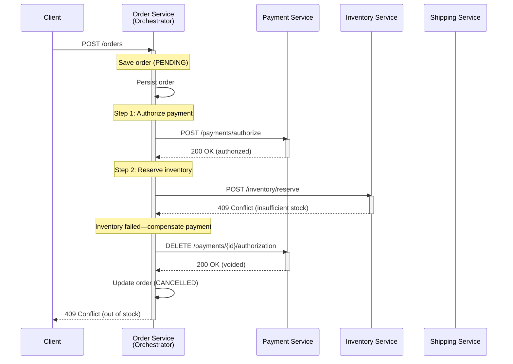

# Phase 4 - Data Ownership, Transactions and Consistency

> **Weeks:** 24-30 | **Prerequisites:** Phase 2, Phase 3 | **Time budget:** 80-100 hrs  
> **You finish this phase able to:**
> - Design service data boundaries that prevent distributed transaction coupling
> - Implement transactional outbox and saga patterns to maintain consistency across services
> - Choose appropriate isolation levels and concurrency controls for business invariants
> - Build idempotent consumers that survive duplicate messages and retries
> - Recognize when ACID is unavoidable versus when eventual consistency is acceptable
> - Debug and recover from partial failures in multi-service workflows

## Why this phase exists

Microservices force you to give up the single database and its ACID guarantees. Most teams respond by quietly cheating: they share the database, they dual-write to DB and Kafka hoping both succeed, they lean on "we'll reconcile later" without building the reconciliation, they special-case edge cases until the codebase is 40% edge cases. The bill comes due as phantom inventory, double charges, stuck orders, and the 3 a.m. page where money vanished and the logs show both services succeeded.

This phase teaches the real primitives: outbox for reliable publication, sagas for cross-service workflows, idempotency for safe retries, explicit staleness budgets instead of accidental inconsistency. Once data is split, you no longer have transactions—you have choreography. Design the choreography, or it designs itself badly.

## Mental model

**Once data is split, ACID becomes a workflow.**  
A monolith with one database gives you transactions: all-or-nothing atomicity, cross-table joins, foreign keys that prevent orphans. Microservices replace transactions with sagas: multi-step workflows with compensations. You replace joins with data duplication and accept staleness. The staleness budget is a product decision—how stale can the catalog price be in the cart before the customer complains?—not an accident.

**Consistency is a spectrum, not a boolean.**  
Strong consistency (linearizable reads, serializable transactions) costs availability and latency. Eventual consistency is cheap but requires conflict resolution, retries, and explaining to the business why two users booked the same hotel room. The correct choice is workload-specific: a payment ledger needs serializability; a product view count tolerates minutes of lag.

**Every distributed operation is three operations: request, outcome, acknowledgment.**  
The network can fail between any two. Idempotency and deduplication are not optimizations—they are correctness requirements. At-least-once delivery plus idempotent processing equals exactly-once semantics.

**Compensations are forward-only business actions, not technical rollbacks.**  
In a saga, if the payment succeeds but inventory allocation fails, you do not "undo" the payment in the database—you issue a refund. Refunds are business events with audit trails, compliance implications, and customer notifications. Design them as first-class operations.

**The safety net is reconciliation.**  
Every money system, every inventory system, every workflow that must not lose data needs a reconciliation job: a scheduled process that scans for orphans, stuck sagas, missing events, and inconsistencies between systems. Reconciliation is not a band-aid for bad design—it is the detection layer for the bugs you will ship anyway.

## Core concepts

### Database per service

**Database per service** means each service owns its schema and no other service queries it directly. No shared tables, no cross-service foreign keys, no SELECT across service boundaries, no shared connection pool. Service boundaries are data boundaries.

**Schema ownership enforcement:**
- Separate database users per service with grants scoped to owned schemas only. `catalog` service user cannot read `order` tables.
- Separate schemas or databases in the same RDBMS cluster (PostgreSQL schemas, MySQL databases) if you must share infrastructure.
- Separate physical databases for different persistence engines (PostgreSQL for orders, Elasticsearch for search, Redis for sessions).
- CI enforcement: detect cross-schema SQL in code reviews via static analysis or integration test sandbox isolation.

**The shared-database anti-pattern:**  
When multiple services write to the same tables, you lose deployment independence (schema migration breaks three services), transaction boundaries blur (service A starts a transaction, service B joins it—now they are one service), and you cannot switch persistence engines per workload. You also bottleneck on the shared database's scaling limits.

**Acceptable exceptions:**
- **Shared read replica** for reporting/analytics, provisioned separately, lag-tolerant, never written by services. Often fed via Change Data Capture (CDC) from service-owned primaries into a data warehouse.
- **Reference data tables** (country codes, currencies) duplicated to each service database or served by a thin reference-data service. Never shared writable state.

**ShopKart ownership example:**
- `catalog` service owns `products`, `categories`, `brands` in PostgreSQL.
- `cart` service owns `carts`, `cart_items` in Redis (session affinity).
- `order` service owns `orders`, `order_lines`, `order_events` in PostgreSQL.
- `inventory` service owns `inventory_levels`, `reservations` in PostgreSQL with row-level locking.
- `payment` service owns `payment_transactions`, `idempotency_keys` in PostgreSQL with serializable isolation.
- `pricing` service owns `price_rules`, `promotions` in PostgreSQL; publishes price-change events.
- `search` service owns Elasticsearch indices populated via events from `catalog`.

### Polyglot persistence decision matrix

| Store Type       | Choose for                                      | Never for                                | ShopKart Example                  |
|------------------|-------------------------------------------------|------------------------------------------|-----------------------------------|
| **RDBMS** (PostgreSQL, MySQL) | Structured data, ACID needs, complex queries, referential integrity within a service | High write throughput (>100k TPS on one table), unstructured documents | `order`, `inventory`, `payment`   |
| **Document** (MongoDB, DynamoDB) | Schema flexibility, nested objects, hierarchical data | Strong consistency across documents, complex joins | `catalog` (if product schemas vary widely) |
| **Key-Value** (Redis, Memcached) | Session data, ephemeral state, caching, rate limiting | Durable primary storage, range queries | `cart`, API rate-limit counters   |
| **Wide-Column** (Cassandra, ScyllaDB) | Write-heavy time-series, high cardinality, multi-datacenter replication | Strong consistency, cross-partition transactions | Audit logs, click events (not in ShopKart) |
| **Graph** (Neo4j, Neptune) | Relationship-heavy traversals, recommendation engines | Tabular data, high write throughput | Product recommendations (separate service) |
| **Search** (Elasticsearch, OpenSearch) | Full-text, fuzzy, faceted queries | Primary write store, strict consistency | `search` indices                  |
| **Time-Series** (TimescaleDB, InfluxDB) | Metrics, logs, sensor data with time ordering | General-purpose OLTP | Observability backend (not ShopKart domain) |
| **Object Store** (S3, GCS, Azure Blob) | Large binary blobs, backups, archival, immutable data | Low-latency random access, transactional updates | Product images, invoice PDFs      |

**Decision tree:**
1. Does this data require multi-record ACID transactions? → RDBMS or give up ACID and use saga.
2. Is this data primarily accessed by key lookup? → Key-value or document store.
3. Do you need full-text search or complex faceting? → Elasticsearch/OpenSearch.
4. Is this write-heavy time-series data? → Wide-column or time-series DB.
5. Are relationships first-class citizens? → Graph database.
6. Is this immutable bulk data? → Object store.
7. Default: RDBMS. Boring is good.

### Referential integrity without foreign keys

When `order` service references `product_id` from `catalog` service, you cannot have a foreign key. Foreign keys enforce integrity at write time in one database; across services, integrity is eventual and validated differently.

**Validation at the boundary:**  
When creating an order, `order` service calls `catalog` service synchronously (or checks a local cached copy) to verify the product exists. If validation fails, reject the request immediately. This gives the user fast feedback.

**Eventual reconciliation:**  
If the catalog product is deleted after the order is placed, the order keeps its `product_id` but displays "Product no longer available" in the UI. Business decision: do you cancel the order? Update it? Let it complete? The answer is domain-specific.

**Orphan detection:**  
A scheduled job in `order` service scans for `product_id` values not found in the catalog and flags them for manual review or auto-cancellation. This is reconciliation—the safety net.

**Accepting inconsistency:**  
Some references are informational, not load-bearing. An order can reference a deleted product for historical reporting. The order happened; the product is gone. That is acceptable. The business decides the tolerance.

### ACID recap and isolation levels

**ACID:** Atomicity (all or nothing), Consistency (invariants hold), Isolation (concurrent transactions do not interfere), Durability (committed data survives crashes).

**Isolation levels and anomalies:**

| Anomaly             | Read Uncommitted | Read Committed | Repeatable Read | Serializable |
|---------------------|------------------|----------------|-----------------|--------------|
| **Dirty read** (read uncommitted data) | Possible | — | — | — |
| **Non-repeatable read** (row changes between reads) | Possible | Possible | — | — |
| **Phantom** (new rows appear between range queries) | Possible | Possible | Possible (standard SQL); Not in PostgreSQL MVCC | — |
| **Lost update** (concurrent writes clobber each other) | Possible | Possible | Possible | — |
| **Write skew** (concurrent txns violate invariant across rows) | Possible | Possible | Possible | — |

**PostgreSQL specifics:**
- **Read Committed** (default): sees only committed data, but repeated reads of the same row can return different values. Vulnerable to lost updates (use `SELECT ... FOR UPDATE` or optimistic locking).
- **Repeatable Read**: MVCC snapshot isolation—reads see a consistent snapshot from transaction start. Prevents phantoms (unlike standard SQL RR). Still vulnerable to write skew.
- **Serializable**: Serializable Snapshot Isolation (SSI). Detects write-skew conflicts and aborts one transaction with a serialization error. Application MUST retry.

**MVCC in one paragraph:**  
Multi-Version Concurrency Control: PostgreSQL keeps multiple versions of each row. Readers see a snapshot consistent with their transaction start time and never block writers. Writers create new row versions. Vacuum reclaims old versions. This gives high concurrency but means disk bloat if long transactions hold snapshots open.

**Write skew: the anomaly that causes double-booking bugs.**

**Plain English:** Two transactions each read the same data, make a decision based on it, then write non-overlapping rows—but together they violate a business rule.

**Analogy:** Two cashiers at a concert venue both check the seating chart and see seat A5 is available. Cashier 1 sells it to Customer X. Cashier 2 sells it to Customer Y. Each cashier only looked at and updated their own transaction record, not the seat record directly. Both transactions succeed, but now two people hold tickets for the same seat. The analogy breaks down because real cashiers would update the seat itself; in databases, the "seat" might be implicit in a constraint checked across two tables.

**In the real world:** Hotel booking systems have historically suffered this: two agents book the same room because the constraint "total bookings < room capacity" spans multiple rows (one row per booking), and each transaction reads all bookings, sees capacity, writes a new booking. Under Repeatable Read, both transactions see the same snapshot before either commits.

**Mechanics:** Transaction A reads rows R1, R2; decides based on aggregate (sum < limit); writes R3. Transaction B reads R1, R2; makes the same decision; writes R4. Both R3 and R4 are valid individually, but together they violate `sum(R1..R4) < limit`. Repeatable Read allows this because A and B never write the same row—no conflict. Serializable isolation detects it via predicate locks or dependency tracking and aborts one transaction.

**What breaks:** Double bookings, phantom inventory (two orders reserve the last item), overdrafts (two withdrawals check balance, both see $100, both withdraw $80). Logs show both transactions committed successfully. Customers complain. Manual refunds.

**Fix:** Use Serializable isolation and retry on `40001` error code (PostgreSQL), or use pessimistic locking (`SELECT ... FOR UPDATE` on a summary row), or use optimistic locking with a version field on the aggregate, or explicitly lock a single "allocator" row (`SELECT ... FOR UPDATE` on a semaphore row representing the constraint).

### Concurrency control

**Optimistic locking:**  
Assume conflicts are rare. Read a row with a version column, do work, write back with `WHERE version = <old>`. If the update affects 0 rows, someone else modified it—retry or fail.

```java
// JPA entity with optimistic locking
@Entity
@Table(name = "inventory_levels")
public class InventoryLevel {
    @Id
    private UUID productId;
    
    private int available;
    
    @Version
    private long version;  // JPA auto-increments on update
    
    public boolean reserve(int quantity) {
        if (available < quantity) return false;
        available -= quantity;
        return true;
    }
}

// Service with retry loop
@Service
public class InventoryService {
    @Autowired InventoryRepository repo;
    
    @Retryable(
        value = OptimisticLockingFailureException.class,
        maxAttempts = 5,
        backoff = @Backoff(delay = 50, multiplier = 1.5)
    )
    public void reserveInventory(UUID productId, int qty) {
        InventoryLevel inv = repo.findById(productId)
            .orElseThrow(() -> new ProductNotFoundException(productId));
        
        if (!inv.reserve(qty)) {
            throw new InsufficientInventoryException(productId, qty, inv.getAvailable());
        }
        
        repo.save(inv);  // JPA checks version; throws OptimisticLockingFailureException if stale
    }
}
```

**When to use:** High read/low contention workloads. Most inventory updates succeed on first try.

**When NOT to use:** High contention (hundreds of concurrent updates to the same row). Retry storms can make latency unpredictable.

**Pessimistic locking:**  
Explicitly lock rows before modifying them. Other transactions wait.

```java
@Repository
public interface InventoryRepository extends JpaRepository<InventoryLevel, UUID> {
    @Lock(LockModeType.PESSIMISTIC_WRITE)
    @Query("SELECT i FROM InventoryLevel i WHERE i.productId = :id")
    Optional<InventoryLevel> findByIdForUpdate(@Param("id") UUID productId);
}

// Service
public void reserveInventory(UUID productId, int qty) {
    InventoryLevel inv = repo.findByIdForUpdate(productId)
        .orElseThrow(() -> new ProductNotFoundException(productId));
    
    if (inv.getAvailable() < qty) {
        throw new InsufficientInventoryException(productId, qty, inv.getAvailable());
    }
    
    inv.reserve(qty);
    repo.save(inv);  // No retry needed; we held the lock
}
```

Compiles to `SELECT ... FOR UPDATE` (PostgreSQL/MySQL) or `SELECT ... WITH (UPDLOCK, ROWLOCK)` (SQL Server).

**Deadlock prevention:** Always acquire locks in a consistent order. If you lock `product_id=A`, then `product_id=B`, every transaction must lock A before B. Deadlock detection is automatic in RDBMS (one transaction aborted), but prevention avoids the retry.

**When to use:** High contention, low latency tolerance, deterministic lock ordering possible.

**When NOT to use:** Long-running transactions (holds locks, blocks readers), distributed locks across services (use distributed lock service instead).

**Surfacing conflicts to the API:**
- Optimistic lock failure → `409 Conflict` with current resource state in response body, or `412 Precondition Failed` if client sent `If-Match` ETag.
- Pessimistic lock timeout → `503 Service Unavailable` with `Retry-After` header.
- Business conflict (insufficient inventory) → `400 Bad Request` or `409 Conflict` with error details.

### Why 2PC/XA is the wrong default

**Two-Phase Commit (2PC):** Coordinator asks all participants "can you commit?" (prepare phase). If all say yes, coordinator tells them "commit"; if any says no, coordinator tells all "abort."

**Problems in microservices:**
1. **Coordinator SPOF:** If the coordinator crashes after prepare but before commit/abort, participants are stuck in "in-doubt" state, holding locks, unable to proceed. Recovery requires manual intervention or a durable coordinator log.
2. **Availability multiplication:** If each service is 99.9% available, a 2PC across 3 services is ~99.7% available (0.999³). More participants = lower availability.
3. **Latency:** 2PC is synchronous, multi-RTT (prepare, commit). In a geo-distributed system, this is hundreds of milliseconds.
4. **Lock duration:** Locks held from prepare through commit—longer than a local transaction.
5. **Heterogeneous systems:** Not all datastores support XA (Redis, many NoSQL stores). Cloud databases often do not expose XA interfaces.
6. **Operational complexity:** Heuristic outcomes (participant commits despite coordinator abort), manual recovery scripts, transaction manager configuration.

**Where 2PC still lives:**  
Inside a single organization boundary with tightly coupled systems: one relational database plus JMS queue (Spring's `JtaTransactionManager`), or legacy mainframe integration. Financial core systems built on XA-capable middleware (IBM MQ, Oracle Tuxedo). These are shrinking domains.

**Microservices alternative:** Saga pattern (below).

### The dual-write problem

**The problem:** "Save to database, then publish to Kafka" is broken.

**Plain English:** If you write to two systems in sequence and the process crashes between them, one write is lost.

**Analogy:** You mail a letter and update your sent-items log. If the mailbox jams after you drop the letter but before you write the log, you have no record you sent it. If you write the log first and the mailbox jams, the log lies. The analogy breaks: physical mail does not retry, but distributed systems do—at-least-once delivery makes the problem worse because retries can duplicate the first write.

**In the real world:** An e-commerce order is saved to PostgreSQL, then the service publishes an `OrderCreated` event to Kafka. The database commit succeeds. Before the Kafka publish, the pod is killed (deployment, OOM, node failure). The event is never published. Downstream services (inventory, shipping) never see the order. Customer sees "Order placed" but the warehouse never ships it. This is silent data loss.

**Mechanics:** Three failure interleavings:
1. **DB succeeds, Kafka fails:** Order saved, event lost. Downstream services never notified.
2. **Kafka succeeds, DB fails:** Event published, order not saved. Downstream services process an order that does not exist in the source system. If they query back, 404.
3. **Both succeed, acknowledgment lost:** Kafka ack times out; client retries the entire request; order is saved twice (without idempotency), or Kafka gets a duplicate event.

**What breaks:** Missing events, duplicate events, phantom references, money lost in transit. Logs show "published to Kafka" but the event never arrived, or vice versa.

**Fix:** Transactional outbox.

### Transactional outbox and message relay

The **transactional outbox** pattern: write the event to a local database table in the same transaction as the business data, then reliably publish it from there.

**Schema:**

```sql
CREATE TABLE outbox_events (
    id UUID PRIMARY KEY DEFAULT gen_random_uuid(),
    aggregate_type VARCHAR(255) NOT NULL,  -- e.g., 'Order', 'Payment'
    aggregate_id VARCHAR(255) NOT NULL,    -- business key: order ID
    event_type VARCHAR(255) NOT NULL,      -- 'OrderCreated', 'OrderCancelled'
    payload JSONB NOT NULL,
    created_at TIMESTAMP NOT NULL DEFAULT now(),
    published_at TIMESTAMP,
    processed BOOLEAN DEFAULT FALSE,
    version INT DEFAULT 0
);

CREATE INDEX idx_outbox_unpublished ON outbox_events(created_at) 
    WHERE processed = FALSE;
```

**Write path:**

```java
@Service
public class OrderService {
    @Autowired OrderRepository orderRepo;
    @Autowired OutboxRepository outboxRepo;
    
    @Transactional
    public Order createOrder(CreateOrderRequest req) {
        // 1. Validate and create domain entity
        Order order = Order.create(req.getCustomerId(), req.getItems());
        order = orderRepo.save(order);
        
        // 2. Write event to outbox IN THE SAME TRANSACTION
        OutboxEvent event = OutboxEvent.builder()
            .aggregateType("Order")
            .aggregateId(order.getId().toString())
            .eventType("OrderCreated")
            .payload(toJson(OrderCreatedEvent.from(order)))
            .build();
        
        outboxRepo.save(event);
        
        // Both writes committed atomically or both rolled back
        return order;
    }
}
```

**Polling publisher (message relay):**

```java
@Component
public class OutboxPublisher {
    @Autowired OutboxRepository outboxRepo;
    @Autowired KafkaTemplate<String, String> kafka;
    
    @Scheduled(fixedDelay = 1000)  // Every second
    @Transactional
    public void publishPendingEvents() {
        List<OutboxEvent> events = outboxRepo.findUnpublished(Limit.of(100));
        
        for (OutboxEvent event : events) {
            try {
                // Publish to Kafka (or RabbitMQ, SQS, etc.)
                kafka.send(
                    event.getAggregateType(),  // topic
                    event.getAggregateId(),    // key for partitioning
                    event.getPayload()
                ).get(5, TimeUnit.SECONDS);  // Block to confirm
                
                event.setProcessed(true);
                event.setPublishedAt(Instant.now());
                outboxRepo.save(event);
                
            } catch (Exception e) {
                log.error("Failed to publish event {}", event.getId(), e);
                // Retry on next poll
            }
        }
    }
}
```

**CDC-based relay (Debezium):**  
Instead of polling, use Change Data Capture (Debezium) to tail the database transaction log and publish outbox rows to Kafka automatically. Debezium connector watches `outbox_events` table, transforms each insert into a Kafka message, and maintains exactly-once semantics via database log offsets.

**Configuration:**

```json
{
  "name": "order-outbox-connector",
  "config": {
    "connector.class": "io.debezium.connector.postgresql.PostgresConnector",
    "database.hostname": "postgres",
    "database.dbname": "orders",
    "table.include.list": "public.outbox_events",
    "transforms": "outbox",
    "transforms.outbox.type": "io.debezium.transforms.outbox.EventRouter",
    "transforms.outbox.table.field.event.key": "aggregate_id",
    "transforms.outbox.table.field.event.type": "event_type",
    "transforms.outbox.table.field.event.payload": "payload"
  }
}
```

**Polling vs CDC:**

| Aspect           | Polling Publisher | CDC (Debezium) |
|------------------|-------------------|----------------|
| **Latency**      | Seconds (poll interval) | Sub-second (log tailing) |
| **Ordering**     | Per-poll batch, not strict per-aggregate | Strict per-partition in log |
| **Ops complexity** | Simple scheduled job | Kafka Connect cluster, connector config |
| **Failure recovery** | Retry on next poll | Connector resumes from log offset |
| **Schema evolution** | Handle in app code | Connector transform config |

**When to use polling:** Simpler setup, acceptable latency (seconds), low event volume.  
**When to use CDC:** Sub-second latency, high volume, strict ordering, already running Kafka Connect.

**Cleanup/retention:**  
Outbox events accumulate. Either:
- Delete processed events older than N days (scheduled job: `DELETE FROM outbox_events WHERE processed = TRUE AND published_at < now() - INTERVAL '7 days'`).
- Archive to object storage for audit, then delete.
- Partition the table by month; drop old partitions.

**At-least-once delivery:**  
The relay can fail after publishing to Kafka but before marking the event processed. Result: duplicate events. Consumers MUST be idempotent.

### Inbox and deduplication

**Inbox pattern:** Consuming service writes incoming events to a local deduplication table before processing.

```sql
CREATE TABLE inbox_events (
    event_id UUID PRIMARY KEY,  -- Unique ID from producer
    event_type VARCHAR(255) NOT NULL,
    payload JSONB NOT NULL,
    received_at TIMESTAMP NOT NULL DEFAULT now(),
    processed BOOLEAN DEFAULT FALSE
);
```

**Consumer with dedupe:**

```java
@KafkaListener(topics = "Order", groupId = "inventory-service")
@Transactional
public void handleOrderCreated(OrderCreatedEvent event) {
    // Check inbox for duplicate
    if (inboxRepo.existsById(event.getEventId())) {
        log.debug("Duplicate event {}, skipping", event.getEventId());
        return;  // Already processed
    }
    
    // Insert into inbox first
    InboxEvent inbox = InboxEvent.builder()
        .eventId(event.getEventId())
        .eventType("OrderCreated")
        .payload(toJson(event))
        .build();
    inboxRepo.save(inbox);
    
    // Process business logic
    inventoryService.reserveInventory(event.getProductId(), event.getQuantity());
    
    // Mark processed (same transaction)
    inbox.setProcessed(true);
    inboxRepo.save(inbox);
}
```

**Natural deduplication (no inbox table):**  
If the business operation is naturally idempotent via a unique constraint, rely on that:

```java
@Entity
@Table(name = "inventory_reservations", 
       uniqueConstraints = @UniqueConstraint(columnNames = {"order_id", "product_id"}))
public class InventoryReservation {
    @Id private UUID id;
    private UUID orderId;
    private UUID productId;
    private int quantity;
}

// Upsert: ON CONFLICT DO NOTHING (PostgreSQL) or INSERT IGNORE (MySQL)
@Modifying
@Query(value = """
    INSERT INTO inventory_reservations (id, order_id, product_id, quantity)
    VALUES (:id, :orderId, :productId, :quantity)
    ON CONFLICT (order_id, product_id) DO NOTHING
    """, nativeQuery = true)
void reserveIdempotent(UUID id, UUID orderId, UUID productId, int quantity);
```

Duplicate events insert nothing, but the operation succeeds. No inbox table needed.

**Idempotency for non-idempotent side effects:**  
Charging a credit card is not idempotent. Stripe/PayPal/Razorpay accept an `Idempotency-Key` header: same key returns the same result without re-charging.

```java
public PaymentResult chargeCard(UUID orderId, Money amount) {
    String idempotencyKey = "order-" + orderId;  // Deterministic key
    
    return paymentGateway.charge(ChargeRequest.builder()
        .amount(amount)
        .idempotencyKey(idempotencyKey)
        .build());
    // If retried, gateway returns cached result for this key
}
```

**TTL for inbox:**  
Inbox rows accumulate. Set a retention policy (7–30 days) and delete old processed rows, or use a TTL index (MongoDB) or partition drop (PostgreSQL).

### Saga pattern

A **saga** is a sequence of local transactions coordinated to achieve a distributed outcome. If a step fails, previously completed steps are compensated (undone via business logic, not database rollback).

**Orchestration vs choreography:**

| Aspect         | Orchestration | Choreography |
|----------------|---------------|--------------|
| **Coordinator** | Central saga orchestrator service | No coordinator; services react to events |
| **Visibility**  | Single place to see saga state | Distributed across event logs |
| **Coupling**    | Services coupled to orchestrator's API | Services coupled to event schemas |
| **Testability** | Easier to unit-test orchestrator logic | Harder; requires event stream replay |
| **Cyclic risk** | Orchestrator prevents cycles | Circular event chains possible (A→B→C→A) |
| **Failure handling** | Orchestrator retries/compensates centrally | Each service must implement compensation handlers |
| **Use when** | Complex workflows, many steps, central audit trail | Simple workflows, high autonomy, event-driven architecture |

**ShopKart order saga (orchestration):**



**Saga state machine (Java):**

```java
public enum OrderSagaState {
    STARTED,
    PAYMENT_AUTHORIZED,
    INVENTORY_RESERVED,
    SHIPPING_SCHEDULED,
    COMPLETED,
    COMPENSATING_INVENTORY,
    COMPENSATING_PAYMENT,
    FAILED
}

@Entity
public class OrderSaga {
    @Id private UUID orderId;
    
    @Enumerated(EnumType.STRING)
    private OrderSagaState state;
    
    private String compensationReason;
    private Instant createdAt;
    private Instant completedAt;
    
    // Idempotent step tracking
    private UUID paymentAuthId;
    private UUID inventoryReservationId;
    private UUID shippingRequestId;
}

@Service
public class OrderSagaOrchestrator {
    
    @Transactional
    public void executeOrderSaga(UUID orderId) {
        OrderSaga saga = sagaRepo.findById(orderId)
            .orElseGet(() -> createSaga(orderId));
        
        try {
            switch (saga.getState()) {
                case STARTED -> authorizePayment(saga);
                case PAYMENT_AUTHORIZED -> reserveInventory(saga);
                case INVENTORY_RESERVED -> scheduleShipping(saga);
                case SHIPPING_SCHEDULED -> completeSaga(saga);
                case COMPENSATING_INVENTORY -> compensateInventory(saga);
                case COMPENSATING_PAYMENT -> compensatePayment(saga);
            }
        } catch (Exception e) {
            startCompensation(saga, e.getMessage());
        }
    }
    
    private void authorizePayment(OrderSaga saga) {
        PaymentAuthResult auth = paymentClient.authorize(saga.getOrderId());
        saga.setPaymentAuthId(auth.getId());
        saga.setState(PAYMENT_AUTHORIZED);
        sagaRepo.save(saga);
    }
    
    private void reserveInventory(OrderSaga saga) {
        try {
            ReservationResult res = inventoryClient.reserve(saga.getOrderId());
            saga.setInventoryReservationId(res.getId());
            saga.setState(INVENTORY_RESERVED);
            sagaRepo.save(saga);
        } catch (InsufficientStockException e) {
            throw new SagaCompensationException("Inventory unavailable", e);
        }
    }
    
    private void startCompensation(OrderSaga saga, String reason) {
        saga.setCompensationReason(reason);
        
        if (saga.getState().ordinal() >= INVENTORY_RESERVED.ordinal()) {
            saga.setState(COMPENSATING_INVENTORY);
        } else if (saga.getState().ordinal() >= PAYMENT_AUTHORIZED.ordinal()) {
            saga.setState(COMPENSATING_PAYMENT);
        } else {
            saga.setState(FAILED);
        }
        
        sagaRepo.save(saga);
        // Trigger compensation asynchronously or recursively
    }
    
    private void compensateInventory(OrderSaga saga) {
        inventoryClient.releaseReservation(saga.getInventoryReservationId());
        saga.setState(COMPENSATING_PAYMENT);
        sagaRepo.save(saga);
    }
    
    private void compensatePayment(OrderSaga saga) {
        paymentClient.voidAuthorization(saga.getPaymentAuthId());
        saga.setState(FAILED);
        saga.setCompletedAt(Instant.now());
        sagaRepo.save(saga);
    }
}
```

**Compensations are business actions:**  
Voiding a payment authorization, releasing an inventory reservation, canceling a shipping label—these are forward business operations with audit trails. You cannot "undo" a payment capture (money moved); you issue a refund (new transaction). Compensations may not be perfect inverses (fees, exchange rates, inventory already shipped).

**Semantic locks:**  
While a saga is running, mark the affected resources as "locked" to prevent concurrent modifications. Example: `inventory_reservations` table holds a row per pending saga. Other sagas see reduced available inventory. When the saga completes or compensates, the reservation is removed or converted to a permanent allocation.

**Pivot transaction:**  
The point of no return in a saga. After the pivot, compensations are no longer possible (e.g., after payment capture, you can only refund, not void). Design sagas so the pivot is as late as possible and all retriable steps come before it.

**Retriable vs compensatable steps:**
- **Retriable:** Idempotent, can retry indefinitely (check inventory, authorize payment).
- **Compensatable:** Side effects that need explicit undo (capture payment → refund, ship order → initiate return).

Retriable steps should exhaust retries before a saga gives up; compensatable steps should be as late in the saga as possible.

**Saga state persistence and recovery:**  
The orchestrator must survive crashes. Saga state is persisted in the orchestrator's database. A scheduled job polls for incomplete sagas and resumes them. Timeouts: if a saga is stuck in a state for too long (hours), escalate to a dead-letter queue or human review.

**Stuck sagas:**  
A payment service is down; the saga retries payment authorization for hours. Options:
1. Exponential backoff + max retries → eventual compensation.
2. Human-in-the-loop: after N retries, create a support ticket, pause the saga, let ops fix the payment service or manually void the authorization.
3. Circuit breaker at saga level: if payment service is open, immediately compensate new sagas.

**Timeouts:**

```java
@Scheduled(fixedDelay = 60000)  // Every minute
public void timeoutStalledSagas() {
    Instant cutoff = Instant.now().minus(Duration.ofHours(2));
    
    List<OrderSaga> stalled = sagaRepo.findIncompleteOlderThan(cutoff);
    
    for (OrderSaga saga : stalled) {
        log.error("Saga {} stalled in state {}", saga.getOrderId(), saga.getState());
        startCompensation(saga, "Timeout");
    }
}
```

### Distributed locks

**When you actually need one:**  
Rare. Prefer saga orchestration, idempotency, optimistic locking. Use a distributed lock when:
- Exactly one instance must perform a scheduled job (leader election for a cron task).
- Coordinating access to a shared external resource (legacy API with global rate limit).
- Preventing duplicate processing when idempotency is not possible (non-idempotent third-party callback).

**Redis single-instance lock with fencing token:**

```java
public class RedisLock {
    private final StringRedisTemplate redis;
    
    public Optional<String> acquireLock(String key, Duration ttl) {
        String token = UUID.randomUUID().toString();
        
        Boolean acquired = redis.opsForValue()
            .setIfAbsent(key, token, ttl);
        
        return Boolean.TRUE.equals(acquired) ? Optional.of(token) : Optional.empty();
    }
    
    public void releaseLock(String key, String token) {
        // Lua script ensures atomic check-and-delete
        String script = """
            if redis.call('get', KEYS[1]) == ARGV[1] then
                return redis.call('del', KEYS[1])
            else
                return 0
            end
            """;
        
        redis.execute(
            RedisScript.of(script, Long.class),
            Collections.singletonList(key),
            token
        );
    }
}

// Usage
String lockKey = "scheduled-job:reconcile-orders";
Optional<String> token = redisLock.acquireLock(lockKey, Duration.ofMinutes(5));

if (token.isPresent()) {
    try {
        // Do work
        reconcileOrders();
    } finally {
        redisLock.releaseLock(lockKey, token.get());
    }
} else {
    log.info("Another instance holds the lock");
}
```

**Fencing tokens:**  
Monotonically increasing token (timestamp, version number) issued with the lock. Worker sends the token with every write to the protected resource. Resource rejects writes with stale tokens. Prevents the scenario where a slow worker thinks it holds the lock (lock expired, another worker acquired it) and corrupts shared state.

```java
// Worker
long fence = lockService.acquireLockWithFence("resource-X", Duration.ofMinutes(5));
externalSystem.update("resource-X", newValue, fence);

// External system
public void update(String resourceId, String value, long fenceToken) {
    long currentFence = getCurrentFence(resourceId);
    if (fenceToken <= currentFence) {
        throw new StaleFenceException("Token " + fenceToken + " is stale; current is " + currentFence);
    }
    // Proceed with update
    setCurrentFence(resourceId, fenceToken);
}
```

**Redlock controversy:**  
Martin Kleppmann argued that Redlock (distributed lock across N Redis instances, majority quorum) is unsafe without fencing tokens due to GC pauses and clock skew. Salvatore Sanfilippo (antirez, Redis author) countered that Redlock is safe for efficiency (preventing duplicate work) but not for correctness (protecting critical state). Consensus: for correctness, use ZooKeeper/etcd with fencing; for efficiency (scheduled job deduplication), single-instance Redis lock is often sufficient.

**ZooKeeper/etcd leases:**

```java
// etcd (using jetcd library)
Lease lease = client.getLeaseClient().grant(30).get();  // 30-second TTL
long leaseId = lease.getID();

try {
    PutResponse resp = client.getKVClient()
        .put(ByteSequence.from("/lock/my-resource", UTF_8),
             ByteSequence.from("holder-id", UTF_8),
             PutOption.newBuilder().withLeaseId(leaseId).build())
        .get();
    
    // Do work
    runCriticalSection();
    
} finally {
    client.getLeaseClient().revoke(leaseId).get();
}
```

Heartbeats keep the lease alive. If the holder crashes, the lease expires, and the lock is released.

**Rule:** A lock without a fencing token is not safe for protecting shared mutable state. Use locks only for efficiency (preventing duplicate work), or use a system with native fencing (etcd with revision numbers, ZooKeeper with zxid).

### CQRS (Command Query Responsibility Segregation)

**CQRS:** Separate write model and read model. Commands mutate state; queries read optimized projections.

**When it earns its complexity:**
- Asymmetric load: 1,000 writes/sec, 100,000 reads/sec → optimize read model independently.
- Different shapes: write model is normalized third-normal-form; read model is denormalized materialized view.
- Multiple read views: product detail, product search, product recommendations—each needs different data shape.
- Event sourcing: writes are events appended to a log; reads are projections from the log.

**When CQRS is overkill:**  
Most CRUD domains. If your read and write patterns are similar, CQRS adds accidental complexity. Start with a single model; split only when pain is measurable.

**Projection lag and read-your-writes:**  
Writes go to the write model; reads come from the projection. The projection lags by milliseconds to seconds (Kafka consumer offset lag, database replication lag). User updates their profile, immediately reloads, sees old data. Solutions:

1. **Sticky reads:** After write, redirect reads to the write model for a short TTL (sync read). Most traffic still uses projection.

```java
@PostMapping("/profile")
public ResponseEntity<Void> updateProfile(@RequestBody UpdateProfileRequest req) {
    commandBus.send(new UpdateProfileCommand(req));
    
    // Set cookie: read from write model for next 5 seconds
    Cookie cookie = new Cookie("read-source", "write-model");
    cookie.setMaxAge(5);
    return ResponseEntity.ok().header(SET_COOKIE, cookie.toString()).build();
}

@GetMapping("/profile")
public Profile getProfile(@CookieValue(required = false) String readSource) {
    if ("write-model".equals(readSource)) {
        return profileWriteRepo.findById(userId);  // Sync, slow
    }
    return profileReadRepo.findById(userId);  // Fast projection
}
```

2. **Version tokens:** Write returns a version number; client sends it with the next read; read waits until projection has that version.

```java
@PostMapping("/profile")
public UpdateResponse updateProfile(@RequestBody UpdateProfileRequest req) {
    long version = commandBus.send(new UpdateProfileCommand(req));
    return new UpdateResponse(version);  // Client receives version 42
}

@GetMapping("/profile")
public Profile getProfile(@RequestParam(required = false) Long minVersion) {
    if (minVersion != null) {
        // Wait up to 2 seconds for projection to reach minVersion
        return profileReadRepo.waitForVersion(userId, minVersion, Duration.ofSeconds(2));
    }
    return profileReadRepo.findById(userId);
}
```

3. **Optimistic UI:** Client updates local state immediately, shows updated UI, reconciles when projection catches up. Instagram does this: like a photo, heart fills instantly (optimistic), backend confirms asynchronously.

**Projection rebuild:**  
If the read model is corrupted or schema changes, rebuild from the event log. This is slow (hours for millions of events). Strategies:
- Build new projection in parallel; switch when caught up.
- Snapshot the event log periodically; rebuild from snapshot + delta.
- Limit retention: only rebuild from last N days of events; older data from archive.

### Event sourcing

**Event sourcing:** Store all changes as an append-only log of events, not mutable state. Current state is derived by replaying events.

**Event store design:**

```sql
CREATE TABLE event_store (
    event_id UUID PRIMARY KEY,
    aggregate_type VARCHAR(255) NOT NULL,  -- 'Order', 'Account'
    aggregate_id VARCHAR(255) NOT NULL,
    event_type VARCHAR(255) NOT NULL,       -- 'OrderCreated', 'ItemAdded'
    event_data JSONB NOT NULL,
    metadata JSONB,                         -- user_id, correlation_id, timestamp
    version INT NOT NULL,                   -- Optimistic lock per aggregate
    created_at TIMESTAMP NOT NULL DEFAULT now(),
    
    CONSTRAINT unique_aggregate_version UNIQUE (aggregate_type, aggregate_id, version)
);

CREATE INDEX idx_aggregate_events ON event_store(aggregate_type, aggregate_id, version);
```

**Appending events (optimistic concurrency):**

```java
public void appendEvent(String aggregateType, String aggregateId, Event event) {
    int expectedVersion = getCurrentVersion(aggregateType, aggregateId);
    
    EventRecord record = EventRecord.builder()
        .aggregateType(aggregateType)
        .aggregateId(aggregateId)
        .eventType(event.getClass().getSimpleName())
        .eventData(toJson(event))
        .version(expectedVersion + 1)
        .build();
    
    try {
        eventRepo.save(record);  // Unique constraint on (aggregateType, aggregateId, version)
    } catch (DataIntegrityViolationException e) {
        throw new ConcurrentModificationException("Version conflict");
    }
}
```

**Rehydration (reconstituting aggregate state):**

```java
public Order loadOrder(UUID orderId) {
    List<EventRecord> events = eventRepo.findByAggregateId("Order", orderId.toString());
    
    Order order = new Order();  // Empty state
    for (EventRecord record : events) {
        Event event = fromJson(record.getEventData(), record.getEventType());
        order.apply(event);  // Fold event into state
    }
    
    return order;
}

// Aggregate
public class Order {
    private UUID id;
    private List<OrderLine> lines = new ArrayList<>();
    private OrderStatus status;
    
    public void apply(Event event) {
        switch (event) {
            case OrderCreatedEvent e -> {
                this.id = e.getOrderId();
                this.status = PENDING;
            }
            case ItemAddedEvent e -> {
                lines.add(new OrderLine(e.getProductId(), e.getQuantity()));
            }
            case OrderConfirmedEvent e -> {
                this.status = CONFIRMED;
            }
        }
    }
}
```

**Snapshots:**  
Replaying 10,000 events for one aggregate is slow. Periodically snapshot the aggregate state.

```sql
CREATE TABLE snapshots (
    aggregate_type VARCHAR(255),
    aggregate_id VARCHAR(255),
    version INT,
    snapshot_data JSONB NOT NULL,
    created_at TIMESTAMP NOT NULL DEFAULT now(),
    PRIMARY KEY (aggregate_type, aggregate_id, version)
);
```

Load latest snapshot, replay events since that version.

```java
public Order loadOrder(UUID orderId) {
    Snapshot snap = snapshotRepo.findLatest("Order", orderId.toString());
    Order order = snap != null ? fromJson(snap.getData(), Order.class) : new Order();
    
    List<EventRecord> events = eventRepo.findByAggregateIdAfterVersion(
        "Order", orderId.toString(), snap != null ? snap.getVersion() : 0
    );
    
    for (EventRecord record : events) {
        order.apply(fromJson(record.getEventData(), record.getEventType()));
    }
    
    return order;
}
```

**Event versioning and upcasting:**  
Event schemas change. Add a field, rename a field, split one event into two. Old events in the log are immutable. Options:
1. **Versioned event classes:** `OrderCreatedEventV1`, `OrderCreatedEventV2`. Deserialize to the right version, upcast to latest.
2. **JSON schema evolution:** Add fields with defaults; old events lack the field, get the default.
3. **Upcaster:** Explicit transformation function from old schema to new.

```java
public Event deserialize(String eventType, String json) {
    return switch (eventType) {
        case "OrderCreatedV1" -> upcast(fromJson(json, OrderCreatedEventV1.class));
        case "OrderCreatedV2" -> fromJson(json, OrderCreatedEventV2.class);
        default -> throw new UnknownEventException(eventType);
    };
}

private OrderCreatedEventV2 upcast(OrderCreatedEventV1 v1) {
    return OrderCreatedEventV2.builder()
        .orderId(v1.getOrderId())
        .customerId(v1.getCustomerId())
        .currency("USD")  // New field, default value
        .build();
}
```

**GDPR erasure problem:**  
Event sourcing is append-only. GDPR "right to be forgotten" requires deleting personal data. You cannot delete events without breaking rehydration. Solutions:
1. **Crypto-shredding:** Encrypt PII with a per-user key; store key separately. On erasure, delete the key. Events remain, but PII is irrecoverable.
2. **Tombstone events:** Append a `PersonalDataErasedEvent`; projections stop displaying PII. Events still exist.
3. **Don't store PII in events:** Store only IDs; look up PII from a separate mutable store. On erasure, delete from the mutable store.

**Tooling:**
- **Axon Framework:** Java library for event sourcing + CQRS. Event store abstraction, saga support, distributed command bus.
- **EventStoreDB:** Purpose-built event store with native projections, subscriptions, optimistic concurrency.
- **Kafka as event store:** Possible (log compaction for snapshots, partitions for aggregates), but Kafka lacks transactions across partitions, snapshots are manual, and rehydration is slow. Purpose-built stores are better for event sourcing; Kafka is better for inter-service event streaming.

**When NOT to use event sourcing:**
- Simple CRUD (user profile, product catalog). Events add complexity without benefit.
- Frequent full-aggregate rewrites (e.g., a document editor saving the entire doc every keystroke).
- Team lacks expertise. Event sourcing is a paradigm shift; learning curve is steep.
- No genuine need for audit trail, time travel, or event replay.

Use event sourcing when you MUST have a full audit trail (financial transactions, healthcare records), or when the domain is inherently event-driven (order fulfillment, logistics tracking).

### Caching for data consistency

**Cache-aside with stampede protection:**

```java
@Cacheable(value = "products", key = "#productId")
public Product getProduct(UUID productId) {
    // On cache miss, only one thread loads; others wait (Spring's @Cacheable does this)
    return productRepo.findById(productId)
        .orElseThrow(() -> new ProductNotFoundException(productId));
}
```

Spring Cache uses synchronization internally to prevent stampedes. For distributed caches (Redis), use a distributed lock or single-flight pattern.

**Single-flight (dedupe concurrent requests):**

```java
private final LoadingCache<UUID, Product> cache = Caffeine.newBuilder()
    .expireAfterWrite(Duration.ofMinutes(10))
    .build(productId -> productRepo.findById(productId).orElseThrow());

public Product getProduct(UUID productId) {
    return cache.get(productId);  // Caffeine dedupes concurrent loads
}
```

**Write-through vs write-behind:**
- **Write-through:** Write to DB, then update cache. Slower writes, but cache always consistent.
- **Write-behind:** Update cache, async write to DB. Faster writes, but data loss risk if cache node dies before flush.

Write-behind is rarely safe outside specific use cases (session stores where data loss is acceptable).

**Invalidation strategies:**
1. **TTL:** Expire after N seconds. Simple, but stale data until expiry.
2. **Explicit invalidate on write:**

```java
@CacheEvict(value = "products", key = "#product.id")
public Product updateProduct(Product product) {
    return productRepo.save(product);
}
```

Works for single-service writes. Breaks in distributed systems where another service writes.

3. **Cache invalidation events:** Service that writes publishes `ProductUpdated` event; all services invalidate their caches.

```java
@EventListener
public void onProductUpdated(ProductUpdatedEvent event) {
    cacheManager.getCache("products").evict(event.getProductId());
}
```

4. **Versioned keys:** Include version in cache key (`product:{id}:{version}`). On write, increment version. Old keys naturally expire.

**Negative caching:**  
Cache "not found" results to prevent repeated DB queries for non-existent keys (common in DDoS or bug-induced lookups).

```java
@Cacheable(value = "products", key = "#productId", unless = "#result == null")
public Product getProduct(UUID productId) {
    return productRepo.findById(productId).orElse(null);  // Cache nulls
}
```

**Hot keys:**  
One cache key gets 90% of traffic (trending product, celebrity profile). Strategies:
- Replicate the key across multiple cache nodes.
- Client-side caching (CDN, browser cache).
- Salting: split the key into multiple shards (`product:123:shard-0`, `product:123:shard-1`), load-balance reads.

**TTL as a staleness contract:**  
The business decides: is 5-minute-stale product price acceptable? 1 hour? Never? TTL is a product decision, not an ops default. Document it.

### Sharding and partitioning

**Range vs hash vs directory:**

| Strategy   | Partition Function                     | Pros                                      | Cons                                      |
|------------|----------------------------------------|-------------------------------------------|-------------------------------------------|
| **Range**  | `key >= min && key < max` → partition  | Sequential scans efficient, natural ordering | Hot partitions (new data all in one range), manual rebalancing |
| **Hash**   | `hash(key) % N` → partition            | Even distribution, automatic rebalancing (consistent hashing) | No range scans, resharding painful       |
| **Directory** | Lookup table: `key` → partition      | Flexible, can rebalance individual keys   | Lookup overhead, SPOF if directory centralized |

**Choosing a partition key:**
- High cardinality: many distinct values (user ID, order ID). Low cardinality (status, country) creates hot partitions.
- Uniform distribution: hash keys avoid skew. Natural keys (timestamp) create hot spots (all writes to "now").
- Query patterns: partition on what you query by. If you query orders by `customer_id`, partition on `customer_id`.

**Consistent hashing:**  
Nodes placed on a hash ring; keys hashed to a point on the ring; clockwise search finds the owning node. Adding/removing nodes only affects adjacent nodes, not all keys. Used by Cassandra, DynamoDB, Kafka partitions.

**Resharding pain:**  
Adding/removing partitions requires moving data. In Kafka, adding partitions is easy (new keys go to new partitions), but removing partitions is not supported—you must create a new topic. In RDBMS, resharding requires copying data (downtime or complex live migration).

**Hot partitions and salting:**  
One partition gets 100× more traffic (celebrity user, viral product). Salting: append a random suffix to the key (`user:123:salt-0`, `user:123:salt-1`, ..., `user:123:salt-9`), write to all salted keys, read from all and merge. Increases writes, spreads reads.

**Multi-tenancy models:**

| Model                  | Isolation                     | Cost                          | Ops Complexity                | Noisy Neighbor Risk | Tenant Leak Risk |
|------------------------|-------------------------------|-------------------------------|-------------------------------|---------------------|------------------|
| **Shared schema + tenant_id** | Row-level (enforce in app)   | Lowest (shared resources)     | Simplest                      | High                | High (app bug → cross-tenant data) |
| **Schema per tenant**  | Schema-level (GRANT/REVOKE)   | Medium (shared DB, many schemas) | Medium (schema migrations × tenants) | Medium              | Low (DB enforces) |
| **Database per tenant** | Database-level (connection pools) | Highest (dedicated DB instances) | Highest (backups, migrations, monitoring × tenants) | Lowest              | Very low         |

**Shared schema + tenant_id:**  
Every table has a `tenant_id` column. Application MUST filter by `tenant_id` in every query. JPA:

```java
@Entity
@FilterDef(name = "tenantFilter", parameters = @ParamDef(name = "tenantId", type = String.class))
@Filter(name = "tenantFilter", condition = "tenant_id = :tenantId")
public class Order {
    @Id private UUID id;
    @Column(nullable = false) private String tenantId;
    // ...
}

// Enable filter per request
@Component
public class TenantInterceptor implements HandlerInterceptor {
    @Autowired EntityManager em;
    
    @Override
    public boolean preHandle(HttpServletRequest req, HttpServletResponse resp, Object handler) {
        String tenantId = extractTenantId(req);  // From header, subdomain, JWT
        
        Session session = em.unwrap(Session.class);
        session.enableFilter("tenantFilter").setParameter("tenantId", tenantId);
        
        return true;
    }
}
```

**Noisy-neighbour risk:** Tenant A runs a massive report, saturating CPU/IO, slowing Tenant B's queries.  
**Tenant leak risk:** App bug forgets to filter by `tenant_id`; Tenant A sees Tenant B's data. Security catastrophe.

**Schema per tenant:**  
Set schema on connection:

```java
@Bean
public DataSource dataSource() {
    return new TenantRoutingDataSource();  // Custom DataSource
}

public class TenantRoutingDataSource extends AbstractRoutingDataSource {
    @Override
    protected Object determineCurrentLookupKey() {
        return TenantContext.getCurrentTenant();  // ThreadLocal
    }
}

// In request interceptor
TenantContext.setCurrentTenant(tenantId);
```

**Database per tenant:**  
Separate `DataSource` per tenant, or dynamic connection pool. High ops burden (migrations, backups, monitoring).

### Schema migration at scale

**Expand-contract pattern:**  
Never break existing code with a schema change. Expand (add new column/table), migrate data, contract (remove old column/table) in a later deployment.

**Example: renaming `user.name` → `user.full_name`:**

1. **Deploy 1 (expand):** Add `full_name` column, copy `name` to `full_name` on write.

```sql
ALTER TABLE users ADD COLUMN full_name VARCHAR(255);

-- App code (dual-write)
UPDATE users SET name = :name, full_name = :name WHERE id = :id;
```

2. **Backfill:** Copy existing data (can run in background, no downtime).

```sql
UPDATE users SET full_name = name WHERE full_name IS NULL;
```

3. **Deploy 2 (cutover):** App reads from `full_name`, stops writing `name`.

```sql
-- App code now uses full_name
```

4. **Deploy 3 (contract):** Drop `name` column.

```sql
ALTER TABLE users DROP COLUMN name;
```

**Online schema change tools:**  
Large tables (millions of rows) cannot be locked for `ALTER TABLE` (blocks writes for minutes/hours). Use:
- **gh-ost** (GitHub's tool, MySQL/PostgreSQL): creates shadow table, copies data in chunks, swaps tables atomically.
- **pt-online-schema-change** (Percona Toolkit, MySQL): similar approach.
- **PostgreSQL native:** `CREATE INDEX CONCURRENTLY`, `ALTER TABLE ... ADD COLUMN ... DEFAULT NULL` (non-blocking in recent PG versions).

**Zero-downtime column rename:**  
Use a view to alias old name to new name during transition:

```sql
-- After adding full_name
CREATE OR REPLACE VIEW users_compat AS
    SELECT id, full_name AS name, full_name, email FROM users;

-- Old code queries users_compat; new code queries users
```

**Large backfills:**  
Update 100M rows: batch in chunks, throttle to avoid replication lag.

```sql
-- Batch script
DO $$
DECLARE
    batch_size INT := 10000;
    rows_updated INT;
BEGIN
    LOOP
        UPDATE users SET full_name = name 
        WHERE id IN (
            SELECT id FROM users WHERE full_name IS NULL LIMIT batch_size
        );
        
        GET DIAGNOSTICS rows_updated = ROW_COUNT;
        EXIT WHEN rows_updated = 0;
        
        PERFORM pg_sleep(0.1);  -- Throttle
    END LOOP;
END $$;
```

**Migration rollback reality:**  
Expanding is safe to rollback (new column/table unused). Contracting is NOT: if you drop a column, old code crashes. Rollback strategy:
- Expand + contract are separate deployments days/weeks apart.
- Before contracting, verify old code is fully retired (zero traffic).
- Keep dropped columns in a `_deprecated` schema for a retention period before final deletion.

## Production patterns

### Transactional outbox (revisited with full code)

**What:** Write domain event to local database table in same transaction as business data; relay publishes it to Kafka/RabbitMQ.

**When to use:** Guaranteed event delivery; dual-write problem; atomic DB + message bus.

**When NOT:** Single-datastore changes with no external notification; synchronous API composition (no events).

**Failure modes:** Relay crashes → events stuck in outbox; duplicate events if relay lacks idempotency; unbounded outbox growth.

**Code:** (See "Transactional outbox and message relay" above for DDL and Java.)

### Inbox deduplication

**What:** Consumer writes incoming event ID to local table before processing; skip if duplicate.

**When to use:** At-least-once delivery; side effects are not idempotent; event replay.

**When NOT:** Natural idempotency (upserts, unique constraints); ephemeral data (metrics).

**Failure modes:** Inbox not cleaned up → disk full; inbox query adds latency; TTL too short → false negatives.

**Code:** (See "Inbox and deduplication" above.)

### Saga orchestrator

**What:** Central service coordinates multi-step workflow; persists saga state; retries/compensates on failure.

**When to use:** Complex workflows (3+ steps); need central visibility; cross-service transactions.

**When NOT:** Simple request-reply; high-autonomy requirements; pure event-driven choreography better.

**Failure modes:** Orchestrator SPOF; stuck sagas if no timeout; compensation logic buggy.

**Code:** (See "Saga pattern" above for state machine.)

### Idempotent upsert

**What:** Insert-or-update based on unique constraint; duplicate operations are no-ops.

**When to use:** Event consumers; retries; eventual consistency.

**When NOT:** Complex multi-row invariants; need to distinguish create vs update.

**Failure modes:** Concurrent upserts on different columns → last-write-wins.

```java
@Modifying
@Query(value = """
    INSERT INTO product_views (product_id, view_count, last_viewed_at)
    VALUES (:productId, 1, now())
    ON CONFLICT (product_id) DO UPDATE SET
        view_count = product_views.view_count + 1,
        last_viewed_at = now()
    """, nativeQuery = true)
void incrementViewCount(@Param("productId") UUID productId);
```

### Optimistic retry

**What:** Read with version, modify, write with `WHERE version = old`; retry on conflict.

**When to use:** Low contention; MVCC datastores; stateless retry logic.

**When NOT:** High contention (retry storms); lock-ordering complex (deadlock risk).

**Failure modes:** Unbounded retries; exponential backoff missing → CPU waste.

```java
@Retryable(
    value = OptimisticLockingFailureException.class,
    maxAttempts = 5,
    backoff = @Backoff(delay = 50, multiplier = 2, maxDelay = 500)
)
public void updateInventory(UUID productId, int delta) {
    InventoryLevel inv = repo.findById(productId).orElseThrow();
    inv.adjustQuantity(delta);
    repo.save(inv);  // JPA checks @Version
}
```

### API composition

**What:** Aggregate data from multiple services in a single API response.

**When to use:** UI needs denormalized view; services own disjoint data.

**When NOT:** High latency sensitivity (serial calls); complex joins (use CQRS view).

**Failure modes:** Cascading failure (one service down breaks response); N+1 queries; high latency.

```java
@GetMapping("/orders/{id}/summary")
public OrderSummary getOrderSummary(@PathVariable UUID id) {
    CompletableFuture<Order> orderFuture = 
        CompletableFuture.supplyAsync(() -> orderClient.getOrder(id));
    
    CompletableFuture<List<ProductDetails>> productsFuture = orderFuture.thenCompose(order -> {
        List<UUID> productIds = order.getLineItems().stream()
            .map(LineItem::getProductId).toList();
        return catalogClient.getProductsBatch(productIds);
    });
    
    CompletableFuture<ShippingStatus> shippingFuture = 
        CompletableFuture.supplyAsync(() -> shippingClient.getStatus(id));
    
    return CompletableFuture.allOf(orderFuture, productsFuture, shippingFuture)
        .thenApply(v -> OrderSummary.builder()
            .order(orderFuture.join())
            .products(productsFuture.join())
            .shipping(shippingFuture.join())
            .build()
        ).join();
}
```

### CQRS projection

**What:** Separate materialized view optimized for queries; updated asynchronously from events.

**When to use:** Asymmetric read/write load; complex aggregations; multiple query shapes.

**When NOT:** Simple CRUD; real-time consistency required; low traffic.

**Failure modes:** Projection lag → stale reads; rebuild hours; event schema evolution breaks projection.

```java
@EventListener
@Transactional
public void onOrderConfirmed(OrderConfirmedEvent event) {
    // Update denormalized read model
    OrderSummaryProjection summary = projectionRepo.findById(event.getOrderId())
        .orElseGet(() -> new OrderSummaryProjection(event.getOrderId()));
    
    summary.setStatus("CONFIRMED");
    summary.setConfirmedAt(event.getTimestamp());
    summary.setTotalAmount(event.getTotalAmount());
    
    projectionRepo.save(summary);
}
```

### Materialized view

**What:** Database-level precomputed query result; refreshed on schedule or on-write.

**When to use:** Complex aggregations; OLAP queries; reporting.

**When NOT:** Real-time updates; write-heavy tables (refresh cost); storage-constrained.

**Failure modes:** Refresh locks tables; stale data; disk usage.

```sql
CREATE MATERIALIZED VIEW daily_sales AS
SELECT
    DATE(created_at) AS sale_date,
    COUNT(*) AS order_count,
    SUM(total_amount) AS total_revenue
FROM orders
WHERE status = 'COMPLETED'
GROUP BY DATE(created_at);

CREATE UNIQUE INDEX ON daily_sales (sale_date);

-- Refresh (can be slow on large datasets)
REFRESH MATERIALIZED VIEW CONCURRENTLY daily_sales;
```

### Change Data Capture (CDC)

**What:** Tail database transaction log; emit events for every INSERT/UPDATE/DELETE.

**When to use:** Event sourcing from legacy DB; sync DB to search/cache; outbox relay.

**When NOT:** Frequent schema changes (connector config churn); sensitive data in logs.

**Failure modes:** Connector lag; schema evolution breaks parsing; log retention expired.

**Debezium config:** (See "Transactional outbox" above.)

### Reconciliation job

**What:** Scheduled scan comparing two systems' states; flag discrepancies; auto-correct or alert.

**When to use:** Every money system; orphan detection; eventual consistency verification.

**When NOT:** Real-time correctness critical (reconciliation is detection, not prevention).

**Failure modes:** Job too slow (hours to scan); false positives from lag; auto-correction causes data loss.

```java
@Scheduled(cron = "0 0 2 * * *")  // 2 AM daily
public void reconcileOrders() {
    LocalDate yesterday = LocalDate.now().minusDays(1);
    
    List<Order> ordersInDB = orderRepo.findByDate(yesterday);
    List<OrderEvent> eventsInKafka = kafkaReader.readOrderEvents(yesterday);
    
    Set<UUID> dbOrderIds = ordersInDB.stream().map(Order::getId).collect(Collectors.toSet());
    Set<UUID> kafkaOrderIds = eventsInKafka.stream().map(OrderEvent::getOrderId).collect(Collectors.toSet());
    
    // Find orphans
    Set<UUID> missingInKafka = Sets.difference(dbOrderIds, kafkaOrderIds);
    Set<UUID> missingInDB = Sets.difference(kafkaOrderIds, dbOrderIds);
    
    if (!missingInKafka.isEmpty()) {
        log.error("Orders in DB but not in Kafka: {}", missingInKafka);
        alerting.send("Reconciliation: missing Kafka events", missingInKafka.toString());
    }
    
    if (!missingInDB.isEmpty()) {
        log.error("Orders in Kafka but not in DB: {}", missingInDB);
        alerting.send("Reconciliation: phantom events", missingInDB.toString());
    }
}
```

### Double-entry ledger

**What:** Financial transactions recorded as balanced debits and credits; sum of all entries = 0.

**When to use:** Money movement; accounting; audit trails.

**When NOT:** Non-financial aggregates; high write throughput (ledger writes are slow).

**Failure modes:** Imbalanced transactions (code bug); performance on billions of entries.

```sql
CREATE TABLE ledger_entries (
    id UUID PRIMARY KEY,
    transaction_id UUID NOT NULL,  -- Groups debit + credit
    account_id UUID NOT NULL,
    amount DECIMAL(19, 4) NOT NULL,  -- Positive = debit, negative = credit
    created_at TIMESTAMP NOT NULL DEFAULT now(),
    metadata JSONB
);

CREATE INDEX ON ledger_entries (transaction_id);
CREATE INDEX ON ledger_entries (account_id, created_at);

-- Invariant: sum(amount) for each transaction_id = 0
CREATE OR REPLACE FUNCTION check_balanced_transaction()
RETURNS TRIGGER AS $$
BEGIN
    IF (SELECT SUM(amount) FROM ledger_entries WHERE transaction_id = NEW.transaction_id) != 0 THEN
        RAISE EXCEPTION 'Transaction % is not balanced', NEW.transaction_id;
    END IF;
    RETURN NEW;
END;
$$ LANGUAGE plpgsql;

CREATE CONSTRAINT TRIGGER enforce_balanced_transaction
AFTER INSERT ON ledger_entries
DEFERRABLE INITIALLY DEFERRED
FOR EACH ROW EXECUTE FUNCTION check_balanced_transaction();
```

**Usage:**

```java
@Transactional
public void transferMoney(UUID fromAccount, UUID toAccount, BigDecimal amount) {
    UUID txnId = UUID.randomUUID();
    
    // Debit from source
    ledgerRepo.save(LedgerEntry.builder()
        .transactionId(txnId)
        .accountId(fromAccount)
        .amount(amount.negate())  // Negative = credit (money out)
        .build());
    
    // Credit to destination
    ledgerRepo.save(LedgerEntry.builder()
        .transactionId(txnId)
        .accountId(toAccount)
        .amount(amount)  // Positive = debit (money in)
        .build());
    
    // Constraint ensures sum = 0 before commit
}
```

### Archival and tiering

**What:** Move old data to cheaper storage; keep recent data in fast DB.

**When to use:** Time-series data; compliance retention; cold storage cheaper.

**When NOT:** Frequent historical queries; audit requires instant access.

**Failure modes:** Restore slow; backup corruption; partition drop loses data.

```java
@Scheduled(cron = "0 0 3 1 * *")  // 1st of month, 3 AM
public void archiveOldOrders() {
    LocalDate cutoff = LocalDate.now().minusMonths(12);
    
    // Export to S3
    List<Order> oldOrders = orderRepo.findByCreatedBefore(cutoff);
    s3Client.putObject(PutObjectRequest.builder()
        .bucket("order-archive")
        .key("orders-" + cutoff + ".json.gz")
        .build(),
        RequestBody.fromBytes(compress(toJson(oldOrders))));
    
    // Delete from primary DB
    orderRepo.deleteByCreatedBefore(cutoff);
    
    log.info("Archived {} orders older than {}", oldOrders.size(), cutoff);
}
```

PostgreSQL partitioning:

```sql
-- Partitioned table
CREATE TABLE orders (
    id UUID,
    created_at DATE NOT NULL,
    -- ...
) PARTITION BY RANGE (created_at);

-- Partition per month
CREATE TABLE orders_2026_01 PARTITION OF orders
    FOR VALUES FROM ('2026-01-01') TO ('2026-02-01');

-- Archive: detach partition, export, drop
ALTER TABLE orders DETACH PARTITION orders_2025_01;
COPY orders_2025_01 TO '/backups/orders_2025_01.csv' CSV HEADER;
DROP TABLE orders_2025_01;
```

## How big tech does it

### Amazon DynamoDB and single-table design

**What they do:** DynamoDB enforces partition-key-based access. Amazon teams model entire domains in one table using composite keys: `PK=USER#123, SK=ORDER#456` for an order, `PK=PRODUCT#789, SK=META` for product metadata, `PK=USER#123, SK=ADDRESS#1` for a user address. GSIs (Global Secondary Indices) provide alternate access patterns. One table, many entity types, queries by key prefix patterns.

**The lesson:** Denormalize for access patterns, not for normalization. DynamoDB has no joins; you pay for every read request unit (RRU). Single-table design minimizes RRUs: fetch a user and their recent orders in one `Query` instead of N+1 calls. Pre-join data at write time. The access pattern drives the schema, not the domain model.

**The caveat:** Single-table design is alien to RDBMS developers. It requires upfront access-pattern mapping (what queries will you run?). Changes to access patterns can force full-table rewrites. GSIs are eventually consistent unless you pay for strongly consistent reads. The schema is harder to understand—every row has different semantics depending on PK/SK. This works at Amazon because they have tooling, training, and strict access-pattern discipline. For a team learning microservices, start with relational-per-service; adopt single-table patterns only when proven read costs justify the complexity.

### Google Spanner: externally consistent distributed transactions

**What they do:** Spanner provides serializable distributed transactions across datacenters using TrueTime (GPS + atomic clock hardware to bound clock skew to milliseconds). Writes wait out the uncertainty window to guarantee external consistency: if transaction A commits before transaction B starts (wall-clock time), A's effects are visible to B. This makes distributed transactions feel like local ACID.

**The lesson:** Strong consistency across geographies is possible with specialized infrastructure. Spanner enables global inventory, financial ledgers, and multi-region transactions without saga complexity. The Cloud Spanner managed service brings this to enterprises without building TrueTime.

**The caveat:** Latency. Spanner commits wait 5–10 ms (uncertainty interval) even for single-region writes, and cross-region writes add RTTs (50–200 ms depending on distance). Cost is high ($0.30/node/hour + storage + network egress). Most workloads do not need global serializability—eventual consistency + saga is cheaper and faster. Use Spanner when correctness across regions is non-negotiable (financial transactions, global inventory allocation) and latency SLAs permit it. Do not reach for Spanner to avoid learning sagas.

### Uber's Schemaless and ledger store

**What they do:** **Schemaless** is Uber's horizontally-sharded MySQL abstraction (originally based on InnoDB; later Postgres + Cassandra variants). Each shard is independent; no cross-shard joins or transactions. Primary key is `(UUID, shard_key)`; queries by shard key only. Schema changes are app-level migrations (expand-contract). Uber built this pre-2015 to scale beyond monolithic MySQL.

For payments, Uber uses an **immutable append-only ledger**: every money movement is a ledger entry; balances are computed views. Double-entry accounting: debits/credits always balance. Entries are never updated, only appended; corrections are new entries. Ledger is auditable, eventually consistent, and supports saga-based compensations (refund = new entry).

**The lesson:** Schemaless demonstrates polyglot persistence done pragmatically—wrap MySQL/Postgres/Cassandra with a sharding abstraction, not a distributed transaction coordinator. The ledger model for money is the gold standard: immutable, auditable, append-only. Refunds are first-class operations, not database rollbacks.

**The caveat:** Schemaless requires infrastructure investment (sharding logic, shard rebalancing, schema migration tooling). Most teams are better served by a managed database (Aurora, Cloud SQL, DynamoDB) than building a sharding layer. The ledger model is worth adopting, but it requires buy-in: developers must think in terms of entries and reconciliations, not mutable balances.

### Stripe's idempotency and immutable ledger

**What they do:** Every Stripe API mutation accepts an `Idempotency-Key` header (client-supplied UUID). Stripe stores the key + response; duplicate requests return the cached result without re-executing. Keys expire after 24 hours. This makes retries safe: network timeouts, client crashes, accidental double-clicks all dedupe.

Stripe's financial ledger is immutable: charges, refunds, payouts are append-only entries. A charge that is refunded has two entries (charge $100, refund $100), not one updated entry. Balances are computed aggregates. Every entry has a unique ID, a timestamp, and is never deleted (GDPR: anonymize PII, keep the ledger structure).

**The lesson:** Idempotency is a product feature, not an implementation detail. Stripe's API is retry-safe by design, which reduces customer-support load (no "did my payment go through?" tickets). Immutable ledgers provide audit trails and support reconciliation. When money is involved, append-only is the only sane model.

**The caveat:** Idempotency keys require storage (Stripe likely evicts old keys, but the 24-hour window means high volume). Clients must generate deterministic keys (not random UUIDs per retry). Not all operations are naturally idempotent (canceling a subscription that is already canceled is a no-op, but creating a subscription with the same key twice should return the same subscription, not create two). Stripe's API design hides this complexity; building it yourself requires careful contract design.

### Monzo's double-entry ledger

**What they do:** Monzo (UK neobank) runs on a microservices architecture with Cassandra and PostgreSQL. Every money movement is modeled as balanced ledger entries: `account:A` debits £100, `account:B` credits £100, sum = 0. Transactions are immutable; corrections are new entries (reversal transactions). Balances are materialized views recomputed from ledger entries. Monzo's ledger is the source of truth; account balances are denormalized projections.

**The lesson:** Traditional accounting got this right 500 years ago. Double-entry prevents money from appearing or disappearing (sum of all entries = 0 is a system invariant). Append-only ledgers are auditable, support time-travel queries ("what was this account's balance on March 1?"), and enable reconciliation (scan for imbalanced transactions). If you are moving money between entities, model it as ledger entries, not UPDATE balance statements.

**The caveat:** Ledger entries grow without bound. Monzo likely partitions by time and archives old entries. Computing balances from millions of entries is slow—materialized views are essential but introduce eventual consistency. The balance projection can lag; Monzo's architecture must tolerate this lag (sub-second for user-facing queries, minutes for analytics). Ledger models also complicate some operations: "freeze account" is not a ledger entry, it is a separate state flag.

### Meta's TAO and cache invalidation

**What they do:** **TAO** (The Associations and Objects) is Meta's distributed graph datastore for Facebook's social graph. It is a write-through cache over MySQL. Writes go to MySQL, then TAO updates its cache. Reads serve from cache (sub-millisecond). TAO listens to MySQL binlog (CDC) to invalidate stale cache entries. Invalidations are broadcast across datacenters via a pub-sub invalidation pipeline. TAO guarantees read-after-write consistency for the writing client (sticky routing to leader cache).

**The lesson:** Cache invalidation at scale requires event-driven invalidation, not TTL. MySQL binlog + pub-sub ensures every write invalidates the right cache keys. Write-through caching (write to DB first, then cache) is safer than write-back (write to cache first). Sticky routing gives the illusion of strong consistency to the writer without forcing all readers to pay for it.

**The caveat:** TAO is tightly coupled to Meta's infrastructure (custom MySQL, custom CDC, custom cache clusters). The complexity is justified at billions of users; for most systems, Redis with TTL-based invalidation and explicit evict-on-write is simpler. Invalidation pipelines can lag (network partitions, consumer backlog), causing stale reads. Meta tolerates this because social feeds are inherently eventual; financial systems cannot.

### Netflix EVCache

**What they do:** **EVCache** is Netflix's distributed memcached/Redis deployment strategy. It is a multi-region replicated cache: writes go to the local region's cache and async-replicate to other regions. Reads are local. On cache miss, the service fetches from Cassandra (source of truth) and backfills the cache. EVCache uses consistent hashing for sharding and handles node failures with replica promotion. Netflix runs EVCache in AWS across availability zones and regions.

**The lesson:** Cache replication across regions reduces cross-region read latency. Netflix's video metadata (titles, thumbnails, recommendations) is read-heavy and tolerates eventual consistency. EVCache lets them serve reads from the local region without hitting Cassandra cross-region. Consistent hashing makes node failures transparent.

**The caveat:** Multi-region cache replication means higher write cost (replicate to N regions) and eventual consistency (region A's write takes milliseconds to reach region B). Cache invalidation is best-effort: if the invalidation message is lost, region B's cache is stale until TTL expires. Netflix's workload tolerates this (video metadata staleness is invisible to users); transactional workloads cannot. Also, running a replicated cache fleet is operationally expensive (N× the nodes).

### Shopify's pod-based sharding

**What they do:** Shopify uses **pod architecture** for tenant isolation. Each pod is a vertically isolated shard: dedicated MySQL databases, Redis, background job queues, and application pods. A merchant's data lives entirely in one pod. Pods do not share infrastructure. This isolates noisy neighbors (one merchant's traffic spike does not affect others) and blast radius (a pod failure affects only its tenants). Shopify routes requests to the correct pod via a stateless router that hashes merchant ID.

**The lesson:** Pod architecture is multi-tenancy without the noisy-neighbor risk. It scales linearly (add pods to onboard more tenants) and isolates failures. Schema migrations run per-pod, so a bad migration does not take down the entire platform. Pods also simplify compliance: isolate regulated tenants in dedicated pods.

**The caveat:** Operational complexity scales with pod count. Shopify runs thousands of pods; each needs monitoring, backups, upgrades, and capacity management. Cross-pod queries are impossible (no global search without a separate index). Rebalancing tenants across pods (migrate a large merchant to a dedicated pod) requires downtime or dual-write cutover. Pod architecture works at Shopify's scale (millions of merchants); for smaller SaaS, shared schema with tenant_id + resource quotas is simpler.

### Alibaba's Seata for distributed transactions

**What they do:** **Seata** is Alibaba's open-source distributed transaction framework, widely used in China's Java ecosystem. It supports multiple modes: AT (automatic 2PC-like with undo logs), TCC (Try-Confirm-Cancel saga), SAGA, and XA. The AT mode is the most popular: Seata intercepts SQL, logs before-images (old row values) and after-images (new row values), coordinates commits, and rolls back via undo logs if a participant fails. This gives the illusion of ACID without application-level sagas.

**The lesson:** Seata shows that 2PC-adjacent patterns are still alive in ecosystems that prioritize developer ergonomics over availability (China's e-commerce platforms often choose consistency over partition tolerance, unlike Western cloud-native architectures). AT mode hides distributed transaction complexity from developers—Spring @Transactional annotations work across services. This lowers the learning curve.

**The caveat:** AT mode's undo-log rollback is not true ACID rollback—it is compensation disguised as rollback. It works if no external systems are involved, but breaks if a participant calls a third-party API (you cannot undo an SMS or payment charge via undo logs). Seata's coordinator is a SPOF; high availability requires clustering, which introduces its own consistency problems. Performance is worse than saga due to 2PC-like coordination. Seata is pragmatic for greenfield internal systems with tight latency budgets and ACID requirements, but sagas are more robust for heterogeneous, cloud-native systems.

### Airbnb's incremental data migration

**What they do:** Airbnb migrated from a monolithic Rails app with a MySQL monolith to microservices. They used **dual reads + shadow comparison** during migration: the new service writes to its own database; the old monolith continues writing to the legacy database; a background job compares both databases and flags divergences. Once the new service is proven correct, they cutover reads to the new database, then stop writing to the old one.

They also used **feature flags** to route a percentage of traffic to the new service (1% → 10% → 50% → 100%), monitoring for errors and divergences at each step. Schema migration was expand-contract: add new columns to the monolith, dual-write to both schemas, backfill, cutover reads, drop old columns.

**The lesson:** Big-bang migrations fail. Incremental migration with dual-write verification, shadow traffic, and gradual rollout reduces risk. The shadow comparison job is the safety net—it catches bugs before they reach production. Feature flags enable percentage-based canaries and instant rollback.

**The caveat:** Dual-write periods can last months, during which you are maintaining two systems. Shadow comparison jobs are expensive (re-run queries, compare results). Divergences may not indicate bugs—they may indicate legitimate business logic differences or timing differences (eventual consistency). Airbnb's migration required tooling (dual-write wrappers, comparison jobs, feature flag infrastructure) and operational discipline. This strategy works for teams with the runway to invest in safe migration; startups under time pressure may choose riskier approaches (extract service, stop monolith writes, tolerate downtime).

## Best-practice checklist

Data ownership and boundaries:
- [ ] Each service owns its database schema; no cross-service SELECT/JOIN/foreign keys
- [ ] Database credentials scoped per service; `catalog` user cannot read `order` tables
- [ ] Shared read-replicas/data warehouses are read-only; services never write to shared stores
- [ ] Reference data duplicated or served by a thin reference-data service, never shared writable tables
- [ ] Polyglot persistence decisions documented with decision records; no "we picked Mongo because it is cool"

Transactions and consistency:
- [ ] Every cross-service workflow is a saga (orchestration or choreography), never `@Transactional` across REST calls
- [ ] Saga state persisted in a database; crashed orchestrators resume from persisted state
- [ ] Compensations tested: every forward step has a tested rollback/compensation
- [ ] Compensations are business actions (void payment, release reservation), not database rollbacks
- [ ] Semantic locks during sagas prevent concurrent modifications (inventory reservation row exists → reduce available)

Event publishing:
- [ ] No dual-writes: database write + Kafka publish → transactional outbox pattern
- [ ] Outbox table in same database as business data; writes in same transaction
- [ ] Outbox relay tested for failure recovery (crashed mid-publish → resumes from outbox state)
- [ ] Outbox events have retention/archival policy (delete after 7 days, or archive to S3)
- [ ] CDC-based relay (Debezium) if sub-second latency required; polling relay otherwise

Event consumption:
- [ ] Every consumer is idempotent: duplicate events are no-ops
- [ ] Idempotency via inbox table, unique constraints, or natural idempotency (upserts)
- [ ] Inbox events have TTL; old processed events deleted
- [ ] Consumers handle out-of-order events (event N+1 arrives before event N)
- [ ] Consumers handle missing events (event N missing → reconciliation detects it)

Concurrency and isolation:
- [ ] Optimistic locking with @Version for low-contention updates; pessimistic locking (SELECT FOR UPDATE) for high-contention
- [ ] Deadlock prevention: acquire locks in consistent order across transactions
- [ ] Write-skew scenarios identified and mitigated (Serializable isolation or explicit locking)
- [ ] Retries have exponential backoff and max attempts; no unbounded retry loops
- [ ] API exposes concurrency conflicts as 409 Conflict with current state, not 500 errors

Consistency and reconciliation:
- [ ] Staleness budgets documented per data type (product price: 5 min stale OK; payment status: 1 sec stale NOT OK)
- [ ] Read-your-writes consistency strategy chosen: sticky reads, version tokens, or optimistic UI
- [ ] Reconciliation job for every critical workflow (orders, payments, inventory)
- [ ] Reconciliation runs daily and alerts on discrepancies; does not auto-correct without human review for money
- [ ] Orphan detection: foreign key references validated periodically; orphans flagged

Money and ledgers:
- [ ] Money movements modeled as double-entry ledger: every transaction has balanced debits/credits
- [ ] Ledger entries are immutable; corrections are new entries (reversals, refunds)
- [ ] Account balances are computed views or materialized aggregates, not the source of truth
- [ ] Idempotency for payment operations: same idempotency key → same payment, no double-charge
- [ ] Payment reconciliation compares internal ledger to payment gateway's ledger daily

Schema migration:
- [ ] Migrations are expand-contract: add column, migrate data, deploy code, remove old column—never break running code
- [ ] Large backfills batched and throttled to avoid replication lag or OOM
- [ ] Online schema change tools (gh-ost, pt-online-schema-change) for large tables
- [ ] Migration rollback plan tested: expanding is safe to rollback; contracting is not
- [ ] Schema changes coordinated with application deploys; never deploy schema change weeks before code change

Data residency and compliance:
- [ ] PII classified and encryptable at rest and in transit
- [ ] Crypto-shredding strategy for GDPR erasure if using append-only logs/event sourcing
- [ ] Audit logs retained per compliance requirements (7 years for financial, 6 years for medical)
- [ ] Data residency requirements documented (EU data in EU region, not US)
- [ ] Anonymization/pseudonymization applied before exporting to analytics/ML pipelines

## Anti-patterns and war stories

### Anti-pattern: shared database across services

**What it is:** Multiple services (order, inventory, shipping) all SELECT and UPDATE the same PostgreSQL database, sharing tables.

**Why teams do it:** "We already have one database; splitting is hard." "Transactions are easy this way." "We can JOIN across services."

**What breaks:** Deployment coupling (schema migration for inventory breaks order service), transaction boundaries blur (order service starts a transaction, inventory service joins it—they are now one service), cannot scale services independently, cannot switch inventory to Cassandra without rewriting order, cannot shard per service. One slow query in shipping blocks connection pool for order.

**Fix:** Enforce database-per-service with separate credentials and network isolation. Communicate via APIs or events. Accept that you lose joins and transactions—model the domain with sagas and eventual consistency.

### Anti-pattern: dual writes without outbox

**What it is:** `orderRepo.save(order); kafkaTemplate.send("OrderCreated", event);` in the same method, no transaction spanning both.

**Why teams do it:** "It is only two lines; what could go wrong?" Looks like it works in dev/test.

**What breaks:** Pod killed between save and send → order saved, event lost, downstream services never notified. Kafka ack times out, client retries → order saved twice (no idempotency) or duplicate event. Silent data loss discovered weeks later during finance audit ("where is the shipping record for order #12345?").

**Fix:** Transactional outbox: write event to outbox table in same transaction as order, poll outbox and publish to Kafka. Or use CDC (Debezium) to tail database and auto-publish.

### Anti-pattern: @Transactional across REST calls

**What it is:**

```java
@Transactional
public void placeOrder(OrderRequest req) {
    Order order = orderRepo.save(new Order(req));
    paymentClient.charge(order.getTotal());  // HTTP call
    inventoryClient.reserve(order.getItems());  // HTTP call
}
```

**Why teams do it:** "We need atomicity." Spring's @Transactional feels like safety.

**What breaks:** @Transactional only controls the local database transaction. The payment and inventory HTTP calls are not transactional. If inventory call fails, the payment has already been charged (money lost). The database transaction holds locks while waiting for HTTP responses (high latency, deadlocks). Payment succeeds but inventory call times out → order saved, customer charged, but no inventory reserved. Retry on timeout → double-charge.

**Fix:** Remove @Transactional; make this a saga. Save order in PENDING state, orchestrate payment and inventory steps, compensate on failure.

### Anti-pattern: saga without tested compensations

**What it is:** You implement a saga with compensation logic but never test that the compensations actually run or work correctly.

**Why teams do it:** "Compensations are rare; we'll test them when they happen." Testing failure paths is boring.

**What breaks:** Production failure triggers compensation. Compensation logic has a bug (wrong order ID, wrong API endpoint, NullPointerException). Compensation fails silently or retries forever. Customer is charged but order is stuck in COMPENSATING state. Support tickets flood in. You debug compensations in production at 3 a.m.

**Fix:** Write integration tests that force saga steps to fail and verify compensations run. Chaos engineering: kill services mid-saga, verify compensations eventually complete. Monitor saga state; alert on sagas stuck in COMPENSATING for > 5 minutes.

### Anti-pattern: event sourcing everywhere

**What it is:** "We are doing microservices, so we should do event sourcing." Every service uses event sourcing: users, products, orders, cart, everything.

**Why teams do it:** Hype. "CQRS and event sourcing are the advanced pattern." "We get audit trails for free."

**What breaks:** Complexity explosion. User service has 100,000 users; loading one user replays 50 events (slow). GDPR requires deleting a user; event store is append-only, now you need crypto-shredding. Schema evolution: you rename a field in an event from 6 months ago; old events in the log break deserialization; you build an upcaster, but now every event load runs upcasters. The cart service is ephemeral (add item, remove item, checkout, discard)—event sourcing adds no value, only complexity.

**Fix:** Event sourcing is for domains with genuine audit requirements (financial ledgers, medical records) or where replaying history is a product feature (version history, undo). For CRUD entities (users, products, settings), use a relational database and a simple UPDATE. Emit events for inter-service communication, but do not make events the primary state store unless you have a real reason.

### Anti-pattern: UUIDv4 primary keys on huge tables

**What it is:** `id UUID PRIMARY KEY DEFAULT gen_random_uuid()` on a table with billions of rows.

**Why teams do it:** "UUIDs are globally unique; we never have to coordinate ID generation." "We can generate IDs in the app without a database round-trip."

**What breaks:** UUIDv4 is random, so inserts scatter across the B-tree index. PostgreSQL/MySQL have to update random pages, causing cache thrashing and disk seeks. On a table with 1 billion rows, the index is too large to fit in RAM; random inserts mean constant disk I/O. Writes are 5–10× slower than sequential inserts. Index bloat from non-sequential inserts causes VACUUM to run longer.

**Fix:** Use **UUIDv7** (time-ordered UUID, timestamp in high bits, random in low bits) or **ULID** (time-ordered, lexicographically sortable). Inserts append to the index, not scatter. Or use an auto-increment BIGINT if you do not need globally unique IDs across shards. UUIDv7 is the best of both worlds: globally unique, app-generated, sequential inserts.

```java
// UUIDv7 generator (JDK 25 has built-in support; before that, use a library)
UUID orderId = UUID.timeBasedV7();  // JDK 25+
// Or use https://github.com/f4b6a3/uuid-creator library
```

### Anti-pattern: cache without TTL or jitter

**What it is:** `@Cacheable` with no expiry, or `redis.set(key, value)` without `EX` parameter.

**Why teams do it:** "We will invalidate explicitly." "We forgot to set TTL."

**What breaks:** Stale data lives in the cache forever. Product price updated in DB, cache still serves old price. No explicit invalidation logic → customer sees wrong price for hours. Cache fills with old data, eviction policy (LRU) thrashes, cache hit rate drops. Thundering herd: cache entry expires at exactly :00 seconds; 1,000 concurrent requests all miss the cache at the same time, all query the database, overload it.

**Fix:** Always set a TTL: `@Cacheable(value = "products", key = "#id", cacheManager = "tenMinuteCache")` or `redis.setex(key, 600, value)`. Add jitter to TTL to prevent thundering herd: `TTL = baseTTL + random(0, jitter)`. Example: 10-minute cache with 1-minute jitter → entries expire between 10 and 11 minutes, spreading the load.

### Anti-pattern: read-modify-write without version

**What it is:**

```java
Product product = productRepo.findById(id);
product.setPrice(newPrice);
productRepo.save(product);
```

No @Version, no optimistic locking.

**Why teams do it:** "It is simple." "Conflicts are rare."

**What breaks:** Two requests read the same product concurrently (price = $100). Request A sets price to $90. Request B sets price to $110. Both save. Last write wins; price is now $110, but A's update is lost. No error, no exception, silent data loss. Discovered weeks later when finance notices revenue discrepancies.

**Fix:** Add @Version:

```java
@Entity
public class Product {
    @Id private UUID id;
    private BigDecimal price;
    @Version private long version;
}
```

JPA checks version on save; throws `OptimisticLockingFailureException` if stale. Client retries with fresh version.

### Anti-pattern: "we'll add sharding later" with no partition key

**What it is:** Schema designed with auto-increment ID as primary key; no `user_id` or `tenant_id` partition key. "We will shard when we hit scale."

**Why teams do it:** "We are early-stage; premature optimization is evil." "We will figure it out when we have the problem."

**What breaks:** You hit 100 million rows. Queries slow down. "Let us shard by user_id." But user_id is not indexed, not in every table, and many queries do not filter by user_id. Resharding requires rewriting the schema, migrating 100 million rows, and changing every query. This takes months. Meanwhile, the database is on fire, and you are losing customers to timeouts.

**Fix:** Choose a sharding key upfront even if you do not shard yet: `CREATE TABLE orders (id UUID, user_id UUID NOT NULL, ...); CREATE INDEX ON orders(user_id, created_at);`. Queries always filter by `user_id`. If you never shard, the index is still useful. If you do shard, you are ready: partition by `user_id`. This is design-for-sharding, not premature sharding.

### Anti-pattern: nullable-everything schemas

**What it is:** Every column `NULL`, even semantically required fields like `customer_id`, `amount`, `status`.

**Why teams do it:** "We will validate in the app." "Easier to evolve the schema." "No one likes NOT NULL constraints."

**What breaks:** App bug lets a null customer_id slip through. Database accepts it. You have orphan orders. Queries break: `SUM(amount)` returns null because one row has null amount. Joins fail because foreign key is null. Debugging: "Why is this order not showing up?" "Oh, the status is NULL, and the query filters WHERE status = 'PENDING'—NULL does not match anything." Schema does not enforce invariants, so every layer of the stack must defend against nulls. Technical debt spirals.

**Fix:** Make required columns `NOT NULL`. Add `CHECK` constraints for business rules: `CHECK (amount > 0)`, `CHECK (status IN ('PENDING', 'COMPLETED', 'CANCELLED'))`. Let the database enforce invariants; the app is not trustworthy.

### Anti-pattern: "we'll add reconciliation later"

**What it is:** Building an order-payment-inventory workflow without a reconciliation job. "We will add it if we see problems."

**Why teams do it:** Reconciliation is not a feature; product managers do not prioritize it. "Our system is correct; we do not need reconciliation."

**What breaks:** A bug in the saga compensation logic causes 0.1% of orders to skip inventory reservation. You do not notice for 3 months. A customer complains: "I ordered this 3 months ago, it is still not shipped." You investigate: the order is COMPLETED in the database, but there is no corresponding inventory reservation record. How many other orders are in this state? You do not know—you have no reconciliation. You write a one-off script to scan the database. You find 500 broken orders. You manually fix them. You finally build a reconciliation job. It finds 10 new broken orders the first week, catches them before customers complain.

**Fix:** Build reconciliation on day 1. It is not a nice-to-have; it is the safety net. Reconciliation detects bugs you will ship. Run it daily. Alert on discrepancies. Treat reconciliation alerts as P1 incidents.

### War story 1: dual-write divergence discovered by finance audit

**Setup:** E-commerce startup. Order service saves orders to PostgreSQL, then publishes `OrderCreated` event to Kafka (no outbox pattern). Inventory and shipping services consume the event and process orders. Works fine in testing; ships to production.

**Failure:** After 6 months in production, the finance team runs an audit comparing orders in the database (23,451 orders) to shipments in the warehouse system (23,387 shipments). 64 orders are in the database with status COMPLETED but have no corresponding shipment. The team investigates: these orders have no `OrderCreated` event in the Kafka logs (Kafka retention is 7 days; events older than 7 days are gone).

**Root cause:** Pod restarts, node failures, and transient Kafka unavailability caused some `kafkaTemplate.send()` calls to fail silently after `orderRepo.save()` succeeded. The app had no retry logic and no error handling for failed Kafka publishes. The database transaction committed, but the event was lost. Downstream services never saw the order.

**Detection:** Customers did not complain (orders were small-value items; customers forgot or did not follow up). Finance caught it during a quarterly audit.

**Fix:** Implement transactional outbox. Rewrite: `orderRepo.save(order); outboxRepo.save(event);` in one transaction. Debezium CDC relay publishes from outbox. Backfill the 64 missing events manually. Build a daily reconciliation job: compare orders DB to shipments DB; alert on orphans.

**Lesson:** Dual-writes fail silently. Finance audits are not fast feedback. You lose money/reputation for months before detection. Outbox is not optional for critical workflows.

### War story 2: saga compensation ran twice, double-refunded customer

**Setup:** Food delivery platform. Order saga: (1) charge customer, (2) notify restaurant, (3) assign driver. If driver assignment fails, compensate: (1) notify restaurant of cancellation, (2) refund customer.

**Failure:** A driver assignment failure triggers compensation. The refund API is called, succeeds, and the payment gateway returns 200 OK. Before the saga orchestrator marks the compensation complete, the orchestrator pod is killed (Kubernetes node drain for maintenance). The saga state is persisted as COMPENSATING_PAYMENT. The new orchestrator pod resumes the saga from disk, sees COMPENSATING_PAYMENT, and calls the refund API again. The payment gateway accepts the second refund (no idempotency key in the request), and the customer is refunded twice for one order.

**Detection:** Customer reports unexpected credit on their card. Support investigates: one order, two refunds. Database shows two `RefundIssued` events for the same order.

**Root cause:** Saga compensation logic did not track idempotency. The refund API call had no idempotency key. The orchestrator did not record "refund API called successfully" before the pod was killed; it only recorded "enter COMPENSATING_PAYMENT state."

**Fix:** Add idempotency: generate deterministic key `refund-{orderId}`, pass to payment gateway. Second call returns cached result, no double refund. Record compensation steps granularly: COMPENSATING_PAYMENT_PENDING → COMPENSATING_PAYMENT_API_CALLED → COMPENSATING_PAYMENT_COMPLETE. Treat compensations like regular saga steps: idempotent, retriable, state-tracked.

**Lesson:** Compensations are code paths that run during failures, when systems are unstable and retries are likely. They MUST be idempotent. Test compensation retries explicitly.

### War story 3: hot partition from a celebrity seller

**Setup:** Marketplace platform, sharded by `seller_id`. One partition per seller. Most sellers have <1,000 orders/day. Partitioning works well.

**Failure:** A celebrity launches a product on the platform. 50,000 orders in 2 hours, all for `seller_id=12345`. All writes go to one partition (one PostgreSQL instance). Database CPU spikes to 100%, queries time out, connection pool exhausted. Other sellers' partitions are idle (<10% CPU), but the celebrity's partition is on fire. Customers see 504 Gateway Timeout. Orders are lost.

**Detection:** Alerts fire: PostgreSQL CPU > 90% on one shard. Logs show all traffic to `seller_id=12345`.

**Root cause:** Partition key (`seller_id`) has skewed distribution. 99% of sellers are small; 1% are large. Sharding by `seller_id` creates hot partitions for popular sellers.

**Fix (short-term):** Vertically scale the hot partition (bigger instance). Not sustainable.

**Fix (long-term):** Re-shard using composite key: `hash(seller_id + product_id)` to spread one seller's products across multiple partitions. Or shard by `order_id` (uniform distribution), accept that seller-specific queries require scatter-gather. Or treat large sellers as special: migrate them to dedicated partitions (pod-per-celebrity model).

**Lesson:** Skewed data distributions break sharding. Partition keys must be chosen based on actual traffic patterns, not theoretical uniformity. Monitor per-partition traffic; detect hot partitions before they fail.

### War story 4: backfill saturated read replica, browned out site

**Setup:** SaaS platform, PostgreSQL primary + 2 read replicas. Reads go to replicas, writes to primary. Need to backfill a new `full_name` column (rename from `name`) for 50 million users. Developer writes a script: `SELECT id, name FROM users; for each user: UPDATE users SET full_name = name WHERE id = ?`.

**Failure:** Script runs on the primary. 50 million UPDATE statements. Each UPDATE replicates to the read replicas. Replication lag spikes to 30 minutes (replicas cannot keep up with the write volume). Read queries on replicas return stale data. Customer-facing app uses replicas for user lookups; users see outdated profile data. Cached session tokens reference old data, causing authorization failures. Site is degraded for an hour until the backfill completes.

**Detection:** Monitoring alerts: replication lag > 5 min. Users report seeing old profile data, unexpected logouts.

**Root cause:** Backfill script wrote 50 million updates as fast as possible (no throttling). Replicas replayed 50 million updates as fast as they could, but could not keep up with the primary. Replication lag accumulated.

**Fix (immediate):** Pause the backfill script. Wait for replication lag to clear. Resume with throttling: batch 10,000 rows, sleep 1 second between batches.

**Fix (long-term):** Use online schema change tools (gh-ost) that throttle automatically and monitor replication lag. Add circuit breakers: if replication lag > 1 min, pause the backfill. Schedule large backfills during low-traffic windows.

**Lesson:** Backfills are write amplification. 50 million writes replicate to N replicas. Replication is async but not infinite-throughput. Throttle large backfills, monitor replication lag, and schedule them during off-peak hours.

## Projects for this phase

**Small projects** (2–5 hours each; spec only; link: [projects/small-projects.md](../projects/small-projects.md))

1. **Transactional outbox with Debezium relay:** Create an order service with PostgreSQL. Implement outbox pattern: `orders` table + `outbox_events` table, both written in one transaction. Set up Debezium connector to tail the outbox table and publish events to Kafka. Acceptance: create an order → event appears in Kafka within 2 seconds; kill the service mid-transaction → no partial events; restart → pending events publish.

2. **Idempotent consumer with dedupe store:** Build a Kafka consumer that processes `OrderCreated` events and reserves inventory. Implement inbox pattern: write event ID to `inbox_events` before processing; skip duplicates. Acceptance: send the same event twice → inventory reserved once; consumer crashes after inbox write but before business logic → restart, skip event.

3. **Optimistic-locking inventory reservation:** Product table with `available` and `@Version`. Implement a reservation endpoint that reads inventory, checks availability, decrements `available`, saves with version check. Acceptance: 10 concurrent reservations for a product with `available=10` → all succeed OR some fail with 409 Conflict, total reserved = 10; retry on 409 → eventual success.

4. **Double-entry ledger service:** Build a ledger API: POST /transfers {from, to, amount}. Each transfer writes two ledger entries (debit from, credit to) in one transaction. Add a CHECK constraint: `SELECT SUM(amount) FROM ledger_entries WHERE transaction_id = ? MUST = 0`. Acceptance: transfer $100 → two entries (−100, +100); attempt to insert imbalanced entries → constraint violation; query account balance by `SUM(amount) WHERE account_id = ?`.

5. **Cache stampede lab:** Build an API with a slow backend (sleep 2 seconds) and a cache (Caffeine or Redis, 10-second TTL). Load test: 1,000 concurrent requests after cache expiry. Measure: without single-flight → 1,000 backend calls; with single-flight (Caffeine does this automatically) → 1 backend call, 999 wait for the result.

**Large projects** (20–40 hours; spec only; link: [projects/large-projects.md](../projects/large-projects.md))

1. **ShopKart order saga with full compensation and chaos testing:**
   - **Goal:** Implement an order placement workflow spanning 4 services: order (orchestrator), payment, inventory, shipping. Use saga orchestration.
   - **Services:** Order service persists saga state, calls payment authorization, inventory reservation, shipping label creation. Each step is idempotent (HTTP calls include idempotency keys).
   - **Compensations:** Payment void, inventory release, shipping label cancellation. Explicitly coded and state-tracked.
   - **Chaos plan:** Kill payment service mid-authorization → saga retries. Kill orchestrator after payment succeeds but before inventory → saga resumes from persisted state, continues. Inject permanent failure (inventory out of stock) → saga compensates payment, marks order FAILED.
   - **Reconciliation:** Daily job compares orders table (status=COMPLETED) to shipping service's shipments; alert on orphans.
   - **Acceptance:** Happy path: order created → payment authorized → inventory reserved → shipping scheduled → order COMPLETED. Failure path: inventory fails → payment voided → order CANCELLED. Chaos: orchestrator killed at every saga state → resumed successfully.

2. **Monolith database split with dual-write cutover:**
   - **Goal:** Extract the product catalog from a monolithic Rails/Spring Boot app + shared PostgreSQL into a separate catalog microservice with its own database.
   - **Phase 1 (expand):** Catalog service deployed, writes to its own DB. Monolith continues writing to the shared DB. Monolith dual-writes to both DBs (via HTTP call to catalog service). Reads still from monolith DB.
   - **Phase 2 (shadow comparison):** Background job compares catalog service DB to monolith DB; flags divergences. Run for 1 week; fix bugs causing divergences.
   - **Phase 3 (cutover):** Feature flag routes 10% of reads to catalog service, 90% to monolith. Gradually increase to 100%. Monitor error rates, latencies.
   - **Phase 4 (contract):** Stop monolith writes to shared product table. Drop product table from shared DB (after 30-day retention).
   - **Acceptance:** No data loss during cutover; divergence rate < 0.01%; rollback plan (flip feature flag) tested; shared DB product table eventually dropped.

## Interview drilldown

### Q1: How do you do a transaction across services?

**Strong answer:** "You do not. Distributed transactions via 2PC/XA sacrifice availability and add coordinator complexity. In microservices, you use a saga: a sequence of local transactions coordinated with compensations. I have used orchestration sagas where a central service manages the workflow and retries/compensates on failure, and choreography sagas where services react to events. For example, an order placement saga: (1) authorize payment, (2) reserve inventory, (3) schedule shipping. If inventory fails, compensate by voiding the payment. The saga state is persisted so it survives crashes. Every step is idempotent because the orchestrator may retry. I have also used transactional outbox to reliably publish events: write the event to the database in the same transaction as the business data, then a relay publishes it to Kafka."

**Follow-up:** "When is a saga overkill?"

**Strong answer:** "If all the data you need is in one service's database, use a local transaction—do not artificially split it into a saga. Sagas are for cross-service workflows. Also, if the operation is read-only (no state mutation), there is no transaction to coordinate. Sagas add complexity: compensation logic, state tracking, retries. Only use them when you genuinely need atomicity across services."

**Weak tell:** "Use Spring's @Transactional annotation and it handles it." (This only covers one database; it does not coordinate across services.) "Use XA transactions." (Ignores availability and complexity costs; no caveat mentioned.)

---

### Q2: Explain the outbox pattern.

**Strong answer:** "The outbox pattern solves the dual-write problem: if you save to a database and then publish to Kafka, one can fail while the other succeeds. Instead, you write both the business data and the event to the database in a single transaction—the event goes into an outbox table. A separate relay process polls the outbox and publishes events to Kafka. If the service crashes after the database commit but before the Kafka publish, the relay resumes on restart. You can use a polling relay (a scheduled job that queries the outbox) or CDC like Debezium that tails the database log. I have used both: polling for simpler setups, Debezium for sub-second latency. The outbox gives you at-least-once delivery, so consumers must be idempotent."

**Follow-up:** "How do you prevent the outbox from growing forever?"

**Strong answer:** "Set a retention policy: delete events older than 7 days or after they have been successfully published. You can also archive old events to S3 for compliance before deleting. For high-volume systems, partition the outbox table by month and drop old partitions."

**Weak tell:** "Outbox is when you write to a queue first, then the database." (Backwards.) "It ensures exactly-once delivery." (No, it is at-least-once; idempotency is required.)

---

### Q3: Orchestration vs choreography for sagas—which and why?

**Strong answer:** "Orchestration uses a central coordinator service that calls participants and tracks state. Choreography has no coordinator—services react to events. I choose orchestration for complex workflows with many steps or when I need a single place to see the saga's state (for debugging, auditing). It is easier to test because the orchestrator is a single component. I choose choreography for simpler workflows or when services need high autonomy and the event-driven model is already established. The tradeoff: orchestration couples services to the orchestrator's API, choreography couples them to event schemas. Orchestration centralizes failure handling; choreography distributes it. I default to orchestration unless the team is deeply event-driven."

**Follow-up:** "What is the risk of choreography?"

**Strong answer:** "Circular event chains: service A publishes an event, B reacts and publishes another, C reacts and publishes one that A listens to—you have a loop. Also, debugging is harder: the workflow is implicit in event subscriptions across services. Timeouts and retries are handled per-service, so you can end up with partial failures and no single place to see 'this saga is stuck.'"

**Weak tell:** "Choreography is better because it is decoupled." (No tradeoff analysis.) "Orchestration is a single point of failure." (True, but you can run multiple orchestrator instances; the state is in the database, not the process.)

---

### Q4: How do you make a consumer idempotent?

**Strong answer:** "Three strategies: First, the inbox pattern—write the event ID to a local table before processing; if it already exists, skip. Second, use a natural unique constraint: for example, an `inventory_reservations` table with a unique constraint on `(order_id, product_id)`—duplicate events insert nothing but succeed. Third, rely on idempotency keys with external systems: when calling a payment gateway, include an idempotency key so retries return the cached result instead of double-charging. I combine these: inbox for events I must process exactly once, unique constraints when the domain model allows, and idempotency keys for side effects. The goal is: at-least-once delivery + idempotent processing = exactly-once semantics."

**Follow-up:** "What if you cannot use a unique constraint?"

**Strong answer:** "Then use the inbox. For example, sending a notification email is not naturally idempotent—there is no unique constraint on 'email sent.' I write the event ID to the inbox, send the email, mark the inbox row as processed, all in one transaction. If the service crashes after sending but before marking processed, the retry is a duplicate, but the inbox dedupe catches it."

**Weak tell:** "Check if the record exists before inserting." (Race condition if two threads check concurrently.) "Use Kafka's exactly-once semantics." (Kafka's exactly-once is for producer-to-broker and broker-to-broker; consumer-to-application still needs idempotency.)

---

### Q5: What is write skew and how do you prevent it?

**Strong answer:** "Write skew is when two transactions each read a set of rows, make a decision based on what they read, and write non-overlapping rows, but together they violate an invariant. Classic example: two doctors on-call. Rule: at least one doctor must be on-call at all times. Doctor A checks, sees Doctor B is on-call, goes off-call. Doctor B checks, sees Doctor A is on-call, goes off-call. Both transactions succeed under Repeatable Read isolation because they did not write the same row, but now no one is on-call. To prevent it: use Serializable isolation (PostgreSQL SSI will abort one transaction), or explicitly lock a summary row (`SELECT ... FOR UPDATE` on a 'total on-call doctors' row), or use optimistic locking with a version on the aggregate being protected."

**Follow-up:** "What is the performance cost of Serializable?"

**Strong answer:** "Serializable adds conflict detection overhead. PostgreSQL SSI tracks read-write dependencies; if a cycle is detected, one transaction gets a serialization error and must retry. For workloads with low contention, the overhead is small (single-digit percentage). For high contention, you will see more aborts and retries, which increases latency. Serializable is safer than Read Committed, but you pay for it. I use it when correctness is critical (financial ledgers, inventory allocation) and profile to ensure the retry rate is acceptable."

**Weak tell:** "Use transactions." (Not specific; Repeatable Read does not prevent write skew.) "Lock all the rows." (Vague; which rows? Pessimistic locking on what?)

---

### Q6: How do you prevent double-charging a customer?

**Strong answer:** "Idempotency. When calling the payment gateway, include a deterministic idempotency key (e.g., `charge-{orderId}`). If the first request succeeds but the network times out before the acknowledgment reaches us, we retry with the same key. The gateway returns the cached result without re-charging. If the gateway does not support idempotency keys, I implement it: store the payment request in a local table with a unique constraint on the key; if a duplicate comes in, return the existing payment ID. I also design the domain model so payment is a state machine: PENDING → AUTHORIZED → CAPTURED. A duplicate 'authorize' request when already AUTHORIZED is a no-op."

**Follow-up:** "What if the payment succeeds but your service crashes before recording it?"

**Strong answer:** "That is the dual-write problem. I use the outbox pattern: write the payment result to the database in the same transaction as updating the order status. If I crash before the commit, nothing is recorded and the client retries from scratch. If I crash after the commit, the payment result is in the database, and I can reconcile by querying the payment gateway's API with the idempotency key to get the status."

**Weak tell:** "Wrap it in a transaction." (Transactions do not span the payment gateway API.) "Check if the payment already exists before charging." (Race condition; two threads can both check and both charge.)

---

### Q7: How do you migrate a shared database to database-per-service?

**Strong answer:** "Expand-contract with dual-write and shadow comparison. Phase 1: deploy the new service with its own database. The monolith continues writing to the shared database and also writes to the new service's database (via HTTP or message queue). Reads still come from the monolith. Phase 2: run a comparison job that reads from both databases and flags divergences—this catches bugs in the dual-write logic. Fix bugs, iterate until divergence rate is near zero. Phase 3: use a feature flag to gradually route reads to the new service (10%, 50%, 100%), monitoring for errors. Phase 4: stop the monolith's writes to the shared database, cutover fully to the new service. Phase 5: drop the old tables from the shared database after a retention period. The key is dual-write during the transition and shadow comparison for confidence."

**Follow-up:** "What if dual-write introduces inconsistency?"

**Strong answer:** "That is the risk. If the monolith writes to the shared DB and the HTTP call to the new service fails, you have divergence. I handle this with retries (exponential backoff), idempotency in the new service (so retries are safe), and the shadow comparison job to detect mismatches. For critical data, I treat divergences as incidents and manually reconcile. Some teams use an event-driven cutover instead: monolith publishes events, new service consumes them, no HTTP dual-write. That avoids synchronous coupling but requires building the event infrastructure."

**Weak tell:** "Just copy the data and switch." (No rollback plan, no gradual cutover.) "Rewrite the monolith to use the new service's API." (Big-bang rewrite, high risk.)

---

### Q8: CQRS—when do you use it and what does it cost?

**Strong answer:** "CQRS: separate write model and read model. I use it when read and write loads are asymmetric (1,000 writes/sec, 100,000 reads/sec) so I can scale them independently, or when queries need a different shape than the write model (normalized write model, denormalized read projections). For example, a product catalog where writes are rare but reads need faceted search—write to PostgreSQL, project to Elasticsearch for reads. The cost: eventual consistency (the read projection lags behind writes), complexity (two models to maintain), and projection rebuild time (if the projection is corrupted, replaying events can take hours). I only use CQRS when the read/write asymmetry or query complexity justifies it. For simple CRUD, a single model is better."

**Follow-up:** "How do you handle read-your-writes consistency?"

**Strong answer:** "After a write, the client needs to see their own change immediately. Three approaches: (1) Sticky reads—route the client's next read to the write model instead of the projection for a short time (5 seconds), using a cookie or session flag. (2) Version tokens—the write returns a version number; the client includes it in the next read; the read waits for the projection to reach that version (with a timeout). (3) Optimistic UI—update the client's local state immediately, assume the write succeeded, reconcile when the projection catches up. Instagram does this for likes."

**Weak tell:** "CQRS is always better because it separates concerns." (Ignores complexity cost.) "Use it for every service." (Overkill for CRUD.)

---

### Q9: How do you handle read-your-writes with a lagging replica?

**Strong answer:** "If the primary is too loaded and I must use a replica, I have a few options: (1) Sticky routing—after a write, route the same client's reads to the primary for a short TTL (30 seconds), then back to replicas. (2) Session consistency—track the replication position (LSN in PostgreSQL) when the write commits; the client includes this in the next read; the replica waits until it has replayed up to that LSN before serving the read (this adds latency). (3) Causal consistency—use logical clocks or vector clocks to track causality; ensure reads see all causally prior writes. (4) Accept eventual consistency and show a loading state in the UI until the replica catches up. The right choice depends on the UX—if seeing stale data for 1 second is acceptable, do nothing; if not, pay the cost of sticky routing or waiting."

**Follow-up:** "What if replication lag is 10 seconds?"

**Strong answer:** "That is an operational problem. Investigate why lag is so high—slow replica hardware, high write volume, long-running queries on the replica blocking replication. Fix the root cause: scale the replica, throttle writes, kill slow queries. As a short-term mitigation, route more reads to the primary or add more replicas. Long-term, consider sharding to reduce per-replica load."

**Weak tell:** "Always read from the primary." (Defeats the purpose of replicas; does not scale.) "Just wait for replication." (How long? What if it never catches up?)

---

### Q10: Pick a database for orders / for the product catalog / for the cart, and justify.

**Strong answer:**
- **Orders:** PostgreSQL. Orders are structured, require ACID (an order is either fully created or not), have relational data (order → order_lines → products), and need complex queries (analytics, reports). I need transactions to ensure atomicity across `orders` and `order_lines` inserts. Postgres gives me foreign keys, indexes, and reliable consistency.
- **Product catalog:** PostgreSQL for the write model (structured product attributes, prices, stock levels), Elasticsearch for the read model (full-text search, faceted filters). Products are relatively static (low write rate), but queries are complex (search for 'laptop', filter by price range, brand, rating). I use CQRS: write to Postgres, project to Elasticsearch via CDC or events.
- **Cart:** Redis. Carts are ephemeral (they expire), high read/write frequency (every add-to-cart, remove-from-cart), and session-scoped. I do not need ACID across carts—each cart is independent. Redis gives me sub-millisecond latency and built-in expiry (TTL). I also use Redis for session storage (user authentication tokens).

**Follow-up:** "Why not DynamoDB for orders?"

**Strong answer:** "DynamoDB is a valid choice for orders if I design the access patterns upfront (partition by customer_id, use GSIs for queries by order_id or date). It scales writes linearly. But DynamoDB's query model is more restrictive—no arbitrary joins, no ad-hoc analytics queries. For a startup, I prefer Postgres for orders because the access patterns evolve, and SQL gives me flexibility. At scale (millions of orders/sec), I would consider DynamoDB or sharded Postgres."

**Weak tell:** "Use MongoDB because it is flexible." (No justification for orders' ACID needs.) "Use Postgres for everything." (Ignores performance needs of cart or search.)

---

### Q11: How do you shard a database?

**Strong answer:** "Pick a partition key with high cardinality and even distribution. For a user-facing system, user_id is common. I hash user_id to assign users to shards: `hash(user_id) % num_shards`. Queries filter by user_id, so they hit one shard (no cross-shard joins). Schema includes user_id in every table; indexes include user_id as the first column. If I need to query without user_id (admin reports), I either scatter-gather across all shards or maintain a separate global index. Resharding is painful—adding/removing shards requires moving data. I design upfront to overprovision shard slots (e.g., 256 logical shards mapped to 4 physical nodes) so I can rebalance by moving logical shards to new nodes without rehashing."

**Follow-up:** "What if one user has 1,000× more data than others?"

**Strong answer:** "Hot shard. If user_id distribution is skewed (celebrity user, enterprise tenant), sharding by user_id creates imbalance. I mitigate with salting: append a random suffix to the key (`user:12345:salt-0`, `user:12345:salt-1`) and write to all salted keys, read from all and merge. Or I move large users to dedicated shards (pod-per-tenant model). Or I shard by a composite key (user_id + entity_id) to spread one user's data across multiple shards."

**Weak tell:** "Shard by timestamp." (Creates hot shards—all writes go to 'now'.) "Shard when you hit scale." (If you did not design for sharding upfront, resharding later is very expensive.)

---

### Q12: How do you delete a user's data in an event-sourced system?

**Strong answer:** "Event sourcing is append-only, so you cannot delete events. For GDPR compliance, I use crypto-shredding: encrypt PII fields with a per-user key stored in a separate key management system (KMS or database). To delete a user, I delete their encryption key. The events remain in the log, but PII is unrecoverable. Alternatively, I emit a `UserDataErasedEvent` and update read projections to stop displaying PII—the events are still there, but consumers treat them as erased. Another approach: do not store PII in events—store only IDs. PII lives in a separate mutable store (relational database). When a user is deleted, I delete from the mutable store and tombstone the event stream."

**Follow-up:** "What if regulators want proof that the data is deleted?"

**Strong answer:** "Crypto-shredding provides cryptographic proof: without the key, the data is irretrievable. I document this in compliance artifacts. If regulators require physical deletion, I use tombstone events: the event stream is periodically compacted (Kafka log compaction), and tombstones cause old events to be deleted. This is riskier—compaction can fail, and you lose the event history. Most financial/medical event-sourced systems use crypto-shredding because they need immutable audit logs."

**Weak tell:** "Delete the events from the database." (Breaks event sourcing; you cannot replay history.) "GDPR does not apply to event sourcing." (Incorrect; GDPR applies to all personal data.)

---

### Q13: Explain optimistic locking and when it fails.

**Strong answer:** "Optimistic locking assumes conflicts are rare. You read a row with a version number, modify it, and write it back with a `WHERE version = <old>` condition. If another transaction updated the row in the meantime, the version changed, your update affects 0 rows, and you get an `OptimisticLockingFailureException`. You retry with the new version. This works well for low-contention scenarios—most updates succeed on the first try. It fails under high contention: if 100 concurrent requests try to update the same row, 99 retry, creating a retry storm. Latency becomes unpredictable. For high-contention cases, I switch to pessimistic locking (`SELECT ... FOR UPDATE`), which serializes access and eliminates retries."

**Follow-up:** "How do you decide between optimistic and pessimistic?"

**Strong answer:** "I profile the workload. If conflict rate is <5%, optimistic is fine—low overhead, no lock wait time. If conflict rate is >20%, pessimistic is better—retries are expensive. For the middle ground (5–20%), I add metrics: track optimistic lock failure rate and p99 latency. If latency spikes or failure rate is unacceptable, I switch to pessimistic. I also consider whether lock ordering is deterministic—if I can order locks to prevent deadlocks, pessimistic is safer."

**Weak tell:** "Always use optimistic because it does not lock." (Ignores contention.) "Optimistic is faster." (Only if conflict rate is low.)

---

### Q14: How do you reconcile inventory between your service and a third-party warehouse?

**Strong answer:** "Daily reconciliation job: query my inventory service's database for stock levels, call the warehouse API to get their levels, compare. For discrepancies, I log them and alert. If the warehouse reports higher stock, I potentially lost reservations—I investigate recent orders and check if we failed to notify the warehouse. If the warehouse reports lower stock, they may have processed returns or damaged goods without notifying us—I sync our inventory down and publish an `InventoryAdjusted` event. I do not auto-correct large discrepancies (e.g., 100-unit difference)—I flag them for human review because auto-correction can hide bugs. I also reconcile in near-real-time by listening to warehouse events (stock adjustments, shipments), but the daily batch job is the safety net."

**Follow-up:** "What if the warehouse API is down during reconciliation?"

**Strong answer:** "I retry with exponential backoff. If it is still down after N attempts, I alert ops and skip reconciliation for that day. I do not block customer orders on reconciliation results—reconciliation is detection, not enforcement. Orders continue based on our internal inventory levels. If we over-sell because our inventory is stale, we compensate (cancel the order, apologize, offer a discount). The next reconciliation run will detect the divergence."

**Weak tell:** "Trust the warehouse; do not reconcile." (Silent divergence accumulates.) "Auto-sync our inventory to match the warehouse every hour." (Hides bugs; no audit trail.)

## Level signals: Senior / Staff / Principal

### Senior Engineer

- **Implements** transactional outbox and saga patterns from provided design; follows established patterns for idempotency and deduplication.
- **Explains** ACID vs eventual consistency; describes isolation levels and their tradeoffs; implements optimistic locking correctly.
- **Writes** compensations for saga steps; tests happy path and one failure scenario.
- **Uses** existing reconciliation jobs; adds new comparisons to existing framework.
- **Contributes** to schema migrations; follows expand-contract process; backfills under supervision.
- **Interview signal:** Correctly answers "How do you handle distributed transactions?" with saga explanation. Implements outbox pattern when asked. May need prompting on edge cases (duplicate events, stuck sagas).

### Staff Engineer

- **Designs** saga orchestration vs choreography based on workflow complexity and team constraints; chooses the right pattern and justifies it.
- **Implements** complex compensation logic; handles partial failures, retries, and timeouts; tests chaos scenarios (service killed mid-saga).
- **Builds** reconciliation infrastructure from scratch; defines discrepancy thresholds, auto-correction policies, escalation paths.
- **Identifies** write-skew and lost-update anomalies in requirements; proposes mitigation (isolation level, locking strategy, domain redesign).
- **Leads** database-per-service migrations; designs dual-write cutover, shadow comparison, rollback plans; coordinates across teams.
- **Tunes** concurrency controls: profiles contention, switches from optimistic to pessimistic locking where justified, measures impact.
- **Designs** sharding keys; predicts hot partitions; plans resharding strategies.
- **Interview signal:** Independently designs an end-to-end saga for a multi-service workflow with compensations, idempotency, and reconciliation. Critiques a flawed design (e.g., dual-write) and proposes fixes. Discusses production war stories (outage caused by write skew, saga stuck due to timeout).

### Principal Engineer

- **Defines** consistency and availability tradeoffs at the platform level; sets standards for when ACID is required vs eventual consistency is acceptable.
- **Establishes** outbox/saga/idempotency patterns as org-wide defaults; builds shared libraries or frameworks (outbox relay, saga orchestrator SDKs).
- **Audits** critical workflows across the organization for dual-write bugs, missing compensations, unbounded retries; drives remediation.
- **Designs** multi-region consistency strategies (conflict-free replicated data types, causal consistency, operational transformation).
- **Owns** data platform migrations: monolith-to-microservices database split strategy, polyglot persistence decision framework, sharding/partitioning playbooks.
- **Advises** on event sourcing adoption: where it is justified (financial ledgers), where it is overkill (user profiles); reviews event schema evolution strategies.
- **Reconciles** business requirements with technical constraints: explains to product why global serializability costs 10× more than eventual consistency; negotiates staleness budgets.
- **Interview signal:** Proposes a platform-wide solution to a consistency problem (e.g., "We see dual-write bugs in 30% of teams; here is a standardized outbox library and migration plan"). Discusses how Stripe/Uber/Monzo solves similar problems and adapts lessons to the current org. Debugs a production scenario: "Orders and shipments diverged; reconciliation caught it; what is the root cause and how do you prevent recurrence?"

## Exit criteria

You are ready to move to Phase 5 (Events and Streaming) when you can do the following without referring to notes:

- [ ] Design service boundaries such that each service owns its data and no cross-service SQL queries are needed
- [ ] Explain why dual-writes fail and implement transactional outbox pattern for reliable event publishing
- [ ] Build a saga (orchestration or choreography) with tested compensations that handles partial failures and retries
- [ ] Make any consumer idempotent via inbox deduplication, unique constraints, or idempotency keys
- [ ] Explain write-skew anomaly with a concrete example and prevent it using Serializable isolation or locking
- [ ] Choose appropriate isolation level (Read Committed, Repeatable Read, Serializable) based on workload and justify the tradeoff
- [ ] Implement optimistic locking with @Version and retry logic; recognize when pessimistic locking is better
- [ ] Prevent double-charging in a payment flow using idempotency keys and domain state machines
- [ ] Build a reconciliation job that detects discrepancies between two systems and alerts on divergence
- [ ] Design a double-entry ledger for money movements; enforce balanced transactions with database constraints
- [ ] Migrate a shared database to database-per-service using expand-contract, dual-write, and shadow comparison
- [ ] Choose the right datastore (RDBMS, document, key-value, search) for a domain based on access patterns and consistency needs
- [ ] Design a sharding key that avoids hot partitions and supports the primary query patterns
- [ ] Explain CQRS and event sourcing; articulate when they are justified and when they are overkill
- [ ] Handle GDPR data deletion in an event-sourced system using crypto-shredding or tombstones
- [ ] Implement cache invalidation via TTL + jitter or event-driven eviction; prevent thundering herd with single-flight
- [ ] Debug a production scenario: "We have phantom orders—no shipping record exists, but the order is COMPLETED" → identify dual-write bug, implement outbox, backfill missing events
- [ ] Review a saga design and identify missing idempotency, lack of compensation tests, unbounded retries, or stuck-saga risks
- [ ] Articulate the cost of strong consistency (latency, availability) and negotiate staleness budgets with product stakeholders
- [ ] Explain how Amazon DynamoDB single-table design, Google Spanner transactions, Stripe idempotency, or Monzo ledger architecture work and what the caveats are

## Resources

### Books

- **Designing Data-Intensive Applications** (Martin Kleppmann) — Chapters 7 (Transactions), 8 (Distributed Systems), 9 (Consistency and Consensus). The foundation for understanding isolation levels, CAP, replication lag, and consistency models.
- **Microservices Patterns** (Chris Richardson) — The definitive guide to saga pattern, transactional outbox, event sourcing, CQRS. Richardson invented/popularized many of these patterns.
- **Database Internals** (Alex Petrov) — Deep dive on B-trees, LSM-trees, replication, consensus. Understand how databases implement isolation and durability.
- **Designing Event-Driven Systems** (Ben Stopford, Confluent) — Event sourcing, CQRS, Kafka as an event store. Practical patterns from Confluent's field experience.
- **Database Reliability Engineering** (Laine Campbell, Charity Majors) — Operational patterns: backups, failover, schema migration, capacity planning.

### Articles and blogs

- **Vlad Mihalcea's blog** (https://vladmihalcea.com) — Deep PostgreSQL/Hibernate content: MVCC, isolation levels, locking, batch processing, connection pooling.
- **Jepsen analyses** (https://jepsen.io) — Kyle Kingsbury's distributed systems testing. Read analyses of PostgreSQL, MongoDB, Cassandra, Kafka to understand real consistency guarantees vs marketing claims.
- **Martin Kleppmann: "Please stop calling databases CP or AP"** — Deconstructs the oversimplified CAP interpretation; explains nuanced consistency models.
- **Pat Helland: "Life Beyond Distributed Transactions: An Apostate's Opinion"** — Classic paper on why 2PC does not scale; argues for sagas and eventual consistency.
- **AWS re:Invent talk: "Amazon DynamoDB Under the Hood"** — How DynamoDB implements partition-key-based sharding, consistent hashing, and eventually consistent replication.

### Documentation

- **Debezium documentation** (https://debezium.io/documentation) — CDC connectors for PostgreSQL, MySQL, MongoDB. Transformation pipelines, outbox routing.
- **Spring Data JPA reference: Locking** — Optimistic (@Version) and pessimistic (LockModeType) locking examples.
- **PostgreSQL documentation: Transaction Isolation** — Detailed explanation of MVCC, Serializable Snapshot Isolation, anomaly prevention.
- **Kafka documentation: Exactly-Once Semantics** — Idempotent producer, transactional writes, consumer offset management.

### Tools

- **Axon Framework** (https://axoniq.io) — Java framework for event sourcing, CQRS, and sagas. Good learning tool even if you do not adopt it in production.
- **Debezium** — Open-source CDC platform. Use it to implement outbox relay or event sourcing from legacy databases.
- **gh-ost / pt-online-schema-change** — Online schema change tools for MySQL/PostgreSQL. Essential for zero-downtime migrations at scale.

### Real-world examples

- **Stripe API documentation: Idempotent Requests** — Read how Stripe implements idempotency keys; adopt the pattern.
- **Uber Engineering blog: "Schemaless: Uber Engineering's Trip Datastore"** — Deep dive on sharding, schema evolution, and operational lessons.
- **Monzo blog: "Building a financial backend"** — Double-entry ledger design, consistency guarantees, and microservices architecture.
- **Airbnb Engineering blog: "Avoiding Double Payments in a Distributed Payments System"** — Idempotency, retry safety, reconciliation.

### Practice

- **Build a ledger service** with double-entry accounting and constraint enforcement. Implement transfers, reconciliation, and balance queries.
- **Implement a saga orchestrator** for a multi-service workflow (order → payment → inventory). Inject failures; verify compensations run.
- **Set up Debezium** to tail PostgreSQL and publish to Kafka. Implement outbox relay; test failure recovery.
- **Chaos test a saga:** Kill services at every state transition; verify the saga resumes correctly.
- **Profile contention:** Run concurrent updates on a row with optimistic locking; measure retry rate; switch to pessimistic and compare.
