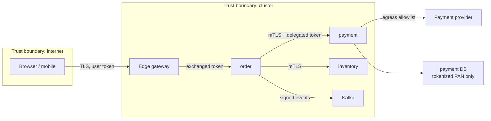
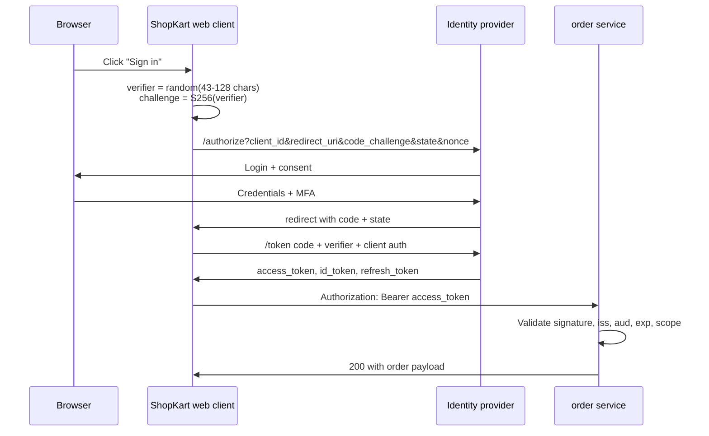
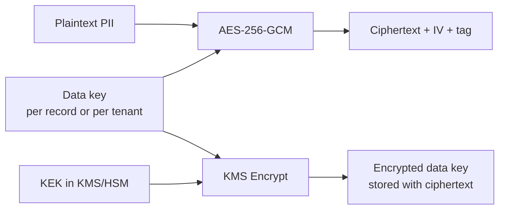

# Phase 7 - Security, Identity and Compliance

> **Weeks:** 42–47 | **Prerequisites:** Phases 2, 3, 6 | **Time budget:** 50–55 hrs  
> **You finish this phase able to:**
> - Model the three identities in a distributed system (end user, workload, workload-on-behalf-of-user) and issue credentials for each
> - Validate a JWT correctly, rotate the signing key, and explain honestly what revocation costs you
> - Enforce authorization per service — not only at the gateway — and prove tenant isolation with a test that fails when the filter is removed
> - Rotate a database credential and a signing key with zero failed requests
> - Map PCI-DSS, GDPR, and SOC 2 obligations onto specific engineering controls and pipeline evidence
> - Read an OWASP API Security Top 10 finding and name the Spring or gateway control that closes it

## Why this phase exists

Splitting a monolith multiplies the attack surface. In ShopKart's monolith, `order` called `payment` with a Java method call: no network, no credential, no wire format, no chance of an attacker sitting between them. After decomposition that same call is an HTTP request across a VPC, authenticated by something, authorized by something else, carrying a token that some service minted and some other service must validate. Ten services become ten deployment credentials, ten TLS configurations, ten sets of dependencies with their own CVEs, and ten teams making independent security decisions at different levels of competence.

The monolith had one authorization implementation. It might have been ugly, but it was one. A 30-service estate with authorization logic copy-pasted into each service has 30 implementations that drift, and the security posture of the whole system is the weakest of them. Attackers do not attack your average service; they attack your worst one and then move laterally using the credentials it holds.

This is why security in microservices has to be a **platform property**. If every team is expected to independently implement token validation, tenant scoping, secret rotation, and audit logging, some will get it wrong — not because they are careless, but because the work is subtle and the failure is silent. Nothing pages you when a list endpoint forgets its tenant filter. The tests pass. The dashboards are green. A customer discovers it, or a researcher does, or nobody does until the data shows up for sale.

The compliance half of this phase is not paperwork bolted on afterwards. PCI-DSS scope, GDPR erasure, and SOC 2 change control all have direct architectural consequences: which service is allowed to see a card number, whether your event store can honour a deletion request, whether your CI pipeline can prove who approved a production change. Retrofitting these onto a running estate is the most expensive engineering work in this roadmap. Designing for them costs a fraction.

## Mental model

**Zero trust in one sentence: the network is not a security boundary; identity is.** Being inside the VPC grants nothing. Every request carries proof of who is calling and on whose behalf, and every service verifies that proof itself rather than trusting that something upstream already did.

**There are three identities, and confusing them is the root of most authorization bugs.** The *end user* (Priya, customer 8815), the *workload* (the `order` pod, instance 7 of deployment `order-v42`), and the *delegated* identity (`order` acting on behalf of Priya, with a narrower scope than Priya's full rights). Authentication answers "who is calling"; authorization answers "may this caller do this to this object"; and the answer usually depends on all three identities at once.

**Credentials should be short-lived, narrowly scoped, and automatically issued.** A static credential that lives in a secret store for two years is a latent breach: it will eventually be logged, screenshotted, pushed to a fork, or inherited by a contractor. A credential that lives 15 minutes and is minted from workload identity has a blast radius measured in minutes.

**Defence in depth means every layer assumes the layer above it failed.** The gateway authenticates, and the service authenticates again. The service authorizes, and the database enforces row-level security. The application encrypts PII, and the disk is encrypted too. Each layer is cheap; the combination is what survives one control being misconfigured.

**Security work that cannot produce evidence does not exist to an auditor, and often does not exist in reality either.** "We review access quarterly" is a claim; a dated export of the access review with approver identities is a control. This is the honest reason compliance frameworks push you toward automation: automated controls emit evidence as a by-product.

## Core concepts

### Threat modelling a microservices system

**Plain English:** Threat modelling is sitting down with a diagram of your system and asking, for each arrow and each box, "how would someone abuse this, and what happens if they do?"

**Analogy:** A shop owner walking the premises before opening: back door, delivery entrance, till, safe, staff keys, CCTV blind spot. They are not predicting a specific burglar; they are enumerating ways in and deciding which ones deserve a lock. Where the analogy breaks down: a shop has a fixed floor plan, while your system's floor plan changes every deploy — which is why threat models must be attached to design review, not done once a year.

**In the real world:** Microsoft's Security Development Lifecycle popularized STRIDE (Spoofing, Tampering, Repudiation, Information disclosure, Denial of service, Elevation of privilege) as the prompt list that makes this systematic rather than vibes-based.

**Mechanics:** Draw the data-flow diagram, mark trust boundaries (points where data crosses from one level of trust to another), then apply STRIDE to each boundary crossing. For ShopKart's checkout path, the crossings are: browser → edge gateway (untrusted input), gateway → `order` (authenticated user context), `order` → `payment` (delegated authority over money), `payment` → PSP (third-party, egress), `order` → Kafka (durable data at rest), and every service → its database.



Applied to the `order` → `payment` arrow, STRIDE yields concrete work items:

| STRIDE element | Question at this boundary | Control |
|---|---|---|
| Spoofing | Can anything in the cluster pretend to be `order`? | mTLS with per-workload certificates; `payment` checks the client SAN, not the source IP |
| Tampering | Can the amount be modified in flight or by the caller? | TLS for the wire; server-side re-computation of the amount from the cart, never trusting the client |
| Repudiation | Can we prove who authorized this charge later? | Append-only audit event with actor, subject, amount, request id, and token `jti` |
| Information disclosure | Does `payment` return more than the caller needs? | Response projections; never echo full PAN or token claims |
| Denial of service | Can one tenant exhaust `payment`'s capacity? | Per-tenant rate limits and bulkheads from [Phase 6](phase-06-resilience-engineering.md) |
| Elevation of privilege | Can a `catalog` credential call `payment`? | Per-caller authorization policy; deny-by-default service-to-service authorization |

**What breaks:** Teams produce a beautiful threat model, file it in Confluence, and never look at it again. The durable version is a short checklist inside the design-review template — trust boundaries, new credentials introduced, new PII fields, new egress destinations — so it runs on every significant change instead of annually.

**The attacker who is already inside.** Assume one pod is compromised: an RCE in an image-processing library, a malicious transitive dependency, a leaked kubeconfig. Ask what that pod can reach. If the answer is "any service, because we allow all traffic inside the namespace, and the database password is in an environment variable", your architecture has no interior. This single question drives most of the controls in this phase: network policy, workload identity, per-service authorization, short-lived credentials, egress control.

### AuthN vs AuthZ, and the three identities

**Authentication (authn)** is proving who you are. **Authorization (authz)** is deciding what you may do. **Analogy:** a passport proves identity (authn); a visa grants entry for a purpose and duration (authz). A valid passport with no visa gets you turned around at the border — which is exactly the response shape you want: `401` means "I do not know who you are", `403` means "I know who you are and the answer is no".

The three identities, and how each is established:

| Identity | Question it answers | Established by | Lifetime | ShopKart example |
|---|---|---|---|---|
| End user | Who is the human? | OIDC login at the identity provider | Session (minutes to hours) | Priya, `sub=user_8815`, logged in via authorization code + PKCE |
| Workload | Which process is calling? | mTLS certificate, SPIFFE SVID, or cloud workload identity | Minutes to hours, auto-renewed | `spiffe://shopkart/ns/prod/sa/order` |
| Delegated | Who is this workload acting for? | Token exchange (RFC 8693), producing a narrowly scoped token | Seconds to minutes | `order` holding a token for `sub=user_8815`, `aud=payment`, `scope=payment:charge` |

Most real authorization decisions need two or three of these. "May this request charge ₹4,999 to Priya's saved card?" requires that the workload is genuinely `order` (not `catalog`), that the user context is genuinely Priya, and that `order` was granted the narrow right to charge — not the full set of rights Priya has in her own session.

### OAuth 2.1 and OIDC: the flows that survive

OAuth 2.0 is a *delegated authorization* framework: it lets a client obtain a token to call an API on a user's behalf. OIDC (OpenID Connect) layers *authentication* on top of it, adding the ID token — a JWT describing who logged in. The single most common conceptual error is treating an OAuth access token as a login receipt: the access token is for the API, the ID token is for the client.

OAuth 2.1 consolidates a decade of best practice and, importantly, removes flows that could not be used safely. RFC 9700 (Best Current Practice for OAuth 2.0 Security) is the companion document that explains why.

| Flow | Status | Use it for | Why |
|---|---|---|---|
| Authorization code + PKCE | Current, default | All user-facing clients: SPA, mobile, server-rendered web | PKCE binds the code to the client that requested it, killing code interception |
| Client credentials | Current | Service-to-service where there is no user | No user context; the client *is* the subject |
| Device code | Current | TVs, CLIs, devices without a browser | Decouples authorization from the constrained device |
| Token exchange (RFC 8693) | Current | Downstream calls on behalf of a user | Produces a narrower token instead of forwarding the original |
| Refresh token (rotating) | Current, with care | Long-lived sessions for confidential and public clients | Must rotate with reuse detection for public clients |
| Implicit | Dead | — | Tokens in URL fragments leak via history, referrer, logs |
| Resource owner password credentials (ROPC) | Dead | — | Trains users to type credentials into apps; blocks MFA and federation |

**Authorization code + PKCE, mechanically.** PKCE (Proof Key for Code Exchange, pronounced "pixy") means the client invents a random `code_verifier`, sends its SHA-256 hash as `code_challenge` on the authorization request, and must present the original verifier when redeeming the code. An attacker who steals the code — from a malicious app registered on the same URL scheme, from a proxy log, from browser history — cannot redeem it without the verifier, which never left the client.



Two parameters in that diagram are not optional. `state` is a random value the client checks on return, defeating CSRF on the redirect. `nonce` is echoed inside the ID token, binding the token to this specific authentication request and defeating replay.

**Scopes vs claims vs roles** — three words teams use interchangeably and should not:

- A **scope** is what the *client* was allowed to ask for: `orders:read`, `payment:charge`. It limits the token, not the user. A token with `orders:read` cannot write orders even if the user is an admin.
- A **claim** is an assertion about the subject carried in the token: `sub`, `email`, `tenant_id`, `employee_grade`. Claims are inputs to a policy decision.
- A **role** is an application-level grouping of permissions: `CUSTOMER`, `SUPPORT_AGENT`, `WAREHOUSE_OPERATOR`. Roles may arrive as a claim, but the mapping from role to permissions belongs to the application or policy engine, not the token issuer.

The practical rule: **scopes bound the client, claims describe the subject, and the service decides.** If you find yourself minting a scope per business rule (`can_refund_over_5000_in_eu`), you have pushed authorization into the issuer and will be re-issuing tokens every time product changes a rule.

### Tokens: JWT, validation, and the revocation problem

A JWT (JSON Web Token) is three base64url segments separated by dots: header, payload, signature. It is *signed*, not encrypted — anyone holding it can read the claims. Put nothing in a JWT you would not print on a postcard.

```
eyJhbGciOiJSUzI1NiIsImtpZCI6IjIwMjYtMDgtcm90YXRpb24ifQ   header:  alg + kid
.eyJpc3MiOiJodHRwczovL2lkLnNob3BrYXJ0LmlvIiwic3ViIjoi…   payload: claims
.NHVCQ0h5T0VkQ2FVS3lKUnk1V3BsY1p3aWZmbFhwR3JHa1RtR2Zk…   signature
```

**The validation checklist.** Every item here exists because skipping it produced a real class of vulnerability:

| Check | Why | Failure if skipped |
|---|---|---|
| Signature verifies against the issuer's public key | Establishes integrity | Forged tokens accepted |
| `alg` is on an allowlist (e.g. `RS256`, `ES256`) | Prevents algorithm confusion | `alg: none` acceptance; RSA public key used as an HMAC secret |
| `iss` matches the expected issuer exactly | Prevents cross-issuer confusion | A token from another tenant's IdP or a self-hosted test IdP is accepted |
| `aud` includes *this* service | Prevents token replay against other APIs | A token minted for `catalog` works on `payment` |
| `exp` / `nbf` with bounded clock skew (60 s typical) | Bounds validity | Expired tokens accepted indefinitely |
| `kid` resolved against cached JWKS | Supports rotation | Rotation breaks all auth, or JWKS is fetched per request |
| Token type / `typ` distinguishes access from ID token | Prevents ID-token-as-access-token | Client-audience token grants API access |
| `sub` present and stable | Identifies the subject | Authorization against a mutable email address |

**Never** accept the `alg` from the token without an allowlist. The canonical attacks: `alg: none` with an empty signature, and switching `RS256` to `HS256` so that a library verifies the HMAC using the *public* key — which the attacker also has, because it is public.

**JWT vs opaque tokens.** An opaque token is a random string; the resource server calls the issuer's introspection endpoint (RFC 7662) to learn what it means.

| Dimension | JWT (self-contained) | Opaque + introspection |
|---|---|---|
| Validation cost | Local signature check, microseconds | Network call per request, 1–20 ms, or cached |
| Revocation | Hard: valid until `exp` | Immediate: issuer stops honouring it |
| IdP coupling | Only for JWKS, cacheable for hours | Hard runtime dependency on the IdP |
| Blast radius of IdP outage | Existing tokens keep working | Authentication fails estate-wide unless cached |
| Payload visibility | Claims readable by anyone holding it | Claims stay at the issuer |
| Size on the wire | 500 B–2 KB, grows with claims | ~30 B |

The common production compromise: **short-lived JWTs for API access** (5–15 minutes) plus **introspection or a revocation list only for high-impact operations** (changing a password, initiating a payout, admin actions). You accept a bounded window of staleness for reads and pay the latency only where the risk justifies it.

**Why JWT revocation is hard.**

**Plain English:** A JWT is like a signed paper ticket. Once you hand it out you cannot un-print it; you can only refuse it at the door, and refusing it at the door means checking a list — which is the thing JWTs were supposed to avoid.

**Analogy:** A festival wristband. Security at each stage checks the wristband's hologram locally, so the gates are fast and work even if the box office is offline. Now revoke one wristband: you must broadcast a "do not admit #8815" list to every stage, and until that list arrives, the holder gets in. Where the analogy breaks: wristbands are physical and hard to copy, whereas a leaked JWT can be used from anywhere in the world simultaneously.

**In the real world:** This is why banking apps log you out aggressively, and why "sign out of all devices" in Google or GitHub takes effect within seconds for session cookies but may take minutes for issued API tokens.

**Mechanics:** Options, in increasing cost: (1) short `exp` — the only mitigation that needs no infrastructure; (2) a deny-list of `jti` values in Redis, checked per request, bounded in size by `exp`; (3) a `token_version` claim compared against a per-user counter in a cache, invalidating all of a user's tokens at once on password change; (4) full introspection for sensitive endpoints; (5) sender-constrained tokens, which do not solve revocation but make a stolen token unusable.

**What breaks:** With 24-hour access tokens and no deny-list, firing a compromised employee or responding to a stolen token means either waiting a day or rotating the signing key and logging out every user. The 3 a.m. version of this is an incident commander asking "can we kill that session?" and the answer being "no".

**Refresh tokens.** A refresh token is a long-lived credential that mints new access tokens. For public clients (SPA, mobile) it must **rotate**: each use returns a new refresh token and invalidates the old one. If an old one is presented again — *reuse detection* — the entire token family is revoked, because either the token was stolen or a race occurred; both deserve re-authentication. Without rotation, a refresh token extracted from local storage is a permanent account takeover.

**Sender-constrained tokens.** A bearer token is a bearer instrument: whoever holds it, uses it. Sender constraining binds the token to a key the client holds.

- **mTLS-bound tokens** (RFC 8705): the token's `cnf` claim carries a thumbprint of the client certificate; the API accepts it only on a TLS connection using that certificate. Standard in Open Banking and FAPI deployments.
- **DPoP** (RFC 9449): the client signs a per-request proof with a key it holds; the token's `cnf` carries the key thumbprint. Works without mTLS infrastructure, which is why it is the pragmatic choice for SPAs and mobile.

**Token lifetime strategy** — the numbers that hold up in review:

| Token | Typical lifetime | Rationale |
|---|---|---|
| Access token (user-facing API) | 5–15 min | Bounds the value of theft; short enough that deny-lists stay small |
| ID token | 5–15 min | Consumed once at login by the client |
| Refresh token (public client, rotating) | 8–24 h idle, 7–30 d absolute | Session continuity without permanence |
| Service-to-service token | 5–10 min | Cheap to mint, minted from workload identity |
| Delegated (exchanged) token | 30–120 s | Needs to survive one call chain, not a session |

### Spring Security as a resource server

Spring Boot 4.1 with Spring Security 7 configures a resource server declaratively; the interesting part is what you add beyond the defaults. This snippet demonstrates JWKS-based validation, an explicit issuer and audience check, authority mapping, and actuator protection. It deliberately omits CORS (covered below) and method security (next snippet).

```java
@Configuration
@EnableWebSecurity
class ResourceServerConfig {

  @Bean
  SecurityFilterChain api(HttpSecurity http, JwtDecoder decoder) throws Exception {
    return http
      .securityMatcher("/api/**")
      .authorizeHttpRequests(a -> a
          .requestMatchers(HttpMethod.GET, "/api/orders/**").hasAuthority("SCOPE_orders:read")
          .requestMatchers(HttpMethod.POST, "/api/orders/**").hasAuthority("SCOPE_orders:write")
          .anyRequest().authenticated())
      .oauth2ResourceServer(o -> o.jwt(j -> j
          .decoder(decoder)
          .jwtAuthenticationConverter(converter())))
      .sessionManagement(s -> s.sessionCreationPolicy(SessionCreationPolicy.STATELESS))
      .csrf(CsrfConfigurer::disable)      // safe ONLY because auth is a header, not a cookie
      .build();
  }

  @Bean
  JwtDecoder jwtDecoder(@Value("${security.issuer}") String issuer,
                        @Value("${security.audience}") String audience) {
    // JWKS is fetched from the issuer's well-known endpoint and cached; kid drives key selection
    NimbusJwtDecoder decoder = JwtDecoders.fromIssuerLocation(issuer);
    decoder.setJwtValidator(new DelegatingOAuth2TokenValidator<>(
        JwtValidators.createDefaultWithIssuer(issuer),          // exp, nbf, iss
        new JwtClaimValidator<List<String>>("aud",              // audience MUST be explicit
            aud -> aud != null && aud.contains(audience)),
        new JwtClaimValidator<String>("typ",                    // reject ID tokens at the API
            typ -> typ == null || "at+jwt".equals(typ))));
    return decoder;
  }

  private JwtAuthenticationConverter converter() {
    JwtGrantedAuthoritiesConverter scopes = new JwtGrantedAuthoritiesConverter();
    scopes.setAuthorityPrefix("SCOPE_");
    scopes.setAuthoritiesClaimName("scope");
    JwtAuthenticationConverter c = new JwtAuthenticationConverter();
    c.setJwtGrantedAuthoritiesConverter(jwt -> {
      var authorities = new ArrayList<GrantedAuthority>(scopes.convert(jwt));
      // roles arrive as a custom claim; map them separately from scopes
      for (String role : jwt.getClaimAsStringList("roles") == null
              ? List.<String>of() : jwt.getClaimAsStringList("roles")) {
        authorities.add(new SimpleGrantedAuthority("ROLE_" + role));
      }
      return authorities;
    });
    return c;
  }
}
```

Two defaults worth calling out. `JwtDecoders.fromIssuerLocation` fetches and caches the JWKS, refreshing when it sees an unknown `kid` — that behaviour is what makes key rotation survivable, and also what makes a JWKS cache stampede possible (war story 2). Disabling CSRF is correct for a stateless, header-authenticated API and *wrong* the moment you accept cookies for authentication.

**Method security** covers the decisions that depend on the object, not the URL:

```java
@Service
class OrderService {

  // Scope check happened in the filter chain; this is the object-level check
  @PreAuthorize("@ownership.isOwner(#orderId, authentication.name) or hasRole('SUPPORT_AGENT')")
  public OrderView get(String orderId) { ... }

  @PreAuthorize("hasAuthority('SCOPE_payment:refund') and #amount <= @limits.refundCeiling(authentication)")
  public Refund refund(String orderId, Money amount) { ... }
}
```

SpEL in `@PreAuthorize` is expressive and untyped; it fails at runtime, not compile time. Keep expressions short, delegate anything non-trivial to a named bean (`@ownership`, `@limits`) that you can unit test, and test the annotations themselves with `@WithMockUser` / `SecurityMockMvcRequestPostProcessors.jwt()` so a refactor that drops an annotation fails the build.

Actuator deserves its own chain — health for probes, everything else authenticated:

```yaml
management:
  endpoints:
    web:
      exposure:
        include: health,info,prometheus   # never "*": env and heapdump leak secrets
  endpoint:
    health:
      show-details: when-authorized
    env:
      enabled: false                      # /actuator/env has printed many a password
  server:
    port: 9090                            # separate port, not exposed by the public ingress
```

### Service-to-service identity

Client credentials with a static secret per service is where most teams start and where many stop. It works, and it has two structural weaknesses: the secret is long-lived, and it must be distributed to every workload. Workload identity solves both by deriving credentials from *what the workload is* rather than *what it knows*.

**Plain English:** Instead of giving each service a password, the platform gives each service a short-lived ID card that it cannot forge and that expires within the hour.

**Analogy:** A hospital badge. It is issued by the badge office after checking your employment record, it opens only the doors your role needs, it expires, and it is re-issued automatically while you work there. Nobody keeps a master password in a drawer. Where the analogy breaks: hospital badges are physical and single-copy, while a workload credential is a file that any process in the same container can read — hence per-pod issuance and tight file permissions.

**In the real world:** Google has publicly described ALTS, its internal mutual authentication system in which every production workload has a cryptographic identity and communication is authenticated and encrypted by default. Kubernetes offers the same shape through projected service account tokens; SPIFFE/SPIRE standardizes it across platforms.

**Mechanics:**

| Mechanism | Identity form | Issued by | Rotation | Best fit |
|---|---|---|---|---|
| mTLS with per-workload certs | X.509 SAN / SPIFFE URI | Internal CA (cert-manager, SPIRE, mesh) | Minutes to hours, automatic | Any cluster; strongest default |
| SPIFFE/SPIRE | `spiffe://trust-domain/ns/prod/sa/order` | SPIRE server, after node+workload attestation | Minutes | Multi-platform, VMs plus Kubernetes |
| Service mesh identity | Mesh-issued cert per sidecar or per node | Istio/Linkerd control plane | Automatic | Estates already running a mesh |
| Cloud workload identity | IAM role bound to a Kubernetes service account | Cloud IAM: IRSA (AWS), Workload Identity (GKE), Azure workload identity | Minutes, SDK-managed | Accessing cloud services without keys |
| OAuth client credentials | `client_id` + secret or private key JWT | Identity provider | Manual unless automated | Crossing organizational boundaries |

The two mechanisms compose: mTLS or SPIFFE establishes *which workload* is calling; an OAuth token carries *on whose behalf*. Using only one of them leaves a gap. mTLS alone cannot express "this is Priya's request"; a forwarded user JWT alone cannot prove the caller is `order` rather than a compromised `catalog`.

**Cloud workload identity, concretely.** IRSA (IAM Roles for Service Accounts) makes the pod's projected service account token exchangeable for AWS credentials: the pod presents the OIDC-signed token to STS, STS validates it against the cluster's OIDC provider, and returns temporary credentials. No access key exists anywhere.

```yaml
apiVersion: v1
kind: ServiceAccount
metadata:
  name: payment
  namespace: prod
  annotations:
    # The role's trust policy restricts sub to system:serviceaccount:prod:payment
    eks.amazonaws.com/role-arn: arn:aws:iam::111122223333:role/shopkart-payment
```

The security of this depends entirely on the role's trust policy pinning the exact `sub` and `aud`. A trust policy that accepts any service account in the cluster grants every pod the payment role — a mistake that looks like working configuration.

**The confused deputy problem.**

**Plain English:** A confused deputy is a trusted middleman that does something for you using its own authority, when it should have been checking whether *you* were allowed to ask.

**Analogy:** You hand a courier a slip saying "collect the parcel for flat 4". The courier has a master key for the building, does not check that you live in flat 4, and hands you someone else's parcel. The courier was not malicious; it used its own authority on your behalf without verifying your right to ask.

**In the real world:** The SSRF class of vulnerabilities is exactly this: a server-side fetcher with network access the user does not have. Capital One's publicly reported 2019 breach followed this shape — a request coaxed a server into using its own instance credentials to reach the cloud metadata service.

**Mechanics:** In service terms: `order` holds a broad credential for `payment`. If `order` accepts an `accountId` from the client and forwards a charge without checking that the authenticated user owns that account, `order` is the deputy. Two defences: (1) never derive authority from client-supplied identifiers — resolve the subject from the verified token; (2) narrow the downstream authority so `order`'s credential cannot do more than the current request needs, which is what token exchange provides.

**Why forwarding the user's JWT everywhere is dangerous.** It is seductively simple: pass `Authorization` through the whole call chain. The costs: every downstream service, including third-tier ones you do not own, now holds a token with the user's *full* scope set and the `aud` of the edge; any one of them can call any other API as that user; logs in ten services now contain a live credential; and a compromised leaf service gets an account-takeover primitive. Token exchange replaces this with a per-hop token: `aud=payment`, `scope=payment:charge`, lifetime 60 seconds, `act` claim recording that `order` is the actor.

```java
// Token exchange (RFC 8693) at the edge or in the caller: narrow the token per hop.
// Omits caching; in production cache by (subject, audience, scope) for ~80% of the token's life.
record ExchangeRequest(String subjectToken, String audience, String scope) {}

Mono<String> exchange(ExchangeRequest r) {
  return webClient.post().uri("/oauth2/token")
    .body(BodyInserters.fromFormData("grant_type", "urn:ietf:params:oauth:grant-type:token-exchange")
        .with("subject_token", r.subjectToken())
        .with("subject_token_type", "urn:ietf:params:oauth:token-type:access_token")
        .with("audience", r.audience())          // payment, not "everything"
        .with("scope", r.scope()))               // payment:charge, not the user's full scope set
    .retrieve().bodyToMono(TokenResponse.class)
    .map(TokenResponse::accessToken);
}
```

### Authorization models: RBAC, ABAC, ReBAC

| Model | Decision input | Strength | Where it breaks |
|---|---|---|---|
| RBAC (role-based) | Roles assigned to the subject | Simple, auditable, universally understood | Role explosion once decisions depend on the object: `SUPPORT_AGENT_EU_TIER2_REFUNDS_UNDER_5K` |
| ABAC (attribute-based) | Attributes of subject, object, action, environment | Expresses context: time, geography, amount, device posture | Hard to answer "who can access X?" — requires evaluating policy over all subjects |
| ReBAC (relationship-based) | Graph of relationships between subjects and objects | Natural for sharing and hierarchy: "members of the org that owns this document" | Needs a purpose-built store; consistency and latency become real design problems |

Most estates need a blend: RBAC for coarse platform rights, ABAC for contextual rules, ReBAC where sharing graphs exist. ShopKart's mix: `roles` for staff tooling, attributes for "refunds above ₹50,000 need a manager", and relationships for seller organizations where staff inherit access to their org's listings.

**ReBAC and the Zanzibar model.** Google published the Zanzibar paper describing the global authorization system behind Drive, Calendar, and others: authorization data stored as relation tuples (`object#relation@subject`), evaluated by graph traversal, with a consistency token ("zookie") so a client can require a decision no older than a known change. OpenFGA and SpiceDB are the open implementations of this model.

**Policy engines and where the decision runs.** OPA (Open Policy Agent) evaluates Rego policies; AWS Cedar is a policy language with a formally analyzable design used by Amazon Verified Permissions.

| Deployment | Latency | Consistency of policy | Failure behaviour | When to choose |
|---|---|---|---|---|
| Embedded library in the service | Microseconds | Whatever the service last loaded | Fails with the service | Latency-critical paths; simple policy |
| Sidecar (OPA next to the app) | 0.1–2 ms, loopback | Bundle pull interval, seconds to minutes | Sidecar down = deny (fail closed) or allow (never do this) | The mainstream choice in Kubernetes |
| Central authorization service | 2–20 ms plus network | Immediately consistent | A hard dependency on the critical path | ReBAC graphs; org-wide audit requirements |

Policy is code: it gets unit tests. Rego has a native test framework; a policy change without a test that fails on the old policy is an unreviewed change.

```rego
# authz.rego - a service may charge only with the right scope, and only for its own tenant
package shopkart.payment

default allow := false

allow if {
  input.action == "charge"
  input.subject.scopes[_] == "payment:charge"
  input.subject.tenant_id == input.resource.tenant_id   # the check that stops cross-tenant reads
  input.resource.amount <= data.limits[input.subject.tier]
}
```

**The single most common critical SaaS bug: the missing tenant filter.** A list endpoint that runs `SELECT * FROM orders WHERE status = ?` without `AND tenant_id = ?` returns other customers' data. It passes every test written by a developer with one tenant in the test database. It does not fail; it over-succeeds. The defences, layered:

```java
// 1. Tenant context established once, from the verified token, never from a header or parameter
final class TenantContext {
  private static final ScopedValue<String> CURRENT = ScopedValue.newInstance();  // JDK 25 scoped values
  static String require() {
    return CURRENT.orElseThrow(() -> new IllegalStateException("no tenant bound"));
  }
  static <T> T with(String tenantId, Supplier<T> body) { return ScopedValue.where(CURRENT, tenantId).call(body::get); }
}

// 2. Repository-level scoping: application code cannot express an unscoped query
public interface OrderRepository extends Repository<Order, String> {
  @Query("select o from Order o where o.tenantId = :#{T(com.shopkart.TenantContext).require()} and o.status = :status")
  List<Order> findByStatus(OrderStatus status);
}
```

```sql
-- 3. Row-level security: the database refuses to return other tenants' rows even if the query forgets
ALTER TABLE orders ENABLE ROW LEVEL SECURITY;
CREATE POLICY tenant_isolation ON orders
  USING (tenant_id = current_setting('app.tenant_id')::uuid);
-- The connection pool must SET app.tenant_id per transaction; a pooled connection that
-- leaks the previous tenant's setting is the failure mode to test for.
```

The fourth layer is the test that actually catches regressions: seed two tenants, authenticate as tenant A, call every list and get endpoint, and assert that no response body contains any tenant B identifier. Generate it over the API surface rather than writing it per endpoint, so new endpoints are covered by default.

### Secrets management

A secret in a container image is public to anyone who can pull the image. A secret in an environment variable appears in `/proc/<pid>/environ`, in crash dumps, in `docker inspect`, in Spring Boot's `/actuator/env` if enabled, and in the exception handler that helpfully logs the environment. A secret in git is permanent: rewriting history does not remove it from forks, clones, or the attacker's scraper that indexed it within 60 seconds of the push.

| Mechanism | Rotation | Kubernetes integration | Notes |
|---|---|---|---|
| HashiCorp Vault | Dynamic secrets with leases; automatic | Agent injector, CSI driver, or Vault SDK | Dynamic database credentials are the standout feature |
| AWS Secrets Manager / GCP Secret Manager / Azure Key Vault | Managed rotation with a rotation function | External Secrets Operator or CSI driver | Least operational burden if you are already on that cloud |
| Kubernetes Secrets | Manual | Native | Base64, not encryption. Enable encryption at rest for etcd and restrict RBAC `get secrets` |
| SOPS / sealed-secrets | Manual, git-based | GitOps-friendly | Encrypted values in git; good for config, weak for high-churn credentials |

**Dynamic database credentials** are the strongest available answer to the leaked-password problem: the application asks Vault for a credential at startup, Vault creates a real Postgres role with a 1-hour lease, the app renews it, and the role is dropped when the lease ends. A credential that leaks into a log is useless within the hour, and every connection is attributable to a lease.

```yaml
# External Secrets Operator: cloud secret -> Kubernetes Secret, refreshed continuously
apiVersion: external-secrets.io/v1
kind: ExternalSecret
metadata:
  name: payment-psp
  namespace: prod
spec:
  refreshInterval: 15m               # bounds how long a rotated value takes to land
  secretStoreRef: { name: aws-secrets, kind: ClusterSecretStore }
  target: { name: payment-psp, creationPolicy: Owner }
  data:
    - secretKey: psp-api-key
      remoteRef: { key: prod/payment/psp, property: apiKey }
```

**Rotation without downtime** requires that two credentials are valid simultaneously. The pattern is the same for database passwords, API keys, and signing keys:

1. Create the new credential; both old and new are valid.
2. Distribute the new credential (ESO refresh, Vault lease renewal, JWKS publication).
3. Wait for propagation: at least one refresh interval plus one cache TTL plus the longest in-flight request.
4. Verify no traffic is using the old credential — this is a metric, not a hope: count authentications by `kid` or by database role.
5. Revoke the old credential.
6. Verify error rates are unchanged.

Skipping step 4 is how rotations become outages. If you cannot *observe* which credential is in use, you cannot safely rotate, and the rotation runbook needs that metric before anything else.

**Detection.** Run `gitleaks` or `trufflehog` in CI on the diff, and as a scheduled full-history scan. Add a pre-commit hook so the secret never reaches the remote. Treat any hit as a rotation event, not a "remove the line" event: once pushed, assume compromised.

### API security: OWASP API Security Top 10 mapped to controls

The OWASP API Security Top 10 (2023 edition) is the most useful checklist in this phase because every item maps to a concrete control in a Spring or gateway estate.

| # | Risk | ShopKart failure it describes | Control |
|---|---|---|---|
| API1 | Broken object level authorization (BOLA/IDOR) | `GET /api/orders/{id}` returns any order | Object-level check on every read and write: `@PreAuthorize` with an ownership bean, plus row-level security |
| API2 | Broken authentication | Token validated without `aud`; no lockout on credential stuffing | Full JWT validation checklist; MFA; rate-limited auth endpoints |
| API3 | Broken object property level authorization | `PATCH /api/users/me` accepts `role=ADMIN` (mass assignment); order response includes internal `costPrice` | Explicit request records and response projections; never bind entities to requests |
| API4 | Unrestricted resource consumption | `?limit=100000`; unbounded GraphQL depth; free SMS on a signup endpoint | Pagination caps, complexity limits, per-tenant quotas, cost-aware rate limits |
| API5 | Broken function level authorization | `/api/admin/refunds` reachable because only `/api/admin/**` for `ROLE_ADMIN` was configured on GET | Deny-by-default matchers; method-level checks; a test asserting anonymous access is 401 for every route |
| API6 | Unrestricted access to sensitive business flows | Bots buy the entire sneaker drop in 400 ms | Business-flow protection: device fingerprinting, queueing, per-identity purchase limits |
| API7 | Server-side request forgery (SSRF) | Image import fetches an attacker-supplied URL | See the dedicated treatment below |
| API8 | Security misconfiguration | Actuator exposed; permissive CORS; stack traces in responses | Hardened defaults in a shared starter; configuration tests |
| API9 | Improper inventory management | `api-v1.shopkart.io` still live, unpatched, pointing at an old service | API catalog from gateway routes; sunset headers; decommission checklist |
| API10 | Unsafe consumption of third-party APIs | Trusting a PSP webhook body without verifying the signature | Signature verification, strict schema validation, timeouts, treat partner data as untrusted input |

**SSRF gets extra depth** because gateways and webhook handlers are the classic victims, and because the cloud metadata service turns a mild SSRF into credential theft.

**Plain English:** SSRF is tricking a server into making a request for you, using the server's network position, which is usually far more privileged than yours.

**Analogy:** Asking a hotel concierge to "fetch the document at this address". You cannot walk into the staff-only room; the concierge can. Where the analogy breaks down: the concierge would notice a suspicious request, whereas an HTTP client happily fetches `http://169.254.169.254/` a thousand times a second.

**In the real world:** Capital One's publicly reported 2019 breach involved a misconfigured web application firewall being used to reach the AWS instance metadata service and obtain role credentials, which were then used to read S3 data. The industry response was concrete: IMDSv2 (session-token-required metadata access, with hop-limit protection) and default-deny egress.

**Mechanics:** Defences, in order of effectiveness:

1. **Do not fetch user-supplied URLs.** If the product requirement is "import an image", accept an upload or a signed URL from your own storage.
2. **Egress through an allowlisted proxy.** The service has no direct internet route; the proxy permits specific hostnames. This survives DNS rebinding, redirects, and clever encodings in a way that application-level validation does not.
3. **Block link-local and private ranges** at the network layer: `169.254.0.0/16`, `127.0.0.0/8`, `10.0.0.0/8`, `172.16.0.0/12`, `192.168.0.0/16`, plus IPv6 equivalents `fd00::/8` and `::1`.
4. **Enforce IMDSv2** and set the hop limit to 1 so a containerized process cannot reach it.
5. **Application-level validation as the last layer**: resolve the hostname, check the resolved IP against the deny-list, then connect to *that IP* with the `Host` header set — otherwise DNS rebinding defeats the check between validation and connection. Disable redirects, or re-validate each hop.

```java
// Egress-restricted HTTP client: validate the resolved address, pin it, and disallow redirects.
// Omits the proxy configuration, which should be the primary control.
HttpClient client = HttpClient.newBuilder()
    .followRedirects(HttpClient.Redirect.NEVER)            // redirects re-open the SSRF hole
    .connectTimeout(Duration.ofSeconds(2))
    .build();

InetAddress resolved = InetAddress.getByName(uri.getHost());
if (resolved.isLoopbackAddress() || resolved.isLinkLocalAddress()
    || resolved.isSiteLocalAddress() || resolved.isAnyLocalAddress()) {
  throw new SecurityException("blocked egress target: " + resolved);
}
```

**What breaks:** The production symptom of SSRF exploitation is dull: a small number of outbound requests to an unusual host or to `169.254.169.254`, often inside a feature nobody looks at, like avatar import. Detection comes from egress logs with a default-deny baseline — without that baseline, the requests look like normal traffic.

### Transport and edge security

**TLS everywhere, including inside the cluster.** "It is the internal network, so we do not need TLS" assumes the network is trustworthy, which is the assumption zero trust exists to reject. A compromised pod, a misconfigured network policy, a cloud provider's shared substrate, or a sniffing sidecar all read plaintext. Use mTLS from a mesh or from cert-manager; the operational cost is now low enough that plaintext internal traffic is a choice, not a constraint.

**Certificate lifecycle** is where TLS actually fails in production: expiry. A certificate with a 90-day life and manual renewal will eventually expire during a holiday. Automate issuance (ACME, cert-manager, mesh-issued identities), alert on 30/14/7 days remaining, and monitor from *outside* the cluster so a broken renewal pipeline is visible.

**CORS, done correctly.** CORS (Cross-Origin Resource Sharing) is a browser mechanism that relaxes the same-origin policy. It is not an authorization control, and the most common mistake makes it an attack aid:

```java
// WRONG: reflecting the caller's Origin with credentials enabled turns any site into a client
config.setAllowedOriginPatterns(List.of("*"));
config.setAllowCredentials(true);

// RIGHT: explicit origins, explicit methods, explicit headers, bounded preflight cache
CorsConfiguration config = new CorsConfiguration();
config.setAllowedOrigins(List.of("https://shopkart.io", "https://seller.shopkart.io"));
config.setAllowedMethods(List.of("GET", "POST", "PATCH", "DELETE"));
config.setAllowedHeaders(List.of("Authorization", "Content-Type", "Idempotency-Key"));
config.setAllowCredentials(true);
config.setMaxAge(Duration.ofMinutes(30));
```

The specification forbids `Access-Control-Allow-Origin: *` together with credentials, so teams "fix" it by reflecting whatever `Origin` arrived — which grants every origin credentialed access. If your API is token-authenticated with no cookies, you do not need `allowCredentials` at all.

**CSRF applies to cookie-authenticated flows**, and only those. If the browser sends credentials automatically, an attacker's page can trigger a state-changing request. Defences: `SameSite=Lax` or `Strict` cookies, plus a synchronizer token or the double-submit pattern for anything cross-site by design. For a `Bearer`-token API there is no ambient credential, so CSRF protection is unnecessary — which is why disabling it in the snippet above is correct *and* why you must re-enable it the day someone adds cookie auth.

**Security headers** at the edge, applied once so every service inherits them:

| Header | Value shape | Stops |
|---|---|---|
| `Strict-Transport-Security` | `max-age=31536000; includeSubDomains; preload` | Protocol downgrade and SSL-stripping |
| `Content-Security-Policy` | `default-src 'self'; frame-ancestors 'none'; object-src 'none'` | XSS impact, clickjacking |
| `X-Content-Type-Options` | `nosniff` | MIME confusion leading to script execution |
| `Referrer-Policy` | `strict-origin-when-cross-origin` | Leaking URLs and tokens in `Referer` |
| `Cache-Control` on authenticated responses | `no-store` | Sensitive data cached by proxies and browsers |

**WAF, bot management, DDoS.** A WAF (web application firewall) buys you a fast mitigation lever during an incident — a rule blocking a specific payload shape while the fix ships — and generic protection against scanning. It does not fix application logic, and its rules occasionally break legitimate traffic; run new rules in count-only mode first. DDoS posture is mostly architectural: anycast edge with upstream scrubbing, aggressive per-IP and per-identity rate limits, static stability so your edge survives an unreachable origin, and load shedding from [Phase 6](phase-06-resilience-engineering.md).

### Supply chain security

The Log4Shell episode of December 2021 was not primarily a vulnerability problem; it was an *inventory* problem. The vulnerability was severe, but the reason it consumed weeks of engineering time everywhere was that almost nobody could answer "where do we run log4j-core, and at what version?" without grepping build files across hundreds of repositories.

| Control | Tooling | What it answers |
|---|---|---|
| SBOM (software bill of materials) | CycloneDX or SPDX, generated per build | What is in this artifact, exactly |
| Dependency scanning (SCA) | OWASP Dependency-Check, Trivy, Grype, Snyk, GitHub Dependabot | Which components have known CVEs |
| Base image hygiene | Distroless or Alpine/UBI-minimal, digest-pinned | How much OS surface ships with the app |
| Artifact signing | Sigstore/cosign, keyless with OIDC identity | Was this image built by our pipeline |
| Provenance | SLSA provenance attestation | From which commit, builder, and inputs |
| Admission control | Kyverno or Gatekeeper verifying signatures | Can an unsigned image run in prod |

**The transitive dependency reality.** A Spring Boot service typically resolves several hundred jars; the ones you named in `pom.xml` are a small fraction. Most CVEs will arrive through dependencies you never chose. Two practical consequences: pin with the Spring Boot BOM so upgrades are coherent, and treat "upgrade the BOM version" as routine monthly work rather than a project. A dependency that cannot be upgraded because of a breaking API change is technical debt with a security interest rate.

**Digest pinning.** `FROM eclipse-temurin:25-jre` is mutable; the tag can move. `FROM eclipse-temurin:25-jre@sha256:…` is not. Pin digests in production Dockerfiles and let a bot raise upgrade pull requests, so image changes are reviewed changes.

```yaml
# Kyverno: refuse unsigned images in prod. The identity is a pipeline, not a person.
apiVersion: kyverno.io/v1
kind: ClusterPolicy
metadata: { name: verify-image-signatures }
spec:
  validationFailureAction: Enforce
  rules:
    - name: check-cosign
      match: { any: [{ resources: { namespaces: ["prod"], kinds: ["Pod"] } }] }
      verifyImages:
        - imageReferences: ["registry.shopkart.io/*"]
          attestors:
            - entries:
                - keyless:
                    subject: "https://github.com/shopkart/*/.github/workflows/release.yaml@refs/heads/main"
                    issuer: "https://token.actions.githubusercontent.com"
```

### Cryptography you must not get wrong

You will not design a cipher. You will make five decisions, and each has one correct answer for the common case.

**Password hashing.** Use argon2id (memory-hard, current recommendation) or bcrypt (well-understood, widely available); never SHA-256, never SHA-256 with a salt, never MD5. General-purpose hashes are fast, and fast is exactly wrong: a GPU computes billions of SHA-256 per second. Argon2id parameters are tuned to your hardware; target roughly 100–250 ms per hash on production CPUs, then load-test the login endpoint, because password hashing is deliberately expensive and a login storm becomes a CPU outage.

```java
// Spring Security 7: delegating encoder allows migration without breaking existing hashes
@Bean
PasswordEncoder passwordEncoder() {
  String idForEncode = "argon2";
  Map<String, PasswordEncoder> encoders = Map.of(
      "argon2", new Argon2PasswordEncoder(16, 32, 1, 19 * 1024, 2),  // salt, hash, parallelism, 19 MiB, 2 iterations
      "bcrypt", new BCryptPasswordEncoder(12));                       // legacy hashes keep verifying
  return new DelegatingPasswordEncoder(idForEncode, encoders);
}
```

**Encryption in transit and at rest.** In transit: TLS 1.3, modern cipher suites, no downgrade. At rest: full-disk or volume encryption is table stakes and protects against a stolen disk — it protects against nothing else, because a compromised application reads plaintext through the filesystem. That is why field-level encryption exists.

**Envelope encryption.** Encrypt data with a data key; encrypt the data key with a key-encryption key held in a KMS or HSM; store the encrypted data key next to the ciphertext. The KMS never sees your data, the data key never persists in plaintext, and rotating the KEK re-wraps data keys without re-encrypting terabytes of data.



**Field-level encryption for PII** protects specific columns — national ID, bank account, phone — from a database dump, a read-replica leak, and an over-broad internal query. The costs are real and must be stated at design time: you cannot index or range-query an encrypted column, equality search requires deterministic encryption (which leaks equality), and every query path needs a decrypt. Encrypt the fields that would appear in a breach notification, not every field.

**Key rotation** needs a key identifier stored with every ciphertext, so old data remains decryptable with the old key while new writes use the new one. Without that identifier, rotation means a full re-encryption migration under a deadline.

**Crypto-shredding for erasure.** GDPR's right to erasure collides with immutable stores: a Kafka topic with 30-day retention, an event-sourced aggregate whose history is the source of truth, an append-only audit log, or last night's backups. Crypto-shredding resolves the collision: store PII encrypted with a per-subject key, keep the keys in a mutable store, and erase by destroying the key. The events remain, structurally intact, and the personal data inside them is irrecoverable ciphertext. Two caveats to state honestly: destroying the key destroys legitimate historical access too, so the model must separate personal fields from operational fields; and regulators expect the approach to be documented, not improvised during a DSAR.

### Compliance mapped to engineering work

**PCI-DSS: reduce scope before you improve controls.** Any system component that stores, processes, or transmits cardholder data is in scope, and in-scope systems attract the full control set: segmentation, logging, quarterly scanning, penetration testing, change control. The architectural lever is *scope reduction*: tokenize. Use a hosted payment form or SDK so the card number goes from the browser directly to the payment provider, which returns a token. ShopKart's `payment` service stores `tok_1Abc…`, never the PAN (primary account number, the 16-digit card number). The card data path is now the browser and the provider; your service holds a reference that is useless elsewhere. Stripe's public documentation of its PCI posture is built on precisely this: keep the sensitive value inside their vault, hand merchants a token, and the merchant's assessment shrinks dramatically.

Network segmentation does the rest: an isolated namespace or account for in-scope workloads, default-deny between segments, and no shared build agents between in-scope and out-of-scope pipelines.

**GDPR has architectural consequences, not just policy ones:**

| Obligation | What it forces in the architecture |
|---|---|
| Lawful basis and purpose limitation | Data catalogue recording why each field is collected; consent state as first-class data, queryable at serving time |
| DSAR (subject access request) | The ability to *find* all data about one person across services — a subject index, or a per-service lookup contract with an SLA |
| Right to erasure | Erasure propagated across services, caches, search indexes, analytics warehouse, and backups; crypto-shredding for immutable stores |
| Data residency | Region-pinned storage and processing; region-aware routing; care with cross-region replication and third-party processors |
| Processor agreements | Inventory of sub-processors — every SaaS that touches personal data, including your log aggregator |
| Breach notification (72 h) | Detection and forensics good enough to determine scope within days, which means logs you can actually search |

The 72-hour clock is the requirement that most often exposes weak observability. If you cannot determine *which* records an attacker accessed, you must notify conservatively, which is worse commercially and reputationally than having the logs.

**HIPAA** (US healthcare) centres on PHI (protected health information): encryption in transit and at rest, access controls with per-user attribution, audit trails of every PHI access, business associate agreements with vendors, and minimum-necessary access. Architecturally it looks like PCI: shrink the set of services that touch PHI, then log every access with the actor's identity.

**SOC 2 turns into pipeline evidence.** The five trust services criteria (security, availability, processing integrity, confidentiality, privacy) are assessed as controls operating over a period. What auditors ask for maps directly onto engineering artifacts:

| Control area | Evidence your platform should emit automatically |
|---|---|
| Change management | Pull request with review approval, linked ticket, CI logs, deployment record tying commit to production |
| Access management | IdP group membership exports, quarterly access review with approvers, joiner/leaver automation logs |
| Logging and monitoring | Retention configuration, alert definitions, sample of investigated alerts |
| Vulnerability management | Scan reports with dates, remediation SLA tracking, exception register with expiry |
| Vendor management | Sub-processor list with their compliance reports |
| Incident response | Postmortems with timeline, customer communication records, tabletop exercise notes |

The engineering goal is that none of this is a scramble: if deployments require a reviewed pull request and the pipeline records commit-to-production lineage, change-management evidence is a query, not a project.

**Audit logging.** An audit log is not an application log. It answers "who did what to which object, when, and from where", it is append-only, and it is retained for years.

| Log | Never log |
|---|---|
| Actor identity (`sub`, workload identity), on-behalf-of chain | Access or refresh tokens, session cookies, `Authorization` headers |
| Action and object identifiers, before/after for sensitive fields | Full PAN, CVV, passwords, private keys |
| Outcome, reason for denial, request id, trace id | Full PII bodies; national identifiers; health data unless the log itself is in scope and controlled |
| Source IP, user agent, device id, tenant id | Anything you would not want in a third-party SaaS |

Tamper-evidence matters when the log is the evidence: write to an append-only store (object storage with object lock, a WORM bucket, or a hash-chained table where each entry includes the hash of the previous one) and keep audit retention separate from operational log retention, which is usually 7–30 days versus 1–7 years.

### Security in the SDLC

Gates that block merges get disabled; gates that inform fast get used. The placement that works:

| Stage | Control | Latency budget |
|---|---|---|
| Local (pre-commit) | Secret scanning, formatting, dependency policy | Under 5 s |
| Pull request | SAST on the diff, SCA on new dependencies, IaC scan, unit tests including authz tests | Under 10 min |
| Post-merge | Full SAST, container scan, SBOM generation, image signing | Under 30 min |
| Pre-production | DAST against a deployed environment, API fuzzing against the OpenAPI spec | Nightly |
| Runtime | Admission control, runtime detection, egress anomaly alerts | Continuous |

Two rules keep this from becoming theatre. **Scan the diff, not the world, on the critical path** — a 40-minute full scan on every pull request trains everyone to click "override". And **every finding has an owner and an expiry**: a suppression with a justification and a 90-day expiry is a decision; a suppression with no expiry is a permanent hole with a comment above it.

Threat modelling belongs in design review, as four questions in the template: what trust boundaries does this cross, what new credentials or permissions does it introduce, what new personal or regulated data does it touch, and what new egress does it need. Security champions — one engineer per team with deeper training and a direct line to the security team — scale review capacity without turning the security team into a bottleneck, provided the role has allocated time rather than being volunteered.

## Production patterns

### Pattern: Gateway authentication with per-service authorization

**What:** The edge gateway terminates TLS, validates the user's token, rejects anonymous and malformed requests, and normalizes identity into a verified token for downstream services. Each service then performs its own authorization — scope checks, object-level checks, tenant checks — treating the gateway as an optimization, not a guarantee.

**When to use:** Always, in any estate with more than a couple of services. It gives you one place to enforce authentication policy (which algorithms, which issuers, which rate limits) and keeps authorization where the domain knowledge lives.

**When NOT to use:** Do not use the gateway as the *only* enforcement point (see the "hard shell, soft centre" anti-pattern). And do not put business authorization rules in gateway configuration — `order` knows whether Priya owns order 4471; the gateway does not and should not.

**Failure modes:**
- A new service is deployed with a route that bypasses the gateway (internal DNS, port-forward, mesh-internal call) and has no authentication of its own. Detection: an unauthenticated probe against every service's cluster-internal address, run continuously.
- The gateway strips the user's `Authorization` header and injects a trusted header like `X-User-Id`; anything that can reach the service directly can now impersonate any user. If you must use headers, the service must reject them unless the connection is mTLS-authenticated as the gateway.
- The gateway validates the token but not the audience, so a token minted for the mobile app's audience works against internal admin APIs.

```yaml
# Spring Cloud Gateway: authenticate at the edge, propagate an exchanged token, strip client-supplied identity
spring:
  cloud:
    gateway:
      default-filters:
        - RemoveRequestHeader=X-User-Id          # never trust client-supplied identity
        - RemoveRequestHeader=X-Tenant-Id
        - TokenRelay                             # relays the exchanged token, not the raw user token
      routes:
        - id: orders
          uri: http://order.prod.svc.cluster.local:8080
          predicates: [Path=/api/orders/**]
          filters:
            - name: RequestRateLimiter
              args:
                redis-rate-limiter.replenishRate: 50      # per-identity, keyed by sub below
                redis-rate-limiter.burstCapacity: 100
                key-resolver: "#{@principalKeyResolver}"
  security:
    oauth2:
      resourceserver:
        jwt:
          issuer-uri: https://id.shopkart.io
          audiences: [shopkart-web, shopkart-mobile]
```

### Pattern: Token exchange at the edge

**What:** At the trust boundary, exchange the user's broad access token for a narrow, short-lived token scoped to the specific downstream audience and operation. Each hop repeats the exchange for its own downstream calls, and the `act` claim records the actor chain.

**When to use:** Any call chain deeper than two hops; any chain that crosses a trust boundary (a partner integration, a lower-trust internal service); anywhere a downstream service should not be able to act with the user's full rights.

**When NOT to use:** For a single-hop API with no fan-out, the exchange adds latency and an IdP dependency for no reduction in blast radius. Also skip it where there is no user context at all — use client credentials from workload identity instead.

**Failure modes:**
- Exchange on every request without caching turns the IdP into a hot dependency: an IdP p99 of 40 ms becomes 40 ms on every call, and an IdP outage becomes a full outage. Cache by `(subject, audience, scope)` for ~80% of the token's lifetime and treat the IdP as a tier-1 dependency with a circuit breaker.
- Exchanged tokens with a 60-second life and a 5-second clock skew produce intermittent `401`s across a fleet with drifting clocks. Run NTP, and monitor skew.
- Exchange implemented but the original token also forwarded "for compatibility", which preserves every risk it was meant to remove.

```java
// Caching token exchange. Cache key includes audience and scope; TTL is a fraction of the token life.
@Component
class DelegatedTokens {
  private final Cache<Key, String> cache = Caffeine.newBuilder()
      .maximumSize(50_000)
      .expireAfterWrite(Duration.ofSeconds(45))    // token lives 60 s; refresh before the edge
      .build();

  record Key(String subject, String audience, String scope) {}

  String forDownstream(Jwt userToken, String audience, String scope) {
    return cache.get(new Key(userToken.getSubject(), audience, scope),
        k -> exchange(userToken.getTokenValue(), audience, scope));   // circuit-broken call to the IdP
  }
}
```

### Pattern: mTLS via service mesh

**What:** The mesh issues a short-lived certificate to every workload, encrypts all service-to-service traffic, and enforces authorization policy on identity rather than IP. Application code contains no TLS handling.

**When to use:** Estates with enough services that per-service certificate plumbing is a real cost, or where a compliance requirement demands encryption in transit everywhere with evidence. Ambient/sidecarless modes (Istio ambient, GA since 1.24; Cilium/eBPF) have materially reduced the per-pod overhead and upgrade burden that made sidecar meshes unpopular.

**When NOT to use:** A five-service estate. The mesh is a distributed system with its own failure modes, upgrade cadence, and debugging surface; below a certain size, cert-manager plus the JDK's TLS support is less total complexity. Never adopt a mesh *primarily* for observability — Micrometer plus OpenTelemetry gives you better application-level telemetry for far less operational cost.

**Failure modes:**
- Certificate expiry inside the mesh, usually caused by a control-plane outage during renewal: every connection fails at once, across every service. This is the mesh's correlated-failure mode and the reason to alert on control-plane health and certificate age, not just on request errors.
- `PERMISSIVE` mTLS mode left enabled after migration, so plaintext still works and nobody notices until an audit. Move to `STRICT` per namespace and verify with a plaintext probe.
- Policy expressed on namespaces rather than identities, which silently permits anything scheduled into the namespace.

```yaml
apiVersion: security.istio.io/v1
kind: PeerAuthentication
metadata: { name: default, namespace: prod }
spec:
  mtls: { mode: STRICT }              # plaintext is refused, not tolerated
---
apiVersion: security.istio.io/v1
kind: AuthorizationPolicy
metadata: { name: payment-callers, namespace: prod }
spec:
  selector: { matchLabels: { app: payment } }
  action: ALLOW
  rules:
    - from:
        - source:
            principals: ["cluster.local/ns/prod/sa/order"]   # identity, not IP range
      to:
        - operation: { methods: ["POST"], paths: ["/v1/charges*"] }
```

### Pattern: OPA sidecar authorization

**What:** Authorization decisions are evaluated by a policy engine running as a sidecar. The application sends subject, action, and resource attributes over loopback; the sidecar returns allow or deny plus a reason. Policy bundles are distributed centrally and versioned.

**When to use:** When the same authorization rules must hold across many services and the rules change more often than the services deploy; when auditors need to see one authoritative policy; when policy authors are not the service owners.

**When NOT to use:** For simple ownership checks (`order.userId == subject`) — an in-process check is faster and clearer. And not on a path with a sub-millisecond budget unless you have measured the loopback call under load.

**Failure modes:**
- Fail-open on sidecar error. If the engine is unreachable and the application defaults to allow, an OPA crash becomes an authorization bypass. Default to deny, and page on the deny-because-unavailable metric so the outage is visible rather than silent.
- Stale bundles: a revoked permission stays effective until the next bundle pull. Monitor bundle age per pod and alert above a threshold, because a pod that silently stops pulling is invisible otherwise.
- Attribute drift: the policy expects `resource.tenant_id` and the service starts sending `resource.tenantId`. Rego evaluates the missing field as undefined and denies — or worse, a permissive rule matches. Contract-test the input document.

```java
// Deny on any error: unavailability must never mean permission.
AuthzDecision decide(AuthzInput input) {
  try {
    return opa.post().uri("/v1/data/shopkart/payment/allow")
        .body(input).retrieve().body(AuthzDecision.class);
  } catch (RuntimeException e) {
    meterRegistry.counter("authz.unavailable").increment();   // alert on this, it is an outage signal
    return AuthzDecision.DENY;
  }
}
```

### Pattern: Tenant-scoped repository

**What:** Tenant scoping is structural: the data access layer injects the tenant predicate from a verified context, and there is no code path that can express an unscoped query for tenant-owned tables.

**When to use:** Every multi-tenant system with shared tables. This is the highest-value control in this entire phase relative to its cost.

**When NOT to use:** Where tenancy is physical — a database or schema per tenant — the connection itself carries the scope. Even then, keep the context so that cross-tenant operations must be explicit.

**Failure modes:**
- Native queries and reporting endpoints bypass the layer. Enforce with a test that scans for `@Query(nativeQuery = true)` on tenant-owned entities and requires an explicit allowlist annotation with a comment.
- Background jobs and Kafka consumers run with no HTTP request and therefore no tenant context. They must bind the tenant from the message, explicitly, and fail loudly when it is absent — never fall back to "no filter".
- Cache keys that omit the tenant, so tenant B reads tenant A's cached response. Include the tenant in every cache key, and prefix the key namespace per tenant.

```java
// Hibernate filter applied globally; the tenant comes from the token, never from the request body
@Entity
@FilterDef(name = "tenant", parameters = @ParamDef(name = "tenantId", type = String.class))
@Filter(name = "tenant", condition = "tenant_id = :tenantId")
class Order { ... }

@Component
class TenantFilterActivator {
  @PersistenceContext EntityManager em;

  void activate() {
    em.unwrap(Session.class)
      .enableFilter("tenant")
      .setParameter("tenantId", TenantContext.require());   // throws if unbound: fail closed
  }
}
```

### Pattern: Row-level security as the last line

**What:** The database enforces tenant isolation itself. Each connection sets a session variable identifying the current tenant, and PostgreSQL policies restrict visible rows. Application bugs cannot leak rows the database will not return.

**When to use:** Shared-table multi-tenancy where a leak is a reportable breach — fintech, healthcare, B2B SaaS with contractual isolation guarantees.

**When NOT to use:** Where the application legitimately performs cross-tenant aggregation (platform analytics); give those workloads a separate role that bypasses the policy, explicitly and auditably. Also weigh the planner cost: RLS predicates participate in query planning and can change plans on large tables, so measure before enabling on your hottest table.

**Failure modes:**
- Connection pooling leaks the setting. A pooled connection retains `app.tenant_id` from the previous transaction; if the next borrower forgets to set it, it inherits the wrong tenant. Set it inside the transaction with `SET LOCAL` so it resets on commit or rollback.
- The application connects as the table owner or a superuser, which bypasses RLS silently unless `FORCE ROW LEVEL SECURITY` is set. Use a dedicated non-owner role.
- Migrations create a new table and nobody enables RLS on it. Add a startup assertion listing tenant-owned tables without a policy, and fail the deployment.

```sql
-- Non-owner application role, forced policy, transaction-scoped setting
CREATE ROLE app_rw NOSUPERUSER;
ALTER TABLE orders ENABLE ROW LEVEL SECURITY;
ALTER TABLE orders FORCE ROW LEVEL SECURITY;
CREATE POLICY tenant_rw ON orders
  USING (tenant_id = current_setting('app.tenant_id', true)::uuid)
  WITH CHECK (tenant_id = current_setting('app.tenant_id', true)::uuid);  -- also blocks cross-tenant writes

-- Per transaction, from the pool:
BEGIN;
SET LOCAL app.tenant_id = '8f1c…';   -- LOCAL: discarded at COMMIT, cannot leak to the next borrower
SELECT * FROM orders WHERE status = 'PAID';
COMMIT;
```

### Pattern: Encrypted PII columns with a key per tenant

**What:** Sensitive fields are encrypted in the application with a data key derived per tenant (or per subject), wrapped by a KMS key. The ciphertext carries a key identifier so rotation and shredding are possible.

**When to use:** National identifiers, bank details, health fields, anything whose exposure triggers notification. Also the enabling mechanism for crypto-shredding under GDPR.

**When NOT to use:** On columns you must search, sort, or join on — unless you accept deterministic encryption and its equality leakage, or a separate blind-index column. Do not encrypt everything; the operational cost lands on every query path and every debugging session.

**Failure modes:**
- KMS latency or throttling on a bulk read path. Cache unwrapped data keys in memory with a short TTL, and batch operations; a report that decrypts 100,000 rows one KMS call at a time will time out.
- Losing the key identifier, which makes rotation a full-table migration.
- Logging the decrypted value one layer above the encryption, which reintroduces the exposure you paid for.

```java
// Envelope encryption with a per-tenant data key and an explicit key id stored alongside the ciphertext
record Encrypted(String keyId, byte[] iv, byte[] ciphertext) {}

Encrypted encrypt(String tenantId, String plaintext) {
  DataKey dk = keyCache.get(tenantId, k -> kms.generateDataKey(kekAlias(tenantId)));  // plaintext + wrapped
  byte[] iv = new byte[12];
  RANDOM.nextBytes(iv);                                     // GCM: never reuse an IV with the same key
  Cipher c = Cipher.getInstance("AES/GCM/NoPadding");
  c.init(Cipher.ENCRYPT_MODE, dk.plaintextKey(), new GCMParameterSpec(128, iv));
  return new Encrypted(dk.keyId(), iv, c.doFinal(plaintext.getBytes(UTF_8)));
}
```

### Pattern: Short-lived database credentials

**What:** The application requests a database credential at startup from Vault or a cloud IAM integration; the credential is a real database role with a lease of minutes to hours, renewed automatically and revoked at the end.

**When to use:** Any production database holding regulated or customer data. It removes the single most valuable static secret in most estates.

**When NOT to use:** Where the database does not support dynamic role creation, or where connection churn is extreme and role creation becomes the bottleneck. In those cases, rotate a static credential on a schedule with the dual-credential procedure and accept the weaker posture explicitly.

**Failure modes:**
- Lease expiry mid-connection: existing connections are killed when the role is dropped. The client must renew before expiry *and* the pool must handle authentication failures by reconnecting rather than serving errors. Test this by deliberately expiring a lease in staging.
- A secrets-manager outage during a deployment prevents new pods from starting, so an unrelated outage becomes a deploy freeze. Keep the previous credential valid long enough to cover the outage window, and keep a documented break-glass credential in a sealed store.
- Role sprawl: thousands of orphaned roles from failed revocations, eventually hitting database limits. Monitor role count.

```yaml
# Vault dynamic database credentials via the agent injector
annotations:
  vault.hashicorp.com/agent-inject: "true"
  vault.hashicorp.com/role: "payment"
  vault.hashicorp.com/agent-inject-secret-db: "database/creds/payment"
  vault.hashicorp.com/agent-inject-template-db: |
    {{ with secret "database/creds/payment" -}}
    spring.datasource.username={{ .Data.username }}
    spring.datasource.password={{ .Data.password }}
    {{- end }}
```

### Pattern: Signed webhooks

**What:** Inbound webhooks from partners are authenticated by an HMAC signature over the raw body plus a timestamp, verified in constant time, with replay protection and idempotent handling. Outbound webhooks you send are signed the same way.

**When to use:** Every webhook endpoint. A webhook is an unauthenticated public endpoint that mutates your state; the signature is the only thing standing between a partner event and an attacker's forged one.

**When NOT to use:** Where mTLS is available between you and the partner, the client certificate is a stronger control — but keep signature verification as well, because TLS terminates at your edge and the body can pass through proxies that you do not fully control.

**Failure modes:**
- Verifying the parsed and re-serialized body rather than the raw bytes. Any whitespace or key-order change breaks the signature; teams then "temporarily" disable verification.
- No timestamp check, so a captured request can be replayed forever. Reject anything older than a few minutes and de-duplicate on the event id.
- Non-constant-time comparison, leaking the signature byte by byte through timing.
- Returning a `500` on a business error, which causes the partner to retry the same event for hours. Acknowledge receipt, then process asynchronously.

```java
@PostMapping(path = "/webhooks/psp", consumes = "application/json")
ResponseEntity<Void> receive(@RequestHeader("X-Signature") String signature,
                             @RequestHeader("X-Timestamp") long timestamp,
                             @RequestBody byte[] rawBody) {           // raw bytes, not a parsed DTO
  if (Math.abs(Instant.now().getEpochSecond() - timestamp) > 300) {
    return ResponseEntity.status(HttpStatus.BAD_REQUEST).build();     // replay window: 5 minutes
  }
  byte[] expected = hmacSha256(secret, (timestamp + ".").getBytes(UTF_8), rawBody);
  if (!MessageDigest.isEqual(expected, HexFormat.of().parseHex(signature))) {  // constant time
    return ResponseEntity.status(HttpStatus.UNAUTHORIZED).build();
  }
  events.enqueueIdempotent(rawBody);       // de-duplicated by event id; processing happens off-request
  return ResponseEntity.accepted().build();
}
```

### Pattern: Audit event stream

**What:** Security-relevant actions are emitted as structured audit events to a dedicated, append-only stream, separate from application logs, with its own retention, access control, and schema.

**When to use:** Any system with regulated data, staff tooling that can act on customer data, or SOC 2 / HIPAA obligations. The value shows up during an incident, when the question is "exactly which records did this account touch?"

**When NOT to use:** Do not route audit events through the same pipeline as debug logs, where sampling, retention limits, and broad read access all work against you. And do not make audit writes a blocking dependency of the business transaction unless the regulation requires it — use the outbox pattern from [Phase 4](phase-04-data-and-consistency.md) so the audit record commits atomically with the state change and ships asynchronously.

**Failure modes:**
- Sampling applied to audit events by a shared logging configuration, which quietly destroys their evidentiary value.
- Audit events containing tokens or full PII, turning the audit store into the highest-value target in the estate and often into a compliance violation of its own.
- Missing on-behalf-of context: an event that records only "service account `support-api` deleted address 8815" cannot answer which agent did it.

```java
// Emitted through the transactional outbox so the audit record cannot diverge from the state change
record AuditEvent(
    String eventId, Instant occurredAt,
    String actorId, String actorType,          // user | workload | workload_on_behalf_of
    String onBehalfOf,                          // null for direct workload actions
    String tenantId, String action,             // e.g. "order.refund"
    String resourceType, String resourceId,
    String outcome, String reason,              // ALLOW | DENY plus policy reason
    String requestId, String traceId,           // ties the audit event to Phase 8 telemetry
    String sourceIp, String userAgent) {}
```

## How big tech does it

### Google: BeyondCorp, ALTS, and Zanzibar

Google published the BeyondCorp papers describing the shift from perimeter VPN access to access decisions based on device and user state: every request to an internal application is authenticated and authorized against user identity, device inventory, and device posture, with no privilege granted by network location. This is the origin of practical zero trust, and it is why the model is framed around *identity and device* rather than firewalls.

For service-to-service traffic Google has publicly described **ALTS** (Application Layer Transport Security), a mutual authentication and encryption system in which production workloads carry cryptographic identities and communication is authenticated by default rather than by opt-in configuration. The transferable control is not "build ALTS" — it is that mutual authentication must be a platform default, because anything opt-in will be un-opted somewhere.

**Zanzibar** is Google's published global authorization system: relation tuples, graph evaluation, and a consistency token that lets a caller demand a decision no older than a specific change. The transferable idea is that authorization *data* — who is related to what — is a first-class datastore problem with its own consistency requirements, not a table you bolt onto each service. OpenFGA and SpiceDB let a normal team adopt the model without building it.

**Transferable control:** make mutual authentication and authorization platform defaults; treat authorization relationships as data with explicit consistency semantics.

### Netflix: identity tooling and secrets as infrastructure

Netflix has described publicly its internal PKI and identity work for workloads, and its long-standing position that credential distribution should be automated infrastructure rather than a developer task. The historically important artifact is cultural: Netflix's security team built paved-road tooling (libraries, sidecars, defaults) so that the secure path was also the easy path, rather than publishing policy and auditing violations.

**Transferable control:** ship a hardened internal starter — the Spring Boot starter that configures the resource server, mTLS, audit logging, and secret loading correctly — and measure adoption. A control that requires each team to implement it will be implemented at seven different quality levels.

### Stripe: PCI posture through tokenization

Stripe's documented model keeps the card number inside Stripe's vault: the browser or mobile SDK sends the PAN directly to Stripe, the merchant receives a token, and the merchant's systems never store or transmit cardholder data. That single architectural decision moves most merchants from the full PCI-DSS assessment burden to a drastically reduced one.

Stripe has also published its rate-limiter design and its approach to idempotency keys, both of which are security controls as much as reliability ones: idempotency prevents duplicate charges from retries, and rate limits prevent a credential-stuffing or card-testing campaign from using your checkout endpoint as an oracle.

**Transferable control:** reduce scope before hardening. Ask which service *needs* the sensitive value; usually the answer is "none of ours, if we tokenize at the edge".

### Uber: the 2016 breach and credentials in source

Uber's 2016 breach is publicly documented and widely written about: attackers obtained credentials that gave access to a third-party storage account, and data on roughly 57 million riders and drivers was exfiltrated. The follow-on legal case, in which a former security executive was convicted for obstruction relating to the handling of the incident, made a second point loudly: the disclosure process is part of the control set, not a PR afterthought.

**Transferable control:** two things. Static credentials with broad access to a data store must not exist — use workload identity and short-lived credentials. And the incident-response runbook must include who decides on regulatory notification, with a defined clock.

### Capital One: SSRF, metadata, and egress

Capital One's 2019 breach is publicly reported as an SSRF-class attack that reached cloud instance metadata, obtained role credentials, and used them to read data from storage buckets; a former cloud employee was convicted in connection with it. The industry's response was structural rather than cosmetic: IMDSv2 requiring a session token and defaulting to a hop limit that blocks container access, plus wide adoption of default-deny egress and tighter IAM policies scoped to specific buckets and prefixes.

**Transferable control:** assume SSRF exists somewhere in your estate, then make it worthless — IMDSv2 enforced, egress default-deny through an allowlisting proxy, and IAM roles narrow enough that stolen credentials read one prefix rather than one account.

### Monzo: policy as code and public security engineering

Monzo's engineering blog has described their move to explicit service-to-service authorization rules in a bank running a large microservices estate, replacing implicit "anything in the platform can call anything" with a declarative allowlist of which services may call which endpoints, generated and enforced from configuration. They have also written publicly about their approach to least-privilege access for engineers.

**Transferable control:** an explicit, reviewable, machine-enforced service call graph. A side benefit that pays for the work: the allowlist is documentation of your architecture that cannot go stale, because traffic fails when it is wrong.

### AWS: least privilege as a practice, not an aspiration

AWS's own guidance and the IAM feature set encode a specific workflow: start from a deny-all baseline, grant narrow actions on specific resources, use IAM Access Analyzer to find over-broad grants and unused permissions, and prefer role assumption with short-lived credentials (IRSA in EKS) over access keys. Service control policies give you a guardrail layer that individual account administrators cannot override.

**Transferable control:** the guardrail/permission split. Platform-wide prohibitions (no public buckets, no unencrypted volumes, no IMDSv1) belong in a layer teams cannot edit; day-to-day permissions belong to teams within those guardrails.

### What a 10-person team should copy first

Not a mesh, not Zanzibar, not a policy engine. In this order:

1. A hardened resource-server starter with full JWT validation, used by every service.
2. Tenant scoping in the data layer plus the cross-tenant regression test.
3. Secrets out of git and out of environment variables, with rotation tested once.
4. Secret scanning and dependency scanning in CI, with an owner for findings.
5. An audit event stream for staff actions on customer data.

Those five cover the failure modes that actually produce breach notifications at small scale.

## Best-practice checklist

Evaluate your estate against this list. Each "no" is either an accepted risk with a named owner or an incident waiting for a trigger.

**Identity and authentication**

- [ ] Every service validates tokens itself; no service trusts an upstream header for identity
- [ ] `iss`, `aud`, `exp`, `nbf`, `alg` allowlist, and `kid` are all checked; validation is in a shared library, not per service
- [ ] JWKS is cached with a bounded refresh, and an unknown `kid` triggers at most one coordinated refresh per instance
- [ ] ID tokens are rejected at APIs; access tokens are rejected at the client's ID-token consumption point
- [ ] Only authorization code + PKCE, client credentials, device code, and token exchange are enabled at the IdP; implicit and ROPC are disabled
- [ ] Refresh tokens rotate, with reuse detection that revokes the token family
- [ ] MFA is enforced for staff and for customer account-recovery flows; authentication endpoints are rate limited per identity and per IP
- [ ] Access token lifetime is 15 minutes or less; a documented mechanism exists to invalidate a session within one minute

**Workload identity and service-to-service**

- [ ] Every workload has a cryptographic identity issued by the platform (mTLS certificate, SVID, or cloud workload identity); no shared service accounts
- [ ] Service-to-service authorization is deny-by-default and expressed on identity, not IP or namespace
- [ ] Downstream calls use exchanged, narrowly scoped tokens; the user's original token is not forwarded past the first hop
- [ ] No static cloud access keys exist in any workload; IRSA or equivalent is used everywhere
- [ ] Certificate expiry is monitored externally with alerts at 30, 14, and 7 days

**Authorization**

- [ ] Every object-returning endpoint performs an object-level authorization check; there is a test per endpoint asserting another user gets `403` or `404`
- [ ] Authorization failures are logged with subject, object, action, and policy reason
- [ ] Multi-tenant queries are scoped structurally in the data layer, with row-level security as a second layer
- [ ] A cross-tenant regression test runs in CI and fails when a tenant filter is removed
- [ ] Policy is versioned, reviewed, and unit-tested; policy engines fail closed on error
- [ ] Admin and internal endpoints are separately authenticated and not reachable from the public ingress

**Secrets**

- [ ] No secrets in images, git, environment variables, or ConfigMaps
- [ ] Database credentials are dynamic and short-lived, or rotated on a schedule with a dual-credential procedure
- [ ] A metric shows which credential or key version is in active use, so rotation can be verified before revocation
- [ ] Secret scanning runs pre-commit, on pull requests, and against full history on a schedule
- [ ] Every secret has a named owner and a documented rotation procedure that has been executed at least once
- [ ] `/actuator/env`, `/actuator/heapdump`, and `/actuator/configprops` are disabled or protected in production

**Transport and edge**

- [ ] TLS 1.2+ externally and mTLS internally; plaintext internal traffic is refused, not merely discouraged
- [ ] HSTS, CSP, `nosniff`, and `Referrer-Policy` are applied at the edge; authenticated responses are `no-store`
- [ ] CORS lists explicit origins; wildcard origins with credentials are impossible by configuration
- [ ] CSRF protection is enabled for every cookie-authenticated flow
- [ ] Egress is default-deny through an allowlisting proxy; IMDSv2 is enforced with hop limit 1
- [ ] Per-tenant and per-identity rate limits exist on write endpoints and on sensitive business flows

**Supply chain**

- [ ] Every build produces an SBOM stored with the artifact
- [ ] Images are signed, and admission control refuses unsigned images in production
- [ ] Base images are minimal and digest-pinned; rebuilds happen at least monthly
- [ ] Dependency scanning gates pull requests on new critical findings; existing findings have SLAs and an exception register with expiry dates
- [ ] You can answer "where does library X version Y run?" in minutes, from the SBOM index

**Data protection**

- [ ] Passwords are hashed with argon2id or bcrypt at production-tuned cost; the login endpoint has been load-tested at that cost
- [ ] Regulated fields are encrypted at the application layer with envelope encryption and a stored key identifier
- [ ] A per-subject or per-tenant key model supports crypto-shredding for erasure
- [ ] Backups are encrypted, and a restore has been tested this quarter
- [ ] Non-production environments contain no real customer data, or masked data only

**Logging, audit, and compliance evidence**

- [ ] No tokens, passwords, PANs, or full PII appear in application logs; a CI check greps for the obvious shapes and a sampling job checks production
- [ ] Security-relevant actions emit audit events with actor, on-behalf-of, object, outcome, and trace id
- [ ] Audit storage is append-only with multi-year retention, separate from operational logs
- [ ] Change management evidence (review, approval, commit-to-deploy lineage) is produced automatically by the pipeline
- [ ] Access reviews are scheduled, and joiner/mover/leaver changes are automated from the IdP
- [ ] The incident runbook names who decides on regulatory notification, with the 72-hour GDPR clock written down

## Anti-patterns and war stories

### Anti-pattern: Hard shell, soft centre

**What it looks like:** The gateway validates tokens. Internal services accept any request that reaches them, often reading `X-User-Id` from a header. The justification is always the same: "only the gateway can reach them."

**Why it is wrong:** "Only the gateway can reach them" is a claim about network configuration that is true until someone adds a NodePort, a debug ingress, a port-forward in an incident, a mesh-internal call from a new service, or a compromised pod in the same namespace. One SSRF or one compromised sidecar converts into full impersonation of any user.

**Fix:** Every service validates the token. Where headers must carry context, require mTLS and verify the peer identity is the gateway. Run a continuous probe that calls each service's internal address without credentials and alerts on anything other than `401`.

### Anti-pattern: One shared service account for everything

**What it looks like:** A single `app-prod` database user, a single Kafka principal, one cloud role attached to every node, one `client_id` shared by twelve services because creating clients required a ticket.

**Why it is wrong:** You lose attribution and you lose containment. Audit logs say `app-prod` did it, which is useless during an incident. Least privilege is impossible because the shared principal needs the union of all permissions, so the least important service holds the most dangerous grant.

**Fix:** One identity per workload, issued automatically. If creating an identity requires a human, automate it; friction is what produced the shared account.

### Anti-pattern: JWT as a session, with 24-hour expiry and no revocation

**What it looks like:** Access tokens valid for a day, stored in `localStorage`, no deny-list, no `token_version` claim, no introspection.

**Why it is wrong:** Logout is cosmetic. Password change does not invalidate anything. A stolen token is valid for a day from anywhere in the world. Firing an employee requires a key rotation that logs out every user.

**Fix:** Short access tokens, rotating refresh tokens, and one invalidation mechanism — `jti` deny-list or `token_version` — that you have actually tested.

### Anti-pattern: Secrets in ConfigMaps and environment variables

**What it looks like:** `DB_PASSWORD` in a ConfigMap, because Secrets "needed extra setup". Then a `NullPointerException` handler logs the environment, and the password lands in the log aggregator, which is a third-party SaaS with 200 people having read access.

**Why it is wrong:** ConfigMaps are unencrypted, broadly readable, and frequently committed to git in GitOps repositories. Environment variables leak through crash dumps, `/proc`, actuator endpoints, and error handlers.

**Fix:** Mount secrets as files from a secret manager via CSI or the External Secrets Operator, keep them out of the environment, and disable `/actuator/env`.

### Anti-pattern: Logging tokens, PANs, and PII

**What it looks like:** `log.info("request headers: {}", headers)` during a debugging session, shipped to production. Or a `@ToString` on an entity containing an encrypted field's plaintext.

**Why it is wrong:** Logs are the most widely accessible data store in most companies, are replicated to third parties, and are retained beyond the lifetime of the credential. Logging a PAN also drags your log pipeline into PCI scope.

**Fix:** A logging policy enforced by code — a redacting layout for known-sensitive keys, `@ToString.Exclude` on sensitive fields, a CI check for header and body logging, and a sampling job that scans production logs for card-number and JWT shapes.

### Anti-pattern: Custom crypto

**What it looks like:** A homegrown "encryption" using XOR with a static key, ECB mode because it was the default, a hand-rolled token format with a truncated MD5 "signature", or a random token generated with `java.util.Random`.

**Why it is wrong:** All of these fail to standard attacks that are decades old. `Random` is predictable from a couple of outputs; ECB leaks structure; truncated hashes are forgeable.

**Fix:** AES-GCM through a vetted library or a KMS SDK, `SecureRandom` for anything security-relevant, and standard token formats. The only acceptable custom crypto is choosing which library call to make.

### Anti-pattern: Permissive CORS with credentials

**What it looks like:** `Access-Control-Allow-Origin` reflecting the request `Origin` and `Access-Control-Allow-Credentials: true`, added to fix a frontend error during a demo.

**Why it is wrong:** Any website a user visits can now make credentialed requests to your API and read the responses.

**Fix:** Explicit origin list. If your API uses bearer tokens and no cookies, disable credentials entirely.

### Anti-pattern: Long-lived static cloud keys

**What it looks like:** An access key pair created in 2021, stored in CI, shared through a password manager, used by three pipelines and one laptop.

**Why it is wrong:** No expiry, no attribution, and it will eventually appear in a public repository or a support ticket. Key age is a direct measure of accumulated exposure.

**Fix:** OIDC federation for CI (GitHub Actions and GitLab both support it), workload identity for pods, and a scheduled report of any key older than 90 days.

### Anti-pattern: Authorization duplicated across 30 services

**What it looks like:** Each service implements its own interpretation of "can this user refund this order", with subtly different rules. A policy change requires 30 pull requests, and three services are missed.

**Why it is wrong:** The system's effective policy is the union of the weakest implementations, and nobody can state what it is.

**Fix:** Centralize the *policy* (shared library, sidecar, or service) while keeping *enforcement* distributed. One definition, many enforcement points, plus a test suite the policy owns.

### Anti-pattern: "Internal network, so no TLS" and "certificate validation disabled temporarily"

**What it looks like:** Plaintext HTTP between services; a `TrustManager` that accepts everything, added to get past a self-signed certificate in staging and never removed.

**Why it is wrong:** The first assumes the network is a trust boundary. The second silently disables authentication of the server, making machine-in-the-middle trivial, and it is invisible in code review unless you know the idiom.

**Fix:** mTLS by default with automated issuance; a CI check that fails on `TrustManager` implementations with empty `checkServerTrusted`, `HostnameVerifier` returning `true`, and `ssl.verification=none` in configuration.

### War story 1: The missing tenant filter

A B2B ShopKart seller-portal team shipped a new endpoint: `GET /api/seller/orders?status=PENDING`, backed by a repository method `findByStatus(status)`. The existing endpoints all took a seller id in the path, and the developer reasonably assumed the framework "handled" tenancy because it did in the other methods — those had been written with an explicit `tenantId` parameter.

**Detection:** Not by monitoring. Nine days after release, a seller opened a support ticket asking why their pending-orders list contained SKUs they did not sell and a buyer name they did not recognize. The support agent escalated it as a data bug. It became a security incident three hours later.

**Diagnosis:** The query returned every pending order across all 4,100 sellers, capped at the default page size of 50. Because ordering was by `created_at DESC`, most sellers saw a plausible-looking list dominated by the busiest sellers, which is why it took nine days: the response looked like data, not like a breach. Logs showed 61 distinct sellers had called the endpoint, and the response bodies were not logged, so determining exactly what each had seen required replaying the query against a point-in-time database snapshot for each request timestamp.

**Fix:** Immediate: the endpoint was disabled at the gateway within 20 minutes of triage. Same day: the repository method was made tenant-scoped and RLS was enabled on the `orders` table with the application connecting as a non-owner role. Within the week: a generated contract test that authenticates as tenant A and asserts that no response from any endpoint in the OpenAPI spec contains a tenant B identifier. That test, run against the pre-fix commit, fails — which is the only reason to believe it will catch the next occurrence.

**Lesson:** Tenant isolation cannot depend on developers remembering a parameter. It must be structural (the data layer cannot express an unscoped query), backed by the database (RLS), and verified by a test that is generated from the API surface rather than written per endpoint. The secondary lesson is about forensics: because response bodies were not logged and the audit stream lacked query parameters, scoping the breach took four engineers two days. Notification obligations run on a clock that does not pause for your reconstruction work.

### War story 2: JWKS cache stampede after an emergency key rotation

A suspected compromise of a signing key triggered an emergency rotation on a Friday afternoon. The identity provider generated a new key, published it in the JWKS document, and began signing with the new `kid` immediately. The old key was removed from the JWKS at the same time, because "compromised key, remove it" felt obviously correct.

**Detection:** Authentication error rate went from 0.02% to 100% within 40 seconds across 18 services. Every service's `401` counter spiked simultaneously; the IdP's own dashboards were green.

**Diagnosis:** Two compounding faults. First, every resource server held tokens signed with the old `kid`, and the old key was gone — those tokens could never validate again, so every in-flight session failed until clients re-authenticated. Second, when the decoders saw the unknown new `kid`, all 400-odd pods refreshed the JWKS endpoint at once; the IdP's JWKS endpoint, normally serving a handful of requests per minute, received several thousand requests in a few seconds, began rate limiting, and returned `429`. Pods that got a `429` cached the failure briefly and retried, extending the outage to roughly nine minutes rather than the sub-second cutover that was expected.

**Fix:** Overlapping keys: publish the new key, wait for the JWKS cache TTL plus the maximum token lifetime, sign with the new key, then remove the old one. For genuine compromise, the sequence is different and must be pre-agreed: publish the new key, switch signing, remove the old key immediately, and accept the forced re-authentication — but do it with a communication plan and not on a Friday unless the compromise is confirmed. Operationally, they added jitter and a single-flight guard around the JWKS refresh so that one pod refreshes and the rest wait on the result, plus a per-`kid` authentication counter so "no traffic is using the old key" became an observable fact rather than an assumption.

**Lesson:** Key rotation is a distributed cache invalidation problem. The two things that make it safe are an overlap window and a metric showing which key is in active use. Also note the shape of the amplification: a rare event caused every client to contact a low-traffic endpoint at the same instant — the same thundering-herd dynamic covered in [Phase 6](phase-06-resilience-engineering.md), applied to a security control plane.

### War story 3: An access token leaked into a third-party logging SaaS

While debugging an intermittent `403` from the `payment` service, an engineer added a log line capturing the outbound request headers, including `Authorization`. It shipped to production behind a feature flag that was enabled for 1% of traffic, then for everyone when the flag was cleaned up two weeks later.

**Detection:** A security engineer running a routine scheduled scan of the log aggregator for credential patterns found roughly 2.4 million log entries containing bearer tokens, going back 16 days. Nobody had exploited them, as far as could be determined.

**Diagnosis:** The tokens were exchanged service tokens with a 10-minute lifetime, which limited the exposure window per token — the one control that behaved well. But the log aggregator was a third-party SaaS with 240 users having query access, including contractors, and its retention was 30 days with export enabled. The incident was therefore treated as a credential exposure to an untrusted population: every one of those tokens had to be assumed compromised, and the audit question "did anyone use a token from a source IP inconsistent with the issuing service?" could not be answered because the `payment` service did not log source IP against `jti`.

**Fix:** A redacting log layout applied by the shared logging starter, keyed on header and field names (`authorization`, `cookie`, `set-cookie`, `x-api-key`, `password`, `token`, `card`); a CI check rejecting log statements that interpolate a full header map; retention on the aggregator reduced and access narrowed to on-call roles; and `jti` plus source identity added to the resource server's access log so the same question is answerable next time. The durable structural change was moving from forwarded long-lived tokens to exchanged 60-second tokens on internal hops, which reduces any future leak from "credential" to "expired string".

**Lesson:** Assume everything in your logs is readable by more people than you think, for longer than you think. The controls that contained this were token lifetime and a scheduled scan — not developer discipline. Short-lived credentials turn a class of incident into a curiosity.

### War story 4: SSRF in an image-fetch endpoint reaching the metadata service

ShopKart's seller portal let sellers add product images by URL: `POST /api/seller/products/{id}/images {"url": "https://…"}`. The service fetched the URL, resized the image, and stored it. The implementation validated that the URL started with `https://` and that the response content type was an image.

**Detection:** An egress anomaly alert. The service normally talked to a CDN and two object storage endpoints; the alert fired on outbound requests to `169.254.169.254`. The alert existed only because the platform team had added default-deny egress with a count-only allowlist two months earlier, precisely to build this baseline.

**Diagnosis:** A seller account — later shown to be a researcher — submitted `http://169.254.169.254/latest/meta-data/iam/security-credentials/`. The `https://` check was bypassed by a redirect: the submitted URL was an attacker-controlled HTTPS endpoint that returned a `302` to the metadata address, and the HTTP client followed redirects by default. The content-type check failed, so the request returned an error to the caller — but the *fetch itself had already happened*, and the service's error message included the first 200 characters of the response body, which included the credential document. IMDSv1 was still enabled on that node group.

**Fix:** In order of durability: IMDSv2 enforced with hop limit 1 across all node groups, which alone makes the attack fail; egress moved from count-only to enforce with a hostname allowlist; the fetcher rewritten to disallow redirects and to validate the resolved IP against link-local and private ranges before connecting; error responses stripped of upstream body content; and the feature itself changed to a pre-signed upload, removing the server-side fetch entirely. The instance role's permissions were also narrowed from account-wide S3 read to a single bucket prefix.

**Lesson:** Application-level URL validation is the weakest of the available controls, and it is the one most teams implement first. Network-level egress control plus IMDSv2 makes SSRF a non-event, and the egress baseline is also what detected it. The other lesson is about error handling: echoing an upstream response body into an error message turns a blind SSRF into a fully readable one.

## Projects for this phase

Specifications only. Build them against the ShopKart services from earlier phases; see [projects/small-projects.md](../projects/small-projects.md) and [projects/large-projects.md](../projects/large-projects.md) for the full catalogue and [projects/project-rubric.md](../projects/project-rubric.md) for grading.

**S13 — OAuth2 resource server with JWKS rotation handling** (8–10 h)
Goal: a `order` service that validates tokens correctly and survives key rotation without a blip.
Scope: full validation checklist including `aud` and `alg` allowlist; JWKS caching with single-flight refresh and jitter; a per-`kid` authentication counter exposed as a Micrometer metric; a local IdP (Keycloak, Spring Authorization Server, or equivalent).
Acceptance criteria: rotate the signing key with overlap and record zero failed requests; remove the old key and observe exactly the expected failures; kill the IdP and show that existing tokens keep validating for their remaining lifetime; a test suite covering `alg: none`, wrong `aud`, wrong `iss`, expired, and unknown `kid`.
Stretch: add DPoP sender-constrained tokens and demonstrate that a copied token fails from a different client.

**S14 — Policy engine authorization sidecar** (10–12 h)
Goal: externalize authorization for two services to OPA (Rego) or Cedar without adding more than 2 ms at p99.
Scope: policy covering RBAC roles, a contextual rule (refund ceiling by agent tier), and tenant matching; bundle distribution with a versioned artifact; fail-closed behaviour with an `authz.unavailable` metric; policy unit tests.
Acceptance criteria: a policy change takes effect in both services without redeploying either; killing the sidecar produces `403` plus alerts, never `200`; measured p50/p99 decision latency reported; a policy test that fails when the tenant condition is deleted.
Stretch: model one ReBAC relationship (seller organization membership) in OpenFGA and compare the developer experience.

**S15 — mTLS between two services with SPIRE or a mesh** (8–10 h)
Goal: replace a shared static credential with issued workload identity.
Scope: SPIRE or mesh-issued identities for `order` and `payment`; `payment` authorizes on the peer's SPIFFE ID; certificate lifetime under one hour with automatic renewal; a deny test from a third workload.
Acceptance criteria: `catalog` cannot call `payment` even with a valid user token; certificates renew automatically and the renewal is visible in metrics; plaintext connections are refused; a documented runbook for a control-plane outage during renewal.

**S16 — Secrets rotation with External Secrets or Vault** (8–10 h)
Goal: rotate a database credential under continuous load with zero failed requests.
Scope: External Secrets Operator against a cloud secret manager, or Vault dynamic database credentials; a load generator running throughout; a metric identifying the credential version in use; the six-step rotation procedure from this phase, scripted.
Acceptance criteria: a graph showing request success rate flat across the rotation; proof that the old credential is revoked at the end; a deliberate failure test where the secret store is unavailable during a pod restart, with the documented behaviour and mitigation.

**S17 — Security CI gates** (10–12 h)
Goal: a pipeline that produces evidence rather than noise.
Scope: secret scanning (pre-commit plus full history), SAST on the diff, SCA gating on new critical findings, CycloneDX SBOM stored with the artifact, cosign keyless signing, and Kyverno admission verification in a test cluster.
Acceptance criteria: an unsigned image is refused by the cluster; a deliberately introduced hardcoded secret fails the pull request in under 60 seconds; an SBOM query answers "where does jackson-databind 2.15 run"; an exception register entry with an expiry date, and a job that fails the build when an exception expires.

**Large project — ShopKart security baseline** (45–60 h)
Goal: make security a platform property of the ShopKart estate rather than a per-service effort.
Scope, as a single coherent programme:
1. Edge authentication with the full validation checklist, implemented once in a shared Spring Boot starter adopted by at least four services.
2. Token exchange at the edge and per-hop, with caching, circuit breaking, and the `act` chain recorded in audit events.
3. Per-service authorization: scope checks in the filter chain, object-level checks in the service layer, and a policy engine for the rules that are shared.
4. Tenant isolation: structural repository scoping, PostgreSQL RLS with a non-owner role, and a generated cross-tenant test over the whole OpenAPI surface.
5. PII protection: envelope-encrypted fields with per-tenant keys, a key identifier in every ciphertext, and crypto-shredding wired to an erasure workflow that also handles Kafka history.
6. Audit event stream via the transactional outbox to an append-only store, with multi-year retention and restricted access.
7. A compliance evidence pack: change-management lineage from the pipeline, an access review export, scan reports, the SBOM index, the data catalogue, and the incident runbook including the notification decision path.

Acceptance criteria: an unauthenticated internal probe gets `401` from every service; a cross-tenant request gets `403` or an empty result at three independent layers (application, policy, database); a key rotation and a credential rotation both complete with zero failed requests, evidenced by graphs; an erasure request removes or shreds personal data across the database, the search index, the event log, and the cache, with a written explanation of backups; the evidence pack can be handed to an auditor without new engineering work.
Time box: six weeks at this phase's cadence. If you are running short, cut items 5 and 7 to their minimum viable form and keep 1–4 complete — partial identity and partial tenant isolation are worth far less than complete versions.

## Interview drilldown

### 1. How do you authenticate service-to-service calls?

**Strong answer:** Workload identity, issued by the platform, short-lived. Concretely: mTLS with per-workload certificates from SPIRE or a mesh, where the callee authorizes on the peer's SPIFFE ID rather than an IP range. On top of that, an OAuth token when there is user context, obtained by token exchange so it is scoped to the callee's audience and the specific operation. The two layers answer different questions — mTLS says which workload, the token says on whose behalf — and I want both on any call that touches money or personal data.

**Follow-ups to expect:** "What if you are not on Kubernetes?" (SPIRE with node attestation, or private-key-JWT client credentials with automated rotation.) "How do certificates get renewed?" (Sidecar or agent, sub-hour lifetimes, alert on age and on control-plane health.)

**Weak answer sounds like:** "We use API keys in a header, stored in Kubernetes Secrets." That is a static shared credential with no attribution and no expiry, and the candidate usually cannot explain rotation.

### 2. JWT vs sessions vs opaque tokens — pick one and defend it

**Strong answer:** It depends on where the boundary is. For first-party browser clients I prefer HTTP-only, `SameSite` cookies backed by server-side sessions: revocation is immediate, nothing sensitive lives in JavaScript-accessible storage, and CSRF protection is well understood. For APIs and mobile, short-lived JWT access tokens with rotating refresh tokens, because local validation means the API does not need a call to the IdP per request. Opaque tokens plus introspection where immediate revocation matters more than latency — payouts, admin actions. The dimension that decides it is revocation urgency versus per-request latency budget.

**Follow-ups:** "What breaks with JWTs at scale?" (Claim growth makes headers large; revocation; key rotation as cache invalidation.) "Where do you store the token in a SPA?" (Memory with a refresh cookie beats `localStorage`; explain the XSS exposure.)

**Weak answer:** "JWTs, because they are stateless and scale better." Stateless is a property, not a benefit, and the candidate who says this usually cannot describe revocation.

### 3. How do you revoke a JWT?

**Strong answer:** Strictly speaking you cannot un-issue it, so you either wait it out or check something at validation time. In order of cost: keep lifetimes at 15 minutes or less so the window is bounded; maintain a `jti` deny-list in Redis for targeted revocation, bounded in size because entries expire with the token; carry a `token_version` claim compared against a per-user counter so a password change invalidates every token for that user in one write; introspect for high-impact endpoints only. Rotating the signing key revokes everything at once and is an incident action, not a routine one.

**Follow-ups:** "What is the deny-list's failure mode?" (Redis down — decide fail-open or fail-closed per endpoint class, and say so explicitly.) "Cost of `token_version`?" (One cache read per request; cheaper than introspection, coarser granularity.)

**Weak answer:** "We keep a blacklist in the database" — with no bound on size, no expiry, and a database read on every request.

### 4. Design authorization for a multi-tenant SaaS

**Strong answer:** Tenant identity comes from the verified token, never from a header or a request field. Isolation is layered: the data access layer injects the tenant predicate so unscoped queries cannot be written, the database enforces row-level security as a second line with the application connecting as a non-owner role, and a generated test over the API surface asserts cross-tenant reads return nothing. Within a tenant, RBAC for coarse rights plus attribute rules for contextual limits; if there is a sharing graph, ReBAC in a Zanzibar-style store. Cache keys include the tenant. Background jobs and Kafka consumers bind the tenant explicitly from the message and fail loudly if it is missing.

**Follow-ups:** "Shared tables or database per tenant?" (Shared for density and operability, physical isolation for large or regulated tenants; a hybrid where the biggest tenants are moved out.) "How do you support platform-wide analytics?" (Separate role that bypasses RLS, explicitly audited.)

**Weak answer:** "Every query has a `WHERE tenant_id = ?`, and we review carefully in code review." That is the setup for war story 1.

### 5. Where do you enforce authorization, and why not only at the gateway?

**Strong answer:** Authentication at the gateway, authorization in the service. The gateway is a coarse filter — it can check that a token is valid and that a scope is present — but it does not know whether Priya owns order 4471, and encoding that knowledge in gateway configuration puts domain logic in the wrong place. More importantly, gateway-only enforcement assumes the network prevents direct access, which is a configuration claim that breaks with a new mesh route, a debug ingress, or a compromised pod. So: gateway authenticates and rate limits, service checks scope and object ownership, database enforces tenancy. Each layer assumes the one above it failed.

**Follow-ups:** "Does that duplicate work?" (Yes, a few microseconds of it, and duplication of *enforcement* is fine while duplication of *policy definition* is not.) "How do you stop 30 services drifting?" (Shared library or sidecar for the policy, with tests owned by the policy.)

**Weak answer:** "The gateway handles security so services stay simple."

### 6. Rotate a database credential with zero downtime — walk me through it

**Strong answer:** Two credentials must be valid at once. Create the new role or password, publish it to the secret store, let the delivery mechanism propagate it — that is one refresh interval plus the pool's connection lifetime — then verify from metrics that no connections are authenticating with the old credential. Only then revoke. The verification step is the one people skip and the reason rotations become outages: if I cannot see which credential is in use, I cannot rotate safely. Better still, use dynamic credentials with short leases so rotation is continuous and never an event; then the interesting failure mode is lease expiry mid-connection, which the pool must handle by reconnecting.

**Follow-ups:** "What if the secret store is down during a deploy?" (Old credential still valid within the overlap window, plus a break-glass path.) "How do you handle a compromised credential where overlap is unacceptable?" (Revoke immediately, accept the errors, communicate — an explicit tradeoff, not an accident.)

**Weak answer:** "Update the secret and restart the pods." That drops in-flight requests and fails if propagation lags.

### 7. How would you reduce PCI-DSS scope?

**Strong answer:** Stop touching cardholder data. Use the provider's hosted fields or SDK so the PAN goes from the browser directly to the provider and we receive a token; our `payment` service stores `tok_…` and can charge but cannot read a card number. Then segment: in-scope workloads in their own namespace or account, default-deny network policy, separate build pipeline and separate secret store, no shared log aggregation with out-of-scope services. The remaining scope is the tokenization integration and the segmentation controls, which is a fraction of the assessment. The architectural principle generalizes: scope reduction beats control hardening, because every control has to be maintained forever.

**Follow-ups:** "What about recurring billing and refunds?" (Both work on tokens.) "What if a business unit needs the PAN?" (Challenge the requirement; if genuine, isolate it to one service with its own key management and accept full scope there.)

**Weak answer:** Listing PCI requirements without mentioning tokenization or segmentation.

### 8. How do you handle GDPR erasure in an event-sourced system?

**Strong answer:** You cannot mutate the log, so separate personal data from operational data and make the personal part cryptographically removable. Events carry a subject key reference and encrypted personal fields; keys live in a mutable store; erasure destroys the key, which renders the personal fields unrecoverable while the event structure — order happened, amount, timestamps — remains for accounting and analytics. Then propagate: database rows, search index, caches, the analytics warehouse, and any third-party processors. Backups get a documented policy: either restore-and-re-erase, or key destruction covers it because the backup contains only ciphertext. I would write this down before an auditor asks, because "we improvise per request" is not an answer.

**Follow-ups:** "What about data you must keep?" (Legal retention obligations — tax records, fraud investigation — override erasure for those specific fields; document the lawful basis.) "Kafka retention?" (Same mechanism; crypto-shredding handles the window, and compacted topics need the tombstone plus key destruction.)

**Weak answer:** "We delete the user row." It ignores events, caches, search, warehouse, and backups.

### 9. What is the confused deputy problem, and how do you prevent it?

**Strong answer:** A trusted intermediary uses its own authority on a caller's behalf without verifying the caller was entitled to ask. In a service estate: `order` holds a broad credential for `payment`; a client passes an `accountId`; `order` charges it without checking the authenticated user owns that account. The prevention is two-part: never derive authority from client-supplied identifiers — resolve the subject from the verified token and check ownership — and narrow the downstream authority per request via token exchange so the credential cannot exceed the current operation. SSRF is the network-level version of the same bug: the server has network reach the user does not, and it uses it on the user's instruction.

**Follow-ups:** "How does token exchange help specifically?" (`aud` limits which API accepts it, `scope` limits the operation, short lifetime limits reuse, `act` records the actor chain for audit.)

**Weak answer:** Defining it from a textbook without mapping it to a service call or to SSRF.

### 10. How do you secure a webhook endpoint?

**Strong answer:** Treat it as an unauthenticated public mutation endpoint, because that is what it is. HMAC signature over the raw bytes plus a timestamp, verified in constant time; reject anything outside a five-minute window; de-duplicate on the event id so replays and partner retries are idempotent; validate the payload against a strict schema; acknowledge with `202` and process asynchronously so a slow handler does not trigger partner retries; and never trust the body's content — re-fetch the authoritative object from the partner's API if the decision matters financially. mTLS in addition, if the partner supports it.

**Follow-ups:** "Why the raw bytes?" (Re-serialization changes whitespace and key order and breaks the signature, which leads teams to disable verification.) "Secret rotation for the signing key?" (Accept two secrets during an overlap window.)

**Weak answer:** "We check a shared secret in a query parameter" — logged everywhere, and no replay protection.

### 11. How do you know what is in your dependency tree?

**Strong answer:** An SBOM generated on every build in CycloneDX or SPDX format, stored with the artifact and indexed centrally so the question "where does library X version Y run in production?" is a query taking seconds. That index is the thing Log4Shell exposed as missing everywhere: the vulnerability was severe, but the cost was inventory. Alongside it: SCA scanning gating new critical findings on pull requests, monthly BOM upgrades as routine work, digest-pinned base images, and signed artifacts with admission control so the running image provably came from the pipeline that produced the SBOM.

**Follow-ups:** "What about transitive dependencies?" (Most CVEs arrive there; the BOM keeps versions coherent, and unupgradeable dependencies are tracked as risk with owners.) "How do you avoid alert fatigue?" (Gate on new findings only, use reachability analysis where available, and give every existing finding an owner and an SLA.)

**Weak answer:** "Dependabot is enabled." That covers upgrade pull requests, not inventory, and cannot answer the runtime question.

### 12. A researcher reports that one customer can read another's data. Walk me through the next four hours.

**Strong answer:** Contain, scope, fix, notify — in that order, with the clock started and written down. Contain: reproduce, then disable the affected endpoint or feature at the gateway; a 503 on one endpoint is better than continued exposure. Scope: query access logs and the audit stream for every call to that endpoint, identify which identities called it and which records were returned; if response contents were not logged, reconstruct from query parameters against a point-in-time snapshot. Fix: the immediate code fix plus the structural control that makes the class of bug impossible — tenant scoping in the data layer and RLS, not just this one query. Notify: hand the scoping output to whoever owns the regulatory decision, with the GDPR 72-hour clock explicit. Then a postmortem covering why no test caught it, and a regression test that fails on the pre-fix commit.

**Follow-ups:** "What if you cannot determine who was affected?" (Notify conservatively; and treat the gap as the top remediation item, because forensic blindness converts a small incident into a large notification.) "Who decides on disclosure?" (Named role in the runbook — the Uber case is the reason this cannot be improvised.)

**Weak answer:** Jumping straight to the code fix and deploying, destroying the ability to scope the exposure, with no notification path.

## Level signals: Senior / Staff / Principal

**Senior engineer**

- Configures a Spring Security resource server correctly, including `aud` and an `alg` allowlist, without copying a tutorial
- Writes object-level authorization checks and the tests that prove another user gets `403`
- Knows secrets do not belong in git or environment variables, and uses the platform's secret mechanism correctly
- Reads an OWASP API Top 10 finding and fixes it in their service
- Can explain why the tenant filter belongs in the data layer rather than in each query

**Staff engineer**

- Designs the estate-wide identity model: which workloads get which identities, where token exchange happens, what the `act` chain looks like, how rotation works
- Builds the paved road — the shared starter, the policy bundle, the audit schema — and drives adoption across teams, measuring it rather than announcing it
- Runs a rotation with a verification metric, and turns a rotation incident into an overlap-window procedure
- Chooses where authorization decisions run, with latency and consistency numbers to support the choice, and says no to a mesh or a policy engine when the estate is too small
- Translates a compliance requirement into specific engineering work and pipeline evidence, and pushes back on controls that are theatre

**Principal engineer**

- Sets the security architecture for a multi-year estate: trust domains, identity issuance, key management, data classification, and the guardrail layer teams cannot override
- Reduces scope structurally — tokenization, segmentation, data minimization — so that whole classes of control become unnecessary
- Makes explicit risk decisions with named owners and expiry dates, and defends them in front of auditors, regulators, and an executive who wants the feature shipped
- Builds the organizational mechanism: threat modelling inside design review, security champions with allocated time, findings with SLAs, and a disclosure process rehearsed before it is needed
- Is trusted to say "this launch is not safe" and to be specific about what would make it safe

## Exit criteria

You are done with this phase when every box is honestly checked:

- [ ] A ShopKart service validates JWTs against the full checklist, and you have a test suite proving `alg: none`, wrong `aud`, wrong `iss`, expired, and unknown `kid` are all rejected
- [ ] You rotated a signing key with an overlap window and recorded zero failed requests, with a per-`kid` metric as evidence
- [ ] You rotated a database credential under continuous load with zero failed requests, and verified the old credential was unused before revoking it
- [ ] Two services authenticate each other with issued workload identity, and a third workload is denied
- [ ] A downstream call uses an exchanged token scoped to one audience and one operation, with the actor chain visible in an audit event
- [ ] Tenant isolation is enforced at three layers, and a generated cross-tenant test fails when you remove the repository filter and again when you remove the RLS policy
- [ ] PII fields are envelope-encrypted with a key identifier stored alongside, and you have executed a crypto-shredding erasure that survives the event log
- [ ] Your pipeline produces an SBOM, signs the image, and your cluster refuses an unsigned image
- [ ] You can map each OWASP API Security Top 10 item to a control in your own system, naming the file or configuration that implements it
- [ ] You can explain, out loud and without notes, why JWT revocation is hard and which mechanism you chose
- [ ] You can explain zero trust, the confused deputy problem, and crypto-shredding to a non-expert using the analogies, not the jargon
- [ ] You have a one-page compliance evidence map: control, where the evidence comes from, who owns it

## Resources

**Standards and specifications**

- OWASP API Security Top 10 (2023) — the single most useful checklist for this phase
- OWASP ASVS (Application Security Verification Standard) — requirement levels you can hold a team to
- OAuth 2.1 draft and RFC 9700 (OAuth 2.0 Security Best Current Practice) — what changed and why
- RFC 8693 (token exchange), RFC 8705 (mTLS-bound tokens), RFC 9449 (DPoP), RFC 7662 (introspection)
- NIST SP 800-63 Digital Identity Guidelines — authentication assurance levels, and the source of modern password guidance
- NIST SP 800-207 Zero Trust Architecture — the reference model regulators and enterprise architects cite

**Documentation**

- Spring Security reference documentation — resource server, method security, testing support
- SPIFFE/SPIRE documentation — workload identity concepts that transfer to any platform
- Open Policy Agent and AWS Cedar documentation; OpenFGA documentation for the Zanzibar model
- Sigstore and SLSA documentation — signing, provenance, and the levels worth targeting
- HashiCorp Vault documentation, particularly the database secrets engine

**Papers and public engineering**

- Google BeyondCorp papers — the practical origin of zero trust
- "Zanzibar: Google's Consistent, Global Authorization System" — relation tuples and consistency tokens
- Google's ALTS and production security whitepapers — mutual authentication as a platform default
- Monzo's engineering blog on service-to-service authorization rules in a bank
- Stripe's documentation on PCI scope, tokenization, and idempotency; their published rate-limiter design
- Public reporting and court records on the Uber 2016 and Capital One 2019 breaches — read them as design input, not gossip

**Books**

- "Zero Trust Networks" — Evan Gilman and Doug Barth
- "Microservices Security in Action" — Prabath Siriwardena and Nuwan Dias
- "Serious Cryptography" — Jean-Philippe Aumasson (for the five decisions you must not get wrong)
- "Security Engineering" — Ross Anderson (the reference work; read chapters as needed)
- "Alice and Bob Learn Application Security" — Tanya Janca (the accessible complement to ASVS)

**Next:** [Phase 8 — Observability and Operations](phase-08-observability-and-operations.md). Security controls you cannot observe are security controls you cannot verify, and every war story in this phase was detected — or missed — by telemetry.
