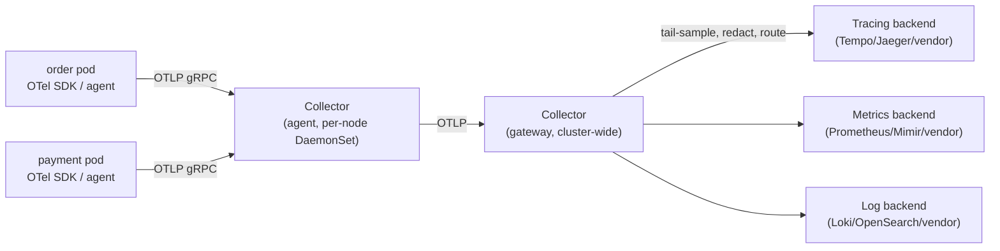

# Phase 8 - Observability and Operations

> **Weeks:** 48–53 | **Prerequisites:** Phases 2, 3, 6 | **Time budget:** 50–55 hrs  
> **You finish this phase able to:**
> - Instrument a service with OpenTelemetry end to end, and state precisely what Spring gives you for free versus what you must add yourself
> - Explain cardinality well enough to stop a teammate from putting `userId` on a Prometheus label — and to fix it when someone already did
> - Choose SLIs that reflect user pain, set SLOs from data, and configure multi-window multi-burn-rate alerts that catch a real incident without paging for noise
> - Debug a production incident using only traces, metrics, and logs — no debugger attached, no SSH session
> - Run an incident from detection through a blameless postmortem whose action items actually get done
> - Diagnose why an observability bill is the size it is, and cut it without losing the signal that matters

## Why this phase exists

In a monolith you attach a debugger. You set a breakpoint, step through the call stack, inspect a variable, and the answer is right there in one process's memory. In a distributed system there is no single process to attach to. The request that failed touched `order`, `inventory`, `payment`, and a Kafka topic, on four different pods, on four different nodes, possibly in four different availability zones, and by the time you are looking at it the pods that handled it may already be gone, recycled by a rolling deploy or an autoscaler. Your only debugger is the telemetry you decided to emit — months ago, before you knew which question you would need to ask. Observability is a design-time decision, not an operations add-on bolted on after an incident teaches you what you were missing.

This is why observability belongs in the same roadmap position as security: it is a **platform property**, not a per-service nice-to-have. A ten-service estate where each team independently decides what to log, whether to propagate a trace header, and what a dashboard should show ends up with ten inconsistent, partially-overlapping views of one system — and during an incident, the on-call engineer discovers the gaps in real time, under pressure, while customers are affected. The estate's actual observability is the weakest service's observability, because that is the one nobody can explain when it is the one that breaks.

The earlier phases already gave you pieces of this. [Phase 2](phase-02-spring-boot-production-core.md) wired up Actuator, structured logging, and a first pass at Micrometer Tracing so requests carry a trace ID. [Phase 3](phase-03-communication-and-apis.md) gave every endpoint a stable contract worth measuring. [Phase 6](phase-06-resilience-engineering.md) introduced SLIs, a single-window error budget, and the instinct to ask "did the SLI hold?" during a chaos experiment. This phase turns those pieces into a system: an OpenTelemetry pipeline that carries context across every boundary including Kafka, metrics with a cardinality budget instead of an accident, logs that are searchable without becoming a compliance liability, SLOs precise enough to alert on, and an incident process that produces a fix rather than a folder nobody reopens.

The cost side is not optional to discuss. Observability tooling is commonly one of the largest line items in a company's infrastructure spend, frequently rivaling the compute it is watching. Every decision in this phase — what to sample, what to tag, what to retain, and for how long — is simultaneously a debugging-capability decision and a cost decision, and pretending otherwise is how a team ends up either blind during an incident or unable to explain a six-figure vendor invoice to finance. The engineer who can do both — keep the system debuggable and keep the bill defensible — is doing the actual job this phase teaches.

## Mental model

**Monitoring answers questions you predicted; observability lets you ask questions you did not predict.** A dashboard of CPU and memory is monitoring — useful, and useless the day the failure mode is a poison-pill message that consumes normal CPU but corrupts one tenant's data. Observability is the ability to slice and re-slice arbitrary dimensions of what actually happened — this tenant, this build, this AZ, this one slow dependency — after the fact, without having predicted the question in advance.

**The currency of observability is high-cardinality context attached to the unit of work.** A metric that only says "errors: 40" is nearly useless during an incident. A trace that says "40 errors, all `tenant_id=8815`, all after deploy `v42`, all calling `payment` with a 30-second timeout" is the incident report writing itself. Cardinality — the number of distinct values a dimension can take — is the resource you are managing throughout this phase; it belongs in traces and logs, which are built for it, not in metric labels, which are not.

**The signals are complementary, not redundant.** Metrics tell you *that* something is wrong, cheaply, in aggregate, fast enough to alert on. Traces tell you *where* in a specific request it went wrong. Logs tell you *why*, with the detail a metric cannot carry. Profiles tell you *which line of code* is spending the resource. Losing any one of them creates a specific class of question you cannot answer, no matter how much of the others you have.

**Alert on symptoms the user feels, not on causes you guessed.** CPU at 85% might be a Tuesday. A checkout success rate dropping below 99.9% is always worth paging for. The distinction is architectural: symptom-based alerting requires you to have already defined what "working" means for this service — an SLO — which is why SLOs and alerting are one topic in this phase, not two.

**Observability work that produces no artifact did not happen, and often did not help either.** "We looked at the dashboards" is not evidence; a linked trace, a burn-rate graph, and a postmortem with a dated action item are. This mirrors the compliance-evidence principle from [Phase 7](phase-07-security-and-compliance.md): if you cannot show your work, you cannot learn from it, and the next on-call engineer repeats your investigation from zero.

## Core concepts

### Observability versus monitoring

**Plain English:** Monitoring is a fixed set of gauges you built because you already know what can go wrong. Observability is the ability to ask a brand-new question about a system you did not fully anticipate, and get a real answer from data you already collected.

**Analogy:** A car's dashboard is monitoring — speed, fuel, engine temperature, all decided at design time. A mechanic plugging a diagnostic scanner into the OBD-II port is closer to observability: they can pull raw sensor data and ask a question the dashboard designer never anticipated, like "which cylinder is misfiring, and only under load." Where the analogy breaks down: a car has a fixed, finite number of failure modes a manufacturer can enumerate in advance. A distributed system's failure modes are combinatorial — new code, new traffic shapes, new dependency versions — so the "diagnostic port" has to be wired into everything, all the time, not plugged in after a warning light comes on.

**In the real world:** When a Swiggy or DoorDash delivery estimate is wrong for one restaurant during lunch rush, nobody wrote a dashboard panel titled "this restaurant's estimate accuracy." An engineer with real observability tooling filters live request data by restaurant ID, time window, and courier zone, and gets an answer in minutes. A monitoring-only shop has to ship a code change to add that panel, then wait for the problem to recur.

**Mechanics:** Observability requires three properties monitoring does not: high-cardinality data (so you can filter to one restaurant, one tenant, one build), high-dimensionality data (dozens of attributes on the same event, so you can combine filters), and arbitrary, ad hoc queryability (not a pre-aggregated rollup that already threw away the dimension you need). This is why the shift from "metrics-only" to "traces plus structured events plus metrics" is not a fashion change — pre-aggregated metrics cannot answer a question whose dimension was aggregated away before you knew you would need it.

**What breaks:** A team that only has dashboards for problems they have already seen is permanently one novel failure behind. The 3 a.m. symptom is a page that says "error rate up," six dashboards that are all green because none of them slice by the dimension that matters, and an hour lost building a query that should have taken two minutes.

### The four signals and what each costs

| Signal | Answers | Cardinality tolerance | Relative cost | Alertable |
|---|---|---|---|---|
| Metrics | Is something wrong, in aggregate, right now? | Low — every label value multiplies stored series | Cheapest at scale | Yes — the primary alerting signal |
| Traces | Where, in this one request, did it go wrong, and how did time get spent? | High — one trace per request is normal | Moderate, controlled by sampling | Rarely directly; drives investigation |
| Logs | Why, in detail, did this one thing happen? | High — arbitrary text and fields | Highest per event, dominates bills at volume | Sparingly — on specific patterns, not volume |
| Profiles | Which function, line, or allocation is spending the resource? | N/A — sampled stack traces, not request-scoped | Moderate, continuous sampling | No — a diagnostic signal, not an alerting one |

A fifth category, **events and change data** — deploys, feature flag flips, config changes, incident markers — is cheap, low-volume, and disproportionately useful: most production incidents correlate with a change, and a system that cannot show you "what changed in the last hour" makes every investigation start from zero. Treat deploy markers and flag-change events as a first-class signal, not an afterthought glued onto a dashboard title.

The decision table you actually use under pressure: symptom is aggregate and fast-moving → start with metrics; symptom is "this one request/customer/order" → jump to a trace; the trace shows a suspicious span but not the reason → pull logs correlated by trace ID; the resource itself (CPU, allocations) is the mystery, and metrics and traces both point at one process without explaining why → profile it.

### Cardinality

**Plain English:** Cardinality is how many different values a piece of data can take. A field that is always one of three values is low cardinality; a field that is a different value for every single user is unbounded — high cardinality.

**Analogy:** A library that shelves books by "Fiction" or "Non-fiction" has low cardinality — two shelves, easy to browse, easy to count. A library that gave every single book its own uniquely named shelf would have as many shelves as books; nothing would fit in a reasonably sized room, and "how many fiction books do we have" would require walking every shelf. Where the analogy breaks: a library's shelf count is fixed by the room's size. A metrics database's shelf count grows automatically and silently every time a new label value appears — nobody has to approve building a new shelf, which is exactly the danger.

**In the real world:** Instagram's or Twitter's per-post like counters are aggregated, not one time series per post — with hundreds of millions of posts, a naive "counter labeled by post ID" model would create more time series than any metrics backend on earth could hold. Systems at that scale route per-entity counts through a different storage class (a key-value store or a stream aggregation) and reserve the labeled-metrics system for a bounded set of dimensions: region, service, status code — dozens to low thousands of values, not hundreds of millions.

**Mechanics:** A Prometheus-style time series is identified by its metric name plus every label key-value combination. `http_requests_total{service="order", status="500"}` is one series. Adding a label with 10,000 distinct values multiplies your series count by up to 10,000 for every metric that carries it — this is the "cardinality explosion" math, and it is multiplicative across every label on the metric, not additive. A metric with three labels of cardinality 5, 20, and 1,000 can produce up to 100,000 series from one line of instrumentation code. The rule that holds up under this math: **anything with unbounded or user-scoped cardinality — user ID, order ID, session ID, raw URL path with path parameters, email address — belongs in a trace attribute or a log field, never in a metric label.** Metrics get bounded dimensions: service name, status class, region, method, a small enumerated business dimension like tier (`free`/`pro`/`enterprise`), not the specific customer.

**What breaks:** A new engineer adds `.tag("orderId", orderId)` to an existing counter to make debugging "easier," ships it, and within an hour the metrics backend's memory usage climbs monotonically as it allocates a new time series for every new order. This is not a slow leak — it is proportional to order volume, so a busy checkout service can produce tens of thousands of new series per minute. The backend either falls over, starts dropping data indiscriminately (including the metrics you actually rely on for alerting), or triggers an emergency bill. War story 1 later in this phase walks through exactly this failure during a live incident, which is the worst possible time to discover it.

### OpenTelemetry as the industry standard

OpenTelemetry (OTel) is the CNCF-graduated, vendor-neutral standard for producing traces, metrics, and logs, and by late 2026 it is the default choice for new instrumentation across languages, including the JVM. Three things make it worth learning as *the* standard rather than one option among several: it is what most vendors and open-source backends now consume natively, its semantic conventions make cross-service and cross-company data comparable, and adopting it de-risks a future vendor change — you swap the exporter, not the instrumentation.

**SDK versus auto-instrumentation agent.** The Java agent (`-javaagent:opentelemetry-javaagent.jar`) instruments common libraries — Spring MVC, JDBC, Kafka clients, HTTP clients — with zero code changes, which is the fastest path to first traces and the right default for legacy or third-party code you do not want to touch. The SDK, used directly or through Micrometer's bridges, is what you reach for to add business-meaningful spans and attributes the agent cannot know about — "this span represents checkout, and here is the cart value and the tenant." Most real services use both: the agent for coverage, hand instrumentation for the handful of spans that carry the story a reviewer or an on-call engineer actually needs.

**The Collector: the control point you actually operate.** Applications should export data with the least possible logic — OTLP (OpenTelemetry Protocol) out, nothing else — and let the **OpenTelemetry Collector** do the operational work: batching, retrying, redacting PII before it leaves your network, sampling decisions, routing the same data to two backends during a migration, and enriching data with resource attributes the application does not know (cluster name, node pool, cloud region). Putting this logic in the Collector instead of the application means you change sampling policy or redaction rules without touching, testing, or redeploying every service.



**Semantic conventions and resource attributes.** OTel defines standard attribute names — `http.request.method`, `db.system`, `messaging.system` — so a dashboard built against one service's traces works against another's without translation. `service.name`, `service.version`, and `deployment.environment` are **resource attributes**: metadata about the process emitting the telemetry, attached once at startup rather than per span. Consistency here is what makes a query like "show me every service on `deployment.environment=prod` running `service.version` older than the last two releases" possible at all; a service that names itself `order-svc` in one place and `order` in another silently splits its own data in half.

### Spring instrumentation: what you get and what you add

Micrometer's **Observation API** is the abstraction Spring Boot 4.x builds on: instrument once with an `Observation`, and it produces both a metric (a `Timer`, via Micrometer Metrics) and a span (via Micrometer Tracing) from the same call, so the two signals never drift out of sync with each other. Auto-configuration wires this into HTTP servers and clients, JDBC, `@Scheduled` tasks, and the Kafka client — this is the "free" tier: incoming and outgoing HTTP requests, database calls, and scheduled jobs all produce spans and RED-shaped metrics with zero application code, once `micrometer-tracing-bridge-otel` and an OTLP exporter are on the classpath.

What is not free, and what actually separates a debuggable service from one with pretty dashboards and no answers: business context. A span named `POST /api/orders` tells you an order endpoint was slow. A span carrying `order.tenant_id`, `order.item_count`, and `order.payment_method` tells you it was slow *specifically for enterprise tenants placing bulk orders paying by wallet* — the sentence an incident report is made of.

```java
// Custom Observation: produces a span AND a timer from one instrumentation point.
// Deliberately omits retry/circuit-breaker wiring (Phase 6) to isolate the observability concern.
@Service
class CheckoutService {
  private final ObservationRegistry registry;

  Order checkout(Cart cart) {
    return Observation.createNotStarted("checkout.process", registry)
        .contextualName("checkout")
        .lowCardinalityKeyValue("payment.method", cart.paymentMethod())   // bounded: card|wallet|cod
        .highCardinalityKeyValue("order.item_count", String.valueOf(cart.items().size()))
        .observe(() -> orderService.place(cart));                        // span + timer, one call
  }
}
```

`lowCardinalityKeyValue` becomes both a span attribute *and* a metric tag — reserve it for genuinely bounded values, because anything tagged this way inherits the metrics cardinality rules above. `highCardinalityKeyValue` becomes a span attribute only, never a metric tag, which is precisely the escape hatch for the order ID, the tenant name, the SKU list — detail that traces can afford and metrics cannot.

```java
// Custom business metric: correct naming (unit suffix), bounded tags, and a meaningful base unit.
@Component
class OrderMetrics {
  private final Counter ordersPlaced;

  OrderMetrics(MeterRegistry registry) {
    this.ordersPlaced = Counter.builder("orders.placed")     // convention: noun.verb, no "count"/"total" suffix
        .tag("payment.method", "unknown")                     // overwritten per-call with a bounded value
        .baseUnit("orders")
        .description("Orders successfully placed")
        .register(registry);
  }

  void recordPlaced(String paymentMethod) {
    ordersPlaced.increment();   // tag values come from a fixed enum, never from request-scoped data
  }
}
```

### Context propagation

**Plain English:** Context propagation is how a trace ID hitches a ride along every hop of a request, so that a span created by `payment` two services away can say "I belong to the same request as this span in `order`."

**Analogy:** A tracking number on a parcel that moves through a courier's depot, a customs office, and a local delivery van, each of which scans it and appends its own timestamp to the same tracking record. Anyone can look up the number afterward and see the whole journey as one story, even though four different organizations independently handled it. Where the analogy breaks: a tracking number survives a queue naturally, because the label stays glued to the box. A trace context is just a couple of HTTP headers, and the moment a message crosses into a system that does not know to copy those headers — a queue, a batch job, a `CompletableFuture` that hops threads — the label falls off unless something explicitly reattaches it.

**In the real world:** When a UPI payment or a Stripe charge shows a single reference number across the merchant's app, the payment gateway, the bank's system, and the settlement report, that is context propagation working end to end across four separately-owned systems. When a WhatsApp message shows one tick, then two, then blue, the delivery pipeline is threading one message identity through phone, server, and recipient device — the same shape as a trace, applied to a chat message instead of an HTTP request.

**Mechanics:** The W3C `traceparent` header (`00-<trace-id>-<parent-span-id>-<flags>`) is the default propagation format industry-wide; the older Zipkin B3 headers (`X-B3-TraceId` etc.) still appear in brownfield estates and can be run alongside `traceparent` during a migration. `tracestate` carries vendor-specific extensions. **Baggage** (W3C `baggage` header) propagates arbitrary key-value business context — tenant ID, experiment bucket — alongside the trace, but it rides on every single downstream request as a header, so an unbounded or large baggage value becomes a real latency and bandwidth cost multiplied across your whole call graph; keep baggage to a handful of small, genuinely cross-cutting values.

HTTP and gRPC propagation is automatic once the OTel agent or Micrometer Tracing is present. Three places it is not automatic, and each is a specific, well-known bug:

- **Kafka.** The trace context is not part of the message payload; it must be written into Kafka record headers by the producer and read back by the consumer. Spring Kafka's Micrometer instrumentation does this automatically for `KafkaTemplate` and `@KafkaListener` as of Boot 3.2+/4.x — but a hand-rolled producer that bypasses `KafkaTemplate`, or a consumer that reads raw `ConsumerRecord` without going through the instrumented listener container, silently drops it. The result is the classic "trace ends at the queue boundary" bug: the trace shows `order` publishing an event and then nothing — as if the event vanished — when in reality `inventory` consumed it seconds later as the start of a brand-new, disconnected trace.
- **Async executors and thread pools.** A `CompletableFuture.supplyAsync` or a manually managed `ExecutorService` runs on a different thread than the one the context was bound to. Micrometer's `ContextSnapshot` API captures the active context (trace, MDC, security context) on the calling thread and restores it on the worker thread; a `TaskDecorator` wired into the executor does this automatically for `@Async` methods.
- **Virtual threads.** JDK 25's virtual threads do not need a thread pool at all for most I/O-bound work, which removes the most common place context loss happens — but a virtual thread handed to a legacy `ExecutorService` abstraction that was written assuming platform-thread pooling semantics can still lose context if the propagation wiring assumed the old model. Verify propagation explicitly when migrating a hop to virtual threads rather than assuming it "just works."

```java
// Kafka producer: context propagates automatically through KafkaTemplate + Micrometer.
// A hand-rolled producer bypassing KafkaTemplate must copy the header manually — the classic drop point.
@Component
class OrderEventPublisher {
  private final KafkaTemplate<String, OrderPlaced> kafka;   // instrumented: headers written for you

  void publish(OrderPlaced event) {
    kafka.send("order.placed", event.orderId(), event);      // trace context rides in record headers
  }
}
```

**What breaks:** The single most expensive debugging session this phase's checklist protects against is exactly war story 2 below: a trace that looks complete, ends cleanly at a Kafka publish, and gives no hint that anything downstream ever happened — because nobody wired header propagation into the one non-standard consumer in the estate.

### Sampling

**Plain English:** Sampling is deciding which requests get a full trace recorded and which do not, because recording every single request's full trace, forever, at scale is either too expensive or physically impossible to store.

**Analogy:** A factory quality inspector cannot examine every single unit off a line running thousands per minute, so they check a percentage — but they always pull aside anything that already tripped an alarm or looked visibly defective, rather than applying the same random 1% check to the units that are already known to be a problem. Sampling in tracing works the same way: sample the boring, successful, fast requests lightly, and keep everything unusual.

**In the real world:** A payments platform processing tens of thousands of transactions per second cannot store a full trace for every one indefinitely — but it absolutely keeps a full trace for every transaction that errored, timed out, or triggered a fraud flag, because those are exactly the ones a support or fraud team will need to pull up by reference number later.

**Mechanics:** Three sampling strategies, usually combined:

| Strategy | Decision point | Strength | Weakness |
|---|---|---|---|
| Head-based probabilistic | At the root span, before the outcome is known | Cheap, simple, no coordination needed | Samples errors and slow requests at the same rate as boring ones — you lose exactly the traces you need most |
| Rate-limited | At the root span, capped at N traces/sec | Bounds cost predictably regardless of traffic spikes | Same blindness to errors as probabilistic |
| Tail-based (in the Collector) | After the full trace has been buffered, once the outcome is known | Keep 100% of errors and slow requests, sample the rest lightly | Requires buffering whole traces in the Collector, and if a trace's spans fan out across many Collector instances, they must all route to the same tail-sampling instance |

The practical default: tail-based sampling in the Collector, configured to keep all traces with an error status or a duration above a threshold (say, p95), and apply a low probabilistic rate — 1–5% is typical — to everything else. This gets you full coverage of the traces an incident needs and a bounded, predictable bill for the rest.

**What breaks:** A team enables tracing, sets a flat 1% head-based sample rate to control cost, and declares the job done. Six months later, during an incident, the on-call engineer searches for a trace of one of the failing requests and finds nothing, because the 99% chance that any specific failing request was not sampled is exactly what "flat 1%" means. The fix is never "raise the percentage" — it is "sample on outcome, not on a coin flip that does not know the outcome yet."

### Metrics in depth

Counters only increase (`orders.placed`); gauges move up and down (`connections.active`); histograms and summaries capture a distribution (`http.server.requests` duration) rather than a single number. The distinction that actually causes production incidents is between histograms and summaries: a **summary** computes percentiles client-side and cannot be meaningfully aggregated across instances — you cannot average five instances' local p99s into a fleet-wide p99. A **histogram** exports bucket counts and lets the query engine compute percentiles server-side across the whole fleet, which is the only version of a percentile that means anything for a service with more than one replica.

**Why you cannot average percentiles.**

**Plain English:** A p99 is already a summary of a distribution — averaging several already-summarized numbers together produces a number that does not correspond to any real, measurable quantity.

**Analogy:** Ask ten different classes for their tallest student's height, then average those ten numbers. The result is not "the tallest student's height in the school" — it is a number that describes nothing real, because "tallest" is not a linear quantity that survives averaging across groups of different sizes and different distributions.

**In the real world:** A latency dashboard showing "average of the p99s across five pods: 220 ms" might hide the fact that one pod's actual p99 is 900 ms and the rest are 100 ms — the pod actually failing its users is invisible, diluted into a number that looks fine.

**Mechanics:** To get a correct fleet-wide p99 you need the underlying histogram buckets from every instance, summed, and the percentile computed once over the combined distribution — this is exactly what Prometheus's `histogram_quantile()` function does over a `_bucket` metric, and exactly what a summary metric cannot support because it already threw the raw distribution away. Native histograms (sparse, high-resolution histograms supported by modern Prometheus and OTel) remove the old trade-off of picking fixed bucket boundaries in advance, at some additional storage cost.

**What breaks:** A team ships a "p99 latency" panel built from `Timer` summaries averaged across instances via a naive Grafana query, watches it stay flat and green through an incident where one AZ's replicas were genuinely struggling, and only discovers the lie when a customer complaint forces someone to check per-pod graphs by hand.

**RED, USE, and the four golden signals.** **RED** (Rate, Errors, Duration) is the template for anything that serves requests — every ShopKart endpoint gets these three panels, always in that order, always with the same time window, so any two services' dashboards are comparable at a glance. **USE** (Utilization, Saturation, Errors) is the template for a resource — a thread pool, a connection pool, a disk — and answers "is this thing about to become the bottleneck," which RED cannot, because RED describes the outside of a black box and USE describes the inside. Google's SRE-originated **four golden signals** (latency, traffic, errors, saturation) are effectively RED plus saturation, and most real dashboards are some blend of the two.

**Prometheus's model.** Prometheus pulls (scrapes) metrics from a known set of targets on an interval, rather than services pushing to it — this makes "is the target even reachable" itself a signal (`up == 0`), simplifies the security model (no inbound credentials needed on the collector), and is the reason short-lived batch jobs need a **Pushgateway** or equivalent, since nothing survives long enough to be scraped. **Recording rules** pre-compute expensive queries on a schedule so dashboards and alerts read a cheap pre-aggregated series instead of a heavy live one. **Remote write** ships data to long-term storage (Thanos, Mimir, or Cortex) so a single Prometheus instance's local retention — typically weeks — is not the limit on how far back you can query, and so multiple Prometheus instances' data can be queried as one global view. **Exemplars** attach a specific trace ID to a specific bucket of a histogram, so a spike in the p99 bucket on a graph can link, with one click, to an actual trace of a request that landed in that bucket — the single highest-leverage piece of glue between the metrics and tracing signals.

### Logging

Structured JSON is the only acceptable log format for a service beyond a handful of instances — free-text logs cannot be reliably parsed, filtered, or aggregated at scale, and every minute spent writing a regex to extract a field from unstructured text is a minute a structured field would have saved. Every log line carries, at minimum: timestamp, level, service name, trace ID, span ID, and the message — the trace ID is what lets you pivot from "I found a suspicious span" to "show me every log line from every service for this exact request" in one query, which is the single most-used correlation in a real investigation.

A level policy that people actually follow, because most do not: `ERROR` means a human should look at this soon and it represents a real failure, not an expected business outcome (an out-of-stock item is not an error); `WARN` means degraded-but-handled — a fallback fired, a retry succeeded on the second attempt; `INFO` means a small number of significant lifecycle events per request, not a play-by-play; `DEBUG` is off in production by default and turned on selectively, per-service or per-request, when actively investigating. **Logging every request at INFO** is the single most common logging anti-pattern in this phase — it is expensive, it drowns the signal, and it is a symptom of a team using logs to do a metric's job.

PII redaction belongs at the source, in the logging framework, not as a downstream cleanup step: a redacting layout or a structured logging encoder that recognizes known-sensitive field and header names (`authorization`, `password`, `card`, `ssn`) and masks them before the line ever leaves the process, because once it leaves the process it may already be replicated to a third-party log vendor with hundreds of users who have query access — the exact shape of war story 4.

**Pipelines and retention.** Fluent Bit (lightweight, low-overhead, the common Kubernetes-node-level collector) or a Collector's own log receiver ships structured logs to a backend — Loki (label-indexed, cheap, pairs naturally with Prometheus-style labels and Grafana), OpenSearch (full-text search, heavier, stronger for ad hoc free-text queries), or a commercial vendor (Splunk, Datadog). Retention is tiered deliberately: a short hot window (7–14 days) for interactive search at full detail, a longer cold tier (30–90 days) in cheaper storage for compliance and less-frequent lookups, and deletion or archival beyond that unless a specific regulation requires longer — see [Phase 7](phase-07-security-and-compliance.md)'s treatment of audit-log retention, which is deliberately longer and structurally separate from this operational-log retention.

**The rule that keeps logs from becoming an unbounded cost center: logs are for the details of one request, not for computing a rate.** "How many checkout errors occurred in the last hour" is a metrics question, answered by a counter that costs a fixed, tiny amount regardless of traffic. Answering the same question by grepping or aggregating log lines costs proportional to log volume — often orders of magnitude more — and gets slower exactly when traffic (and therefore the need to know) is highest. Sample chatty, low-value log lines (a DEBUG line from a hot loop) aggressively; never sample the log line that carries the reason for an error.

### Profiling in production

**Plain English:** Profiling answers "which specific line of code, or which specific object allocation, is consuming the CPU or memory," which neither a metric nor a trace can tell you — a trace shows a span took 400 ms, but not whether that 400 ms was spent in a database call, a busy loop, or garbage collection.

**Mechanics:** `async-profiler` samples stack traces at a fixed interval with low overhead and is safe to run against a live JVM without a restart; **JFR** (Java Flight Recorder) is built into the JDK, always-on-capable at near-zero overhead, and records a rich event stream — GC pauses, lock contention, allocation, thread state — that can be inspected after the fact from a running or crashed process. **Continuous profiling** (Pyroscope and equivalent vendor products) extends this to always-on, low-overhead sampling across a whole fleet, correlated with the same `service.name` and deployment version as your traces and metrics, so "which version introduced this regression" becomes a diffable flame graph instead of a guess.

A **flame graph** reads as: each box is a stack frame, width is proportional to time spent (samples), and the y-axis is stack depth — the widest boxes at any level are where the time actually goes, and a graph dominated by a single wide tower is usually either genuine hot code or, just as often, needless allocation forcing garbage collection to dominate the profile. Reading one is a skill worth deliberately practicing: start at the top (or bottom, depending on orientation convention) and find the widest frame, not the deepest one.

**When profiling beats tracing:** CPU-bound and allocation-bound problems — a service that is slow across the board, on every endpoint, with no single external dependency to blame — are where tracing runs out of explanatory power, because the "slow span" *is* application code, and a profile is the only signal that says which code.

### SLIs, SLOs, SLAs, and error budgets — precisely

[Phase 6](phase-06-resilience-engineering.md) introduced the arithmetic: a 99.9% SLO is a budget of 43.2 minutes of allowed badness per month. This phase gives you the precision that arithmetic needs to survive contact with a real alerting system.

**Plain English:** An SLI is the number you actually measure. An SLO is the target you set for that number. An SLA is the contract — usually with a financial penalty — that a customer signed based on a (typically looser) version of the SLO.

**Analogy:** A restaurant's kitchen might target "hot food out within 12 minutes" as an internal SLO. The menu's printed "we guarantee your meal within 20 minutes or it's free" is the SLA — deliberately looser than the internal target, because the internal target has to survive a bad night in the kitchen with margin left over before it becomes a broken promise to a paying customer.

**In the real world:** Ticketmaster or IRCTC's booking flow has an internal SLO for "search results return within N seconds," tracked continuously; the SLA, if any exists publicly, is far looser and rarely mentioned, because the operational target and the contractual promise serve different purposes and different audiences.

**Mechanics — choosing SLIs that reflect user pain.** A good SLI is a ratio of good events to total valid events, precisely defined enough that two engineers computing it independently get the same number. For ShopKart checkout: **availability** — the fraction of checkout attempts that receive a successful response — needs an exact definition of "attempt" (does a client-side network failure before the server saw the request count?) and "successful" (does a `200` with a business-level decline count as success, since the system worked correctly even though the business outcome was "no")? **Latency** needs a percentile and a threshold stated together — "95% of checkout requests complete within 800 ms" is a complete SLI; "checkout is fast" is not one. **Correctness** and **freshness** matter for asynchronous flows: an order confirmation email that is technically sent but arrives 20 minutes late has violated a freshness SLI even though nothing errored.

**Event-based versus time-based SLIs.** An event-based SLI counts good events over total events (`good_requests / total_requests`) — precise, but requires per-request tracking. A time-based SLI counts good time windows over total time windows (`good_minutes / total_minutes`, where a minute is "good" if error rate stayed under a threshold during it) — coarser, easier to compute from existing metrics, and the right choice when request volume is too low or too spiky for a ratio of individual events to be statistically meaningful.

**Multi-window, multi-burn-rate alerting, and why it beats a threshold alert.** A naive alert — "page if error rate exceeds 1% for 5 minutes" — either fires on a brief, self-correcting blip (alert fatigue) or misses a slow, sustained leak that never crosses the 5-minute threshold but burns the entire monthly error budget by month's end. **Burn rate** is the speed at which you are consuming your error budget relative to the rate that would exhausted it exactly at the SLO window's end. A burn rate of 1 means "on pace to exactly use the whole budget by the end of the period" — not itself alarming. A burn rate of 14.4 sustained for one hour consumes what should have lasted a month's worth of the budget in about 50 minutes, which is unambiguously page-worthy.

The standard pattern (from Google's SRE workbook) pairs a **short window** (fast detection) with a **long window** (noise suppression), and checks both before paging:

| Severity | Burn rate | Short window | Long window | Budget consumed if it lasts the long window | Response |
|---|---|---|---|---|---|
| Page (fast burn) | 14.4× | 5 min | 1 h | 2% | Page immediately |
| Page (fast burn) | 6× | 30 min | 6 h | 5% | Page immediately |
| Ticket (slow burn) | 1× | 2 h | 3 d | 10% | Ticket, business hours |

Requiring both windows to agree — a burn-rate spike that shows up in the last 5 minutes *and* is still elevated over the last hour — filters out the single bad minute that self-corrects, while still catching a genuine incident within minutes rather than waiting for a full evaluation window to elapse.

```promql
# 14.4x fast-burn: page if the 5-minute AND the 1-hour error rate both exceed
# 14.4x the rate that would exhaust a 30-day, 99.9% budget exactly on schedule.
(
  sum(rate(http_requests_total{service="order", status=~"5.."}[5m]))
  / sum(rate(http_requests_total{service="order"}[5m]))
) > (14.4 * 0.001)
and
(
  sum(rate(http_requests_total{service="order", status=~"5.."}[1h]))
  / sum(rate(http_requests_total{service="order"}[1h]))
) > (14.4 * 0.001)
```

**What breaks:** A single-threshold alert tuned to stop paging on noise gets tuned so loose it also stops catching real incidents, or tuned so tight the on-call engineer starts ignoring pages — both failure modes converge on the same outcome, a page that everyone has learned means nothing.

### Alerting

Alert on **symptoms** — the SLO burning down — not on **causes** you happen to suspect, like CPU or memory in isolation: high CPU that is not affecting user-facing latency or error rate is not an incident, and a service can be failing users badly while every resource utilization graph looks calm (a downstream dependency timing out, for instance). Every page needs a **runbook link** with an actual first step, not the word "investigate" — a runbook that says "investigate" has delegated the entire incident to whoever is unlucky enough to be on call that week, discarding every lesson the last three people who hit this alert already learned. Alerts route on severity: **page** for anything burning the error budget fast enough to need a human awake right now, **ticket** for slow burns and non-urgent degradation, **dashboard-only** for things worth seeing but never worth an interruption. **Alert review** — a recurring, scheduled look at every alert that fired in the last week, asking "was this actionable, was it the right severity, should it exist at all" — is what prevents alert count from only ever growing; treat an alert with no action taken in its last five firings as a candidate for deletion or demotion, because **alert fatigue is a reliability risk in its own right**: the on-call engineer who has learned to skim past pages is one genuine emergency away from missing it.

### Dashboards that get used

The standard service dashboard, ordered top to bottom the way an on-call engineer scans it during an incident: **traffic** (request rate), **errors** (rate and ratio), **latency distribution** (histogram-derived percentiles, never an average), **saturation** (the USE view of the service's own resources — thread pool, connection pool, CPU, heap), **dependencies** (RED for each downstream call, so a slow dependency is visible without leaving the dashboard), **queue depth** where relevant (Kafka consumer lag, thread pool queue size), and **deploy and flag markers** overlaid directly on the time axis, because "what changed right before this line moved" is the single most common first question in an investigation and it should not require switching tools to answer.

**Every dashboard has a named owner and a stated question it answers.** A dashboard nobody owns accumulates panels nobody removes, and a 60-panel dashboard with no organizing question is not more informative than a 6-panel one — it is a worse version of one, because the six panels that matter are now buried among fifty-four that do not, and the on-call engineer wastes the first five minutes of an incident scrolling.

### Incident management

**Severity definitions**, agreed before an incident, not during one: SEV1 (full outage or major data-integrity risk, all hands, exec-visible), SEV2 (significant user impact, on-call plus one or two others), SEV3 (minor, contained, handled by on-call alone). **Roles**, assigned explicitly at the start of any SEV1/SEV2: an **incident commander** who coordinates and makes calls but does not necessarily fix anything themselves, a **communications lead** who owns the status page and stakeholder updates so engineers are not context-switching between fixing and explaining, and the **operators** actually working the fix. Separating these roles is the single highest-leverage process change a growing team can make, because the failure mode it prevents — the most senior engineer in the room simultaneously debugging, updating a status page, and fielding a VP's Slack messages — is common and it measurably slows the fix.

**The first ten minutes**, as a checklist rather than an improvisation: acknowledge the page, declare the severity, open an incident channel, assign the incident commander, post an initial "we are aware and investigating" update, and check the change log — what deployed, what flag flipped, what config changed in the last hour — before anything else, because a large fraction of real incidents trace back to a recent change and checking it first is often faster than any amount of telemetry analysis. **Mitigate before you diagnose**: rolling back a deploy or disabling a flag to stop the bleeding is usually faster and lower-risk than root-causing live in production, and root-causing can continue calmly after impact has stopped.

**Blameless postmortems** document a timeline (with real timestamps pulled from telemetry, not memory), the customer impact in concrete numbers, the immediate mitigation, the root cause — usually more than one contributing factor, rarely a single "someone made a mistake" — and action items that each have a named owner and a date, tracked to completion rather than filed and forgotten. "Blameless" is not a tone requirement, it is a mechanism: an engineer who fears blame hides information, and a postmortem missing information is a postmortem that will not prevent a recurrence. The action items are the actual deliverable; a beautifully written timeline that produces zero completed action items is a postmortem in appearance only.

### Debugging methodology for distributed systems

A repeatable sequence beats intuition, especially under pressure, because intuition is exactly what fails first when you are tired and the stakes are high. Start with the **change log** — deploys, flag flips, config changes, and a traffic-pattern shift (a marketing campaign, a partner integration going live) — because most incidents correlate with a change and checking is cheap. Use **RED and USE** to localize which service and which resource: RED across the call graph shows you which hop's error rate or latency actually moved; USE on that hop's own resources shows you whether it is a capacity problem or something else. Follow the **critical path in a trace** of an actual failing request — not an average request, a specific one pulled from the errors you are chasing — to see exactly where time or an error was introduced. Run **differential diagnosis** across dimensions: does this only affect one AZ, one build version, one tenant, one dependency's connection pool? A problem confined to one dimension points directly at what changed in that dimension. Finally, **bisect by dependency**: if a service calls four downstreams, determine which one is actually implicated before assuming it is the service's own code, because the fastest wrong turn in distributed debugging is fixing the symptom in the service that happened to be paging instead of the dependency actually misbehaving.

### The cost of observability

Observability tooling — ingestion, storage, and query capacity for metrics, traces, and logs, whether self-hosted or a vendor contract — is commonly one of the largest single infrastructure line items a mid-size engineering organization pays for, and it is one of the few line items that grows automatically with instrumentation decisions individual engineers make without ever seeing a price tag attached. The levers, in order of typical impact: **log volume** (usually the single largest cost driver — every INFO-level line at scale is a real, metered cost); **cardinality** (a small number of poorly chosen labels can multiply a metrics bill by orders of magnitude, as shown above); **trace sampling rate** (tail-based sampling gets you the traces that matter at a fraction of the cost of "trace everything"); **retention tiers** (do you need 90 days of full-resolution metrics, or does a downsampled long-term store cover the audit and trend-analysis use case at a fraction of the storage cost); and **self-hosted versus vendor** (a vendor trades operational burden for a per-GB or per-host bill that scales with exactly the growth you are trying to observe, which is worth modeling explicitly before committing). None of these levers are free lunches — every one trades away some debugging capability for cost — which is why the trade-off belongs in a design review, made explicitly and revisited quarterly, rather than discovered for the first time when finance asks why the bill doubled.

## Production patterns

### Pattern: OTel Collector deployment topology (agent + gateway)

**What:** A two-tier Collector deployment — a lightweight **agent** Collector as a DaemonSet on every node, receiving OTLP from local pods with minimal processing, and a **gateway** Collector as a centrally scaled Deployment that receives from every agent, performs the expensive work (tail sampling, PII redaction, routing to multiple backends), and is the only tier that needs cluster-wide visibility.

**When to use:** Any cluster with more than a handful of services. The agent tier keeps local network hops cheap and absorbs local backpressure; the gateway tier is where you centralize policy so you change sampling or redaction once, not per node.

**When NOT to use:** A single-service prototype or a small proof of concept — export straight to the gateway tier or even straight to the backend, and add the agent tier when the node count makes it worth the extra moving part.

**Failure modes:**
- The gateway tier is under-scaled relative to traffic growth and starts dropping data silently under load; monitor the Collector's own `otelcol_processor_dropped` metrics, because a telemetry pipeline that fails silently defeats its own purpose.
- Tail sampling requires all spans of one trace to land on the same gateway instance; a load balancer that does not consistently route by trace ID splits traces across instances and each instance samples an incomplete trace, corrupting the sampling decision.
- No backpressure or queue limit configured, so a backend outage backs up unbounded memory in the Collector until it OOMs, turning a backend blip into a full telemetry outage.

```yaml
# Collector gateway: tail-sample errors and slow traces at 100%, everything else at 5%.
processors:
  tail_sampling:
    decision_wait: 10s
    policies:
      - name: errors-always
        type: status_code
        status_code: { status_codes: [ERROR] }
      - name: slow-always
        type: latency
        latency: { threshold_ms: 800 }
      - name: baseline-sample
        type: probabilistic
        probabilistic: { sampling_percentage: 5 }
  batch: { timeout: 5s, send_batch_size: 512 }
exporters:
  otlp/backend: { endpoint: tempo-gateway:4317 }
service:
  pipelines:
    traces: { receivers: [otlp], processors: [tail_sampling, batch], exporters: [otlp/backend] }
```

### Pattern: Trace-based debugging workflow

**What:** A standard, repeatable path from "a metric moved" to "here is the exact request and the exact span that explains it" — the workflow, not just the tooling: alert fires on a burn-rate rule, the linked dashboard shows which service and which endpoint, an exemplar or a trace search filtered by service, time window, and error status pulls a representative failing trace, and the trace's critical path names the slow or failing span.

**When to use:** As the default first move on any latency or error investigation once RED metrics have localized the service — this is the "then what" that turns a dashboard from a wall of graphs into an answer.

**When NOT to use:** Skip straight to logs when the symptom is already known to be a specific business-logic exception with no cross-service fan-out — a trace does not add information over a well-correlated log line for a single-hop failure.

**Failure modes:**
- The trace found is not actually representative — sampling bias means the traces easiest to find (e.g., the fastest to search) are not the ones that failed the way the metric suggests. Filter explicitly by error status and duration, not just by service name.
- Spans exist but carry no business attributes, so the trace shows *that* it was slow without showing *for which tenant or which item count* — the fix is upstream, in the instrumentation, not in the query.

### Pattern: Exemplars linking metrics to traces

**What:** A histogram bucket carries a sampled trace ID as an exemplar, so a spike on a latency graph is one click away from an actual trace that landed in that bucket, rather than a separate manual trace search.

**When to use:** Any RED-style latency histogram on a service handling enough volume that manually searching for a matching trace is slower than clicking through.

**When NOT to use:** Low-volume internal tools where a manual trace search is already fast enough that the additional wiring is not worth it.

**Failure modes:**
- Exemplars are only stored for sampled traces; if head-based sampling is very aggressive, most buckets will have no exemplar at all, and the feature quietly stops being useful right when volume is highest.
- Grafana or the backend is not configured to render exemplars on the panel, so they are recorded and invisible — verify the visualization, not just the export.

### Pattern: RED dashboard as a template

**What:** One dashboard-as-code template — rate, error ratio, latency histogram percentiles, applied identically to every service — provisioned automatically for every new service rather than hand-built per team.

**When to use:** Always, as the default dashboard every service gets on day one, before any custom panel exists.

**When NOT to use:** Never skip it, even for a service you consider "simple" — the cost of provisioning it is near zero and the cost of not having it during that service's first incident is not.

**Failure modes:**
- The template is copy-pasted per service and drifts — one service's copy gets an extra panel, another's falls out of date with a metric rename — defeating the comparability that was the entire point. Generate it from a shared dashboard-as-code definition (Grafonnet, a Terraform module, or an operator) parameterized only by service name.

### Pattern: Burn-rate alert rules

**What:** Multi-window, multi-burn-rate PromQL rules (shown fully in Core concepts) wired to the paging system, replacing single-threshold alerts on the same SLI.

**When to use:** Every service with a defined SLO. This is the alerting mechanism that this entire phase's SLO work exists to produce.

**When NOT to use:** A service with no meaningful SLO yet — defining a burn-rate alert on an arbitrary threshold with no SLO behind it just relabels a threshold alert; do the SLI/SLO work first.

**Failure modes:**
- Windows too short: pages on blips that self-correct in minutes.
- Windows too long: a genuine fast-burning incident takes an hour to page, well past the point where a human should already be looking.
- The two burn-rate tiers (fast page, slow ticket) are collapsed into one, losing the noise-suppression benefit of requiring both a short and a long window to agree.

### Pattern: Log redaction pipeline

**What:** PII and secrets are stripped or masked at the logging encoder, in-process, before a line ever reaches a sink — never as a downstream job that scans logs after they have already shipped to a vendor.

**When to use:** Every service, unconditionally, from day one — retrofitting redaction after a leak means everything already shipped is already exposed.

**When NOT to use:** There is no "when not to use" here; the only variation is how aggressive the field-name matching needs to be for a given regulatory posture.

**Failure modes:**
- Redaction implemented as a regex over the final rendered log line rather than structural field/header matching, which both under-matches (a slightly different key name) and over-matches (redacting legitimate data that happens to look like a card number).
- A new sensitive field is added to a DTO and nobody updates the redaction list — treat the redaction list as code, reviewed the same way a schema change is reviewed.

```java
// Logback structured encoder: mask known-sensitive keys before serialization, not after.
public class RedactingJsonProvider extends JsonProvider<ILoggingEvent> {
  private static final Set<String> SENSITIVE = Set.of("authorization", "password", "cardNumber", "ssn");
  @Override
  public void writeTo(JsonGenerator gen, ILoggingEvent event) throws IOException {
    for (var entry : event.getMDCPropertyMap().entrySet()) {
      String v = SENSITIVE.contains(entry.getKey().toLowerCase()) ? "***REDACTED***" : entry.getValue();
      gen.writeStringField(entry.getKey(), v);
    }
  }
}
```

### Pattern: Deploy markers

**What:** Every deployment and every feature-flag change emits a lightweight event — service, version, timestamp, who/what triggered it — rendered as a vertical annotation on every relevant dashboard's time axis.

**When to use:** Every service, always. This is one of the cheapest, highest-leverage patterns in the entire phase: the first question in almost every investigation is "what changed," and this answers it without a separate tool.

**When NOT to use:** No exception; the only design choice is where the events are stored (a dedicated annotations API in the metrics backend, or a Collector-ingested event stream).

**Failure modes:**
- Markers exist but are not visible on the specific dashboard someone is looking at during an incident, because they were wired into one dashboard tool and not another — treat "annotate every dashboard" as the acceptance criterion, not "annotate one dashboard."

### Pattern: Synthetic checks

**What:** Scripted requests run continuously from outside the cluster — ideally from multiple geographic regions — exercising a critical user journey (login, search, checkout) end to end, independent of any internal telemetry.

**When to use:** For every business-critical flow, as a check that answers "is the system actually reachable and working for a real user right now," which internal metrics cannot answer if the failure is in DNS, a CDN, or the edge itself.

**When NOT to use:** As a replacement for real-user monitoring — synthetics catch total or regional outages well and subtle, traffic-shape-dependent degradation poorly, because they generate a fixed, small, predictable load pattern.

**Failure modes:**
- Synthetic checks run from inside the same cloud region as the service, which cannot detect an external DNS or CDN problem a real user would hit.
- Alerting on a single synthetic failure rather than a sustained pattern produces noise from transient network blips unrelated to the service.

### Pattern: On-call runbook format

**What:** A runbook linked directly from every page, with a fixed structure: what this alert means in plain language, the first three diagnostic queries to run (with the actual query, not a description of one), likely causes ranked by frequency, the immediate mitigation, and escalation contacts.

**When to use:** Every alert capable of paging a human. An alert without a runbook is a bet that whoever is on call already has the same context as whoever wrote the alert.

**When NOT to use:** No exception for paging alerts; ticket-only and dashboard-only alerts can carry a lighter version.

**Failure modes:**
- The runbook says "investigate the issue" — this is not a runbook, it is the absence of one wearing a runbook's clothing.
- The runbook goes stale after an architecture change and nobody notices until an incident, because runbooks are not exercised the way code is. Review runbooks whenever the underlying service's architecture changes, and treat "when was this last validated" as a tracked field.

### Pattern: Error tracking alongside logs

**What:** A dedicated error-tracking tool (Sentry-shaped: automatic deduplication of identical exceptions into one issue, stack traces with source context, occurrence counts, first/last seen, and release correlation) running alongside, not instead of, structured logs.

**When to use:** Any service throwing exceptions a developer needs to triage and fix — which is nearly every service. It answers "which distinct bugs exist and how often does each occur" far better than grepping logs for stack traces, because logs treat every occurrence as an independent, unrelated line.

**When NOT to use:** As a substitute for structured logging generally — error tracking is specifically for exceptions and defects, not for the general operational narrative logs provide.

**Failure modes:**
- Exceptions are caught and swallowed before reaching the error tracker, hiding real defects from the tool built to surface them — a `catch (Exception e) {}` block is invisible to every observability tool simultaneously.
- Release correlation is not wired up, so "did this error rate increase after the last deploy" requires manual cross-referencing instead of being visible on the issue itself.

## How big tech does it

### Google: Dapper and the SRE model

Google's internally published **Dapper** paper (2010) is the direct ancestor of every modern distributed tracing system: a low-overhead, sampled, always-on tracing infrastructure with a globally unique trace ID propagated across every RPC. Nearly every concept in this phase's tracing section — trace ID propagation, sampling to control overhead, spans as the unit of causal structure — traces its lineage to that paper. Separately, Google's **Site Reliability Engineering** book, already introduced in [Phase 6](phase-06-resilience-engineering.md) for error budgets, is also the origin of the SRE organizational model this phase's incident-management section draws on: symptom-based paging, defined severities, and blameless postmortems as a named discipline rather than an informal habit.

**Transferable control:** treat tracing as infrastructure with a propagation contract every service must honor, not an optional library some services adopt; treat the postmortem process as owned tooling with a template, not tribal knowledge.

### Netflix: Atlas, Mantis, and Edgar

Netflix has publicly described **Atlas**, its in-memory dimensional time-series database built to handle the metrics cardinality and query load of its scale, and **Mantis**, a stream-processing platform originally built for real-time operational insight rather than batch analytics. **Edgar** is Netflix's publicly described internal request-tracing tool purpose-built for its microservices topology, correlating traces with deployment and configuration context specifically to answer "what changed" during an investigation — the same change-log-first debugging instinct this phase teaches, built into tooling rather than left as a manual first step.

**Transferable control:** build (or configure) your tracing tool to surface deployment and config context directly alongside the trace, not as a separate lookup — the fewer tools an on-call engineer must context-switch between, the faster the diagnosis.

### Uber: Jaeger and M3

Uber built and open-sourced **Jaeger**, now a CNCF-graduated distributed tracing system and one of the most widely deployed tracing backends in the industry, donated specifically because Uber's engineering leadership judged a shared, vendor-neutral standard served the whole industry (and Uber's own hiring and integration surface) better than a proprietary internal tool. **M3** is Uber's publicly described metrics platform built to handle the cardinality and query volume of a global, real-time dispatch system — the ride-matching and ETA calculations behind an Uber or Ola trip status update are exactly the kind of high-cardinality, per-request telemetry problem this phase's cardinality section describes at extreme scale.

**Transferable control:** donating and adopting open standards (Jaeger, OpenTelemetry) is not altruism alone — it is a bet that a shared ecosystem of instrumentation and tooling compounds faster than any one company's internal fork.

### Meta: Scuba and Canopy

Meta has publicly described **Scuba**, an in-memory, real-time, ad hoc analytics database purpose-built for exactly the high-cardinality, arbitrary-slice queries this phase's observability-versus-monitoring section describes — engineers query it live, during an investigation, with dimensions nobody predicted in advance. **Canopy** is Meta's publicly described end-to-end tracing infrastructure unifying traces across the client, network, and backend layers of a request, extending the tracing model beyond the backend-only scope most companies start with.

**Transferable control:** the value of high-cardinality ad hoc query capability is proportional to how fast an engineer can go from "I have a hypothesis" to "here is the answer" without writing new instrumentation first — invest in query speed and dimension flexibility, not just data collection.

### Twitter: the Zipkin lineage

**Zipkin**, originally built at Twitter and open-sourced, was one of the first widely adopted distributed tracing systems and directly shaped the B3 propagation header format still found in brownfield estates today. Its lineage — Dapper's ideas, implemented and open-sourced, then eventually superseded in new instrumentation by OpenTelemetry's broader, vendor-neutral standard — is a useful capsule history of the field: proprietary internal tool, open-source implementation, then industry-wide standardization.

**Transferable control:** expect your own tracing format choices to have a similar arc; standardizing on OTel's `traceparent` today is betting on the current step of that same consolidation, not a permanent final answer.

### Honeycomb: observability-driven development

Honeycomb has publicly and consistently argued for a specific position: wide, high-cardinality structured events as the primary telemetry unit, queried ad hoc, rather than pre-aggregated metrics as the primary signal — the argument being that pre-aggregation throws away exactly the dimension you will need for the question you have not thought of yet, which is this phase's observability-versus-monitoring distinction taken to its logical architectural conclusion. Their **observability-driven development** framing extends this into engineering practice: instrument new code with the expectation that you will query it in production to verify it behaved correctly, treating that first production query as part of shipping the feature, not a follow-up task.

**Transferable control:** when you ship a feature, write the query you would use to verify it in production *before* you ship, and actually run it after — this closes the loop between "I added telemetry" and "I confirmed it works," which is otherwise easy to skip.

### Datadog and Grafana: the two dominant shapes

By late 2026, most companies' observability stacks resemble one of two shapes: an integrated commercial platform (Datadog, and similarly New Relic, Dynatrace) offering metrics, traces, logs, and dashboards under one contract and one UI, optimized for time-to-value and cross-signal correlation out of the box; or a composable open-source stack (Prometheus/Mimir for metrics, Tempo or Jaeger for traces, Loki or OpenSearch for logs, Grafana as the unifying visualization layer) optimized for cost control and avoiding vendor lock-in, at the cost of more integration and operational work. Neither is universally correct — the cross-cutting lesson from every company above, big or small, integrated or composable, is that **every one of them eventually built or bought a way to query high-cardinality, per-request data, and every one of them fights telemetry cost continuously, forever, as a first-class engineering concern rather than a solved problem.**

### What a 10-person team should copy first

Not a custom Collector topology, not a bespoke high-cardinality analytics database, not five backends. In this order:

1. OpenTelemetry instrumentation (agent plus the handful of hand-written spans that carry business context) exporting to one backend, even a single-binary one to start.
2. A RED dashboard template applied to every service from day one.
3. One SLO per user-facing flow, with a multi-window burn-rate alert — even a rough SLO beats none.
4. Structured JSON logging with trace-ID correlation and redaction built into the shared logging starter from the first line of code.
5. A runbook template and a blameless-postmortem template, used from the very first real incident, not introduced after the fifth one.

## Best-practice checklist

**Instrumentation and signals**

- [ ] Every service sets `service.name`, `service.version`, and `deployment.environment` consistently, from a shared starter, not ad hoc per service
- [ ] The OTel agent or SDK instruments HTTP, JDBC, and Kafka automatically; hand-written spans exist for every business-meaningful operation
- [ ] Every span carries the business context (tenant, order id, item count) as high-cardinality attributes, never as metric tags
- [ ] Trace ID and span ID appear in every log line, without exception
- [ ] Kafka producers and consumers propagate trace context through record headers, verified by an end-to-end test, not assumed

**Metrics and cardinality**

- [ ] Metric labels are drawn from a documented, bounded set; no label carries user-scoped, order-scoped, or otherwise unbounded values
- [ ] A cardinality budget exists per service and is checked in CI or by a scheduled report, not discovered after an incident
- [ ] Latency is measured with histograms, never summaries, when the metric needs to be aggregated across more than one instance
- [ ] RED metrics exist for every endpoint; USE metrics exist for every pool and resource that can saturate
- [ ] Exemplars link latency histogram buckets to sampled traces where the backend supports it

**Tracing and sampling**

- [ ] Tail-based sampling keeps 100% of errors and slow requests; the baseline sample rate is a deliberate, documented number, not a forgotten default
- [ ] The Collector's own health and drop-rate metrics are themselves monitored
- [ ] A documented procedure exists for verifying context propagation across any new asynchronous or queue-based boundary before it ships

**Logging**

- [ ] All production logging is structured JSON with a consistent, documented schema
- [ ] PII and secrets are redacted at the source, in the logging encoder, not by a downstream job
- [ ] Log levels follow a written policy that the team actually follows; INFO is not used for every request
- [ ] Retention is tiered (hot/cold) and shorter than audit-log retention from [Phase 7](phase-07-security-and-compliance.md)
- [ ] No rate is computed by counting log lines when a metric would answer the same question at a fraction of the cost

**SLOs and alerting**

- [ ] Every user-facing flow has at least one precisely defined SLI and a data-derived SLO, not an aspirational number
- [ ] Alerts use multi-window, multi-burn-rate rules tied to the SLO, not a flat threshold on a raw metric
- [ ] Every page links a runbook with an actual first diagnostic step, not the word "investigate"
- [ ] Alert review happens on a schedule, and alerts with no useful firing in the review period are demoted or deleted
- [ ] Alerting is symptom-based (SLO burn) as the default; cause-based alerts (raw CPU, raw memory) exist only as supporting, non-paging signals

**Dashboards, incidents, and cost**

- [ ] Every service has a RED dashboard, provisioned from a shared template, on day one
- [ ] Every dashboard has a named owner and a stated question it answers
- [ ] Deploy and flag-change markers are visible on every relevant dashboard
- [ ] Incident severities, roles, and the first-ten-minutes checklist are written down and known before an incident, not improvised during one
- [ ] Postmortems are blameless, include a real timestamped timeline, and every action item has an owner and a date, tracked to completion
- [ ] Observability cost (log volume, cardinality, sampling rate, retention) is reviewed on a schedule with named owners for each lever

## Anti-patterns and war stories

### Anti-pattern: Logging everything at INFO

**What it looks like:** Every request logs its full input, every branch logs "entering method X," and the log volume scales linearly with traffic with no distinction between routine and noteworthy.

**Why it is wrong:** It is expensive at scale, it drowns the one line that mattered in thousands that did not, and search latency for a real incident degrades exactly when traffic — and therefore log volume — is highest.

**Fix:** A level policy the team actually follows, INFO reserved for a small number of significant lifecycle events per request, and a periodic audit of actual log volume per service against a budget.

### Anti-pattern: userId or orderId as a metric label

**What it looks like:** `.tag("userId", userId)` added to an existing counter or histogram "to make debugging easier."

**Why it is wrong:** It multiplies the metric's time-series count by the number of distinct users or orders, which is unbounded and grows with traffic — the exact cardinality-explosion math from Core concepts, and the setup for war story 1.

**Fix:** Move the identifier to a trace attribute or a log field; keep metric tags to a bounded, documented, reviewed set.

### Anti-pattern: Alerting on CPU and memory alone

**What it looks like:** Pages fire when CPU exceeds 80% or memory exceeds a threshold, regardless of whether users are actually affected.

**Why it is wrong:** High resource usage during a legitimate traffic spike is not an incident; a service can be failing every user request while every resource graph looks calm, because the failure is a downstream timeout, not local resource exhaustion.

**Fix:** Page on SLO burn rate; keep resource metrics as supporting, non-paging signals used during an investigation that a symptom-based alert already triggered.

### Anti-pattern: Sixty-panel dashboards with no question

**What it looks like:** A dashboard that accumulated a panel every time someone was curious about something, with no owner and no stated purpose, until it takes minutes just to find the panel that matters.

**Why it is wrong:** More panels is not more information if it takes longer to find the signal — during an incident, the cost is measured in minutes of an on-call engineer's attention, which is the scarcest resource in the room.

**Fix:** One RED dashboard per service from a shared template, a named owner per dashboard, and a stated question each dashboard exists to answer; anything that does not fit gets its own, separately purposed dashboard.

### Anti-pattern: Sampling errors at the same rate as everything else

**What it looks like:** A flat head-based sample rate applied uniformly, so a request that errored has the same small chance of being traced as one that succeeded normally.

**Why it is wrong:** It guarantees that most of the time an engineer needs a trace of a specific failure, it was never recorded — precisely the traces you need most are thrown away at the same rate as the ones you do not.

**Fix:** Tail-based sampling that keeps all errors and slow requests, with probabilistic sampling reserved for the boring majority.

### Anti-pattern: Three vendors, three trace contexts

**What it looks like:** A CDN or edge vendor injects one trace header format, an APM vendor's agent injects another, and the application's own instrumentation uses a third, with no bridging between them.

**Why it is wrong:** A trace fragments at every boundary where the format changes, and the on-call engineer sees three disconnected partial stories instead of one coherent one, right when a single unbroken story is what an incident needs most.

**Fix:** Standardize on W3C `traceparent`/`tracestate` everywhere possible, and where a legacy vendor cannot be changed, run a Collector-level bridge that translates formats at the boundary rather than accepting permanent fragmentation.

### Anti-pattern: No correlation ID across async boundaries

**What it looks like:** A trace ends cleanly at a Kafka publish or a thread-pool handoff, with no visible connection to what happens next, because context propagation was never wired into that specific boundary.

**Why it is wrong:** It reproduces the exact "trace ends at the queue" bug covered in Core concepts and war story 2 — the investigation that should take minutes with a connected trace instead takes hours of manual timestamp correlation across services that do not know they are part of the same story.

**Fix:** Verify context propagation explicitly, with an end-to-end test, for every new asynchronous or messaging boundary before it ships — never assume a framework "just handles it."

### Anti-pattern: Postmortems that assign blame

**What it looks like:** A postmortem whose narrative centers on which engineer made which mistake, phrased in a way that makes the next person reluctant to admit what actually happened.

**Why it is wrong:** Blame suppresses the exact information — "I didn't realize that config change affected this," "I didn't know that endpoint had no timeout" — that the postmortem exists to surface, and it teaches the whole team to hide near-misses rather than report them.

**Fix:** A template that asks "what made this mistake easy to make, and how do we make it hard" rather than "who made this mistake"; action items target systems and processes, not individuals.

### Anti-pattern: Runbooks that say "investigate"

**What it looks like:** A runbook linked from a page whose entire content is a one-line description of what the alert means, with no diagnostic steps, no queries, and no likely causes.

**Why it is wrong:** It delegates the entire investigation to whoever happens to be on call, discarding the accumulated knowledge of everyone who has hit this alert before, at exactly the moment — 3 a.m., under pressure — when that accumulated knowledge matters most.

**Fix:** A fixed runbook structure with actual queries to run, ranked likely causes, and an immediate mitigation step, updated every time the underlying system's architecture changes.

### War story 1: A cardinality explosion that blinded the team mid-incident

A developer investigating a slow `checkout` endpoint added `.tag("orderId", orderId)` to an existing latency histogram, intending to filter by specific slow orders in a dashboard, and shipped it as part of an unrelated release.

**Detection:** Not by design. Three days later, during an unrelated incident investigating a genuine payment-provider slowdown, the team's metrics backend became unresponsive: queries timed out, the Grafana dashboards used to diagnose the actual incident stopped loading, and the on-call engineer had no visibility into the very system they were trying to fix.

**Diagnosis:** The metrics backend's memory usage had been climbing steadily for three days, proportional to order volume, as the tagged histogram generated a new time series for every distinct order ID — tens of thousands per hour at ShopKart's checkout volume. By the time the unrelated incident began, the backend was already near its memory ceiling; the additional query load of the incident investigation itself pushed it over, and the metrics system failed exactly when it was needed most.

**Fix:** Immediate: the offending tag was removed and the service redeployed within 30 minutes of diagnosis, and the metrics backend was restarted with the runaway series purged. Structural: a cardinality-limiting relabeling rule was added at the Collector to drop any label exceeding a configured distinct-value threshold per metric, as a backstop; and a pre-merge CI check was added that flags any new `.tag(...)` call using a variable rather than a literal or an enum, forcing a reviewer to consciously approve any new dimension.

**Lesson:** Cardinality mistakes are silent at commit time and violent at scale — the code review that would have caught "this tag value is unbounded" takes ten seconds, and the incident it prevents costs days. The backstop matters as much as the review: a relabeling rule at the Collector is the safety net for the mistake that gets past a human anyway.

### War story 2: Six hours lost to a trace that ended at a Kafka boundary

`order` published an `OrderPlaced` event to Kafka using a hand-rolled producer that predated the team's adoption of `KafkaTemplate`, written before Micrometer's Kafka instrumentation existed and never migrated because it worked. `inventory` consumed the event and, once every few thousand orders, failed to reserve stock correctly, producing an intermittent, hard-to-reproduce bug.

**Detection:** A support ticket reporting an order confirmed but never fulfilled. The engineer assigned to investigate pulled the trace for the order from `order`'s side, saw a clean, fast, successful `OrderPlaced` publish span, and — reasonably, given what the trace showed — concluded the bug was not in the publish path and spent the next several hours reading `inventory`'s code from scratch, unable to correlate its logs back to the specific order without a shared trace ID.

**Diagnosis:** The hand-rolled producer never wrote a `traceparent` header into the Kafka record. `inventory`'s consumer, receiving no incoming trace context, started a brand-new, disconnected trace for its own processing — which existed, and was itself perfectly healthy-looking, but nothing linked it to the originating request. The actual bug (a race condition in `inventory`'s stock-reservation logic under specific timing) was findable in about twenty minutes once an engineer thought to search `inventory`'s logs by order ID directly instead of by trace ID, because the trace ID that should have connected the two searches did not exist on the consumer side at all.

**Fix:** The hand-rolled producer was replaced with `KafkaTemplate`, restoring automatic context propagation; a contract test was added asserting that every Kafka producer in the codebase is either `KafkaTemplate`-based or manually verified to write `traceparent`, run in CI against a static list of producer classes; and a dashboard panel was added specifically tracking "spans with no parent," which spikes visibly whenever a new disconnected-trace source is introduced.

**Lesson:** A trace that ends cleanly looks identical to a trace that ended because context propagation broke — there is no visual difference between "this is genuinely where the request's story ends" and "the label fell off the box here." The fix is structural (guarantee propagation at every boundary, tested) rather than procedural (remember to check), because the entire value of tracing depends on nobody having to remember.

### War story 3: An alert storm of 300 pages for one root cause

A shared database connection pool's underlying database instance failed over during a routine maintenance window that ran longer than expected. Every one of the twenty-two services sharing that database had its own independent alert rule for "database connection errors exceed threshold," each configured and named by its own team.

**Detection:** Immediate, and overwhelming — twenty-two services' alerts fired within the same ninety seconds, and because several services had multiple instances each independently evaluating the same alert rule, the on-call rotation received roughly 300 individual pages in under two minutes.

**Diagnosis:** There was exactly one root cause — the database failover — and the alerting system had no concept of that; every alert was defined and evaluated in complete isolation from every other service's alert on the same underlying dependency, so a single event fanned out into what looked, from the paging system's perspective, like three hundred unrelated incidents.

**Fix:** Immediate: the on-call engineer silenced the storm manually once the shared root cause was identified from the first few pages, and the database failover completed on its own within the maintenance window. Structural: alert deduplication and grouping were configured at the paging system level, keyed on shared dependency labels, so that alerts referencing the same downstream dependency within a short window collapse into a single incident notification; and a dependency-health dashboard was added specifically so that "is a shared dependency the actual root cause" is answerable in the first sixty seconds of any multi-service alert storm.

**Lesson:** Alert fatigue is not only caused by a single alert firing too often — it is also caused by architecturally uncoordinated alerts that all correctly fire for one real event, producing noise through sheer volume rather than through any individual alert being wrong. Alerting on shared infrastructure needs to be aware of the dependency graph, not just the symptom, or a single real incident trains the whole on-call rotation to expect (and eventually ignore) an avalanche.

### War story 4: PII leaking into logs shipped to a third-party vendor

An engineer debugging an intermittent validation failure on the `user` service's profile-update endpoint added a temporary log line printing the full incoming request body, intended to be removed after the bug was found. The bug took longer to find than expected, the log line shipped through a normal release, and nobody flagged it in review because the diff was small and the surrounding change looked routine.

**Detection:** A routine scheduled compliance scan of the log aggregator — a third-party SaaS product — for known-sensitive field patterns (national ID formats, email addresses in unexpected fields) flagged an unusually high match rate originating from the `user` service, going back eleven weeks.

**Diagnosis:** The request body included full names, email addresses, phone numbers, and in a subset of requests, a national identification number submitted during an identity-verification flow — all logged in plaintext, indexed and searchable by any of the log vendor's several hundred users with query access at the company, including support staff and contractors with no legitimate reason to see identity documents.

**Fix:** The log line was removed immediately, and the affected log range was purged from the vendor with a documented deletion request. Structurally: a redacting log encoder (the pattern shown in Production patterns) was rolled out as a mandatory shared-starter dependency across every service, matching known-sensitive field names by structure rather than relying on developers to remember not to log a body; a CI check was added that flags any log statement interpolating a full request or response object rather than named, individually chosen fields; and because the exposure met the threshold for regulated personal data under [Phase 7](phase-07-security-and-compliance.md)'s GDPR framework, the incident triggered a formal breach assessment and notification review.

**Lesson:** A "temporary" debugging log line has no mechanism enforcing that it is actually temporary, and code review cannot be relied on to catch every instance, because reviewers are looking for logic errors, not scanning for PII shapes in a log statement that looks unremarkable. The durable fix is structural and automatic — redaction at the encoder and a CI check — not a reminder to be more careful, because "be more careful" is not a control an auditor, or a future incident, will accept as sufficient.

## Projects for this phase

Specifications only. Build them against the ShopKart services from earlier phases; see [projects/small-projects.md](../projects/small-projects.md) and [projects/large-projects.md](../projects/large-projects.md) for the full catalogue and [projects/project-rubric.md](../projects/project-rubric.md) for grading.

**S16 — Full OpenTelemetry instrumentation** (10–12 h)
Goal: a ShopKart service with end-to-end OpenTelemetry coverage, including the one boundary most teams get wrong.
Scope: OTel agent plus hand-written spans for at least one business flow with high-cardinality attributes; a Collector with agent-plus-gateway topology and tail-based sampling keeping 100% of errors and slow requests; context propagation verified across an HTTP call, a Kafka publish, and an async executor handoff, each with a test proving the trace stays connected; custom Observations producing correlated metrics and spans.
Acceptance criteria: a single trace shows an unbroken path from an HTTP request through a Kafka event to a downstream consumer; a deliberately introduced hand-rolled Kafka producer (bypassing `KafkaTemplate`) is shown to break the trace, then fixed; a "spans with no parent" dashboard panel exists and reads zero after the fix.
Stretch: add continuous profiling and correlate one CPU regression with a specific deployed version using a flame-graph diff.

**S17 — SLO and burn-rate alerting pack** (10–12 h)
Goal: precisely defined SLOs for one user-facing flow, with alerting that catches a real injected incident without paging on noise.
Scope: at least two SLIs (availability and latency) with exact, written success predicates; SLO targets derived from at least two weeks of real or load-generated traffic data, not guessed; multi-window, multi-burn-rate PromQL alert rules wired to a paging system; a structured logging pipeline with source-level PII redaction and a documented retention tier; a runbook for each alert with real diagnostic queries.
Acceptance criteria: an injected fault (elevated error rate for 20 minutes) triggers the fast-burn page within 5 minutes and does not trigger the slow-burn ticket path incorrectly; a second, brief 90-second error blip does not page; a redaction test proves a card-number-shaped string never appears in shipped logs.
Stretch: add a synthetic check for the same flow from an external location and show it detecting an outage the internal SLIs would miss (a DNS or edge failure simulated by blocking the internal metrics path itself).

**Large project — ShopKart observability platform** (45–60 h)
Goal: make observability a platform property of the ShopKart estate, culminating in a scored incident game day where the only tools allowed are the ones you built.
Scope, as a single coherent programme:
1. A shared OpenTelemetry starter adopted by at least five services, with consistent resource attributes and a documented instrumentation guide for adding new spans and metrics correctly.
2. An OTel Collector topology (agent plus gateway) with tail-based sampling, PII redaction, and routing to a metrics, tracing, and log backend of your choice (self-hosted composable stack or a free-tier vendor).
3. A RED dashboard template provisioned automatically for every service, plus one dependency-map dashboard showing the whole call graph's health at a glance.
4. SLOs for at least three user-facing flows (checkout, search, order tracking) with multi-window burn-rate alerting and linked runbooks.
5. A structured logging pipeline with redaction, tiered retention, and trace-ID correlation across every service.
6. An incident-management kit: severity definitions, roles, a first-ten-minutes checklist, and a blameless postmortem template.
7. A cardinality budget and a monthly cost report per service, with the levers from this phase's cost section made explicit and owned.

Acceptance criteria: a scored game day where a facilitator injects at least three faults (a slow dependency, an elevated error rate, and a context-propagation break across an async boundary) into a running system, and the on-call "responder" — using only the built dashboards, traces, logs, and runbooks, with no source-code access during the exercise — identifies the injected fault's location and rough cause within a fixed time budget per fault; a postmortem is written for at least one fault using the team's own template; the cardinality budget report catches a deliberately introduced unbounded label before it reaches production.
Time box: six weeks at this phase's cadence. If running short, cut item 7 to a one-time snapshot rather than a recurring report, and keep items 1–6 complete — a platform with weak cost governance is still useful; a platform an on-call engineer cannot actually use during an incident is not.

## Interview drilldown

### 1. How would you debug a p99 latency spike on a service you have never seen before?

**Strong answer:** Start with the change log — deploys, flags, config, traffic pattern — in the window the spike started, because a large share of real regressions correlate with a recent change and it is the cheapest check available. In parallel, split RED by dependency: is the spike in the service's own processing time or in a downstream call? If it is a downstream call, USE metrics on that dependency tell me whether it is saturation (connection pool exhausted, thread pool queued) or something else. Pull an actual trace of a slow request from that window — not an average one — and read the critical path: which span accounts for most of the time. If the slow span is inside the service's own code rather than an external call, a profile (continuous profiling or an on-demand async-profiler run) tells me which function or allocation is the actual cost. I would give a rough time estimate for each step so the interviewer sees I am not treating this as unbounded exploration.

**Follow-ups to expect:** "What if there's no recent deploy?" (Check dependency versions and third-party status pages next; not every regression is your own change.) "What if percentiles look fine in the histogram but users are complaining?" (Check whether the SLI's success predicate matches what users actually experience — a `200` response with a slow client-side render is invisible to a server-side latency metric.)

**Weak answer sounds like:** "I'd check the logs" with no structure for which logs, filtered by what, or what I expect to find — debugging by browsing rather than by hypothesis.

### 2. Design an observability strategy for 100 microservices

**Strong answer:** Standardize before you scale: a shared OpenTelemetry starter every service inherits, so `service.name`, resource attributes, and propagation are consistent by construction rather than by convention. A two-tier Collector (agent plus gateway) centralizes sampling and redaction policy so it changes once, not 100 times. Metrics get a cardinality budget enforced in CI, because at 100 services one team's unbounded label becomes everyone's outage. Every service gets a RED dashboard from a shared template on day one; SLOs are defined per critical user journey, not per service, because users experience journeys that cross many services, not individual services in isolation. Tail-based sampling at the gateway keeps errors and slow traces at 100% and controls cost on the rest. The organizational piece matters as much as the technical one: a platform team owns the shared starter and the Collector, individual teams own their own dashboards and SLOs within that framework — otherwise 100 teams independently reinvent (and misconfigure) the same pipeline.

**Follow-ups:** "How do you handle a service written in a different language?" (OTel is multi-language by design; the shared conventions — resource attributes, propagation format — matter more than a shared library.) "How do you keep the Collector from becoming a bottleneck?" (Horizontal scaling of the gateway tier, consistent-hash routing by trace ID for tail sampling, and monitoring the Collector's own drop-rate metrics.)

**Weak answer:** "Everyone uses Datadog" — naming a vendor without addressing cardinality, sampling, propagation consistency, or SLO ownership answers "what tool" without answering the actual design question.

### 3. What is cardinality, and why do you care?

**Strong answer:** Cardinality is the number of distinct values a piece of data can take, and in a labeled-metrics system, every unique combination of label values creates a separate stored time series — so a metric's total series count is the product of its labels' individual cardinalities, not the sum. A label with unbounded or user-scoped values — a user ID, an order ID — multiplies that count by the number of distinct users or orders you have ever seen, which grows with traffic and never comes back down on its own. I care because it is a silent failure mode: the mistake is invisible at code-review time and violent at runtime, capable of taking down the entire metrics backend during exactly the incident it was supposed to help diagnose. The fix is architectural: unbounded identifiers go in traces and logs, which are built to handle high cardinality per-request; metrics get a small, bounded, reviewed set of dimensions.

**Follow-ups:** "How would you catch this before it ships?" (A CI check flagging metric tags built from variables rather than literals or enums, plus a Collector-level relabeling rule as a runtime backstop.) "How do you debug a cardinality explosion that already happened?" (Check the metrics backend's own series-count-by-metric-name breakdown — most backends expose this — to find which metric's series count grew, then find the label responsible.)

**Weak answer:** Defining cardinality correctly but stopping there, without connecting it to the metrics-versus-traces architectural split or describing what actually breaks.

### 4. How do you choose SLIs for a checkout flow?

**Strong answer:** Start from what the user actually experiences, then make it measurable and precise enough that two people computing it get the same number. For checkout: an availability SLI as the ratio of checkout attempts receiving a successful response, with an exact, written definition of "attempt" and "success" — does a client-abandoned request before the server saw it count, does a business-level decline (card refused) count as a system success even though the business outcome was no. A latency SLI stated as a percentile and a threshold together, not "checkout is fast." If checkout has an asynchronous confirmation step, a freshness SLI for how quickly that confirmation arrives, because a technically-successful-but-very-late confirmation is still a bad experience the availability and latency SLIs would not catch. I would derive the actual SLO target from real traffic data over at least a couple of weeks, not from an aspirational round number, and revisit it once real usage data exists.

**Follow-ups:** "What if checkout depends on five downstream services?" (The SLI is measured at the user-facing boundary regardless of the fan-out underneath; internal RED metrics on each dependency support diagnosis, but the SLI itself reflects what the user experienced.) "How do you handle partial success — order placed but confirmation email delayed?" (Model it as two SLIs on two separate promises, not one blended number that hides which promise broke.)

**Weak answer:** "99.9% uptime" with no definition of what counts as up, no distinction between availability and latency, and no connection to what a user actually experiences during checkout.

### 5. Explain burn-rate alerting, and why it beats a threshold alert

**Strong answer:** A threshold alert on a raw metric — page if error rate exceeds 1% for 5 minutes — either fires on a brief self-correcting blip or misses a slow, sustained leak that never crosses the threshold in any single window but consumes the entire monthly error budget by the end of the period. Burn rate reframes the question: at the current error rate, how fast am I consuming the budget relative to the rate that would exhaust it exactly on schedule at the end of the SLO window? A burn rate of 14.4 sustained for an hour would exhaust a month's budget in about two days if it continued, which is unambiguously worth paging for even though the raw error percentage might look modest. The standard pattern pairs a short window for fast detection with a long window for noise suppression, requiring both to agree before paging — this is what filters out the one bad minute while still catching a genuine fast-burning incident within minutes rather than waiting for a full month's data.

**Follow-ups:** "Why two windows and not one?" (A short window alone pages on noise; a long window alone is too slow to catch a fast incident before real damage. The tiered fast-page/slow-ticket table decouples detection speed from severity.) "How do you pick the burn-rate thresholds?" (Work backward from how much of the monthly budget you are willing to lose before paging, and how fast you want to detect it — the math in the SLO section derives the multiplier from those two choices.)

**Weak answer:** Describing a threshold alert and calling it burn-rate alerting, or stating the formula without explaining what problem the two-window design solves.

### 6. How do you propagate trace context through Kafka?

**Strong answer:** The context is not part of the message payload — it has to be written into the Kafka record's headers by the producer as W3C `traceparent`, and read back by the consumer to continue the same trace rather than starting a new, disconnected one. Spring Kafka's Micrometer instrumentation does this automatically for `KafkaTemplate` producers and `@KafkaListener` consumers as of Boot 3.2+/4.x, so the actual engineering risk is anything that bypasses that path — a hand-rolled producer using the raw Kafka client, or a consumer reading `ConsumerRecord` outside the instrumented listener container. I would treat "does this new producer or consumer propagate context correctly" as a required, tested check for any new Kafka integration, because the failure mode is invisible until someone tries to debug an event and cannot connect it back to the request that caused it.

**Follow-ups:** "What if the consumer batches multiple records with different trace contexts into one processing unit?" (Model it as a "links" relationship rather than a single parent — OTel supports a span linking to multiple originating traces for exactly this fan-in case.) "How would you catch a propagation break in CI rather than in production?" (An integration test that publishes with a known trace ID and asserts the consumer's span carries the same trace ID.)

**Weak answer:** "Kafka carries the trace ID automatically" — stated without qualification, missing that this depends entirely on using the instrumented client path and breaks silently otherwise.

### 7. For a given production problem, would you reach for logs, metrics, or traces first?

**Strong answer:** It depends on the shape of the symptom, not personal preference. A symptom that is aggregate and fast-moving — "error rate went up five minutes ago across the fleet" — starts with metrics, because they are cheap to query broadly and built for exactly that shape of question. A symptom scoped to one entity — "this one customer's order failed" — goes straight to a trace, because a metric cannot answer a single-instance question and a trace is built for exactly that. Once a trace names a suspicious span but not the reason, logs correlated by trace ID fill in the detail a span's structured attributes were not designed to carry — a stack trace, a validation message, a specific field value. I would give a concrete example of each rather than a purely abstract answer, because the interviewer is checking whether I actually use all three signals or default to whichever one my team happens to have good tooling for.

**Follow-ups:** "What if you only had one signal, which would you keep?" (Traces, reluctantly — they subsume a request-scoped log's most valuable content and, sampled well, approximate metrics for the requests you kept. But this is a forced, artificial choice; real systems need all three.)

**Weak answer:** "I'd check the logs" for every scenario, regardless of whether the symptom is single-request or aggregate — signals no real distinction between what each signal is actually for.

### 8. How would you cut an observability bill by 40% without losing the ability to debug incidents?

**Strong answer:** Attack the largest cost driver first, which for most estates is log volume — audit what is actually logged at INFO in production, move routine lifecycle noise to a level that is off by default, and rely on metrics for anything that is really a rate rather than a per-request detail. Second, check cardinality: a metrics-backend series-count breakdown by metric name usually reveals one or two metrics responsible for a disproportionate share of stored series, often from exactly the userId/orderId-as-label mistake. Third, move tracing from a flat sample rate to tail-based sampling that keeps errors and slow traces at 100% and drops the baseline rate on the boring majority — this typically cuts trace storage substantially with zero loss of debugging capability for the traces that matter. Fourth, tier retention: full-resolution hot storage for two weeks, downsampled or cheaper cold storage beyond that, deletion past the point any real investigation would look. I would present each lever with an estimated savings and an explicit statement of what debugging capability it trades away, because a defensible cost cut is one where the trade-off was made on purpose, not discovered later during an incident.

**Follow-ups:** "Which lever would you cut last?" (Error-path trace retention and structured logging on failures — that is the capability the whole exercise exists to protect, so it is the last thing to sacrifice, not the first.) "How do you know the cuts didn't hurt debugging?" (Track mean time to diagnose across incidents before and after; if it gets worse, a cut went too far.)

**Weak answer:** "Reduce retention" as the only lever, ignoring cardinality and log volume, which are typically larger and more addressable cost drivers.

### 9. What goes into a postmortem, and what makes one actually useful?

**Strong answer:** A timeline built from real telemetry timestamps, not memory — when the change happened, when the symptom started, when it was detected, when it was mitigated, when it was resolved. Concrete customer impact in numbers: how many requests failed, for how long, affecting which segment. The immediate mitigation, distinct from the root cause, because they are often different things done in a different order under different pressure. Root cause, usually multiple contributing factors rather than one, because single-cause narratives tend to be incomplete. And action items — the actual deliverable — each with a named owner, a date, and tracking to completion; a postmortem whose action items are never done did not accomplish anything regardless of how well-written the timeline is. Blameless framing throughout is a mechanism, not a courtesy: it is what makes people willing to admit "I didn't know that config change affected this," which is the exact information the next prevention depends on.

**Follow-ups:** "Who should read a postmortem?" (Anyone who could plausibly hit the same failure mode — often the whole engineering org for a significant incident, not just the team involved.) "How do you make action items actually get done?" (Track them the same way you track any committed work — a backlog with an owner and a date, reviewed until closed, not a document that gets filed away.)

**Weak answer:** Describing the document's sections without mentioning that action items need owners and tracking, or describing blamelessness as a tone rather than a mechanism that surfaces information.

### 10. How do you know your alerting is actually good?

**Strong answer:** Measure it, the same way you would measure any other system. Precision: of the alerts that fired, what fraction represented a genuine actionable problem versus noise that was silenced or ignored — a low number here is the definition of alert fatigue. Recall: of the incidents that actually happened, how many were caught by an alert versus discovered by a customer or a support ticket — the latter is a detection gap. Time-to-detect and time-to-page, measured from telemetry rather than guessed. I would run a regular alert review, looking at every alert that fired in the last review period and asking whether it was the right severity, whether it led to action, and whether it should exist at all — an alert that fires often with no action taken is a candidate for deletion or demotion, not a permanent fixture. Good alerting is a property you maintain continuously, not a configuration you write once.

**Follow-ups:** "What's an acceptable page rate for one on-call rotation?" (There's no universal number, but a rotation numb to pages — routinely acknowledging without real investigation — has already told you the answer is too high.) "How do you catch a detection gap — an incident nothing paged for?" (Every postmortem should explicitly ask "should an alert have caught this sooner, and if so, why didn't it," turning every incident into an alerting-coverage review.)

**Weak answer:** "We have alerts for everything important" with no measurement of precision, recall, or a review process — an assertion, not evidence.

### 11. Walk me through OpenTelemetry's architecture — SDK, agent, and Collector

**Strong answer:** The SDK is the language-specific library that creates spans, metrics, and log records inside your application code — used directly for hand-instrumented business context. The auto-instrumentation agent attaches to a running JVM and instruments common libraries — HTTP, JDBC, Kafka — without code changes, giving broad coverage instantly, especially valuable for legacy or third-party code. Both export via OTLP to the Collector, a separate process (or a fleet of them) that receives telemetry and does the operational work that should not live in application code: batching, retrying, tail-based sampling, PII redaction, enrichment with infrastructure-level resource attributes, and routing to one or more backends. A common topology runs a lightweight agent-tier Collector per node for local ingestion and a centrally scaled gateway-tier Collector for the expensive, cluster-wide-aware processing like tail sampling. The reason to keep this logic in the Collector rather than the application: you change sampling policy or add a redaction rule once, centrally, without redeploying every service.

**Follow-ups:** "Why not export straight from the application to the backend?" (You lose the central control point — every policy change becomes a fleet-wide redeploy, and you couple every service directly to the backend's availability and rate limits.) "What happens if the Collector is down?" (The SDK's exporter should buffer briefly and drop on a bounded queue rather than block application request processing — telemetry loss is acceptable; blocking user traffic on telemetry is not.)

**Weak answer:** Naming OpenTelemetry as "a tracing library" without describing the Collector's role, missing the entire operational control-plane half of the architecture.

### 12. A researcher — or a customer — reports that dashboards were green throughout an outage. What do you fix, and in what order?

**Strong answer:** First, scope the specific gap: was the SLI wrong (measuring something other than what the user actually experienced), was the alert threshold wrong (real signal, but not sensitive enough), or was the signal itself never captured at all (missing instrumentation on the path that failed)? Each has a different fix. If the SLI's success predicate didn't match the real failure — for example, counting a technically-`200` response as success when the response body actually contained an error the client had to handle — the fix is redefining the SLI to reflect the real contract, verified against a request known to have failed. If detection was too slow, revisit the burn-rate windows. If instrumentation was simply missing on the failing path — a background job, an async boundary, a third-party integration — the fix is adding it, and treating "why did our telemetry miss this" as a mandatory line item in that incident's postmortem, not a separate, lower-priority follow-up. I would prioritize the fix in the order most likely to affect the next incident: if the gap is architectural (a whole class of requests with no telemetry) versus a one-off threshold tuning, the architectural gap comes first.

**Follow-ups:** "How do you prevent this from being embarrassing again?" (A checklist item in every design review: what telemetry does this new path emit, and has someone verified it fires correctly, mirroring the threat-modeling checklist from Phase 7's design review process.) "What if fixing the SLI means admitting a worse historical availability number?" (Fix it anyway and restate the number; a dashboard that reports availability the business does not actually have is worse than an uncomfortable but accurate one.)

**Weak answer:** "We'll add more alerts" without first diagnosing whether the gap was in the SLI's definition, the alert threshold, or missing instrumentation — treating every gap the same way guarantees repeating whichever one this actually was.

## Level signals: Senior / Staff / Principal

**Senior engineer**

- Instruments a service with OpenTelemetry correctly, including business-context spans, without copying a tutorial verbatim
- Reads a RED dashboard and a trace fluently, and knows which of metrics, traces, or logs to reach for first given a symptom
- Understands cardinality well enough to catch an unbounded metric label in code review before it ships
- Writes a runbook with real diagnostic steps rather than a description of the alert
- Participates in an incident and a postmortem constructively, without needing the roles explained each time

**Staff engineer**

- Designs the estate-wide observability pipeline: the shared instrumentation starter, the Collector topology, sampling and redaction policy, and drives adoption across teams, measured rather than announced
- Defines SLIs and SLOs for a domain from real usage data, and designs the multi-window burn-rate alerting that makes those SLOs actionable rather than decorative
- Runs incidents as incident commander, separating coordination from fixing, and turns postmortem action items into tracked, completed work rather than a filed document
- Diagnoses and fixes systemic observability gaps — a cardinality budget, a propagation contract, a dashboard template — rather than fixing one service's instance of the problem
- Makes the cost-versus-debuggability trade-off explicit and defensible, with numbers, rather than either ignoring cost or cutting blindly

**Principal engineer**

- Sets observability as an architectural requirement at design-review time across the organization, not an operational afterthought bolted on after the first bad incident
- Builds or selects the platform (self-hosted composable stack versus vendor) with a multi-year cost and capability model, and revisits that decision as scale changes
- Establishes the incident-management culture: blameless postmortems as a mechanism people trust, severity and role definitions that hold up under real pressure, and a review cadence that keeps alerting quality from decaying
- Reduces organizational risk structurally — a propagation contract every service must honor, a cardinality budget enforced automatically, redaction that cannot be skipped — so that individual engineer discipline is not the only line of defense
- Is trusted to say "we cannot safely operate this without better telemetry" before a launch, and to specify exactly what telemetry would make it safe

## Exit criteria

You are done with this phase when every box is honestly checked:

- [ ] A ShopKart service is instrumented end to end with OpenTelemetry, and you have proven — with a test, not an assumption — that trace context survives an HTTP call, a Kafka publish/consume, and an async executor handoff
- [ ] You can explain cardinality precisely, and you have a CI check or a Collector-level backstop that would catch an unbounded metric label before it reaches production
- [ ] You have defined at least one precise SLI (with an exact success predicate) and derived an SLO from real traffic data, not a guessed round number
- [ ] You have configured multi-window, multi-burn-rate alerts and proven, with an injected fault, that a real incident pages within the fast window and a brief blip does not page at all
- [ ] Every log line in your service is structured JSON carrying a trace ID, and a redaction test proves a card-number-shaped or token-shaped string cannot appear in shipped logs
- [ ] You have used a trace, correlated logs, and a metric together to diagnose one real or deliberately injected problem, and can describe which signal you reached for and why, in that order
- [ ] You have run at least one incident (real or simulated) through a defined severity, a named incident commander, and a written blameless postmortem with dated, owned action items
- [ ] Your dashboards follow the RED/USE templates, each has a named owner and a stated question, and deploy markers are visible on them
- [ ] You have identified and reduced at least one real cost driver (cardinality, log volume, or sample rate) in a running system, with a before/after number
- [ ] You can explain, out loud and without notes, why you cannot average percentiles, why context propagation breaks at a queue boundary by default, and why burn-rate alerting beats a threshold alert
- [ ] You can explain observability versus monitoring and cardinality to a non-expert using the analogies, not the jargon
- [ ] You have a one-page runbook for at least one paging alert, written well enough that someone unfamiliar with the service could follow its first three steps

## Resources

**Books**

- **"Site Reliability Engineering"** and **"The Site Reliability Workbook"** (Google) — the chapters on service level objectives and alerting are the direct source for this phase's burn-rate math; read them alongside this phase, not as a substitute for it
- **"Observability Engineering"** by Charity Majors, Liz Fong-Jones, and George Miranda (O'Reilly) — the fullest treatment of the observability-versus-monitoring distinction and high-cardinality, event-based instrumentation as a practice
- **"Distributed Tracing in Practice"** by Austin Parker, Daniel Spoonhower, Jonathan Mace, Ben Sigelman, and Rebecca Isaacs — tracing concepts and OpenTelemetry-era practice in depth

**Documentation**

- OpenTelemetry documentation, including the Collector configuration reference and the semantic conventions specification — the canonical source for resource attributes, span naming, and propagation formats used throughout this phase
- Prometheus documentation, particularly on histograms versus summaries, recording rules, and remote write
- Micrometer and Micrometer Tracing reference documentation, for the Observation API and Spring Boot's auto-configuration surface

**Papers and public engineering**

- "Dapper, a Large-Scale Distributed Systems Tracing Infrastructure" (Google) — the origin paper for nearly every modern distributed tracing system, including OpenTelemetry's data model
- Brendan Gregg's writing on the USE method and on reading flame graphs — the clearest available treatment of resource-oriented debugging and profiling
- Public engineering writing from Netflix (Atlas, Mantis, Edgar), Uber (Jaeger, M3), and Meta (Scuba, Canopy) on operating telemetry systems at scale — read for the transferable architectural decisions, not as a checklist to replicate wholesale
- Honeycomb's public writing on observability-driven development and on the limits of pre-aggregated metrics

**Next:** [Phase 9 — Containers, Kubernetes and Cloud](phase-09-containers-kubernetes-cloud.md). Everything in this phase assumed a platform to run on; the next phase builds the platform itself, and every probe, rollout, and autoscaling decision in it will be judged by the telemetry you just learned to produce.
