# Phase 9 - Containers, Kubernetes and Cloud

> **Weeks:** 54–60 | **Prerequisites:** Phases 2, 3, 6, 8 | **Time budget:** 55–65 hrs  
> **You finish this phase able to:**
> - Explain what actually happens, mechanically, between `kubectl apply` and a pod serving traffic — and where each step can silently fail
> - Size a JVM's memory and CPU inside a container correctly, and diagnose an `OOMKilled` pod versus a heap `OutOfMemoryError` from the exit code alone
> - Ship a zero-downtime rolling deploy under continuous load, with the exact manifest fields that close the endpoint-propagation race
> - Choose the right autoscaler (HPA on a real signal, KEDA, VPA, Karpenter) for a given workload shape, and explain why CPU is frequently the wrong signal for a Java service
> - Decide, with a stated condition, whether a service needs a service mesh, a managed database, a second region, or none of the above
> - Read a three-cloud service table and make an EKS/GKE/AKS vs. ECS/Cloud Run/Container Apps vs. Lambda call for a specific workload, with the Java-specific caveats

## Why this phase exists

Kubernetes is not a technology you get to opt out of learning. By late 2026 it is the default runtime contract across the industry — the assumption a platform team, an interviewer, and a production incident all make about how your service is packaged, scheduled, scaled, and killed. You do not need to be the person who operates the control plane. You do need to be the person who can look at a manifest and know exactly what will happen when it is applied, because that knowledge is now a prerequisite for shipping anything reliably, not an optional specialization.

Everything in this phase compounds on top of what the earlier phases already built. [Phase 2](phase-02-spring-boot-production-core.md) gave your services graceful shutdown, Actuator health, and structured startup — this phase is where those become load-bearing, because Kubernetes calls them directly and kills your pod if you got them wrong. [Phase 6](phase-06-resilience-engineering.md) taught timeouts, circuit breakers, and the difference between a crash failure and a gray failure — this phase adds the layer where the platform itself can inflict exactly those failure modes on you: a CPU limit that throttles you into looking gray, a liveness probe that turns a downstream blip into a self-inflicted restart storm. [Phase 8](phase-08-observability-and-operations.md) gave you the telemetry to see what a service is doing — this phase is the platform that telemetry describes, and every probe, every rollout, and every autoscaling decision below is judged by exactly the RED and USE metrics that phase taught you to read.

The specific gap this phase closes is the one senior engineers most often have: they can write a Spring Boot service, and they can write a Deployment YAML they copied from somewhere that mostly works, but they cannot explain *why* it works, and so the first time it does not — a rollout drops requests, a pod gets OOMKilled at 3 a.m., autoscaling reacts ninety seconds too late during a flash sale — they have no mental model to debug from. This phase builds that mental model deliberately, from the reconciliation loop up, so that "the pod isn't ready" stops being a mystery and starts being a five-minute diagnosis.

## Mental model

**Kubernetes is a reconciliation loop over declared desired state, not an imperative command executor.** When you run `kubectl apply`, you are not telling Kubernetes "do this now." You are writing a description of the world you want into a distributed key-value store (etcd), and a collection of independent **controllers** — separate control loops, each watching a narrow slice of that desired state — spend the rest of time continuously comparing what you declared to what actually exists, and nudging reality toward the declaration. There is no single process that "does" a deployment. There is a Deployment controller that notices a spec changed and adjusts a ReplicaSet count, a ReplicaSet controller that notices its count is wrong and creates or deletes Pod objects, a scheduler that notices unscheduled Pods and assigns them to nodes, and a kubelet on each node that notices Pods assigned to it and starts containers. Every layer only looks one level down; none of them has an end-to-end view of "the rollout."

This single idea resolves most of what looks confusing about the platform. A rollout looks slow or stuck because *some controller in that chain* has not yet reconciled — find which one, not "Kubernetes." A pod gets evicted for reasons that feel arbitrary because the node's own local resource-pressure reconciliation is a separate loop with its own inputs (actual memory pressure, not your declared limits). Autoscaling feels laggy because it, too, is a control loop: observe a metric, compute a desired replica count, reconcile toward it, wait for the next sync interval, observe again — there is no way to make a control loop instantaneous, only to make its observation and reaction intervals shorter.

**Every confusing behavior in this phase answers the same three questions: what is the desired state, which controller reconciles it, and what does that controller actually observe?** A liveness probe failing does not mean "the pod is broken" — it means the kubelet's local reconciliation loop observed a failed probe and its programmed reaction is "restart the container," regardless of whether restarting fixes anything. A Service not routing to a new pod does not mean "the Service is broken" — it means the Endpoints/EndpointSlice controller has not yet observed the pod's readiness transition, and kube-proxy on every node has not yet reconciled its own local routing rules from that EndpointSlice. Read every Kubernetes surprise this way and the platform stops being magic and starts being a stack of eventually-consistent, individually simple loops.

**The corollary that matters for a service owner:** you do not control Kubernetes directly. You control the desired state you declare, and you control what your process reports about itself (health, readiness, resource usage). The platform's behavior is the deterministic consequence of those two inputs — which means most "Kubernetes problems" are actually "we declared the wrong desired state" or "our process reported the wrong thing about itself," and the fix lives in your manifest or your code, not in the cluster.

```mermaid
flowchart LR
    U["kubectl apply<br/>(declares desired state)"] --> ETCD["etcd<br/>(desired state store)"]
    ETCD --> DC["Deployment controller<br/>(reconciles ReplicaSet count)"]
    DC --> RC["ReplicaSet controller<br/>(reconciles Pod count)"]
    RC --> SCHED["Scheduler<br/>(assigns Pod to Node)"]
    SCHED --> KUBELET["kubelet<br/>(starts/probes containers)"]
    KUBELET --> EP["Endpoint controller<br/>(reconciles EndpointSlice on readiness)"]
    EP --> KP["kube-proxy on every node<br/>(reconciles routing rules)"]
```



## Core concepts

### Containers under the hood, in plain English

A container image is a set of read-only, stacked filesystem layers plus metadata — nothing more exotic than that. Each `RUN`, `COPY`, or `ADD` instruction in a Dockerfile produces one layer; the **OCI (Open Container Initiative)** image spec is the vendor-neutral format that makes an image built by Docker, Buildpacks, or Jib runnable by any OCI-compliant runtime (containerd, CRI-O). Layers are content-addressed and shared across images, which is why pulling a second image that shares a base with one you already have is fast — only the new layers transfer.

"Container" describes two Linux kernel primitives working together, not a kernel-level sandbox: **namespaces** (PID, network, mount, UTS, IPC, user) give a process its own view of the system — its own process tree, its own network interfaces, its own filesystem root — so it *looks* isolated from its own perspective, and **cgroups** (control groups) enforce resource limits — CPU, memory, I/O — on a group of processes, which is the actual mechanism behind Kubernetes' `resources.limits`. Both are kernel features; a container is a regular Linux process with namespaces and cgroups applied to it, not a virtual machine with its own kernel.

**What isolation does and does not mean.** Namespaces isolate *view*, not *capability*: a containerized process still runs on the same shared kernel as every other container on that node, so a kernel-level vulnerability or a container running as root with excessive Linux capabilities can still affect the host or sibling containers — this is the entire reason non-root containers, read-only root filesystems, and Pod Security Standards (covered later in this phase) exist as controls rather than as theater. A container is meaningfully weaker isolation than a virtual machine, which runs its own kernel on virtualized hardware; the trade a container makes is isolation strength for startup speed and density, and understanding that trade is what separates "I ran `docker run`" from actually reasoning about a multi-tenant cluster's blast radius.

### The JVM in a container

This is the highest-value section in this phase. A JVM that does not know it is in a container will make memory and thread-pool sizing decisions based on the *node's* resources, not the *container's* — and that mismatch is directly responsible for war stories 1 and 2 later in this phase.

**Container awareness.** Since JDK 10 (backported to 8u191+), the JVM defaults to `-XX:+UseContainerSupport`, reading the cgroup's memory and CPU limits instead of the host's `/proc/meminfo` and `nproc`. This is on by default in every JVM you will deploy in 2026 — you will not set this flag yourself — but you need to know it exists, because it is the reason a JVM behaves sanely in a container *at all*, and the reason older JVMs (pre-2018, still occasionally found in ancient brownfield images) do not.

**Heap sizing: `MaxRAMPercentage` versus `-Xmx`.** A fixed `-Xmx2g` is wrong the moment your container's memory limit changes — you either waste memory (limit raised, heap did not grow) or OOMKill yourself (limit lowered, heap did not shrink). `-XX:MaxRAMPercentage=<n>` sizes the heap as a percentage of the *container's* memory limit, dynamically, so the same image behaves correctly whether it runs with a 1 GiB or a 4 GiB container limit — this is the correct default for anything running in Kubernetes, and `-Xmx` should be reserved for the rare case where you need a hard, environment-independent ceiling regardless of the container's limit.

**Why RSS exceeds heap — non-heap memory the JVM will not warn you about.** The JVM's resident set size is heap plus everything else it allocates, and "everything else" is larger than most engineers expect:

| Region | What it holds | Typical driver of size |
|---|---|---|
| Metaspace | Class metadata | Number of loaded classes — large with many dependencies, dynamic proxies, or class-loading frameworks |
| Code cache | JIT-compiled native code | Method count and inlining depth; tunable via `-XX:ReservedCodeCacheSize` |
| Thread stacks | One stack per thread, `-Xss` each (default ~1 MB) | Thread count — a platform-thread pool of 200 is ~200 MB of stack alone, before virtual threads |
| Direct buffers | NIO, Netty, gRPC off-heap buffers | I/O-heavy code paths; invisible to heap dumps, visible only via `-XX:NativeMemoryTracking` |
| GC overhead | Working memory the collector itself needs | GC algorithm choice and heap size |

A container limit set to exactly `-Xmx`'s value, with no headroom for this list, is a guaranteed `OOMKilled` under any real load. The rule of thumb worth memorizing: **budget non-heap at 25–40% of the container's total memory limit** for a typical Spring Boot service, more if the thread pool is large or the workload is I/O-heavy with off-heap buffers, and validate with `-XX:NativeMemoryTracking=summary` under representative load rather than guessing.

**`OOMKilled` (exit 137) versus `OutOfMemoryError`.** These are two different failures with two different causes, and confusing them wastes an incident:

| Symptom | Cause | Who kills the process | What to check |
|---|---|---|---|
| Pod status `OOMKilled`, exit code 137 | The **container's** total memory (RSS: heap + non-heap + everything) exceeded the cgroup memory limit | The **Linux kernel's OOM killer**, via cgroup, with `SIGKILL` — no graceful shutdown, no shutdown hook runs | `kubectl describe pod` for `Last State: Terminated, Reason: OOMKilled`; compare container memory limit to `-XX:MaxRAMPercentage`-derived heap plus the non-heap budget above |
| Application logs a `java.lang.OutOfMemoryError`, process may or may not exit | The **JVM heap** (or metaspace, or a specific allocation) exceeded what `-Xmx`/`MaxRAMPercentage` allows, while the *container* still had headroom | The **JVM itself**, as a catchable (if usually fatal) Java exception — a heap dump can fire via `-XX:+HeapDumpOnOutOfMemoryError` | Application logs and heap dump; usually a memory leak or a genuinely undersized heap, not a container misconfiguration |

Exit code 137 is `128 + 9` (`SIGKILL`), and it is the single most reliable signal in this whole diagnosis: if you see 137, the container's *total* footprint exceeded the *cgroup* limit, and the fix is almost always giving the container more headroom above the heap or reducing non-heap usage (thread count, off-heap buffers) — not raising `-Xmx`, which makes it worse.

**CPU throttling — the ladder.**

**Plain English:** A CPU limit does not mean "this container can use at most one core continuously." It means "this container gets a fixed number of milliseconds of CPU time in every fixed time window, and once it spends that budget, it is paused — even if the rest of the machine is sitting completely idle."

**Analogy:** Imagine a toll booth that gives you exactly 100 seconds of green light in every 100-second cycle, no matter how many other lanes are empty. If you need 60 seconds of driving and you get it in one clean burst, you are fine. If your 60 seconds of driving happens to fall as ten separate 6-second bursts spread unevenly through the cycle, you can still get stopped at the light mid-burst even though your total usage was well under budget — because the enforcement is about the instantaneous rate hitting the ceiling within a slice, not just the total. Where the analogy breaks down: a real toll booth's queue is visible to the driver. CPU throttling is invisible to your application — a thread simply stops running for a few milliseconds and resumes, with no exception, no log line, and no stack trace pointing at the cause.

**In the real world:** A ride-hailing app's backend computing a fare estimate might use only 15% of a core on average — comfortably "idle" by any dashboard — but if that computation happens in a tight burst at request time, and the CFS (Completely Fair Scheduler) quota for that period is already exhausted by other short bursts, the request gets paused mid-computation for however long is left in the enforcement period. The average utilization number a dashboard shows can be low and green while the actual user-facing latency is spiking, because averages hide the burstiness that throttling actually punishes.

**Mechanics:** A CPU limit is implemented via the Linux CFS bandwidth controller: `limit = 1` CPU translates to a quota of, by default, 100,000 microseconds of CPU time per 100,000-microsecond period (`cpu.cfs_quota_us` / `cpu.cfs_period_us` in cgroup v1, `cpu.max` in cgroup v2). If the container's threads collectively consume that quota before the period ends, every thread in the container is frozen — not just the busiest one — until the next period starts. A JVM is a multi-threaded process almost by definition: GC threads, JIT compiler threads, the HTTP server's worker pool, and the application's own threads all draw from the *same* quota. A service that looks "mostly idle" on a coarse-grained (say, one-minute-average) CPU graph can still be throttled dozens of times per second, because throttling operates on a 100 ms enforcement window, far finer than any dashboard most teams look at — this is exactly why a CPU-limit-caused latency regression is so often invisible until someone specifically graphs `container_cpu_cfs_throttled_periods_total`.

**What breaks:** p99 latency triples or worse on a service whose average CPU utilization looks unremarkable, with no corresponding error in application logs, no exception, and a completely healthy-looking liveness probe — because the JVM was not slow, it was paused, invisibly, by the kernel. This is precisely war story 2 later in this phase, and it is one of the most common Kubernetes-specific production incidents for JVM workloads industry-wide, because "set a CPU limit, it seems responsible" is an intuitive but wrong default for anything latency-sensitive.

**`activeProcessorCount` and its downstream effects.** The JVM reports `Runtime.availableProcessors()` based on the cgroup CPU limit (or request, on older container-support implementations — verify per JVM version), not the node's physical core count. This number quietly sizes the default GC thread count (G1's parallel and concurrent thread counts scale with it), the JIT compiler thread count, and every library or framework that sizes a thread pool from `availableProcessors()` — Netty's event-loop group, `ForkJoinPool.commonPool()`, and various Spring defaults among them. A container limited to 1 CPU but scheduled on a 64-core node gets `availableProcessors() == 1`, which is *correct* and *necessary* — sizing pools off the node's 64 cores while the container is throttled to one would create wildly oversubscribed pools contending for a tiny quota, making the throttling problem above dramatically worse.

**Recommended baseline configuration** for a typical Spring Boot service, to start from and then measure and adjust under real load: set memory `requests` and `limits` equal (Guaranteed QoS for memory, discussed below), size `-XX:MaxRAMPercentage` to leave 25–40% headroom over expected heap usage, and for CPU, prefer setting only a `request` (which sizes scheduling priority and `activeProcessorCount`) with **no limit**, letting the container use spare node capacity when available and relying on the node's own capacity planning rather than an artificial per-pod ceiling — reserve an explicit CPU limit for genuinely multi-tenant, noisy-neighbor-risk clusters where fairness matters more than any single service's tail latency.

### Image building

**Multi-stage Dockerfiles versus Jib versus Buildpacks.** A hand-written multi-stage `Dockerfile` (a build stage with the full JDK and build tool, copying only the final artifact into a slim runtime stage) gives full control and is the right choice when you need something the other two do not support. **Jib** (Google's container-build plugin for Maven/Gradle) builds an OCI image directly from your build tool with no Docker daemon required, deterministically layers dependencies separately from application classes, and is usually the fastest and most reproducible path for a standard Spring Boot service with nothing unusual in its build. **Cloud Native Buildpacks** (Paketo, and the buildpack Spring Boot's own plugin wraps) auto-detect the language and runtime, apply a curated, regularly-patched base image and JVM, and trade some control for near-zero Dockerfile maintenance — a good default for a platform team standardizing hundreds of services that do not need custom build logic.

**Layered Spring Boot jars.** Spring Boot's layered jar support (`layers.xml`, or the default layering the Maven/Gradle plugin applies) splits the fat jar into layers ordered by change frequency: dependencies (change rarely), Spring Boot loader classes (change almost never), snapshot dependencies (change per build in a monorepo), and application classes (change every commit). A Dockerfile that `COPY`s each layer separately means a rebuild after a one-line code change only invalidates and re-pushes the small application-classes layer — the large dependency layer stays cached on every node and in the registry, which is the difference between a 40 MB incremental push and a 150 MB one on every single deploy.

```dockerfile
# Multi-stage build with layered jars — demonstrates layer-cache efficiency and non-root runtime.
# Deliberately omits vulnerability scanning and SBOM generation (covered separately, in CI).
FROM eclipse-temurin:25-jdk AS build
WORKDIR /app
COPY .mvn/ .mvn
COPY mvnw pom.xml ./
RUN ./mvnw dependency:go-offline                    # cached unless pom.xml changes
COPY src ./src
RUN ./mvnw package -DskipTests
RUN java -Djarmode=layertools -jar target/*.jar extract --destination extracted

FROM gcr.io/distroless/java25-debian12:nonroot AS runtime  # no shell, no package manager
WORKDIR /app
# Ordered by change frequency: dependencies rarely change, application code changes every commit.
COPY --from=build /app/extracted/dependencies/ ./
COPY --from=build /app/extracted/spring-boot-loader/ ./
COPY --from=build /app/extracted/snapshot-dependencies/ ./
COPY --from=build /app/extracted/application/ ./
USER nonroot                                        # distroless:nonroot already sets this; explicit for clarity
ENTRYPOINT ["java", "-XX:MaxRAMPercentage=75.0", "org.springframework.boot.loader.launch.JarLauncher"]
```

**Distroless and non-root.** A distroless base (no shell, no package manager, no coreutils) removes the tools an attacker needs after gaining code execution — there is no `sh` to pivot into. Running as a named non-root user (`USER` in the Dockerfile, and `runAsNonRoot: true` at the Kubernetes `securityContext` level as defense in depth even if the image already sets it) limits what a compromised process can do to the node even if it escapes the application sandbox.

**Digest pinning.** `image: myapp:1.4.2` is mutable at the registry — someone can retag `1.4.2` to point at different bytes tomorrow. `image: myapp@sha256:3f29a…` pins to an immutable content hash: what you tested is exactly what runs, forever, until you deliberately change the digest. Pin by digest in production manifests; use tags for human-readable CI/CD promotion, resolved to a digest before deployment.

**Image size versus startup.** A smaller image pulls faster — this matters disproportionately during a scale-out event on a node that has never run your image before (a fresh Karpenter-provisioned node, or a new AZ), where image pull time is directly on the critical path of "how fast can a new replica start serving traffic." Distroless and Alpine-based images shrink pull time; they do not, by themselves, change JVM startup time, which is dominated by class loading and Spring context initialization, not image size — treat these as two separate optimization problems.

**Vulnerability scanning and registries.** Scan every image in CI before it ships (Trivy and Grype are the common open-source choices; commercial registries bundle their own) and fail the build on criticial/high CVEs in a base image or dependency, the same discipline [Phase 7](phase-07-security-and-compliance.md)'s SCA gates already established for dependencies generally — a container image is just another artifact with a supply chain. Registry choice (ECR, Artifact Registry, ACR, a self-hosted Harbor) matters most for **pull-through caching**: a registry mirror that caches upstream base images locally avoids Docker Hub's rate limits (a real outage cause for clusters pulling directly from Hub at scale) and avoids repeated cross-region egress cost for a base layer every service shares.

### Kubernetes objects that matter to a service owner

Not a certification-exam enumeration — the objects you will actually touch, and the one thing each is for:

| Object | What it is for |
|---|---|
| **Pod** | The smallest deployable unit — one or more containers sharing network and storage. You rarely create these directly; a controller does. |
| **Deployment / ReplicaSet** | Declares "N replicas of this Pod template" and manages rolling updates. The ReplicaSet is the controller's implementation detail; you edit the Deployment. |
| **Service** | A stable virtual IP and DNS name in front of a dynamic set of Pods, selected by label. |
| **Endpoints / EndpointSlice** | The actual list of Pod IPs currently backing a Service, kept in sync with Pod readiness. EndpointSlice is the modern, scalable replacement for the older Endpoints object. |
| **Ingress / Gateway API** | HTTP(S) routing into the cluster from outside. Ingress is annotation-driven and legacy-but-everywhere; Gateway API (`GatewayClass`, `Gateway`, `HTTPRoute`) is the structured, role-oriented forward path. |
| **ConfigMap / Secret** | Non-secret and secret configuration, injected as environment variables or mounted files. |
| **PVC (PersistentVolumeClaim)** | A request for durable storage, bound to a PersistentVolume, for anything that must survive a Pod restart. |
| **Job / CronJob** | Run-to-completion and scheduled run-to-completion workloads — batch, not long-running services. |
| **StatefulSet** | Like a Deployment, but each replica gets a stable identity (name, network, and its own PVC) and ordered rollout — for workloads where replica identity matters. |
| **HPA (HorizontalPodAutoscaler)** | Declares a target metric and a replica range; a controller adjusts replica count to hit it. |
| **PDB (PodDisruptionBudget)** | A floor on how many replicas can be voluntarily disrupted at once — the control that protects you during node upgrades and cluster-autoscaler scale-downs. |
| **ServiceAccount** | The identity a Pod authenticates to the API server (and, via workload identity, the cloud provider) as. Every Pod has one, explicit or default. |

### Scheduling and resources

**Requests versus limits.** A `request` is what the scheduler reserves for your container when deciding which node has room — it is a *guarantee*, not a cap. A `limit` is the actual ceiling enforced at runtime by the kernel (cgroups) — memory limits are enforced by killing the process on breach; CPU limits are enforced by throttling, as covered above. Requests without limits let a container burst above its reservation when the node has spare capacity; limits without matching requests are a scheduling error waiting to happen (a container reserved for almost nothing but capable of consuming everything, starving its neighbors).

**QoS classes and eviction order.** Kubernetes derives a Quality-of-Service class from your requests/limits, and it directly determines eviction order when a node runs low on resources:

| QoS class | How you get it | Eviction priority under node pressure |
|---|---|---|
| **Guaranteed** | Every container sets `requests == limits` for both CPU and memory | Evicted last — the platform's strongest protection |
| **Burstable** | At least one container sets a request, but not equal to its limit (or only one resource is set) | Evicted before Guaranteed, ranked by how far usage exceeds request |
| **BestEffort** | No requests or limits set at all | Evicted first, unconditionally |

For anything user-facing and latency-sensitive, Guaranteed memory (requests equal to limits) is the right default — it removes memory as a source of surprise eviction. Guaranteed CPU (limits equal to requests) is a separate decision, and per the CPU-throttling ladder above, often the wrong one for exactly the same workload.

**Topology spread constraints and anti-affinity for real availability.** Three replicas of a Deployment provide zero additional availability if the scheduler happens to place all three on the same node, or the same availability zone — a single node failure or AZ outage takes down 100% of your capacity despite "three replicas" looking safe on paper. `topologySpreadConstraints` (the modern, more expressive tool) or `podAntiAffinity` (older, more verbose) instruct the scheduler to spread replicas across a named topology key — `topology.kubernetes.io/zone`, or `kubernetes.io/hostname` for node-level spread — with a `maxSkew` bounding how uneven the spread is allowed to be and `whenUnsatisfiable` deciding whether an unsatisfiable constraint blocks scheduling (`DoNotSchedule`) or is best-effort (`ScheduleAnyway`).

```yaml
# Spread order replicas across zones first, then nodes — the actual availability control.
topologySpreadConstraints:
  - maxSkew: 1
    topologyKey: topology.kubernetes.io/zone
    whenUnsatisfiable: DoNotSchedule       # hard requirement: never let a zone imbalance exceed 1
    labelSelector: { matchLabels: { app: order } }
  - maxSkew: 1
    topologyKey: kubernetes.io/hostname
    whenUnsatisfiable: ScheduleAnyway      # best-effort: prefer node spread, don't block on it
    labelSelector: { matchLabels: { app: order } }
```

**Node selectors, taints, priority classes, and preemption.** `nodeSelector`/`nodeAffinity` pin workloads to a node pool with specific characteristics (a memory-optimized pool, an ARM/Graviton pool). Taints on a node ("only pods that explicitly tolerate this may schedule here") plus matching `tolerations` on a Pod implement the inverse — dedicated pools that reject general workloads by default, common for GPU nodes or a spot-instance pool where only interruption-tolerant workloads should land. `PriorityClass` ranks Pods; when a cluster is out of room, the scheduler can **preempt** (evict) lower-priority Pods to make space for a higher-priority one — reserve high priority for genuinely critical workloads, because a cluster where every team sets maximum priority has re-created "no priority" with extra YAML.

**Right-sizing methodology.** Guessing requests and limits from intuition is how clusters end up simultaneously over-provisioned (paying for headroom nobody uses) and under-provisioned (a p99-hungry service throttled by a limit set from a p50 guess). The repeatable method: collect actual CPU and memory usage percentiles per container over at least one full business cycle (a week, including any weekly peak) from the metrics [Phase 8](phase-08-observability-and-operations.md) already taught you to collect; set memory requests near the observed p95–p99 (memory has no throttling escape valve — undersizing means eviction or OOMKill) with a further safety margin for growth; set CPU requests near the observed p50–p70 (CPU is compressible — brief bursts above a request are fine as long as no hard limit blocks them); and revisit quarterly, because traffic shape and code change continuously. The Vertical Pod Autoscaler's recommender (run in `Off` or `Initial` mode, not `Auto`, to avoid fighting HPA) automates exactly this percentile collection and is worth adopting for the recommendation alone even without applying its resize action.

### Probes for Spring Boot services, done correctly

Three probes exist because they answer three different questions, and conflating any two of them is the single most common Kubernetes misconfiguration for a JVM service.

**Startup probe** exists for one reason: a JVM's boot time — class loading, Spring context initialization, connection pool warmup — is routinely 5–30 seconds and occasionally longer, and a naive liveness probe with a short `initialDelaySeconds` will kill a pod that is still legitimately booting, forever, before it ever gets a chance to become ready. `startupProbe` disables liveness and readiness checks entirely until it succeeds once, giving slow boot as much time as it configurably needs without weakening the tight timing you want from liveness and readiness once the app is actually running.

**Liveness probe must be process-local only.** Its only job is answering "is this process so broken it will never recover, and should be restarted" — a JVM deadlock, a hung event loop, a state no in-process logic can escape. It must **never** call a downstream dependency (a database, another service). If it does, a downstream blip — the exact kind of transient failure [Phase 6](phase-06-resilience-engineering.md) taught you to absorb with a circuit breaker — becomes a *cluster-wide restart storm*, because every replica's liveness probe fails simultaneously for a reason a restart cannot fix, and Kubernetes obligingly restarts all of them into the same still-broken dependency.

**Readiness probe reflects dependency availability and sheds traffic.** Unlike liveness, readiness *should* check whether the service is currently able to do its job — is the database connection pool healthy, is the downstream it depends on reachable — because its job is to remove the pod from the Service's routing when it cannot serve correctly, without killing the process. A pod that fails readiness stays alive, keeps its liveness probe passing, and rejoins routing the moment its dependency recovers — exactly the graceful degradation behavior this roadmap has been building toward since Phase 6.

**Probe timing arithmetic.** The time before a probe's failure has an effect is `failureThreshold × periodSeconds` (plus `timeoutSeconds` per attempt) — not `periodSeconds` alone, a common misreading. `periodSeconds: 10, failureThreshold: 3` means roughly 30 seconds of continuous failure before Kubernetes acts, not 10.

```yaml
# Startup gates liveness/readiness; liveness is process-local; readiness reflects dependencies.
startupProbe:
  httpGet: { path: /actuator/health/liveness, port: 8080 }
  failureThreshold: 30
  periodSeconds: 2                 # up to 60s of boot time before startup itself is considered failed
livenessProbe:
  httpGet: { path: /actuator/health/liveness, port: 8080 }   # process-local only — no downstream calls
  periodSeconds: 10
  failureThreshold: 3              # ~30s of continuous failure before a restart
readinessProbe:
  httpGet: { path: /actuator/health/readiness, port: 8080 }  # reflects DB/broker/downstream health
  periodSeconds: 5
  failureThreshold: 2              # ~10s before traffic is shed — faster than liveness, by design
```

Spring Boot's Actuator ships `liveness` and `readiness` groups out of the box, backed by the `LivenessStateHealthIndicator` and `ReadinessStateHealthIndicator`, precisely to make this separation the path of least resistance rather than something you have to hand-roll — the classic misconfiguration is pointing every probe at the generic `/actuator/health`, which by default aggregates *every* health indicator including downstream dependencies, silently recreating the liveness-calls-downstream mistake even when a team believed they had used "the health endpoint" correctly.

### Zero-downtime rollout mechanics

**`maxSurge` and `maxUnavailable`** control the shape of a `RollingUpdate`: `maxSurge` is how many extra pods above the desired count may exist temporarily (new pods starting before old ones stop), and `maxUnavailable` is how many pods below the desired count are tolerated (old pods stopping before new ones are ready). `maxSurge: 25%, maxUnavailable: 0` — surge capacity up, never drop below desired count — is the standard zero-downtime-intent default; `maxUnavailable: 0` alone is not sufficient without also confirming readiness gates the traffic cutover correctly, which is the next point.

**The endpoint propagation race — why you still drop requests even with graceful shutdown.** This is the mechanism that catches teams who did everything Phase 2 taught and still see failed requests during a deploy. When a pod is terminating, several things happen concurrently, not atomically: the kubelet sends `SIGTERM` to the container; the EndpointSlice controller notices the pod's readiness (or termination) and updates the EndpointSlice; every node's kube-proxy watches for that EndpointSlice change and reconciles its local iptables/IPVS rules; and any client-side load balancer, service mesh proxy, or DNS cache has its own, separately-lagged view of "is this pod still a valid target." None of these are instantaneous, and none of them are synchronized with each other — there is a real window, commonly tens to a few hundred milliseconds, sometimes longer under load, where the pod has received `SIGTERM` and may already be shutting down its listener, while some fraction of the cluster still believes it is a valid destination and routes a new request to it.

**Closing the race, field by field:**
- **`preStop` hook with a sleep** delays the actual `SIGTERM`-triggered shutdown just long enough for the "remove from routing" side of the race to finish propagating *before* the application stops accepting connections — the pod keeps serving during this window, it just no longer receives *new* traffic from anyone who has already updated their view.
- **`terminationGracePeriodSeconds`** must be greater than the `preStop` sleep plus however long your application's own graceful shutdown (draining in-flight requests, closing connection pools) takes — if the grace period expires first, Kubernetes sends `SIGKILL` regardless of what your shutdown hook was doing.
- **Connection draining at the load balancer** (an ALB/NLB target group's deregistration delay, or an Ingress controller's equivalent) is the same race one layer further out, at the edge rather than inside the cluster, and needs its own comparable timing.
- **Long-lived connections** (gRPC streaming, WebSockets, Server-Sent Events) do not naturally cycle the way a stateless HTTP request does — a connection opened before shutdown began can persist through the entire grace period unless the application explicitly signals the client to reconnect (gRPC's `GOAWAY` frame, a WebSocket close frame) as part of its own graceful-shutdown sequence.

```yaml
# The exact fields that close the race, and each one's specific role.
spec:
  terminationGracePeriodSeconds: 45   # must exceed preStop sleep + app drain time below
  containers:
    - name: order
      lifecycle:
        preStop:
          exec:
            command: ["sh", "-c", "sleep 15"]   # gives endpoint propagation time to finish first
      readinessProbe:
        httpGet: { path: /actuator/health/readiness, port: 8080 }
        periodSeconds: 5
strategy:
  rollingUpdate:
    maxSurge: 25%
    maxUnavailable: 0    # never drop below desired capacity during the rollout
```

### Config and secrets in Kubernetes

**Mounted files versus environment variables.** Environment variables are frozen at process start — changing a ConfigMap consumed as env vars has no effect until the pod restarts. A ConfigMap or Secret mounted as a **file** is live-updated by the kubelet on a sync interval (typically under a minute), so an application that watches the file (Spring Cloud Kubernetes, or a simple file-watcher) can pick up config changes without a restart — the right choice for anything you want to tune without a deploy.

**Checksum annotations to force a rollout on change.** If your application does *not* hot-reload config, changing a ConfigMap consumed as an env var or a non-watched mount does nothing on its own — Kubernetes has no built-in "restart pods when this ConfigMap changes" behavior. The common pattern (native to Helm, replicable by hand) is a pod-template annotation whose value is a hash of the ConfigMap's content: `checksum/config: <sha256 of the rendered ConfigMap>`. Because the annotation lives on the Pod template, changing it changes the Deployment spec, which the Deployment controller reconciles as a normal rolling update — a config change becomes a deploy, deliberately, rather than a silent no-op.

**External Secrets Operator and the CSI secrets store driver** both solve the same core problem — a Kubernetes `Secret` is base64-encoded, not encrypted, at rest in etcd by default (encryption-at-rest requires deliberate configuration) — by different mechanisms. External Secrets Operator syncs a secret from AWS Secrets Manager, GCP Secret Manager, Vault, or Azure Key Vault *into* a native Kubernetes `Secret` object, which is simple and compatible with anything already consuming Secrets, at the cost of that Secret still existing in etcd. The **Secrets Store CSI Driver** mounts the secret directly into the pod's filesystem from the external store at runtime, without ever materializing it as an etcd-stored Secret object — stronger, at the cost of requiring your application to read from a file rather than an env var.

**Immutable ConfigMaps** (`immutable: true`) prevent accidental in-place edits — a ConfigMap update outside your deploy pipeline that silently changes running behavior without a corresponding rollout — and reduce API server watch load, since the control plane no longer needs to track that object for changes. Pair every ConfigMap with a name that includes a content hash or version (`order-config-a1b2c3`) so a "change" is always a new object plus a Deployment update, not a mutation.

### Autoscaling

**HPA v2, and why CPU is frequently the wrong signal.** `autoscaling/v2` scales on CPU, memory, or any custom/external metric, and can combine several with a max-of-them-wins policy. CPU utilization is the default and the most misapplied: a Java service doing significant I/O-bound work — waiting on a database, a downstream call, a Kafka consumer poll — can be at its real concurrency ceiling (thread pool exhausted, request queue growing, p99 climbing) while CPU utilization sits comfortably low, because *waiting* does not consume CPU. HPA-on-CPU will not scale that service until it is already failing users, because the metric it is watching genuinely is not the bottleneck.

**Prometheus Adapter and KEDA.** The **Prometheus Adapter** exposes arbitrary PromQL as a Kubernetes custom/external metric HPA can target — request queue depth, thread-pool utilization, anything you already have a query for. **KEDA** goes further with purpose-built **scalers** for common event sources — Kafka consumer lag, SQS queue depth, RabbitMQ queue length — expressed as a `ScaledObject` CRD that drives an HPA under the hood, and can additionally scale a Deployment to *zero* replicas when there is genuinely no work, which HPA alone cannot do.

```yaml
# KEDA ScaledObject: scale the order-processor by Kafka consumer lag, not CPU.
apiVersion: keda.sh/v1alpha1
kind: ScaledObject
metadata:
  name: order-processor
spec:
  scaleTargetRef:
    name: order-processor
  minReplicaCount: 1
  maxReplicaCount: 20
  triggers:
    - type: kafka
      metadata:
        bootstrapServers: kafka:9092
        consumerGroup: order-processor
        topic: order.events
        lagThreshold: "500"          # target: no more than 500 messages of lag per partition
```

**Scaling latency and the JVM warmup problem.** A control loop's reaction is not instantaneous: HPA's default sync interval, metric propagation delay, pod scheduling, image pull (if the node has not run this image before), JVM boot, and Spring context initialization all stack before a new replica is genuinely serving traffic — commonly 30–90 seconds end to end, and JIT warmup to reach steady-state per-request latency adds more after that. A traffic spike that arrives faster than this whole chain resolves will be absorbed by *existing* replicas regardless of how aggressively you tune HPA — capacity planning and over-provisioning (below) exist precisely because autoscaling has a floor on reaction time that no configuration erases.

**VPA's conflict with HPA.** The Vertical Pod Autoscaler resizes a container's requests/limits based on observed usage; HPA changes replica *count* based on a metric. Running both against the *same* metric (both reacting to CPU) creates a feedback loop — VPA raises a pod's CPU request, which changes the utilization percentage HPA is computing, which changes HPA's scaling decision, which changes per-pod load, which VPA reacts to again. The safe pattern: run VPA in `Off` or `Initial` mode for its sizing *recommendations* only, applied manually or at redeploy time, and let HPA own the *live* scaling decision — or scope VPA strictly to memory (which HPA is not scaling on) if you want it live.

**Cluster Autoscaler versus Karpenter.** Cluster Autoscaler scales pre-defined node groups up or down based on pending, unschedulable pods — simple, broadly supported, but bound to the shapes and sizes of node groups someone provisioned in advance, and typically minutes-scale in reaction time. **Karpenter** provisions nodes directly from a flexible set of instance-type and capacity-type constraints at the moment a pod is unschedulable, bin-packing new nodes to the actual pending workload rather than a fixed group shape, which is both faster and less wasteful — the 2024–2026 industry direction, covered further in How big tech does it.

**Over-provisioning and pause pods.** A cheap trick that buys reaction-time headroom without waiting for a brand-new node: run a handful of very-low-priority "pause" pods (a trivial container doing nothing, reserving real resource requests) permanently in the cluster. When a real, higher-priority pod needs to schedule and there is no room, the scheduler preempts (instantly evicts) a pause pod to make space — trading "wait minutes for a new node" for "evict a placeholder in milliseconds," at the ongoing cost of paying for that reserved headroom continuously.

**Scale-to-zero trade-offs.** Scaling a workload to zero replicas when idle (KEDA, or a serverless container platform) is a genuine cost win for bursty, non-latency-critical, or async workloads — but the first request after zero pays the full cold-start chain above, easily seconds for a JVM service. Scale-to-zero is a reasonable default for a batch consumer or an internal admin tool; it is usually the wrong choice for a synchronous, user-facing API with a tight latency SLO, where `minReplicaCount: 1` (or more) is worth the always-on cost.

### Networking

**Service types.** `ClusterIP` (the default: internal-only virtual IP), `NodePort` (exposes a port on every node, rarely used directly in production), and `LoadBalancer` (provisions a cloud load balancer, the standard way to expose a Service externally) are the three you will actually choose between; almost everything else builds on `ClusterIP` plus an Ingress or Gateway in front of it.

**DNS and the `ndots` latency trap.** Kubernetes' default `/etc/resolv.conf` in a pod sets `ndots:5` — any name with fewer than 5 dots is tried against the cluster's internal search domains (`<namespace>.svc.cluster.local`, and so on) *before* being tried as a fully-qualified external name. A call to `api.stripe.com` (two dots, under the threshold) triggers several sequential failed internal DNS lookups before the external lookup that actually succeeds — each one a real, if usually small, round trip to CoreDNS, and each one multiplying under load or DNS backend slowness into a measurable added latency. Fixes: use a trailing dot (`api.stripe.com.`, which is always treated as fully-qualified and skips the search list) for known-external hostnames in code or config, or tune `dnsConfig.options` on the pod spec.

**Headless Services for gRPC.** A normal `ClusterIP` Service load-balances at the connection level via kube-proxy, which is exactly wrong for gRPC — a single long-lived HTTP/2 connection multiplexes many RPCs, so connection-level balancing sends every RPC on that connection to the *same* backend pod forever. A **headless Service** (`clusterIP: None`) returns every backing pod's IP directly from DNS instead of a single virtual IP, letting a gRPC client's own client-side load balancing (round-robin across the resolved addresses) distribute individual RPCs correctly.

**Ingress controllers versus Gateway API.** Ingress's API is a single generic resource whose real behavior is defined by controller-specific annotations — functional, but annotation soup that varies by controller and offers no clean way to delegate different routes to different teams safely. **Gateway API** (`GatewayClass`, `Gateway`, `HTTPRoute`, `ReferenceGrant`) is a structured, role-oriented redesign: platform teams own the `Gateway` (the listener, the TLS termination, the shared infrastructure), application teams own `HTTPRoute` objects attached to it, and `ReferenceGrant` makes cross-namespace references an explicit, auditable grant rather than an implicit trust. Treat Gateway API as the forward path for anything new; treat Ingress as legacy-but-everywhere, present in essentially every existing cluster and not going away soon.

**NetworkPolicy default-deny and egress control.** With no `NetworkPolicy` at all, every pod in a cluster can reach every other pod by default — flat, unsegmented trust that turns any single compromised service into a lateral-movement launchpad. A **default-deny** baseline (`podSelector: {}` matching everything, `policyTypes: [Ingress, Egress]`, no rules) denies all traffic by default per namespace, with explicit allow rules layered on top per legitimate service-to-service path — the network-layer equivalent of least privilege, and the direct infrastructure counterpart to [Phase 7](phase-07-security-and-compliance.md)'s zero-trust identity model. Egress control specifically — restricting a pod to known destination CIDRs or domains — is what catches an SSRF attempting to reach the cloud metadata endpoint or a compromised dependency trying to exfiltrate data to an attacker-controlled host.

**Cross-AZ traffic.** Every hop between availability zones costs both latency (single-digit milliseconds, small but real under fan-out) and, on every major cloud, actual metered data-transfer cost — invisible on a correctness review, visible on a bill. Kubernetes' **Topology Aware Hints** bias EndpointSlice routing to prefer same-zone backends when capacity allows, cutting both cost and latency for east-west traffic without sacrificing failover if a zone runs short.

### Security posture

**RBAC least privilege.** Every `ServiceAccount` should have exactly the `Role`/`RoleBinding` permissions its workload needs, scoped to a namespace, never cluster-wide unless the workload is genuinely a cluster-level controller — a service that only reads its own ConfigMaps has no business holding a binding that can delete Secrets cluster-wide, and an attacker who compromises that service inherits exactly whatever RBAC scope you granted it.

**Workload identity instead of static keys.** IRSA (IAM Roles for Service Accounts, EKS), GKE Workload Identity, and Azure AD Workload Identity all solve the same problem the same way: mapping a Kubernetes `ServiceAccount` to a cloud IAM identity via a trust relationship, so a pod obtains short-lived, automatically-rotated cloud credentials with no static access key ever stored in a Secret. This is the container-platform-native extension of [Phase 7](phase-07-security-and-compliance.md)'s "no long-lived static credentials" principle, and by 2026 there is essentially no excuse for a pod on a managed Kubernetes service to hold a static cloud key.

**Pod Security Standards.** The `restricted` profile (no privileged containers, no host namespace access, mandatory non-root, a read-only root filesystem, dropped Linux capabilities) is the correct default posture for a general application workload; `baseline` is a looser floor for workloads with a specific, reviewed exception; `privileged` is unrestricted and reserved for genuinely privileged system components. These replace the older, now-removed PodSecurityPolicy admission controller.

**Read-only root filesystem.** `readOnlyRootFilesystem: true` prevents a compromised process from writing a webshell or a modified binary to disk — most application containers need no runtime writes to their own image layer at all; where they do (a temp directory, a cache), mount an explicit `emptyDir` for exactly that path rather than leaving the whole filesystem writable.

**Admission control.** Kyverno or OPA Gatekeeper enforce policy-as-code at the API server's admission stage — reject a Deployment that uses `:latest`, that has no resource requests, that runs as root, before it is ever scheduled — turning "we told everyone in a wiki page" into "the cluster physically will not accept it," which is the only version of a policy that survives a busy sprint.

**Image signature verification.** Sigstore/`cosign`-signed images, verified by an admission controller before a pod is allowed to run, close the gap between "we scanned this image in CI" and "the image that actually deploys is the one CI scanned" — without verification, nothing stops a tampered or substituted image with a valid-looking tag from being deployed straight to the cluster.

### Stateful workloads

**StatefulSets** give each replica a stable, predictable network identity (`order-0`, `order-1`, ...) and, typically, its own dedicated PVC that follows that specific replica across rescheduling — the primitive underneath any workload where "which specific instance holds which specific data" matters, as opposed to a Deployment's interchangeable, identity-free replicas.

**Operators automate day-2 operations a bare StatefulSet does not.** A raw StatefulSet running PostgreSQL gives you stable pods and volumes; it does not give you failover, backup scheduling, point-in-time recovery, or safe major-version upgrades — a Kubernetes **operator** (CloudNativePG or the Zalando/Crunchy operators for Postgres, Strimzi for Kafka) encodes that operational knowledge as a controller, watching a custom resource and reconciling the *cluster's* state, not just each pod's.

**The honest recommendation.** Running a production database or a Kafka cluster in-Kubernetes, with a mature operator and a team that will actually own patching, backup verification, and failover drills, is a legitimate choice — Strimzi-on-Kubernetes Kafka clusters are common in real production estates. Running one *without* that ownership, on the assumption that "Kubernetes handles it," is how war stories get written. The default recommendation for most teams below platform-team scale: managed services (RDS/Aurora, Cloud SQL, MSK, Confluent Cloud) trade some cost and control for someone else owning failover correctness, patching, and backup testing — which is usually the right trade until a specific, articulable reason says otherwise.

| Criterion | Favors managed | Favors in-cluster + operator |
|---|---|---|
| Team has a dedicated platform/DBRE function | No | Yes |
| Extreme scale where managed pricing becomes the dominant cost driver | No | Yes |
| Data residency requires infrastructure the cloud's managed offering cannot place | No | Yes |
| Sub-millisecond latency from compute to data, same rack/zone | No | Yes |
| Team cannot commit to regularly tested backup/restore and failover drills | Yes | No |
| Time-to-market and operational simplicity are the priority | Yes | No |

### Service mesh

**Plain English:** A service mesh is a layer that gives every service, automatically and uniformly, a set of network behaviors — encrypted connections, retries, timeouts, traffic shifting, and telemetry — without any application code implementing them itself.

**Analogy:** Think of a large office building's shared security and mail system: every floor gets the same badge-access control, the same fire suppression, and the same internal mail routing, installed once by building management rather than each tenant company wiring its own. A mesh is that shared infrastructure applied to network calls between services instead of physical floors. Where the analogy breaks down: a building's shared systems are mostly invisible overhead with near-zero marginal cost once installed. A service mesh's per-call proxying is not free — it adds a real, measurable hop of latency and memory to every single request, which the building analogy has no equivalent for.

**In the real world:** A mesh is what lets a platform team at a large e-commerce company enforce "every service-to-service call is mutually authenticated and encrypted" as a *platform* guarantee, verifiable centrally, rather than trusting forty individual teams to have each correctly implemented mTLS in their own service's HTTP client — the same "consistency through infrastructure, not individual discipline" argument this roadmap has made repeatedly, from PII redaction in Phase 8 to workload identity above.

**Mechanics: what it gives, and the sidecar-versus-ambient split.** A mesh's core capabilities are mutual TLS between services with no application code changes, uniform retry/timeout/circuit-breaking policy enforced at the infrastructure layer rather than per-service libraries, fine-grained traffic shifting (canary, blue/green, fault injection) driven by configuration rather than code, and rich per-hop telemetry (the exact RED metrics [Phase 8](phase-08-observability-and-operations.md) covers, generated automatically for every service that joins the mesh). The classic implementation is a **sidecar proxy** (Envoy, in Istio's classic mode) injected into every pod — powerful, but one extra container, one extra network hop, and one extra thing to upgrade per pod, multiplied across every single pod in the mesh. **Ambient mode** (Istio ambient, GA since late 2024) and **eBPF-based** data planes (Cilium) remove the per-pod sidecar, moving mTLS and L4 policy to a shared per-node layer and layering L7 policy in only where a workload actually needs it — meaningfully cutting the per-pod resource and upgrade cost that made classic sidecar meshes expensive to run at scale.

**What it costs.** Added latency per hop (smaller with ambient/eBPF than classic sidecars, but never zero), added memory and CPU footprint across the fleet, a real and ongoing upgrade burden (the mesh's own control and data plane need patching on their own cadence, independent of any application), and a debugging complexity tax — a request's problem might now be in your code, in the proxy's retry policy, or in the interaction between the two, and diagnosing which one requires understanding a system most application engineers did not write and do not operate.

**What breaks:** A retry policy configured at the mesh layer and a retry policy configured in the application's Resilience4j config (Phase 6) compound silently — three mesh-level retries wrapping three application-level retries turns one client request into nine downstream attempts, the exact retry-amplification failure mode Phase 6 already warned about, now with an extra, less-visible layer doing it. Mesh telemetry can also mask an application-level problem: a service degrading gracefully under the mesh's own retries can look perfectly healthy on a mesh dashboard while its actual, unretried success rate is quietly falling.

**The decision rule.** Below roughly 15–20 services, with a decent shared platform library already providing consistent timeouts, retries, and tracing headers, a mesh is very likely solving a problem you do not have yet at a real, ongoing operational cost — the honest default for a smaller estate is "invest in a good shared HTTP client library and Kubernetes NetworkPolicy," not "install Istio." The mesh earns its cost once the number of services, and the number of teams unable to coordinate a consistent library upgrade across all of them, makes centrally-enforced infrastructure cheaper than convincing forty teams to converge.

### Cloud service selection

| Category | AWS | Azure | GCP |
|---|---|---|---|
| Compute (VMs) | EC2 | Virtual Machines | Compute Engine |
| Managed Kubernetes | EKS | AKS | GKE |
| Serverless containers | Fargate / App Runner | Container Apps | Cloud Run |
| Functions | Lambda | Functions | Cloud Functions |
| Relational DB | RDS / Aurora | Azure SQL / Postgres Flexible Server | Cloud SQL / AlloyDB |
| NoSQL | DynamoDB | Cosmos DB | Firestore / Bigtable |
| Cache | ElastiCache (Redis/Valkey) | Azure Cache for Redis | Memorystore |
| Message broker | SQS / SNS | Service Bus | Pub/Sub |
| Streaming | MSK (Kafka) / Kinesis | Event Hubs | Pub/Sub / Confluent on GCP |
| Secrets | Secrets Manager | Key Vault | Secret Manager |
| Identity/workload identity | IAM / IRSA | Entra ID / Workload Identity | IAM / Workload Identity |
| Observability | CloudWatch / Managed Prometheus | Azure Monitor | Cloud Monitoring / Managed Prometheus |
| CDN | CloudFront | Azure Front Door / CDN | Cloud CDN |

**Decision rules: EKS/GKE/AKS vs. ECS/Cloud Run/Container Apps vs. Lambda.** Choose a managed Kubernetes service when you run enough services that the portability, the ecosystem (Helm charts, operators, the Gateway API and KEDA patterns covered in this phase), and the ability to hire people who already know it outweigh its operational surface — and when at least one workload genuinely needs Kubernetes-specific capability (StatefulSets, a service mesh, custom schedulers). Choose a simpler container platform (ECS on AWS, Cloud Run on GCP, Container Apps on Azure) when the team is smaller, the workload is a straightforward set of stateless services, and "run a container, get a URL, autoscale it" is genuinely all you need — the operational cost difference between ECS/Cloud Run and a self-managed EKS cluster is real and often underrated by teams reaching for Kubernetes by default. Choose serverless functions (Lambda and equivalents) for event-driven, bursty, or genuinely intermittent workloads where paying only for actual invocations beats an always-on floor.

**Java-specific serverless notes.** Cold starts are the central Java-on-Lambda concern: JVM startup plus class loading plus framework initialization (Spring context boot) can add hundreds of milliseconds to multiple seconds to a cold invocation, which is a poor fit for a synchronous, latency-sensitive API called directly by a user. Mitigations: **SnapStart** (AWS Lambda's checkpoint-and-restore mechanism for Java, which snapshots an initialized execution environment and restores from it, cutting cold-start latency dramatically for supported runtimes) and **provisioned concurrency** (paying to keep a fixed number of execution environments warm, trading cost for eliminating cold starts on your highest-traffic or most latency-sensitive functions). Serverless is genuinely the right call for a Java microservice when the traffic pattern is spiky-to-idle, the workload is asynchronous or tolerant of variable latency, and the team wants zero fleet capacity management — not as a default replacement for every synchronous service.

### Multi-region and multi-cluster

**Topologies.** **Active-passive** keeps a full standby region ready to take over on failover — simplest to reason about, wastes the standby region's capacity except during a failover, and the failover itself needs to be tested regularly or it will not work when needed (the same "what you do not exercise rots" lesson from [Phase 6](phase-06-resilience-engineering.md)). **Active-active** serves real traffic from multiple regions simultaneously — better resource utilization and lower latency for geographically distributed users, at the cost of needing a real answer for cross-region data consistency for anything writable. **Cell-based architecture** (a "cell per region," each a complete, independently-failing vertical slice of the whole stack) bounds a single cell's blast radius to its own region's traffic, at the cost of provisioning and operating N complete copies of the stack instead of one shared one.

**Global load balancing.** Route 53 latency-based or geoproximity routing, GCP's Global External Load Balancer, and Azure Front Door all solve the same problem at the edge: direct a user to the nearest or healthiest region, and detect and redirect around a region-level failure without relying on client-side retry logic or DNS TTLs alone (which are notoriously slow to converge during a real outage).

**The database, not the compute, decides what is possible.** Compute is close to stateless and trivially replicable across regions — running the same container image in a second region is the easy part. The decision that actually constrains your multi-region architecture is your data layer's own replication and consistency model: a single-region relational primary with cross-region read replicas supports active-passive with a real (and measurable) RPO on failover, but not active-active writes without conflict resolution; a genuinely multi-region-write-capable database (a distributed SQL system, or an application-level conflict-resolution strategy) is required for true active-active, and is a substantially harder and more expensive commitment than "we deployed a copy in another region." Data residency requirements (a customer's data must legally remain within a specific geography) can independently override the "prefer the nearest healthy region" default entirely, forcing traffic to a specific region regardless of latency.

## Production patterns

### Pattern: Production Dockerfile

**What:** A multi-stage, layered, non-root, distroless build (shown in full under Image building above) — a separate build stage with the JDK and build tool, a minimal runtime stage with only the JRE and the layered application artifact.

**When to use:** Every production service image, without exception — the pattern has no real downside once set up once as a shared template.

**When NOT to use:** A local-only throwaway spike where the extra Dockerfile structure is pure overhead relative to its five-minute lifespan; still worth using the pattern once it exists as a copy-paste template, since the marginal cost is near zero.

**Failure modes:**
- The build stage's JDK and build caches leak into the final image because a `COPY --from=build` copies more than the intended artifact — verify the final image's actual size and contents, not just that the Dockerfile "has multiple stages."
- A non-root `USER` is set in the Dockerfile but the Kubernetes `securityContext` does not also enforce `runAsNonRoot: true` — someone overrides the image's default at the manifest layer and nothing catches it until an admission policy does.

### Pattern: Deployment manifest with probes and resources

**What:** The full combination of startup/liveness/readiness probes, Guaranteed-QoS memory, a deliberate CPU request-without-limit choice, and `MaxRAMPercentage`-based heap sizing, assembled into one manifest (fields shown individually above, under Probes and The JVM in a container).

**When to use:** Every stateless service Deployment — this is the actual "production-ready" bar, not a starting point to add to later.

**When NOT to use:** No exception for a real service; a genuine one-off Job or CronJob can skip readiness/liveness probes since they are not meaningful for a run-to-completion workload.

**Failure modes:**
- Copy-pasting another team's resource numbers without re-running the right-sizing methodology against your own workload's actual usage — resource requests are workload-specific, not a template constant.
- Readiness probe path accidentally points at the aggregate `/actuator/health` instead of the `readiness` group, silently reintroducing the liveness/readiness conflation this phase specifically warns against.

### Pattern: PodDisruptionBudget plus topology spread

**What:** A `PodDisruptionBudget` capping how many replicas can be voluntarily evicted at once, paired with `topologySpreadConstraints` ensuring the replicas that remain are not all in the zone or node that just went away.

**When to use:** Any Deployment with more than one replica that needs to survive a node drain, a cluster upgrade, or a cluster-autoscaler scale-down without an availability dip — which is to say, effectively every production service.

**When NOT to use:** A single-replica non-critical internal tool where a brief disruption during a node upgrade is genuinely acceptable and the extra manifest complexity is not worth it.

**Failure modes:**
- `minAvailable` set equal to the total replica count leaves zero disruption budget, which does not protect availability — it simply blocks node drains and cluster upgrades from ever completing, forcing an operator to override the PDB manually during every single maintenance window.
- Topology spread constraints reference a topology key the cluster's nodes are not actually labeled with (a self-managed cluster missing the standard `topology.kubernetes.io/zone` label) — verify node labels before trusting the constraint.

```yaml
apiVersion: policy/v1
kind: PodDisruptionBudget
metadata: { name: order-pdb }
spec:
  minAvailable: 2          # of e.g. 3 replicas — tolerates one voluntary disruption at a time
  selector: { matchLabels: { app: order } }
```

### Pattern: HPA on a queue-depth metric

**What:** KEDA's `ScaledObject` (shown in full under Autoscaling above) scaling replica count directly off Kafka consumer lag or another queue-depth signal, instead of CPU.

**When to use:** Any consumer-shaped workload — a Kafka consumer, an SQS worker — where the real signal of "falling behind" is queue depth or lag, not the consumer's own CPU utilization.

**When NOT to use:** A synchronous request/response API with no queue in front of it — there is no queue-depth metric to scale on, and HPA on request rate or a latency-derived custom metric is the better fit there.

**Failure modes:**
- `maxReplicaCount` set higher than the topic's partition count for a Kafka consumer — extra consumer instances beyond the partition count sit permanently idle, since a partition can only be consumed by one member of a consumer group at a time.
- Lag threshold set too tight, causing constant scale-up/scale-down thrashing on normal, short-lived lag fluctuations — pair the threshold with a stabilization window.

### Pattern: The graceful-shutdown triad

**What:** `preStop` sleep, `terminationGracePeriodSeconds`, and application-level connection draining (shown in full under Zero-downtime rollout mechanics above), applied together as a single unit — none of the three closes the endpoint-propagation race alone.

**When to use:** Every service behind a Kubernetes Service, always — this triad is the actual mechanism, not an optional refinement, behind "zero-downtime deploy."

**When NOT to use:** No exception for a real traffic-serving service; a batch Job with no inbound traffic has no propagation race to close.

**Failure modes:**
- `terminationGracePeriodSeconds` left at its 30-second default while `preStop`'s sleep plus the application's own drain time exceeds it — the pod gets `SIGKILL`ed mid-drain, dropping exactly the in-flight requests the pattern exists to protect.
- The application's shutdown hook closes its database connection pool before its HTTP listener stops accepting new connections, so a request that lands in the propagation-race window fails against an already-closed pool instead of being served or cleanly rejected.

### Pattern: External secrets

**What:** External Secrets Operator (or the CSI secrets store driver) syncing a cloud secret manager's value into the cluster, rather than a hand-maintained Kubernetes `Secret` (shown under Config and secrets above).

**When to use:** Every credential, API key, or certificate a service needs — no exception, the same "always" this pattern's checklist entry states elsewhere in this phase.

**When NOT to use:** There is no legitimate "when not to use" for the principle; the only real choice is which of the two mechanisms (synced-to-Secret vs. direct CSI mount) fits your application's ability to read from a file versus an env var.

**Failure modes:**
- The external secret store rotates a credential, but the syncing operator's own refresh interval is longer than expected, so the cluster serves a stale credential for a window after rotation — verify the operator's sync interval against your rotation policy's actual cadence, the same zero-downtime-rotation discipline [Phase 7](phase-07-security-and-compliance.md) established.
- A secret still ends up hardcoded in a ConfigMap or a Helm values file "temporarily" during a migration and is never removed — treat any plaintext secret found in a ConfigMap or values file as an incident, not a cleanup backlog item.

### Pattern: NetworkPolicy default-deny

**What:** A namespace-wide default-deny `NetworkPolicy` (shown under Networking above) plus explicit, minimal allow rules per legitimate service-to-service path.

**When to use:** Every namespace running more than a trivial, single-service workload — this is the network-layer floor for any multi-tenant or multi-service cluster.

**When NOT to use:** A cluster with exactly one workload and no lateral-movement risk to mitigate; even then, adopting the pattern from day one costs little and avoids a painful retrofit later.

**Failure modes:**
- Default-deny is applied to `Ingress` but not `Egress`, leaving a compromised pod free to exfiltrate data or reach the cloud metadata endpoint even though inbound traffic is locked down.
- DNS traffic to CoreDNS is accidentally blocked by an overly strict egress policy that forgot to allow port 53, breaking service discovery cluster-wide the moment the policy is applied.

### Pattern: Karpenter node pool with spot and on-demand fallback

**What:** A Karpenter `NodePool` that prefers cheaper spot capacity for interruption-tolerant workloads, with an on-demand fallback constraint so a spot capacity shortage does not leave pending pods unschedulable.

**When to use:** Any workload that can tolerate an occasional node interruption with a brief rescheduling delay — most stateless services, given adequate replica count and a PDB.

**When NOT to use:** A workload that cannot tolerate an unplanned interruption at all (a StatefulSet mid-write with no redundancy) — pin that to on-demand or reserved capacity explicitly.

**Failure modes:**
- No `PodDisruptionBudget` on workloads scheduled onto spot capacity — a spot interruption (a two-minute warning, then reclamation) becomes an availability incident instead of a routine, absorbed disruption.
- Spot-only node pools with no on-demand fallback constraint stall scheduling entirely during a regional spot capacity shortage, precisely when you most need to scale out.

```yaml
apiVersion: karpenter.sh/v1
kind: NodePool
metadata: { name: general-purpose }
spec:
  template:
    spec:
      requirements:
        - key: karpenter.sh/capacity-type
          operator: In
          values: ["spot", "on-demand"]     # prefer spot, fall back to on-demand automatically
      nodeClassRef: { name: default }
  disruption:
    consolidationPolicy: WhenEmptyOrUnderutilized   # bin-pack aggressively, remove idle nodes
```

### Pattern: Blue/green service switch

**What:** Two complete environments (blue: current, green: new) running simultaneously, with a Service's label selector (or a Gateway/Ingress routing rule) flipped atomically from one to the other once the green environment is verified.

**When to use:** A change risky or disruptive enough that you want an instantaneous, fully-tested cutover and an equally instantaneous rollback — a major version bump, a schema-adjacent change, anything you would not want to roll back one pod at a time.

**When NOT to use:** Routine, low-risk deploys, where a standard rolling update is cheaper and does not require running two full-sized environments simultaneously.

**Failure modes:**
- The switch is done at the Service selector level but a long-lived client connection or a DNS cache still points at the old environment's specific pod IPs, so the "instantaneous" cutover has a real tail of stragglers.
- Doubling infrastructure cost during the overlap window is treated as a rounding error rather than a deliberate, time-boxed trade-off — set an explicit teardown time for the old environment once green is confirmed healthy.

### Pattern: Canary with traffic weights

**What:** A small percentage of real traffic routed to a new version (via Gateway API's `HTTPRoute` weighted backends, or a mesh's traffic-splitting rule) alongside the stable version, with the split adjusted upward as the new version proves itself on real telemetry.

**When to use:** Any change where you want real production signal, from real users, on a bounded blast radius, before a full rollout — the natural complement to the burn-rate alerting [Phase 8](phase-08-observability-and-operations.md) built, since a canary needs exactly that kind of fast, symptom-based signal to decide whether to proceed or abort.

**When NOT to use:** A change with no meaningful way to compare canary-versus-stable behavior (no relevant metric differs), where the added routing complexity buys no real decision-making power over a plain rolling update.

**Failure modes:**
- The canary's traffic percentage is too small to reach statistical significance on the metric that matters before someone manually promotes it anyway, defeating the entire purpose of measuring first.
- No automated abort condition exists, so a canary that is quietly regressing sits at its initial low percentage, "still being watched," while nobody has defined what "watched" actually triggers — [Phase 10](phase-10-delivery-and-platform-engineering.md) covers wiring this abort condition into an automated canary-analysis pipeline.

## How big tech does it

### Google: Borg, and the lineage Kubernetes inherited

Kubernetes is not an original design — it is Google's public re-implementation of ideas proven internally over more than a decade running **Borg**, Google's own cluster manager, described in Google's publicly published Borg paper. The lineage explains a lot of what otherwise looks like arbitrary Kubernetes design: the declarative, reconciliation-loop model this phase's mental model opens with, the separation of a scheduler from the thing that actually runs workloads, and the emphasis on resource requests/limits as first-class scheduling inputs all come directly from problems Borg had already solved at a scale most companies will never individually reach. Google open-sourced the ideas, not the original codebase, specifically because internal experience showed the *model* generalized even where Borg's specific implementation details did not.

**Transferable control:** when a Kubernetes behavior seems oddly specific or over-engineered for your scale, assume it exists because it mattered enormously at Google's scale, and evaluate whether you need the full mechanism or a simplified version of the same idea — not whether the mechanism itself is wrong.

### Netflix: Titus, and the convergence on Kubernetes

Netflix built and publicly described **Titus**, its own container orchestration platform, built before Kubernetes was mature enough for Netflix's scale and specific AWS-integration needs. Netflix has since publicly described work moving toward Kubernetes-based platforms as the ecosystem matured, converging with the rest of the industry rather than continuing to maintain a fully bespoke scheduler indefinitely — a pattern several large, early cloud-native companies followed once a strong open standard existed.

**Transferable control:** building a bespoke platform ahead of an industry standard's maturity is sometimes the right call at extreme scale and specific need, but it is a standing cost that should be re-evaluated as the standard matures, not a permanent architectural commitment made once and never revisited.

### Airbnb: the Kubernetes migration and configuration tooling

Airbnb has publicly described a multi-year migration of its service fleet onto Kubernetes, alongside building internal configuration and deployment tooling to make that platform usable and consistent for product engineering teams who should not need deep Kubernetes expertise to ship a service. The investment was as much in the tooling layer *on top of* Kubernetes as in the migration itself.

**Transferable control:** the migration's hard part, and the part worth budgeting for deliberately, is rarely "get workloads running on Kubernetes" — it is building the golden-path tooling that lets most engineers use the platform correctly without needing to internalize everything in this phase individually.

### Spotify: the platform, plus Backstage

Spotify has publicly described its internal developer platform built around standardized service creation, ownership, and operations on top of Kubernetes, and open-sourced the piece that became most widely adopted industry-wide: **Backstage**, a developer portal and service catalog now a CNCF project used well beyond Spotify itself to give engineers one place to find a service's owner, its docs, its deployment status, and its scaffolding template.

**Transferable control:** platform investment pays off disproportionately when it produces a discoverable catalog of "what exists and who owns it," not just automation — the coordination cost of not knowing what services exist or who owns them grows faster than headcount, and a catalog is cheap relative to the alternative of tribal knowledge.

### Pinterest and Shopify: cluster strategy at scale

Pinterest and Shopify have both publicly described operating large, multi-cluster or multi-tenant Kubernetes environments with deliberate namespace, quota, and cluster-sizing strategies rather than either one enormous shared cluster or one cluster per team — the middle ground this phase's anti-patterns section argues for explicitly, between the "one cluster with no isolation" and "every service gets its own cluster" extremes.

**Transferable control:** cluster topology is a real architectural decision with cost and blast-radius consequences on both ends of the spectrum — neither maximal consolidation nor maximal fragmentation is free, and the right point depends on team count, isolation requirements, and who owns cluster-level upgrades.

### Uber: scheduling at fleet scale

Uber has publicly described scheduling and resource-management work addressing the specific challenge of a fleet with extremely heterogeneous workload shapes — real-time dispatch and matching alongside batch and ML workloads — sharing infrastructure efficiently without one workload class starving another, directly building on the resource requests/QoS/priority mechanisms this phase covers, applied at a scale where bin-packing efficiency itself becomes a meaningful cost lever.

**Transferable control:** priority classes and QoS are not just an availability control, they are a cost-efficiency control — a cluster that correctly distinguishes latency-critical from batch-tolerant workloads can pack far tighter than one that treats every pod as equally important.

### Large enterprises: EKS/AKS landing zones

Large, regulated enterprises adopting managed Kubernetes commonly standardize on a "landing zone" pattern — a pre-approved, centrally maintained account/subscription and cluster template encoding network segmentation, RBAC baselines, logging, and compliance controls, so a new team's cluster starts from an already-compliant baseline rather than each team independently re-deriving security and compliance configuration from scratch. This is the enterprise-scale expression of the same "consistency through shared infrastructure, not individual team discipline" principle this phase applies repeatedly, from admission control to the shared OTel starter Phase 8 already argued for.

**Transferable control:** the landing-zone pattern generalizes below enterprise scale as "a golden-path cluster/namespace template every new service starts from" — invest in the template once, and every subsequent team inherits its correctness by default.

### The 2024–2026 shifts worth knowing

**Karpenter-style just-in-time nodes** are displacing pre-defined, fixed-shape node groups managed by Cluster Autoscaler — provisioning exactly the instance type and size a pending pod needs, when it needs it, rather than scaling a group whose shape was guessed in advance. **Gateway API replacing Ingress** is well underway as the structured, role-oriented default for new HTTP routing, with Ingress remaining the long-tail reality of existing clusters. **Ambient and eBPF-based service meshes** are the clear direction of travel over classic sidecar meshes, specifically because the sidecar resource and upgrade tax became a widely-cited adoption blocker at scale. **ARM/Graviton adoption for JVM workloads** has grown as JVM ARM performance matured and the price/performance advantage on AWS Graviton instances became well-documented — a real, low-risk cost lever for CPU-bound Java services once you have validated your dependency tree has no native-library ARM gaps. **Cost pressure driving right-sizing programs** is the same industry-wide correction toward cost discipline this roadmap has flagged before: teams that over-provisioned generously during the zero-interest-rate era are now running systematic right-sizing initiatives using exactly the percentile-based methodology this phase teaches, because it is one of the highest-leverage, lowest-risk cost levers available — unlike a re-architecture, it changes numbers in a manifest, not application behavior.

## Best-practice checklist

**Image and build**

- [ ] Every production image is built multi-stage, with a minimal runtime base (distroless or equivalent) and no build tooling in the final layer
- [ ] Containers run as a named non-root user, verified at both the image and the Kubernetes `securityContext` level
- [ ] Spring Boot jars are built layered, ordered so application code changes do not invalidate the dependency layer cache
- [ ] Every image is scanned for critical/high CVEs in CI, with a failing build on an unresolved finding
- [ ] Production manifests reference images by digest, not by mutable tag
- [ ] A registry pull-through cache is in place for common base images, avoiding public-registry rate limits and repeated cross-region egress

**Manifest, probes, and resources**

- [ ] Every Deployment has a startup probe sized to real observed boot time, not a guessed constant
- [ ] Liveness probes are strictly process-local; they never call a downstream dependency
- [ ] Readiness probes reflect real dependency availability and are tuned to shed traffic faster than liveness would restart the pod
- [ ] Memory requests equal limits (Guaranteed QoS) on every latency-sensitive service
- [ ] CPU limits are a deliberate choice, not a default reflex — justified by a stated multi-tenancy or fairness need, not "it seemed responsible"
- [ ] `-XX:MaxRAMPercentage` is used instead of a fixed `-Xmx`, with headroom budgeted for non-heap memory
- [ ] Resource requests are derived from observed usage percentiles, reviewed at least quarterly, not copy-pasted from another service
- [ ] `maxSurge`/`maxUnavailable`, the `preStop` sleep, and `terminationGracePeriodSeconds` are set consistently as one reviewed unit, not independently

**Autoscaling**

- [ ] HPA targets a signal that actually reflects the workload's real bottleneck, not CPU by default for an I/O-bound service
- [ ] Queue- or lag-based workloads scale on KEDA/queue-depth metrics, not CPU
- [ ] VPA, where used, is scoped to avoid fighting HPA over the same metric
- [ ] Karpenter or Cluster Autoscaler node pools have a defined spot/on-demand fallback strategy and a PDB on every workload that can land on spot capacity
- [ ] Scale-to-zero is applied only to workloads that can tolerate the resulting cold-start latency

**Security and networking**

- [ ] Every ServiceAccount's RBAC is scoped to the minimum the workload needs, namespaced rather than cluster-wide by default
- [ ] Cloud credentials are obtained via workload identity, never a static key stored in a Secret
- [ ] Secrets come from an external secret store via External Secrets Operator or the CSI driver, never hand-authored plaintext
- [ ] A default-deny NetworkPolicy exists in every namespace, with explicit allow rules layered on top
- [ ] Admission control (Kyverno/Gatekeeper) enforces non-root, resource requests, and no `:latest` tags at the API server, not by convention alone
- [ ] Image signatures are verified at admission for anything running in a production namespace

**Cost and operations**

- [ ] Cluster and namespace resource quotas exist, preventing one team's workload from starving another's
- [ ] Topology spread constraints or anti-affinity are applied to every multi-replica Deployment that needs real, not nominal, availability
- [ ] PodDisruptionBudgets exist on every production Deployment before the first cluster or node-pool upgrade, not added reactively after one goes badly
- [ ] A right-sizing review runs on a schedule, using real usage percentiles, with a named owner per service
- [ ] Cross-AZ traffic and its cost are reviewed for any latency- or cost-sensitive high-fan-out service

## Anti-patterns and war stories

### Anti-pattern: `:latest` tags in production manifests

**What it looks like:** A Deployment's image field reads `myapp:latest`, relying on whatever the registry currently resolves that tag to.

**Why it is wrong:** The exact bytes running in production are no longer reproducible or auditable — a rollback to "the previous version" is undefined once `latest` has moved twice, and a compromised or broken push can silently become "current" everywhere at once.

**Fix:** Pin every production manifest to an image digest, resolved once during CI/CD promotion, never a mutable tag.

### Anti-pattern: No resource requests set

**What it looks like:** A container spec with no `resources.requests` at all — BestEffort QoS by default, whether anyone intended that or not.

**Why it is wrong:** The scheduler has no information to place the pod sensibly, and the pod is first in line for eviction the moment the node experiences any resource pressure at all, regardless of how important the workload actually is.

**Fix:** Every container gets an explicit request derived from observed usage; admission control rejects any Deployment missing one.

### Anti-pattern: CPU limits on latency-sensitive services

**What it looks like:** A copy-pasted resource block setting a CPU `limit` on every service "because setting limits is responsible," including services where p99 latency is the primary SLO.

**Why it is wrong:** As the CPU-throttling ladder in Core concepts covers in full, a limit throttles in invisible, sub-second bursts that a coarse dashboard never shows, producing exactly the kind of latency regression war story 2 below walks through.

**Fix:** Set a CPU request sized from real usage; omit the limit for latency-sensitive workloads unless a specific multi-tenancy fairness requirement demands one, and if it does, validate the chosen limit against `container_cpu_cfs_throttled_periods_total` under real load before trusting it.

### Anti-pattern: Liveness probes with dependencies

**What it looks like:** A liveness probe pointed at an endpoint that internally checks a database connection or a downstream call, on the theory that "if the dependency is down, the pod isn't healthy anyway."

**Why it is wrong:** It converts a normal, transient downstream failure into a synchronized restart storm across every replica simultaneously — restarting a healthy process does nothing to fix a dependency that was never the process's own fault, and the cluster obligingly makes the incident worse.

**Fix:** Liveness checks only process-local health; dependency health belongs in readiness, which sheds traffic instead of killing the process.

### Anti-pattern: Running databases in-cluster with no operator and no tested backups

**What it looks like:** A bare StatefulSet running PostgreSQL or Kafka with a PVC, and no operator, no automated backup verification, and no failover drill ever performed.

**Why it is wrong:** A StatefulSet gives you stable identity and storage, not correctness under failure — without an operator or an equivalently rigorous manual process, a node loss or a corrupted volume can be an unrecoverable data-loss event, discovered at the worst possible moment.

**Fix:** Use a mature operator (Strimzi, CloudNativePG) if you commit to in-cluster stateful workloads at all, and test restore from backup on a schedule — an untested backup is a belief, not a control, exactly as [Phase 6](phase-06-resilience-engineering.md) argued about untested resilience generally.

### Anti-pattern: One giant cluster with no namespaces or quotas

**What it looks like:** Every team's every workload in the `default` namespace of one shared cluster, with no `ResourceQuota` limiting how much of the cluster any one team can consume.

**Why it is wrong:** One team's misconfigured autoscaler or memory leak can starve every other team's workloads simultaneously, and RBAC/NetworkPolicy scoping has nothing meaningful to scope against without namespace boundaries.

**Fix:** Namespace per team or per bounded context, with `ResourceQuota` and `LimitRange` enforced per namespace, and NetworkPolicy default-deny scoped at the namespace level.

### Anti-pattern: Installing a service mesh for five services

**What it looks like:** Adopting Istio or Linkerd early, before the service count or team-coordination problem the mesh actually solves exists yet, because "it's what serious companies use."

**Why it is wrong:** The mesh's real costs — per-pod overhead, an independent upgrade cadence, and a new debugging surface — are paid in full from day one, while the benefit (centrally enforcing consistency across dozens of otherwise-uncoordinated teams) has nothing to bite on yet with five services one team already coordinates easily.

**Fix:** A good shared HTTP client library and Kubernetes-native NetworkPolicy first; revisit the mesh once the decision rule in Core concepts — roughly 15–20 services and real cross-team coordination cost — actually applies.

### Anti-pattern: `kubectl apply` from laptops

**What it looks like:** Engineers running `kubectl apply -f` directly against a production cluster from their local machine, with the actual applied manifest living only in shell history.

**Why it is wrong:** There is no audit trail, no review, and no guarantee the cluster's live state matches anything committed to source control — the cluster's actual desired state silently diverges from what anyone can reconstruct later, defeating the entire premise of "declarative" infrastructure.

**Fix:** All changes flow through a GitOps pipeline (Argo CD or Flux, covered in depth in [Phase 10](phase-10-delivery-and-platform-engineering.md)) reconciling from a reviewed, version-controlled source of truth — direct cluster write access is an emergency-only break-glass path, not the normal one.

### Anti-pattern: Secrets in ConfigMaps

**What it looks like:** A credential, API key, or certificate stored in a `ConfigMap` because it was faster than setting up a `Secret` or an external secret store, "just for now."

**Why it is wrong:** ConfigMaps carry no confidentiality expectation at all — they show up in plaintext in `kubectl get configmap -o yaml`, in audit logs, and in any tooling that dumps cluster state for debugging, none of which treats them as sensitive.

**Fix:** Every credential goes through a `Secret` at minimum, and ideally through External Secrets Operator sourcing from a real secret manager, per the pattern in Production patterns.

### Anti-pattern: Ignoring PDBs during node upgrades

**What it looks like:** A cluster or node-pool upgrade proceeds without checking whether every workload has a `PodDisruptionBudget`, on the assumption that "replicas will just reschedule."

**Why it is wrong:** Without a PDB, a voluntary node drain can evict every replica of a service at once if they happen to be co-located, taking the service fully down during what should have been a routine, zero-impact maintenance operation — exactly war story 3 below.

**Fix:** A PDB and topology spread on every production Deployment, verified present as a precondition before any node-pool upgrade proceeds, not discovered missing mid-upgrade.

### Anti-pattern: Sidecar sprawl

**What it looks like:** Every pod accumulates an ever-growing stack of sidecars — a mesh proxy, a log shipper, a config-reload watcher, a secrets-mounting agent, each added independently over time by a different initiative — until the sidecars' combined resource footprint rivals or exceeds the application container's.

**Why it is wrong:** Each sidecar is a separate process with its own resource consumption, its own failure modes, and its own upgrade cadence, multiplied across every single pod in the cluster — the aggregate cost and operational surface grows in a way no single team notices adding, because each sidecar looked cheap in isolation.

**Fix:** Treat every proposed sidecar as a cluster-wide resource and complexity decision requiring the same scrutiny as adding a mesh, and prefer node-level (DaemonSet) or ambient-style shared infrastructure over a per-pod sidecar wherever the capability allows it.

### Anti-pattern: Giving every service its own cluster

**What it looks like:** A "cluster per service" policy, on the theory that per-service clusters maximize isolation.

**Why it is wrong:** It multiplies the fixed operational cost of a cluster — control-plane management, upgrades, cluster-level security posture, cost of idle baseline capacity per cluster — by the number of services, while most of the isolation it buys is already available more cheaply via namespaces, RBAC, and NetworkPolicy within a shared cluster.

**Fix:** Namespace-scoped isolation within a shared cluster (or a small number of purpose-segmented clusters — production versus non-production, or a genuine regulatory boundary) as the default; reserve a dedicated cluster for a specific, articulable isolation requirement a namespace cannot satisfy.

### War story 1: OOMKilled pods because the JVM sized its heap from the node, not the container

A team migrated a service from VMs to Kubernetes and containerized it using an old base image built years earlier, before container-aware JVM defaults were standard practice, running on a JVM that predated reliable `UseContainerSupport` behavior in its actual runtime configuration despite a nominally modern JDK version string on the label.

**Detection:** Pods restarted every few minutes under moderate load, each restart logged as `OOMKilled` with no corresponding `OutOfMemoryError` anywhere in the application's own logs — the application never got the chance to log anything, because the kernel killed it directly.

**Diagnosis:** The container's memory limit was set to 1 GiB, but the JVM's effective heap sizing, derived from a misconfigured or legacy container-support path, was computing its default heap fraction against the *node's* 64 GiB of memory rather than the container's 1 GiB limit — attempting to reserve several gigabytes of heap inside a container that physically had one.

**Fix:** Immediate: an explicit `-XX:MaxRAMPercentage=75.0` flag was added, forcing heap sizing relative to the container's actual cgroup limit regardless of the JVM's own detection logic. Structural: the base image was rebuilt on a current JDK with verified container-support behavior, and a smoke test was added to CI that starts the container with a deliberately small memory limit and asserts the reported heap size scales with it, catching a regression before it reaches production rather than after.

**Lesson:** "Container-aware" is a JVM behavior that must be verified, not assumed from a version number on a label — an old base image, a JVM flag inherited from a pre-container era, or a runtime flag disabling container support can silently defeat it, and the failure mode (immediate, repeated `OOMKilled`) gives almost no diagnostic detail beyond the exit code unless someone already knows to check heap-versus-limit sizing specifically.

### War story 2: p99 tripled after adding CPU limits, traced to CFS throttling

A platform team, standardizing resource configuration across the fleet as part of a cost-governance initiative, added CPU limits equal to twice each service's observed average CPU usage — a reasonable-sounding rule applied uniformly, including to a latency-sensitive checkout-path service.

**Detection:** Within hours of the rollout, the checkout service's p99 latency roughly tripled, visible immediately on the RED dashboard [Phase 8](phase-08-observability-and-operations.md) already had in place, while average CPU utilization on the same dashboard looked unremarkable and the service's own error rate stayed flat — nothing was failing, requests were simply slower.

**Diagnosis:** The service's real workload was bursty at the individual-request level — brief spikes of JSON serialization and cryptographic work well above its *average* CPU usage, precisely the pattern the CPU-throttling ladder describes. The new limit's enforcement window was being exhausted repeatedly by these short bursts, freezing all of the service's threads — including GC threads — for milliseconds at a time, dozens of times per second under load, invisible on any dashboard averaging over a minute or more.

**Fix:** Immediate: the CPU limit was removed from the checkout service specifically, restoring prior latency within minutes. Structural: the platform team's cost-governance rule was revised to distinguish latency-sensitive from batch-tolerant workloads, applying CPU limits only to the latter, and `container_cpu_cfs_throttled_periods_total` was added as a standard panel on every service's RED dashboard so throttling would be visible immediately going forward, rather than requiring a manual investigation to surface it.

**Lesson:** A CPU limit that looks conservative by an average-utilization metric can be a severe latency regression for a bursty workload, because CPU throttling operates on a much finer time window than any dashboard most teams look at by default — the fix is not "raise the limit" but "know which workloads' burstiness makes any CPU limit the wrong tool," and make the throttling metric itself visible so the next team does not have to discover this the same way.

### War story 3: A node-pool upgrade with no PDBs took every replica down at once

A platform team scheduled a routine Kubernetes minor-version upgrade, draining and replacing nodes in the target node pool one at a time as standard practice — a maintenance operation performed successfully many times before on other node pools.

**Detection:** A service's full outage, detected by its own burn-rate alert firing at the fast-page severity within minutes of the drain beginning, coinciding exactly with the maintenance window's start time in the change log — the first thing the on-call engineer checked, per [Phase 8](phase-08-observability-and-operations.md)'s debugging methodology.

**Diagnosis:** The service in question had three replicas, no `PodDisruptionBudget`, and, due to an unrelated topology-spread misconfiguration, all three happened to be scheduled on nodes that were part of the same batch the drain operation was processing concurrently — with no PDB to stop it, the node drain evicted all three simultaneously rather than one at a time, and there were zero remaining replicas to serve traffic while replacements scheduled and booted.

**Fix:** Immediate: the drain was paused, and the service's replicas were manually rescheduled to available capacity, restoring service within the incident's first several minutes. Structural: a `PodDisruptionBudget` and corrected topology spread constraints were added to every production Deployment fleet-wide, and — the more durable fix — the platform team's node-upgrade tooling was changed to refuse to proceed with a drain against any workload lacking a PDB, converting a policy that depended on every team remembering into a control the tooling itself enforces.

**Lesson:** "We've done this upgrade successfully many times before" describes the node pools that happened to have PDBs in place, not a property of the upgrade procedure itself — a maintenance operation's safety depends on every affected workload's own configuration, and the durable fix is making the tooling refuse to proceed without that configuration present, not adding it to a runbook's list of things to check manually.

### War story 4: An image pull storm stalled a scale-out during peak traffic

A flash-sale traffic spike triggered Karpenter to provision a wave of new nodes simultaneously to absorb the load, all pulling the same, fairly large application image for the first time on each fresh node.

**Detection:** HPA correctly computed a much higher desired replica count and new pods were created promptly, but the RED dashboard showed request latency and error rate continuing to climb for several more minutes than expected, while `kubectl get pods` showed a large number of new pods stuck in `ContainerCreating` rather than `Running`.

**Diagnosis:** Each new node had to pull the full, uncached, several-hundred-megabyte application image from the registry before it could start a single container, and the registry — sized for steady-state pull volume, not a sudden fleet-wide simultaneous pull from dozens of brand-new nodes — became a shared bottleneck, with individual pulls taking multiple minutes instead of the usual few seconds against a warm node's local image cache.

**Fix:** Immediate: the sale's traffic was partially shed at the edge (a pre-existing load-shedding control from [Phase 6](phase-06-resilience-engineering.md)) to buy the scale-out enough time to complete without cascading further. Structural: the image was slimmed and its layers restructured for better cache reuse (the layered-jar pattern from Image building, applied more aggressively), a registry pull-through cache was added closer to the cluster's nodes to absorb simultaneous pulls without hitting the origin registry repeatedly, and a small pool of pre-warmed, over-provisioned nodes (the pause-pod pattern from Autoscaling) was kept running during known high-traffic windows specifically to avoid needing brand-new, image-cold nodes at the exact moment traffic peaked.

**Lesson:** Autoscaling's reaction-time floor is not just JVM boot and Spring context startup — image pull time on a genuinely cold node is frequently the larger, less-discussed term in that chain, and it scales the wrong way exactly when you need it least, because a traffic spike large enough to need many new nodes simultaneously is also large enough to turn "pull an image" into a shared bottleneck across all of them at once.

## Projects for this phase

Specifications only. Build them against the ShopKart services from earlier phases; see [projects/small-projects.md](../projects/small-projects.md) and [projects/large-projects.md](../projects/large-projects.md) for the full catalogue and [projects/project-rubric.md](../projects/project-rubric.md) for grading.

**S18 — Container and JVM tuning study** (8–10 h)
Goal: prove, with numbers, the difference between a naive container build and a tuned one for a real ShopKart service.
Scope: build the same service three ways — a naive single-stage Dockerfile with a fixed `-Xmx`, a multi-stage layered build with `MaxRAMPercentage`, and a Jib or Buildpacks build for comparison — and measure image size, cold-start time, steady-state RSS, and behavior under an injected memory-limit reduction and an injected CPU-limit reduction.
Acceptance criteria: a documented before/after table showing image size and startup time improvements from the tuned build; a reproduced `OOMKilled` (exit 137) from an intentionally undersized memory limit and a reproduced CFS-throttling-driven latency regression from an intentionally tight CPU limit, each with the metric that revealed it named explicitly.
Stretch: repeat the CPU-bound measurements on an ARM/Graviton-class node and report the price/performance delta.

**S19 — Kubernetes zero-downtime deploy proof** (10–12 h)
Goal: prove a rolling deploy under continuous load drops zero requests, using the graceful-shutdown triad and correct probes.
Scope: a ShopKart service with startup/liveness/readiness probes configured per this phase's guidance, the full graceful-shutdown triad (`preStop`, `terminationGracePeriodSeconds`, application-level drain), and a PDB plus topology spread; a continuous-load generator running throughout a rolling deploy.
Acceptance criteria: a load test sustained across at least ten consecutive rolling deploys reports zero failed requests and zero 5xx responses attributable to the deploy itself; a deliberately misconfigured version (no `preStop`, or `terminationGracePeriodSeconds` shorter than drain time) is shown, side by side, to drop a measurable number of requests during the same test — the contrast is the deliverable.
Stretch: repeat the same proof against a long-lived gRPC streaming connection instead of stateless HTTP requests.

**S20 — KEDA autoscaling on queue depth** (8–10 h)
Goal: an autoscaler that reacts to the real bottleneck for a consumer-shaped ShopKart workload, not CPU.
Scope: a Kafka-consuming ShopKart service (`inventory` or `notification` are natural fits) scaled by KEDA on consumer lag, with `minReplicaCount`, `maxReplicaCount`, and lag threshold tuned from real measured throughput per replica.
Acceptance criteria: an injected burst of backlog (a paused consumer, then a flood of produced messages) triggers a scale-up that is measured, not assumed — replica count over time, lag over time, and the time from lag threshold breach to new replicas serving; a side-by-side comparison against the same workload under CPU-based HPA shows CPU-based scaling either scaling too late or not scaling at all for the same injected backlog.
Stretch: add VPA in recommendation-only mode alongside KEDA's horizontal scaling and report whether its memory recommendation would have changed anything.

**Large project — ShopKart cluster deployment** (45–60 h)
Goal: deploy the ShopKart services to a managed Kubernetes cluster across at least two availability zones with real autoscaling, real network policy, real secrets management, and a documented, defensible cost model — this phase's exit gate from [ROADMAP.md](../ROADMAP.md): a rolling deploy under continuous load with zero dropped requests.
Scope, as a single coherent programme:
1. A managed Kubernetes cluster (EKS, GKE, or AKS) with at least two node pools (a general-purpose pool and a spot-capable pool with an on-demand fallback), spanning at least two availability zones.
2. Every ShopKart service deployed with the full manifest pattern from this phase: tuned probes, `MaxRAMPercentage`-based JVM sizing, Guaranteed-QoS memory, a deliberate CPU limit decision per service, topology spread, and a PDB.
3. Autoscaling matched to each service's real bottleneck — HPA on a meaningful metric for request-driven services, KEDA on queue depth for consumer-shaped services.
4. A default-deny NetworkPolicy baseline per namespace with explicit allow rules for every real service-to-service path, verified by attempting (and failing) an unauthorized connection.
5. Secrets sourced through External Secrets Operator from a real cloud secret manager, with zero plaintext credentials anywhere in the manifests.
6. Workload identity (IRSA/GKE WI/Azure WI) for every service that calls a cloud API, with zero static cloud credentials.
7. A documented cost model: per-service resource requests translated to an estimated monthly cost, the spot/on-demand split's effect on that cost, and at least one identified and executed right-sizing change with a before/after cost delta.

Acceptance criteria: a sustained rolling deploy of at least three services simultaneously, under continuous load, with zero dropped requests, measured and recorded; an injected node drain (simulating an upgrade) on a node hosting multiple replicas of the same service, surviving with zero availability impact because of the PDB and topology spread already in place; an injected unauthorized cross-namespace connection attempt, blocked and logged by the NetworkPolicy baseline; a written cost report with real numbers, not estimates.
Time box: six to seven weeks at this phase's cadence. If running short, cut the cost-model item to a one-time snapshot rather than an ongoing report, and keep the zero-downtime-deploy and network-policy acceptance criteria non-negotiable — a cluster that cannot survive its own rollout or contain a compromised namespace is not a passing deliverable regardless of what it costs.

## Interview drilldown

### 1. Walk me through exactly what happens when you `kubectl apply` a Deployment

**Strong answer:** `kubectl apply` writes the desired state into etcd via the API server; nothing "runs" synchronously as a result. The Deployment controller notices the new or changed Deployment object and reconciles it by creating or updating a ReplicaSet with the requested replica count and pod template. The ReplicaSet controller notices its own actual pod count does not match its desired count and creates Pod objects. The scheduler notices unscheduled Pods and assigns each to a node based on requests, taints/tolerations, and affinity rules. The kubelet on that node notices a Pod assigned to it, pulls the image if not already cached, and starts the containers, running the startup and then liveness/readiness probes. Once readiness passes, the Endpoint controller updates the relevant EndpointSlice, and every node's kube-proxy reconciles its own local routing rules from that change — only at that final step does traffic actually start reaching the new pod. I'd emphasize that this is a chain of independent, eventually-consistent reconciliation loops, not one atomic operation, which is exactly why a rollout can appear to "hang" at any one of these layers and why diagnosing it means checking which layer's reconciliation has not yet caught up.

**Follow-ups:** "Where would you look first if a Deployment update seems stuck?" (`kubectl rollout status` and `kubectl describe deployment` to see which layer — ReplicaSet, Pod scheduling, or probe failures — is blocking progress.) "What's different about a `StatefulSet` in this chain?" (Pods are created and updated in order, each waiting for the previous to be ready, and each retains a stable identity and PVC rather than being freely interchangeable.)

**Weak answer:** "Kubernetes creates the pods and they start running" — true but skips every layer that actually explains where a stuck or slow rollout is failing.

### 2. How do you get zero-downtime deploys?

**Strong answer:** No single field does this — it's the combination covered in Production patterns. `maxSurge`/`maxUnavailable` shape the rollout so capacity never drops below what's needed. A correctly split liveness/readiness probe means a new pod only receives traffic once it is genuinely ready, and an old pod is removed from routing before it's forcibly killed. The part most teams miss is the endpoint-propagation race: even with graceful shutdown in the app, there's a real window where some part of the routing path — kube-proxy, a client-side load balancer, an external LB's target group — still has stale information about a terminating pod. Closing that requires a `preStop` sleep long enough for that propagation to finish before the app actually stops accepting connections, and a `terminationGracePeriodSeconds` generous enough to cover that sleep plus the app's own connection draining. I would prove this rather than assume it, with a continuous load test running across several real rolling deploys.

**Follow-ups:** "What if the service has long-lived gRPC streams?" (Add explicit stream-level draining — a `GOAWAY` frame — since a long-lived connection doesn't naturally cycle through the propagation window the way a short HTTP request does.) "How would you catch a regression in this before it reaches production?" (The exact load-test-across-rolling-deploys proof from project S19, run in CI against a staging cluster.)

**Weak answer:** "Set `maxUnavailable: 0`" as the complete answer — true but incomplete; it says nothing about the propagation race or graceful shutdown, which is where requests actually get dropped even with that setting.

### 3. Liveness vs. readiness vs. startup probes — what's the difference and why does it matter?

**Strong answer:** They answer three different questions and have three different consequences on failure. Startup exists to give a slow-booting JVM enough time before liveness and readiness even start evaluating — without it, a service with a 20-second boot time gets killed mid-boot by an impatient liveness check. Liveness answers "is this process broken beyond its own ability to recover" and its consequence is a restart — which is why it must be strictly process-local; if it calls a downstream dependency, a normal transient dependency blip turns into every replica restarting simultaneously for a problem a restart cannot fix. Readiness answers "can this pod correctly serve traffic right now" and its consequence is being removed from the Service's routing without being killed — this is where dependency checks belong, because shedding traffic and recovering gracefully once the dependency returns is exactly the behavior you want, without destroying and rebuilding the process.

**Follow-ups:** "What's the actual timing before a failed probe takes effect?" (`failureThreshold × periodSeconds`, plus per-attempt `timeoutSeconds` — a common misconfiguration is assuming `periodSeconds` alone is the delay.) "What does Spring Boot give you out of the box for this?" (Actuator's `liveness` and `readiness` health groups, specifically to make the correct separation the default rather than something you hand-roll — the classic mistake is pointing every probe at the generic aggregate `/actuator/health` instead.)

**Weak answer:** Describing what each probe checks without connecting it to the consequence (restart vs. traffic removal) — the consequence is what makes the distinction matter operationally, not the checking mechanism itself.

### 4. How do you size JVM memory in a container?

**Strong answer:** Never a fixed `-Xmx` disconnected from the container's actual memory limit — use `-XX:MaxRAMPercentage` so the heap scales with whatever limit the container actually has. Then budget real headroom above the heap for everything that isn't heap: metaspace, code cache, thread stacks (each platform thread reserves roughly a megabyte by default, and a large thread pool adds up), direct/off-heap buffers for anything doing NIO or Netty-based I/O, and the collector's own working memory. As a starting point I'd budget non-heap at 25–40% of the container's total limit for a typical service, more for a thread-heavy or I/O-heavy one, and validate with native memory tracking under real load rather than guessing. Getting this wrong doesn't produce a Java exception — it produces `OOMKilled`, exit 137, because the kernel's OOM killer, not the JVM, enforces the container's cgroup memory limit against the process's total RSS, heap and non-heap combined.

**Follow-ups:** "How do you tell an `OOMKilled` apart from a heap `OutOfMemoryError` in the field?" (Exit code 137 with no application-level stack trace or heap dump means the kernel killed the container; an `OutOfMemoryError` in the application logs, possibly with a heap dump if configured, means the JVM's own heap was exhausted while the container still had headroom.) "What's the risk of setting `MaxRAMPercentage` too high?" (Leaves too little non-heap headroom, producing the exact `OOMKilled` failure mode this whole answer exists to prevent — it's not a free lever, it needs the same measurement.)

**Weak answer:** "Set `-Xmx` to match the container's memory limit" — this is close to the worst possible answer, since it leaves zero headroom for non-heap memory and guarantees an eventual `OOMKilled` under any real load.

### 5. Why is my p99 bad after setting CPU limits?

**Strong answer:** A CPU limit is enforced by the kernel's CFS bandwidth controller as a quota per fixed time period — typically 100 ms — not as a smooth "one core, always available" cap. If a service's real workload is bursty at the individual-request level (serialization, crypto, a tight compute loop), it can exhaust its quota within a period and get every thread in the container frozen simultaneously — including GC threads — for the remainder of that period, invisibly, with no exception and no log line. This happens far below what an average-utilization dashboard would flag as concerning, because averages smooth over a much coarser window than the 100 ms enforcement window throttling actually operates on. The fix isn't raising the limit — it's questioning whether a CPU limit belongs on this workload at all; for a latency-sensitive service I'd set a CPU request for scheduling purposes and skip the limit, relying on node-level capacity planning instead of a per-pod ceiling, and add `container_cpu_cfs_throttled_periods_total` to the standard dashboard so this is visible next time instead of requiring a special investigation.

**Follow-ups:** "How would you have caught this before it shipped to every service?" (A canary or a single-service rollout of the new limit, with the throttling metric watched explicitly, before applying it fleet-wide.) "Is there ever a good reason to set a CPU limit anyway?" (Genuine multi-tenant fairness on a shared, resource-constrained cluster where one team's noisy workload could otherwise starve another's — a real trade-off, not a default.)

**Weak answer:** "The container needs more CPU, raise the limit" without mentioning throttling mechanics at all — this sometimes accidentally "fixes" the symptom by giving enough headroom that bursts stop hitting the quota, without the candidate understanding why, which won't survive a follow-up question.

### 6. How does HPA decide when to scale, and what goes wrong?

**Strong answer:** HPA polls a metrics source on a sync interval, computes a desired replica count from the ratio of current metric value to target, and reconciles the Deployment's replica count toward it — it's a control loop with the same reconciliation-lag properties as everything else in Kubernetes, not an instantaneous reaction. What goes wrong most often is the choice of metric: CPU utilization is the default, but for an I/O-bound Java service waiting on a database or a downstream call, CPU can stay low while the service is genuinely at its concurrency limit, so HPA never triggers until users are already affected. The fix is scaling on a signal that actually reflects the bottleneck — request queue depth or latency via the Prometheus Adapter for request-driven services, or KEDA's purpose-built scalers (Kafka lag, queue depth) for consumer-shaped workloads. Separately, even a correctly-triggered scale-up has a real floor on how fast it helps: scheduling, image pull on a cold node, JVM boot, and Spring context startup all stack before a new replica is actually absorbing load, easily 30–90 seconds, which is why over-provisioning matters for traffic spikes faster than that.

**Follow-ups:** "What happens if you run VPA and HPA on the same metric?" (A feedback loop — VPA resizing the request changes the utilization percentage HPA computes, which changes HPA's decision, which changes load, which VPA reacts to again; scope them to different metrics or run VPA in recommendation-only mode.) "How do you reduce that scale-up latency floor?" (Smaller, better-layered images and a registry pull-through cache to cut cold-node pull time; pre-warmed pause-pod capacity to avoid needing a brand-new node at all for a moderate spike.)

**Weak answer:** "HPA scales based on CPU" stated as if that's the only option and without acknowledging it's frequently the wrong signal for exactly the kind of I/O-bound service most microservices actually are.

### 7. When do you actually need a service mesh?

**Strong answer:** Once the number of services and the number of teams that cannot easily coordinate a consistent shared library upgrade makes centrally-enforced infrastructure — mTLS, retries, traffic shifting, uniform telemetry — cheaper than convincing every team to converge independently. In concrete terms, below roughly 15–20 services with a decent shared platform library already providing consistent timeouts and tracing headers, I would not install one; the sidecar or even ambient-mode overhead, plus an independent upgrade cadence for the mesh itself, plus a genuinely new debugging surface, is a real ongoing cost being paid against a benefit that has nothing to bite on yet. I'd also flag the interaction risk explicitly: a retry policy at the mesh layer and a retry policy in the application's own resilience library can compound into a retry-amplification problem neither team notices in isolation, so adopting a mesh means auditing where retry/timeout policy already lives in application code and consolidating ownership, not just layering a new one on top.

**Follow-ups:** "What's the difference between sidecar and ambient mode, and why does it matter?" (Sidecar injects a proxy per pod — powerful but multiplies resource cost and upgrade burden by pod count; ambient/eBPF moves mTLS and L4 policy to a shared node-level layer, cutting that per-pod tax, which is the direction the industry moved once sidecar cost became a well-documented adoption blocker at scale.) "What can a mesh not give you that people sometimes expect it to?" (It doesn't replace application-level circuit breakers or business-logic-aware fallbacks — it operates at the network layer and knows nothing about your domain.)

**Weak answer:** "You need a mesh once you have microservices" — no threshold, no cost acknowledgment, and no awareness that a smaller estate has cheaper alternatives that solve the same problems.

### 8. How would you run a stateful service — say Kafka or Postgres — on Kubernetes?

**Strong answer:** My honest first question is whether it needs to run in-cluster at all — a managed service (RDS/Aurora, MSK, Confluent Cloud, Cloud SQL) shifts failover correctness, patching, and backup verification onto the provider, which is the right trade for most teams unless there's a specific, stated reason otherwise: a dedicated platform/DBRE function that will actually own day-2 operations, extreme scale where managed pricing dominates, a data-residency requirement the managed offering can't satisfy, or a latency requirement that needs compute and data in the same rack. If in-cluster is the right call, I would not run it on a bare StatefulSet alone — I'd use a mature operator (Strimzi for Kafka, CloudNativePG or an equivalent for Postgres) that encodes failover, backup scheduling, and safe upgrades as reconciled cluster state, and I would insist on a regularly tested restore-from-backup drill before trusting it in production, because an untested backup is a belief, not a control.

**Follow-ups:** "What does a bare StatefulSet give you that a Deployment doesn't?" (Stable per-replica network identity and a dedicated PVC that follows a specific replica across rescheduling — necessary but not sufficient for correctness under failure.) "How would you handle a major version upgrade of an in-cluster database?" (Through the operator's supported upgrade path, tested in a non-production environment first, with a verified rollback plan and a recent tested backup as the actual safety net, not the upgrade procedure's optimism.)

**Weak answer:** "StatefulSets handle stateful workloads" with no mention of operators, backup testing, or the managed-versus-in-cluster trade-off — treats the primitive as the whole answer.

### 9. How would you design a multi-region deployment for a service like this?

**Strong answer:** I'd start from the data layer, not the compute, because that's what actually constrains what's possible. Compute is close to stateless and trivially replicated across regions; the real question is whether the database supports multi-region writes with an acceptable consistency and conflict-resolution model, or only single-region writes with cross-region read replicas. If it's the latter, active-passive is the honest topology — a full standby region, tested with regular failover drills, because an untested failover is not a real one. If the data layer genuinely supports multi-region writes, active-active gives better latency for geographically distributed users and better resource utilization, at the cost of a harder consistency story. I'd also check for data-residency constraints upfront, since a legal requirement to keep certain customers' data within a specific geography can override the "route to the nearest healthy region" default entirely. Global load balancing (latency-based DNS or a global load balancer) handles routing and failover detection at the edge, but it's the database decision that determines which topology is even on the table.

**Follow-ups:** "What's cell-based architecture and when would you use it?" (Each region runs a complete, independently-failing vertical slice of the stack, bounding blast radius to that region's own traffic — worth the cost of running N full stacks when isolating regional blast radius matters more than resource efficiency.) "How do you test a failover you rarely trigger for real?" (Scheduled, deliberate failover drills — the same "what you don't exercise rots" principle from Phase 6's chaos engineering — not a documented procedure nobody has actually run in eighteen months.)

**Weak answer:** "Deploy the cluster to multiple regions and use a global load balancer" — describes the compute and routing layer only, with no acknowledgment that the database is what actually decides feasibility.

### 10. EKS vs. ECS vs. Lambda — how would you choose for this workload?

**Strong answer:** It depends on service count, team size, and workload shape, not a default preference. Managed Kubernetes (EKS) earns its operational overhead once you're running enough services that portability, the ecosystem (Helm, operators, KEDA, Gateway API), and hiring for a widely-known platform outweigh the real cost of running and upgrading a cluster — and when at least one workload genuinely needs Kubernetes-specific capability like StatefulSets or fine-grained scheduling control. A simpler container platform like ECS is the better fit for a smaller team running a straightforward set of stateless services that just need "run a container, get a URL, autoscale it," without needing the broader ecosystem — the operational difference between ECS and a self-managed EKS cluster is real and often underestimated. Lambda fits event-driven, bursty, or genuinely intermittent workloads, with the Java-specific caveat that cold starts — JVM boot plus Spring context initialization — are a real concern for synchronous, latency-sensitive calls; SnapStart and provisioned concurrency both mitigate that at a cost, and I'd reach for them specifically rather than assume serverless is free of the JVM-startup problem this whole phase covers.

**Follow-ups:** "What would change your answer for a batch workload instead of a synchronous API?" (Weighs much more toward Lambda or even a plain scheduled Job on EKS — cold start matters far less when nothing is waiting synchronously on the response.) "How would you validate a cold-start concern before committing to serverless?" (Measure it directly with SnapStart enabled versus disabled under the actual invocation pattern expected, rather than reasoning about it in the abstract.)

**Weak answer:** "Use Kubernetes, it's the industry standard" as a blanket answer regardless of team size or workload shape — ignores that the simpler platforms exist because Kubernetes' overhead is a real cost, not a rounding error, for a lot of legitimate workloads.

### 11. How would you cut Kubernetes cluster cost by 30%?

**Strong answer:** I'd attack the largest, most measurable levers in order rather than guessing. First, right-sizing: pull actual CPU and memory usage percentiles per service over at least a full business cycle and compare against current requests — over-provisioned requests are usually the single biggest, lowest-risk lever, because they change a manifest number, not application behavior. Second, autoscaling and node provisioning: moving from fixed node groups to Karpenter's just-in-time, bin-packing provisioning, and adding a spot-capable node pool with an on-demand fallback for interruption-tolerant workloads, typically cuts both idle capacity and per-hour compute cost meaningfully. Third, scale-to-zero or minimum-replica reduction for genuinely low-traffic or non-critical workloads that don't need an always-on floor. I would explicitly avoid cutting PodDisruptionBudgets, topology spread, or the memory headroom this phase's JVM-sizing section requires — those aren't cost levers, they're availability and correctness controls, and cutting them to hit a cost target trades a budget line for an incident.

**Follow-ups:** "How do you know a right-sizing change didn't hurt reliability?" (Track error rate and latency SLOs from Phase 8 before and after every resource change — if they regress, the change went too far, the same discipline as any other production change.) "What's the risk of over-relying on spot capacity?" (Interruption risk during exactly the traffic spikes when you need capacity most, unless every workload on spot has a PDB and enough replica headroom to absorb an interruption gracefully.)

**Weak answer:** "Use smaller instance types" as the entire answer — a real lever, but incomplete without the measurement-driven right-sizing methodology behind it, and it says nothing about autoscaling or node-provisioning strategy, which are usually larger levers.

### 12. Explain the difference between Ingress and the Gateway API, and why the industry is moving

**Strong answer:** Ingress is a single, fairly generic resource whose actual routing behavior is defined almost entirely by controller-specific annotations — functional, but inconsistent across controllers and awkward for safely delegating different routes to different teams, since there's no first-class way to express "platform team owns the listener, app team owns this specific route" within the resource itself. Gateway API redesigns this around roles: a `Gateway` (owned by the platform team, defining listeners and TLS) and `HTTPRoute` objects attached to it (owned by application teams), with `ReferenceGrant` making cross-namespace references an explicit, auditable grant instead of implicit trust. That role separation is exactly what a growing platform needs and Ingress's annotation model doesn't cleanly provide. I'd treat Gateway API as the default for anything new, while recognizing Ingress isn't going anywhere soon — it's present in essentially every existing cluster, and migrating it wholesale isn't usually worth doing on its own; new routes go on Gateway API, old ones migrate opportunistically.

**Follow-ups:** "What problem does `ReferenceGrant` specifically solve?" (Without it, an `HTTPRoute` in one namespace could reference a `Gateway` or backend Service in another with no explicit consent from the owning namespace — `ReferenceGrant` makes that cross-namespace trust an explicit, reviewable object instead of ambient permission.) "Would you do a big-bang migration off Ingress?" (Rarely — the annotation-soup cost is real but usually not urgent enough to justify a risky wholesale migration; default new work to Gateway API and let old Ingress resources age out naturally.)

**Weak answer:** "Gateway API is the new Ingress" with no explanation of the actual structural difference (role-oriented resources vs. annotation-driven) — misses the reason the industry considers it a real improvement rather than a rename.

## Level signals: Senior / Staff / Principal

**Senior engineer**

- Writes a Deployment manifest with correctly separated startup/liveness/readiness probes and defensible resource requests/limits, without copying another team's numbers unexamined
- Diagnoses an `OOMKilled` pod versus a heap `OutOfMemoryError` from the exit code and available telemetry alone, and knows which one implicates the container limit versus the JVM's own heap sizing
- Understands why a CPU limit can regress p99 latency for a bursty workload, and can read `container_cpu_cfs_throttled_periods_total` to confirm it
- Configures the graceful-shutdown triad correctly and can explain the endpoint-propagation race it exists to close
- Chooses a sensible autoscaling signal for a given workload shape rather than defaulting to CPU

**Staff engineer**

- Designs the shared manifest and probe template every service in an estate inherits, and drives its adoption measured by actual rollout-safety incidents avoided, not by announcement
- Sets the platform's autoscaling strategy across workload shapes — HPA on the right signal per service class, KEDA for consumer-shaped workloads, Karpenter node-pool strategy — as a coherent policy, not per-service ad hoc tuning
- Makes the mesh, managed-versus-in-cluster-database, and multi-region decisions explicitly, with a stated condition for each and a defensible cost and risk analysis behind it
- Designs and enforces the security posture (RBAC scoping, workload identity, admission control, NetworkPolicy default-deny) as cluster-wide, automatically-enforced controls rather than per-team conventions
- Runs a right-sizing program with real before/after cost numbers and ties it explicitly to the reliability metrics it must not regress

**Principal engineer**

- Sets platform architecture direction — cluster topology, mesh adoption timing, multi-cluster versus multi-region strategy — as a multi-year bet with named trade-offs, revisited as the organization's scale and team count change
- Establishes the organization's default posture on managed-versus-self-hosted infrastructure (databases, Kafka, the cluster itself) with a documented decision framework rather than case-by-case negotiation
- Reduces organizational risk structurally — tooling that refuses to drain a node without a PDB, admission control that refuses a non-compliant manifest — so individual engineer discipline is not the only safeguard against a repeat of any war story in this phase
- Is trusted to make the build-versus-buy call on platform capability (a bespoke Titus-style scheduler versus adopting Kubernetes wholesale, a self-hosted mesh versus a managed one) with a clear-eyed view of the ongoing maintenance cost either choice commits the organization to
- Sets and defends the organization's cost-versus-reliability trade-off at the platform level, including when to say no to a cost-cutting proposal that would remove an availability control this phase treats as non-negotiable

## Exit criteria

You are done with this phase when every box is honestly checked:

- [ ] You can explain, from `kubectl apply` to a pod serving traffic, every reconciliation loop involved and where each one can independently stall
- [ ] You have deliberately reproduced an `OOMKilled` pod and a heap `OutOfMemoryError`, and can distinguish them from the exit code and telemetry alone
- [ ] You have deliberately reproduced CPU-limit-induced throttling on a bursty workload and shown its effect on p99 latency, with the throttling metric that reveals it
- [ ] You have proven a rolling deploy under continuous load drops zero requests, and can explain the endpoint-propagation race the graceful-shutdown triad exists to close
- [ ] You have configured autoscaling on a signal appropriate to the workload — a real bottleneck metric or KEDA queue depth, not a reflexive default to CPU — and measured its reaction latency
- [ ] You have a working default-deny NetworkPolicy baseline in a real namespace, with a verified blocked unauthorized connection attempt
- [ ] Every secret in your deployed services comes from an external secret store, and every cloud credential comes from workload identity, with zero static keys anywhere in a manifest
- [ ] You have survived a simulated node drain on a workload protected by a PDB and topology spread, with zero availability impact
- [ ] You can state, with a specific condition, when a service mesh, an in-cluster database, and a second region each become the right call — and when each is not
- [ ] You have produced a real, numbers-based cost model for at least one deployed workload, including at least one executed right-sizing change with a before/after delta
- [ ] You can explain CPU throttling, the endpoint-propagation race, and the reconciliation-loop mental model to a non-expert using the analogies, not the jargon
- [ ] You can walk through the EKS/GKE/AKS vs. ECS/Cloud Run/Container Apps vs. Lambda decision for a specific workload, including the Java-specific cold-start caveats, without notes

## Resources

**Books**

- **"Kubernetes Patterns"** by Bilgin Ibryam and Roland Huß (O'Reilly) — the clearest catalogue of reusable Kubernetes design patterns, directly underneath much of this phase's Production patterns section
- **"Kubernetes: Up and Running"** by Brendan Burns, Joe Beda, and Kelsey Hightower — written by two of the project's original creators; the strongest available treatment of the object model and controller mechanics behind this phase's mental model

**Documentation**

- Kubernetes documentation, particularly the Concepts section — genuinely well-written, and the canonical source for object semantics, scheduling, and probe behavior used throughout this phase
- The OpenJDK container-ergonomics documentation covering `UseContainerSupport`, `MaxRAMPercentage`, and `activeProcessorCount` — the authoritative source for the JVM-in-a-container section
- AWS, GCP, and Azure Well-Architected Framework documentation — the reliability, cost-optimization, and security pillars map directly onto this phase's production patterns and best-practice checklist
- Karpenter documentation, for node-pool configuration, consolidation policy, and spot/on-demand strategy
- Gateway API documentation, for `GatewayClass`, `Gateway`, `HTTPRoute`, and `ReferenceGrant` semantics

**Next:** [Phase 10 — Delivery, GitOps and Platform Engineering](phase-10-delivery-and-platform-engineering.md). This phase built the platform a service runs on; the next phase builds the pipeline that gets a change onto that platform safely — the GitOps reconciliation this phase's anti-patterns section already argued for instead of `kubectl apply` from a laptop, canary analysis that automates the abort condition this phase's canary pattern left as a manual judgment call, and the platform-engineering discipline that turns every pattern in this phase into something a team can self-serve rather than relying on a platform engineer's memory.
