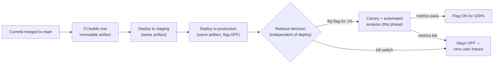
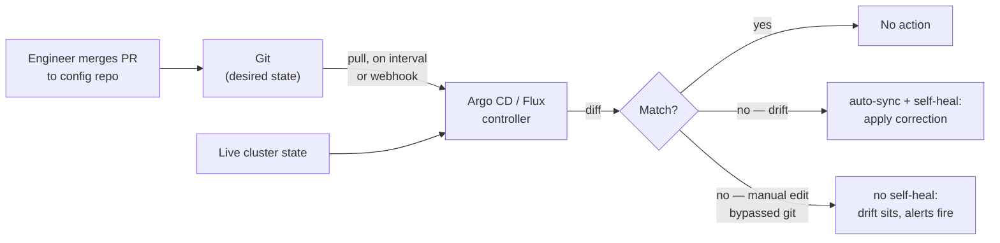

# Phase 10 - Delivery, GitOps and Platform Engineering

> **Weeks:** 61–65 | **Prerequisites:** Phases 6, 7, 8, 9 | **Time budget:** 45–55 hrs  
> **You finish this phase able to:**
> - Separate deploy from release with feature flags, and explain why that separation collapses most of the perceived risk in shipping software
> - Design a CI pipeline for dozens to hundreds of services around fast feedback, build-once-promote-many artifacts, and a supply-chain chain of custody from commit to running pod
> - Stand up an app-of-apps GitOps layout in Argo CD or Flux, and debug a stuck sync by reasoning about pull-based reconciliation instead of guessing
> - Automate a canary's abort decision from a Prometheus query and a stated threshold, closing the manual-judgment-call gap Phase 9 deliberately left open
> - Run an expand-contract schema migration in production with no rollback plan, because you designed it to be forward-fixable from the first step
> - Keep continuous delivery inside a regulated environment (SOX, PCI) using automated evidence and peer review instead of a change-advisory-board meeting
> - Explain what a platform team actually sells, to whom, and design a golden path a stream-aligned team would choose voluntarily

## Why this phase exists

Microservices only pay off if each service can ship independently, safely, and often. If your release process needs a meeting, you have paid the microservices tax — the coordination overhead, the operational surface, the network calls that used to be function calls — and taken none of the benefit, because the thing that was supposed to get faster (shipping a change) still moves at monolith-plus-meeting speed. A ten-service estate where every deploy needs a change-advisory-board sign-off is strictly worse than a one-service monolith deployed by whoever wrote the change: more moving parts, same release cadence, extra Slack channels.

Everything this phase teaches compounds on the previous nine. [Phase 9](phase-09-containers-kubernetes-cloud.md) built the platform a service runs on — the reconciliation loop, the probes, the rollout mechanics, the autoscaling — and closed its own anti-patterns section by naming `kubectl apply` from a laptop as the thing GitOps replaces, and by leaving the canary pattern's abort condition as "a manual judgment call" for this phase to automate. [Phase 8](phase-08-observability-and-operations.md) built the burn-rate alerting and RED dashboards this phase's automated canary analysis queries directly — a canary with no metrics to check is just a slow rollout with extra steps. [Phase 7](phase-07-security-and-compliance.md) built the audit-evidence pattern (a pull request is a review record; a pipeline run is a control) this phase's regulated-environment section applies specifically to deployment. [Phase 6](phase-06-resilience-engineering.md) built the kill-switch instinct and the "what you don't exercise rots" discipline this phase's feature flags and rollback strategy depend on.

The specific gap this phase closes is the one that keeps otherwise-mature engineering organizations stuck at release-train cadence: they can build a service correctly, instrument it correctly, and deploy it to Kubernetes correctly, and still ship changes to production every two weeks because nobody separated the technical act of putting new code on a server from the business act of deciding customers see it. That single separation — deploy versus release — is the lever this entire phase turns.

## Mental model

**Deploy is a technical event; release is a business event. Separate them with flags and progressive delivery, and the risk of shipping collapses.**

A deploy puts new code onto production infrastructure. A release exposes that new code's behavior to some or all users. Conflating the two is the default in most teams' mental model, and it is the reason deploys feel dangerous: if deploying and releasing are the same act, every deploy is a bet on the entire blast radius at once, decided the moment `kubectl` (or, after this phase, Argo CD) applies the manifest. Separate them, and a deploy becomes almost boring — new code sits behind a flag, defaulted off, or reachable by 1% of traffic behind a canary — while a release becomes a deliberate, reversible, observable decision made independently of the deploy pipeline, on its own timeline, by whoever actually owns the business risk.

This is not a new idea bolted onto continuous delivery; it *is* what continuous delivery, done correctly, means. "Continuously deliverable" describes the pipeline's readiness to ship at any time — it does not require that every commit reach every user the moment it merges. The confusion between the two is why teams that adopt a CI/CD pipeline but keep coupling deploy and release still feel like they cannot move fast: they built the machine that makes shipping cheap, then kept using it as if shipping were still expensive.



The corollary that matters for a platform team: once deploy and release are separate, most of what used to require a slow, synchronous human gate — "are you sure this is safe to expose to everyone" — becomes an automatable, reversible, small-blast-radius decision. That is the throughline of every pattern in this phase: build-once-promote-many separates *which bits run* from *where they run*; GitOps separates *what should be running* from *who applied it*; canary analysis separates *is this healthy* from *did a human remember to check*; expand-contract separates *the data's shape* from *the moment any single deploy flips it*. Every one of them is the same trick — decouple a risky, coupled decision into an independent, reversible one — applied to a different axis of shipping software.

## Core concepts

### DORA metrics: what the research does and does not claim

The DORA (DevOps Research and Assessment) research program, published annually in the **State of DevOps** reports and in **Accelerate** (Forsgren, Humble, Kim), identified four metrics — the "four keys" — that correlate with an organization's software delivery and operational performance, across years of surveys spanning thousands of teams:

| Metric | Question it answers | What "elite" looks like, per DORA's own bands |
|---|---|---|
| Deployment frequency | How often do you successfully release to production? | On-demand, multiple times per day |
| Lead time for changes | How long from commit to running in production? | Under one hour |
| Change failure rate | What fraction of deploys cause a degradation requiring remediation? | 0–15% |
| Failed-deployment recovery time | How long to restore service after a deploy causes an incident? | Under one hour |

Two things matter more than the numbers themselves. First, DORA's own repeated finding is that these four metrics do not trade off against each other the way intuition suggests — teams that deploy more often do not have a higher change failure rate, they have a lower one, because the same underlying practices (small batch sizes, trunk-based development, automated testing, fast feedback) drive both speed and stability simultaneously. Second, this is correlational research across many organizations, not a physical law that guarantees any single team's outcome — it describes what tends to travel together, not a recipe that works regardless of what else a team does.

**What the research does not claim:** it does not claim that deploying more often *causes* safety by itself, and it does not claim these four numbers are a complete picture of software delivery performance — DORA's later work explicitly added cultural and reliability measures precisely because the four keys alone can be gamed. A team that responds to "deployment frequency" pressure by splitting one meaningful change into ten trivial, low-risk commits improves the dashboard and ships nothing more valuable — this is optimizing the metric instead of the system the metric was designed to reveal, the same Goodhart's-law trap that shows up anywhere a proxy measure gets managed directly.

**Instrumenting the four keys from your own systems.** Deployment frequency and lead time for changes are directly queryable from pipeline and GitOps event history — a deploy is a GitOps commit merged and reconciled, timestamped, correlated back to the code commit that triggered it. Change failure rate and recovery time need incident data tagged with a causal link to a specific deploy — which means the "what changed in the last hour" change log [Phase 8](phase-08-observability-and-operations.md)'s incident-response checklist already asks for is exactly the raw material change failure rate is computed from; a team with good incident tagging discipline gets this metric almost for free, and a team without it cannot compute change failure rate honestly no matter how good its pipeline dashboards look.

### Branching: trunk-based development versus GitFlow

**Trunk-based development** means every engineer commits to a single shared branch (`main`/`trunk`) frequently — at least daily — behind short-lived feature branches measured in hours, not weeks, with incomplete work hidden behind a feature flag rather than isolated on a long-lived branch. **GitFlow** (and its many release-branch variants) maintains long-lived `develop`, `release/*`, and `hotfix/*` branches, merging between them on a schedule, with a release branch cut and stabilized before it ships.

The incompatibility is structural, not stylistic: continuous delivery requires that `main` is always in a deployable state, and a long-lived branch is, by construction, a body of code that has diverged from what is actually running in production for days or weeks — the merge back into `main` is exactly the moment integration risk that should have been caught daily gets caught all at once, in a stressful, time-boxed release-stabilization window. GitFlow was designed for a world of infrequent, versioned software releases (shipping a desktop installer, a mobile app store submission) where "master" meaningfully meant "the last shipped version" and a release branch's multi-week life was proportionate to a multi-month release cycle. Applied to a continuously-deployed service, the same branch model manufactures the exact integration pain continuous delivery exists to eliminate.

**The migration path for a team addicted to release branches:** do not attempt a big-bang switch to trunk-based development on a team that has never shipped incomplete work behind a flag — it will fail the first time someone needs to "hide" a half-finished feature and reaches for a branch out of habit. Sequence it: introduce feature flags first (so incomplete work has somewhere to hide that is not a branch), shorten the release-branch lifetime gradually (weekly, then a few days, watching the merge-conflict pain shrink as batch size shrinks), and only remove the release branch entirely once the team has demonstrated it can ship a flagged, incomplete feature to `main` without incident. The release branch's disappearance is a lagging indicator of trust in the pipeline, not something to mandate ahead of that trust existing.

### Feature flags

**Plain English:** A feature flag is an if-statement whose condition lives outside your code, in a system you can change without shipping anything — so you can turn a feature on or off, for anyone, at any time, without a deploy.

**Analogy:** A dimmer switch wired into a separate control panel down the hall, rather than a plain switch hardwired at the light fixture. The electrician (the deploy) installs the wiring once. The building manager (the flag) decides afterward, independently, whether the light is on, at what brightness, and for which rooms — and can change that decision in seconds without touching a single wire. Where the analogy breaks down: a real dimmer has one state that everyone in the room sees identically. A flag routinely needs to answer "on for whom" — a specific tenant, a percentage of traffic, a named cohort — and "how consistently," because the same user hitting the same flag twice in one checkout flow needs to see the same variant both times, which requires a stable, deterministic bucketing decision rather than a fresh coin flip on every evaluation. A dimmer has no concept of two people in the same room seeing different brightness on purpose.

**In the real world:** Large consumer platforms — the kind that run experimentation at Netflix or Spotify's scale — maintain internal flag and experimentation platforms specifically so a product manager can kill a misbehaving feature at 2 a.m. without paging an engineer to write, review, and deploy a revert. The flag *is* the incident-response tool in that scenario, faster than any pipeline.

**Mechanics:** four flag types serve four different lifetimes and purposes, and conflating them is the root of most flag debt:

| Type | Purpose | Expected lifetime |
|---|---|---|
| **Release flag** | Hide incomplete work on `main` during trunk-based development | Days to a few weeks — removed the moment the feature is fully rolled out |
| **Ops flag** | A kill switch for operational control — disable a non-essential, expensive feature under load | Long-lived by design; this one is meant to stay |
| **Permission flag** | Entitlement — gate a feature by plan, tier, or account type | Long-lived by design; it encodes a real, ongoing business rule |
| **Experiment flag** | Assign users to A/B variants for a product decision | Removed the moment the experiment concludes and a winner ships |

**OpenFeature**, a CNCF specification, is the vendor-neutral flag-evaluation API: application code depends on one interface, and the backing provider — LaunchDarkly, Unleash (open-source, self-hostable), or an in-house service — is swappable without touching call sites. Evaluation needs to be fast (a local SDK cache fed by a streaming update, not a synchronous network round trip on every check in a hot path) and consistent (deterministic bucketing by a stable key — user ID, account ID — so a user does not see two different experiences mid-journey because two services independently re-evaluated the same experiment).

**What breaks:** a flag is a branch in production. Every day a flag lives past the purpose it was created for is a day two code paths — flag on, flag off — must both keep compiling, both keep passing tests, and both keep being reasoned about by anyone touching that code, whether or not anyone remembers why. The industry-standard failure mode is a release flag, fully rolled out for months, that nobody removes, quietly doubling the cognitive load of every future change to that code path — this is exactly war story 4 later in this phase, where a forgotten flag doubled cloud spend rather than merely doubling code paths.

### CI pipeline design for many services

**Stage ordering for fast feedback.** The cheapest, fastest checks run first and block the least: lint, format, and secret scanning in seconds locally or at commit; unit tests in under a couple of minutes on every push; slower integration tests, security scans, and container builds after that, once the fast checks already passed. This is the same "scan the diff, not the world, on the critical path" discipline [Phase 7](phase-07-security-and-compliance.md) established for security gates specifically, generalized to the whole pipeline — a 45-minute pipeline on every commit trains engineers to stop watching it, and a slow gate that nobody watches is a gate that will eventually be silently disabled.

**Test tiering.** Unit tests (seconds, thousands per run, no external dependencies) run on every push. Component and integration tests (minutes, Testcontainers-backed, real database and broker) run on every pull request. Contract tests (covered in depth in [Phase 11](phase-11-testing-strategy.md)) run on every push touching a public interface. A small number of true end-to-end tests — expensive, slower, and the most prone to flakiness — run less frequently (nightly, or pre-release) rather than blocking every single commit; treating E2E tests as a merge gate for every PR is a common cause of a pipeline getting slow enough that people start ignoring it.

**Build caching and parallelism.** A remote build cache (Gradle's build cache, Bazel's remote cache) shared across CI runners means a second engineer's build of the same unchanged module never recompiles it — this is often the single largest lever on pipeline wall-clock time in a large codebase. Test sharding runs independent test suites in parallel across multiple runners rather than serially on one, trading CI compute cost for wall-clock latency, which is almost always the right trade when the alternative is engineers waiting.

**Monorepo versus polyrepo.**

| | Monorepo | Polyrepo |
|---|---|---|
| Cross-service atomic changes | Trivial — one commit, one PR | Hard — coordinated multi-repo PRs, or a temporary compatibility window |
| Build tooling investment required | High — needs affected-target build tooling to stay fast at scale | Low — each repo's pipeline is independently simple |
| Ownership boundary clarity | Requires deliberate `CODEOWNERS`/directory discipline | Free — repo boundary is the ownership boundary |
| Dependency version drift across services | Low — one version of a shared library, enforced by the build | High — services silently diverge on library versions over time |
| Onboarding a new engineer | One checkout, one set of tools | Must discover which of N repos matter for their team |

**Affected-target builds** are what makes a monorepo viable at scale: Bazel, Gradle (with configuration cache and dependency-aware task graphs), and Nx all compute which build/test targets are actually affected by a given change and run only those, instead of rebuilding and re-testing the entire repository on every commit — without this, monorepo CI time grows with the whole codebase's size rather than with the size of any individual change, which becomes unusable well before a company reaches large scale. The deciding factor between monorepo and polyrepo is rarely codebase size — it is whether the team is willing to invest in the tooling monorepo needs (affected-target builds, `CODEOWNERS`-enforced review boundaries) versus the coordination discipline polyrepo needs (a documented cross-repo change process, a shared versioning convention). Neither is free; each converts a cost into a different shape.

**Artifact immutability and digest pinning.** Every artifact — a container image, a published library — is built exactly once and referenced afterward by an immutable identifier (a digest for images, an immutable version for a library), exactly the discipline [Phase 9](phase-09-containers-kubernetes-cloud.md) established for container images; this phase's build-once-promote-many pattern is that same principle applied to the whole delivery pipeline, not just the image layer.

**Semantic versioning for libraries, commit-SHA versioning for services.** A shared library has real external consumers who need to reason about upgrade risk before they take it — semantic versioning (`MAJOR.MINOR.PATCH`, where major means a breaking change) is a genuine, load-bearing signal there. A deployable service has no such consumer — nobody "depends on service X version 2.4.1" the way code depends on a library version — so versioning a service by commit SHA or build number is not a shortcut, it is the more honest model: the artifact that is running is identified by exactly the commit that produced it, and semantic versioning applied to a service is usually theater that implies a stability contract nothing actually enforces.

**Quality gates that fail fast without becoming a standing tax.** A gate earns a place in the pipeline only if its false-positive rate stays low enough that engineers do not learn to route around it — the same principle [Phase 7](phase-07-security-and-compliance.md) applied to security gates specifically: gates that block merges get disabled or overridden the moment they cry wolf too often; gates that inform fast, with a low false-positive rate, get used and trusted. Review and prune gates on a schedule, the same way dashboards need a named owner — an unmaintained gate quietly becomes either a bottleneck nobody questions or a rubber stamp nobody trusts.

### Supply chain in the pipeline

Every artifact a pipeline produces is a target, and the chain from source to running pod needs to be provable end to end, not just scanned once at one point:

- **SBOM (Software Bill of Materials)** generation at build time (Syft, or a build-tool-native plugin) produces a machine-readable inventory of every dependency in the artifact — the thing a security team queries the instant a new CVE drops, instead of re-scanning every service in the estate from scratch to find out who is exposed.
- **Dependency and container scanning** (Trivy, Grype — the same tools [Phase 9](phase-09-containers-kubernetes-cloud.md) introduced for image scanning, and Phase 7's SCA gates for dependencies generally) run in the pipeline, failing the build on an unresolved critical/high finding rather than a separately scheduled, easily ignored report.
- **Secret scanning** on every commit and every pull request catches a credential accidentally committed before it ever reaches a shared history that is expensive to purge.
- **Signing** (Sigstore/`cosign`, introduced in Phase 9 for image signatures) extends here to signing every artifact the pipeline produces — not just the final container image, but the SBOM and the provenance attestation alongside it.
- **Provenance attestation** records *how* an artifact was built — which pipeline, which commit, which inputs, whether the build ran in an isolated, non-interactive environment — as a signed, machine-verifiable statement (an in-toto attestation) rather than an implicit claim. The **SLSA** framework (Supply-chain Levels for Software Artifacts) grades this rigor in increasing levels, from basic build-provenance metadata up to fully hermetic, reproducible builds — useful less as a certification to chase and more as a checklist of concretely improvable supply-chain properties.
- **Admission verification at deploy time** closes the loop: an admission controller (Kyverno/Gatekeeper, per Phase 9) rejects any image without a valid signature and a valid provenance attestation before it is ever scheduled — the gap between "we scanned this in CI" and "the thing that deploys is the thing we scanned" only closes if something enforces it at the cluster boundary, not just at build time.

### CD and environments

**The promotion model.** The build-once-promote-many artifact from CI moves through environments — dev, staging, production — unchanged; what changes per environment is configuration (a database URL, a feature-flag default, a replica count), injected at deploy time and stored as code in the GitOps config repo, never baked into a rebuild. Promotion is a GitOps commit (bumping an image tag or digest reference in a config repo path) reviewed the same way an application code change is reviewed, not a separate, less-scrutinized side channel.

**Ephemeral preview environments per pull request.** A full or scoped-down environment stood up automatically for an open PR, torn down automatically on merge or close, gives reviewers and the PR's author a real, running system to test against instead of trusting a diff to be correct by inspection alone. This closes a gap unit and even integration tests cannot: "does this actually work when a real request flows through it, in an environment that looks like production" is a question a preview environment answers directly, before merge, when the change is cheapest to fix.

**The problem with a single shared staging environment.** One staging environment shared by every team becomes a queue — whoever's change is currently deployed to it blocks everyone else's ability to test cleanly — and a source of false confidence, because staging inevitably drifts from production's actual scale, data shape, and traffic pattern in ways nobody notices until an incident happens in production that staging never could have caught. "We test in staging" as the entire release-safety strategy is listed as an anti-pattern later in this phase for exactly this reason: staging answers "does this generally work," never "does this work under production's actual load, actual data, actual failure modes" — that question belongs to progressive delivery in production, with real traffic, not to a pre-production environment pretending to be one.

**Environment parity and configuration as code per environment.** Every environment should be generated from the *same* manifests, with only environment-scoped values differing — a Helm values file or a Kustomize overlay per environment, version-controlled and reviewed like any other change — rather than a hand-maintained, independently-drifting set of YAML per environment that nobody can confidently say is equivalent to production. Parity is what makes staging's signal trustworthy at all; without it, "passed in staging" and "will pass in production" are two different, unrelated claims.

### GitOps

**Plain English:** Instead of an engineer pushing a change directly at a cluster, the cluster itself continuously and automatically pulls its own desired state from a git repository, compares it against what is actually running, and fixes any difference it finds.

**Analogy:** A thermostat, not someone manually adjusting a furnace dial by hand. The thermostat does not wait to be told to act — it continuously checks the room's actual temperature against a set point stored somewhere else, and nudges the furnace whenever they diverge, on its own schedule, without a human in the loop for the routine case. Where the analogy breaks down: a thermostat manages one variable, instantly and locally. A GitOps controller reconciling an entire cluster's worth of services has ordering dependencies between resources (a ConfigMap must exist before the Deployment that mounts it, enforced by explicit sync waves), a health-check step that is itself fallible (a resource can report "synced" before it is actually healthy), and a real, measurable reconciliation lag between a git commit landing and the cluster's live state actually reflecting it — nothing about it is as instantaneous as a thermostat's local feedback loop.

**In the real world:** by 2026 the honest answer to "how do you deploy" at a platform-mature organization is usually "we don't — we merge a pull request, and Argo CD or Flux applies it," which is the direct, one-level-up extension of [Phase 9](phase-09-containers-kubernetes-cloud.md)'s reconciliation-loop mental model: Kubernetes itself already reconciles Pods toward a Deployment's declared spec; GitOps reconciles the *cluster's entire manifest set* toward a git repository, applying the identical idea one layer above where Phase 9 stopped.

**Mechanics.** **Argo CD** and **Flux** both run as controllers inside (or alongside) the cluster, watch a git repository, diff the live cluster state against the repository's declared state, and either alert on drift or automatically apply the correction, depending on the configured sync policy — `auto-sync` with `self-heal` closes the loop completely; a more conservative policy requires a human to click "sync" after reviewing the diff. **Repository structure** typically separates an **app repo** (source code, Dockerfile, the Helm chart or Kustomize base that describes how the service is deployed in the abstract) from a **config repo** (the actual, environment-specific desired state — which image digest, which replica count, which environment's config values — for every environment and every service), so that promoting a build from staging to production is a small, reviewable pull request against the config repo, never a rebuild and never a hand-edited manifest. **App-of-apps** (Argo CD) or an **ApplicationSet** generator (a git-directory generator, a cluster-list generator, or a matrix of both) scales this to many services: a single template plus a generator produces one `Application` per service automatically, so onboarding service number sixty-one means adding one entry to a list, not hand-wiring a sixty-first pipeline. **Secrets in GitOps** cannot be committed in plaintext — **Sealed Secrets** encrypts a secret client-side into ciphertext that only the cluster's own controller can decrypt, safe to commit to git as-is; **External Secrets Operator** (Phase 9) takes the alternative approach of never putting the secret in git at all, syncing it directly from a cloud secret manager into the cluster.

**What breaks:** the failure mode this pattern exists to prevent, and the one that recurs the moment discipline slips, is a human with cluster access running `kubectl edit` directly against a GitOps-managed resource. With `self-heal` enabled, the very next reconciliation loop reverts the manual change silently, and the engineer who made it is left confused about why their fix "didn't stick." Without `self-heal`, the drift simply sits, invisible, until a dashboard someone forgot to check eventually shows it — reintroducing exactly the "declared state has silently diverged from anything anyone can reconstruct" failure Phase 9 flagged for direct `kubectl apply`, now one layer up the stack and easier to miss because GitOps looks, from a distance, like it has already solved this.



### Progressive delivery

Four related techniques share one goal — expose a change to a bounded, controlled slice of the world before exposing it to everyone — and differ in what they bound and how they decide to expand:

| Technique | What is bounded | Decision mechanism | Typical fit |
|---|---|---|---|
| **Rolling update** | Nothing deliberately — the default Kubernetes rollout mechanism | None; progresses on a timer/health check, not a business signal | Routine, low-risk changes (Phase 9's default) |
| **Blue/green** | Nothing during the cutover — instant, all-or-nothing switch, but instantly reversible | A human decision after full verification of the idle environment | Risky or disruptive changes needing an instant, tested cutover and an equally instant rollback |
| **Canary with automated analysis** | A small percentage of real traffic | An automated Prometheus-query-driven promote/abort decision (below) | Any critical, user-facing change where real production signal is worth the added routing complexity |
| **Traffic mirroring / shadow** | Zero user-facing risk — the new version sees a copy of real traffic and its response is discarded | A human comparing shadow-version behavior against production offline | Validating a rewrite's behavior against real traffic before it ever serves a real response |
| **Dark launch** | Zero traffic — the code path exists and runs but nothing routes to it yet | A human flips the flag once infra readiness is separately confirmed | Testing a feature's operational footprint (resource usage, dependency load) before any user sees it |
| **A/B experimentation** | Traffic split by design, sustained for statistical power, not safety | A statistical significance test on a product metric, not an abort threshold | A product decision (does variant B convert better), not a safety decision |

**The decision rule.** Reach for a rolling update by default — it is the cheapest, and correct for anything you would not stop to think twice about. Reach for blue/green when the change is risky enough that you want the option of an instant, complete reversal, and you can afford to run two full environments briefly. Reach for canary with automated analysis when the risk is real but bounded, and you have the RED and burn-rate metrics from [Phase 8](phase-08-observability-and-operations.md) to query — this is the workhorse for anything user-facing and consequential. Reach for traffic mirroring when you need to validate behavior against real traffic with literally zero user-facing risk, typically for a rewrite or a major dependency swap. Reach for dark launch when the operational footprint, not the user-facing correctness, is what you are validating. Reach for A/B only when the question is a product question — which variant converts better — not a safety question; conflating A/B with canary analysis is a common mistake, because A/B needs the split sustained long enough to reach statistical significance, which is the opposite of what a canary wants (get in and out of the risky window fast).

**Database and message-consumer constraints.** Progressive delivery's traffic-splitting model assumes a stateless request/response boundary, which a database write or a message consumer does not have. You cannot blue/green a database schema the way you blue/green a stateless service — the data itself has one shape at a time, shared by both the "blue" and "green" application versions during any overlap window, which is exactly why expand-contract (below) exists as a separate discipline. You cannot naively blue/green a Kafka consumer group either: two full consumer instances running under the *same* consumer group ID during a cutover trigger a partition rebalance mid-migration — a real, if brief, processing pause, and a risk of duplicate delivery if group membership flaps during the switch. Running the "green" consumer under a *different* group ID instead avoids the rebalance, but a new group ID has no committed offset history, so it starts consuming from the earliest retained offset or from "now," either re-processing history (duplicate side effects, unless every consumer is already idempotent per Phase 5) or silently skipping a window of messages. The safe pattern for a consumer-shaped workload is a single active consumer group at a time, with the actual behavior change gated by a feature flag evaluated inside the consumer logic — the deploy and the release are separated *inside* the consumer, not at the infrastructure routing layer, because the infrastructure layer has no equivalent of "traffic weight" for a pull-based consumer.

### Database changes in a continuous delivery world

**Plain English:** Change your data's shape in several small, always-compatible steps instead of one big flip, so that at every single point in the sequence, both the old and the new application code can read and write correctly.

**Analogy:** Widening a bridge without ever closing it to traffic — build the new lane fully alongside the old one, open the new lane while the old lane is still carrying cars, watch both work correctly together for a while, and only then close and remove the old lane once nothing depends on it anymore. Where the analogy breaks down: a bridge widening is directed by one team on one controlled timeline, with full authority to pause traffic if something looks wrong. A live schema migration has multiple uncoordinated application instances — old-version pods and new-version pods, mid-rollout, per Phase 9's rolling-update mechanics — reading and writing the same tables simultaneously, with no single party able to pause the "traffic" (real user requests) while the migration catches its breath.

**In the real world:** engineering teams publicly describe multi-step online schema migrations for exactly this reason — add a new column as nullable, backfill it in batches, dual-write to both the old and new columns from every app version, cut reads over to the new column only once the backfill is verified complete, and only then drop the old column — often using online-schema-change tooling (`gh-ost`, `pt-online-schema-change`, or a managed database's native online DDL) specifically to avoid a lock that stalls the whole table under production load.

**Mechanics — the expand-contract playbook, numbered:**

1. **Expand:** add the new column, table, or index without touching the old one. Both old and new application code paths continue to work unmodified, because nothing that existed before was removed or renamed.
2. **Backfill:** populate the new shape from existing data, as a rate-limited, resumable, checkpointed batch job — never as a single unbounded `UPDATE`, which is precisely how war story 2 later in this phase locks a hot table for forty minutes at peak.
3. **Dual-write:** every application version, old or new, now writes to *both* shapes on every write, so the new shape stays correct and current regardless of which version's pod happens to handle any given request during a rolling deploy.
4. **Cutover reads:** once the backfill is verified complete and dual-writes have been running long enough to trust the new shape's correctness, switch reads to the new shape — this can itself be done progressively, behind a flag, per the progressive-delivery techniques above.
5. **Contract:** only after every old-version pod is confirmed gone and the cutover has been stable for a real observation window, remove the old column, table, or write path. This step is irreversible in practice, which is exactly why it is last and separately gated.

**Where migrations run.** An **init container** runs once before the application container starts — simple, but multiple replicas starting concurrently during a rolling deploy will each attempt to run it, racing unless the migration tool itself enforces a lock (Flyway and Liquibase both acquire a schema-level advisory lock specifically so concurrent instances serialize or skip safely rather than corrupting each other's runs). A dedicated **Job**, decoupled from the application's own lifecycle and run once by the deploy pipeline before the rollout proceeds, is the cleaner default for anything beyond a trivial migration, because it separates "did the migration succeed" from "did the application start" as two independently observable, independently retryable steps. Running the migration from **application startup code** directly is the simplest option for local development and the most dangerous for production, for exactly the same multi-replica race as the init-container case, now with less isolation from the application's own startup failure modes.

**Backward/forward compatibility windows.** During any rolling deploy, both the N (old) and N+1 (new) application versions are live simultaneously and both must work correctly against whatever the database's current shape is at that moment — this is the same rolling-update overlap [Phase 9](phase-09-containers-kubernetes-cloud.md) covers for stateless code, applied to schema; a migration that only the new version can tolerate breaks the old version's still-running pods the instant it lands, regardless of how careful the rollout's `maxSurge`/`maxUnavailable` settings are.

**What breaks:** the hard truth this whole playbook exists to teach is that **rollback is not possible once data has been written in the new shape.** A deploy can be rolled back; a completed contract step, or even a partially-completed backfill that later writes depended on, cannot be un-run without a separate, deliberate data-recovery effort — which is why the discipline is to design forward-fix from the very first step, never to plan on "and if it goes wrong, we'll just roll back the deploy" once real writes have landed in the new shape.

### Rollback strategy

**What is rollback-safe:** a stateless code change with no schema dependency, a configuration change, and — most importantly — a feature flag, which can be flipped back to its previous state in seconds regardless of what deploy is currently running. **What is not rollback-safe:** any migration step at or past "backfill" that subsequent writes now depend on, and any change that has already been observed by an external system (a webhook fired, a payment captured, an email sent) that cannot be un-sent by reverting a deployment.

**Automated rollback triggers** are the direct output of the canary-with-automated-analysis pattern below: when the analysis's abort threshold trips, the rollout controller (Argo Rollouts, Flagger) reverts traffic to the previous, known-good ReplicaSet automatically, with no human decision in the critical path — this is the concrete mechanism that closes [Phase 9](phase-09-containers-kubernetes-cloud.md)'s canary pattern, which left "no automated abort condition" as an explicitly named gap for this phase to fill.

**"Roll forward with a flag" as the default.** Given the choice between rolling back a deployment and shipping a new, small deploy that flips a flag off, prefer the flag every time it is available — it is faster to execute, does not require re-running a whole pipeline, and sidesteps the entire "is this deploy actually rollback-safe" question, because flipping a flag never touches the database's shape. Reserve an actual deployment rollback for the cases a flag cannot cover — a genuine infrastructure or dependency-version regression with no flag guarding it — and treat "we shipped this feature with no flag at all" as a decision that specifically forfeits the fast, safe rollback path, worth challenging in review rather than accepting as the default.

### Change management in regulated environments

**Plain English:** you can ship software constantly and still prove, after the fact and to a skeptical auditor, that the person who wrote a change was never the only person who could put it into production.

**Analogy:** a bank teller and the officer who approves a large withdrawal are never the same person — not because either individual is untrusted, but because the entire point of the control is that a second, independent party's confirmation exists as a documented fact whenever an auditor asks for it, regardless of how much either individual is personally trusted. Where the analogy breaks down: the teller/approver model assumes a slow, one-transaction-at-a-time human process built around exactly that pace. A continuously-deploying engineering team needs the equivalent independent confirmation to happen hundreds of times a day without a human bottleneck sitting in front of every single deploy — the analogy has no equivalent of "the control itself must also be fast."

**In the real world:** regulated fintechs have publicly described running full continuous delivery under a documented separation-of-duties model where the required second-party review *is* the pull request approval itself — Monzo, operating as a regulated bank, has discussed exactly this shape of engineering practice — and the audit control is automated evidence generated by the pipeline, not a change-advisory-board meeting scheduled per deploy.

**Mechanics.** Separation of duties is satisfied by requiring a peer who is not the change's author to approve the pull request before merge; tying the merge commit, through the pipeline, to a generated deployment record (who authored it, who approved it, which tests ran, what the scan and SBOM results were, when it reconciled into production) — the same "change management turns into pipeline evidence" mapping [Phase 7](phase-07-security-and-compliance.md) established for SOC 2 controls generally, applied specifically to the deploy event; and reserving a distinct, separately-audited **emergency change process** (a break-glass path) for the rare case that genuinely cannot wait for normal review, which still requires a post-hoc review within a defined window rather than blocking an active incident's mitigation.

**What breaks:** the common, wrong reading of "separation of duties" is that a human change-advisory board must approve every individual production deploy — which reintroduces precisely the release-train bottleneck this entire phase argues against, and it is not what the regulation actually asks for. SOX and PCI-DSS's change-management clauses ask for evidence of independent review and a documented, repeatable process; they do not mandate that the reviewer be a committee, or that review happen synchronously per deploy rather than asynchronously per pull request. A team that over-reads the requirement into a slow gate has traded velocity for a control stricter than the one actually required, and usually discovers this only when a more sophisticated peer team demonstrates full continuous delivery passing the same audit.

### Infrastructure as code

**Terraform module structure.** A well-factored Terraform layout separates reusable modules (a "VPC" module, a "service's cloud dependencies" module — an RDS instance, an SQS queue, an IAM role, parameterized) from environment-specific root configurations that compose those modules with environment-specific inputs. **State management and locking** matter because Terraform's state file is the single source of truth for what it believes exists — a remote backend (S3 with DynamoDB locking, or Terraform Cloud/Enterprise's native locking) prevents two concurrent `terraform apply` runs from corrupting each other's view of reality, the infrastructure-layer equivalent of the database race conditions covered elsewhere in this roadmap. **Environments via directories versus workspaces:** a directory per environment (`envs/staging`, `envs/prod`) gives each environment its own state file and its own reviewable diff, at the cost of some duplication; Terraform workspaces share a single configuration parameterized by workspace name, reducing duplication at the cost of making it easier to accidentally target the wrong environment from the same working directory — directories are the safer default for anything where a mistaken `prod` apply is a real risk.

**Drift and plan review as code review.** Infrastructure drifts when a change is made outside Terraform (a console click, an emergency manual fix) — the next `terraform plan` shows that drift as a proposed change back to the declared state, which is either the correct outcome (revert the manual change) or a signal the manual change needs to be codified properly, but never something to `apply` blindly without reading. **`terraform plan`'s output reviewed in a pull request is architecturally identical to a GitOps diff** — both are "here is exactly what will change, reviewed by a human before it happens" — and treating a Terraform plan with the same review rigor as an application code change closes the same class of surprise that an un-reviewed `kubectl apply` would.

**Policy as code.** OPA (via Conftest, validating a Terraform plan's JSON output against a policy) or HashiCorp Sentinel (native to Terraform Cloud/Enterprise) encode organizational rules — no public S3 buckets, no unencrypted RDS instances, every resource tagged with a cost center — as automatically enforced policy at plan time, turning "we told everyone in a wiki page" into "the pipeline physically will not apply it," the identical argument [Phase 9](phase-09-containers-kubernetes-cloud.md) made for Kubernetes admission control, one layer down the stack.

**Alternatives and selection criteria.** **Pulumi** and **AWS CDK** let infrastructure be expressed in a general-purpose language (TypeScript, Python, Java) rather than a domain-specific one — genuinely useful where an organization already has strong conventions and testing culture in that language and wants infrastructure code to share it, at the cost of a broader attack surface for "clever" code that a declarative DSL structurally prevents. **Crossplane** takes a different approach entirely: cloud resources become Kubernetes custom resources, reconciled by controllers the same way any other Kubernetes object is — a natural fit for a team that has already fully bought into GitOps and wants infrastructure provisioning to go through the exact same reconciliation and review path as application deployment, at the cost of tying infrastructure provisioning to a running Kubernetes control plane rather than a standalone CLI tool. The selection criteria in practice: Terraform's ecosystem breadth and multi-cloud maturity make it the default absent a specific reason otherwise; Pulumi/CDK earn their place where a team's existing language expertise and testing habits are worth more than a DSL's guardrails; Crossplane earns its place specifically when infrastructure provisioning needs to live inside the same GitOps reconciliation loop as everything else in the cluster.

### Platform engineering

**The paved road.** A platform team's job is to build one well-supported, opinionated path — the golden path — that is genuinely easier to use than to avoid, with documented, reviewable escape hatches for the real exceptions, rather than a mandate enforced by refusal. A golden path that is merely *permitted* competes against every engineer's own preferences and prior habits and frequently loses; a golden path that is *actually easier* — because it comes with a working pipeline, dashboards, and an on-call rotation stub already wired up — wins by being the path of least resistance, which is the only version of standardization that survives contact with a busy sprint.

**Service templates and scaffolding.** A Backstage software template (or an equivalent internal scaffolding tool) generates a new service pre-wired with the golden-path CI pipeline, a starter dashboard, a `catalog-info.yaml` declaring an owning team, and a README — extending [Phase 2](phase-02-spring-boot-production-core.md)'s production-ready service template from something a human copies and adapts by hand into something a platform generates on demand, correctly, every time.

**The internal developer portal and service catalog.** A catalog with real ownership metadata — who owns this service, what tier it is, where its runbooks and dashboards live, what it depends on — is what turns "which team owns `pricing`" from tribal knowledge that evaporates with attrition into a queryable fact. **Backstage**, originated at Spotify and now a CNCF project, is the de facto industry-standard shape for this: a plugin-extensible portal unifying the catalog, scaffolding templates, and — per the scorecard pattern below — automated readiness checks, in one place engineers actually visit rather than a wiki page nobody maintains.

**Golden path versus freedom.** A golden path with zero escape hatch breeds resentment and, worse, covert workarounds that are less visible and less supported than an honest, reviewed deviation would have been. Total freedom, with no golden path at all, reproduces the "the estate is only as observable as its worst-instrumented service" problem [Phase 8](phase-08-observability-and-operations.md) already identified for telemetry, generalized to every other platform concern — build tooling, deployment mechanics, on-call readiness. The workable balance: the golden path is the default and the fast path; deviating from it is allowed, but as an explicit, reviewed decision (an ADR, in this roadmap's convention) rather than a silent, undocumented opt-out nobody downstream can see coming.

**Platform as a product.** A platform team should measure itself the way a product team measures itself: it has users (the stream-aligned teams consuming its golden path), it should state something like an SLA ("a new service scaffolds with a working pipeline in under an hour"), it needs real documentation, and it should track adoption metrics — the percentage of services actually on the golden path, the time from "we need a new service" to "it has its first successful deploy." A platform team that cannot state any of these is at real risk of degrading into the "ticket queue" anti-pattern named later in this phase: reactive, unmeasured, and invisible until something breaks.

**Team Topologies as the organizational model that makes this work.** Team Topologies (Skelton and Pais) names four team types: **stream-aligned** teams own a business domain end to end and are the platform's primary customer; **platform** teams (this phase's subject) provide self-service capability that reduces stream-aligned teams' cognitive load; **enabling** teams temporarily embed specialist expertise to unblock a stream-aligned team — helping it adopt GitOps, say — then leave once the capability transfers; **complicated-subsystem** teams own a piece of genuine, deep, narrow specialist complexity (a fraud-detection model, a physics engine) that would overload a generalist stream-aligned team. Three of the four named **interaction modes** matter here: **collaboration** (temporary, high-bandwidth, for genuine joint discovery), **X-as-a-service** (a low-bandwidth, well-defined, self-service relationship — the steady state a mature platform team should be running toward), and **facilitating** (an enabling team unblocking another team without doing the work for them). "Platform as a product" is, in Team Topologies' own vocabulary, the deliberate move from a collaboration-mode relationship with every consuming team toward an X-as-a-service relationship — and it is the organizational argument for why the platform team's job is self-service tooling rather than being the human gate in someone else's deploy path, which is exactly what the "manual approval as the only safety control" anti-pattern later in this phase gets wrong.

### Production readiness review

**What it contains.** A production readiness review (PRR) checks, before a service takes real traffic, that its SLOs are defined (Phase 8), it has runbooks with a real first step, its dependency failure modes have actually been exercised (Phase 6's chaos-engineering discipline, not just documented), a security review has happened (Phase 7), a capacity and cost estimate exists, and a rollback or forward-fix plan is stated — the roll-up of nearly every earlier phase's exit criteria, applied at the moment a specific service goes live rather than at the moment an engineer finishes studying the phase.

**Who runs it.** Traditionally a senior SRE or platform engineer, acting as a gate the launching team must pass before production traffic flows — which scales exactly as badly as any other manually-run gate does once the number of services crosses a handful.

**How it becomes automated.** The fix is the same one this phase applies everywhere else a human judgment call does not scale: turn the PRR's criteria into a **scorecard** — a continuously and automatically evaluated set of checks (does this service have an SLO actually configured in the monitoring system, not just described in a document; does it have a real on-call schedule in the paging tool; does it have a runbook link in the catalog; did its last chaos experiment actually run) surfaced on the service's catalog page, rather than a document written once before launch and never revisited. A scorecard that is always current answers "is this service still production-ready" continuously, not just on day one — a document cannot do that, because nobody schedules a re-read of a document that already shipped.

### Ownership and on-call

**"You build it, you run it"** — the ownership model the industry has broadly converged on, originally publicly associated with Amazon's engineering culture — puts the team that writes a service's code on the hook for operating it in production, closing the gap between "the people who made the decisions" and "the people who feel the consequences" that a separate, dedicated operations team structurally cannot close as well. **Service ownership metadata** — an explicit owning team recorded in the catalog, an escalation policy wired into the paging tool, a linked runbook — is what makes "you build it, you run it" operable at scale rather than an aspiration; without it, an incident on an unfamiliar service starts with "whose is this" instead of the actual diagnosis. **Escalation paths** — primary on-call, then secondary, then a team lead, then an incident commander for anything crossing into [Phase 8](phase-08-observability-and-operations.md)'s SEV1/SEV2 territory — need to be defined and rehearsed before the night they are actually needed.

**What makes developer on-call humane, not punitive:** good, symptom-based alerts (Phase 8) that page for something real rather than noise; runbooks with an actual first step rather than "investigate"; and — the condition most platform designs quietly fail — genuine **authority to fix**, meaning an on-call engineer who can merge a hotfix, flip a flag, or trigger a rollback without waiting on a separate approval chain, because a change-management model that satisfies the regulated-environment section above without an emergency-change carve-out for exactly this moment has built a control that actively prevents the person paged at 3 a.m. from doing their job.

## Production patterns

### Pattern: Build-once-promote-many

**What:** compile and package exactly one immutable, digest-pinned artifact per commit, and promote that identical artifact — unchanged — through every environment, injecting only environment-specific configuration at deploy time.

**When to use:** every service, every artifact, with no exception — this is the foundation every other pattern in this phase assumes is already true.

**When NOT to use:** there is no legitimate exception; the only real design decision is *how* environment-specific values are injected (env vars, mounted ConfigMaps, a config server) — never whether to rebuild per environment.

**Failure modes:**
- Environment-specific configuration baked into the image at build time forces a rebuild per environment, silently reintroducing "different bits ran in staging than in production" — the exact bug class this pattern exists to eliminate.
- A promotion pipeline that re-invokes `docker build` per environment instead of retagging or re-referencing an already-built digest, which both wastes time and reopens the door to a build producing subtly different bytes each time it runs.

```yaml
# GitHub Actions: build once, tag by digest; promotion is a separate job
# that only updates the GitOps config repo's image reference — never rebuilds.
jobs:
  build:
    steps:
      - run: docker build -t registry/order:${{ github.sha }} .
      - run: docker push registry/order:${{ github.sha }}
      - id: digest
        run: echo "digest=$(docker inspect --format='{{index .RepoDigests 0}}' registry/order:${{ github.sha }})" >> "$GITHUB_OUTPUT"
  promote-staging:
    needs: build
    steps:
      # Opens a PR against the config repo bumping staging's image reference — reviewed like any other change.
      - run: ./scripts/bump-config-repo.sh staging "${{ needs.build.outputs.digest }}"
```

### Pattern: Canary with automated analysis and abort

**What:** an Argo Rollouts `Rollout` (or a Flagger `Canary`) replacing a plain Deployment, stepping traffic weight upward through a sequence of `setWeight`/`pause` steps, with an `AnalysisTemplate` issuing a PromQL query at each step against a stated success condition — closing exactly the abort-condition gap [Phase 9](phase-09-containers-kubernetes-cloud.md) left as a manual judgment call.

**When to use:** any critical, user-facing service where you already have the RED and burn-rate metrics from [Phase 8](phase-08-observability-and-operations.md) to query, and a bad deploy has real, measurable cost.

**When NOT to use:** a low-traffic internal tool whose canary traffic never reaches statistical significance before a human would need to make the call anyway — a rolling update or blue/green serves that case with less complexity.

**Failure modes:**
- The analysis interval is shorter than the metric's own natural lag (a burn-rate query averaged over five minutes evaluated every thirty seconds), producing false aborts on transient noise the metric was never meant to react to that fast.
- The success condition's query scope silently excludes the exact traffic path that is failing — this is war story 1 later in this phase, and it is the single most consequential mistake this pattern can make, because it makes the automation actively worse than a human who would have noticed the gap.

```yaml
# Argo Rollouts: canary steps paired with an AnalysisTemplate querying Prometheus.
# Abort is automatic — no human judgment call in the critical path.
apiVersion: argoproj.io/v1alpha1
kind: Rollout
metadata: { name: order }
spec:
  strategy:
    canary:
      steps:
        - setWeight: 5
        - analysis:
            templates: [{ templateName: success-rate-and-latency }]
        - setWeight: 25
        - analysis:
            templates: [{ templateName: success-rate-and-latency }]
        - setWeight: 100
---
apiVersion: argoproj.io/v1alpha1
kind: AnalysisTemplate
metadata: { name: success-rate-and-latency }
spec:
  metrics:
    - name: error-rate
      interval: 1m
      failureLimit: 2          # abort after 2 consecutive failed checks — no human required
      provider:
        prometheus:
          address: http://prometheus:9090
          query: |
            sum(rate(http_requests_total{app="order", status=~"5..", route="/checkout"}[5m]))
            / sum(rate(http_requests_total{app="order", route="/checkout"}[5m]))
          successCondition: result[0] < 0.01     # error rate on the checkout route specifically
```

### Pattern: Expand-contract migration

**What:** the five-step schema-change playbook from Core concepts — expand, backfill, dual-write, cutover reads, contract — applied as a matter of course to any live-traffic schema change, never as a single migration.

**When to use:** any schema change to a table serving live reads or writes during a rolling deploy — which, for a continuously-deployed service, is nearly every schema change.

**When NOT to use:** a genuinely offline table with no concurrent readers or writers during a scheduled maintenance window, where a single-step migration is safe and the extra ceremony buys nothing.

**Failure modes:**
- The contract step runs before every old-version pod is confirmed fully drained, dropping a column a still-running old pod depends on mid-request.
- The backfill runs as a single unbounded statement against a hot table instead of a rate-limited, batched job, producing exactly war story 2's forty-minute lock later in this phase.

```sql
-- Step 1 (expand): additive only, both old and new code paths keep working unmodified.
ALTER TABLE orders ADD COLUMN shipping_zone_v2 VARCHAR(32) NULL;

-- Step 2 (backfill): rate-limited batches, never one unbounded UPDATE against a hot table.
UPDATE orders SET shipping_zone_v2 = derive_zone(shipping_zone)
WHERE id BETWEEN :batch_start AND :batch_end AND shipping_zone_v2 IS NULL;

-- Step 5 (contract): only after every old-version pod is gone and cutover has held stable.
ALTER TABLE orders DROP COLUMN shipping_zone;
```

### Pattern: Preview environment per pull request

**What:** an ephemeral environment, scoped to the changed service plus its real or stubbed dependencies, created automatically when a PR opens and torn down automatically when it merges or closes.

**When to use:** any team where "does this actually work end to end" needs answering before merge, and the marginal infrastructure cost of a short-lived environment is affordable.

**When NOT to use:** a large monorepo where spinning up dozens of transitively-dependent services per PR costs more, in both money and pipeline time, than the risk it catches — scope the preview to the affected service plus stubbed or shared read-only dependencies instead of the entire estate.

**Failure modes:**
- Multiple preview environments sharing one mutable database or tenant corrupt each other's test data the moment two PRs are open concurrently.
- Environments that are never torn down — a failed cleanup hook, an abandoned PR — become an invisible, compounding cost leak nobody notices until a monthly bill review.

```yaml
# Argo CD ApplicationSet: a pull-request generator creates one ephemeral Application per open PR.
apiVersion: argoproj.io/v1alpha1
kind: ApplicationSet
metadata: { name: order-pr-previews }
spec:
  generators:
    - pullRequest:
        github: { owner: shopkart, repo: order }
        requeueAfterSeconds: 60
  template:
    metadata: { name: "order-pr-{{number}}" }
    spec:
      source: { repoURL: "https://github.com/shopkart/order", targetRevision: "{{head_sha}}" }
      destination: { namespace: "preview-pr-{{number}}" }
      syncPolicy: { automated: { prune: true } }   # torn down automatically when the PR closes
```

### Pattern: App-of-apps GitOps layout

**What:** a root Argo CD `Application` whose sole job is to declare child `Application` objects — directly, or generated by an `ApplicationSet` — so that onboarding a new service is a one-line addition to a generator's input, not a hand-wired new pipeline.

**When to use:** any estate with more than a handful of services under GitOps; the coordination benefit — one place to see and reason about everything under management — compounds directly with service count.

**When NOT to use:** a single-service estate, where the extra layer of indirection has nothing to coordinate yet; introduce it the moment a second service joins, since retrofitting it later means migrating every existing `Application` at once.

**Failure modes:**
- Sync-wave ordering is left unset, so a service's ConfigMap and Deployment race during the very first sync of a fresh cluster, and the Deployment starts against config that has not landed yet.
- The root `Application` itself drifts from git and nobody notices, because it is "meta" tooling and rarely appears on any single team's dashboard.

```yaml
# Root Application: declares nothing but the ApplicationSet that generates every service's Application.
apiVersion: argoproj.io/v1alpha1
kind: ApplicationSet
metadata: { name: shopkart-services }
spec:
  generators:
    - git:
        repoURL: "https://github.com/shopkart/gitops-config"
        directories: [{ path: "services/*" }]      # one directory per service == one Application
  template:
    metadata: { name: "{{path.basename}}" }
    spec:
      source: { repoURL: "https://github.com/shopkart/gitops-config", path: "{{path}}" }
      destination: { namespace: "{{path.basename}}" }
      syncPolicy: { automated: { selfHeal: true, prune: true } }
```

### Pattern: Scorecard-driven readiness

**What:** the production readiness review's criteria encoded as an automatically and continuously evaluated scorecard, surfaced on each service's catalog page, rather than a document read once before launch and never revisited.

**When to use:** any organization with enough services that a manually-run PRR does not scale, or where PRR criteria are known to silently rot the moment nobody re-checks them post-launch.

**When NOT to use:** a genuinely small team where the reviewer already personally knows every service intimately — though the scorecard still pays for itself the moment that stops being true, which happens sooner than most teams expect.

**Failure modes:**
- The scorecard checks *presence*, not *correctness* — "has an on-call rotation" reads `true` even when the rotation is a single person with no backup, which satisfies the letter of the check while missing its entire point.
- The scorecard itself becomes unmaintained, silently checking criteria the platform deprecated years ago, and a service can show a passing score against a standard nobody actually holds anymore.

```yaml
# Backstage catalog-info.yaml: ownership and scorecard-input metadata, machine-checked continuously.
apiVersion: backstage.io/v1alpha1
kind: Component
metadata:
  name: order
  annotations:
    pagerduty.com/service-id: "PORDER1"
    prometheus.io/rule: "order-slo-burn-rate"
spec:
  type: service
  owner: team-order
  lifecycle: production
  system: shopkart
```

### Pattern: Dependency update automation with an auto-merge policy

**What:** Renovate or Dependabot opening pull requests automatically for outdated dependencies, gated by the normal CI pipeline, with an explicit policy for which classes of update auto-merge and which require human review.

**When to use:** every service with external dependencies — which is every service in this roadmap.

**When NOT to use:** there is no exception to running the tool; the design decision is scoping the auto-merge policy correctly, per the failure modes below.

**Failure modes:**
- Auto-merging major version bumps with no changelog review breaks a service silently the first time a major bump carries a real behavioral change.
- A security-patch PR receives the same low-priority triage as a routine minor-version bump and sits unreviewed for weeks, defeating the entire point of automating the update in the first place.

```json
{
  "packageRules": [
    { "matchUpdateTypes": ["patch", "minor"], "automerge": true, "automergeType": "branch" },
    { "matchUpdateTypes": ["major"], "automerge": false, "labels": ["needs-review"] },
    { "vulnerabilityAlerts": { "labels": ["security"], "automerge": false, "prPriority": 10 } }
  ]
}
```

### Pattern: Release notes and changelog automation

**What:** generating a per-release changelog automatically from conventional commit messages or PR labels at release time, tied directly to the deployment-frequency and lead-time data DORA metrics need.

**When to use:** any service where "what actually shipped in this deploy" must be answerable without archaeology — and, specifically, wherever the regulated-change-management pattern above needs "what changed" as standing evidence rather than a reconstruction effort.

**When NOT to use:** a service releasing so frequently — multiple times an hour — that a per-deploy changelog is noise; roll changelog generation up to a daily or weekly digest instead.

**Failure modes:**
- Commit messages that do not follow the required convention produce a changelog full of entries like "chore: fix stuff," which satisfies the tooling's requirement without producing anything a human or an auditor can actually use.
- The changelog is treated as a compliance artifact generated and then never read by anyone — becoming precisely the "control nobody uses" anti-pattern the regulated-environment section warns against, just with a different name.

```yaml
# release-please-style config: changelog and version bump driven entirely by conventional commits.
release-type: simple
changelog-sections:
  - { type: feat, section: "Features" }
  - { type: fix, section: "Bug Fixes" }
  - { type: security, section: "Security" }
```

## How big tech does it

### Amazon: pipeline culture and deployment frequency

Amazon has publicly described a culture built around small teams owning small services, each deploying independently and frequently through its own pipeline — the widely cited public figure of a production deployment happening across Amazon's fleet on the order of every few seconds is an aggregate across many thousands of independent pipelines and environments company-wide, not a per-service or per-team number, and it should always be quoted with that scope caveat attached.

**Transferable control:** the number itself matters less than the structural precondition behind it — deployment frequency at that scale is only possible because each team's pipeline is independent of every other team's, with no shared, centrally-scheduled release train anyone has to wait behind.

### Netflix: Spinnaker and automated canary analysis

Netflix built and open-sourced **Spinnaker**, a multi-cloud continuous delivery platform, and has publicly described building automated canary analysis tooling (**Kayenta**) specifically to replace an engineer manually eyeballing dashboards during every release with a repeatable, metric-driven promote-or-abort decision — the direct industry precedent for this phase's canary-with-automated-analysis pattern.

**Transferable control:** automating the canary decision is not primarily about saving engineer time — it is about making the decision repeatable and consistent regardless of who is on call, what time zone it is, or how many releases have already happened that day.

### Google: release engineering and the SRE/dev split

Google's publicly described release engineering discipline treats "release engineer" as a distinct specialization from "software engineer," and its SRE model formalizes error budgets as the mechanism that governs release velocity: a service burning its error budget slows its own release cadence automatically, and a service comfortably within budget is free to ship faster — a direct, load-bearing link between the reliability metrics [Phase 8](phase-08-observability-and-operations.md) covers and the release cadence this phase covers, rather than two separate concerns.

**Transferable control:** an error budget is not just an alerting threshold — treated as a release-governance input, it turns "should we slow down and stabilize" into a data-driven decision instead of a political one.

### Meta: push trains and quasi-continuous release

Meta has publicly described a "push train" model for its main application: changes merged to trunk are automatically swept into the next scheduled train, which departs frequently enough (multiple times a day) that the practical experience for most engineers is close to continuous deployment, backed by extensive internal tooling for staged rollout rings and fast, automated rollback of anything the train reveals as broken.

**Transferable control:** a "train" model is a middle ground between pure continuous deployment (every merge ships immediately) and a release branch (batched, infrequent, high-stakes) — worth considering specifically when a team wants batching for coordination reasons without reintroducing a slow, manual release-branch stabilization period.

### Etsy: the origin story

Etsy's engineering team publicly documented, in an influential and widely-cited blog post from the early 2010s, moving to continuous deployment — many production deploys per day, each a small, low-risk change, backed by extensive automated testing and a purpose-built internal deploy tool. It is commonly treated as one of the origin points of the modern continuous-deployment movement in web engineering, predating most of the tooling (GitOps, canary analysis platforms) this phase now takes for granted.

**Transferable control:** Etsy's practice preceded almost all of today's supporting tooling — the discipline (small batches, fast automated tests, a culture where deploying was unremarkable) came first, and the tooling this phase covers exists to make that same discipline achievable without Etsy's original scale of custom internal engineering.

### Spotify: Backstage as the industry's default IDP

Spotify built and open-sourced **Backstage**, its internal developer portal, specifically to solve its own "which of our many autonomous squads owns this service" problem at scale — and Backstage has since become, as a CNCF project, the de facto default internal developer portal across a large share of the industry, well beyond Spotify itself, with a large plugin ecosystem covering catalogs, scaffolding, and scorecards.

**Transferable control:** a catalog with real ownership metadata is disproportionately valuable relative to its build cost — the coordination cost of *not* knowing who owns what grows faster than headcount, and Backstage's wide adoption reflects how common that specific pain is across very differently structured organizations.

### Shopify: deploy tooling and the pods model

Shopify has publicly described its own deploy tooling (including an open-sourced deploy orchestrator) and its "pods" architecture — sharding its core Rails monolith and its data across isolated pods, each handling a bounded subset of merchants, to contain blast radius and scale horizontally without fully decomposing into microservices.

**Transferable control:** Shopify's pods model is a reminder that "how do we bound blast radius and scale independently" and "do we need microservices" are separable questions — sharding a single codebase's runtime and data is a legitimate answer to the first question that does not require answering the second one with "yes."

### Monzo: platform investment enabling a large service count

Monzo, a regulated UK bank, has publicly described running on the order of well over a thousand microservices in production, made viable specifically by heavy, sustained investment in platform tooling — deployment automation, service templates, and internal tooling that keeps the operational burden per service low enough that the count itself is not the liability it would otherwise be.

**Transferable control:** the lesson is not "run a thousand services" — it is that a service count that would be unmanageable without platform investment becomes viable *only* because of that investment, and skipping the platform investment while still splitting services aggressively reproduces every failure mode this roadmap has warned about since Phase 1.

**Extract, across all eight:** every one of these organizations invested in the platform *first*, and every one of them made the safe path the easy path — canary analysis, GitOps, a service catalog, and a deploy tool are all the same move in different clothes: convert a decision that used to depend on an individual engineer's judgment or vigilance into something the infrastructure enforces by default.

## Best-practice checklist

**Pipeline and artifacts**

- [ ] Every service builds trunk-based, with feature flags hiding incomplete work, not long-lived release branches
- [ ] Every artifact is built exactly once and promoted unchanged through every environment (build-once-promote-many)
- [ ] Every deployed artifact is immutable and digest-pinned, and traceable back to the exact commit that produced it
- [ ] Fast checks (lint, format, secret scan, unit tests) run before slow ones (integration, security scan, container build) on every pipeline run
- [ ] Test tiers are explicit — unit on every push, integration/contract on every PR, a small E2E suite run on a schedule, not on every commit
- [ ] A remote build cache and test sharding keep pipeline wall-clock time from growing linearly with codebase size
- [ ] Monorepo teams have invested in affected-target build tooling; polyrepo teams have a documented cross-repo change process

**Supply chain**

- [ ] Every build produces an SBOM, scanned for critical/high vulnerabilities, with a failing build on an unresolved finding
- [ ] Every artifact is signed, and its build provenance is attested, not just claimed
- [ ] Admission control verifies signature and provenance before anything runs — CI scanning alone is not sufficient
- [ ] Secret scanning runs on every commit, not only at release time

**GitOps and delivery**

- [ ] All cluster changes flow through GitOps reconciliation; direct cluster write access is an emergency-only, separately-audited path
- [ ] The GitOps repository separates app repo from config repo, and promotion between environments is a config-repo pull request
- [ ] An app-of-apps or ApplicationSet layout means onboarding a new service is a generator entry, not a hand-wired pipeline
- [ ] Secrets in GitOps come from Sealed Secrets or an external secret store — never plaintext committed to the config repo
- [ ] Preview environments per pull request exist for any team relying on manual QA to catch integration bugs before merge

**Progressive delivery and rollback**

- [ ] Critical, user-facing services use canary with automated analysis, querying the same RED and burn-rate metrics used for alerting
- [ ] Every canary's success condition is checked against the specific route or dependency most likely to fail, not an aggregate that can hide a localized regression
- [ ] Database schema changes always follow expand-contract; no schema change assumes rollback is possible after data has moved
- [ ] Migrations run through a lock-aware tool (Flyway, Liquibase) as a dedicated Job, never racing across replicas on application startup
- [ ] "Roll forward with a flag" is the default rollback strategy; a deployment rollback is reserved for what a flag cannot cover
- [ ] Consumer-shaped and stateful workloads gate behavior changes with an in-process flag, not infrastructure-level traffic splitting

**Change management, platform, and ownership**

- [ ] Every regulated change is evidenced automatically by the pipeline — PR approval, deployment record, scan results — not by a synchronous change-advisory-board meeting
- [ ] An emergency-change path exists, separately audited, so an incident is never blocked on normal-path review
- [ ] Terraform (or equivalent) state is remote and locked; every plan is reviewed like a code change before apply
- [ ] Policy as code (OPA/Sentinel) blocks a non-compliant infrastructure change at plan time, not after it is live
- [ ] Every service has an owning team, an on-call rotation, and a runbook recorded in the catalog, not tribal knowledge
- [ ] Production readiness is a continuously-evaluated scorecard, not a document read once before launch
- [ ] Feature flags have a named owner and an expiry date at creation time, reviewed on a schedule
- [ ] DORA's four keys are tracked from real pipeline and incident data, and reviewed as a system-health signal, not gamed as a target

## Anti-patterns and war stories

### Anti-pattern: Snowflake environments

**What it looks like:** staging, or a specific production namespace, has been hand-tuned and manually patched enough times that nobody can reproduce it from the manifests in source control.

**Why it is wrong:** the environment's actual behavior no longer matches anything reviewable, so "it works in staging" stops being predictive of anything, and disaster recovery for that environment means archaeology, not redeploying from git.

**Fix:** every environment is generated from the same GitOps-managed manifests with only environment-scoped values differing; a manual change is either reverted or immediately codified, never left standing.

### Anti-pattern: Manual approval as the only safety control

**What it looks like:** the entire safety strategy for a risky deploy is a human clicking "approve" in a pipeline UI, with no automated check backing that decision.

**Why it is wrong:** a human approver, especially under repetition fatigue, becomes a rubber stamp faster than anyone expects — the approval step stops catching anything the moment it becomes routine, while still adding the full latency cost of a manual gate.

**Fix:** automated canary analysis, policy-as-code, and admission verification do the actual safety work; a human approval, where it remains, is a deliberate, infrequent checkpoint, not the whole strategy.

### Anti-pattern: Long-lived release branches

**What it looks like:** a `release/2.4` branch lives for weeks, accumulating cherry-picks and hotfixes independently of `main`.

**Why it is wrong:** it is structurally incompatible with continuous delivery, per the branching discussion in Core concepts — the branch's eventual merge back is exactly the integration risk daily trunk commits would have surfaced incrementally, now concentrated into one stressful event.

**Fix:** trunk-based development with short-lived branches and feature flags hiding incomplete work, migrated to gradually per the path in Core concepts.

### Anti-pattern: One pipeline shared by eighty services

**What it looks like:** a single, centrally-owned CI/CD pipeline definition every team's service is forced through, with no per-service customization path.

**Why it is wrong:** any pipeline change risks all eighty services simultaneously, the pipeline's maintainers become a bottleneck for anyone needing a legitimate exception, and a slow stage added for service one's needs taxes all seventy-nine others that never asked for it.

**Fix:** a shared pipeline *template* — the golden path — that each service inherits and can extend through a documented, reviewed extension point, not a single monolithic definition with no variation allowed.

### Anti-pattern: Hand-edited Kubernetes objects alongside GitOps

**What it looks like:** a team runs GitOps for most changes but still reaches for `kubectl edit` "just this once" for an urgent fix.

**Why it is wrong:** with self-heal enabled the fix is silently reverted at the next reconciliation; without self-heal it becomes invisible drift — either way, exactly the failure mode named in this phase's GitOps section.

**Fix:** treat direct cluster write access as an emergency-only, logged, and separately reviewed break-glass path — and immediately codify any emergency change back into git as the very next step, before the incident is considered closed.

### Anti-pattern: Flags that never get removed

**What it looks like:** a release flag, fully rolled out to 100% for months, still sits in the codebase and is still evaluated on every request.

**Why it is wrong:** it is a permanent branch in production nobody remembers the purpose of — every future change to that code path now has to reason about two states instead of one, for no remaining benefit.

**Fix:** every flag gets a named owner and an expiry date at creation; a scheduled review removes fully-rolled-out release and experiment flags, exactly the discipline war story 4 below shows the cost of skipping.

### Anti-pattern: A canary that measures the wrong metric

**What it looks like:** an automated canary analysis is wired up and green on every release, but its query is scoped to an aggregate or a route that happens to exclude the thing that actually regresses.

**Why it is wrong:** automating a bad decision does not make it a good one faster — it makes it a consistently bad decision nobody double-checks anymore, precisely because the automation looks trustworthy.

**Fix:** scope the analysis query to the specific route, dependency, or customer segment most likely to regress, not a fleet-wide aggregate — exactly the fix war story 1 below required.

### Anti-pattern: Migrations run by a DBA out of band

**What it looks like:** a schema change is executed manually by a database administrator directly against production, outside the deploy pipeline, coordinated over chat rather than through the same review path as an application change.

**Why it is wrong:** it has no automated evidence trail, no tie to a specific deploy, and no guarantee the expand-contract discipline was actually followed rather than skipped under time pressure — exactly war story 2's forty-minute lock.

**Fix:** every schema change goes through the same pipeline, the same review, and the same expand-contract playbook as any other change, run by tooling rather than by a human typing SQL directly into a production shell.

### Anti-pattern: "We test in staging" as the whole strategy

**What it looks like:** the entire release-safety argument is "it passed in staging," with no progressive delivery, no canary, and no production-traffic validation at all.

**Why it is wrong:** staging cannot reproduce production's real scale, real data shape, or real traffic pattern — per the CD-and-environments discussion, staging answers "does this generally work," never "does this work under what production actually does to it."

**Fix:** staging remains useful for catching gross breakage cheaply, but production safety comes from progressive delivery — canary analysis, traffic mirroring, or blue/green — with real production signal, not from a pre-production environment pretending to be a substitute for one.

### Anti-pattern: Platform team as a ticket queue

**What it looks like:** the only way to get anything from the platform team is to file a ticket and wait, because no self-service tooling exists for the golden path at all.

**Why it is wrong:** it reproduces exactly the coordination bottleneck this phase's mental model exists to eliminate — a request now needs a human on another team to act before it can proceed, the identical shape as a change-advisory-board gate, just relabeled.

**Fix:** invest in self-service tooling (scaffolding templates, a catalog, automated scorecards) so a stream-aligned team's default path needs no ticket at all — the "platform as a product" and "X-as-a-service" framing from Core concepts, applied literally.

### War story 1: A canary that looked healthy because its metric excluded the failing endpoint

A payments-adjacent service rolled out a change behind an automated canary analysis that had been running reliably for months, its success condition built against the service's overall aggregate error-rate metric.

**Detection:** the canary reported healthy and promoted to 100% automatically at every step; customer complaints about a specific checkout flow began arriving roughly an hour after full rollout, well after the automated safety net had already declared the deploy successful.

**Diagnosis:** the change had introduced a regression specific to one payment method's confirmation callback — a low-traffic route relative to the service's overall request volume. The aggregate error-rate query the canary's success condition checked was dominated by high-volume, unaffected routes, diluting the affected route's much higher error rate into a number that never crossed the abort threshold.

**Fix:** immediate — the deploy was rolled back manually once the pattern was identified from customer reports and route-level logs. Structural — every canary analysis in the estate was audited and re-scoped to check per-route or per-dependency error rates for the specific paths a change actually touches, not a single fleet-wide aggregate, and a second, lower-volume-aware check (a minimum sample size before trusting a route's rate) was added so a genuinely low-traffic route's noise could not mask a real regression either.

**Lesson:** automating the abort decision only helps if the query it runs is honest about what "healthy" means for the specific change being shipped — an aggregate metric that was perfectly reasonable for alerting can be exactly the wrong scope for a canary analysis checking one specific code path's behavior.

### War story 2: A migration took an exclusive lock on a hot table for forty minutes at peak

A team added a new indexed column to a large, high-write `orders` table using a single, unbatched migration statement, timed to run automatically as part of a routine deploy.

**Detection:** the deploy's own health checks began failing within minutes as write-path requests started timing out; the RED dashboard for the `order` service showed latency and error rate spiking together, with no corresponding code change in the deploy that should have caused either.

**Diagnosis:** the migration statement, run against a table under continuous write load, took an exclusive lock for the duration of the index build — a duration nobody had measured against the table's actual current size, which had grown substantially since the last time a similar migration had been run safely.

**Fix:** immediate — the migration was killed, the lock released, and the deploy rolled back to restore write availability within the first several minutes of the incident. Structural — the migration was rewritten as an expand step (add the column, nullable, without an index) followed by a separate, rate-limited backfill and an index build using the database's own online/concurrent index creation feature, run outside of peak traffic hours and monitored for lock wait time as it progressed.

**Lesson:** "backfill in batches" is not a stylistic preference — an unbatched write against a table sized for production load takes a lock proportional to the table's current size, and the size that was safe the last time this kind of change ran is not a fact anyone can assume still holds.

### War story 3: A secret rotation broke every deploy for a day because the pipeline cached credentials

A routine, scheduled rotation of a CI system's cloud-registry push credential completed successfully according to the secret manager's own audit log.

**Detection:** every deploy across the estate began failing at the image-push step within hours of the rotation, with an authentication error that looked, at first glance, like an unrelated registry outage.

**Diagnosis:** the pipeline's runner infrastructure cached the previous credential in a long-lived runner process rather than fetching it fresh on every job — the rotation had genuinely succeeded at the secret manager, but the pipeline's own caching layer kept presenting the old, now-invalid credential until every long-lived runner eventually cycled.

**Fix:** immediate — the affected runner processes were forcibly restarted to pick up the new credential, restoring deploys within the day. Structural — the pipeline's credential-fetching step was changed to resolve the credential fresh at the start of every job rather than relying on a runner-level cache, and rotation runbooks were updated to explicitly verify a live pipeline run succeeds immediately after any credential rotation, rather than trusting the secret manager's own success confirmation as sufficient.

**Lesson:** a credential rotation is only actually complete once every consumer of that credential has been verified to be using the new one — the secret manager's own audit log proves the rotation happened, not that anything downstream noticed.

### War story 4: A feature flag left on for eight months silently doubled cloud spend

An experiment flag enabled a more resource-intensive recommendation-ranking path for a percentage of traffic, intended to run for a few weeks while a product team evaluated conversion impact.

**Detection:** a routine quarterly cost review flagged a steadily growing compute line item for the recommendation service with no corresponding traffic growth to explain it, months after the original experiment's stated end date.

**Diagnosis:** the experiment had been judged inconclusive early on, deprioritized, and never formally closed — the flag stayed at its experimental rollout percentage, evaluated on every eligible request, running the expensive code path for a meaningful slice of traffic with no owner tracking it and no expiry ever set at creation time.

**Fix:** immediate — the flag was flipped off, and the cost dropped back to baseline within the next billing cycle, confirming the flag as the cause. Structural — every flag creation in the platform's tooling was changed to require a named owner and an expiry date as mandatory fields, with a scheduled report surfacing any flag past its expiry to that owner automatically, rather than relying on anyone remembering to come back.

**Lesson:** a feature flag with no expiry and no owner is not a temporary decision, it is a permanent one nobody signed up to make — the fix that actually holds is making the platform refuse to create a flag without both, the same structural-control instinct this phase applies everywhere else a human is expected to simply remember.

## Projects for this phase

Specifications only. Build against the ShopKart services from earlier phases; see [projects/small-projects.md](../projects/small-projects.md) and [projects/large-projects.md](../projects/large-projects.md) for the full catalogue and [projects/project-rubric.md](../projects/project-rubric.md) for grading.

**S21 — GitOps delivery pipeline** (14–18 h)
Goal: prove a complete, automated path from commit to production for a real ShopKart service, with the abort decision made by a machine, not a human.
Scope: a CI pipeline (GitHub Actions or equivalent) building one digest-pinned artifact per commit, generating an SBOM, scanning it, and signing both the image and its provenance attestation; a GitOps config repo, reconciled by Argo CD, structured as app-of-apps across at least three ShopKart services; a canary rollout (Argo Rollouts or Flagger) for one service, wired to an `AnalysisTemplate` querying real Prometheus RED metrics from the observability stack built in Phase 8, with a stated, automated abort threshold.
Acceptance criteria: an injected regression (a deliberately slow or error-prone code path deployed behind the canary) is caught and automatically aborted with zero human intervention, measured by the time from bad deploy to automatic rollback; an admission-control check demonstrably rejects an unsigned or unattested image; a GitOps drift test (a manual `kubectl edit` against a managed resource) is shown either self-healing automatically or alerting within a stated time window.
Stretch: add a Terraform module provisioning one ShopKart service's cloud dependencies (a queue, a managed database instance) with remote state, locking, and an OPA policy check blocking a non-compliant plan; add a Backstage-style scorecard check for the same service.

**Large project — the ShopKart delivery platform** (50–65 h)
Goal: build the platform every ShopKart team ships through — a golden path a stream-aligned team would choose voluntarily, not one it is forced onto — extending the GitOps pipeline from S21 into a full internal platform. This phase's exit gate from [ROADMAP.md](../ROADMAP.md): a canary that aborts itself on a real metric regression, with no human in the loop.
Scope, as a single coherent programme:
1. A golden-path service template (a Backstage software template or equivalent scaffolding) that generates a new ShopKart-style service pre-wired with the CI pipeline, a starter dashboard, and catalog ownership metadata, in one command.
2. A shared pipeline library (reusable CI workflow definitions) every service's pipeline is generated from, versioned so a pipeline improvement can be rolled out estate-wide deliberately rather than copy-pasted service by service.
3. A GitOps repository structure covering every ShopKart service, app-of-apps/ApplicationSet organized, with preview environments generated automatically per open pull request for at least two services.
4. Readiness scorecards, automatically evaluated per service (SLO configured, on-call rotation present, runbook linked, last chaos experiment's date), surfaced on a catalog page.
5. A DORA dashboard computing all four keys from real pipeline and incident data across every ShopKart service — deployment frequency and lead time from GitOps reconciliation history, change failure rate and recovery time from incident records tagged to a specific deploy.

Acceptance criteria: a new service scaffolds, deploys through the golden path, and reaches a passing readiness scorecard within a stated, measured time budget; at least one canary rollout across the estate demonstrates an automated abort on an injected regression, with the DORA dashboard's change-failure-rate figure updating to reflect it; a deliberate attempt to bypass GitOps with a direct cluster edit is caught, either self-healed or alerted, within a stated time window; the DORA dashboard shows real numbers pulled from real pipeline and incident data, not hand-entered estimates.
Time box: six to seven weeks at this phase's cadence. If running short, cut the DORA dashboard to a one-time computed snapshot rather than a live-updating one, and keep the automated-canary-abort and scorecard-driven-readiness acceptance criteria non-negotiable — a platform that still needs a human to notice a bad deploy has not actually closed the gap this phase exists to close.

## Interview drilldown

### 1. Design CI/CD for 100 services

**Strong answer:** I would not design 100 independent pipelines — I'd design one golden-path pipeline template, shared as a library, that each service's pipeline is generated from, with a documented, reviewed extension point for genuine per-service needs. Every pipeline builds exactly one digest-pinned artifact per commit (build-once-promote-many), runs fast checks before slow ones, and produces an SBOM, a signature, and a provenance attestation before anything is eligible to deploy. Deployment itself goes through GitOps — an app-of-apps or ApplicationSet layout so onboarding service 101 is a generator entry, not a hand-wired new pipeline — and progressive delivery (canary with automated analysis) protects the services where a bad deploy actually costs something. The organizational point matters as much as the technical one: a shared template that stays a template, versioned and improvable centrally, is what keeps 100 pipelines from becoming 100 independently-drifting snowflakes.

**Follow-ups:** "How do you roll out a pipeline improvement across all 100 without breaking anyone?" (Version the shared template, let services opt into a new major version on their own schedule with a deprecation window for the old one — the same compatibility discipline Phase 3 taught for APIs, applied to pipeline templates.) "What's different about a service that can't tolerate any canary traffic?" (Blue/green instead, for something needing an instant, fully-tested, all-or-nothing cutover rather than gradual traffic exposure.)

**Weak answer:** describing a single pipeline's stages in detail with no mention of how it scales to 100 services without becoming either one shared bottleneck or 100 unmaintainable copies.

### 2. Blue/green vs canary vs rolling — when do you use each?

**Strong answer:** Rolling is the default for routine, low-risk changes — cheapest, no extra infrastructure. Blue/green earns its cost when a change is risky or disruptive enough that I want a fully-tested, instantaneous cutover and an equally instantaneous, complete rollback — a major version bump or anything schema-adjacent where I don't want partial exposure at all. Canary with automated analysis is for a critical, user-facing change where I want real production signal on a bounded blast radius before full exposure, and I have the RED and burn-rate metrics to actually make the promote/abort decision automatically rather than by eyeballing a dashboard. The constraint that actually decides it in practice is often the data layer, not the application: you cannot blue/green a database schema mid-cutover, and you cannot naively blue/green a Kafka consumer group without either a rebalance or a duplicate-processing risk — those constraints frequently rule out an otherwise-attractive option before latency or traffic-shifting mechanics even enter the decision.

**Follow-ups:** "Why can't you blue/green a Kafka consumer group?" (Same group ID during cutover triggers a rebalance and a processing pause; a different group ID has no offset history and either reprocesses or skips a window of messages — the safe answer is gating behavior with an in-consumer flag, not an infrastructure-level switch.) "What does a canary need that a rolling update doesn't?" (A traffic-splitting mechanism and, critically, a metric to check at each step — a canary with no metrics to query is just a slower rolling update.)

**Weak answer:** listing the three techniques' mechanics correctly but with no decision rule connecting the choice to the actual risk profile of the change or its data-layer constraints.

### 3. How do you do a zero-downtime schema change?

**Strong answer:** Expand-contract, as a numbered sequence, never a single migration. Expand: add the new column or table additively, so both old and new application versions keep working unmodified. Backfill: populate it in rate-limited, resumable batches, never one unbounded statement against a live table. Dual-write: every running version, old or new, writes to both shapes during the overlap window a rolling deploy guarantees exists. Cutover: switch reads to the new shape once the backfill is verified complete, ideally itself behind a flag so it's reversible. Contract: only once every old-version pod is confirmed gone and the cutover has held stable, remove the old shape — and only at that point, because rollback is not possible once real writes have landed in the new shape, which is exactly why the earlier steps are designed to make rollback unnecessary in the first place.

**Follow-ups:** "Where does the migration actually run?" (A dedicated Job using a lock-aware tool like Flyway or Liquibase, not application startup code, which races across replicas during a rolling deploy.) "What if the backfill takes days on a huge table?" (That's expected for a genuinely large table — rate-limit it, checkpoint it, monitor lock wait time, and treat 'it takes a while' as a property to plan around, not a signal something is wrong.)

**Weak answer:** describing "add a column, migrate the data, remove the old column" without acknowledging the backward/forward compatibility window a rolling deploy requires, or the irreversibility of the contract step.

### 4. Monorepo or polyrepo, and why?

**Strong answer:** It depends on whether the team is willing to invest in the tooling each option needs, not on codebase size directly. A monorepo makes cross-service atomic changes trivial and keeps dependency versions from drifting across services, but it needs real investment in affected-target build tooling — Bazel, Gradle's dependency-aware task graph, or Nx — or CI time grows with the whole repository's size on every single commit, which becomes unusable well before a company is genuinely large. A polyrepo keeps each repo's ownership boundary and pipeline simple for free, at the cost of needing a documented process for coordinated cross-repo changes and active discipline to prevent silent version drift between services. I'd default to polyrepo for a team without the appetite to build monorepo tooling, and switch to monorepo deliberately once cross-service refactors are frequent and painful enough to justify the tooling investment.

**Follow-ups:** "What does affected-target tooling actually buy you?" (It computes which build/test targets a given change actually touches and runs only those, instead of rebuilding and re-testing everything on every commit — without it, monorepo CI time is a function of total codebase size, not change size.) "How do you prevent version drift in a polyrepo?" (A shared, versioned library of common dependencies with an enforced minimum-version policy, and dependency-update automation running consistently across every repo.)

**Weak answer:** a flat preference for one option "because it's what Google/most startups do" with no mention of the tooling investment either option actually requires.

### 5. How do you roll back a bad release?

**Strong answer:** My default is "roll forward with a flag," not a deployment rollback — flipping a flag off is faster, doesn't require re-running a pipeline, and sidesteps the question of whether the deploy is even rollback-safe. A deployment rollback is genuinely safe for a stateless code change with no schema dependency; it is not safe, and often not possible, once a migration at or past the backfill step has real writes depending on it — at that point the only real option is a forward fix, which is exactly why I design migrations to be forward-fixable from the first step rather than assuming rollback will bail me out. For anything behind an automated canary, the abort itself triggers a rollback to the previous ReplicaSet automatically, with no human decision in the critical path — which is the whole point of closing that gap instead of leaving it as a manual judgment call.

**Follow-ups:** "What if there's no flag guarding the change?" (That's a decision worth challenging in review — shipping something consequential with no flag forfeits the fast, safe rollback path deliberately, and it should be an explicit trade-off, not an oversight.) "How fast should an automated canary abort?" (As fast as the metric's own natural lag allows without producing false aborts on transient noise — tune the analysis interval to the metric, not to an arbitrary target speed.)

**Weak answer:** "Revert the deployment" as the complete answer, with no acknowledgment that a completed database migration can make that literally impossible.

### 6. How do you keep continuous delivery in a PCI environment?

**Strong answer:** Separation of duties is satisfied by a peer's pull request approval, not a change-advisory-board meeting — the required independent review already exists in the normal PR workflow, and the pipeline generates the audit evidence automatically: who approved it, what scans ran, what the deployment record ties back to. I'd reduce PCI scope architecturally first, the same tokenization and segmentation approach Phase 7 covers, so fewer services and fewer pipelines are actually in scope for the strictest controls at all. And I'd keep a distinct, separately-audited emergency-change path for anything that genuinely cannot wait for normal review, so an incident is never blocked behind the same process designed for routine changes. The mistake I'd actively avoid is reading "separation of duties" as "a human committee must approve every deploy" — that's a stricter, slower control than the regulation actually requires, and it reintroduces the exact release-train bottleneck continuous delivery exists to remove.

**Follow-ups:** "What evidence does an auditor actually want to see?" (A pull request with a named approver who isn't the author, CI logs, scan results, and a deployment record tying a specific commit to a specific production reconciliation event — a query against existing pipeline data, not a manually assembled binder.) "How do you handle a genuine emergency that can't wait for review?" (A break-glass path that still requires a post-hoc review within a defined window, so the control isn't bypassed, only its timing is.)

**Weak answer:** "You can't really do continuous delivery in a regulated environment" — factually wrong and contradicted by regulated fintechs' own public engineering practice.

### 7. What are DORA metrics, and how do you improve lead time specifically?

**Strong answer:** Deployment frequency, lead time for changes, change failure rate, and failed-deployment recovery time — four metrics that correlate with delivery and operational performance across DORA's research, notably because they don't trade off against each other the way intuition suggests: teams that deploy more often tend to have lower change failure rates, not higher, because the same practices drive both. To improve lead time specifically, I'd attack batch size first — smaller, more frequent commits behind trunk-based development reduce the size of what has to move through the pipeline at all — then pipeline speed itself, through build caching, test tiering, and parallelism, and finally the approval and environment-promotion steps, replacing any manual, synchronous gate with automated evidence wherever the underlying risk actually allows it. I'd be explicit that I'm instrumenting this from real pipeline and incident data, not estimating it, because a lead-time number nobody can query on demand isn't a metric, it's an anecdote.

**Follow-ups:** "How do you avoid gaming deployment frequency?" (Watch change failure rate and lead time alongside it — a team splitting one change into ten trivial commits to inflate frequency should show no corresponding improvement in the metrics that actually matter, which is the tell.) "Where does change failure rate data actually come from?" (Incidents tagged with a causal link back to a specific deploy — which requires the same change-log discipline Phase 8's incident response checklist already established.)

**Weak answer:** reciting the four metric names with no mention of where the data for change failure rate and recovery time actually comes from, or the correlation-not-causation caveat.

### 8. How do you manage feature flag debt?

**Strong answer:** Prevent it at creation time rather than cleaning it up after the fact — every flag gets a named owner and an expiry date as mandatory fields when it's created, not optional metadata someone might fill in. A scheduled report surfaces any flag past its expiry directly to its owner, and release and experiment flags are treated as inherently temporary — removed the moment the feature is fully rolled out or the experiment concludes — while ops and permission flags are the two types expected to be long-lived by design, and shouldn't be swept up in the same cleanup cadence. The reason this matters beyond tidiness is that every flag still being evaluated is a branch in production every future change to that code path has to reason about — the cost compounds silently, and a flag review is cheap relative to that ongoing cost.

**Follow-ups:** "How do you tell which flags are safe to remove?" (Release and experiment flags at 100% or 0% rollout for a stable period, with no active experiment tied to them, are the safe candidates — ops and permission flags at any rollout percentage are not, because their long life is by design.) "What's the cost of not doing this?" (Exactly the war story where an eight-month-forgotten experiment flag silently doubled a service's cloud spend — the cost isn't hypothetical, it's a real, measurable bill.)

**Weak answer:** "Do a cleanup sprint periodically" with no structural change to how flags are created, which guarantees the same debt reaccumulates before the next cleanup sprint.

### 9. What belongs in a platform team's product?

**Strong answer:** Whatever makes the golden path genuinely easier than the alternative, not whatever the platform team finds interesting to build — a service scaffolding template, a shared CI pipeline library, a GitOps repository structure, a service catalog with real ownership metadata, and automated readiness scorecards are the concrete deliverables this phase covers, and they earn their place because each one replaces something a stream-aligned team would otherwise have to build or remember for itself. I'd measure the platform team the way I'd measure any product team: does it have a stated SLA for its users (how long does scaffolding a new service actually take), does it track adoption (what fraction of services are actually on the golden path, not just eligible for it), and does it have documentation good enough that a stream-aligned team can self-serve without filing a ticket. Team Topologies' framing is useful here — the platform team's steady-state relationship with a stream-aligned team should be X-as-a-service, low-bandwidth and self-service, not a standing collaboration or a ticket queue.

**Follow-ups:** "How do you know the platform is actually working?" (Adoption metrics and time-to-first-deploy for a new service, tracked over time — a platform with declining adoption or growing scaffold-to-deploy time is failing regardless of how much internal engineering effort it's absorbing.) "What's the risk of making the golden path mandatory with no exceptions?" (It breeds covert, unsupported workarounds that are worse than an honest, reviewed deviation — the golden path should win by being easier, with a documented escape hatch for genuine exceptions.)

**Weak answer:** "Whatever infrastructure the company needs" — too vague to distinguish a platform team from an ops team fielding tickets reactively.

### 10. How do you handle a dependency upgrade across 80 repos?

**Strong answer:** Automate the proposal, not just the decision — Renovate or Dependabot opens the pull request in every repo automatically, and the policy decides which classes of update merge themselves: patch and minor bumps auto-merge once CI passes, major version bumps and anything carrying a security advisory get routed to a human with the changelog attached, and security advisories specifically get elevated priority rather than the same triage queue as a routine bump. For a genuinely breaking major version that has to land everywhere in a bounded window — say, a security-driven forced upgrade — I'd treat it the same way as any other cross-cutting platform change: a tracked rollout across repos with a dashboard showing which have merged, rather than 80 individual, uncoordinated PRs nobody is watching in aggregate.

**Follow-ups:** "What's the risk of auto-merging too aggressively?" (A major bump with a real breaking change merges silently and breaks a service nobody was watching — which is exactly why major bumps are excluded from auto-merge by default, not just deprioritized.) "How do you avoid a security patch sitting unreviewed for weeks?" (Explicit priority routing for vulnerability alerts, separate from the routine dependency-update queue, so it doesn't inherit the same low-urgency triage a minor version bump gets.)

**Weak answer:** "Send a message asking every team to update" — no automation, no tracking, and no way to know which of the 80 repos actually complied without manually checking each one.

## Level signals: Senior / Staff / Principal

**Senior engineer**

- Separates deploy from release with a feature flag as a matter of habit, and can explain why the separation reduces risk rather than just adding process
- Writes an expand-contract migration correctly on the first attempt, including the backfill's rate limiting and the contract step's irreversibility
- Reads a canary analysis's success condition and can identify whether its query scope would actually catch a regression on the specific route being changed
- Configures a GitOps `Application` or `ApplicationSet` entry correctly for a new service without copying another team's config unexamined
- Knows the difference between rollback-safe and non-rollback-safe changes, and defaults to "roll forward with a flag" without being told to

**Staff engineer**

- Designs the shared pipeline template and GitOps repository structure an entire estate inherits, and drives adoption measured by actual incidents avoided, not by announcement
- Sets the canary-analysis and progressive-delivery policy across workload shapes — which services get automated canary, which get blue/green, which get plain rolling — as a coherent, stated policy
- Negotiates the regulated-environment change-management model with compliance stakeholders directly, translating "separation of duties" into pipeline evidence rather than accepting a slower, human-gated interpretation by default
- Designs the platform's golden path with a stated SLA and adoption metrics, treating the platform as a product with real users, not an internal tooling side project
- Runs a DORA-metrics program from real pipeline and incident data and uses it to diagnose where lead time or change failure rate is actually being lost, not just to report the numbers upward

**Principal engineer**

- Sets the organization's build-versus-buy and centralize-versus-federate decisions for platform tooling — a shared pipeline library versus per-team autonomy, Backstage versus a bespoke portal — as a multi-year bet with named trade-offs
- Establishes the organization's default posture on regulated change management, defensible to an external auditor, that keeps continuous delivery intact rather than trading velocity for a stricter-than-required interpretation of a control
- Reduces organizational risk structurally — a platform that refuses to create a flag with no owner or expiry, an admission controller that refuses an unattested image — so individual engineer discipline is not the only safeguard against any war story in this phase repeating
- Is trusted to set the Team Topologies-level organizational model itself — how many platform teams, how stream-aligned teams interact with them, when an enabling-team engagement should end — not just the tooling those teams use
- Defends a cost-versus-velocity trade-off at the platform level, including when to say no to a proposal that would remove an automated safety control (canary analysis, admission verification) this phase treats as non-negotiable

## Exit criteria

You are done with this phase when every box is honestly checked:

- [ ] You can explain the deploy-versus-release distinction and name at least three mechanisms (flags, canary, GitOps) that depend on it
- [ ] You have built a CI pipeline that produces exactly one signed, SBOM-attached, provenance-attested artifact per commit and promotes it unchanged through at least two environments
- [ ] You have a working app-of-apps or ApplicationSet GitOps layout across at least three services, and have deliberately triggered and observed drift detection or self-healing
- [ ] You have configured an automated canary analysis that aborts a rollout on an injected regression with zero human intervention, and can explain why its query scope matters as much as its threshold
- [ ] You have run a real expand-contract migration end to end — expand, backfill, dual-write, cutover, contract — against live traffic, and can explain why the contract step is irreversible
- [ ] You can state, precisely, which changes are rollback-safe and which are not, and default to "roll forward with a flag" without prompting
- [ ] You can design a change-management process that satisfies SOX/PCI separation of duties using pipeline evidence, without reintroducing a change-advisory-board bottleneck
- [ ] You have written or reviewed a Terraform module with remote state, locking, and at least one policy-as-code check that blocks a non-compliant plan
- [ ] You have built or configured a golden-path service template and a readiness scorecard, and can explain the Team Topologies interaction mode your platform is aiming for
- [ ] You can compute all four DORA metrics from real pipeline and incident data for at least one service, not from an estimate
- [ ] You can explain GitOps reconciliation, canary automated analysis, and expand-contract migrations to a non-expert using the analogies, not the jargon
- [ ] You can walk through the monorepo-versus-polyrepo and Terraform-versus-Pulumi/CDK/Crossplane decisions for a specific team shape, with a stated condition for each

## Resources

**Books**

- **"Accelerate"** by Nicole Forsgren, Jez Humble, and Gene Kim — the research behind the DORA metrics, and the strongest available evidence that delivery speed and stability are not actually in tension
- **"Continuous Delivery"** by Jez Humble and David Farley — the foundational text on the deployment pipeline as a first-class engineering artifact, underneath most of this phase's CI/CD and environment-promotion discussion
- **"Team Topologies"** by Matthew Skelton and Manuel Pais — the organizational model behind this phase's platform-engineering section, and the clearest available language for why a platform team's job is self-service, not gatekeeping
- **"The DevOps Handbook"** by Gene Kim, Jez Humble, Patrick Debois, and John Willis — practical, case-study-heavy companion to Accelerate's research, strong on the change-management and incident sections specifically

**Documentation**

- Argo CD and Flux documentation — the canonical source for app-of-apps/ApplicationSet semantics, sync policies, and GitOps repository structure used throughout this phase
- Backstage documentation — the reference for software templates, the service catalog model, and the scorecard/check plugin ecosystem this phase's readiness pattern builds on
- DORA's annual **State of DevOps** reports — the primary source for the four keys, their measured correlations, and the performer bands this phase's core concepts section quotes

**Next:** [Phase 11 — Testing Strategy for Distributed Systems](phase-11-testing-strategy.md). This phase built the pipeline that gets a change onto production safely; the next phase builds the test suite that pipeline actually runs — the test tiering this phase's CI section assumed exists, the contract tests that let a canary trust a deploy is even worth analyzing, and the component and end-to-end strategy that decides what a pull request's preview environment is actually validating before it ever reaches a canary step.
