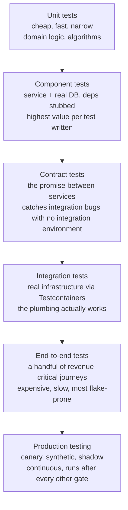
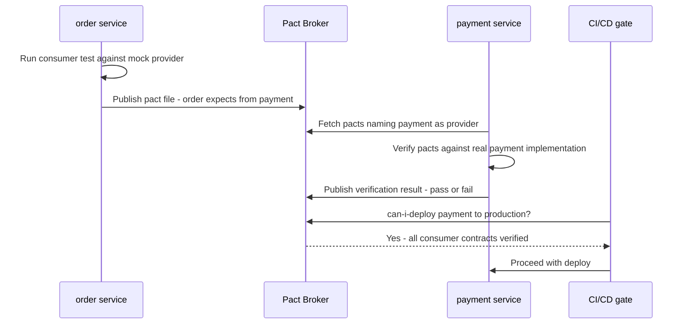
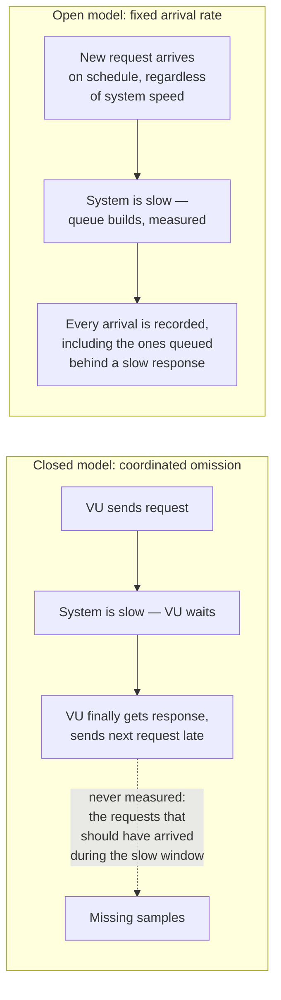

# Phase 11 - Testing Strategy for Distributed Systems

> **Weeks:** 66–70 | **Prerequisites:** Phase 10 | **Time budget:** 90–100 hrs  
> **You finish this phase able to:**
> - Define what each test level — unit, component, contract, integration, E2E, production — is actually responsible for, and cut a bloated end-to-end suite down to a handful of journeys without losing real coverage
> - Write a component test suite against a real PostgreSQL and Kafka via Testcontainers, and explain precisely why an H2-backed substitute is a false-confidence generator, not a shortcut
> - Stand up consumer-driven contract testing with Pact, wire a `can-i-deploy` gate into CI, and extend the same discipline to asynchronous message contracts backed by a schema registry
> - Design a load test that models real production traffic and does not lie to you via coordinated omission, and choose correctly between k6, Gatling, and JMeter
> - Turn Phase 6's chaos engineering into an automated, CI-run resilience test suite, and run a flaky-test quarantine policy with a named owner and a flake budget
> - Test safely in production — canaries with automated analysis, synthetic transactions, shadow traffic — with the guardrails that keep it from becoming a second incident

## Why this phase exists

The monolith testing playbook is: write unit tests for your logic, then write a big end-to-end suite that boots the whole application and clicks through it like a user. That playbook worked because "the whole application" was one deployable, one process, one database transaction. It does not survive contact with twenty independently deployed services, because the end-to-end suite that used to take five minutes now has to boot twenty services, their databases, their message brokers, and the network calls between all of them — and every one of those twenty services is a new, independent source of flakiness the suite did not have before.

Do the arithmetic once and the failure becomes obvious rather than a vague feeling. A single flaky test with 99.9% per-run reliability sounds excellent in isolation — one failure in a thousand runs. A suite of 500 such tests, each independently flaky at that same rate, passes as a whole only about 61% of the time (0.999 raised to the 500th power), even though every individual test is "basically fine." Teams do not fix this by finding the flaky tests — at scale, finding which of 500 tests defected on a given red build is its own investigation — they fix it by clicking "re-run" until the build goes green, which is functionally identical to deleting the suite's authority while keeping its wall-clock cost. A test suite nobody trusts is worse than no test suite: it still costs ten minutes per run, and it still gives everyone permission to stop looking at it.

This phase is not "more testing." It is a different shape of testing, purpose-built for the failure mode that only exists once a system is distributed: an individually correct service breaking another individually correct service at the boundary between them, in a way neither service's own unit tests could ever catch because each service's unit tests, by definition, only exercise that one service. [Phase 10](phase-10-delivery-and-platform-engineering.md) built the pipeline that moves a change safely from commit to production — canary analysis, GitOps reconciliation, progressive delivery — and named test tiering as something its CI pipeline design assumed existed: unit tests on every push, component and contract tests on every pull request, a small end-to-end suite run less often. That phase never defined what any of those tiers actually are, what each one is responsible for catching, or why a contract test is the thing that makes a canary's abort decision mean anything at all. This phase is where that gets specified, in full, because a pipeline with well-designed stages running badly-designed tests is just a fast way to ship the same bugs.

## Mental model

**You are buying confidence with time and flakiness. Each test level has a price and a coverage profile; choose the cheapest test that can catch the class of bug you actually fear.**

A unit test costs milliseconds and tells you almost nothing about whether your service works with anyone else's. An end-to-end test that boots six services and drives a real checkout tells you a great deal about whether the whole system works together, and costs minutes, real infrastructure, and a nontrivial chance of failing for a reason that has nothing to do with the bug it was supposed to catch. Between those two extremes sit component tests, contract tests, and integration tests, each buying a specific, narrower kind of confidence at a specific, lower price than the level above it. The discipline this phase teaches is not "write more tests" — it is "know which kind of bug each level is bought to catch, and stop paying end-to-end prices for bugs a five-second unit test or a two-second contract test would have caught just as reliably."

This reframes the two questions that actually matter before writing any test. First: what class of bug am I actually defending against here — a wrong calculation, a broken database interaction, a service that no longer agrees with what its consumer expects, or a whole user journey silently failing? Second: what is the cheapest test level that catches that class of bug with acceptable confidence, given that every level above the cheapest one is a tax you are choosing to pay for coverage you may not need? A team that writes end-to-end tests for logic bugs a unit test would catch just as well is not being thorough — it is paying integration-suite prices, and integration-suite flakiness, for something that should have cost nothing and failed for exactly one reason.



The corollary that matters for a team scaling past a handful of services: as service count grows, the *number of possible pairwise integration bugs* grows roughly quadratically, while the *cost of an end-to-end test covering all of them* grows at best linearly and in practice much worse, because every new service in the call graph is a new dependency the suite has to boot, stub, or fake. Contract testing is this phase's answer to that specific scaling problem — it turns a quadratic integration-testing problem into a linear one, because each service verifies its own contracts independently rather than requiring every consumer-provider pair to be tested together in a shared environment.

## Core concepts

### Test shapes: the pyramid, the trophy, and the honeycomb

**Plain English:** These are three different opinions about how many tests of each kind you should write, expressed as a picture of a shape — the width of each layer is how much of your total testing effort lives at that level.

**Analogy:** Think of three different ways to inspect a shipment of parts before they go into a car. The pyramid inspects every individual bolt and screw exhaustively (many cheap unit-level checks), spot-checks sub-assemblies moderately, and does one full assembled-car test drive at the very end. The trophy barely checks individual bolts at all, spends most of its effort checking that sub-assemblies work correctly together (the widest part of a trophy shape sits in the middle), and still does a light final test drive. The honeycomb gives up on the idea of one dominant layer entirely — it is many similarly sized cells, each one checking that a specific pair of components fits together correctly, because in this factory almost every defect that matters is a fit-and-interface problem, not a single bad part. Where the analogy breaks down: a real factory's part count does not change based on how the company is organized, but a software team's natural test shape *does* change based on how the system is decomposed — the honeycomb shape is not a universal best practice, it is what you get when the system itself is composed of many independently deployed pieces whose interfaces are the dominant source of risk.

**In the real world:** A monolithic checkout flow at an online retailer written as one deployable has almost no interface risk between "checkout" and "inventory," because they are function calls in the same process, checked by the compiler and a unit test — the pyramid fits, because most of the risk genuinely is in the algorithm layer. Once that same retailer splits into `cart`, `order`, `payment`, and `inventory` as independently deployed services, the dominant new risk is exactly the thing a pyramid under-invests in: does `order`'s idea of a valid payment-confirmation event match what `payment` actually emits, this week, after `payment`'s last independent deploy.

**Mechanics:** The **pyramid** (many unit tests, fewer integration tests, very few end-to-end tests) is the correct shape for a single deployable with internal-only interfaces enforced by the compiler. The **trophy** (Kent C. Dodds' framing, adopted widely for services with a handful of real external dependencies) shifts the bulk of investment to integration/component tests, on the observation that a passing unit test suite plus a broken integration point is still a broken feature, while a slightly weaker unit layer plus a strong integration layer usually is not. The **honeycomb** (associated in this roadmap's period with Spotify's public writing on testing microservices) argues that once you have dozens of independently deployed services, the dominant risk is entirely at the *service boundary*, not inside any one service's algorithms — so testing effort should be organized as many roughly-equal-sized cells, each verifying one specific interface between two components, rather than one dominant layer at any single level.

**What breaks:** A team that keeps a pyramid's proportions after decomposing into fifteen services ships services that are each internally well-tested and still breaks in production constantly, because nothing in their test suite ever checked whether `order`'s assumption about `payment`'s response shape was still true — the failure shows up as integration incidents with root causes like "the field was renamed three sprints ago and nobody told us," never as a unit test failure, because no unit test was ever positioned to see it.

### What each test level should own

None of the five levels below substitute for each other; each is the cheapest reliable way to catch a specific class of bug, and skipping one does not make its class of bug go away — it just means you find it later, more expensively, usually in production.

| Level | What it owns | What it explicitly does not try to catch |
|---|---|---|
| **Unit** | Domain logic, algorithms, edge cases, calculations, state-machine transitions — pure, in-process, no infrastructure | Whether the database actually persists what the code thinks it persists; whether another service agrees with this one |
| **Component/service** | The service plus its *real* database, with external HTTP/messaging dependencies stubbed — the highest-value tier for a microservice | Whether the stubbed dependency's real behavior actually matches the stub |
| **Contract** | The promise between two services — does the provider still produce what a specific consumer expects, and vice versa | Whether the two services work correctly when actually run together end to end |
| **Integration** | Real infrastructure wired together via Testcontainers — does the plumbing (a Kafka topic, a Postgres schema, a Redis cache) actually behave the way the code assumes | Business-journey correctness across multiple services |
| **End-to-end** | A handful of revenue-critical user journeys, run against a prod-like environment, as a final smoke test | Comprehensive coverage of edge cases or every service pairing — deliberately not its job |
| **Production testing** | Continuous validation against real production behavior — canary analysis, synthetic transactions, shadow traffic | Anything that requires a controlled, repeatable precondition; production is never fully controlled |

### Unit tests that are worth keeping

**Test observable behavior, not methods.** A unit test named `testCalculateDiscount_whenPrivateHelperReturnsX` that asserts on a private method's return value is testing an implementation detail nobody outside the class depends on; a unit test that asserts "given a ShopKart cart with two items and a 10%-off coupon, the total charged is $X" survives a refactor of every private method inside `PricingService`, because it is anchored to the class's actual contract with its callers, not to how that contract happens to be implemented today.

**Sociable versus solitary tests.** A **solitary** unit test replaces every collaborator with a test double, isolating the class under test completely — fast, but brittle the moment collaborators' real interactions matter (an aggregate that must call two repositories in a specific order, say). A **sociable** unit test lets real, cheap, in-process collaborators run together (a domain aggregate plus its embedded value objects) and only replaces genuinely expensive or nondeterministic dependencies (a database, a clock, an HTTP client) with a double. Default to sociable for anything in the same process with no I/O; reserve solitary isolation for the specific collaborator that is slow, nondeterministic, or genuinely external.

**The over-mocking failure mode.** A test that mocks every single collaborator of the class under test, then asserts that specific methods were called with specific arguments in a specific order, is testing the implementation's internal wiring, not its behavior — it breaks on every refactor that preserves behavior but changes how the class talks to its collaborators, and it does not catch the actual bug class unit tests exist to catch, because a test that only checks "did I call `save()`" never checks whether what got saved was correct. The tell: a refactor that changes nothing a caller can observe still turns a pile of these tests red.

**JUnit 5 features that pay for themselves.** `@ParameterizedTest` with `@CsvSource` or `@MethodSource` collapses ten near-identical test methods differing only in input/output pairs into one table, which is also where edge cases actually get enumerated rather than forgotten. `@Nested` groups related test cases under a shared `@BeforeEach` setup, making a large test class's structure legible instead of one flat list of fifty methods. `@TestFactory` generates dynamic tests at runtime — useful for data-driven suites where the test *count* itself is only known at runtime (validating every registered event schema, say). JUnit 5 **extensions** (`@ExtendWith`) are the mechanism behind Spring's test slices and Testcontainers' container lifecycle management, covered next.

```java
// Table-driven edge cases: five near-identical tests collapsed into one, edge cases visible at a glance.
// Demonstrates: parameterized testing pays off fastest on pure calculation logic. Omits: setup for
// stateful collaborators, which belongs in @Nested groups with shared @BeforeEach, not here.
@ParameterizedTest(name = "cart total for {0} items at {1} with coupon {2} is {3}")
@CsvSource({
    "2, 25.00, TENOFF,   45.00",
    "1, 10.00, TENOFF,    9.00",
    "0, 0.00,  TENOFF,    0.00",   // empty cart: coupon must not throw or produce negative total
    "3, 33.33, NONE,     99.99",
    "5, 20.00, EXPIRED, 100.00"    // expired coupon silently ignored, not rejected — a real ShopKart rule
})
void cartTotalAppliesCouponCorrectly(int items, BigDecimal unitPrice, String coupon, BigDecimal expected) {
    Cart cart = Cart.of(items, unitPrice);
    assertThat(cart.totalWith(Coupon.named(coupon))).isEqualByComparingTo(expected);
}
```

**AssertJ over raw JUnit assertions.** `assertThat(order.status()).isEqualTo(SHIPPED)` reads as a sentence and, on failure, prints both values; AssertJ's fluent assertions for collections (`containsExactlyInAnyOrder`, `extracting`), exceptions (`assertThatThrownBy`), and custom domain objects (via `usingRecursiveComparison` or a hand-written `Assert` subclass) are the practical default for anything beyond a trivial equality check.

**Test data builders and object mothers.** A `CartTestDataBuilder` or a named factory method (`Carts.withTwoExpensiveItems()`) replaces a wall of constructor arguments most of which are irrelevant to the test at hand, and — critically — insulates every existing test from a constructor signature change when a new required field is added to the domain object; only the builder needs updating, not every call site.

**Deterministic time via an injected `Clock`.** Any code that calls `Instant.now()` or `LocalDate.now()` directly is untestable for date-boundary logic and silently flaky for anything time-sensitive (a coupon that expires "today," a settlement job that runs "at midnight"). Inject `java.time.Clock` as a collaborator, default it to `Clock.systemUTC()` in production wiring, and swap in `Clock.fixed(...)` in tests — the same fix, applied everywhere, rather than one team's workaround per service.

**Property-based testing with jqwik.** Instead of hand-picking examples, a property-based test states an invariant that must hold for *every* generated input and lets the framework search for a counterexample — the highest-value use cases are serialization round-trips (`deserialize(serialize(x)) == x` for every generated `x`), idempotency (`apply(apply(x)) == apply(x)`), and ordering invariants (a comparator that must be transitive for every generated triple). jqwik integrates as a JUnit 5 engine, so it runs alongside ordinary `@Test` methods with no separate build step.

```java
// Property-based test: idempotent event application, checked against generated inputs rather than
// three hand-picked examples. Demonstrates: jqwik's @Property + @ForAll generating arbitrary orders.
// Omits: shrinking configuration and custom Arbitrary providers for more complex domain types.
@Property
void applyingTheSameInventoryEventTwiceIsIdempotent(@ForAll("inventoryEvents") InventoryReserved event) {
    InventoryState once = InventoryState.empty().apply(event);
    InventoryState twice = once.apply(event);          // same event, applied again
    assertThat(twice).isEqualTo(once);                 // second application must be a no-op
}
```

### Spring test slices and their traps

Spring Boot's test slices (`@WebMvcTest`, `@DataJpaTest`, `@RestClientTest`, `@JsonTest`) each boot a narrow, purpose-built application context containing only the beans relevant to one architectural layer, instead of the full `@SpringBootTest` context — the point is startup speed and focus, not full coverage.

| Annotation | Context contents | Right tool for |
|---|---|---|
| `@WebMvcTest` | MVC infrastructure, the named controller, no service/repository beans | Controller request mapping, validation, serialization, exception handling |
| `@DataJpaTest` | JPA, an embedded or Testcontainers-backed datasource, repositories | Repository queries, mapping, constraint behavior |
| `@RestClientTest` | A `RestClient`/`WebClient` bean plus a `MockRestServiceServer` | Outbound HTTP client serialization and error handling |
| `@SpringBootTest` | The full application context | Component tests — the highest-value tier, covered next; use deliberately, not by default |

**Application context caching and why `@DirtiesContext` destroys build time.** Spring's test support caches a fully booted application context, keyed by its configuration, and reuses that same context across every test class requesting an identical configuration — a real Spring context takes real seconds to boot, and reusing it across hundreds of test methods is the single biggest lever on test suite wall-clock time. `@DirtiesContext` forces a fresh context on the very next test, discarding the cache entirely; sprinkled casually across a test suite (often as a lazy fix for test pollution rather than a genuine need to verify context-recreation behavior) it silently reintroduces a multi-second context boot for every test class that follows it, and a suite with a dozen unnecessary `@DirtiesContext` annotations can lose more wall-clock time to context reboots than to the tests' actual assertions.

**The cost of mocking beans.** `@MockBean` (or the newer `@MockitoBean` in current Spring Test) replaces a real bean with a Mockito mock inside the Spring context — convenient, but it also **changes the context's cache key**, because a context with `PaymentClient` mocked is a different context configuration than one without. A test suite where every test class mocks a slightly different set of beans defeats context caching almost entirely, turning what should be a handful of cached contexts into dozens of near-identical ones, each booted fresh. The fix: centralize which beans get mocked into a small number of shared base test configurations, rather than letting `@MockBean` proliferate ad hoc per test class.

**Keeping total context count low.** Audit a slow test suite by counting distinct Spring context configurations actually booted, not by counting test classes — a suite with 200 test classes and 4 distinct contexts is fast; a suite with 200 test classes and 60 distinct contexts, each subtly different, is not, regardless of how fast any individual test method looks in isolation.

### Testcontainers as the default for anything with infrastructure

**Real PostgreSQL, Kafka, Redis, and LocalStack instead of embedded fakes.** Testcontainers manages real Docker containers — a real PostgreSQL, a real Kafka broker, a real Redis, a real LocalStack standing in for AWS services — scoped to a single test run, started fresh and torn down automatically. This is the direct extension of the "real Postgres and Kafka in CI, not an in-memory fake" discipline [Phase 9](phase-09-containers-kubernetes-cloud.md) already assumed a production-adjacent pipeline needs; this phase makes it the explicit, named default for every test level above the pure-unit tier.

**`@ServiceConnection` wiring.** Spring Boot's Testcontainers integration auto-configures a container's connection details (JDBC URL, Kafka bootstrap servers, Redis host/port) directly into the Spring context the moment a container is annotated `@ServiceConnection` — no hand-written `@DynamicPropertySource` block wiring ports and credentials manually, which used to be the majority of Testcontainers boilerplate.

```java
// Component test base: real Postgres via Testcontainers, wired automatically via @ServiceConnection.
// Demonstrates: container reuse across the whole test class, zero manual property wiring.
// Omits: Kafka container (see the dedicated idempotent-consumer pattern later in this phase).
@Testcontainers
@SpringBootTest(webEnvironment = SpringBootTest.WebEnvironment.RANDOM_PORT)
class OrderServiceComponentTest {

    @Container
    @ServiceConnection
    static final PostgreSQLContainer<?> postgres =
        new PostgreSQLContainer<>("postgres:18").withReuse(true);   // reuse across test classes, not just methods

    // ... test methods below use a real, fully-migrated Postgres schema, not H2.
}
```

**Container reuse and singleton patterns.** `.withReuse(true)` (paired with `testcontainers.reuse.enable=true` in `~/.testcontainers.properties`) keeps a container alive across test *runs* on a developer's machine or a persistent CI runner, instead of paying full container startup cost every single run — the difference between a few hundred milliseconds and several seconds per test class, multiplied across a suite with dozens of classes needing a database. A **singleton container pattern** (one statically initialized container shared across every test class in a module, started once via a static initializer or a JUnit 5 extension) achieves the equivalent effect without relying on the reuse flag, and is the more portable choice for CI environments where the reuse flag's local properties file is not guaranteed to be respected.

**Parallel execution and CI resource requirements.** Running test classes in parallel (JUnit 5's parallel execution, enabled via `junit-platform.properties`) multiplies container count proportionally unless containers are shared via the singleton pattern above — plan CI runner CPU and memory explicitly for "N parallel JVMs times M containers each," not just for the application under test, or a parallel test run silently becomes slower than a serial one once the runner starts swapping.

**Why H2-instead-of-Postgres gives false confidence.** An embedded H2 database configured in "PostgreSQL compatibility mode" still is not PostgreSQL: it does not enforce the same JSONB operators and indexing behavior, its locking semantics under concurrent transactions differ meaningfully from PostgreSQL's MVCC implementation, and constraint-violation error codes and exact SQL dialect quirks (window functions, `ON CONFLICT` clauses, advisory locks) diverge in ways that only surface under real concurrent load or a genuinely Postgres-specific feature. A test suite passing against H2 proves the code compiles against *a* SQL database — it does not prove the code is correct against *the* database that runs in production, and the gap between those two claims is exactly where war story 2 later in this phase lives.

### Contract testing in depth

**Plain English:** A contract test is a promise, written down and checked automatically, that two services agree on the shape of the messages they exchange — without ever having to run both services together to find out.

**Analogy:** Two people agreeing on a shared shipping label format before either of them prints a single label. The sender does not need the receiver's warehouse running to check that their label matches the agreed format; they check it against the *specification* of the format. The receiver does the same in reverse — checks their scanner correctly reads a label built exactly to that specification. Neither side needs the other side's actual system running to verify their own half of the deal; they each verify independently against the same written agreement. Where the analogy breaks down: a shipping label format rarely changes, but a contract test's whole value is that the underlying services genuinely *do* change independently and often — the contract is re-verified on every relevant deploy, not agreed once and filed away.

**In the real world:** A ride-hailing app's rider-facing service and its driver-matching service are built and deployed by different teams on different schedules; the rider service does not boot a full driver-matching stack in its CI pipeline to check that a "driver assigned" event still has the shape it expects — it checks a stored, versioned agreement instead, and the driver-matching team's pipeline independently verifies that its real output still satisfies every consumer's stored agreement before that team is allowed to deploy.

**Mechanics — consumer-driven contracts with Pact.** The consumer writes a test against a **mock provider**, stating the request it will send and the response shape it expects; running that test generates a **pact file** (a JSON contract) and publishes it to a **Pact Broker**. The **provider** then runs its own verification step — replaying every request recorded in every consumer's pact file against its *real* implementation and checking the real response matches what each consumer expects — using **provider states** (a hook the provider test uses to seed exactly the data a given interaction requires, e.g., "an order with ID 42 exists and is `SHIPPED`"). The Broker's **`can-i-deploy`** command is the actual pipeline gate: before either side deploys, it asks the Broker "has every contract this version participates in been verified compatible," and blocks the deploy if not — this is the mechanism, not a manual checklist, that decides whether a deploy is safe from a contract standpoint.



**Mechanics — producer-driven Spring Cloud Contract.** The relationship is inverted: the **producer** defines contracts (Groovy DSL or YAML, describing request/response pairs) alongside its own codebase, and Spring Cloud Contract's plugin generates both a verification test run against the producer's real implementation *and* WireMock stubs published as an artifact for consumers to use in their own tests — a consumer never talks to a real provider instance, only to generated stubs guaranteed to match what the provider actually verified.

| | Pact (consumer-driven) | Spring Cloud Contract (producer-driven) |
|---|---|---|
| Who writes the contract | Each consumer, from its own real needs | The producer, describing what it offers |
| Risk of an unused, over-broad contract | Low — a contract only exists because a consumer actually depends on that interaction | Higher — a producer can contract for behavior no consumer actually needs, or miss a consumer's real need |
| Cross-team coordination required | Broker-mediated; consumer and provider teams need not synchronize contract authorship directly | Producer team owns the contract; consumer teams adopt the generated stub |
| Best fit | Many independent consumer teams, consumer needs vary meaningfully | A stable API with well-understood, producer-defined semantics; strong Spring shop already |
| Async message support | Yes, via message pacts (see below) | Yes, via the same DSL applied to messaging contracts |

**Decision rule:** default to Pact when consumers are numerous, independently owned, and have genuinely different needs from the same provider — the consumer-driven model prevents the provider from over- or under-specifying a contract nobody asked for. Prefer Spring Cloud Contract when the organization is Spring-heavy, the producer team is the clear domain authority for the interaction's shape, and the generated-stub workflow (consumers get a ready-made WireMock stub for free) is worth more than consumer-driven precision.

**Contract testing for asynchronous messages.** The same discipline applies to Kafka events, using **message pacts** (Pact) or the equivalent message-DSL in Spring Cloud Contract: instead of an HTTP request/response, the "interaction" is a message body and its metadata, and the provider verification step checks that a real message the producer emits still deserializes into what the consumer's pact expects. This is where contract testing meets [Phase 5](phase-05-events-and-streaming.md)'s schema registry directly — a schema registry's `BACKWARD`/`FULL` compatibility check verifies the *wire format* is structurally compatible, while a message pact additionally verifies *semantic* expectations a schema check cannot see (a specific field's value range, a specific combination of fields that must co-occur) — the two are complementary, not redundant, and a mature event-driven estate runs both.

**Explaining, with the ladder, why a contract test catches integration bugs without running both services together.** *Plain English:* each side is quizzed separately against the same written answer key, instead of being put in a room together and watched. *Mechanics:* the provider's verification step exercises its real code against every recorded consumer expectation, so a real regression in the provider's actual response shape fails verification the moment it happens, regardless of whether any consumer's instance is running anywhere. *What breaks:* if the contract itself is stale — a consumer changed what it actually needs but never regenerated its pact, or a provider verifies against provider states that no longer match its real data model — the test suite goes green while the real systems have drifted, which is precisely war story 1 later in this phase, and precisely why a Broker-mediated workflow (regenerating and republishing the pact on every consumer build, not once and forgotten) matters as much as having contract tests at all.

**Closing the trust gap Phase 10 left open.** [Phase 10](phase-10-delivery-and-platform-engineering.md)'s canary-with-automated-analysis pattern makes an implicit assumption: that a deploy reaching the canary stage is worth analyzing at all, rather than a change that was always going to fail integration for a reason a canary's traffic-percentage-and-metrics check would only reveal slowly and expensively, in production, against real users. A contract test is what earns that assumption — by verifying, before the canary ever sees a single request, that the deploy's provider-side behavior still satisfies every consumer's stored expectation, a contract test rules out an entire class of integration breakage cheaply, in seconds, in CI, so that a canary's abort decision is answering the question it is actually good at answering (does this behave well under real traffic) instead of a question it is a slow and expensive way to answer (does this even speak the right protocol to its neighbors).

### Component tests: the highest-value tier

**What it is.** The service under test, running for real, against a **real database** (Testcontainers), with every external HTTP dependency stubbed via **WireMock** and every external message broker interaction run against a **real, Testcontainers-backed Kafka** — the service's own boundary is the boundary of the test, nothing more, nothing less. A **frozen clock** (the injected `Clock` from Core concepts) and **seeded data** make the test deterministic and repeatable rather than dependent on wall-clock time or whatever a previous test run left behind.

**Why it is the highest-value tier for a microservice.** It is the cheapest test level that exercises the service's *real* code, its *real* persistence behavior, and its *real* serialization — the three things a unit test cannot see and an end-to-end test is a slow, flaky, expensive way to see. A component test catches a broken SQL migration, a serialization mismatch with a real JSON library configuration, a transaction boundary bug, and an error-handling gap, all without needing a single other real service running anywhere.

**Concrete structure and what it must assert.**

```java
// Component test: order service, real Postgres, external payment dependency stubbed via WireMock,
// frozen clock, seeded catalog data. Demonstrates: the shape every ShopKart component test should
// follow. Omits: full Testcontainers Kafka setup, shown separately in Production patterns below.
@Testcontainers
@SpringBootTest(webEnvironment = SpringBootTest.WebEnvironment.RANDOM_PORT)
class CheckoutComponentTest {

    @Container
    @ServiceConnection
    static final PostgreSQLContainer<?> postgres = new PostgreSQLContainer<>("postgres:18");

    static WireMockServer paymentStub = new WireMockServer(wireMockConfig().dynamicPort());

    @DynamicPropertySource
    static void wireMockUrl(DynamicPropertyRegistry registry) {
        registry.add("payment.service.url", paymentStub::baseUrl);
    }

    @TestConfiguration
    static class FrozenClockConfig {
        @Bean
        Clock clock() { return Clock.fixed(Instant.parse("2026-09-13T10:00:00Z"), ZoneOffset.UTC); }
    }

    @Test
    void checkoutSucceeds_whenPaymentAuthorizes() {
        paymentStub.stubFor(post("/authorize").willReturn(okJson("""{"status":"AUTHORIZED"}""")));
        // ... POST /checkout with seeded cart; assert order persisted as CONFIRMED in real Postgres.
    }

    @Test
    void checkoutFailsGracefully_whenPaymentTimesOut() {
        // The error path — the one happy-path-only suites skip — is exactly this test.
        paymentStub.stubFor(post("/authorize").willReturn(aResponse().withFixedDelay(6000)));
        // ... assert the order lands in FAILED, not left PENDING forever, and inventory is released.
    }

    @Test
    void checkoutIsIdempotent_onDuplicateRequest() {
        // Replaying the same idempotency key must not double-charge or double-reserve stock.
    }
}
```

At minimum, a component test suite for a ShopKart service must assert: the happy path against seeded, realistic data; at least one error path per external dependency (timeout, 5xx, malformed response) proving the service degrades rather than hangs or corrupts state; and idempotent replay of the same request or the same consumed message, because [Phase 5](phase-05-events-and-streaming.md)'s idempotent-consumer discipline is only real if a test actually replays a message and checks nothing doubled.

### End-to-end testing: a smoke test, not a safety net

Keep the end-to-end suite to a handful of genuinely revenue-critical journeys — for ShopKart, something like "search a product, add to cart, complete checkout, receive a confirmation" and two or three more, not an attempt at exhaustive coverage. Run it against a prod-like environment (real infrastructure shapes, realistic data volumes, not a stripped-down dev stack), and accept, explicitly, that its job is to catch gross, whole-system breakage before release — a smoke test — not to be the safety net that catches every regression, because every level below it in the shape already owns that job more cheaply and more reliably. The rest of what a bloated E2E suite used to attempt gets replaced by synthetic monitoring running continuously in production, covered next — a shift from "test it once, before release, expensively" to "check it constantly, cheaply, forever."

### Testing in production, done responsibly

**Plain English:** instead of only checking your system works before real users touch it, you also keep checking, automatically and continuously, that it is still working correctly *while* real users are touching it — because a pre-release test environment can never perfectly recreate real traffic, real data, and real failure conditions, no matter how hard you try.

**Analogy:** A restaurant kitchen's health inspector does not only check the kitchen once before opening night and then trust it forever — they return unannounced, order an ordinary meal like any customer, and check it against the same standard a real customer would notice failing. That unannounced, ordinary-looking order is a synthetic check: identical to real customer traffic from the kitchen's point of view, run specifically so a problem is caught before a real customer's meal is the one that reveals it. Where the analogy breaks down: an inspector's visit is occasional and highly visible once it starts; a synthetic check runs every few minutes, forever, and a shadow-traffic comparison goes further still — it duplicates a *real* customer's order to a second, unreleased kitchen just to compare the results, without ever serving that second kitchen's food to anyone.

**In the real world:** A payments platform's own engineering teams have publicly described running synthetic transactions continuously against production — a scripted, low-value, real transaction executed on a schedule through the exact same code path a real customer's payment takes — specifically because a staging environment's payment-gateway sandbox cannot fully reproduce every real-world edge case a production gateway integration will eventually hit.

**Mechanics.** Four related techniques, each bounding blast radius differently: **canaries with automated analysis** ([Phase 10](phase-10-delivery-and-platform-engineering.md)'s pattern) expose a new version to a small percentage of real traffic and query real metrics for an abort decision — this is production testing of the *new code*, continuously, during rollout. **Synthetic transactions** are scripted, repeatable journeys run on a schedule against the always-current production system, querying the exact RED and burn-rate metrics [Phase 8](phase-08-observability-and-operations.md)'s dashboards already expose — the same burn-rate discipline Phase 8 built for reactive alerting, applied here pre-emptively, catching a regression before a real customer's failed request is the first signal anyone sees. **Shadow (mirrored) traffic** duplicates real production requests to a new version without ever returning that version's response to the real caller, then diffs the two responses offline — real-world request shapes and real-world edge cases, with zero user-facing risk, because the shadow's output never reaches anyone. **Feature-flagged dark launches** ship new code paths fully live in production, gated fully off by a flag, so the code runs its real startup and warm-up behavior under real conditions before a single real user is ever routed to it.

**What breaks — and the guardrails that keep production testing from becoming a second incident.** Every one of these techniques touches real production, which means every one of them needs explicit guardrails: **no side effects** — a synthetic checkout must not actually charge a real card or decrement real inventory, which usually means a permanently reserved, clearly tagged synthetic test account routed through the same code path as real traffic; **tenant isolation** — a shadow-traffic experiment must never let its unreleased code write to a real customer's data, only read and compare; and **data cleanup** — any synthetic artifact (a test order, a test account's activity) needs an automatic, verified cleanup job, because a forgotten cleanup step is exactly how a "harmless" synthetic transaction becomes war story 4 later in this phase. Skipping any of these three guardrails does not make production testing safer by having fewer moving parts — it just moves the risk from "did I catch a real regression" to "did I just cause one."

### Performance testing

**Plain English:** a performance test is a rehearsal for real traffic, run on purpose, before real traffic shows up and finds out the hard way whether your system can take it.

**Analogy:** A fire drill measures how fast a building actually empties when everyone leaves in an orderly, patient line — useful, but it tells you almost nothing about what happens in a real fire, where people arrive at the exits urgently, all at once, and do not wait patiently for their turn. A load-testing tool that sends each virtual user's next request only after the *previous* request finished is running the patient fire drill: exactly the wrong model for what real user behavior actually looks like, which arrives on its own schedule regardless of whether the system in front of it responded fast or slow. Where the analogy breaks down: a fire drill's flaw is obvious to anyone watching it; a load-testing tool's flaw is invisible unless you already know to check for it, because the tool still produces a confident-looking p99 number — it is simply the wrong number.

**In the real world:** A ride-hailing app's surge-pricing system gets hammered hardest during exactly the events — a concert ending, a sudden storm — where real riders all open the app within the same sixty seconds regardless of how quickly the app answers any individual one of them; a load test that waits for each simulated request to finish before sending the next one cannot reproduce that arrival pattern at all, and would report a healthy-looking result while missing the actual failure mode surge traffic causes.

**Mechanics.** An **open workload model** generates new requests at a fixed arrival rate, independent of how long previous requests took to complete — this matches real user behavior, where users do not politely wait for the system to finish the last request before sending the next one. A **closed workload model** — the default in older or simpler tools — holds a fixed number of virtual users, each one waiting for its previous request to complete before issuing its next one, which caps the maximum possible request rate at exactly the point the system starts slowing down, silently hiding the queueing and saturation behavior an open model would have exposed. **Coordinated omission** is the specific measurement bug this produces: because a closed-model virtual user only issues its next request after the last one returns, requests that *should* have been sent during a slow period are never sent and never measured at all — the tool "coordinates" with the system's own slowdown by backing off exactly when it should be recording the worst latencies, which means the reported percentiles are computed only over the requests that got through quickly, systematically excluding the very samples that would have shown the tail latency spike.



**What breaks:** a load test run with a closed workload model and no coordinated-omission correction reports a comfortable p99 — say 80 ms — right up until the same code, hit by real open-model traffic in production, spikes to seconds under exactly the load condition the test was supposed to validate; this is precisely war story 3 later in this phase, and it is the single most common reason a "we load tested this" claim turns out to have been measuring the wrong thing entirely. The fix is tool selection and configuration, not more load: k6 and Gatling both support open workload models natively (k6's `ramping-arrival-rate` executor, Gatling's `constantUsersPerSec`/`atOnceUsers` with an open injection profile); a tool or a configuration limited to closed-model virtual users needs either a coordinated-omission correction applied to its output or replacement.

**k6 versus Gatling versus JMeter.**

| Tool | Model | Scripting | Strongest fit |
|---|---|---|---|
| **k6** | Open and closed, open-model executors are first-class | JavaScript | CI-native performance gates; Grafana-ecosystem integration; developer-friendly scripting |
| **Gatling** | Open and closed, explicit injection profiles | Scala DSL (or a Java DSL variant) | High-throughput protocol-level testing; detailed HTML reports; JVM-shop familiarity |
| **JMeter** | Primarily closed-model by default, thread-group based | GUI-first, XML underneath | Legacy estates already invested in it; broad protocol plugin ecosystem; weakest default fit for open-model, developer-as-code workflows |

**Modelling workload from production traffic.** The credible load-test scenario is not an invented number — it is derived from the same RED metrics [Phase 8](phase-08-observability-and-operations.md) already collects: the real request-rate distribution across endpoints, the real ratio of read to write traffic, and the real payload-size distribution, replayed or approximated at a stated multiple (1x for a capacity check, 3–5x for a growth-headroom check, 10x-plus for the Phase 12 territory of a deliberate scale exercise).

**Soak, spike, stress, and capacity tests each answer a different question.** A **soak test** runs a realistic, sustained load for hours, looking for what only shows up slowly — a memory leak, a connection pool exhausting gradually, a log volume that eventually fills a disk. A **spike test** throws a sudden, sharp burst at the system to check whether autoscaling and admission control ([Phase 6](phase-06-resilience-engineering.md)'s territory) respond fast enough. A **stress test** increases load past the point of graceful degradation deliberately, to find the actual breaking point and confirm the system fails the way [Phase 6](phase-06-resilience-engineering.md)'s resilience patterns intend — shedding load and returning errors, not falling over silently. A **capacity test** answers the planning question directly: how many replicas, of what size, are needed to serve a stated target load at a stated latency SLO, becoming the input to the right-sizing methodology [Phase 9](phase-09-containers-kubernetes-cloud.md) already established.

**Where to run them, performance gates in CI, and profiling during the test.** Run performance tests against a prod-like, isolated environment — never against shared staging (any concurrent activity invalidates the measurement) and never, per one of this phase's named anti-patterns, from a single laptop against production. A **performance gate in CI** compares a build's measured p95/p99 and error rate against a stated, realistic threshold (not an arbitrary round number) and fails the pipeline on regression, the same fast-feedback discipline [Phase 10](phase-10-delivery-and-platform-engineering.md) established for every other pipeline stage. **Profile during the load test, not after a production incident** — attach a JFR recording or a continuous profiler for the test's duration, so a discovered regression comes with a flame graph pointing at the actual hot method, instead of a bug report that says only "it got slower" with no lead on why.

### Resilience testing

Fault injection tools — **Toxiproxy** (a TCP proxy injecting latency, connection drops, and bandwidth limits, run as a test-time sidecar), mesh-level fault injection (Istio's `VirtualService` fault specification), and **Chaos Mesh**/**Litmus** for Kubernetes-native pod kills and network partitions — are exactly the tooling [Phase 6](phase-06-resilience-engineering.md) already introduced for chaos engineering. What this phase adds is not new tooling; it is the recognition that the same fault injection [Phase 6](phase-06-resilience-engineering.md) taught as a scheduled, human-observed **game day** can also run as an **automated, unattended test** in a pipeline — the difference is who is watching and how often it runs, not what fault gets injected. A dependency-failure test written as a JUnit test using Toxiproxy (kill the connection to the payment stub mid-request, assert the circuit breaker trips and the checkout fails gracefully rather than hanging) runs on every relevant pull request, catching a resilience regression the same day it is introduced; a game day still earns its place as the human-in-the-loop version — testing detection, alerting, and the on-call runbook itself, none of which an automated assertion in CI can verify, because those are properties of the people and the process responding, not of the code under test. Run both: automated fault-injection tests as a standing CI gate, and periodic game days as the exercise for everything an automated assertion cannot see.

### Data and migration testing

**Migration up/down tests** run every schema migration against a Testcontainers-backed database as part of CI, applying it, then reverting it (where reversible), and asserting the schema lands in the expected state either way — catching a migration that works on a developer's already-migrated local database but fails against a clean baseline, which is a surprisingly common way a migration first breaks in a fresh environment rather than in the one it was authored against. **Backfill dry runs** execute a large data backfill's exact logic against a realistic-volume copy of production-shaped data before it ever touches production, surfacing a lock-duration or throughput problem in a test environment instead of during [Phase 10](phase-10-delivery-and-platform-engineering.md)'s expand-contract playbook's actual backfill step. **Reconciliation assertions** compare two representations of what should be the same fact — a read model against its source of truth, an outbox table against what Kafka actually received — and are the automatable form of the audit a manual reconciliation script used to do by hand, now run continuously rather than only after a suspected incident. **Replay and idempotency tests for consumers** directly extend [Phase 5](phase-05-events-and-streaming.md)'s idempotent-consumer pattern: a test that replays the exact same message (or the same message with a duplicate delivery, simulating Kafka's at-least-once guarantee) and asserts the dedupe table or idempotency-key check prevented a double side effect — without this test, an idempotent consumer's correctness is a claim in a design doc, not a proven property.

### Security testing in the pipeline

Each security testing technique belongs at a different pipeline stage, for the same fast-feedback-first reason [Phase 10](phase-10-delivery-and-platform-engineering.md)'s CI stage-ordering established generally: **SAST** (static application security testing — scanning source code for known vulnerable patterns) runs on every commit, fast enough to block a pull request without meaningfully slowing it down. **SCA** (software composition analysis — scanning dependencies for known CVEs) and **secret scanning** run on every commit as well, for the same reason [Phase 10](phase-10-delivery-and-platform-engineering.md) already established: a leaked credential or a vulnerable transitive dependency is cheapest to catch the moment it is introduced. **IaC scanning** (Terraform/Kubernetes manifest policy checks) runs at plan time, before any infrastructure change applies — the same "the pipeline physically will not apply it" discipline [Phase 10](phase-10-delivery-and-platform-engineering.md)'s policy-as-code section covers. **DAST** (dynamic application security testing, typically OWASP ZAP driven against a genuinely running instance of the service) runs later — against a deployed component test environment or a preview environment, because it needs a live HTTP surface to attack, not source code — and is consequently slower and less frequent than the earlier gates, a nightly or per-PR-but-async job rather than a blocking pre-merge check.

### Test quality measurement: coverage, mutation testing, and Goodhart's law

**Plain English:** counting how many lines of code your tests execute tells you almost nothing about whether your tests would actually catch a bug if one were introduced.

**Analogy:** A fire alarm system that is wired into every room of a building "covers" 100% of the building, in the sense that every room has a sensor — but that number alone says nothing about whether any individual sensor is sensitive enough to detect real smoke, or whether it is just wired to a switch that always reports "no fire," passing every routine check while providing zero actual protection. Line coverage is the "every room has a sensor" number; whether the sensor actually works is a separate question coverage cannot answer by itself. Where the analogy breaks down: a real fire sensor's sensitivity is testable directly with real smoke; a test's real "sensitivity" (does it fail when the code it covers is actually broken) requires deliberately breaking the code and checking — which is precisely what mutation testing automates.

**In the real world:** a team that adopts "80% coverage" as a mandated KPI can hit that number by writing tests that call every line of code with no meaningful assertion at all — a test that invokes a method and asserts only that it did not throw satisfies the coverage tool completely while catching nothing, the software-engineering instance of Goodhart's law (a proxy measure, once it becomes the target, stops measuring the thing it was a proxy for) that this roadmap has already named in [Phase 10](phase-10-delivery-and-platform-engineering.md)'s DORA-metrics discussion.

**Mechanics.** **Mutation testing** (PIT, for the JVM) automates the "does this test actually catch a bug" question directly: it makes small, deliberate mutations to the compiled code — flips a `<` to `<=`, negates a boolean condition, changes a returned constant — reruns the test suite against each mutant, and reports the percentage of mutants a test suite actually **kills** (causes at least one test to fail). A mutant that survives — every test still passes despite the code now being subtly wrong — is a direct, automated proof that no test in the suite would have caught that specific class of bug, which coverage alone can never reveal, because a surviving mutant can sit on a line covered by a dozen tests, none of which asserted anything sensitive enough to notice the change.

**What breaks:** a team that trusts an 85%-coverage badge as evidence of test quality, without ever running a mutation report, can carry large sections of tests that execute code but assert nothing meaningful — indistinguishable from real protection on a coverage dashboard, and only distinguishable from real protection the moment a mutation score reveals which "covered" lines have zero tests that would actually fail if that logic broke. Run PIT selectively — it is computationally expensive, so target it at business-critical modules (pricing, checkout, payment logic) rather than the whole codebase on every commit, and treat a low mutation score on a critical module as a todo list of specific tests to strengthen, not as a number to argue with.

### Flaky tests: detection and quarantine policy

**Plain English:** a flaky test is one that sometimes passes and sometimes fails against the *exact same code*, with nothing about the system under test actually different between runs — which means its result carries no information at all, and yet it still costs everyone's attention every time it turns red.

**Analogy:** A smoke detector that goes off at random, unrelated to any actual smoke, roughly once a week. The correct long-term fix is to repair or replace the detector — but the correct *immediate* action, the moment you learn this specific detector is unreliable, is to stop treating its alarm as meaningful information until it is fixed, not to keep evacuating the building every single time it goes off. Ignoring it entirely is also wrong, because eventually it might be a real fire; the right move is documented, deliberate suppression with an owner responsible for the actual repair, not silent tolerance and not full-alarm treatment either. Where the analogy breaks down: a smoke detector's flakiness rate does not compound with dozens of other detectors the way flaky tests compound in a large suite — a building with 500 unreliable detectors, each independently flaky once a week, would be evacuated constantly for no reason, which is precisely the 500-test-suite arithmetic from this phase's Mental model.

**In the real world:** a large, continuously-integrating engineering organization with thousands of tests running on every commit cannot treat "investigate every flaky failure by hand, every time" as a viable policy at that volume — the practical, publicly common industry pattern is automatic flaky-test detection (a test that fails, then passes on an identical retry with nothing else changed, is flagged as a *candidate*) followed by automatic quarantine, not silent, permanent retry-until-green.

**Mechanics.** A CI system's automatic retry mechanism identifies a candidate: a test that failed once and passed on an immediate rerun with no code change. Quarantine moves that specific test out of the release-blocking gate (typically via a shared `@Tag("flaky")` or an equivalent exclusion mechanism) into a separately tracked, still-executed-but-non-blocking bucket, **with a mandatory, named owner and a deadline** — never a permanent parking lot. A **flake budget** — a cap on how many tests may sit in quarantine at once, or how long any single test may remain quarantined before it is treated as an escalated defect — prevents quarantine itself from becoming the new "click retry until green," just relabeled and moved one step upstream.

**What breaks:** a team with an unquarantined flaky test that gets manually retried until green trains everyone touching that pipeline to distrust every red build slightly more, and the first time a retry-until-green habit papers over a *genuine* regression rather than genuine flakiness, that regression ships — this is precisely why the fix in this phase's anti-patterns section is never "retry harder," it is "quarantine explicitly, own it, and fix or delete it within a stated window."

### Test environments strategy

**Ephemeral namespaces per PR** extend [Phase 10](phase-10-delivery-and-platform-engineering.md)'s preview-environment pattern specifically for test execution: component and contract tests run against a namespace scoped to the pull request's changed service plus its real or stubbed dependencies, torn down automatically on merge or close, rather than contending for a shared, permanently mutable staging environment every other PR is also poking at simultaneously. **Service virtualization** (WireMock, or a recorded-and-replayed cassette of a third-party API) stands in for a dependency that is genuinely unavailable in a test environment — a third-party payment gateway's sandbox with its own rate limits, a partner API with no test tier at all — letting a test exercise realistic response shapes and failure modes without depending on an external system's own uptime or quota. **Production-like data and the PII problem** is the standing tension: realistic test data (real order volumes, real cardinality, real messy edge cases) produces the most trustworthy tests, but real production data contains real personally identifiable information that has no legitimate reason to exist in a test environment; the resolution is **masking** (deterministic, referentially-consistent anonymization of a production snapshot — the same customer ID always maps to the same fake name, preserving joins) or **synthetic data generation** (statistically realistic, entirely fabricated data, generated from a modeled distribution rather than derived from any real customer at all) — masking is faster to stand up from an existing dataset; synthetic generation is the only option that carries zero residual PII-leak risk, and is the safer default wherever compliance scope allows the extra generation effort.

## Production patterns

### Pattern: Component test skeleton

**What:** the service under test running with a real, Testcontainers-backed database, external HTTP dependencies stubbed via WireMock, a frozen `Clock`, and seeded data — the concrete shape shown in full in Core concepts above.

**When to use:** every service, as the default test tier above unit — this is the tier every ShopKart service should have before it has a large end-to-end suite, not after.

**When NOT to use:** pure, stateless calculation logic with no infrastructure dependency at all — that belongs at the unit level, where it is cheaper and just as reliable.

**Failure modes:**
- The "real database" is actually H2 in compatibility mode, silently reintroducing the false-confidence gap this phase's Core concepts section names explicitly.
- WireMock stubs only the happy-path response shape, so the suite never exercises the service's own error handling for a timeout or a malformed upstream response — precisely the coverage gap this phase's anti-patterns section calls out as "testing only happy paths."

```java
// Minimal component test skeleton — see Core concepts for the fully worked CheckoutComponentTest.
// Demonstrates: the four required ingredients (real DB, stubbed HTTP, frozen clock, seeded data).
@Testcontainers
@SpringBootTest(webEnvironment = SpringBootTest.WebEnvironment.RANDOM_PORT)
@Import(FrozenClockConfig.class)
class InventoryComponentTest {
    @Container @ServiceConnection
    static final PostgreSQLContainer<?> postgres = new PostgreSQLContainer<>("postgres:18").withReuse(true);

    @BeforeEach
    void seed(@Autowired JdbcTemplate jdbc) {
        jdbc.update("INSERT INTO inventory (sku, quantity) VALUES ('SKU-1', 10)");   // deterministic starting state
    }
}
```

### Pattern: Pact consumer and provider with can-i-deploy

**What:** a consumer-generated pact file, published to a Broker, verified independently by the provider, gated by `can-i-deploy` before either side ships — the full mechanics from Core concepts, expressed as pipeline stages.

**When to use:** any HTTP or messaging interaction between two independently deployed ShopKart services with a real consumer relationship — `order` calling `payment`, `cart` calling `pricing`.

**When NOT to use:** a genuinely internal, single-team interaction with no independent deployment cadence on either side — the coordination overhead buys nothing there; a shared integration test suffices.

**Failure modes:**
- The consumer's pact is generated once and never regenerated as the consumer's real usage evolves, so the provider verifies against a stale expectation nobody actually depends on anymore — the contract is technically green and practically meaningless.
- `can-i-deploy` is treated as advisory rather than a hard gate, so a team deploys anyway on a failing check "just this once," reproducing the exact trust failure war story 1 describes.

```java
// Consumer test: generates a pact file for the order -> payment interaction.
@ExtendWith(PactConsumerTestExt.class)
class OrderPaymentPactConsumerTest {
    @Pact(consumer = "order", provider = "payment")
    RequestResponsePact authorizePact(PactDslWithProvider builder) {
        return builder
            .given("an authorized payment method exists for customer 42")
            .uponReceiving("an authorization request for order 42")
            .path("/authorize").method("POST")
            .willRespondWith().status(200)
            .body(newJsonBody(b -> b.stringType("status", "AUTHORIZED")).build())
            .toPact();
    }

    @Test
    void orderReceivesAuthorization(MockServer mockServer) {
        // Real HTTP call against the Pact mock server; the pact file is generated as a side effect.
    }
}
```

```yaml
# CI gate: neither side deploys without a passing can-i-deploy check against the Broker.
- name: can-i-deploy
  run: |
    pact-broker can-i-deploy --pacticipant payment --version "$GIT_SHA" \
      --to-environment production --broker-base-url "$PACT_BROKER_URL"
```

### Pattern: WireMock fault injection

**What:** WireMock stubs configured to return not just canned success responses but deliberate faults — fixed delays, connection resets, malformed bodies — so a component test exercises the calling service's actual failure handling, not just its happy path.

**When to use:** every external HTTP dependency a component test stubs; a stub that only ever returns success is only testing half the calling code.

**When NOT to use:** verifying the *external* dependency's own correctness — WireMock proves your service handles a given response correctly, it says nothing about whether the real dependency actually behaves that way, which is exactly the gap contract testing exists to close.

**Failure modes:**
- The fault scenario is configured but no assertion actually checks the calling service's response — the test exercises the code path without proving anything about its correctness.
- A fixed-delay fault is shorter than the calling service's configured timeout, so the test accidentally validates the happy path a second time instead of the timeout-handling path it was written to cover.

```java
// WireMock: connection reset and fixed-delay faults, exercising the caller's Resilience4j timeout
// and circuit breaker configuration from Phase 6, not just the happy-path deserialization path.
wireMock.stubFor(post("/authorize")
    .inScenario("payment-degraded")
    .willReturn(aResponse().withFault(Fault.CONNECTION_RESET_BY_PEER)));

wireMock.stubFor(post("/authorize")
    .willReturn(aResponse().withFixedDelay(8000).withStatus(200)));   // longer than the client's configured timeout
```

### Pattern: Testcontainers Kafka test for an idempotent consumer

**What:** a real, Testcontainers-backed Kafka broker, a consumer under test, and a test that deliberately delivers the same message twice — proving the dedupe mechanism from [Phase 5](phase-05-events-and-streaming.md) actually prevents a double side effect, not just that it exists in the code.

**When to use:** every consumer whose correctness depends on at-least-once delivery being made idempotent — which, per [Phase 5](phase-05-events-and-streaming.md), is effectively every Kafka consumer with a side effect.

**When NOT to use:** a purely read-side projection that is naturally idempotent by construction (an upsert keyed by the event's own natural key) — the test still has value, but the risk it defends against is lower, and a unit test on the upsert logic alone may already cover it.

**Failure modes:**
- The test redelivers the message via the test framework's own retry helper rather than genuinely re-publishing it to the topic, which can bypass the exact deserialization and offset-handling path a real Kafka redelivery exercises.
- The dedupe table's own cleanup job is untested, so the suite proves idempotency works today but not that it keeps working once old dedupe records are purged — a gap that shows up as a re-processed very-old message succeeding at a double side effect months later.

```java
// Testcontainers Kafka: publish the same InventoryReserved event twice, assert exactly one
// stock decrement — the automated proof behind Phase 5's idempotent-consumer claim.
@Testcontainers
class InventoryConsumerIdempotencyTest {
    @Container
    static final KafkaContainer kafka = new KafkaContainer(DockerImageName.parse("apache/kafka:4.3.0"));

    @Test
    void duplicateEventDoesNotDoubleDecrementStock() {
        producer.send("inventory.reserved", orderId42Event);
        producer.send("inventory.reserved", orderId42Event);   // exact duplicate: same key, same payload

        await().atMost(Duration.ofSeconds(10)).untilAsserted(() ->
            assertThat(inventoryRepository.quantityOf("SKU-1")).isEqualTo(9));   // decremented once, not twice
    }
}
```

### Pattern: k6 scenario modelled on production traffic

**What:** a k6 script using an open workload model (`ramping-arrival-rate`), its request-rate and endpoint-mix shape derived from real RED metrics rather than an invented number.

**When to use:** before any capacity-relevant deploy, and as a standing CI performance gate for latency-sensitive endpoints.

**When NOT to use:** early in a service's life with no real production traffic history yet to model — an invented workload shape at that stage is a reasonable placeholder, but label it as one, not as validated capacity.

**Failure modes:**
- The scenario uses k6's default closed-model executor instead of `ramping-arrival-rate`, silently reintroducing coordinated omission into a tool that is fully capable of avoiding it.
- The endpoint mix is uniform (equal weight per endpoint) rather than matching production's real skew, understating load on the one or two endpoints that actually dominate real traffic.

```javascript
// k6: open workload model, endpoint mix weighted to match real production RED-metric proportions.
export const options = {
  scenarios: {
    checkout_traffic: {
      executor: 'ramping-arrival-rate',
      startRate: 50, timeUnit: '1s', preAllocatedVUs: 200,
      stages: [
        { target: 500, duration: '2m' },   // ramp to modeled peak
        { target: 500, duration: '5m' },   // hold at peak — this is where coordinated omission would hide
        { target: 50, duration: '2m' },
      ],
    },
  },
  thresholds: { http_req_duration: ['p(99)<800'], http_req_failed: ['rate<0.01'] },   // the CI performance gate
};
```

### Pattern: Synthetic check

**What:** a scripted, scheduled transaction — a real search, a real (test-account) checkout — run continuously against production through the same code path a real user takes, alerting on the same burn-rate discipline [Phase 8](phase-08-observability-and-operations.md) already established.

**When to use:** every revenue-critical journey, as the continuous replacement for what an exhaustive end-to-end suite used to attempt once per release.

**When NOT to use:** as a substitute for real-user monitoring generally — a synthetic check runs a fixed, small, predictable pattern and catches a total or regional outage well, but misses subtle, traffic-shape-dependent degradation a real, varied user population would surface first.

**Failure modes:**
- The synthetic check's test account and its artifacts are never cleaned up, compounding indefinitely in production data — the direct mechanism behind war story 4.
- The check runs from inside the same cloud region as the service under test, which cannot detect an external DNS, CDN, or edge failure a real geographically distributed user population would hit.

```yaml
# Synthetic check: scheduled, runs the real checkout path against a permanently reserved test account.
schedule: "*/5 * * * *"
steps:
  - search: { query: "wireless mouse" }
  - addToCart: { sku: "SYNTHETIC-SKU-DO-NOT-SHIP" }   # tagged to guarantee automated cleanup, never fulfilled
  - checkout: { account: "synthetic-monitor-01", paymentMethod: "test-card-approve" }
alert:
  onFailure: { pageAfterConsecutive: 2 }               # mirrors Phase 8's short-window burn-rate pattern
cleanup: { deleteOrdersTagged: "SYNTHETIC-SKU-DO-NOT-SHIP", after: "1h" }
```

### Pattern: Flake quarantine workflow

**What:** an automated pipeline step that detects a fail-then-pass-on-retry test, tags it into a non-blocking quarantine bucket, opens a tracked issue with a named owner and a deadline, and reports quarantine-bucket size as a standing, reviewed metric.

**When to use:** any CI system running enough tests, often enough, that manual triage of every intermittent failure is not viable — in practice, any team past a handful of services.

**When NOT to use:** as a substitute for actually fixing or deleting the flaky test — quarantine without a deadline is exactly the "retry until green," just relabeled and moved one step upstream, this phase's anti-patterns section names directly.

**Failure modes:**
- Quarantined tests silently stop running at all rather than continuing to run non-blockingly, so a genuine regression in that code path goes completely uncaught until someone remembers to un-quarantine it.
- No flake budget exists, so the quarantine bucket grows indefinitely and nobody is accountable for shrinking it.

```yaml
# CI: quarantined tests still run and report, but never block merge; bucket size is a tracked metric.
- name: Run test suite (blocking)
  run: ./gradlew test --exclude-tests '*.flaky.*'
- name: Run quarantined tests (non-blocking, tracked)
  run: ./gradlew test --tests '*.flaky.*' || true
  continue-on-error: true
- name: Report quarantine bucket size
  run: |
    COUNT=$(grep -rl '@Tag("flaky")' src/test | wc -l)
    echo "flaky_test_count $COUNT" >> "$GITHUB_STEP_SUMMARY"   # reviewed weekly against the flake budget
```

## How big tech does it

### Google: the small/medium/large taxonomy, hermetic testing, and Testing on the Toilet

Google's publicly described internal testing taxonomy classifies every test as **small** (single process, no network, no sleeps — the closest analogue to this phase's unit tier, with an enforced time budget of seconds), **medium** (single machine, real local dependencies permitted — analogous to a component test), or **large** (multiple machines or systems, the closest analogue to integration or end-to-end) — and every test's size is a declared, enforced property of the test itself, not an informal convention. **Hermetic testing** — a test's result depends only on its own inputs, never on shared external state, network availability, or execution order — is treated as a near-absolute requirement for small and medium tests specifically, because a non-hermetic test is a flaky test waiting to happen at Google's scale of parallel execution. **Testing on the Toilet (TotT)** is Google's internal, famously literal (posted in restroom stalls) testing-education initiative — short, single-topic bulletins distributed to the entire engineering org, reinforcing one testing principle at a time as a sustained cultural habit rather than a one-time training.

**Transferable control:** a declared, enforced size classification per test — not an informal "this feels like a unit test" — is what makes it possible to run "all small tests" as a fast, reliable, always-green gate even inside a codebase with thousands of engineers; the classification is the mechanism, not the taxonomy's specific names.

### Spotify: the honeycomb argument for integration-heavy testing

Spotify's engineering team has publicly argued, specifically in the context of a large microservice estate, that the traditional pyramid under-invests in exactly the layer that matters most once a system is decomposed — the interfaces between services — and proposed the honeycomb shape covered in Core concepts as the more honest reflection of where risk actually concentrates in that architecture.

**Transferable control:** the honeycomb is not a universal replacement for the pyramid — it is evidence that a team's test-investment shape should be derived from where its system's actual risk lives, and a system that decomposes into many independently deployed services should expect that derivation to point toward the boundary layer, not toward algorithmic depth.

### Amazon: developer-owned testing plus synthetic canaries in production

Amazon's engineering culture has publicly emphasized that the team writing a service owns its testing completely, with no separate, centralized QA organization gatekeeping release — the same "you build it, you run it" ownership model [Phase 10](phase-10-delivery-and-platform-engineering.md) already covered for operations, applied to testing responsibility specifically. Amazon Web Services also offers **CloudWatch Synthetics** as a managed product for exactly the synthetic-transaction pattern this phase covers, reflecting how central continuous production-canary testing is to Amazon's own internal practice, packaged and sold as infrastructure.

**Transferable control:** testing ownership without a separate QA gate only works if the owning team actually treats production synthetic checks as part of its own standing responsibility, not as an optional extra bolted on after a release — the ownership model and the production-testing discipline are the same decision, made twice.

### Netflix: chaos engineering and traffic replay as testing, not just resilience validation

[Phase 6](phase-06-resilience-engineering.md) already covered Netflix's Chaos Monkey, Simian Army, and ChAP in depth as resilience-engineering practice; the testing-specific extension worth naming here is Netflix's public description of **replaying real, captured production traffic** against a new service version before it takes live traffic — a shadow-traffic technique that validates real-world request shapes and edge cases a synthetic script's hand-written scenarios would never think to cover, because the traffic is not hand-written, it is recorded.

**Transferable control:** a hand-written test scenario only covers the edge cases its author thought of; replaying real captured traffic covers the edge cases nobody thought of, at the cost of needing a safe mechanism (shadow traffic, never live) to replay it without side effects.

### Uber: shadow testing services against real production traffic

Uber has publicly described SLATE-style shadow-testing infrastructure, mirroring real production requests to a candidate service version and comparing its responses against the live version's real responses offline, without ever exposing a real rider or driver to the candidate version's output — the shadow-traffic technique from this phase's testing-in-production section, run at the scale a ride-hailing platform's request volume demands.

**Transferable control:** shadow testing's value is proportional to how well the diff between "candidate response" and "live response" is actually reviewed and acted on — mirroring traffic that nobody meaningfully compares is expensive infrastructure producing no testing value at all.

### Atlassian and REA: public, production use of Pact and contract-driven release gating

Atlassian and REA Group (an early and vocal public adopter, credited alongside Pact's original authors with much of the tool's early development and advocacy) have both publicly described running consumer-driven contract testing with Pact as a genuine release gate — `can-i-deploy` blocking a deploy on an unverified contract, not an optional side-channel check run informally.

**Transferable control:** contract testing only closes the trust gap this phase describes if `can-i-deploy` is a hard, automated gate wired into the actual deploy pipeline — both organizations' public accounts emphasize the gate's enforcement, not merely the existence of contract tests somewhere in the repository.

### Meta: continuous testing at the scale of constant deployment

Meta's push-train model, covered in [Phase 10](phase-10-delivery-and-platform-engineering.md), depends on a continuous testing pipeline running constantly against a codebase under near-constant change — Meta has publicly described heavy investment in fast, parallelized test execution and automated tooling (including machine-learning-assisted test selection, running only the tests a given change plausibly affects) specifically because running a full test suite on every one of thousands of daily commits at Meta's scale would make the push-train model impossible on wall-clock time alone.

**Transferable control:** a fast release cadence and a comprehensive test suite are not in tension by default — they become impossible to run together the moment the test suite's execution time is not treated as a first-class engineering problem in its own right, worth investing in the same way pipeline speed is.

**Extract, across all seven:** every one of these organizations moved its actual source of confidence away from "run the whole system together and watch it work" and toward "verify each piece's contract with its neighbors independently, then observe the real, assembled system continuously in production" — the same shift from a giant end-to-end suite toward contract testing plus production observation that this entire phase argues for, independently arrived at by companies with very different systems, at very different scales.

## Best-practice checklist

**Test tiering and ownership**

- [ ] Every service has a component test suite running against a real database via Testcontainers, not an embedded substitute
- [ ] Unit tests run on every push; component and contract tests run on every pull request; a small E2E suite runs on a schedule, not on every commit
- [ ] Every cross-service HTTP or messaging dependency has a contract test, verified independently by both sides
- [ ] The end-to-end suite covers a stated, small number of revenue-critical journeys — not an attempt at exhaustive coverage
- [ ] Test level ownership is written down: what class of bug each tier exists to catch, reviewed when a new service is scaffolded

**Contract and component testing**

- [ ] Every consumer's pact (or equivalent contract) is regenerated on every relevant build, never authored once and left stale
- [ ] `can-i-deploy` (or its Spring Cloud Contract equivalent) is a hard, automated pipeline gate, not an advisory check
- [ ] Component tests assert at least one error path per external dependency, not only the happy path
- [ ] Idempotent replay is tested explicitly for every consumer with a side effect, using a real duplicate message delivery
- [ ] Asynchronous message contracts are verified alongside schema-registry compatibility checks, not instead of them

**Performance and resilience**

- [ ] Performance tests use an open workload model, or are explicitly corrected for coordinated omission
- [ ] Load test scenarios are modeled from real production RED metrics, not invented numbers
- [ ] A performance gate in CI fails the build on a realistic, stated latency or error-rate regression
- [ ] Fault injection (dependency failure) runs as an automated CI test, in addition to periodic game days
- [ ] Soak, spike, stress, and capacity tests are run for the question each specifically answers, not interchangeably

**Data, security, and environments**

- [ ] Every schema migration is tested up (and down, where reversible) against a clean Testcontainers-backed database in CI
- [ ] Backfills run a dry run against realistic-volume data before touching production
- [ ] Security scans (SAST, SCA, secret scanning, IaC scanning) run in CI at the pipeline stage matched to their cost and speed
- [ ] DAST runs against a genuinely live instance, not source code, and does not block every pull request
- [ ] Test data contains no real PII — masked or synthetic data only, with an explicit compliance sign-off on the generation method
- [ ] No shared, mutable staging environment is the primary integration-testing strategy

**Test quality and culture**

- [ ] Coverage is tracked as a weak, supporting signal, never a mandated target on its own
- [ ] Mutation testing (PIT) runs periodically against business-critical modules, and a low mutation score produces a concrete list of tests to strengthen
- [ ] Flaky tests are automatically detected and quarantined within 24 hours, with a named owner and a deadline
- [ ] A flake budget caps quarantine-bucket size and age, reviewed on a schedule
- [ ] Testing in production (canary, synthetic, shadow) follows the no-side-effects, tenant-isolation, and data-cleanup guardrails without exception
- [ ] Synthetic checks and canary analysis query the same RED and burn-rate metrics the on-call alerting pipeline already uses
- [ ] Every test's assertion is reviewed for whether it would actually fail on a plausible real bug, not just whether it currently passes

## Anti-patterns and war stories

### Anti-pattern: A coverage mandate

**What it looks like:** "80% line coverage" (or any single number) is a hard merge requirement, tracked as a KPI, independent of what the covered lines' tests actually assert.

**Why it is wrong:** coverage measures which lines executed, never whether a test would fail if that logic broke — a mandate optimizes for the measurable proxy instead of the property it was meant to approximate, the exact Goodhart's-law failure this phase's Core concepts section names directly.

**Fix:** track coverage as a weak, informational signal; measure actual test strength periodically with mutation testing on business-critical modules instead.

### Anti-pattern: Mocking the class under test

**What it looks like:** a test partially mocks the very class or method it claims to be testing, asserting on the mock's configured return value rather than the real implementation's behavior.

**Why it is wrong:** the test can never fail from a real bug in the mocked portion, because that portion never actually runs — it is a test that always passes by construction, providing zero protection while consuming real maintenance effort.

**Fix:** mock collaborators, never the subject under test; if the subject is too large or tangled to test without mocking part of itself, that is a design signal to split it, not a reason to mock around it.

### Anti-pattern: Asserting on mocks

**What it looks like:** a test verifies that a mocked collaborator's method was called with specific arguments (`verify(paymentClient).charge(...)`) instead of asserting on any observable outcome of the call.

**Why it is wrong:** it locks the test to the current implementation's internal wiring — any refactor that preserves behavior but changes how collaborators are invoked breaks the test, while a real behavioral regression that still calls the mock correctly sails through undetected.

**Fix:** assert on the state or output a caller would actually observe — the order's persisted status, the response body — and reserve interaction verification for the rare case where the *fact of calling* is itself the entire behavior under test (a fire-and-forget notification, say).

### Anti-pattern: A giant E2E suite as the release gate

**What it looks like:** hundreds of end-to-end tests, booting most or all of the estate, run as the mandatory final gate before every release.

**Why it is wrong:** the flakiness math from this phase's Mental model applies directly — at that scale, the suite passes a minority of the time regardless of whether the code is actually broken, and a release gate nobody trusts is a release gate everyone works around.

**Fix:** shrink the E2E suite to a handful of revenue-critical journeys; move everything else down to the component and contract tiers, where it is cheaper, faster, and more reliable per bug caught.

### Anti-pattern: Retrying flaky tests until green

**What it looks like:** a red build is re-run, manually or via a blanket auto-retry-everything policy, until it happens to pass, with no distinction made between a genuinely flaky test and a genuine regression.

**Why it is wrong:** it treats "passed eventually" as equivalent to "correct," which silently ships a real regression exactly as often as it papers over real flakiness — the team has no way to tell which happened, because the policy is identical either way.

**Fix:** the flake-quarantine workflow — detect, quarantine explicitly and visibly, own, and fix or delete within a stated deadline, never blanket-retry as a permanent policy.

### Anti-pattern: H2 standing in for PostgreSQL

**What it looks like:** component and integration tests run against an embedded H2 database configured in "PostgreSQL mode" instead of a real PostgreSQL container.

**Why it is wrong:** H2's dialect, JSONB handling, and locking/concurrency semantics diverge from real PostgreSQL in ways that specifically hide the bug classes most worth testing for — this is war story 2's direct root cause.

**Fix:** Testcontainers-backed real PostgreSQL as the non-negotiable default for anything beyond pure in-process unit logic.

### Anti-pattern: Testing only happy paths

**What it looks like:** a component or contract test suite covers every successful scenario thoroughly and has no test at all for a timeout, a malformed response, a partial failure, or a duplicate delivery.

**Why it is wrong:** in a distributed system, failure paths are not the exception — they are routine, expected, frequent traffic, and a suite that never exercises them is validating the easy half of the system's actual behavior.

**Fix:** require at least one explicit failure-path assertion per external dependency in every component test suite, as a reviewed checklist item, not an optional addition.

### Anti-pattern: A shared staging environment as the integration contract

**What it looks like:** "it worked in staging" is treated as sufficient proof two services integrate correctly, with staging serving as the de facto (and only) integration test.

**Why it is wrong:** staging is shared, mutable, and rarely matches production's real scale, data shape, or traffic pattern — two teams' changes can pass in staging together by coincidence of timing, and a staging-only strategy provides no repeatable, isolated proof that either service's contract is actually honored.

**Fix:** contract tests as the real integration proof, verified independently per service; staging remains useful as a final, informal smoke check, never as the primary or only integration-testing strategy.

### Anti-pattern: Load tests run from one laptop against production

**What it looks like:** an engineer runs a load-testing tool from a personal machine directly against the live production environment, "just to get a quick number."

**Why it is wrong:** it risks a genuine production incident from self-inflicted load, produces a measurement contaminated by the laptop's own network and CPU limits rather than the system's real capacity, and gives no isolation from concurrent real traffic already hitting the same system.

**Fix:** run load tests from proper load-generation infrastructure against an isolated, prod-like environment, with the target system's owners informed and monitoring in place — never as an ad hoc, unannounced action against live production.

### War story 1: A green build shipped a breaking change because the consumer's mock had drifted from the provider's real response

A `pricing`-consuming team's integration tests had, for over a year, used a hand-written stub server standing in for `pricing`'s API — built once, correctly, at the time, and never regenerated as `pricing`'s real response shape evolved through several independent deploys.

**Detection:** every pull request touching the affected checkout flow passed its full suite, including the stubbed pricing integration; the actual breakage — a field renamed on `pricing`'s side eight months earlier — was only discovered when a real customer's checkout failed to compute a discount correctly, and a support escalation traced the failure back to a field the stub had continued reporting under its old name.

**Diagnosis:** the hand-written stub was never wired to anything that would notice `pricing`'s real API had changed — it was independent, static test infrastructure with no mechanism forcing it to stay synchronized with the provider it claimed to represent.

**Fix:** immediate — the consuming code was patched to read the field's current name, and the stub was corrected to match. Structural — the hand-written stub was replaced entirely with consumer-driven Pact contracts: the consumer's pact is now regenerated on every build against its real current expectations, `pricing`'s pipeline verifies every consumer's pact against its real implementation on every deploy, and `can-i-deploy` blocks either side from shipping on an unverified contract.

**Lesson:** a stub or mock that stands in for a real dependency is only as trustworthy as the mechanism keeping it synchronized with that dependency's real, current behavior — a stub with no such mechanism is a hand-authored fiction that degrades silently, and it is exactly the failure mode consumer-driven contract testing is built to close permanently rather than catch once and re-break later.

### War story 2: An H2-based test suite hid a PostgreSQL locking bug that deadlocked checkout

A checkout service's full test suite — unit, component, and integration — ran green on every commit, backed entirely by an embedded H2 database in PostgreSQL-compatibility mode, chosen originally because it needed no Docker daemon and made local test runs instantaneous.

**Detection:** production checkout began deadlocking under peak Saturday traffic, with two concurrent requests for the same customer's cart each holding a lock the other needed, neither able to proceed — a class of failure that had never once appeared in CI, despite the exact same code path being exercised by thousands of passing test runs.

**Diagnosis:** the deadlock depended on PostgreSQL's specific row-level locking behavior under a particular concurrent-update pattern — behavior H2's compatibility mode does not faithfully reproduce, because its own locking implementation is simply a different piece of software solving a similar problem differently, not a PostgreSQL clone at the concurrency-semantics level.

**Fix:** immediate — the specific update statement was rewritten to acquire locks in a consistent, deadlock-free order. Structural — the entire test suite was migrated to Testcontainers-backed real PostgreSQL, and a dedicated concurrency test was added that deliberately issues the same conflicting pattern of concurrent updates the incident had shown was dangerous, run against the real database engine that would ever actually enforce it.

**Lesson:** a test suite's job is to reproduce the conditions production will actually impose, and a database substitute chosen for developer convenience is only safe when its behavior under the specific conditions your code depends on is verified identical to the real thing — locking and concurrency semantics are exactly the category least likely to survive that substitution intact.

### War story 3: A load test with coordinated omission reported p99 = 80 ms while production saw 4 s

Ahead of a major promotional event, a team load-tested the checkout path using a closed-workload-model tool configured with a fixed pool of 200 virtual users, each waiting for its previous request to complete before sending the next — a configuration nobody on the team recognized as a coordinated-omission risk, because the tool's default output looked complete and confident.

**Detection:** the load test reported a comfortable p99 of 80 ms at the target request rate, and the team proceeded with confidence; on the actual event day, real user-facing p99 latency spiked past 4 seconds during the exact traffic pattern the load test was supposed to have validated, and checkout abandonment spiked with it.

**Diagnosis:** because each virtual user waited for its previous request before issuing the next, the tool automatically reduced its effective request rate the moment the system under test slowed down — exactly the requests that should have been sent during the slow period, and that would have recorded the worst latencies, were simply never sent at all, so they never appeared anywhere in the reported percentiles.

**Fix:** immediate — capacity was added reactively during the event based on real-time dashboards, containing the incident's user impact. Structural — every load test scenario in the estate was migrated to an open-workload-model executor (k6's `ramping-arrival-rate`), and the performance-testing runbook now requires an explicit statement of workload model and an explanation of why it matches real traffic arrival behavior before any load test result is accepted as a capacity signal.

**Lesson:** a load-testing tool's reported percentiles are only as honest as its workload model — a closed model does not merely produce a slightly optimistic number, it can silently exclude the exact samples that would have revealed the failure the test existed to catch, producing a result that looks precise and is fundamentally wrong.

### War story 4: A "harmless" test-data cleanup job ran against production

A synthetic-monitoring check's associated cleanup job — intended to delete the test orders a scheduled synthetic checkout created every five minutes — was migrated during an infrastructure consolidation, and its target-environment configuration was accidentally left pointed at the production database rather than the newly separated synthetic-monitoring schema it was supposed to target after the migration.

**Detection:** a customer support ticket reported a legitimate, real order missing from their order history; investigation found the order had been deleted by an automated job, traced through audit logs to the synthetic-monitoring cleanup task, whose delete query matched on an order-status pattern broad enough to catch more than its intended synthetic-only tag.

**Diagnosis:** the cleanup job's delete criteria relied on a status value rather than an unambiguous, exclusively-synthetic tag, and its environment configuration had no automated check confirming it was actually pointed at the intended target before running destructively on a schedule.

**Fix:** immediate — the deleted order was reconstructed from event-sourced audit data and the affected customer was made whole. Structural — every synthetic artifact now carries an exclusively-synthetic, unambiguous tag (a dedicated SKU prefix, a reserved account ID range) that cannot overlap with any real customer data by construction, the cleanup job's delete criteria was rewritten to match only that tag, and any destructive job touching production now runs a pre-flight assertion confirming its target environment and record count fall within an expected, bounded range before executing.

**Lesson:** any automated process with delete permissions against production — however "harmless" its stated purpose — needs the same guardrail discipline this phase's testing-in-production section requires explicitly: unambiguous tagging that cannot collide with real data, and a pre-flight check that fails loudly rather than a destructive action that fails silently into someone else's real data.

## Projects for this phase

Specifications only. Build against the ShopKart services from earlier phases; see [projects/small-projects.md](../projects/small-projects.md) and [projects/large-projects.md](../projects/large-projects.md) for the full catalogue and [projects/project-rubric.md](../projects/project-rubric.md) for grading.

**S22 — Contract testing with Pact** (10–14 h)
Goal: prove that a contract test catches a breaking change between two ShopKart services before either one is deployed, with no shared environment involved.
Scope: a consumer-driven Pact suite for at least one real ShopKart interaction (`order` consuming `payment`, or `cart` consuming `pricing`) — a consumer test generating a pact file, a Pact Broker (self-hosted or the free-tier hosted option) storing it, a provider verification step using provider states to seed the exact data each interaction needs, and a `can-i-deploy` check wired into CI as a hard gate on both sides.
Acceptance criteria: a deliberately introduced breaking change on the provider side (a renamed or removed field) causes provider verification to fail and `can-i-deploy` to block a simulated deploy; a backward-compatible provider change verifies successfully and `can-i-deploy` passes; the Broker's own UI or API shows the verification history for both scenarios as evidence.
Stretch: extend the same discipline to an asynchronous message contract (a message pact for a Kafka event) tied to the schema-registry compatibility check from Phase 5; add WireMock-driven failure-path tests (fault and latency injection) against the same consumer's other stubbed dependencies, proving the consumer degrades correctly when the *real* provider — not just the contract — is unavailable.

**S23 — Component test suite with Testcontainers** (10–14 h)
Goal: build the highest-value test tier for one real ShopKart service, proving it catches bugs a mocked-dependency suite would miss.
Scope: a full component test suite for one service (recommend `order` or `inventory`) — real PostgreSQL via Testcontainers with `@ServiceConnection`, external dependencies stubbed via WireMock including at least one fault-injection scenario, a real Testcontainers-backed Kafka interaction with a deliberate duplicate-delivery test proving idempotency, a frozen `Clock`, and seeded data.
Acceptance criteria: the suite runs green against a freshly created database with no manual setup step; at least one test fails when a deliberately introduced bug is injected into the service's error-handling path, proving the suite would actually catch it; the duplicate-Kafka-delivery test proves exactly one side effect from two deliveries of the same message; the full suite runs in CI in under a stated, reasonable wall-clock budget.
Stretch: run a k6 load test scenario against the same service, modeled on a stated (even if approximated) production traffic shape, using an open workload model, with a CI performance gate on p99 latency; run a PIT mutation-testing pass against the service's core logic and produce a short report naming which "covered" tests turned out to be worthless against real mutants.

**Large project — a complete test strategy for six ShopKart services** (45–55 h)
Goal: produce a test strategy a skeptical staff engineer would actually approve — not a document restating this phase's concepts, but a real, applied decision record covering tiering, tooling, environments, gates, and flake policy for a genuine slice of the ShopKart estate.
Scope, as a single coherent programme:
1. **Tiering:** for each of six ShopKart services (recommend `catalog`, `cart`, `order`, `payment`, `inventory`, `pricing`), a stated test-level breakdown — what unit, component, contract, and (for the two or three services actually on a revenue-critical journey) end-to-end tests each one carries, with a rationale tied to each service's actual risk profile, not a uniform template applied blindly.
2. **Tooling:** a working component test suite (Testcontainers-backed) for every one of the six services, and a working Pact-based contract suite covering every real interaction between them.
3. **Environments:** an ephemeral, per-pull-request test environment for at least two of the six services, using masked or synthetic data — no real PII anywhere in the environment.
4. **Gates:** a CI pipeline enforcing the tiering decision from step 1 — unit on every push, component and contract on every PR, a small, named end-to-end suite on a schedule — plus a performance gate on at least one latency-sensitive endpoint using an open-workload-model k6 scenario.
5. **Flake policy:** a working flake-detection-and-quarantine mechanism with a stated flake budget, demonstrated against at least one deliberately introduced flaky test.
6. **The decision record:** an ADR (per this roadmap's convention) justifying the whole strategy — why this tiering, why Pact over Spring Cloud Contract (or vice versa) for this estate, why this environment strategy, and what a skeptical reviewer's strongest objection would be, answered directly.

Acceptance criteria: a deliberately introduced contract-breaking change is caught by the contract-test gate before merge; a deliberately introduced database-locking bug is caught by a real-PostgreSQL component test that an H2-backed equivalent is shown, side by side, not catching; the flake-quarantine mechanism demonstrably prevents one intermittently-failing test from blocking merges while still tracking it to a deadline; the ADR is specific enough that a reader could reproduce the strategy's key decisions without having read this phase first.
Time box: five to six weeks at this phase's cadence. If running short, cut end-to-end coverage to a single journey and cut the per-PR ephemeral environment to one service rather than two, but keep the contract-test gate, the real-database component tests, and the ADR non-negotiable — a test strategy with no contract tests and no decision record behind it has not actually closed the gap this phase exists to close.

## Interview drilldown

### 1. What is your testing strategy for microservices?

**Strong answer:** I'd shape investment around the honeycomb, not the pyramid — in a decomposed system, the dominant risk is at service boundaries, not inside any one service's algorithms. Unit tests cover domain logic cheaply; component tests (a real database, stubbed external dependencies) are the highest-value tier for each individual service; contract tests replace the need to run every service pair together to catch an integration bug; a small, named set of end-to-end journeys smoke-tests the whole system before release; and production testing — canaries, synthetic checks, shadow traffic — provides continuous validation no pre-release environment can fully substitute for. The through-line is buying the cheapest test that can catch a given class of bug, not writing more tests indiscriminately.

**Follow-ups:** "How do you decide how many E2E tests is enough?" (As few as cover the genuinely revenue-critical journeys — for an e-commerce platform, search-to-checkout and a couple of others — treating the rest as the job of contract and component tests instead.) "What breaks first as service count grows?" (An E2E suite's flakiness compounds fast — even a 99.9%-reliable individual test produces a suite that fails most of the time at a few hundred tests, which is exactly why the investment shifts toward contract testing as service count grows.)

**Weak answer:** describing the classic pyramid with no acknowledgment that a microservice architecture changes where the dominant risk actually lives.

### 2. How do you test without a full staging environment?

**Strong answer:** Contract tests replace most of what a shared staging environment used to be asked to prove — each service verifies its own promise to its consumers independently, without needing every other service running anywhere. Component tests, backed by Testcontainers, give each service its own real database and broker without needing a shared environment at all. Ephemeral, per-pull-request environments scoped to just the changed service plus its real or stubbed dependencies cover what a genuinely shared, always-on staging environment was trying to provide, without the contention and drift a shared mutable environment accumulates. What's left for a genuinely shared environment is a small, prod-like target for the end-to-end smoke suite — not the primary integration-testing mechanism.

**Follow-ups:** "What if a dependency genuinely has no test tier of its own — a third-party API?" (Service virtualization — WireMock or a recorded cassette — standing in for it, so a test exercises realistic response shapes and failure modes without depending on that third party's own availability or rate limits.) "Isn't a shared staging environment simpler to reason about?" (It's simpler until two teams' changes collide in it — its simplicity is exactly why it becomes an unreliable integration signal the moment more than one team touches it at once.)

**Weak answer:** "We still maintain a big shared staging environment and just test more carefully in it" — does not actually solve the coordination and drift problem a shared mutable environment has at any real scale.

### 3. Explain consumer-driven contract testing

**Strong answer:** The consumer writes a test against a mock provider stating exactly the request it sends and the response shape it expects; that test generates a pact file, published to a broker. The provider independently verifies every consumer's pact against its own real implementation, using provider states to seed the exact data each interaction needs. Neither side ever needs the other side's real instance running to do this — each verifies against the same stored, versioned agreement. `can-i-deploy` is the actual pipeline gate: before either side ships, it checks the broker for whether every relevant contract has been verified compatible, and blocks the deploy if not. The value is turning what would be an O(n²) integration-testing problem — every consumer-provider pair tested together — into an O(n) one, each service verifying its own side independently.

**Follow-ups:** "Why consumer-driven and not producer-driven?" (Because the provider genuinely does not know every consumer's real needs in advance — consumer-driven contracts are anchored to what a consumer actually depends on, rather than what a producer guesses a consumer might need, which avoids both over-specifying and under-specifying the contract.) "What happens if a consumer's pact goes stale?" (It has to be regenerated on every relevant consumer build for the workflow to mean anything — a stale, unregenerated pact is exactly war story 1's failure mode, a green contract test verifying an agreement nobody actually depends on anymore.)

**Weak answer:** describing a shared integration test environment where both services run together and calling it "contract testing" — this is exactly the pattern contract testing exists to replace, not a variant of it.

### 4. How do you test a saga?

**Strong answer:** At the component level, each participant's own state-transition logic and its idempotent handling of a duplicate or out-of-order message is tested in isolation, with real infrastructure but the other participants stubbed. At the contract level, every event a saga step consumes or produces has a verified contract with its neighbor, so a shape mismatch is caught before either side deploys. For the saga's overall coordination logic — an orchestrator's compensating-transaction paths especially — I'd write a component test for the orchestrator itself that deliberately simulates a mid-saga failure (a Testcontainers Kafka topic that stops delivering after step two) and asserts the compensating actions actually fire in the right order. A full end-to-end saga test, run rarely, covers the happy path across real services as the final smoke check — it is not where I'd put the bulk of the coverage, because most of a saga's real risk is in its failure and compensation paths, which are cheaper and more reliably tested per participant.

**Follow-ups:** "How do you test that a compensating action is itself idempotent?" (The same duplicate-delivery test pattern as any other consumer — replay the failure trigger twice and assert the compensation only applies once.) "What's the hardest part of testing a saga end to end?" (Reliably inducing the failure at the exact right step without flakiness — which is exactly why most of the coverage belongs at the component level, where failure injection is deterministic, rather than at the end-to-end level, where it usually is not.)

**Weak answer:** "Run the whole saga end to end and check the final state" with no mention of testing the compensating/failure paths specifically, which is where a saga's real risk concentrates.

### 5. How do you handle flaky tests?

**Strong answer:** Detect automatically — a test that fails once and passes on an immediate identical retry is a flake candidate. Quarantine it explicitly and visibly, moving it out of the release-blocking gate into a tracked, still-running, non-blocking bucket, never silently retried until green and never silently ignored. Assign a named owner and a deadline at the moment it's quarantined, and track quarantine-bucket size and age against a stated flake budget so quarantine doesn't quietly become a permanent parking lot relabeled one step upstream. Fix the root cause — usually a hermeticity violation (shared state, real time, real network, execution-order dependence) — or delete the test if it's not earning its keep.

**Follow-ups:** "What's the most common actual cause of flakiness?" (Non-hermetic tests — depending on wall-clock time, execution order, or shared mutable state between tests — which is why Testcontainers isolation and an injected Clock matter as much for reliability as for correctness.) "How do you prevent quarantine from becoming permanent?" (A flake budget with an age cap — a test past its deadline escalates to a tracked defect rather than sitting in quarantine indefinitely.)

**Weak answer:** "We just re-run the pipeline until it passes" — the exact anti-pattern this phase names directly, which cannot distinguish a real regression from genuine flakiness.

### 6. How do you test an idempotent consumer?

**Strong answer:** Deliver the exact same message to the consumer twice — same key, same payload, simulating Kafka's at-least-once redelivery guarantee — against a real, Testcontainers-backed broker, and assert the side effect happened exactly once: the dedupe table shows one entry, not two, and any downstream state (a decremented stock count, a charged payment) reflects a single application, not a double one. I'd also test the dedupe mechanism's own boundary conditions — what happens when the dedupe record has already been cleaned up by its own retention job and a very old message is somehow redelivered — because an idempotency guarantee that quietly expires is worse than an obviously absent one, since it looks correct until it very occasionally isn't.

**Follow-ups:** "Why does it matter that the redelivery goes through the real broker rather than calling the handler method twice directly?" (Because the real deserialization, offset-handling, and consumer-group rebalance path is part of what could break — calling the handler method twice in a unit test only proves the handler's own logic is idempotent, not that the whole consumption path is.) "What's the failure mode if you get this wrong?" (A double side effect — a double charge, a double stock decrement — which is exactly the class of incident this test exists to make structurally impossible to ship unnoticed.)

**Weak answer:** asserting only that calling the handler method twice in-process doesn't throw an exception, with no real broker involved and no assertion on the actual side effect's cardinality.

### 7. What do you test in production?

**Strong answer:** Canaries with automated analysis validate a specific new deploy against real traffic and real RED metrics before it reaches everyone. Synthetic transactions run a scripted, real journey continuously, on a schedule, catching a regression before a real customer's failed request is the first signal anyone sees — querying the same burn-rate metrics the on-call alerting pipeline already uses. Shadow traffic mirrors real requests to a candidate version and diffs the responses offline, with zero user-facing risk, because the candidate's response never actually reaches the real caller. Every one of these needs guardrails to stay safe: no real side effects (a synthetic checkout uses a permanently reserved test account, never a real card or real inventory), strict tenant isolation, and automated, verified cleanup of any synthetic artifact — skipping any of the three doesn't make production testing safer for having fewer moving parts, it just relocates the risk into the test itself becoming an incident.

**Follow-ups:** "What's the risk of skipping the cleanup guardrail specifically?" (A synthetic artifact accumulates indefinitely or, worse, gets treated as real data somewhere downstream — exactly the failure mode behind the war story where a cleanup job's misconfiguration deleted a real customer's real order.) "How is this different from just having good staging tests?" (Staging can never fully reproduce production's real scale, real data shape, and real traffic pattern — production testing is the only way to validate against the real thing, with guardrails substituting for the safety a pre-release environment would otherwise provide.)

**Weak answer:** naming only canary deployments and treating that as the complete answer, with no mention of synthetic checks, shadow traffic, or the guardrails that keep any of them safe.

### 8. How do you load test realistically?

**Strong answer:** Model the scenario from real production RED metrics — actual request-rate distribution across endpoints, actual read/write ratio, actual payload sizes — rather than an invented number, and use an open workload model (k6's `ramping-arrival-rate`, Gatling's open injection profile) so new requests arrive on a fixed schedule regardless of how the system under test is responding. A closed workload model — a fixed pool of virtual users each waiting for its previous request before sending the next — silently suffers from coordinated omission: it backs off exactly when the system is struggling, which is precisely when it should be recording the worst latencies, so its reported percentiles are systematically optimistic. I'd run soak, spike, stress, and capacity variants for the specific question each answers, against an isolated, prod-like environment — never a shared staging environment and never from a single machine against live production — and wire a realistic threshold into a CI performance gate so a regression fails the build the same way any other test failure would.

**Follow-ups:** "How do you explain coordinated omission simply?" (A closed-model tool only sends its next request after the last one finishes — so if the system is genuinely struggling, the tool automatically slows down its own request rate right when it should be hammering the system hardest and recording the worst latencies; those missing requests are never measured at all.) "What's the actual cost of getting this wrong?" (A confidently wrong capacity number — exactly the shape of the war story where a closed-model test reported an 80 ms p99 while real production traffic during a peak event saw 4 seconds.)

**Weak answer:** describing running "a load test with lots of virtual users" with no mention of workload model at all — the single detail that determines whether the resulting numbers mean anything.

### 9. Is 100% coverage a good goal?

**Strong answer:** No — coverage measures which lines executed during a test run, never whether any test would actually fail if that logic were subtly broken. A line covered by a test that asserts nothing meaningful (or asserts only "did not throw") satisfies a coverage tool completely while providing zero real protection, and a coverage mandate specifically incentivizes exactly that kind of hollow test, because the mandate rewards the proxy measure directly rather than the underlying property it was meant to approximate. I'd track coverage as a weak, informational signal — useful for spotting genuinely untested code — and measure real test strength periodically with mutation testing, which deliberately breaks the code in small ways and reports whether any test actually catches it. A high coverage number with a low mutation-kill rate is a specific, actionable signal that a lot of "tested" code isn't actually protected.

**Follow-ups:** "How often should you run mutation testing?" (Periodically, on business-critical modules specifically — it's computationally expensive, so running it on every commit against the whole codebase isn't worth the cost; running it never means you never find out which of your tests are worthless.) "What would you say to a manager who wants a coverage number to report upward?" (Report it as one weak signal among several, paired with the mutation score for the modules that actually matter, rather than letting a single number become a target people quietly learn to game.)

**Weak answer:** "Yes, higher coverage always means safer code" — the direct, ungrounded claim this phase's core-concepts ladder specifically dismantles.

### 10. How do you test a database migration?

**Strong answer:** Every migration runs against a Testcontainers-backed, freshly created database in CI as part of the normal pipeline — applied from a clean baseline, not against a developer's already-migrated local database, which is how a migration that only works incrementally first breaks in an environment nobody tested it against. Where the migration is reversible, I'd test the down-migration too, asserting the schema lands back in the exact expected prior state. For anything at expand-contract's backfill step specifically, I'd run a dry run of the exact backfill logic against a realistic-volume, masked or synthetic copy of production-shaped data first, checking both correctness and how long it actually takes and how much lock contention it produces — surfacing exactly the kind of multi-minute lock a live, untested backfill can cause, in a test environment instead of during the real migration.

**Follow-ups:** "What's the risk of skipping the dry run against realistic volume?" (A migration that looks instant against a small local dataset can take tens of minutes and hold a damaging lock against a table with real production row counts — exactly the shape of the incident an expand-contract backfill's own rate-limiting exists to prevent, but only if someone actually measured the real cost first.) "How do you test a migration you know isn't reversible?" (You still test the forward path thoroughly against a clean baseline and realistic volume — the absence of a safe down-migration is exactly why the forward-fix discipline from Phase 10 exists, and testing it well before it runs live matters more, not less, when rollback isn't an option.)

**Weak answer:** "Run the migration locally and see if it works" — no clean-baseline check, no realistic-volume dry run, and no acknowledgment that a migration behaving fine at a small local scale says nothing about its behavior at real production row counts.

## Level signals: Senior / Staff / Principal

**Senior engineer**

- Writes component tests against real infrastructure via Testcontainers as a matter of habit, and can explain precisely why an H2 substitute is a false-confidence risk rather than a reasonable shortcut
- Writes a consumer-driven contract test correctly on the first attempt, including a provider-state setup that actually matches the real data the interaction needs
- Recognizes a closed workload model's coordinated-omission risk on sight and configures an open-model load test instead
- Distinguishes a genuinely flaky test from a real regression and follows the quarantine workflow rather than blanket-retrying
- Tests error paths and idempotent replay as a default part of every component test suite, not as an afterthought

**Staff engineer**

- Sets the test-tiering policy across an estate — what belongs at unit, component, contract, integration, and E2E — with a stated rationale tied to each service's actual risk profile, not a uniform template
- Chooses between Pact and Spring Cloud Contract for an organization deliberately, based on consumer diversity and existing Spring investment, and drives adoption measured by contracts actually verified, not just written
- Designs the production-testing guardrails (no side effects, tenant isolation, cleanup) an entire estate's synthetic and shadow-traffic testing relies on, closing the exact gap that produced war story 4 before it happens once
- Runs mutation testing as a standing practice against business-critical modules and uses the results to redirect the team's actual test-writing effort, not just to report a number
- Owns the flake budget and quarantine policy across a shared CI pipeline, and can show a trend of quarantine-bucket size shrinking over time, not silently growing

**Principal engineer**

- Sets the organization's default posture on testing investment — what proportion of effort goes to component versus contract versus production testing — as a stated, defensible, multi-team policy, not left to each team's local preference
- Establishes contract testing as the mechanism that makes progressive delivery (Phase 10's canary analysis) trustworthy at all, and can defend that dependency explicitly to a skeptical engineering leadership audience
- Drives the organization's shift, where warranted, from an oversized end-to-end suite toward the honeycomb shape, measured by incidents avoided and pipeline wall-clock time recovered, not by announcement
- Sets the guardrail policy for testing in production across the entire estate — what counts as an acceptable side effect, how tenant isolation is verified, what cleanup auditing looks like — as a non-negotiable platform-level control, not a per-team judgment call
- Is trusted to make the build-versus-buy call on contract-broker and performance-testing infrastructure at an organizational level, and to say no to a proposal that would weaken a testing gate this phase treats as load-bearing

## Exit criteria

You are done with this phase when every box is honestly checked:

- [ ] You can state what each of unit, component, contract, integration, E2E, and production testing is actually responsible for, and defend why skipping any one of them does not make its class of bug disappear
- [ ] You have built a component test suite against a real PostgreSQL and Kafka via Testcontainers for at least one ShopKart service, including at least one failure-path assertion and one idempotent-replay assertion
- [ ] You have written and verified a consumer-driven Pact contract for a real ShopKart interaction, with a `can-i-deploy` gate that demonstrably blocks a deploy on a breaking change
- [ ] You can explain coordinated omission precisely enough to catch a closed-workload-model load test's misleading result on sight, and have run at least one open-model k6 or Gatling scenario modeled on real traffic shape
- [ ] You have written at least one automated resilience test using fault injection, and can explain how it differs from — and complements — a Phase 6 game day
- [ ] You have run a mutation-testing pass with PIT against at least one business-critical module and can name a specific surviving mutant your test suite failed to catch
- [ ] You have designed and demonstrated a flaky-test quarantine workflow, including a named owner and a flake budget
- [ ] You can name the guardrails required to test safely in production, and can describe a plausible incident each guardrail specifically prevents
- [ ] You have written a complete test strategy for a real multi-service slice — tiering, tooling, environments, gates, and flake policy — as an ADR a skeptical reviewer could act on
- [ ] You can explain the test pyramid, trophy, and honeycomb, and consumer-driven contract testing, to a non-expert using the analogies, not the jargon
- [ ] You can walk through the Pact-versus-Spring-Cloud-Contract and k6-versus-Gatling-versus-JMeter decisions for a specific team shape, with a stated condition for each

## Resources

**Books**

- **"Unit Testing: Principles, Practices, and Patterns"** by Vladimir Khorikov — the sharpest available treatment of sociable versus solitary tests, over-mocking, and what makes a unit test actually worth keeping, underneath this phase's Core concepts section on the same topic
- **"Growing Object-Oriented Software, Guided by Tests"** by Steve Freeman and Nat Pryce — the foundational text on outside-in, behavior-first testing and the discipline of asserting on observable behavior rather than implementation

**Documentation**

- Testcontainers documentation — the canonical reference for `@ServiceConnection`, container reuse, and singleton-container patterns used throughout this phase's component-test and integration-test material
- Pact documentation — consumer, provider, message-pact, and `can-i-deploy` semantics in full, underneath this phase's contract-testing section
- Spring Cloud Contract documentation — the producer-driven alternative's DSL and generated-stub workflow
- k6 documentation — workload-model executors, thresholds as CI performance gates, and the practical detail behind this phase's coordinated-omission discussion

**Articles and blogs**

- Martin Fowler's testing articles — **TestPyramid**, **ContractTest**, and **PageObject** — the primary-source framing this phase's test-shape and contract-testing sections build on
- The Google Testing Blog and the public record of Testing on the Toilet — the source for this phase's small/medium/large taxonomy and hermetic-testing discipline in How big tech does it

**Next:** [Phase 12 — Performance, Scale, and Cost](phase-12-performance-scale-and-cost.md). This phase built the confidence that a service behaves correctly under the conditions its tests can reproduce; the next phase builds the discipline for finding out what happens under the conditions only real scale reveals — where the load-testing method this phase established gets pushed past a capacity check into a deliberate 10x optimization exercise, profiled and priced.
