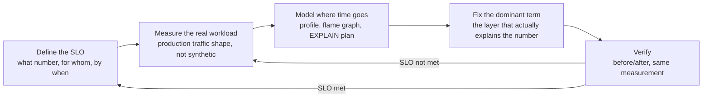
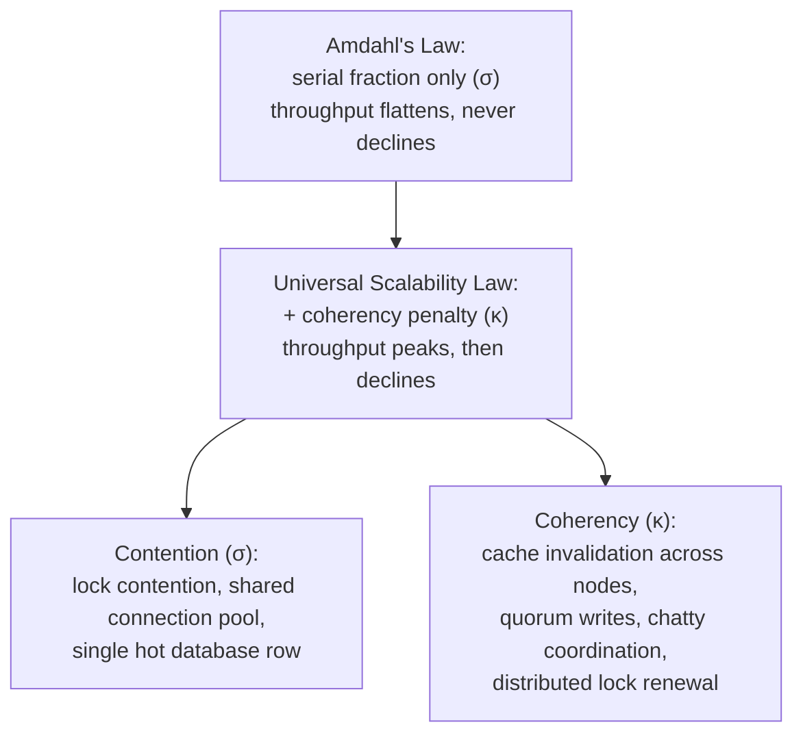

# Phase 12 - Performance, Scale and Cost

> **Weeks:** 71–77 | **Prerequisites:** Phase 8 | **Time budget:** 140 hrs
> **You finish this phase able to:**
> - Find the dominant bottleneck in a slow service with a profile and a flame graph, not a guess, and fix the layer that actually explains the number
> - Size thread pools, connection pools, and concurrency limits from Little's Law and an observed wait/compute ratio, not a framework default
> - Explain why p99 latency degrades far faster than p50 as fan-out and utilization grow, and apply hedged requests, tied requests, and the Universal Scalability Law to reason about it precisely
> - Choose and tune a GC (G1, Generational ZGC, Parallel, Shenandoah) from pause sensitivity and heap-size constraints, and prove the choice with a JFR recording or an async-profiler flame graph, not an opinion
> - Turn a capacity forecast and an SLO into a concrete scaling and pre-scaling plan for a 10–20x peak event
> - Attach a monthly dollar figure to an architecture decision, and name the levers that cut cloud spend without cutting reliability

## Why this phase exists

"Scale it" is not an instruction; it is a placeholder for a decision nobody has made yet. Scaling is not "add more pods" — a service that is slow because of a missing index does not get faster with ten more replicas, it gets ten times more expensive while staying exactly as slow, and a service saturated by lock contention can get *slower* as replicas increase, not faster. At senior level and above, you are expected to find the bottleneck with data — a profile, a flame graph, a query plan, a queueing calculation — fix the layer that actually explains the number, and know what the fix costs per month before you ship it. "It felt faster" is not evidence. A before/after number is.

Cost is the part most engineers are never taught and every staff-level interview now probes. For a decade, compute was cheap relative to engineering time and the default answer to "we're out of headroom" was a bigger instance or another replica. That era is over: infrastructure spend is now a board-level line item at most companies past a certain size, cloud bills scale with decisions individual engineers make without seeing a price tag attached — a connection pool sized twice as large as it needs to be, a service run at 15% CPU utilization "for safety," a synchronous cross-region call nobody profiled — and the engineers who can turn "this architecture choice" into "this many dollars a month" are the ones trusted with the budget as well as the design. This phase treats cost as a first-class design constraint with the same rigor Phase 8 gave observability and Phase 6 gave resilience, not as a finance problem to hand off after the fact.

This phase also closes a loop the roadmap has been setting up since Phase 0. [Phase 0](phase-00-distributed-systems-foundations.md) gave you the vocabulary of queues and fan-out amplification; [Phase 6](phase-06-resilience-engineering.md) gave you bulkhead sizing, adaptive concurrency limits, and the utilization wall; [Phase 8](phase-08-observability-and-operations.md) gave you SLOs, burn rate, and profiling signals; [Phase 9](phase-09-containers-kubernetes-cloud.md) gave you container-aware JVM sizing and the argument against autoscaling on CPU; [Phase 11](phase-11-testing-strategy.md) gave you load-testing method and the discipline against coordinated omission. None of those phases asked you to push a system past a comfortable capacity check into a deliberate order-of-magnitude scale exercise, profiled and priced end to end. This one does.

## Mental model

**Performance work is a loop: define the SLO, measure the real workload, model where time goes, fix the dominant term, verify, repeat. Optimization without a profile is superstition.**

Every step in that loop exists to prevent a specific, common failure. Skipping "define the SLO" produces optimization with no stopping point — a service can always be a little faster, and without a target, "faster" consumes unlimited engineering time for diminishing, sometimes invisible, user benefit. Skipping "measure the real workload" produces a fix for a workload nobody actually has — a benchmark run on a laptop, against synthetic data, with none of production's skew, hot keys, or payload-size distribution. Skipping "model where time goes" produces guessing dressed as engineering: an engineer's intuition about which layer is slow is right often enough to be dangerous, and wrong often enough to waste a sprint rewriting the part that was never the bottleneck. Skipping "fix the dominant term" produces effort spent on a component contributing 3% of the total time while the component contributing 70% goes untouched — Amdahl's law in miniature, learned the hard way. Skipping "verify" produces a fix that looked right in isolation and made nothing better, or something else worse, in production.



The loop is deliberately circular, not linear: fixing the dominant term usually reveals a new dominant term, because removing the biggest bottleneck exposes the second-biggest one, which was invisible while the first one dominated the profile. A team that treats performance work as a single pass — "we fixed the slow query, we're done" — stops one iteration early, almost always, because the query was never the *only* thing consuming the budget, only the largest single line item in it. The loop terminates at "SLO met," which is [Phase 8](phase-08-observability-and-operations.md)'s SLI/SLO discipline applied here directly: the loop has a defined exit criterion because the SLO is the number that defines "done," not a vague sense that things feel fast enough.

## Core concepts

### Vocabulary, precisely

Performance conversations fail more often from imprecise vocabulary than from missing technique — "latency" gets used for four different measurements in the same meeting, and the fix that's right for one is wrong for another.

| Term | Precise definition | Common confusion |
|---|---|---|
| **Latency** | Wall-clock time from when the caller sends a request to when it receives a response — the caller's-eye view | Conflated with response time, which excludes network transit and client-side queueing |
| **Response time** | Time the server spends producing a response, from receipt to send — the server's-eye view | Excludes what the caller actually experienced (DNS, TLS, network) |
| **Service time** | Time actually doing work, once a thread or handler has picked the request up | Excludes time spent waiting for a thread, a connection, or a lock — the part queueing dominates |
| **Queueing time** | Time spent waiting for a resource before service time starts | The component that grows explosively as utilization approaches capacity — see the utilization/latency curve below |
| **Throughput** | Completed requests (or bytes, or rows) per unit time | Not the same as capacity — throughput is what you are doing now, capacity is the ceiling |
| **Concurrency** | Number of requests in flight — accepted but not yet completed — at a given instant | Equals throughput multiplied by latency, by Little's Law, not an independently chosen number |
| **Utilization** | Fraction of a resource's maximum capacity actually busy over a window | The input to the utilization/latency curve, not itself a latency number |
| **Percentile** | The value below which a stated percentage of a distribution falls | p50 (median) tells you the typical experience; p99 and p99.9 tell you the experience of the users who determine whether your service has a reputation problem |

**p99 per service versus p99 per user journey.** A dashboard's per-service p99 answers "how slow is `pricing` for the requests that hit it" — a narrow, useful, but incomplete question. A user journey (loading the ShopKart homepage: `catalog` plus `search` plus `pricing` plus `recommendations`, in parallel) has its own p99, and it is always worse than any single service's p99, sometimes dramatically so, because the journey fails slow the moment *any* one of its fan-out calls is slow — the arithmetic behind that gap is the tail-latency-at-scale ladder later in this section. Reporting only per-service p99s while the business cares about journey latency is a common, invisible gap between "every dashboard is green" and "users think the site is slow."

### Little's Law and sizing from arithmetic instead of guessing

**Little's Law** states a relationship that holds for any stable queueing system regardless of arrival pattern or service-time distribution: the average number of requests in the system equals the arrival rate multiplied by the average time each request spends in the system — concurrency equals throughput times latency. [Phase 0](phase-00-distributed-systems-foundations.md) introduced the formula; this phase is where you use it deliberately, as a sizing tool rather than a fact to recite.

Worked example: a `checkout` endpoint handles 200 requests per second at an average latency of 80 milliseconds. Concurrency — the average number of in-flight requests at any instant — is 200 × 0.08 = 16. A thread pool or connection pool sized well below 16 queues constantly, since fewer threads than the average concurrency guarantees a backlog even under normal load; a pool sized far above 16 wastes memory and, past a point, actively hurts latency (the utilization/latency curve below explains why). The practical use: measure real throughput and real latency from production telemetry, multiply them, and size the pool from that number plus headroom for latency spikes — not from a framework default, not from "add a few more just in case."

This is also the general principle [Phase 6](phase-06-resilience-engineering.md)'s bulkhead-sizing formula is a special case of. `cores × (1 + wait_time / compute_time)` sizes a thread pool for a CPU-bound host running I/O-bound work: it is Little's Law rearranged for the specific case where you know the ratio of time spent waiting (queueing time, from the vocabulary table above) to time spent computing, rather than knowing throughput and latency directly. Both formulas answer the same question — how many workers does this workload actually need in flight at once — from whichever inputs you happen to have measured. HikariCP's own sizing guidance (`pool size = (core_count × 2) + effective_spindle_count` as a starting point, then measured and adjusted) is a third variant of the same arithmetic, tuned for a specific resource — database connections — where the "wait" side of the ratio is dominated by disk I/O rather than network I/O.

### The utilization/latency curve

**Plain English:** As a resource gets busier, the wait to use it does not grow smoothly — it grows slowly at first, then explosively, right before the resource looks "full."

**Analogy:** A single bank teller serving customers who arrive at random intervals. At low arrival rates the teller is idle between customers and nobody waits at all. As arrivals pick up, the teller stays busier, and — this is the counter-intuitive part — the line does not grow in proportion to how busy the teller is. A teller busy 50% of the time has almost no line, ever. A teller busy 90% of the time has a line most of the day, because random arrival bunching (three customers showing up within a minute of each other, purely by chance) has no slack left to absorb — the teller was already working when the bunch arrived. Where the analogy breaks down: a teller can decide to work through lunch to clear a line; a saturated CPU or thread pool cannot borrow capacity from the future, and past a point, adding more tellers to the same room makes each one slower, not faster, which the next section (Universal Scalability Law) explains.

**In the real world:** A ride-hailing app's driver-matching service reports 75% average CPU utilization on its dashboard — "comfortably busy," by the number alone — while its p99 latency has quietly tripled over the same period, because average utilization hides the moments (surge events, a downstream slowdown) where instantaneous utilization spikes toward 100% and the queue that forms during those moments dominates the tail, even though it barely moves the average.

**Mechanics.** For a simple queueing model (M/M/1 — Poisson arrivals, exponential service times, one server; the model is an approximation for a real multi-threaded service, but the shape it predicts holds up well in practice), average wait time scales as utilization divided by (1 minus utilization), multiplied by the service time. The resulting curve is not linear — it is a knee that turns sharply upward as utilization approaches 100%:

| Utilization | Queueing multiplier over service time | What it looks like in production |
|---|---|---|
| 50% | ~1x | Baseline — queueing time roughly equals service time |
| 75% | ~3x | Noticeable, tolerable on a dashboard |
| 90% | ~9x | Degraded — the tail is visibly bad |
| 95% | ~19x | User-impacting — this is where complaints start |
| 99% | ~99x | Unusable — the system is functionally saturated |

**What breaks:** a service running at 85–90% CPU or thread-pool utilization "for efficiency" is not being efficient — it is trading a small, invisible resource saving for a large, visible latency tax, and the same table is exactly why targeting 80% CPU on a latency-sensitive service is a mistake stated as a rule rather than a suggestion: at 80% utilization the queueing multiplier is already steep enough that a routine traffic bump of 10–15% pushes the service past the knee, and everything downstream of it — timeouts, retries, the metastable-failure feedback loop [Phase 6](phase-06-resilience-engineering.md) already named — follows from there. The fix is capacity headroom, not heroics: keep steady-state utilization below roughly 70%, autoscale before the knee, and treat "our CPU chart looks calm" as reassurance about the average, never about the tail.

### Universal Scalability Law

**Plain English:** Adding more workers to a job does not make it finish proportionally faster forever — past a point, the workers start getting in each other's way, and adding still more of them can make the job slower, not faster.

**Analogy:** A restaurant kitchen during a dinner rush. One cook makes dishes at some baseline rate. A second cook roughly doubles output, because the two can work mostly independently. A fifth cook adds much less than a fifth cook's worth of output, because now cooks are queueing for the one cutting board, bumping into each other at the pass, and shouting across the kitchen to coordinate who's plating what — time that produces zero dishes but is unavoidable once more than a couple of people share the same physical space and the same shared resources. Add a tenth cook to the same kitchen and total output can actually *drop* below what nine cooks produced, because the kitchen is now spending more time on collisions and coordination than on cooking. Where the analogy breaks down: a real kitchen's bottleneck resources (the cutting board, the pass) are physical and visible; a service's contended resources (a lock, a shared cache line, a single database row, a synchronous coordination call) are invisible on a headcount chart and only show up as a throughput curve that stops climbing, or turns downward, as replica count grows.

**In the real world:** A team scaling a checkout service's replica count from 10 to 40 pods during a capacity review, expecting throughput to roughly quadruple, instead sees throughput plateau around 25 pods and then decline — the signature of exactly this law in production, not a rare theoretical curiosity, usually traced afterward to a single shared resource (a database connection pool ceiling, a distributed lock, a hot cache key) that every added replica now contends over harder than the last one did.

**Mechanics.** Neil Gunther's Universal Scalability Law extends Amdahl's Law (which accounts only for the serial, non-parallelizable fraction of work) with a second penalty for the cost of keeping N workers' state consistent with each other. The model: throughput at N workers, relative to throughput at one worker, is `C(N) = N / (1 + σ(N − 1) + κN(N − 1))`, where σ (sigma) is the **contention penalty** — the fraction of work serialized behind a shared resource, like a lock, a connection pool, or a single writable database row — and κ (kappa) is the **coherency penalty** — the cost of keeping every worker's view of shared state consistent with every other worker's, which grows with the *number of pairs* of workers (hence the N(N − 1) term), not with N itself. When κ is zero, the formula reduces to Amdahl's Law and throughput asymptotically flattens as N grows, never actually declining. When κ is nonzero — any real distributed cache invalidation, any real quorum write, any real lock that must be visible cluster-wide — throughput has a maximum at a specific N and *declines* past it, because coordination cost between every pair of workers eventually outgrows the useful work each additional worker contributes.



**What breaks:** a team that reads a flattening throughput curve as "we've reached diminishing returns, add more nodes anyway" is optimizing blind — past the USL's peak, more nodes actively cost money while making the system slower, and the fix is never more replicas, it is finding and removing the σ or κ term: partition a hot table so writes stop serializing behind one row, replace a synchronous cross-node coordination call with an async or eventually-consistent one, shard a cache so invalidation stops being cluster-wide, or move a distributed lock's scope from global to per-shard. In practice, fitting σ and κ from measured throughput at a few different replica counts (even three or four data points) is usually enough to project where the peak sits and decide whether it is worth chasing headroom past it or worth removing the underlying contention first.

### Tail latency at scale: fan-out amplification

**Plain English:** The more independent things a single request depends on, the higher the chance that *at least one* of them is having a bad moment right when your request needs it — and a single slow dependency is enough to make the whole request slow, no matter how fast everything else was.

**Analogy:** A connecting flight with checked luggage split across two separate flights. You are only as done with your trip as the slowest bag — if one bag out of three makes its connection and two do not, you are still standing at baggage claim, and it does not matter that two-thirds of your luggage arrived on time. A homepage that fans out to twenty backend calls is the same problem with services instead of suitcases: the page is not "done" until the slowest of the twenty responds, and it takes only one of twenty having a bad moment to make the whole page slow. Where the analogy breaks down: an airline can put your delayed bag on the very next flight and you wait once; a request fanning out to twenty services faces that same one-in-twenty risk on *every single page load*, which is why the arithmetic below compounds into a real, constant tax rather than an occasional inconvenience.

**In the real world:** [Phase 0](phase-00-distributed-systems-foundations.md) already worked this arithmetic for the ShopKart homepage: fanning out to 20 microservices, each with its own p99 of 50 ms, means the probability that *none* of the twenty hits its own p99 or worse is 0.99 raised to the 20th power — roughly 82% — so roughly 18% of homepage loads see at least one dependency at p99 or worse, and the homepage's own effective p99 is therefore considerably worse than any individual service's. This phase's addition is what that number means operationally: the "organizational rule" this fact implies is that **a shared dependency's p99.9 is functionally everyone's p99**, once enough call paths share that dependency, and a platform team that improves a shared dependency's p50 while ignoring its p99.9 has improved a number that barely shows up in any consuming team's own dashboards.

**Mechanics.** The core formula scales predictably: for N independent calls each with per-call failure probability p at some percentile, the probability the aggregate misses that percentile is 1 − (1 − p)^N — which grows toward certainty surprisingly fast as N climbs past a handful, exactly the way [Phase 0](phase-00-distributed-systems-foundations.md)'s dependency-reliability table already showed for serial chains and the utilization/latency table above showed for a single saturated resource. The three practical responses, in order of how often each is the right one: **reduce fan-out** — aggregate data at write time instead of read time, cache instead of calling live, accept a slightly stale value where staleness is cheap; **parallelize what remains** — a sequential chain of five 50 ms calls costs 250 ms, the same five calls run concurrently cost close to 50 ms plus the slowest one's variance; and **hedge or tie the remaining unavoidable calls**, covered next.

**What breaks:** a team that optimizes every individual service's p50 diligently, service by service, and never looks at journey-level percentiles ships a system where every dashboard is green and the homepage still feels slow — because the homepage's tail latency was never a property any single service's dashboard could show, only a property of the fan-out shape connecting them, and no amount of per-service tuning fixes a fan-out problem.

### Hedged and tied requests

**Plain English:** Instead of waiting to find out whether the one server you asked is having a slow moment, ask a second server too, and take whichever one answers first — accepting a little wasted work in exchange for a much better worst case.

**Analogy:** You are starving and running fifteen minutes late for a meeting, so instead of ordering delivery from one restaurant and hoping it's fast, you order the same dish from two nearby restaurants at once and cancel whichever arrives second. Most nights you didn't need to — the first order would have arrived in time anyway — but on the one night your usual restaurant has a slow kitchen, the second order saves the meeting. Where the analogy breaks down: canceling a food order after the fact still costs the restaurant real ingredients and labor; canceling a hedged network request costs comparatively little if it is caught in flight, but it is never free — the request still consumed a connection slot and some server-side work up to the point of cancellation, which is exactly why hedging is rationed, not applied to every call.

**Mechanics.** A **hedged request** fires a duplicate request to a second replica only after the first request has already taken longer than some threshold — commonly the observed p50 or p95 for that call — rather than firing both immediately; this keeps the extra load small (most requests never trigger a hedge at all) while still catching the slow-tail requests a fixed timeout-and-retry would have caught much later, and much more expensively. A **tied request** goes further for latency-critical, cheap-to-cancel reads: fire the request to two or more replicas simultaneously from the start, and as soon as one server begins actually processing the request, it notifies the others (a "cancellation" message) so they can abandon the duplicate work immediately rather than completing it uselessly — trading a small amount of wasted network overhead for the best possible worst-case latency, at the cost of requiring the receiving servers to coordinate with each other, which only makes sense when the servers are close (same cluster, same AZ) and the coordination overhead is genuinely cheap. [Phase 6](phase-06-resilience-engineering.md) already introduced hedged requests as a Phase 6 pattern, citing Google's publicly reported 40%-plus tail-latency reduction on some services; the addition here is the *decision discipline*: hedge only reads, only idempotent operations, only when spare capacity genuinely exists, and only after measuring that the target call's tail is dominated by per-request variance rather than a systemic, cluster-wide slowdown a hedge cannot route around.

**What breaks:** hedging a write, or a non-idempotent call, without deduplication downstream turns a latency optimization into a double-charge or a double-decrement incident — this is precisely why hedged and tied requests are restricted to reads and to writes that are already idempotent by the discipline [Phase 4](phase-04-data-and-consistency.md) and [Phase 5](phase-05-events-and-streaming.md) established, never applied as a blanket "retry faster" policy.

### Measuring honestly: benchmark hygiene beyond the load test

[Phase 11](phase-11-testing-strategy.md)'s **coordinated omission** ladder already covers the load-generator-level measurement trap in full — a closed workload model silently under-measuring the tail exactly when the system is struggling most — and this phase does not re-teach it; build every capacity number in this phase on an open-workload-model load test, per that phase's k6/Gatling guidance, not a re-derivation of why. What this phase adds is the layer below the load test: **microbenchmark hygiene**, for the much smaller, much more misleading measurement — "is this one function faster than that one" — that a load test is the wrong tool to answer at all.

**JMH (Java Microbenchmark Harness)** exists because naive Java microbenchmarking — a `for` loop around a method call, timed with `System.nanoTime()` — produces numbers that are wrong in ways that are not obvious from reading the code. The JIT compiler has not warmed up yet during the first thousands of iterations, so early iterations measure interpreted or barely-optimized bytecode, not steady-state performance. **Dead-code elimination** can notice that a benchmarked method's result is never used and optimize the entire call away, benchmarking nothing. **Constant folding** can notice that a benchmark's inputs never change and precompute the result once, benchmarking a no-op. JIT deoptimization, garbage collection pauses landing mid-measurement, and JVM warmup between separate process runs all add further noise a naive timer cannot separate from the thing actually being measured.

```java
// JMH benchmark comparing two serialization approaches for the ShopKart order event.
// Demonstrates: fork isolation, explicit warmup/measurement iterations, Blackhole consuming the
// result to defeat dead-code elimination. Omits: the full build setup (JMH's Maven/Gradle plugin
// generates the actual benchmark runner; this is the annotated benchmark class only).
@BenchmarkMode(Mode.AverageTime)
@OutputTimeUnit(TimeUnit.MICROSECONDS)
@State(Scope.Benchmark)
@Fork(value = 3, jvmArgsAppend = "-Xmx1g")     // separate JVM processes — isolates one run's JIT/GC state from the next
@Warmup(iterations = 5, time = 1)              // discard these — JIT has not reached steady state yet
@Measurement(iterations = 10, time = 1)        // only these iterations count toward the reported result
public class OrderEventSerializationBenchmark {

    private OrderPlaced event;
    private final ObjectMapper jackson = new ObjectMapper();

    @Setup
    public void setUp() {
        event = TestEvents.typicalOrderPlaced();   // realistic payload shape, not a trivial toy object
    }

    @Benchmark
    public void jsonSerialize(Blackhole bh) throws Exception {
        bh.consume(jackson.writeValueAsBytes(event));   // Blackhole prevents the JIT from eliminating this as dead code
    }

    @Benchmark
    public void protobufSerialize(Blackhole bh) {
        bh.consume(OrderEventProto.from(event).toByteArray());
    }
}
```

**Why a microbenchmark still rarely predicts production, even done correctly.** A clean JMH result proves the isolated operation's relative cost under warmed-up, single-threaded, cache-friendly conditions — it does not prove anything about that operation's cost under production's actual concurrency, actual object-lifetime pattern (a fast allocation-heavy approach can still lose badly once GC pressure from real traffic volume is added), or actual cache behavior once it is competing with everything else running in the same container for the same L2/L3 cache and the same GC pauses. Treat a JMH result as one input to a decision — "protobuf allocates 40% less than JSON for this payload shape, worth prototyping under real load" — never as the final word; the production-scale verification is the load test [Phase 11](phase-11-testing-strategy.md) already established, run after the microbenchmark narrows the candidates, not instead of it.

### Profiling: from a symptom to a specific line of code

**async-profiler's four modes answer four different questions**, and picking the wrong one wastes the whole profiling session. **CPU mode** (sampling, typically via `perf_events` on Linux) answers "which stack frames are actually consuming CPU cycles" — the default first move for a service pegged at high CPU with an unclear cause. **Allocation mode** answers "which call sites are creating the most objects," using JVM `TLAB` (thread-local allocation buffer) sampling rather than a full-fat heap dump, and is usually the fastest path to finding the code responsible for GC pressure, since allocation rate — not heap occupancy — is the number that actually drives GC frequency, covered in the JVM performance section below. **Lock mode** answers "which locks are threads actually contending on and for how long," the direct diagnostic for a Universal-Scalability-Law-shaped throughput plateau. **Wall-clock mode** answers "where does real elapsed time go, including time spent blocked or waiting," the right mode for an I/O-bound service where CPU-mode profiling would show almost nothing, because the thread is not consuming CPU while it waits on a network call — it is simply not running.

**JFR (Java Flight Recorder) in production.** Where async-profiler is typically attached for a bounded investigation window, JFR is designed to run continuously, at low overhead (typically well under 1–2%), capturing GC pauses, allocation profiles, lock contention, thread state, and — as [the facts baseline for this phase](../.build/facts-curated.md) establishes — the `jdk.VirtualThreadPinned` event specifically, which is how you detect a virtual thread pinned to its carrier by a `synchronized` block or a native/JNI frame in a live service rather than by inference. A continuously running JFR recording, with a rolling retention window, means the recording for an incident that happened five minutes ago already exists — you are analyzing a recording, not trying to reproduce a transient production-only symptom on demand.

**Reading a flame graph.** A flame graph's x-axis is *not* time — it is the sampled proportion of the profiling window, with stacks sorted alphabetically at each level, so width directly represents how much of the total sampled time a function (and everything it calls) accounts for; a wide frame is expensive, a narrow one is cheap, regardless of its horizontal position. The y-axis is call-stack depth — the bottom frame is where sampling started (often `main` or a thread's run loop), and each frame stacked above it is a function called by the one below. The **dominant path** — the thing worth fixing — is the widest tower of frames from bottom to top; a flame graph with one obviously wide tower and everything else a thin fringe is a benchmarker's best case, because it names a single clear target. A **differential flame graph** (two profiles diffed, colored by which side grew or shrank) is the right tool for "did my fix actually work" — it turns "compare two flame graphs by eye" into "look at what's colored red," directly answering whether the dominant path from before the change shrank after it.

**Heap analysis for leaks.** A growing heap that never returns to baseline after a full GC, across successive GCs over hours, is the signature of a leak, not a tuning problem — chasing it with GC flags treats the symptom. Take two heap dumps (`jcmd <pid> GC.heap_dump`) separated by a period of normal traffic, and diff dominator trees in a heap analysis tool (Eclipse MAT or a JFR-based equivalent) for the object type whose retained-size growth roughly matches the leaked memory — the **dominator tree**, not raw instance count, is what matters, because it shows what is actually keeping an object reachable (a growing cache with no eviction policy, a listener registered but never unregistered, a `ThreadLocal` never cleared on a pooled thread) rather than just that instances exist.

**A worked "how I would find this" narrative.** A ShopKart `pricing` service's p99 latency has crept up 3x over two weeks with no code deploy in that window and CPU utilization sitting at a calm-looking 55%. Start with JFR — pull the last hour's continuous recording rather than waiting to reproduce the problem live. GC pause events show nothing unusual; thread-state samples show a large fraction of request-handling threads in `BLOCKED`, not `RUNNABLE` — the CPU looking calm was the tell, not the reassurance, because a thread blocked on a lock burns no CPU while it waits. Attach async-profiler in lock mode for a five-minute window during peak traffic; the resulting flame graph shows a wide tower rooted in a `synchronized` method guarding an in-memory pricing-rule cache that refreshes from the database every few minutes — the refresh holds the lock for the full duration of a multi-millisecond database round trip, and every pricing request behind it during that window queues on the same lock. The fix (a `ReadWriteLock`, or better, a lock-free swap of an immutable rule set on refresh) removes the contention; the differential flame graph from before/after confirms the tower is gone, and the p99 recovers within one deploy.

### JVM performance

**GC selection: the decision criteria, not a preference.** [The version baseline](../.build/facts-curated.md) names four collectors worth knowing on the JVM as of late 2026, and the choice among them is driven by three inputs — heap size, pause-time sensitivity, and whether throughput or latency is the thing actually being optimized — not by familiarity or default inertia.

| Collector | Best fit | Trade-off |
|---|---|---|
| **G1** (default) | Balanced default for most services; moderate heaps (a few GB to tens of GB) | Reasonably low pauses without tuning; not the lowest-pause option available if pause time is the dominant concern |
| **Generational ZGC** | Large heaps (tens to hundreds of GB), strict low-pause requirements | Sub-millisecond target pause times regardless of heap size; some throughput cost versus G1 under allocation-heavy workloads |
| **Parallel** | Batch and throughput-oriented workloads with no latency SLO (an overnight reconciliation job, a bulk export) | Highest raw throughput, stop-the-world pauses that would be unacceptable for a request-serving service |
| **Shenandoah** | Low-pause alternative to ZGC, particularly where ZGC is unavailable on the target JVM distribution | Similar low-pause goals to ZGC via a different concurrent-compaction algorithm; worth a direct comparison on your actual allocation pattern rather than assuming either is strictly better |

The practical default for a request-serving Spring Boot service: start with G1 and a stated pause-time goal (`-XX:MaxGCPauseMillis=200`, tuned to a fraction of your latency SLO's budget, not a round number), and move to Generational ZGC specifically when either heap size grows past the point where G1's pause times start showing up in your p99, or the pause-sensitivity requirement is strict enough that G1's occasional longer pause (G1 targets its pause goal on average, not as a hard ceiling) is unacceptable.

### The GC pause-time tuning trade-off

**Plain English:** A garbage collector can spend more effort keeping pauses short, or more effort maximizing how much work gets done between pauses — and pushing further toward one goal costs you some of the other, always.

**Analogy:** A kitchen deciding how often to do a full clean-as-you-go tidy versus one big cleanup at the end of service. Tidying constantly (short, frequent pauses) means the kitchen never grinds to a halt for a big cleanup, but every tidy break steals a few seconds from cooking, many times over the night. One big cleanup at closing (fewer, longer pauses) wastes zero time during service, but the closing cleanup itself takes a while and, if it happened mid-service instead, would stop every cook in the kitchen at once until it finished. Where the analogy breaks down: a kitchen chooses when its cleanup happens; a stop-the-world GC pause happens when memory pressure demands it, not when it is convenient, which is exactly why a latency-sensitive service cannot simply schedule around it.

**In the real world:** A trading or bidding platform with a strict low-latency requirement will tolerate materially lower total throughput in exchange for a collector (Generational ZGC or Shenandoah) that guarantees sub-millisecond pauses, while a nightly batch ETL job optimizes the opposite direction entirely, choosing Parallel GC's multi-second acceptable pauses in exchange for the highest possible total throughput, because nothing is waiting synchronously on any single pause.

**Mechanics.** **Allocation rate — not heap occupancy — is the real GC driver.** A service can run with a large, mostly-idle heap and still GC frequently if it allocates aggressively (a request handler that builds many short-lived objects per request); reducing *allocation rate* per request — reusing buffers, avoiding unnecessary boxing, preferring primitive collections for hot paths — reduces GC frequency more reliably than simply raising `-Xmx`, which only delays the same collection work, it does not eliminate it. **Escape analysis** lets the JIT prove a short-lived object never leaves the method that created it and never becomes reachable from another thread, and in that case allocate it on the stack (or eliminate the allocation entirely via scalar replacement) instead of the heap — writing methods that keep object lifetimes provably local (avoiding passing an object out through a field write, a collection add, or a method return when a local computation would do) helps the JIT apply this optimization more often, though it should never be chased at the expense of readable code; verify with `-XX:+PrintEscapeAnalysis` diagnostics if it genuinely matters for a hot path, not by assumption. **Object header and field-layout overhead** matters at scale: every Java object carries a header (a mark word plus, with compressed class pointers enabled by default on modern heaps under 32 GB, a compressed class pointer — commonly 12 bytes total, padded to an 8-byte alignment boundary), so a service allocating millions of small wrapper objects per second pays real, measurable overhead purely in headers before a single field's data is considered; flattening a chain of small wrapper objects into fewer, denser records (a `record` with primitive fields, rather than nested boxed wrapper types) reduces both header overhead and pointer-chasing cache misses. **Off-heap and direct buffers** (`ByteBuffer.allocateDirect`, Netty's pooled direct buffers) move large, long-lived, or frequently-reused byte data outside the garbage-collected heap entirely — the right tool for network I/O buffers and large caches, at the cost of manual lifecycle management (a direct buffer leak does not show up in heap-occupancy metrics, and needs its own monitoring).

**What breaks:** a team that raises `-Xmx` every time GC overhead shows up in a profile without checking allocation rate first is treating the symptom — a bigger heap postpones each individual collection but does not reduce the total volume of garbage produced, so total GC time across a fixed traffic window barely changes, while the individual pauses that do happen (particularly for older-generation collections) often grow *longer*, because there is more live data to trace through on each one. Fix allocation rate first; resize the heap second.

**JIT warmup and mitigation.** A freshly started JVM runs on the interpreter and the lowest optimization tiers until the JIT has collected enough profiling data on a given method to justify compiling it to optimized native code — which means the first seconds to low minutes of a new pod's life run measurably slower than its steady state, a real cost during a rolling deploy or a scale-up event under load. Three mitigations, each addressing a different part of the cost: **CDS (Class Data Sharing)** pre-parses and memory-maps class metadata so it does not need re-parsing on every JVM start, cutting startup time without touching JIT warmup itself. **Project Leyden's AOT cache**, shipping incrementally through JDK 24–26 per [the version baseline](../.build/facts-curated.md), goes further — a training run records which classes get loaded and linked and, increasingly, JIT profiling data itself, so a subsequent production start can skip re-deriving information the training run already captured, with startup improvements reported in the tens of percent without leaving HotSpot or requiring a separate native-image build; this is the easiest JVM-level win to adopt, because it requires no code change, only a training run wired into the build. **Warmup traffic** — routing a small amount of synthetic or shadow traffic to a new pod before it joins the real load balancer pool — buys the JIT a head start against real request shapes specifically, complementing rather than replacing CDS/AOT, because no static training run perfectly predicts every production request pattern.

**Virtual threads for I/O-bound concurrency, and the pinning caveats.** Virtual threads (Project Loom, GA since JDK 21, `spring.threads.virtual.enabled=true` on Boot 3.2+/JDK 21+) let an I/O-bound service run one virtual thread per request — blocking, sequential-looking code — instead of hand-rolled reactive or callback-based concurrency, while the runtime multiplexes many thousands of virtual threads over a much smaller pool of OS carrier threads, parking a virtual thread (cheaply, without consuming an OS thread) whenever it blocks on I/O. The historical showstopper — a `synchronized` block pinning a virtual thread to its carrier thread for the block's entire duration, defeating the whole point — was removed by JEP 491, landing in JDK 24; per [the version baseline](../.build/facts-curated.md), this is the single biggest reason JDK 24 or later, not JDK 21, is the practical floor for taking virtual threads seriously in a service with any legacy `synchronized` code in its dependency graph. The remaining pinning source on JDK 24+ is native and JNI frames — a virtual thread blocked inside native code still pins its carrier, because the runtime has no way to unmount a thread mid-native-call — and the way to find it in a running service is the `jdk.VirtualThreadPinned` JFR event (default reporting threshold 20 ms), not the now-removed `-Djdk.tracePinnedThreads` flag.

**Thread and connection pool sizing: the counter-intuitive smaller-pool result.** Once a workload is genuinely I/O-bound and running on virtual threads, the platform-thread pool-sizing arithmetic above (Little's Law, `cores × (1 + wait/compute)`) mostly stops applying to the *application* thread pool — virtual threads are cheap enough that "one per in-flight request" is a reasonable default, and the sizing question shifts to whatever *bounded* resource is actually scarce: a database connection pool, a downstream service's own concurrency limit, a semaphore-based bulkhead. And for those bounded resources, more capacity is frequently *not* faster: a HikariCP pool oversized well past what the database itself can usefully parallelize adds context-switching and lock-contention overhead on the database side without adding usable throughput, since the database's own CPU and I/O become the real ceiling — this is the Universal Scalability Law's contention term showing up concretely, and it is why HikariCP's own documentation argues for pools smaller than intuition suggests, sized from measured database throughput under load, and re-verified whenever the underlying instance size changes, rather than from "more connections can only help."

### Data layer performance

**Reading an EXPLAIN plan.** PostgreSQL's `EXPLAIN (ANALYZE, BUFFERS)` shows both the planner's cost estimate and the real, executed timing and buffer access per node — the three signals worth checking first on any slow query: a **sequential scan** on a table larger than a few thousand rows where an index scan was expected (missing or unused index, or a predicate the planner cannot use an index for — a function applied to the indexed column without a matching expression index, a leading-wildcard `LIKE`); a large gap between the planner's **estimated** and **actual** row counts (stale statistics — run `ANALYZE`, or a correlation the planner cannot model); and a high proportion of **buffers read** versus **buffers hit** (working set exceeding cache, forcing disk reads on a query that should be served from shared buffers).

**Index design.** **Composite column order** matters for a multi-column index: put equality-filtered columns before range-filtered or sort columns, because an index is only useful left-to-right — an index on `(status, created_at)` serves `WHERE status = 'SHIPPED' ORDER BY created_at` efficiently, while the same columns reversed cannot. **Covering indexes** (`INCLUDE` in PostgreSQL) add non-key columns to an index's leaf pages specifically so a query can be answered entirely from the index without touching the underlying table — an index-only scan — trading index size for eliminating a table lookup per row. **Partial indexes** (`WHERE` on the index definition itself, e.g., `CREATE INDEX ON orders (customer_id) WHERE status = 'PENDING'`) index only the subset of rows a real query pattern actually filters on, keeping the index small and fast for a query that always excludes the majority of rows (completed orders, in this example). **GIN** indexes fit JSONB containment queries and full-text search, where a single row can match many index entries; **BRIN** (Block Range Index) fits very large, naturally ordered tables — time-series data, an append-only event log — trading precision for an index a fraction of the size of a B-tree, because it only needs to record the min/max value per physical block rather than an entry per row.

**The N+1 problem and its four fixes.** Lazy-loaded JPA associations accessed in a loop — one query to fetch a list of orders, then one additional query per order to fetch its line items — turn a single logical operation into N+1 round trips, each paying full network and query-planning overhead for a fraction of a millisecond of actual work. Four fixes, not equivalent: **join fetch** (`JOIN FETCH` in JPQL) pulls the association in the same query via a SQL join, at the cost of a Cartesian-product-shaped result set if fetching multiple collections at once. **Entity graphs** (`@EntityGraph`) declare which associations to eagerly fetch per query, without hardcoding it into every JPQL string, keeping the fetch strategy separate from the query itself. **Batch fetching** (`hibernate.default_batch_fetch_size`, or `@BatchSize`) turns N individual per-row queries into ceil(N / batch size) queries using `WHERE id IN (...)`, a good default when a join would produce an unmanageable Cartesian product. **Projections/DTOs** skip entity hydration and associations entirely, selecting only the exact columns a specific read actually needs — the right tool when the caller never needed the full entity graph in the first place, which is the common case for a read-only API response.

**Pagination cost.** `OFFSET`-based pagination forces the database to scan and discard every row before the offset on every page request — page 1,000 at 50 rows per page scans and throws away 49,950 rows before returning the 50 that matter, and that scan cost grows linearly with offset regardless of index support. **Keyset (cursor) pagination** — `WHERE (created_at, id) < (:last_created_at, :last_id) ORDER BY created_at DESC, id DESC LIMIT 50` — uses an index to jump directly to the right starting point regardless of how deep the page is, at the cost of not supporting arbitrary "jump to page 47" navigation; [Phase 3](phase-03-communication-and-apis.md)'s cursor-pagination API design is the interface-level version of this same fix, and this phase is where the database-level reason it matters becomes concrete with a real cost curve rather than an API preference.

**Batching, prepared statements, and connection discipline.** JDBC batch writes (`addBatch`/`executeBatch`, or Spring Data's `saveAll` with `hibernate.jdbc.batch_size` configured) collapse many individual round trips into one network exchange, the same round-trip-elimination principle as a batch API at the service layer, applied one layer down. **Prepared statement reuse** — letting the driver and database cache a parsed, planned statement across executions with different parameter values, rather than sending a fresh literal SQL string per call — avoids repeated parse-and-plan overhead on every single query; ORM frameworks generally do this by default, but hand-rolled JDBC or string-concatenated queries silently opt out of it, along with opting into SQL injection risk. **Connection churn** — opening a fresh connection per request instead of drawing from a pool — pays TCP handshake, and for TLS-secured connections, a full handshake cost (covered under service-level optimization below) on every single request; a connection pool amortizes that cost across the pool's lifetime instead.

**Replica lag and read routing.** Routing read traffic to a read replica reduces primary-database load, but every replica lags the primary by some nonzero, variable amount — a read immediately following a write, routed to a replica, can return stale data purely from replication lag, independent of any application bug. A **staleness guard** — checking measured replica lag (PostgreSQL's `pg_stat_replication` or an equivalent managed-database metric) before routing, and falling back to the primary when lag exceeds a stated bound, or routing read-your-own-write paths to the primary explicitly for a short window after a write — is the concrete pattern; shown in full under Production patterns below.

**Materialized views, partitioning, and hot keys.** A **materialized view** precomputes an expensive aggregation or join on a schedule or trigger, trading write-time (or refresh-time) cost and eventual consistency for read-time speed — the right tool when a read is expensive and tolerant of some staleness, the wrong tool when the read must reflect every write instantly. **Partitioning** (range, hash, or list, all supported natively in PostgreSQL 18) splits one large table into physically separate segments the planner can prune against, so a query filtered on the partition key touches only the relevant partition instead of scanning the whole table — commonly applied to time-series data by date range. **Hot keys and salting**: a single frequently written row or partition key (a viral product, a celebrity seller, a single Kafka partition receiving disproportionate traffic) becomes a serialization bottleneck no amount of horizontal scaling elsewhere fixes, exactly the Universal Scalability Law's contention term concentrated on one resource; **salting** — appending a random or hashed suffix to the hot key to spread its writes across multiple physical rows or partitions, then aggregating across the salted copies at read time — trades read-side complexity for removing the write-side bottleneck, and is the direct fix for war story 3 later in this phase.

### Cache hierarchy and hit-ratio arithmetic

**Plain English:** A cache that catches almost every request looks only a little better on paper than one that catches most requests — but the *database* sees a wildly different amount of leftover traffic in each case, because it only ever sees what the cache missed.

**Analogy:** A photocopier queue outside a busy office where most people photocopy the same handful of common forms. If the receptionist keeps ninety-five out of every hundred common forms pre-copied and ready (a 95% hit rate), five requests out of every hundred still walk to the photocopier. If the receptionist manages ninety-nine out of a hundred instead (a 99% hit rate), only one request in a hundred walks over — a hit-rate improvement that looks small (95% to 99%, four percentage points) cuts the photocopier's own queue by a factor of five, because the photocopier's load is driven by the *miss* rate, not the hit rate, and the miss rate dropped from 5% to 1% — a fivefold reduction, not a four-point one.

**In the real world:** A CDN or application cache in front of the `catalog` service reporting "95% cache hit rate" and "99% cache hit rate" sound like a rounding difference to a casual reader of a dashboard; the database or origin service behind each number sees, respectively, 5 requests per 100 and 1 request per 100 — the origin's real load at 99% is one-fifth of its load at 95%, which is the entire reason a hit-ratio SLO belongs on every cache's dashboard, not just a hit-ratio number quoted once in a design doc.

**Mechanics.** Origin load scales with the **miss rate**, not the hit rate: at a 95% hit rate, origin sees 5% of total traffic; at 99%, origin sees 1% — a 5x reduction in origin load for what reads as a "4-point" improvement in the hit-rate number. The arithmetic compounds across a cache hierarchy: an **L1 local cache** (Caffeine, in-process, sub-microsecond, no network hop, but not shared across replicas and cold on every pod restart) typically catches the most repetitive local traffic; an **L2 distributed cache** (Redis or Valkey, shared across replicas, survives individual pod restarts, at the cost of a network round trip) catches what L1 missed; and a **CDN/edge cache** in front of both catches cacheable API responses before they reach the service fleet at all. Each layer's effective hit rate compounds against what the layer above it already caught — an L1 catching 80% of traffic and an L2 catching 80% of what's left catches 96% overall (80% plus 80% of the remaining 20%), well above either layer alone.

**What breaks:** the direct incident shape is war story 4 later in this phase — a cache key change (adding a parameter to the cache key that fragments what used to be one shared entry into many near-identical ones) drops a hit rate from 98% to 60%, which looks like "we lost 38 points," but the origin's actual load went from 2% of traffic to 40% of traffic — a twentyfold increase — because the miss rate went from 2% to 40%. A cache with no hit-ratio SLO and no alert on hit-rate degradation finds this out only when the origin database falls over, not when the cache key changed.

### Service-level optimization

**Payload size and serialization cost.** JSON is human-readable and universally supported, at the cost of larger payloads (field names repeated in every object, no binary packing) and non-trivial parse/serialize CPU cost at high volume. **Protocol Buffers** and **Avro** trade JSON's readability for a compact binary wire format and, for Protobuf, a statically compiled schema that skips reflection-based (de)serialization entirely — the JMH benchmark earlier in this section is exactly the tool for deciding whether that trade-off is worth it for a specific hot path, rather than assuming it always is; a low-volume administrative endpoint gains little from the switch and loses human-readability for debugging, while a high-volume inter-service call on the checkout critical path often gains measurably.

**Compression: gzip versus zstd versus brotli, and when it hurts.** gzip is universally supported and a safe default; zstd offers materially better compression ratios at comparable or better speed at most compression levels, and is increasingly the modern default where client support allows; brotli tends to win on static, highly compressible content (particularly text/HTML) but compresses more slowly at high quality levels, making it a better fit for content compressed once and served many times (a CDN-cached asset) than for dynamically generated, compressed-on-every-request API responses. Compression **hurts** in three specific cases named directly as an anti-pattern later in this phase: payloads small enough that compression overhead exceeds the bytes saved (a rule of thumb: skip compression under roughly 1–2 KB), payloads that are already compressed (images, video, already-gzipped data — compressing twice wastes CPU for zero benefit and sometimes a larger result), and a CPU-bound service where compression's own CPU cost competes directly with the request-handling work the service exists to do — measure compression's CPU cost against its bandwidth savings for your actual traffic mix before enabling it broadly.

**HTTP/2 multiplexing and connection reuse.** HTTP/1.1 serializes requests over a limited number of connections per host (browsers commonly cap at six), forcing either connection-per-request churn or head-of-line blocking within a connection; HTTP/2 multiplexes many concurrent request/response streams over a single TCP connection, eliminating both, at the cost of TCP-level head-of-line blocking on packet loss (which HTTP/3's QUIC transport addresses by moving multiplexing below TCP entirely — worth naming as the forward direction, without over-indexing on it for a typical internal service-to-service call where packet loss is rare). Connection reuse — keeping a pool of warm HTTP/2 connections between two services rather than establishing a new connection per call — amortizes both TCP and TLS handshake cost across every request on that connection.

**TLS handshake cost and session resumption.** A full TLS handshake costs a full network round trip (or more, depending on the negotiated key exchange) before any application data moves, which is measurable overhead on connection-per-request patterns and negligible overhead on long-lived, reused connections — another reason connection churn (named under data-layer performance above, and applicable equally to any TLS-secured HTTP call) is a real, cumulative cost, not a rounding error. **Session resumption** (TLS session tickets, or TLS 1.3's 0-RTT for a subsequent connection to a server the client has already handshaken with) skips the full handshake's expensive asymmetric cryptography on reconnection, at 0-RTT's specific cost of a narrow replay-attack window on the very first request of a resumed session, which is why 0-RTT is restricted to idempotent requests in most correctly configured deployments.

**Request coalescing and single-flight.** When many concurrent callers request the same not-yet-cached value at once — a cold cache entry for a suddenly popular product, right as traffic spikes — naive per-request cache-miss handling sends every one of those concurrent callers to the origin simultaneously, a **thundering herd** against the exact resource the cache exists to protect. **Single-flight** (the pattern's common name from Go's `singleflight` package, and available via Caffeine's `AsyncLoadingCache` in Java) deduplicates concurrent identical in-flight requests into one real origin call, with every other caller awaiting the same in-flight future rather than issuing a redundant one — shown in full as a Production pattern below.

**Batch APIs to kill chattiness.** A client needing data for fifty items making fifty separate round trips pays fifty times the network and connection overhead of one batch call — the service-layer version of the N+1 problem named under data-layer performance, and the fix is structurally identical: expose `POST /orders/batch` accepting an array, rather than requiring N calls to `GET /orders/{id}`.

**Precomputation versus on-demand.** Compute-once-serve-many (a nightly aggregation, a materialized projection, a precomputed recommendation list) trades write-time or scheduled-job cost and staleness for near-zero read-time cost — the right default for anything read far more often than its inputs change; on-demand computation is the right default for anything whose inputs change as often as it is read, where precomputing would mostly waste effort recomputing values nobody re-reads before they're already stale.

**CDN and edge caching for API responses.** `Cache-Control` headers on API responses (`max-age`, `stale-while-revalidate` to serve a slightly stale response immediately while refreshing in the background, `stale-if-error` to serve stale content rather than an error if the origin is briefly unreachable) let a CDN cache genuinely cacheable API responses — catalog listings, search results for common queries — the same way it caches static assets, removing that traffic from the origin fleet entirely; shown as a Production pattern below.

**Streaming (SSE/WebSocket) scaling limits.** A long-lived connection (Server-Sent Events for one-way server push, WebSocket for bidirectional) consumes a file descriptor and some fixed per-connection memory for its entire lifetime, not just for the duration of a request — a service designed for request/response concurrency limits (thread or connection pool sized from Little's Law against a request duration measured in milliseconds) is sized completely wrong for a workload where each "request" lasts minutes or hours; capacity planning for a streaming service has to be driven by concurrent open connections and per-connection memory footprint, not requests per second, and virtual threads (one per connection, cheaply parked while idle) are a materially better fit for this shape than a small platform-thread pool ever was.

### Scaling patterns

**Stateless services** — no session state or in-memory data a request's correctness depends on surviving a restart or landing on a specific replica — are the precondition for every other pattern in this section; a stateful service (in-memory session affinity, a local write-ahead cache treated as a source of truth) cannot be scaled or rescheduled freely without either replicating that state or accepting a correctness gap during failover.

**Sharding** splits a dataset (and the write load against it) across multiple physical partitions by a shard key — customer ID, tenant ID, geographic region — so no single database instance is the bottleneck for the whole system's write volume; the cost is cross-shard queries becoming either impossible or expensive (aggregating across every shard) and re-sharding, when a shard key's distribution turns out uneven, being one of the more painful migrations in this roadmap's catalogue — sharding is a pattern to reach for once single-instance write throughput is the genuinely proven bottleneck, not a default architectural starting point.

**Read/write splitting** routes reads to replicas and writes to the primary, covered in the data-layer section above with its staleness guard; it scales read capacity without sharding, at the cost of the eventual-consistency window replication lag introduces.

**Queue-based load levelling** puts a durable queue between a bursty producer and a rate-limited consumer, letting the queue absorb a spike the consumer fleet could never handle synchronously while the consumer fleet scales up behind it at its own pace. [Phase 5](phase-05-events-and-streaming.md)'s Shopify Black Friday precedent is this exact pattern proven at real scale — order volume spiking from 10,000 to 70,000 orders per second in under sixty seconds, absorbed by Kafka as the buffer while inventory reservation, payment processing, fraud detection, and notification consumers each scaled independently against consumer lag — and this phase does not re-tell that story; it builds the autoscaling mechanics behind "consumers scale independently based on lag" as a named production pattern below.

**Cell-based architecture** partitions an entire system — compute, data, and often the network path — into independent, identically structured cells, each serving a subset of customers or traffic, so a failure or a saturation event in one cell cannot cascade into another; [Phase 6](phase-06-resilience-engineering.md)'s coverage of AWS's shuffle sharding and static stability is the resilience-motivated version of this same architecture, and the performance-and-scale motivation is identical in shape — a cell's blast radius for *capacity* saturation, not just for failure, is bounded to that cell, so a single viral product or a single noisy tenant degrades one cell's users, not the whole fleet's.

**Backpressure end-to-end** means every hop in a call chain — not just the first one — is capable of signaling "slow down" upstream rather than silently queueing until it falls over; [Phase 0](phase-00-distributed-systems-foundations.md) and [Phase 6](phase-06-resilience-engineering.md) built this per-hop (bounded queues, admission control, CoDel-style queue timeouts), and the scale-specific addition here is treating it as a system property to verify end-to-end under a real 10x load test, not just as a per-service configuration checked in isolation — a chain where every individual hop has correct backpressure can still fail as a system if the *aggregate* propagation delay from the last hop's backpressure signal back to the first hop's admission control is slower than the traffic spike that triggered it.

**Autoscaling on the correct signal.** [Phase 9](phase-09-containers-kubernetes-cloud.md) already made the case in full: CPU utilization is frequently the wrong signal for an I/O-bound Java service, because a service can be at its real concurrency ceiling — thread pool exhausted, queue depth climbing, p99 rising — while CPU sits comfortably low, since waiting on a downstream call or a database burns no CPU. This phase's addition is naming the correct signal precisely for each workload shape: **in-flight concurrency** or **request queue depth** for a synchronous request/response service (exposed via the Prometheus Adapter [Phase 9](phase-09-containers-kubernetes-cloud.md) already covers, from a metric your own service already emits), and **consumer lag** for a queue-based consumer (KEDA, also already covered in Phase 9). The addition genuinely new to this phase is **warmup-aware scaling policy**: a naive autoscaler reacting purely to the current metric value overshoots or undershoots during a spike, because [Phase 9](phase-09-containers-kubernetes-cloud.md)'s scaling-latency chain (image pull, JVM boot, JIT warmup) means a newly scaled-up pod is not genuinely at full capacity the moment it starts reporting `Ready` — a warmup-aware policy either discounts a brand-new pod's effective capacity for a stated grace period when computing whether the fleet has caught up, or, more simply, biases the scale-up target higher than the bare metric threshold would suggest specifically to buy the warmup chain time before the next scaling decision, preferring to briefly over-provision during a spike over chasing a metric that a not-yet-warm pod cannot actually satisfy.

### Capacity planning

**Deriving required capacity from an SLO and a traffic forecast.** Start from the SLO ([Phase 8](phase-08-observability-and-operations.md)'s territory: a specific latency and error-rate target for a specific user-facing flow) and a traffic forecast (historical growth rate, plus any known upcoming event — a marketing campaign, a product launch, a seasonal peak). Convert the forecast into a required throughput number, convert that throughput into required concurrency via Little's Law, and convert required concurrency into required replica count using measured per-replica capacity at the SLO's latency target specifically — not a replica's maximum throughput at a much worse latency, which is a different, larger, and misleading number.

**Headroom targets.** Steady-state utilization below roughly 70% (per the utilization/latency curve above) is the working default; a service's headroom target should additionally account for the time it takes to scale — [Phase 9](phase-09-containers-kubernetes-cloud.md)'s 30–90-second-plus scaling-latency chain means a traffic spike faster than that window has to be absorbed by existing headroom, not by autoscaling that has not finished reacting yet, which is exactly why a genuinely predictable peak event gets **pre-scaled** ahead of time rather than left to reactive autoscaling alone.

**Peak events and pre-scaling.** A flash sale, a ticket drop, or a major sporting event is not a surprise — it has a known start time — and the correct response is to scale the fleet to its forecast peak capacity *before* traffic arrives, holding that capacity through the event's known duration, then scaling back down afterward, rather than trusting a reactive autoscaler to keep pace with a demand curve steeper than its own reaction time. This is Alibaba's and Shopify's publicly described practice, covered in How big tech does it below, applied at ShopKart's scale.

**A worked ShopKart Black Friday capacity plan.** Baseline: `order` processes 1,000 orders/second at steady state, with a checkout p99 SLO of 300 ms, currently running 20 replicas at roughly 50% average utilization — headroom already budgeted per the target above. Forecast: marketing and prior-year data project a 15x peak for a four-hour Black Friday window, meaning a peak of 15,000 orders/second. Required concurrency at peak, by Little's Law, is 15,000 × 0.3 = 4,500 in-flight requests (using the SLO's latency budget, not the current average latency, since the plan has to hold the SLO under peak, not merely survive it). Measured per-replica capacity at the 300 ms SLO (not at a worse, higher-throughput-but-SLO-violating latency) is roughly 150 requests/second sustained — so required replica count is 15,000 ÷ 150 = 100 replicas, plus a stated headroom margin (commonly 20–30% for a known, time-boxed event where the cost of slight over-provisioning for four hours is trivial next to the cost of an SLO breach during the highest-revenue window of the year) — call it 125–130 replicas, pre-scaled starting an hour before the event and held through it, verified against the load test [Phase 11](phase-11-testing-strategy.md)'s open-workload-model method already established, at the full 15x scenario, before the actual event, not during it.

### Cost engineering

**Unit economics.** Cost per order, cost per 1,000 requests, cost per tenant — a unit-economics number turns an abstract monthly cloud bill into a number that moves predictably with business volume and is comparable across architecture choices, the same way a p99 latency number is comparable across services in a way "the dashboard looks fine" is not. A service whose cost per order is dropping as volume grows is scaling efficiently; a service whose cost per order is flat or rising as volume grows has a cost problem hiding behind a healthy-looking absolute revenue number.

**The levers, in order of typical payoff.** **Right-sizing** — extending [Phase 9](phase-09-containers-kubernetes-cloud.md)'s percentile-based requests/limits methodology directly into a dollar figure: a service over-provisioned by, say, 40% against its real p99 usage is paying for that 40% every month, whether or not it is ever used, and the right-sizing review Phase 9 already established as a scheduled, owned practice is simultaneously this phase's single largest, lowest-risk cost lever — turning "resource requests reviewed quarterly" into "$X/month recovered per right-sizing pass." **Autoscaling on the correct signal** avoids paying for replica capacity a CPU-based autoscaler either provisioned too late (a reliability cost) or held too long after a spike passed (a pure cost). **ARM/Graviton or equivalent price-performance instance families** — covered with Amazon's public figures in How big tech does it below — commonly deliver meaningfully better price-performance for JVM workloads with no code change beyond a multi-architecture container build, once verified against your own workload's actual instruction mix rather than assumed uniformly. **Spot/preemptible capacity** trades interruption risk for a substantial discount versus on-demand pricing, appropriate for workloads tolerant of interruption (covered as a Production pattern below) and inappropriate for anything without headroom and a PDB to absorb an interruption gracefully. **Storage class and retention** — moving cold data to a cheaper storage tier, and enforcing retention limits on logs, traces, and backups rather than keeping everything indefinitely by default — is frequently a large, easy win precisely because nobody owns "delete data we no longer need" as an explicit responsibility. **Cross-AZ and NAT data transfer** is metered, invisible on a correctness review, and easy to accumulate at real scale through chatty inter-service traffic that never crosses an AZ boundary in a design diagram but does in practice once replicas are actually scheduled — war story 2 later in this phase is this exact lever, ignored. **Over-replication** — more replicas of a database, a cache, or a message broker's data than the actual durability and read-scaling requirement justifies — is a quieter, compounding cost, since it multiplies every other per-instance cost by a replication factor nobody re-derives after the initial (often conservative) launch decision. **Observability spend** — [Phase 8](phase-08-observability-and-operations.md)'s cost section already gave the full levers (log volume, cardinality, sample rate); this phase's addition is treating observability spend as one line item in the same unit-economics review as compute, not a separately negotiated vendor contract nobody connects back to the service that generated the bill. **Idle non-production environments** — a staging or a preview environment sized like production and running 24/7 when it is only used during business hours — is a common, easy-to-fix waste once someone actually asks whether it needs to run overnight and on weekends.

**Showback and chargeback, and cost tagging.** **Showback** reports each team's actual infrastructure cost back to that team, without a financial transfer, purely to make cost visible to the people whose decisions drive it — the mechanism behind "make cost visible to the teams that create it," the transferable practice named across nearly every company in How big tech does it below. **Chargeback** goes further, actually billing the cost against each team's budget, which sharpens the incentive further but requires cost attribution to be accurate and trusted, or it becomes a source of dispute rather than a lever for better decisions. Both depend on **cost tagging** — every resource labeled with the service, team, and environment that owns it — applied consistently enough that a cost report can actually be sliced by owner, which in practice means tagging enforced at provisioning time (a Terraform module default, an admission-control policy) rather than left to individual discipline.

**Cost as a required section in design review.** The same way [Phase 7](phase-07-security-and-compliance.md) made a threat model a mandatory design-review section rather than an optional afterthought, a design review for any change with a meaningful infrastructure footprint should require an explicit, if rough, monthly cost estimate and its main cost driver named — not because every design needs a finance-grade forecast, but because a team that has to write down "this adds roughly $X/month, mostly from Y" before shipping catches the "wait, do we actually need three replicas of a cache we're about to build" conversation before it ships instead of during a cost review three months later.

**A worked example: turning an architecture change into a monthly delta.** ShopKart's `search` service currently calls `catalog` synchronously on every search request to enrich results with live inventory counts — a chatty, cross-service call contributing measurably to `search`'s own p99 and consuming `catalog` capacity proportional to `search`'s traffic, not `catalog`'s own. Replacing the live call with a **precomputed projection** (a materialized, periodically refreshed inventory-count cache local to `search`, per the Production pattern below) removes roughly 40% of `catalog`'s inbound request volume (the fraction that was `search`-driven), letting `catalog`'s fleet right-size down from, say, 30 replicas to 18 once the traffic that justified the extra 12 no longer exists — at current per-replica cost, a concrete, reportable monthly saving, weighed openly against the new cost of running the projection's refresh job and its own small cache footprint, and against the acceptable staleness window (typically seconds, not milliseconds, for an inventory count on a search results page) the change now accepts.

**The honest caveat: engineering time often dominates infra cost for small systems.** For a service costing a few hundred dollars a month to run, a week of an engineer's time spent chasing a 20% infra cost reduction is a net loss in almost every realistic accounting — the right call at that scale is usually "leave it, it's not worth the opportunity cost," not "optimize everything." Cost engineering earns its place once the infrastructure line item is large enough, or growing fast enough, that a percentage improvement translates into a number worth an engineer's time relative to what else that time could produce — a judgment call this phase expects you to make explicitly, not to resolve by defaulting to "optimize cost" as a reflex on every service regardless of its actual spend.

## Production patterns

Each pattern below states what it is, when to reach for it, when not to, its concrete failure modes, and a worked snippet.

### Pattern: Single-flight cache loader

**What:** Concurrent cache misses for the same key are deduplicated into one real origin call; every caller awaiting the same key receives the same in-flight result rather than each triggering its own redundant origin request.

**When to use:** Any cache in front of an expensive or rate-limited origin where concurrent misses for the same key are plausible — a suddenly popular product page, a cold cache after a deploy, a cache key with an expiry short enough that many callers can miss within the same window.

**When NOT to use:** A cache whose misses are naturally spread across many distinct keys with low per-key concurrency — the coordination overhead of single-flight buys nothing when concurrent misses for the *same* key are rare to begin with.

**Failure modes:**
- The dedupe key is derived incorrectly (including a volatile field like a request timestamp), so every "concurrent" request looks unique to the loader and single-flight never actually triggers, silently reverting to the thundering-herd behavior it exists to prevent.
- An exception in the single in-flight load is not properly propagated to every waiting caller, leaving some callers hung past their own timeout instead of failing fast together.

```java
// Single-flight cache loader via Caffeine's AsyncLoadingCache: concurrent misses for the same key
// share one in-flight CompletableFuture instead of issuing N redundant origin calls.
// Demonstrates: dedupe on a real, stable key. Omits: cache eviction policy tuning, covered separately.
AsyncLoadingCache<String, ProductPricing> pricingCache = Caffeine.newBuilder()
    .maximumSize(50_000)
    .expireAfterWrite(Duration.ofSeconds(30))
    .buildAsync((sku, executor) -> pricingClient.fetchAsync(sku));   // one real call per key, however many callers are waiting

// Every concurrent caller for the same SKU joins the same future; only one actually hits pricingClient.
CompletableFuture<ProductPricing> pricing = pricingCache.get(sku);
```

### Pattern: Adaptive concurrency limiter

**What:** A concurrency limit that adjusts itself from observed latency, rather than a fixed thread-pool or semaphore size — [Phase 6](phase-06-resilience-engineering.md)'s Netflix gradient algorithm and Envoy's adaptive concurrency filter, extended here into where it plugs into the request path and how its output becomes an autoscaling signal, not reinvented.

**When to use:** Any service whose safe concurrency ceiling genuinely varies with downstream conditions (a database that gets slower under its own load, a dependency whose capacity is not perfectly known in advance) — which describes most services with a real downstream dependency.

**When NOT to use:** A service whose safe concurrency limit is a hard, known constant (a fixed downstream rate limit contractually enforced) — a fixed limit is simpler and equally correct there; adaptive limiting adds complexity to solve a variance problem that does not exist for that dependency.

**Failure modes:**
- The limiter's adjustment window is too short, so it thrashes on normal latency jitter rather than reacting to genuine sustained slowdowns.
- The limiter's rejected-request path returns a plain 503 with no `Retry-After` guidance, so callers immediately retry into the same saturated limiter instead of backing off — reproducing the retry-amplification failure [Phase 6](phase-06-resilience-engineering.md) already named.

```java
// Netflix concurrency-limits (the library Phase 6's gradient algorithm is implemented by) wired as a
// servlet filter: the limit self-tunes from observed latency, and its current value is exported as a
// gauge — the exact signal a queue-depth-style HPA metric (Phase 9) can autoscale on.
Limiter<Void> limiter = VegasLimit.newBuilder()
    .initialLimit(50)
    .maxConcurrency(500)
    .build()
    .toLimiter();

Optional<Limiter.Listener> listener = limiter.acquire(null);
if (listener.isEmpty()) {
    response.setStatus(503);
    response.setHeader("Retry-After", "1");   // tell the caller to back off, not hammer immediately
    return;
}
try {
    chain.doFilter(request, response);
    listener.get().onSuccess();
} catch (Exception e) {
    listener.get().onDropped();               // feeds latency/failure signal back into the next adjustment
    throw e;
}
```

### Pattern: Read-replica routing with staleness guard

**What:** Read traffic routes to a database replica by default, with measured replication lag checked against a stated bound before routing, falling back to the primary when lag exceeds it or for read-your-own-write paths within a short post-write window.

**When to use:** Any read-heavy service where the primary's write capacity is the real bottleneck and the read path can tolerate a bounded staleness window.

**When NOT to use:** A read that must reflect the most recent write unconditionally (checking your own just-placed order's status immediately after placing it) — route that specific path to the primary explicitly rather than trusting a lag threshold to always be low enough.

**Failure modes:**
- The staleness guard checks lag once at startup rather than continuously, so a replica that starts healthy and later falls behind during a load spike keeps serving stale reads with no fallback triggering.
- Read-your-own-write paths are not special-cased, so a customer who just placed an order sees "order not found" for the length of typical replication lag — an avoidable, visible correctness gap for a path where it matters most.

```java
// Routes to a replica by default; falls back to primary when measured lag exceeds the staleness bound.
// Demonstrates: the guard itself. Omits: the read-your-own-write routing rule, applied at the call site.
@Bean
public DataSource routingDataSource(DataSource primary, DataSource replica, ReplicationLagGauge lag) {
    return new AbstractRoutingDataSource() {
        @Override
        protected Object determineCurrentLookupKey() {
            boolean stale = lag.currentLagMillis() > STALENESS_BOUND_MS;
            return (readOnlyContext() && !stale) ? "replica" : "primary";
        }
    };
}
```

### Pattern: Bulk/batch endpoint

**What:** A single endpoint accepting an array of items, replacing what would otherwise be N individual round trips with one.

**When to use:** Any client that predictably needs data for, or wants to mutate, multiple items in one logical operation — the service-layer fix for the N+1 chattiness pattern named under Core concepts.

**When NOT to use:** A genuinely single-item operation where the caller has no batching opportunity — adding batch-shaped API surface nobody uses is needless complexity.

**Failure modes:**
- Partial failure within a batch is not modeled explicitly (all-or-nothing versus per-item status), leaving the caller unable to tell which items in a 200-item batch actually succeeded.
- No cap on batch size, so a client sends an unbounded array and the endpoint's own concurrency and memory budget is exhausted by one caller's oversized request.

```java
// Batch endpoint with per-item status, not all-or-nothing — the caller can tell exactly which
// of N items succeeded. Demonstrates: bounded batch size, per-item result. Omits: async/streamed variant.
@PostMapping("/orders/batch")
public BatchResult<OrderResult> createBatch(@RequestBody @Size(max = 100) List<CreateOrderRequest> requests) {
    return new BatchResult<>(requests.stream()
        .map(this::tryCreateOrder)          // each item independently succeeds or fails
        .toList());
}
```

### Pattern: Precomputed projection

**What:** A read model computed ahead of time — on a schedule or from a consumed event stream — and served directly, rather than computed live on every read.

**When to use:** Any read that is expensive relative to how often its underlying data actually changes, and tolerant of a bounded staleness window — the exact shape of the cost-engineering worked example above.

**When NOT to use:** A read that must reflect the absolute latest write, where staleness of any kind is unacceptable — pricing and payment-affecting reads generally fall here, per [Phase 5](phase-05-events-and-streaming.md)'s guidance to keep money-affecting reads synchronous.

**Failure modes:**
- The projection's refresh job silently stops (a consumer that stopped processing, a scheduled job that started failing) and nothing alerts on it, so the projection serves confidently wrong, increasingly stale data with no visible signal — this is [Phase 5](phase-05-events-and-streaming.md)'s CQRS-projection-lag failure mode, applied here for a performance-driven projection rather than a consistency-driven one.
- The staleness window is not documented anywhere a consumer of the projection can see, so a caller builds logic assuming freshness the projection never promised.

### Pattern: CDN cache-control strategy for APIs

**What:** `Cache-Control` response headers (`max-age`, `stale-while-revalidate`, `stale-if-error`) that let a CDN cache genuinely cacheable API responses at the edge, removing that traffic from the origin fleet.

**When to use:** Read endpoints whose response is identical, or near-identical, across many callers for a meaningful window — catalog listings, common search queries, public reference data.

**When NOT to use:** Any response containing per-user or per-session data, or a payment- or inventory-affecting value that must not be served stale — cache the cacheable subset of a response (via a separate endpoint or a `Vary` header scoped correctly), never the whole response by default.

**Failure modes:**
- A response containing an authorization-scoped field is cached and served to a different, unauthorized user because `Vary` or cache-key scoping was configured incorrectly — a real security incident, not merely a staleness bug.
- `stale-while-revalidate` is set generously on a response that actually changes faster than the staleness window assumes, so users routinely see meaningfully outdated data with no indication anything is stale.

```yaml
# Response headers for a cacheable, non-personalized catalog listing endpoint.
Cache-Control: "public, max-age=60, stale-while-revalidate=300, stale-if-error=3600"
```

### Pattern: Queue-depth autoscaling

**What:** A consumer fleet's replica count scales directly off queue depth or consumer lag — the autoscaling mechanics behind the queue-based load-levelling pattern named under Core concepts, implemented via [Phase 9](phase-09-containers-kubernetes-cloud.md)'s KEDA `ScaledObject`.

**When to use:** Any queue-fronted, consumer-shaped workload where "falling behind" is directly visible as growing lag — [Phase 5](phase-05-events-and-streaming.md)'s Shopify precedent is exactly this pattern, proven at real peak-event scale.

**When NOT to use:** A synchronous request/response API with no queue in front of it, where in-flight concurrency, not queue depth, is the correct autoscaling signal — [Phase 9](phase-09-containers-kubernetes-cloud.md) already draws this line.

**Failure modes:**
- Max replica count is capped below the topic's partition count, leaving lag-driven scale-up unable to add any more effective consumers once every partition already has an assigned consumer — [Phase 9](phase-09-containers-kubernetes-cloud.md) names this failure mode directly.
- The queue absorbs a spike so effectively that nobody notices the *consumer* fleet's steady-state capacity was never actually sized to catch up before the queue's retention window expires, silently trading an outage for slow, unbounded data loss at the retention boundary — [Phase 5](phase-05-events-and-streaming.md)'s backpressure section already names this exact risk.

### Pattern: Spot-tolerant deployment

**What:** A deployment designed to absorb a spot/preemptible instance's interruption — a PodDisruptionBudget, topology spread across both spot and on-demand capacity, and graceful shutdown handling that treats a spot interruption notice like any other `SIGTERM`.

**When to use:** Stateless, horizontally scaled workloads with enough replica headroom to absorb losing a fraction of capacity on short notice — batch consumers, and request-serving fleets with a genuine on-demand fallback pool.

**When NOT to use:** A workload with no interruption tolerance and no on-demand fallback capacity — a stateful, single-replica, or latency-SLO-critical workload with zero headroom should not be the one taking the spot-savings risk.

**Failure modes:**
- No on-demand fallback node pool exists, so a spot capacity shortage during exactly the high-demand period a service needs capacity most (a regional spot price spike, often correlated with everyone else's demand spike too) leaves the fleet unable to scale at all.
- The interruption-notice handler does not actually finish in-flight work within the cloud provider's notice window (commonly around two minutes), so interrupted instances drop requests instead of draining cleanly — the same graceful-shutdown triad [Phase 9](phase-09-containers-kubernetes-cloud.md) already established for ordinary rolling deploys, applied to a shorter, provider-imposed deadline.

### Pattern: Performance regression gate in CI

**What:** A CI stage that runs a stated load-test scenario against a build and fails the pipeline if measured p95/p99 or error rate regresses past a threshold — the capacity-planning, deliberate-scale escalation of two patterns this roadmap already established: [Phase 11](phase-11-testing-strategy.md)'s k6-scenario-in-CI performance gate, and [Phase 10](phase-10-delivery-and-platform-engineering.md)'s fast-feedback CI stage-ordering, which places exactly this kind of slower, infrastructure-dependent check after the fast unit/lint stages already passed.

**When to use:** Any service with a real, previously measured performance baseline and a latency- or throughput-sensitive user path — the gate is only meaningful once a real baseline exists to regress against.

**When NOT to use:** A service with no established baseline yet, or a change with no plausible performance impact (a documentation or config-only change) — running a full load-test gate on every commit regardless of relevance burns CI time and infrastructure cost for no signal.

**Failure modes:**
- The threshold is an arbitrary round number rather than derived from the service's actual SLO and historical variance, so the gate either never fires (threshold too loose) or fires on ordinary noise (threshold too tight, indistinguishable from the flaky-test problem [Phase 11](phase-11-testing-strategy.md) already named).
- The gate runs against shared, contended CI infrastructure rather than an isolated environment, so a noisy-neighbor CI job produces a false regression signal unrelated to the actual code change.

```yaml
# Performance gate: k6 run with a stated p99 threshold, wired as a late CI stage after fast checks pass.
- name: performance-regression-gate
  run: |
    k6 run --summary-export=summary.json checkout-scenario.js
    python3 check_regression.py summary.json --p99-budget-ms 300 --baseline baseline.json
```

### Pattern: Cost dashboard per service

**What:** A dashboard, scoped per service via the cost tags named under Core concepts, showing monthly spend trend and its main drivers (compute, storage, data transfer, observability), reviewed on the same cadence as a service's SLO dashboard.

**When to use:** Every production service past the "engineering time dominates" threshold named in Core concepts — in practice, most services running at real, sustained traffic.

**When NOT to use:** A genuinely small, low-cost service where building and maintaining a dedicated cost dashboard costs more engineering time than the cost visibility it would ever surface — track it in an aggregate team-level view instead.

**Failure modes:**
- The dashboard exists but nobody owns reacting to it, so a cost trend climbing steadily for months is visible and ignored — the cost-dashboard equivalent of [Phase 8](phase-08-observability-and-operations.md)'s sixty-panel-dashboard-nobody-owns anti-pattern.
- Cost data lags real spend by weeks (a monthly billing-export cadence with no faster proxy metric), so the dashboard cannot catch a cost regression fast enough to matter before the bill for it has already arrived.

## How big tech does it

**Netflix — Open Connect and JVM/GC tuning practice.** Netflix has publicly described **Open Connect**, its purpose-built CDN embedding cache appliances directly inside ISP networks, as the mechanism behind serving the overwhelming majority of its streaming traffic from a server physically close to the viewer rather than from a centralized origin — the most direct large-scale example in this roadmap's period of "eliminate the network hop instead of optimizing what crosses it." Separately, Netflix's JVM services publicly discuss GC tuning as an ongoing, measured discipline rather than a one-time configuration choice, consistent with this phase's framing of GC selection as driven by measured pause-sensitivity and allocation-rate data specific to each service, not a fleet-wide default applied uniformly.

**Google — Tail at Scale techniques in production.** Dean and Barroso's "The Tail at Scale" (already in [Phase 6](phase-06-resilience-engineering.md)'s resources) is the primary source behind hedged requests, tied requests, and canary requests as production techniques, and Google has publicly described applying exactly this class of technique across latency-critical, high-fan-out services internally — the direct lineage behind this phase's tail-latency-at-scale and hedged/tied-requests ladders.

**Uber — high-throughput services and H3 geospatial indexing.** Uber has publicly described both extensive performance engineering across its Go and Java service fleets and **H3**, its open-sourced hexagonal hierarchical geospatial indexing system, built specifically to make proximity queries (which drivers are near this rider) fast at the scale and update frequency ride-hailing dispatch requires — a concrete example of a purpose-built data structure replacing what would otherwise be an expensive, general-purpose geospatial query at real production volume.

**LinkedIn — Kafka performance engineering.** [Phase 5](phase-05-events-and-streaming.md) already covered LinkedIn's Kafka scale (Kafka's birthplace, publicly described handling trillions of messages a day across a large fleet of clusters); this phase's addition is the performance-engineering angle specifically — LinkedIn's publicly described work on Kafka's tiered storage, batching, and broker-level tuning is the direct ancestor of the data-layer and batching disciplines this phase applies more broadly to service-to-service and service-to-database traffic.

**Alibaba — the Singles' Day capacity programme.** Alibaba has publicly described a multi-stage capacity-planning process built around **full-link stress testing** — rehearsing the entire request path, across production infrastructure, at forecast peak scale, before the actual Singles' Day event — evolved over more than a decade from an all-hands, overnight exercise involving hundreds of engineers into a far more automated, streamlined process. It is the clearest public example available of this phase's capacity-planning worked example — deriving required capacity from a forecast and proving it under real, production-shaped load ahead of the actual event — applied at extreme peak scale, and the direct precedent behind this phase's "pre-scale for known peaks" recommendation.

**Shopify — flash-sale architecture and queueing.** Already covered in full in [Phase 5](phase-05-events-and-streaming.md) — the publicly described Black Friday event where order volume spiked from roughly 10,000 to 70,000 orders per second within a minute, absorbed by Kafka as a buffer while consumers scaled independently against lag. This phase treats it as the proven precedent behind queue-based load levelling, not a story to retell.

**Amazon — the Graviton migration and publicly reported price-performance gains.** AWS has publicly stated, across successive Graviton generations, price-performance improvements commonly in the range of roughly 25–40% for many workloads compared to comparable x86 instance generations — the specific percentage varies by generation and workload type, and AWS states these as "up to" figures for stated workload classes, not a universal guarantee for every workload; the transferable lesson is not the exact percentage but the pattern — a same-code, different-architecture instance-family switch is frequently one of the highest-leverage, lowest-risk cost levers available, worth benchmarking against your own actual workload (via the JMH and load-testing method this phase already establishes) rather than assumed uniformly.

**Discord — targeted rewrites, with the nuance that language was not the whole story.** Discord has publicly described rewriting specific, individually profiled services — most notably its "Read States" service — from Go to Rust after profiling identified Go's garbage collector as the direct cause of recurring latency spikes under that service's specific large-working-set access pattern; the rewrite eliminated GC-driven pauses because Rust has no garbage collector to pause on. The nuance worth stating explicitly, because it is the part most retellings drop: this was a targeted rewrite of one profiled, GC-sensitive service, decided from a specific profiling result, not a wholesale "Rust is faster than Go" language migration — the same profile-first, dominant-term-first discipline this phase's mental model already insists on, illustrated at a real company's actual decision process rather than as a general language endorsement.

**Cloudflare and Fastly — edge computing for latency.** Both have publicly described running application logic (not just static caching) at edge points of presence physically close to end users, cutting the network-latency component of a request's total time in a way no amount of origin-side optimization can — the architectural sibling of Netflix's Open Connect, generalized from video delivery to arbitrary compute, worth naming as the direction of travel for latency-critical, globally distributed workloads without overstating its fit for a typical internal microservices estate, where most latency-critical calls are service-to-service within one region, not edge-to-origin.

**The transferable practices, extracted.** Across every company above, three habits repeat regardless of scale: **measure in production** — a profile or a load test against a staging approximation is a starting hypothesis, not the final word, and every company above validates against real production traffic before trusting a capacity or performance decision. **Pre-scale for known peaks** — a predictable event gets capacity ahead of time, proven under realistic load beforehand, rather than left to reactive autoscaling alone. **Make cost visible to the teams that create it** — whether framed as Graviton adoption, right-sizing, or an internal showback dashboard, the companies that manage cost well at scale do it by routing the signal back to the engineers making the decisions that drive it, not by centralizing cost control in a separate team with no context on the architecture.

## Best-practice checklist

**Measurement and profiling**

- [ ] Every optimization starts from a profile (async-profiler, JFR) or a query plan (EXPLAIN), not an assumption about where time goes
- [ ] Load tests use an open workload model and are derived from real production traffic shape, per [Phase 11](phase-11-testing-strategy.md)
- [ ] JMH benchmarks isolate one specific comparison, use multiple forks, and consume results via Blackhole to defeat dead-code elimination
- [ ] A before/after number exists for every claimed performance fix — no "it feels faster"
- [ ] Continuous JFR recording runs in production at low overhead, so an incident's recording already exists when you need it

**Pools, queues, and concurrency**

- [ ] Thread, connection, and concurrency-limit pools are sized from Little's Law or measured wait/compute ratios, not framework defaults
- [ ] Steady-state utilization for latency-sensitive services stays below roughly 70%, with headroom budgeted for scaling latency, not just for average load
- [ ] Caches have a stated hit-ratio SLO and an alert on hit-ratio degradation, not just an existence check
- [ ] Concurrent identical cache misses are deduplicated (single-flight), not each sent independently to the origin
- [ ] Adaptive concurrency limiting, not a fixed pool size, protects any dependency whose safe concurrency genuinely varies with conditions

**JVM and data layer**

- [ ] GC selection (G1, Generational ZGC, Parallel, Shenandoah) is a stated decision tied to measured pause sensitivity and heap size, not an unexamined default
- [ ] Allocation rate, not just heap size, is checked before tuning GC further
- [ ] Virtual threads are used for I/O-bound concurrency on JDK 24+, with `jdk.VirtualThreadPinned` monitored for the remaining native/JNI pinning cases
- [ ] Every slow query has had its EXPLAIN plan actually read, not just an index added speculatively
- [ ] N+1 queries are fixed at the layer that matches the access pattern (join fetch, entity graph, batch size, or projection), not papered over with a bigger connection pool

**Scaling and autoscaling**

- [ ] Autoscaling targets the workload's real bottleneck signal (in-flight concurrency, queue depth) rather than CPU by default
- [ ] Autoscaling policy accounts for scaling latency and JVM warmup, not just the raw metric threshold
- [ ] Known peak events are pre-scaled and load-tested at forecast scale ahead of time, not left to reactive autoscaling alone
- [ ] A capacity plan exists deriving required replica count from an SLO and a traffic forecast via Little's Law, with the arithmetic written down
- [ ] Cross-service call chains are checked for fan-out depth and tail-latency amplification, not just individual-service p99s

**Cost**

- [ ] Every production service has a cost-per-unit metric (per order, per 1,000 requests, per tenant) tracked over time
- [ ] A scheduled right-sizing review, using real usage percentiles, exists per service with a named owner
- [ ] Cost tagging is enforced at provisioning time, not left to per-engineer discipline, so showback/chargeback reporting is trustworthy
- [ ] A monthly cost estimate and its main driver are a required section in design review for any change with real infrastructure footprint
- [ ] A performance regression gate runs in CI for any service with a real, measured baseline and a latency-sensitive path
- [ ] Capacity reviewed and pre-scaled before every known peak event, with a documented plan, not assumed to "just autoscale"

## Anti-patterns and war stories

**Optimizing without a profile.** Fixing what feels slow based on intuition, then verifying the fix by whether it "feels faster" — this phase's mental model exists specifically because intuition is right often enough to seem reliable and wrong often enough to waste real effort on the wrong layer.

**Caching everything.** Adding a cache to any endpoint that seems slow, without checking whether the underlying data actually repeats enough to produce a meaningful hit rate — a cache with a low hit rate adds latency (an extra network hop on every miss, which is most requests) and operational surface (invalidation, staleness bugs) for close to zero benefit.

**Premature sharding.** Splitting a dataset across shards before single-instance capacity has actually been measured as the real bottleneck — sharding's cross-shard query cost and re-sharding pain are a permanent tax paid from day one for a scaling problem that may never have arrived.

**Autoscaling on CPU for an I/O-bound service.** Already covered in depth under Core concepts and in [Phase 9](phase-09-containers-kubernetes-cloud.md) — named again here because it remains one of the most common, most consequential defaults teams never revisit.

**Benchmark numbers from a laptop.** A number produced on a developer's laptop — different CPU, no container CPU limits, no realistic concurrent load, no representative data volume — presented as a production capacity estimate; [Phase 11](phase-11-testing-strategy.md) already named the load-testing version of this mistake (running from a single machine against production), and the JMH version is identical in shape, one layer down.

**Unbounded queues "for burst."** A queue with no depth limit and no consumer-lag alerting, added specifically to "absorb bursts," which instead absorbs a sustained backlog silently until the retention window expires and messages are lost — [Phase 5](phase-05-events-and-streaming.md) and [Phase 6](phase-06-resilience-engineering.md) both already named this failure mode; an unbounded queue is not backpressure, it is a delayed and larger version of the same overload.

**Chatty N+1 calls across services.** The service-level version of the data-layer N+1 problem — a caller looping over N items and issuing N separate downstream calls instead of one batch call — paying full per-request network and connection overhead N times for work a single batch endpoint would do once.

**Ignoring data transfer charges.** Treating cross-AZ or cross-region traffic as architecturally free because it is invisible in a design diagram, until the metered bill for it arrives — war story 2 below is this anti-pattern's concrete incident shape.

**Buying a bigger instance instead of fixing an O(n²).** Resource-scaling a fundamentally quadratic (or worse) algorithm instead of profiling and fixing the actual complexity — a bigger instance buys linear headroom against a problem that grows faster than linear, so the fix runs out again, sooner than expected, and at a permanently higher monthly cost in the meantime.

**Treating p50 as the SLO.** Reporting and alerting on median latency while the SLO that actually matters to users is the tail — a service can have an excellent p50 and a genuinely broken p99, and a p50-only dashboard will never show it.

### War story 1: p99 spikes traced to GC and CPU throttling interacting

A platform team investigating a recurring, unexplained p99 latency spike on the `payment` service — occurring several times an hour, lasting a few seconds each time, with no corresponding error-rate increase — started from the JVM performance section's diagnostic order: continuous JFR first, rather than reaching for a live profiler attachment immediately. The recording showed the spikes correlated tightly with G1 mixed-generation collections, but the individual GC pause durations themselves, read from the JFR GC events, were well within the service's configured `MaxGCPauseMillis` target — the collector was behaving exactly as tuned, and yet the *application-observed* pause, measured end to end from request-queue timestamps, was several times longer than the GC event's own reported duration.

**Diagnosis:** cross-referencing the GC event timestamps against [Phase 9](phase-09-containers-kubernetes-cloud.md)'s `container_cpu_cfs_throttled_periods_total` metric — already a standard panel on every service's dashboard per that phase's own war story fix — showed CPU throttling periods landing squarely inside the GC collection windows. The service's CPU limit, set months earlier from an average-utilization estimate that never accounted for GC threads' own CPU demand during a collection, meant a GC pause that should have taken tens of milliseconds was being repeatedly throttled mid-collection by the CFS bandwidth controller, extending it to multiple seconds — the two mechanisms compounding, neither one visible as the sole cause from its own metric alone.

**Fix:** immediate — the CPU limit was removed for `payment`, restoring pause durations to their GC-tuned target within one deploy. Structural — the platform's CPU-limit policy was revised to explicitly account for GC thread demand (which scales with `activeProcessorCount`, per [Phase 9](phase-09-containers-kubernetes-cloud.md)'s coverage) when a limit is genuinely required for multi-tenancy fairness, and a combined GC-pause-versus-throttling correlation panel was added to the standard service dashboard so the next occurrence would be visible in one place rather than requiring a manual cross-reference between two separate metrics.

**Lesson:** a GC pause that looks correctly tuned by its own reported duration can still be several times longer in what users actually experience, if something else — in this case CPU throttling, a mechanism this phase and [Phase 9](phase-09-containers-kubernetes-cloud.md) both name independently — is compounding it invisibly; verify a tuning decision against end-to-end observed latency, not only against the tuned subsystem's own self-reported numbers.

### War story 2: a five-figure monthly NAT gateway bill from unmodeled cross-AZ chatter

A cost review flagged a NAT gateway data-processing charge that had grown into five figures per month, with no single engineering decision anyone could immediately point to as the cause — the estate had grown gradually, service by service, with no single change looking large enough on its own to explain the total.

**Diagnosis:** tracing the actual traffic behind the bill, rather than guessing from the architecture diagram, showed the real driver was a set of internal service-to-service calls — `order` to `pricing`, `pricing` to `inventory`, several others — that were, on the diagram, drawn as simple arrows with no AZ annotation at all, and had never been reviewed against [Phase 9](phase-09-containers-kubernetes-cloud.md)'s Topology Aware Hints guidance. In practice, Kubernetes' default scheduling had spread replicas of communicating services across AZs close to evenly, meaning a large fraction of otherwise-ordinary internal traffic was crossing AZ boundaries — and, through a routing misconfiguration nobody had specifically audited, traversing a NAT gateway rather than a same-VPC route, metered at a materially higher per-gigabyte rate than either in-AZ or properly-routed cross-AZ traffic would have cost.

**Fix:** immediate — the routing misconfiguration was corrected, moving the traffic off the NAT gateway path entirely and onto a direct VPC route, cutting the bulk of the charge within a billing cycle. Structural — Topology Aware Hints were enabled fleet-wide for latency- and cost-sensitive service pairs, and cross-AZ data transfer volume was added as a named line item in the per-service cost dashboard this phase's Production patterns section establishes, so a similar cost from a similar architectural blind spot would show up as a cost-per-service trend rather than requiring another ad hoc bill investigation.

**Lesson:** a cost driver invisible on an architecture diagram — traffic routing, not the services or the calls themselves — can dominate a bill that individual service reviews never catch, because no single service's design review asked "which AZ does the other side of this call actually run in, and what path does the traffic take to get there."

### War story 3: a hot partition on a celebrity seller saturated one shard while the fleet idled

A flash promotion featuring a single high-profile seller drove a spike in `inventory` write traffic concentrated almost entirely on that seller's product rows — a legitimate, forecasted traffic increase in aggregate, but one the capacity plan had modeled as evenly distributed load rather than concentrated on a handful of keys. `inventory`'s database was sharded by product ID hash, and the promotion's traffic pattern happened to land the celebrity seller's small catalog of products on a single shard, which saturated — CPU pegged, write latency climbing into seconds — while every other shard in the fleet sat comfortably under 20% utilization, invisible in an aggregate fleet-wide utilization metric that averaged the saturated shard against nineteen idle ones.

**Diagnosis:** per-shard (not fleet-aggregate) utilization metrics, once someone thought to look at them individually rather than at the fleet average, immediately showed one shard pegged and the rest idle — the Universal Scalability Law's contention term concentrated entirely on a handful of hot rows within that one shard, a problem no amount of adding replicas to the *other* nineteen shards could have touched.

**Fix:** immediate — the celebrity seller's specific product rows were manually salted (writes redistributed across several physical partitions with a randomized suffix, aggregated at read time) as an emergency mitigation, restoring write throughput within the promotion window. Structural — the sharding strategy was revised to salt any product row exceeding a stated write-rate threshold automatically, detected from the same per-shard metrics that diagnosed the incident, and capacity forecasts for future promotions now explicitly model traffic concentration on the specific featured items, not just aggregate volume.

**Lesson:** a fleet-average utilization metric can look calm while a single hot key saturates one physical partition completely — capacity planning has to account for traffic *concentration*, not just traffic *volume*, and the fix for a hot key is never "add more shards," because the hot key was never spread across shards to begin with.

### War story 4: a cache key change dropped the hit ratio from 98% to 60% and took the database down at peak

A routine change added a new, low-cardinality request parameter (a client platform identifier: web, iOS, or Android) to a widely used product-listing cache's key, intending to let the response vary slightly by platform. Deployed during a normal traffic window, the change looked uneventful — the service's own dashboards stayed green, and the change shipped without incident for several days.

**Diagnosis:** the incident surfaced days later, during the next genuinely high-traffic peak, when the database backing the cache saturated and `catalog` latency collapsed. The cache's hit ratio, once someone finally checked it specifically (it had never had an alert, per the exact gap this phase's cache hit-ratio arithmetic warns against), had dropped from a historical 98% to roughly 60% the moment the key change deployed — invisible day-to-day at low traffic, where even a much smaller absolute request volume rarely stressed the database regardless of hit ratio, but catastrophic at peak, where the miss-rate arithmetic meant the database was now absorbing roughly twenty times its normal load from this path alone.

**Fix:** immediate — the platform identifier was removed from the cache key (the response difference it enabled was reverted to a client-side filter instead), restoring the original hit ratio and database load within one deploy. Structural — a hit-ratio SLO and alert were added to every production cache, tied to the exact arithmetic this phase's Core concepts section establishes, so a hit-ratio drop of this size would page well before the next peak event found it, and cache-key changes were added explicitly to the design-review checklist as a change class requiring a stated hit-ratio-impact estimate before shipping.

**Lesson:** a cache-key change is a capacity change, even when it ships with zero errors and a green dashboard — the miss-rate arithmetic means a hit-ratio drop that looks moderate in percentage-point terms can multiply origin load by a full order of magnitude, and the gap stays invisible until traffic is high enough for it to matter, which is exactly the worst time to discover it.

## Projects for this phase

Specifications only. Build against the ShopKart services from earlier phases; see [projects/small-projects.md](../projects/small-projects.md) and [projects/large-projects.md](../projects/large-projects.md) for the full catalogue and [projects/project-rubric.md](../projects/project-rubric.md) for grading.

**S24 — Performance hunt** (16–20 h)
Goal: run this phase's measure-model-fix-verify loop for real, across the five angles that together cover measurement, profiling, tuning, load-driven capacity modeling, and cost — one coherent investigation, not five disconnected exercises.
Scope: **(1)** a JMH benchmark comparing two real serialization choices (JSON versus a binary format) for one ShopKart event type, with fork isolation and Blackhole-protected results; **(2)** a flame-graph hunt on a deliberately slow ShopKart service — inject a realistic bottleneck (a synchronized block guarding a cache refresh, an N+1 query, an oversized payload), find it with async-profiler or JFR from the symptom alone, and produce a before/after differential flame graph; **(3)** a HikariCP and thread-pool tuning study — sweep pool size against measured throughput and p99 for one service under load, and show the point past which a larger pool stops helping or actively hurts; **(4)** a k6 capacity test, built on [Phase 11](phase-11-testing-strategy.md)'s open-workload-model method, that produces a capacity model (required replica count at a stated SLO for a stated forecast throughput, derived via Little's Law); **(5)** a cost model for one ShopKart service, translating a specific right-sizing or architecture change into a documented monthly dollar delta.
Acceptance criteria: every one of the five items produces a written before/after number — a benchmark result, a flame graph pair, a pool-size-versus-latency curve, a capacity number tied to an SLO, and a dollar figure — with the methodology stated well enough that a reviewer could reproduce it.
Stretch: repeat item (3)'s pool-sizing sweep on Generational ZGC versus G1 for the same workload and report whether the optimal pool size shifts with the collector; extend item (5)'s cost model into a full showback report covering every ShopKart service.

**Large project — ShopKart 10x throughput case study** (55–70 h)
Goal: take the ShopKart order path from its current baseline to 10x throughput, with a fully documented before/after — profiles, changes, benchmarks, and a cost delta — the single best portfolio artifact in this roadmap, and this phase's exit gate from [ROADMAP.md](../ROADMAP.md).
Scope, as a single coherent programme, continuing the ShopKart system built across earlier phases (a direct continuation of the large project first specified in [Phase 2](phase-02-spring-boot-production-core.md), not a new system):
1. A measured, documented baseline for the order path (`cart` through `order`, `payment`, `inventory`) under an open-workload-model k6 test, per [Phase 11](phase-11-testing-strategy.md)'s method — real numbers, not an estimate.
2. A full profiling pass (JFR plus async-profiler) identifying the dominant bottleneck at baseline, with a flame graph named as evidence, not asserted from intuition.
3. At least three distinct classes of fix applied and independently measured: one JVM/GC-level change (pool sizing, GC selection, allocation-rate reduction), one data-layer change (an index, a fixed N+1, a caching layer with a stated hit-ratio SLO), and one architectural change (a precomputed projection, a batch endpoint, queue-based load levelling, or a sharding/read-replica change) — each with its own before/after measurement, not one aggregate number covering all three.
4. A repeated, identical load test at each stage, producing a documented throughput and p99 progression from baseline to final state.
5. A cost delta for the final architecture versus the baseline — not assumed to be free just because it is faster, and not assumed to cost more just because it does more work; measured, per this phase's cost-engineering methodology.
6. A capacity plan, per this phase's worked Black Friday method, projecting the final architecture's required replica count for a stated future peak-traffic forecast.
Acceptance criteria: a documented, reproducible 10x (or a rigorously justified lesser multiple with a stated reason — a genuine architectural ceiling reached, clearly distinguished from simply running out of time) throughput improvement over the measured baseline, at the same or better p99 latency, with every stage's flame graph, benchmark, and cost number retained as evidence; a written narrative connecting each fix to the specific profiling or measurement evidence that motivated it, in the shape of this phase's mental-model loop.
Time box: six to seven weeks at this phase's cadence. If running short, cut the capacity-plan projection (item 6) to a rough estimate rather than a fully worked plan, and keep the measured 10x-or-justified-lesser throughput result and its cost delta non-negotiable — a case study with an unmeasured or unexplained final number is not a passing deliverable regardless of how much tuning work happened along the way.

## Interview drilldown

### 1. How would you scale this to 1 million requests per second?

**Strong answer:** I would not start with an architecture diagram — I would start with the arithmetic. What's the latency SLO, and what does that make the required concurrency at 1M req/s via Little's Law? What's a single, well-tuned replica's real measured capacity at that SLO, not its theoretical maximum? That division gives a replica count, and at genuine million-req/s scale, that count is large enough that I'd immediately expect the Universal Scalability Law's contention and coherency terms to matter — a single shared database, a single distributed lock, a single cache invalidation channel, will not scale linearly that far, so the design has to partition state (sharding, cell-based architecture) before it partitions compute. I'd also expect the read path and write path to need genuinely different strategies — reads scale with caching and replicas far more easily than writes do, so I'd want to know the read/write ratio before committing to one architecture for both.

**Follow-ups:** "What's the first thing that breaks as you scale this naively?" (Usually a single shared resource nobody partitioned — a database, a lock, a hot cache key — showing up as a USL-shaped throughput plateau, not a smooth linear climb.) "How would you validate this before building it?" (A load test at a meaningful fraction of the target — 10x current scale, say — with the same open-workload-model discipline, checking whether the system's actual throughput curve matches the linear projection or is already showing signs of the USL's coherency penalty.)

**Weak answer:** "Add more pods and a bigger database" with no mention of where contention would actually emerge, no Little's Law arithmetic, and no distinction between the read and write paths' very different scaling needs.

### 2. Your p99 doubled after a deploy — walk me through the investigation.

**Strong answer:** Start with the change log, the same first move [Phase 8](phase-08-observability-and-operations.md) already established — what actually shipped in this deploy. In parallel, pull the JFR recording spanning before and after the deploy and diff GC behavior, allocation rate, and thread state directly — did allocation rate jump (new code allocating more per request), did lock contention appear (a new synchronized path), or did thread state shift toward blocked (a new, slower downstream call)? If the JFR diff doesn't immediately localize it, attach async-profiler in the mode that matches the symptom — CPU mode if utilization also jumped, wall-clock mode if it didn't, which would point toward I/O rather than compute. I'd also check whether the deploy changed replica count, resource limits, or JVM flags, since a p99 regression is as often an infrastructure-adjacent change as an application code change.

**Follow-ups:** "What if the JFR diff shows nothing unusual?" (Check dependency-side changes — a downstream service's own deploy in the same window, a schema migration that changed a query plan — the regression's cause is not always in the deployed service's own code.) "How do you confirm the fix actually worked, not just that the symptom went away?" (Re-run the same load test or compare the same JFR/flame-graph evidence before and after the fix, not just watch the live dashboard settle — a dashboard can look fine again for reasons unrelated to the actual fix.)

**Weak answer:** "Roll back and see if it gets better" with no diagnosis of *why* — rolling back restores service, correctly, as a mitigation, but a strong answer names the diagnostic path that would identify the actual cause before the next deploy reintroduces it.

### 3. Estimate the capacity for this feature.

**Strong answer:** I'd want three numbers before estimating anything: expected request volume (from a stated business forecast, not a guess), the latency SLO this feature has to hit, and a realistic payload/complexity size for a typical request. From volume and SLO, Little's Law gives required concurrency. From a measured or reasonably estimated per-replica capacity at that SLO — ideally from a quick prototype benchmark rather than a pure guess — I can divide to get a replica count, then sanity-check that number against any shared resource the feature depends on (a database, a downstream service) to check whether that shared resource, not replica count, becomes the real ceiling first.

**Follow-ups:** "What if you don't have a prototype to benchmark yet?" (Estimate from a comparable existing endpoint's measured capacity, stating the comparison's assumptions explicitly, and flag the estimate as provisional until a real benchmark replaces it.) "How do you build in headroom?" (Size for the SLO-derived number plus the utilization/latency curve's headroom margin — comfortably below the knee, not right at 100% of computed capacity.)

**Weak answer:** A single number with no stated assumptions behind it — no volume forecast, no SLO, no per-replica capacity basis — which is not an estimate, it's a guess dressed as one.

### 4. How do you size a thread pool?

**Strong answer:** From measured data, via one of two routes depending on what I have. If I know real throughput and real latency, Little's Law gives concurrency directly — that's the pool size floor, plus headroom for latency variance. If I know the workload's wait-to-compute ratio instead (an I/O-bound call spending most of its time waiting, not computing), the `cores × (1 + wait/compute)` formula from Phase 6 gives the same answer from different inputs — both are the same underlying arithmetic. Critically, bigger is not always better: past the point where the pool matches real concurrency, extra threads add context-switching and, for a downstream-resource-bound pool like a database connection pool, contention on the resource that's actually scarce — I'd verify empirically, sweeping pool size against measured p99 under load, because the formula gives a starting point, not a guarantee.

**Follow-ups:** "Why would a bigger pool make things slower?" (More threads competing for the same limited downstream resource — CPU cores, database connections — adds coordination and context-switching overhead without adding usable throughput once that resource is the real ceiling; this is the Universal Scalability Law's contention term in miniature.) "Does this change with virtual threads?" (Yes — for the *application-level* handler pool, virtual threads are cheap enough that one-per-request is often fine; the sizing question moves to whatever bounded resource is still scarce underneath, like a database connection pool.)

**Weak answer:** A fixed number quoted from memory ("200 threads") with no reference to measured throughput, latency, or the resource actually being protected.

### 5. When do you shard?

**Strong answer:** When single-instance write throughput is the proven, measured bottleneck — not before. I'd want to see right-sizing, read replicas, caching, and query optimization already exhausted, and a clear measurement showing the primary database's write capacity, not something else, is the actual ceiling. Sharding's cost is real and permanent: cross-shard queries become expensive or impossible, and choosing a shard key you later discover is unevenly distributed (a hot celebrity seller landing disproportionately on one shard, as in this phase's war story) means re-sharding, one of the more painful migrations available. I'd pick a shard key from the access pattern that dominates — usually the entity most queries already filter by — and explicitly plan for hot-key mitigation (salting) from the start, rather than discovering the need for it during an incident.

**Follow-ups:** "What goes wrong if you shard too early?" (You pay the cross-shard-query complexity cost and the re-sharding risk for a scaling problem that might never have materialized, while a much cheaper fix — right-sizing, caching, an index — would have bought years of headroom.) "How do you pick a shard key?" (From the query pattern that dominates writes and needs to scale, checked against realistic data for even distribution — not from whatever column happens to be the primary key already.)

**Weak answer:** "When the database gets slow" with no distinction between a write-throughput ceiling sharding actually fixes and a query-optimization or indexing problem sharding does nothing for.

### 6. How would you cut cloud spend by 40% without hurting reliability?

**Strong answer:** Attack the largest, most measurable levers first, in the order this phase's cost-engineering section ranks them: right-sizing from real usage percentiles is usually the biggest, lowest-risk lever, because it changes a manifest number, not application behavior — [Phase 9](phase-09-containers-kubernetes-cloud.md)'s scheduled right-sizing review, turned into a dollar figure. Next, autoscaling on the correct signal, so replica count actually tracks real load instead of over-provisioning against a misleading metric. Then instance-family price-performance (ARM/Graviton-class instances) and spot capacity for interruption-tolerant workloads. I'd track error rate and latency SLOs before and after every change, the same discipline as any other production change, specifically so "cut cost" never silently becomes "cut reliability" — and I'd be explicit that at some point the easy levers run out, and the remaining ones (storage retention, cross-AZ traffic, over-replication) are smaller individually but worth pursuing in aggregate.

**Follow-ups:** "How do you know a cost cut didn't hurt reliability?" (The same before/after SLO tracking as any other production change — if error rate or latency regresses, the cut went too far.) "What if 40% isn't achievable without real risk?" (Say so explicitly, with the evidence — a credible cost analysis sometimes concludes the honest number is 15%, and reporting that accurately is more valuable than promising a number the data doesn't support.)

**Weak answer:** "Use smaller instances" as the whole answer — a real lever, but incomplete without the measurement-driven right-sizing methodology behind it, and no mention of the reliability guardrail that keeps a cost cut from becoming an incident.

### 7. Why is p99 worse than p50 by 50x on this service?

**Strong answer:** That gap size points toward one of a small number of specific causes, not general "variance." First check fan-out: if this endpoint calls several downstream services, the fan-out amplification arithmetic alone can produce a p99 dramatically worse than any individual call's p99. Second, check whether the service is operating near the utilization/latency curve's knee — a service at 90%+ utilization has a queueing-time tail that dwarfs its median, even though the median barely moves. Third, check GC — a service on a collector with occasional longer pauses (or one hitting CPU throttling during a pause, per this phase's first war story) can have a p50 that never sees a pause at all and a p99 that reliably does. I'd pull a JFR recording and check GC pause distribution and thread-state samples specifically for the slowest 1% of requests, rather than guessing among these three.

**Follow-ups:** "How would you fix a fan-out-driven tail specifically?" (Reduce fan-out where possible, parallelize what remains, and consider hedged requests for the specific slow-tail-prone calls, not a blanket retry policy.) "How would you fix a utilization-driven tail?" (Add headroom — scale out before the knee — rather than trying to tune the service faster at the same utilization level, which fights the queueing math rather than the actual constraint.)

**Weak answer:** "p99 is always worse than p50, that's normal" — true in the abstract, but a 50x gap specifically is a signal worth diagnosing, not a fact to shrug off.

### 8. How do you load test correctly?

**Strong answer:** [Phase 11](phase-11-testing-strategy.md) already established the core discipline in depth, and I wouldn't re-derive it — model the scenario from real production traffic shape, use an open workload model specifically to avoid coordinated omission, and run soak, spike, and stress variants for different questions. What this phase adds on top is scale: run the same method at the multiple actually relevant to a capacity decision — 1x for a routine check, but 10x-plus when the question is genuine headroom for a forecasted peak — against an isolated, prod-like environment, with profiling attached during the test itself so a bottleneck the test surfaces is diagnosed immediately rather than requiring a second pass.

**Follow-ups:** "Why profile during the load test instead of after?" (The load condition that caused the bottleneck may not be trivially reproducible again — capturing the profile while the system is actually under the load that exposed the problem is cheaper and more reliable than trying to recreate the exact conditions afterward.) "How do you pick the right multiple to test at?" (From the capacity plan's forecast — test at the peak scenario you're actually planning for, with headroom, not an arbitrary round number.)

**Weak answer:** Describing a load test with no mention of workload model, real traffic shape, or profiling during the run — the details that determine whether the resulting numbers are trustworthy.

### 9. What is coordinated omission?

**Strong answer:** [Phase 11](phase-11-testing-strategy.md)'s answer, which I'd state directly rather than re-deriving: a closed-workload-model load-testing tool only sends its next request after the previous one completes, so exactly when the system under test is struggling — the moment that should produce the worst recorded latencies — the tool automatically slows down its own request rate instead of hammering harder, and the requests that *should* have arrived during that slow window are simply never sent, never measured, and never counted against the reported percentiles. The fix is an open workload model, which sends requests on a fixed schedule regardless of how the system is responding.

**Follow-ups:** "Why does this matter more at the capacity-planning scale this phase covers than at a routine check?" (Because the whole point of a 10x-scale capacity test is finding out what happens exactly at and past the point of struggle — coordinated omission specifically hides the data from precisely that regime, making it the single most damaging place to get workload-model choice wrong.) "How would you catch this in someone else's load-test report?" (Check which tool and executor they used — a closed-model default with no explicit open-model configuration is the tell — and check whether reported percentiles look suspiciously good relative to the load level claimed.)

**Weak answer:** A vague description of "load testing measurement error" with no mention of the closed-versus-open workload model mechanism specifically — the detail that makes the answer diagnostic rather than a buzzword.

### 10. ZGC or G1 for this service?

**Strong answer:** Depends on the three inputs this phase's GC-selection table names: heap size, pause-time sensitivity, and whether the workload is genuinely allocation-heavy enough for G1's occasional longer pause to show up in the SLO. For a typical request-serving service with a moderate heap (a few to tens of GB) and a latency SLO in the tens to low hundreds of milliseconds, G1 with a stated `MaxGCPauseMillis` target is usually sufficient and simpler to reason about. I'd move to Generational ZGC specifically once heap size grows large enough, or the pause-sensitivity requirement is strict enough, that G1's pause target — which is a statistical average target, not a hard ceiling — starts showing up as visible spikes in p99. I wouldn't choose either from a fleet-wide default; I'd verify with a JFR recording on the actual workload, because allocation pattern matters as much as heap size to which collector actually wins.

**Follow-ups:** "What would make you choose Parallel instead of either?" (A batch or throughput-oriented workload with no request-serving latency SLO at all — Parallel trades pause time entirely for maximum throughput, correctly, when nothing is waiting synchronously on an individual pause.) "How would you validate the choice?" (Run both under the same real load test, compare p99 and throughput directly — don't trust either collector's reputation over a measured result for your specific allocation pattern.)

**Weak answer:** "ZGC is always better, it's newer" — ignoring that G1 remains the right default for a large share of moderate-heap, moderately-latency-sensitive services, and that collector choice is a measured trade-off, not a strict newer-is-better ranking.

### 11. How do you prepare for a 20x traffic spike?

**Strong answer:** Start from this phase's capacity-planning method: derive the required replica count at the target scale from the SLO and the forecast via Little's Law, using per-replica capacity measured *at* the SLO's latency budget, not at some looser number. If the spike is a known, scheduled event, pre-scale ahead of it — per Alibaba's and Shopify's publicly described practice — rather than trusting reactive autoscaling alone, because [Phase 9](phase-09-containers-kubernetes-cloud.md)'s scaling-latency chain (image pull, JVM boot, warmup) is commonly slower than a genuinely sharp spike's arrival. Load-test at the actual target scale beforehand, with profiling attached, so any bottleneck the spike would expose is found and fixed in advance rather than live. And I'd check every shared dependency in the call path specifically for a Universal-Scalability-Law-shaped ceiling — a database, a cache, a rate-limited third-party integration — since replica count alone does nothing for a bottleneck that isn't actually in the replicated layer.

**Follow-ups:** "What if the event isn't perfectly predictable in advance?" (Combine pre-scaling for the known baseline uplift with a warmup-aware autoscaling policy for the unpredictable remainder, and keep genuine headroom — the utilization/latency curve's margin — above whatever the forecast says, specifically to absorb forecast error.) "What's the first thing you'd check failed, after the fact, if the spike still caused problems?" (Whether a shared, non-replicated dependency — not replica count — was the actual ceiling; that's the single most common gap between "we scaled the fleet" and "the spike still hurt.")

**Weak answer:** "Set the autoscaler's max replica count higher" with no mention of pre-scaling, load-testing at target scale beforehand, or checking shared dependencies for a ceiling replica count alone cannot fix.

### 12. A teammate wants to buy a bigger instance to fix a slow endpoint — what do you ask before agreeing?

**Strong answer:** First, has anyone actually profiled it — do we know *why* it's slow, or are we guessing? A bigger instance is the right call for a genuinely resource-starved workload and the wrong call for an algorithmic problem (an O(n²) loop, a missing index, lock contention) that a bigger instance only postpones, at a permanently higher monthly cost, until the same growth curve catches up to the new ceiling too. Second, what does "bigger" actually cost per month, and is that a one-time acceptable cost while the real fix is scheduled, or is it being proposed as the actual fix? I'm not against buying headroom as a legitimate, temporary mitigation while the real fix is in flight — I am against skipping the profiling step and treating a bigger instance as the fix itself, which is exactly the anti-pattern this phase names directly.

**Follow-ups:** "What if profiling takes longer than just resizing?" (Resize as an immediate, explicitly temporary mitigation if the incident is live and urgent, but schedule the profiling and the real fix immediately after — don't let the temporary mitigation quietly become the permanent architecture.) "How do you tell your teammate this without sounding dismissive of their suggestion?" (Frame it as a question, not a rejection — "what does the profile say is slow" — which either produces the answer that justifies the resize or surfaces the real fix; either outcome is useful, and neither requires overruling them outright.)

**Weak answer:** Agreeing immediately with no diagnostic question at all — the resize might work, by accident, but it teaches nothing about whether the underlying problem was fixed or merely delayed.

## Level signals: Senior / Staff / Principal

**Senior engineer**

- Profiles before fixing, as a default habit, and can read a flame graph and a JFR recording to name the actual dominant path rather than guessing from intuition
- Sizes a thread or connection pool from Little's Law or a measured wait/compute ratio, and can explain why a bigger pool sometimes makes things slower
- Recognizes CPU-as-autoscaling-signal and utilization-near-100% as red flags on sight, and knows the correct signal and the correct headroom target to replace them with
- Reads an EXPLAIN plan and fixes an N+1 query at the layer that matches the actual access pattern, not with a blanket bigger connection pool
- Runs a JMH benchmark correctly (forks, warmup, Blackhole) and knows the specific ways a naive microbenchmark lies

**Staff engineer**

- Builds and defends a capacity plan for a real peak event — forecast to required replica count to a load-tested proof — and pre-scales ahead of a known peak rather than trusting reactive autoscaling alone
- Diagnoses a Universal-Scalability-Law-shaped throughput plateau to its specific contention or coherency source, and removes it rather than adding more replicas past the peak
- Owns a service's GC and JVM tuning as a measured, revisited decision tied to real allocation-rate and pause-sensitivity data, not a fleet-wide default
- Turns an architecture decision into a monthly cost delta as a matter of course, and drives a showback or cost-per-unit practice for their domain
- Designs the adaptive concurrency limiting, queue-based load-levelling, and hedged-request patterns for services where a fixed configuration genuinely cannot keep up with real variance

**Principal engineer**

- Sets the organization's default posture on capacity headroom, pre-scaling policy for known peaks, and performance-regression gating in CI, as a stated, defensible, multi-team policy
- Drives cost visibility as a platform property — showback/chargeback, cost tagging enforcement, cost-in-design-review — across the whole estate, measured by cost-per-unit trends recovered, not by announcement
- Is trusted to make the build-versus-buy and architecture-versus-instance-family calls (sharding versus right-sizing, a rewrite versus a targeted profile-driven fix, spot adoption at scale) with real financial and reliability trade-offs stated explicitly
- Teaches the organization to distinguish a genuine Universal-Scalability-Law-shaped ceiling from a simple under-provisioning problem, preventing both premature sharding and naive over-replication as reflexive responses to a slow system
- Sets the standard for what "done" means for a 10x-scale case study — profiled, measured, cost-priced, capacity-planned — as the organization's portfolio bar for senior technical work, not merely as an interview exercise

## Exit criteria

You are done with this phase when every box is honestly checked:

- [ ] You can state the difference between latency, response time, service time, and queueing time precisely, and explain why averaging percentiles across instances is wrong
- [ ] You have sized a real thread, connection, or concurrency-limit pool from Little's Law or a measured wait/compute ratio, and can explain the counter-intuitive result that a bigger pool is sometimes slower
- [ ] You can state the Universal Scalability Law's contention and coherency terms from memory and diagnose a real or simulated throughput plateau to one or the other
- [ ] You can derive fan-out tail-latency amplification for a stated number of dependencies and their individual p99s, and explain hedged versus tied requests and when each applies
- [ ] You have run a correct JMH benchmark (forks, warmup, Blackhole) comparing two real implementation choices, and can name at least one way a naive microbenchmark would have lied
- [ ] You have used async-profiler or JFR to find a real or deliberately injected bottleneck from a symptom alone, and produced a before/after differential flame graph proving the fix worked
- [ ] You can choose between G1, Generational ZGC, Parallel, and Shenandoah for a stated workload from heap size, pause sensitivity, and allocation rate, not from a default preference
- [ ] You have fixed at least one real N+1 query, one real index problem, and demonstrated a cache with a measured, alerted hit-ratio SLO
- [ ] You have built a capacity plan for a stated peak-event forecast, deriving required replica count from an SLO via Little's Law, and validated it with an open-workload-model load test at that scale
- [ ] You have turned at least one real architecture or right-sizing decision into a documented monthly cost delta
- [ ] You can explain the utilization/latency curve, the Universal Scalability Law, tail-latency-at-scale, the GC pause-time trade-off, cache hit-ratio arithmetic, and hedged/tied requests to a non-expert using the analogies, not the jargon
- [ ] You have produced a documented 10x (or rigorously justified lesser) throughput case study with before/after profiles, benchmarks, and a cost delta

## Resources

**Books**

- **"Systems Performance"** and **"BPF Performance Tools"** by Brendan Gregg — the deepest available treatment of systems-level performance methodology, the USE method, and profiling technique underneath this phase's Core concepts section
- **"Optimizing Java"** by Benjamin J. Evans, James Gough, and Chris Newland, and **"Java Performance"** by Scott Oaks and (in its earlier edition) Charlie Hunt and Binu John — the two most complete JVM-specific performance references, covering GC, JIT, and profiling in the depth this phase's JVM performance section builds on

**Documentation and tools**

- JMH samples (`openjdk.org/projects/code-tools/jmh`) — the canonical source for correct benchmark structure, referenced directly in this phase's benchmark-hygiene section
- async-profiler documentation — CPU, allocation, lock, and wall-clock modes, and flame-graph generation, in full
- Brendan Gregg's USE method (Utilization, Saturation, Errors) — the systematic checklist behind this phase's profiling and diagnosis narrative
- AWS and GCP cost-optimization guides — the primary-source detail behind this phase's cost-engineering levers, particularly right-sizing and instance-family price-performance guidance

**Papers and primary sources**

- The Universal Scalability Law material from Neil Gunther — the primary source behind this phase's full USL ladder, including the original derivation this phase's plain-language and mechanics sections summarize
- Dean and Barroso, **"The Tail at Scale"** (already in [Phase 6](phase-06-resilience-engineering.md)'s resources) — the primary source behind hedged requests, tied requests, and this phase's tail-latency-at-scale treatment

**Next:** [Phase 13 — Architecture Leadership, Migration and Influence](phase-13-architecture-leadership-and-migration.md). This phase built the discipline for making a system fast, scaled, and affordable, proven with a number. The next phase builds the judgement for deciding which systems are worth that investment at all, and the influence to move an organization toward the answer.
