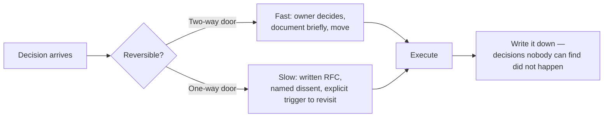
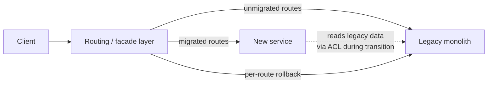
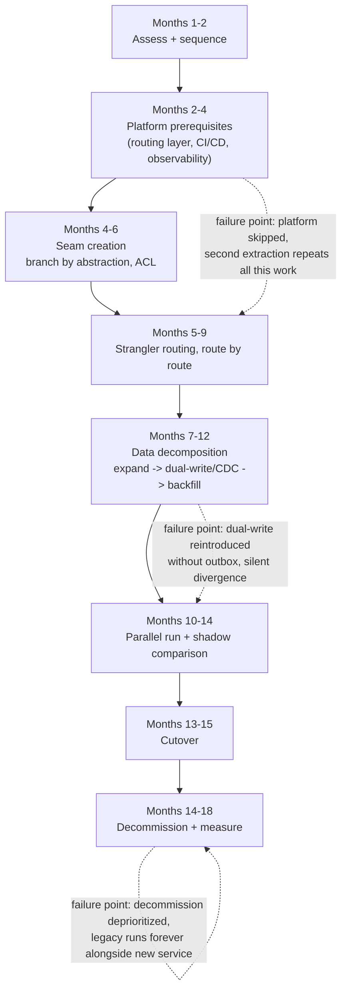

# Phase 13 - Architecture Leadership, Migration and Influence

> **Weeks:** 78–90 | **Prerequisites:** Phase 7, Phase 11, Phase 12 | **Time budget:** 180 hrs
> **You finish this phase able to:**
> - Write an Architecture Decision Record that survives a hostile review: honest alternatives, a stated trigger to revisit, and a decision someone can execute without you in the room
> - Run the migration playbook end to end — decide whether to migrate, sequence by risk-adjusted value, decompose data with expand-contract, and prove success with lead time and incident rate, not service count
> - Tell a two-way-door decision from a one-way-door one, and size the review process to match, instead of giving every decision the same ceremony
> - Read an org chart and a service dependency graph together and predict where Conway's Law will bite before it does
> - Build a case for a multi-quarter technical investment that a skeptical VP funds, using a written memo and pre-wired agreement, not a slide deck sprung in the room
> - Recognize your own strategy failing — a big-bang rewrite, an unused paved road, a rebuilt Zuul-era gateway called modernization — and stop it before it burns two years

## Why this phase exists

Everything before this phase makes you a very strong senior engineer. Staff and Principal are not "more technical depth" — they are scope, judgement under ambiguity, and the ability to move an organization. This phase is the difference between knowing the patterns and being trusted to choose.

Every prior phase assumed the hard part was technical: pick the right consistency model, size the right pool, wire the right canary. Those decisions still matter at this level, but they stop being the bottleneck. The bottleneck becomes: who decides, how fast, with how much certainty, and how do you get twelve people who report to three different VPs to execute a plan none of them wrote. [Phase 7](phase-07-security-and-compliance.md) taught you to negotiate trust boundaries with compliance stakeholders; [Phase 11](phase-11-testing-strategy.md) taught you to build confidence an organization can rely on without re-verifying it; [Phase 12](phase-12-performance-scale-and-cost.md) taught you to attach a dollar figure to a technical choice. This phase is where those three converge into a single skill: making a decision other people can execute for two years without you in the room, and being trusted with decisions big enough that being wrong is expensive.

The specific, concrete proof this phase produces — the thing a hiring committee or a promotion panel actually reads — is a migration programme document for a real legacy system: not a diagram, a document that survives a skeptical staff engineer's questions about sequencing, data safety, and what happens when it goes wrong in month seven.

## Mental model

**At this level your output is not code; it is decisions that other people can execute for two years without you in the room. Writing is the tool. Sequencing is the skill. Reversibility is the lens.**

Three consequences follow directly. First, if your output is decisions, then a decision nobody can find, read, or act on later did not happen — this is why ADRs, RFCs, and design docs are not paperwork, they are the actual work product, in the same way a shipped service was the actual work product at Senior level. Second, if sequencing is the skill, the question is never "is this the right architecture" in isolation — it's "what do we build first so that the second and tenth thing are cheaper, not harder," which is the same discipline the migration playbook below turns into an executable sequence. Third, if reversibility is the lens, every decision gets exactly as much process as its cost of being wrong justifies — a two-way door deserves a Slack message and an owner; a one-way door deserves a written RFC, a named dissent, and a rollback plan, and confusing the two produces either paralysis (six-week review for a config default) or disaster (no review for a schema drop).



## Core concepts

### Senior, Staff, Principal: what actually changes

The shift is not "more of the same skills." Four axes change shape, not just size:

| Axis | Senior | Staff | Principal |
|---|---|---|---|
| **Scope** | One team's system | Multiple teams, one domain | Whole org, sometimes multiple orgs |
| **Problem definition** | Given a problem, solve it well | Negotiate what the problem actually is | Discover problems nobody has named yet |
| **Influence** | Persuasion — win the argument in the room | Alignment — get five teams pulling the same direction without a shared manager | Strategy — set the direction teams align *to* |
| **What "the best" means** | Best implementer on the team | The person who makes their own implementation unnecessary, because the design and the writing let anyone implement it correctly | The person whose judgement the org borrows on decisions they were never in the room for |

Will Larson's Staff archetypes are worth naming explicitly because interviewers use this vocabulary and because they describe genuinely different day jobs, not a ladder within a ladder: the **Tech Lead** drives a team's technical execution day to day; the **Architect** owns a domain's technical direction and consistency across teams that don't share a manager; the **Solver** goes deep on the org's hardest, highest-ambiguity problem, often alone, for a quarter at a time; the **Right Hand** extends an executive's judgement and attention across problems the executive cannot personally cover. Most Staff engineers are some blend, and naming which one you're being asked to be — or which one a role actually needs — prevents the common failure of a Solver being hired into a job that needed a Tech Lead, or vice versa.

### Decision quality: two-way doors and one-way doors

**Plain English:** Some decisions are cheap to undo if you're wrong. Others are not. Spend your caution budget on the second kind, not the first.

**Analogy:** Renting an apartment versus buying a house. Signing a one-year lease you don't love is annoying but recoverable — you eat the deposit, you move in eleven months. Buying a house in a neighborhood you later hate costs a realtor's commission, a mortgage payoff, and months of your life to undo. Nobody should spend a house-buying amount of diligence on a lease, and nobody should sign a house's paperwork with a lease's amount of thought. Where the analogy breaks down: software decisions are rarely as cleanly binary as "lease" or "buy" — many decisions look reversible until data has accumulated on top of them, which is exactly the trap named below.

**In the real world:** Amazon's "one-way door / two-way door" framing (publicly attributed to Jeff Bezos's shareholder letters) is widely cited precisely because it gives a team a shared vocabulary to short-circuit a meeting that's spending an hour on a decision that costs nothing to reverse.

**Mechanics:** A two-way door decision — a config default, a naming convention, an internal library choice with a clean migration path — should be made fast, by the person or team closest to it, documented briefly, and revisited only if it turns out to matter more than expected. A one-way door decision — a public API contract, a data model a hundred consumers will depend on, a foundational technology choice, anything in the migration playbook's data-decomposition sequence past the backfill step — deserves a written RFC, explicit alternatives with honest cons, a named dissenter if one exists, and a documented trigger for when to revisit it. The trap: a decision that looks two-way at the moment it's made (a schema choice, a synchronous versus event-driven interface) quietly becomes one-way once a hundred other systems have built assumptions on top of it — [Phase 10](phase-10-delivery-and-platform-engineering.md)'s expand-contract migration exists precisely because the "contract" step is the moment a decision that felt reversible during "expand" stops being reversible at all.

**What breaks:** an organization that treats every decision as one-way drowns in review meetings and ships nothing; an organization that treats every decision as two-way discovers, eighteen months later, that "we'll fix the schema later" produced four hundred callers coupled to a mistake nobody can now afford to fix. The Staff-level skill is triage, applied in the first five minutes of the conversation, before the debate about the decision's *content* even starts.

### Quality attributes as the real input to architecture

Most architecture requests arrive as vague nouns — "make it scalable," "make it secure," "make it fast" — that are not requirements, they're placeholders for a requirement nobody has elicited yet. The job is turning each one into a number with a stated cost.

| Quality attribute | The vague ask | The number it should become |
|---|---|---|
| Availability | "It needs to be reliable" | 99.9% monthly uptime = ~43 minutes of downtime budget/month |
| Latency | "It needs to be fast" | p99 < 300 ms for the checkout API, measured at the edge |
| Throughput | "It needs to scale" | Sustain 15,000 orders/second for a 4-hour peak window |
| Durability | "Don't lose data" | Zero data loss for committed orders; RPO of 5 minutes for analytics data is acceptable |
| Consistency | "Keep things in sync" | Inventory count staleness bounded to 2 seconds; payment status must be strongly consistent |
| Security/compliance | "It needs to be secure" | PCI DSS scope boundary defined; cardholder data never touches this service |
| Cost | "Keep it cheap" | Cost per order must not exceed $0.004 at 3x current volume |
| Time-to-market | "We need this fast" | First version live for 5% of traffic within 6 weeks |
| Operability | "It needs to be maintainable" | Any on-call engineer can diagnose a P1 from dashboards alone within 15 minutes |

Every row has a cost, and the trade-off table is the actual deliverable of an elicitation conversation: tightening availability from 99.9% to 99.99% moves the downtime budget from 43 minutes/month to about 4, and typically means multi-AZ becomes multi-region, active-active replication, and an on-call rotation staffed for a much lower tolerance — a real, recurring cost, not a free upgrade. A **lightweight ATAM-style scenario analysis** (Architecture Tradeoff Analysis Method, abbreviated for an afternoon rather than the multi-day workshop the full method describes) runs this as a structured exercise: gather 5–10 concrete scenarios ("checkout traffic triples during a flash sale," "the payments provider is down for 20 minutes," "a new regulator requires data residency in the EU"), have stakeholders score each against the quality-attribute table, and surface the two or three scenarios where attributes actively conflict — availability versus cost, consistency versus latency — before those conflicts get discovered in production instead of in a room.

### Architecture Decision Records

An ADR is a short, durable, versioned record of one significant decision — not a design doc, not a wiki page that drifts out of sync with reality. The MADR (Markdown Architecture Decision Records) template is the de facto standard shape:

```markdown
# ADR-0042: Use transactional outbox instead of dual-write for order events

## Status
Accepted (2026-03-14)

## Context
`order` currently dual-writes to PostgreSQL and Kafka with no atomicity guarantee.
A finance reconciliation found 64 orders with no corresponding OrderCreated event
over a 6-month window. We need reliable event publication without adopting
distributed transactions (2PC), which the team has ruled out for latency and
coordinator-availability reasons (see ADR-0031).

## Options considered
1. Transactional outbox + polling relay — simple, adds ~1s publish latency, extra table
2. Transactional outbox + Debezium CDC — sub-second latency, adds Kafka Connect
   operational surface (new component to run, patch, monitor)
3. Do nothing, add reconciliation jobs only — cheapest, treats the symptom not the cause

## Decision
Transactional outbox with a Debezium CDC relay (option 2). Sub-second latency is
required for downstream inventory reservation; the team already runs Kafka Connect
for two other pipelines, so the operational surface is marginal, not new.

## Consequences
Positive: atomic event publication, no more silent event loss.
Negative: outbox table requires a retention/cleanup job; Debezium connector is a new
on-call surface for the data platform team, not the order team — ownership must be
agreed before rollout.

## Revisit trigger
If Kafka Connect operational load becomes a recurring on-call burden, or if event
volume exceeds 50k/sec and polling-relay-style batching becomes attractive again for
cost reasons, revisit option 1.
```

What makes an ADR good is almost entirely about honesty under pressure to look decisive: the options section names alternatives the team seriously considered, including the one that lost, with real cons — an ADR whose "options considered" section is one option dressed up as three is not documenting a decision, it's laundering one. The consequences section states the negative consequences as plainly as the positive ones. The revisit trigger is concrete enough that someone six months from now, with no memory of the meeting, can tell whether it fired. ADRs live in the repository they affect (`/docs/adr/`), numbered sequentially, immutable once accepted — a changed mind produces a new ADR that supersedes the old one, not an edit that erases the historical record of what the team believed at the time. Cross-reference: [reference/adr/ADR-CATALOG.md](../reference/adr/ADR-CATALOG.md) carries the template and twenty worked examples across the roadmap's domains.

### Design reviews and RFC culture

**The Amazon six-pager.** Amazon's internal convention replaces the slide deck with a narratively written, six-page document, read silently by every attendee for the first 15–20 minutes of the meeting before any discussion starts. The mechanism forces two disciplines a slide deck lets you dodge: full sentences expose gaps in reasoning that bullet points hide, and everyone enters the discussion having actually engaged with the content instead of skimming slides while the presenter talks. The meeting itself becomes a discussion of the document's weakest points, not a presentation of its strongest ones.

**What a review should produce.** A design review that ends in "great discussion, let's sync offline" failed — the review's entire purpose is to produce a decision, or a named, owned list of exactly what's blocking one. Structurally: a clear ask stated up front (approve, provide input, or just inform), a pre-read circulated with enough lead time to actually be read, an explicit list of who must attend (the people with authority to unblock or veto, not everyone tangentially interested), a written record of dissent when consensus doesn't form, and a decision owner who is accountable for actually deciding when the room disagrees.

**Disagree in writing, then commit.** The healthiest pattern is committing a dissenting opinion to the document itself — "I disagree with using a shared schema here because X; overruled, proceeding, noting the risk" — rather than relitigating in hallway conversations after the meeting ends. This preserves the losing argument for the day it turns out to matter, without blocking the decision from being made.

**The gatekeeping failure mode.** A review board that exists to catch genuine risk degrades, almost universally, into a board that says no by default because "no" carries no accountability for what didn't ship, while "yes" carries visible blame if it goes wrong. The fix is naming this incentive explicitly and measuring the board on decisions made per week and time-to-decision, not just on defects caught — a review process with no throughput target always drifts toward risk-aversion theater. This anti-pattern gets a full treatment below.

### Evolutionary architecture and fitness functions

An architecture that isn't checked automatically rots the moment nobody is watching, because every individual change looks reasonable in isolation and the erosion is only visible in aggregate. A **fitness function** encodes an architectural rule as an automated, repeatable check — the same discipline [Phase 11](phase-11-testing-strategy.md) applied to correctness, applied here to structure:

- **Dependency rules** — ArchUnit tests asserting `order` never imports from `payment`'s internal package, or that domain code never depends on a web-framework annotation.
- **Latency budgets** — a CI check failing a build if a load test shows p99 regression past a stated threshold, closing the loop [Phase 12](phase-12-performance-scale-and-cost.md) built the measurement half of.
- **Contract test coverage** — a gate requiring every public API endpoint to have at least one consumer-driven contract test before merge, per [Phase 11](phase-11-testing-strategy.md)'s Pact discipline.
- **Cost per request** — a budget alert if a service's cost-per-request metric (from [Phase 12](phase-12-performance-scale-and-cost.md)'s unit-economics work) rises past a stated percentage without a corresponding traffic change.
- **Security policy** — an OPA/Conftest check blocking a Terraform plan that provisions a public S3 bucket or a security group open to `0.0.0.0/0`.

```java
// ArchUnit fitness function: domain layer must not depend on Spring web annotations.
// Demonstrates: encoding a layering rule as a test that fails CI, not a wiki page nobody reads.
// Deliberately omits: the full rule set a real suite would need (dozens of rules across
// dependency direction, package structure, and naming conventions).
@AnalyzeClasses(packages = "com.shopkart.order")
class ArchitectureFitnessTest {

    @ArchTest
    static final ArchRule domainMustNotDependOnWeb =
        noClasses().that().resideInAPackage("..domain..")
            .should().dependOnClassesThat()
            .resideInAnyPackage("org.springframework.web..", "jakarta.servlet..");

    @ArchTest
    static final ArchRule servicesMustNotReachIntoOtherServicesInternals =
        noClasses().that().resideInAPackage("com.shopkart.order..")
            .should().dependOnClassesThat()
            .resideInAPackage("com.shopkart.payment.internal..");
}
```

The point of a fitness function is that it runs on every pull request, the same way a unit test does — an architectural rule stated in a design doc and never re-checked is a rule that erodes silently, one "just this once" exception at a time, until the doc describes a system that no longer exists.

### Governance that works

**Guardrails over gates.** A gate blocks a change until a human approves it — slow, and it scales linearly with headcount reviewing it. A guardrail makes the unsafe path harder than the safe path and lets the safe path proceed with no human in the loop — the same shift [Phase 10](phase-10-delivery-and-platform-engineering.md) made from a manual canary judgment call to an automated abort. Governance at this level means converting as many gates into guardrails as the risk profile allows, and reserving genuine human gates for the small number of decisions where judgement is actually load-bearing.

**A tech radar** (adopt / trial / assess / hold, per [reference/tech-radar-2026.md](../reference/tech-radar-2026.md)'s own structure) gives an organization a shared, versioned, low-ceremony way to say "we're standardizing on this" and "we're deliberately not adopting that yet" without a mandate from a committee nobody trusts.

**Paved roads** are the golden-path infrastructure [Phase 10](phase-10-delivery-and-platform-engineering.md) built — the platform succeeds only when teams choose the paved road voluntarily because it's genuinely the fastest path, not because a mandate forces them onto it. War story 4 below is exactly the failure mode when a platform team gets this backwards.

**Deprecation with real deadlines.** A deprecation notice with no enforced date is a permanent commitment disguised as a temporary one — teams deprioritize migrating off something with no deadline, forever, because something else is always more urgent this sprint. A real deprecation programme states a hard date, provides a migration guide and, where possible, an automated migration tool, and enforces the date (a build failure, a removed credential, a firewall rule) rather than relying on goodwill.

**The discipline of actually deleting services.** A decommission checklist, executed and checked off, is what separates "we migrated" from "we now run both the old and new system forever": traffic to the old service confirmed at zero for a real observation window; data archived per retention policy, not silently dropped; service and data owners informed and signed off; DNS entries and load-balancer rules removed; infrastructure torn down and its cost reclaimed and reported. War story 3 below is what happens when this checklist is skipped.

**Build versus buy.** The honest total cost model is licence cost plus integration cost plus ongoing operational cost plus exit cost — teams routinely price only the first and skip the other three, then discover the real cost of a vendor migration when they try to leave. The strategic/commodity distinction is the actual decision rule: build what is your competitive differentiation (the thing customers pay you for), buy what is undifferentiated infrastructure everyone needs (an identity provider, a payment processor, an email-sending service) — building infrastructure that is not your business is a recurring, named failure mode below. Lock-in analysis done properly asks two separate questions: what does it actually cost to leave this vendor (data export format, contractual terms, engineering effort to replace), and how likely is it that you'll need to? A vendor with high exit cost and low exit likelihood (a managed database with a standard export format, serving a stable workload) is a reasonable bet; a vendor with high exit cost and rising exit likelihood (a proprietary platform your growth is starting to outgrow) is the one to renegotiate or replace before the exit cost gets worse.

### The migration playbook

This is the centrepiece of this phase, written as a sequence you can actually execute rather than a list of considerations to keep in mind.

**1. Decide whether to migrate at all.** Symptoms that justify a service extraction: a team blocked on another team's release cadence for unrelated features; a single component's scaling or compliance profile diverging sharply from the rest of the monolith (the case [Phase 1](phase-01-service-design-and-ddd.md) already made for non-functional isolation); a genuinely proven deployment-coupling or blast-radius problem measured, not felt. Symptoms that do not justify it: "microservices are what good companies do"; a reorg that needs new service boundaries to match new team boundaries when the *domain* boundaries haven't actually changed; slow deploys, which a fixed deployment pipeline (per [Phase 10](phase-10-delivery-and-platform-engineering.md)) usually solves more cheaply than a migration. Alternatives to weigh honestly before committing: a **modular monolith** with enforced module boundaries (Spring Modulith, ArchUnit rules) gets most of the coupling benefit without the distributed-systems tax; **vertical slices** within the existing deployable isolate a feature's code without isolating its process; fixing the deployment pipeline first often removes the actual pain that was mistakenly attributed to the architecture.

**2. Assess.** Build a dependency and coupling analysis from real data — which modules change together in the same commit, which database tables multiple modules touch, which calls cross a module boundary and how often. Map data ownership: for every table, name the one team that should own writes to it, and list every other consumer that currently writes to it directly (each one is a coupling to unwind). Map team topology against the domain: does a team roughly aligned to a candidate service boundary already exist, or would extraction require an org change first? Build a risk register naming the specific ways this migration fails — a hot table that can't tolerate a lock, a compliance boundary that changes ownership, a peak-season freeze window that blocks the six-month plan.

**3. Sequence.** Pick the first service by risk-adjusted value: low coupling to the rest of the monolith (fewer other things break), high pain (the team extracting it gets real relief), and a clear owning team already in place. Resist the temptation to start with the highest-value, highest-coupling service first — it teaches the least about your own migration mechanics while carrying the most risk. Build the platform capabilities the *whole programme* will need — a routing layer, a CI/CD path for the new service, an observability baseline, a data-migration toolkit — before the second extraction, not after the tenth, because retrofitting shared infrastructure onto nine already-extracted services costs far more than building it once up front.

**4. Seam creation.** **Branch by abstraction** introduces an interface in front of the code being extracted, lets both the old implementation and the new service sit behind it, and switches the implementation without a big-bang cutover. An **anticorruption layer (ACL)** — [Phase 1](phase-01-service-design-and-ddd.md)'s context-mapping pattern — translates between the legacy system's model and the new service's model at the boundary, so the new service's domain model doesn't inherit the legacy system's accumulated inconsistencies. A **facade/routing layer** sits in front of both old and new implementations and decides, per request, which one handles it — the mechanism the strangler fig routing below depends on.

**5. Strangler Fig execution.** Route new functionality to the new service from day one; migrate existing functionality route by route behind the facade, verifying each cutover in isolation before moving to the next, with an instant rollback available at the routing layer for every single route independently — one route's regression should never force a rollback of routes that are already stable.



**6. Data decomposition.** The ordered sequence, none of which can be skipped: isolate data access behind an API (nobody outside the owning module queries the table directly anymore) → split the schema (the new service gets its own tables, even if colocated in the same database instance initially) → dual-read/shadow-compare (the new schema is populated and its reads are compared against the legacy reads, with divergences logged, not yet served) → move writes (the new service becomes the write path, initially dual-writing or replicating back to legacy for safety) → backfill and reconcile (historical data is migrated and a reconciliation job proves the two sources agree) → cut reads over (traffic actually starts being served from the new schema) → drop old tables (only after a real observation window with zero legacy reads). **Dual writes versus CDC**: an application-level dual write is simpler to stand up but reintroduces exactly the dual-write reliability problem [Phase 4](phase-04-data-and-consistency.md) already solved with the transactional outbox — the honest fix during a migration is the same one, an outbox-backed relay or CDC tailing the legacy database's transaction log, not a bespoke two-write code path hoping both succeed. Reconciliation needs a scheduled job comparing both sources on a real cadence, with divergences treated as incidents during the parallel-run window, not filed away for later. How long the parallel run lasts is a judgement call sized to the data's blast radius if wrong — a low-stakes read-heavy dataset might run two weeks; a financial ledger might run a full quarter, through at least one full billing cycle.

**7. Parallel run and shadow comparison.** Compare the outputs that matter to the business — order totals, inventory counts, not incidental fields like a timestamp with different precision. Expect and explicitly allow for differences that are not bugs: a timing difference from eventual consistency, a rounding difference from a currency library change, a legitimate behavior fix the new service intentionally makes. Exit criteria for ending the parallel run: divergence rate below a stated threshold for a stated number of consecutive days, with every remaining divergence explained and either accepted or fixed — never "it's been quiet for a week" as an unstated, unmeasured proxy.

**8. Cutover and rollback plan.** The routing-layer cutover itself should be reversible in seconds — flip the percentage back to the legacy path. The part that isn't reversible is data: once writes have moved and the old write path has been off long enough that the legacy schema is stale, "rolling back" would mean losing every write the new service accepted since cutover — this is the honest treatment [Phase 10](phase-10-delivery-and-platform-engineering.md) already gave the expand-contract "contract" step, and it applies with higher stakes at migration-programme scale because the data in question may span months, not one release's worth of writes.

**9. Decommission — the step everyone skips.** The checklist from Governance above, executed for real: traffic to zero, data archived, owners informed, DNS and routing rules removed, cost reclaimed and reported back to whoever funded the migration. Measure success in the terms that justified the investment: lead time for a change in the extracted domain, incident rate for the extracted service versus its former life inside the monolith, cost per unit of business volume, and developer satisfaction from the team that now owns it — never "number of services created," a metric that rewards over-decomposition and measures nothing about whether anyone's life improved.

A realistic timeline for one meaningful extraction, not a whole programme: 12–18 months, with the failure points annotated where programmes actually stall.



### The reverse migration

Consolidating services back is not an admission of failure — it's the same engineering discipline applied in the other direction, and the industry correction covered in How big tech does it below (Amazon Prime Video, Segment) shows it happening at companies with no shortage of distributed-systems expertise. When to consider it: a set of services that always deploy together anyway (the deployment-coupling signal from [Phase 1](phase-01-service-design-and-ddd.md)), a domain where the network hops between services cost more than the isolation is worth, or a team small enough that the coordination overhead of N services exceeds the benefit of independent deployability. How to do it safely: the same strangler-fig discipline in reverse — merge one boundary at a time behind a routing layer, verify each merge in isolation, keep the ability to split back apart if the merge reveals a boundary that actually mattered. How to talk about it: frame it as evidence-based optimization for the system's *actual* current shape, with the same rigor and measurement (cost per request, deployment frequency, incident rate) that justified splitting in the first place — a team that can show "this consolidation cut cost 40% and complexity is down" is not admitting failure, it's doing the job.

### Organization design

**Conway's Law and the inverse manoeuvre.** [Phase 1](phase-01-service-design-and-ddd.md) already established that a system's structure mirrors its communication structure. The **inverse Conway manoeuvre** uses this deliberately: restructure teams *first*, toward the org shape you want your architecture to eventually have, and let the natural pull of Conway's Law reshape the software to match — often cheaper than trying to force an architecture to hold against organizational structure actively pulling in a different direction.

**Team Topologies interaction modes.** Team Topologies names three ways teams interact, and naming which mode is active prevents a huge amount of ambiguity-driven friction: **collaboration** (two teams work closely together for a bounded period to discover something neither knows alone — expensive, temporary, appropriate for genuine discovery), **X-as-a-Service** (one team consumes another's output through a well-defined interface with minimal ongoing communication — the steady state most platform relationships should converge to), and **facilitating** (one team temporarily helps another adopt a capability, then leaves — an enabling team's whole job). A platform team stuck in permanent collaboration mode with every consuming team has not built a platform, it's built a bottleneck with extra steps.

**Cognitive load as the real constraint.** How many services a team can own is bounded by cognitive load, not by an org chart's headcount — a team of six can competently own two services with deep, well-understood domains and struggle to own eight shallow, poorly-documented ones. Team Topologies names three kinds of load worth distinguishing: **intrinsic** (the inherent complexity of the domain itself), **extraneous** (accidental complexity from bad tooling, unclear ownership, or a system fighting you), and **germane** (the load of learning and adapting the architecture itself). A platform team's job is largely reducing extraneous load for everyone else — the paved road exists to remove exactly this category.

**Ownership and the orphaned-service problem.** Every service needs exactly one team that owns it, named, discoverable, and on the hook for its on-call — a service with no clear owner degrades slowly and invisibly until an incident forces someone to claim it under duress. War story 3 below is this failure mode played out to its logical, painful end.

**API governance across teams and the platform-versus-product tension.** A platform team optimizes for consistency and long-term maintainability across the whole estate; a product team optimizes for shipping its own roadmap this quarter — the tension between them is structural, not a personality conflict, and governance that pretends otherwise (treating every pushback from a product team as non-compliance) burns trust fast. The healthy resolution treats the platform as a product with real customers (the section on Amazon's API mandate below extends this) rather than a mandate imposed from above.

**On-call and incident review shape architecture quality.** A team that carries its own pager for a service it designed feels every bad architectural decision directly and personally, at 3 a.m. — the single strongest, cheapest architecture-quality mechanism available, and the reason "you build it, you run it" (Amazon's internal framing, widely adopted since) outperforms a separate ops team absorbing the consequences of someone else's design choices.

### Technical debt as a managed portfolio

Not all debt is a mistake. **Deliberate/prudent** debt is a conscious trade-off to ship faster with a known, accepted cost (shipping without the caching layer because launch date matters more than the extra latency, with a ticket filed to add it later). **Deliberate/reckless** debt knows better and does it anyway under pressure, without naming the cost. **Inadvertent/prudent** debt is the normal outcome of learning — the team's understanding of the domain improved after they built it, so the original design now looks suboptimal in hindsight, which is not a failure, it's how design works. **Inadvertent/reckless** debt is simply not knowing better at the time. The classification matters because the fix differs: deliberate debt needs its ticket honored on the timeline it was promised, not indefinitely deferred; inadvertent debt needs the team's understanding fed back into a refactor, sized appropriately, not treated as a mistake to punish.

Make the interest visible in metrics a product leader already reads: incident rate attributable to a specific debt item, lead time for changes in the affected area, on-call load. An explicit **debt budget** — a stated percentage of engineering capacity (commonly 10–20%, named as a real, protected allocation rather than "whatever's left over") — keeps paydown from being perpetually deprioritized against the next feature. Selling paydown to product leadership works only in their language: not "the code is messy," but "this area's incident rate is 3x the rest of the platform and consumed 200 engineering hours last quarter in firefighting alone — fixing it costs 4 weeks and pays back in under two quarters."

### Influence without authority

**Stakeholder mapping.** Before writing the RFC, know who has to agree, who merely needs to be informed, who can veto, and who has been burned by a similar effort before and will bring that history into the room.

**Pre-wiring agreement.** The meeting where a decision gets made in front of a group is the worst place to discover a stakeholder's objection for the first time — a Staff engineer walks contentious points through the people who'll raise them individually, beforehand, so the group meeting confirms a decision that's already largely settled rather than litigating it live. This is not manipulation; it's respecting that a group setting makes it harder for people to change their mind out loud without losing face.

**Disagree and commit.** Once a decision is made through a fair process, executing it fully — even having argued against it — is what earns the standing to be heard next time; relitigating a lost argument in every subsequent meeting spends trust for no benefit.

**Escalation done professionally.** Escalating is not going over someone's head behind their back — it means telling the person directly that you intend to escalate, why, and giving them the chance to either change your mind or escalate alongside you.

**Saying no with data and an alternative.** "No" without a reason reads as obstruction; "no, because X, and here's what I'd do instead" reads as expertise. The alternative is what makes the no land as help rather than blockage.

**Building sponsorship for multi-quarter work.** No one funds a year-long migration off one pitch — it takes a sponsor with budget authority who understands the cost of *not* doing it, evidence (an incident, a competitor's outage, a cost trend) making the status quo's cost visible, and a plan sized in checkpoints a sponsor can fund incrementally rather than one irreversible year-long commitment.

### Mentoring and scaling yourself

Code review as teaching means leaving a comment that explains the principle, not just the fix — the next PR from the same engineer should need that comment less often. Design review as teaching applies the same idea one level up: a Staff engineer's design-review comments should visibly shape how the team writes RFCs six months later, not just fix this one document. Writing the document once instead of answering the same question thirty times is the actual leverage mechanism behind everything in this phase — an RFC, an FAQ, a recorded design-review session scales an answer to everyone who will ever ask, while a verbal answer scales to exactly one person, once. Growing successors — deliberately handing off a domain you understand deeply to someone who will understand it better than you did at their stage — is the concrete test of whether "making your own implementation unnecessary" from the Mental model section actually happened.

## Production patterns

### Strangler fig routing

**What:** a facade/routing layer in front of both a legacy system and its replacement, directing traffic route by route as each is verified.
**When to use:** any migration where a big-bang cutover's blast radius is unacceptable.
**When NOT to use:** a system small enough, or a team confident enough in a maintenance window, that a full cutover with a tested rollback is genuinely cheaper than building and maintaining a routing layer for months.
**Failure modes:** the routing layer itself becomes a new single point of failure if it isn't held to the same reliability bar as the systems it fronts; a route "temporarily" left unmigrated for years because the last 5% is always the hardest 5%.

### Anticorruption layer

**What:** a translation layer between a legacy system's model and a new service's model, so the new service's domain isn't polluted by the legacy system's historical compromises.
**When to use:** whenever a new service needs to read from or write to a legacy system whose model doesn't match the new bounded context's ubiquitous language.
**When NOT to use:** two systems that already share a clean, intentional model — an ACL there is pure translation overhead with no corruption to prevent.
**Failure modes:** the ACL itself accumulates special cases and becomes a second legacy system nobody wants to own; teams treat it as permanent infrastructure and never plan its removal once the legacy system is gone.

### Branch by abstraction

**What:** introduce an interface in front of code being replaced; implement the new version behind the same interface; switch callers via configuration once verified.
**When to use:** extracting a component from a monolith incrementally, without a long-lived feature branch that will merge-conflict itself into a rewrite.
**When NOT to use:** a component genuinely small enough that a short-lived branch and a coordinated cutover cost less than building the abstraction.
**Failure modes:** the abstraction leaks legacy implementation details the new implementation can't cleanly satisfy, forcing compromises in the new design to accommodate an interface shaped by the old one.

### Parallel run with diffing

**What:** run old and new implementations side by side against the same input, comparing outputs without serving the new one, per the shadow-comparison step in the migration playbook.
**When to use:** any migration step where correctness matters more than the time cost of running both paths.
**When NOT to use:** a component with no meaningful deterministic output to compare, or one already covered comprehensively by contract tests.
**Failure modes:** comparison noise from legitimate, expected differences (timing, floating-point rounding) drowns out real divergences; the diffing job itself becomes expensive enough that nobody looks at its output regularly.

### Expand-contract data migration

**What:** the ordered schema-change sequence — expand, backfill, dual-write/CDC, cutover reads, contract — from the migration playbook's data-decomposition step.
**When to use:** any schema change a running system cannot tolerate as a single atomic cutover.
**When NOT to use:** a change small enough, and a system tolerant enough of brief downtime, that a maintenance-window migration is genuinely simpler.
**Failure modes:** the contract step run before the observation window has actually proven the new shape correct, discovering the irreversibility [Phase 10](phase-10-delivery-and-platform-engineering.md) already named the hard way.

### Service decommission checklist

**What:** the explicit, checked sequence — traffic to zero, data archived, owners informed, DNS removed, cost reclaimed — that turns "migrated" into "actually finished."
**When to use:** every migration's final step, without exception.
**When NOT to use:** never optional; the only variable is how long the observation window before executing it needs to be.
**Failure modes:** war story 3 below — no checklist, no decommission, a service nobody remembers owning pages someone for years.

### Fitness functions in CI

**What:** automated checks (ArchUnit dependency rules, latency budgets, contract coverage, cost budgets, security policy) that fail a build when an architectural rule is violated.
**When to use:** any rule important enough that violating it should be as hard as failing a unit test.
**When NOT to use:** a rule that's still being discovered or debated — encoding it too early ossifies a decision the team hasn't actually settled on yet.
**Failure modes:** a fitness-function suite nobody updates as the architecture legitimately evolves becomes a source of false failures that get routinely suppressed, which quietly disables the whole suite's credibility.

### Architecture review cadence

**What:** a standing, scheduled review of significant decisions, sized to the org's decision volume — weekly for a fast-moving platform team, monthly for a stable domain.
**When to use:** whenever one-way-door decisions are frequent enough that ad hoc review doesn't scale.
**When NOT to use:** a team small enough, and decisions rare enough, that a standing meeting creates more overhead than the ad hoc alternative.
**Failure modes:** the gatekeeping-board anti-pattern below — a review cadence that exists but has drifted into rubber-stamping or reflexive blocking.

### Tech radar governance

**What:** a shared, versioned adopt/trial/assess/hold classification for technology choices, reviewed on a regular cadence.
**When to use:** an org large enough that technology choices made independently by different teams are starting to fragment operational knowledge.
**When NOT to use:** a single small team where informal alignment ("we all just know we use Postgres") is genuinely sufficient.
**Failure modes:** a radar published once and never updated becomes a historical artifact instead of a governance tool; a radar with no enforcement mechanism behind "hold" items is advisory only, which some teams will treat as optional.

### RFC process

**What:** a written proposal, circulated for review before a decision, following the design-review discipline above.
**When to use:** any one-way-door decision, and any two-way-door decision significant enough to want a written record.
**When NOT to use:** decisions genuinely reversible and low-stakes enough that the ceremony costs more than the decision itself is worth.
**Failure modes:** an RFC template so heavyweight that engineers route around it for anything short of a company-wide initiative, quietly defeating its own purpose.

## How big tech does it

**Amazon: the API mandate, working backwards, six-pagers, and single-threaded ownership.** Amazon's internal API mandate (publicly recounted in various forms, including by former Amazon engineers) required every team to expose functionality only through a service interface, with no back-door data access — a structural enforcement of the same encapsulation [Phase 1](phase-01-service-design-and-ddd.md) taught as a design principle, made non-negotiable at the platform level rather than left to convention. **Working backwards** starts a new initiative by writing the press release and FAQ for the *finished* product before writing a line of code or a design doc, forcing the team to articulate the customer value up front instead of discovering, late, that the thing they built solves a problem nobody asked to have solved. **Six-pagers** were introduced above; the discipline of narrative writing over slides is the same forcing function applied to internal decisions. **Single-threaded ownership** assigns one leader, undistracted by other responsibilities, full accountability for one initiative — the organizational answer to the orphaned-service problem, ensuring nothing significant lacks a name attached to its success or failure.

**Google: design docs, the readability programme, and the engineering ladder's emphasis on scope.** Google's internal design-doc culture — a lightweight, standardized template circulated for review before significant implementation work starts — is one of the most widely imitated internal practices in the industry, precisely because it catches expensive mistakes on paper instead of in code. The **readability programme** grants engineers language-specific certification to approve code in that language after a structured mentorship process, enforcing consistent style and idiom across an enormous codebase without a style guide alone being sufficient. Google's engineering ladder explicitly separates technical depth from scope of impact at senior levels — a Senior Staff Engineer is not simply "very good at coding," the level exists specifically to recognize organization-wide technical influence.

**Netflix: context not control, freedom and responsibility, and highly aligned loosely coupled teams.** Netflix's publicly described culture (via its widely circulated culture memo) argues for giving engineers rich context about the business goal and letting them make local decisions, rather than centrally controlling those decisions — the organizational analogue of guardrails over gates. **Freedom and responsibility** pairs genuine autonomy with genuine accountability for outcomes; one without the other collapses either into chaos or into command-and-control by another name. **Highly aligned, loosely coupled** describes teams that share a clear, well-communicated strategic direction (alignment) while making independent day-to-day decisions about how to execute it (looseness) — the organizational precondition for Conway's Law to produce a healthy architecture rather than an accidental one.

**Uber's DOMA as governance applied to an over-split estate.** [Phase 1](phase-01-service-design-and-ddd.md) already covered DOMA as Uber's technical correction — consolidating thousands of overly granular services into domain-aligned groups with gateway-layer APIs. The governance angle this phase adds: DOMA is not just a re-architecture, it's a governance structure — domain ownership boundaries, gateway APIs as the enforced integration contract, and a stated policy against services being created without a domain home — the structural mechanism that prevents the estate from re-fragmenting the same way once the initial consolidation is done.

**Shopify's decision to stay with a modular monolith, and how they argued it.** Shopify has publicly discussed keeping its core commerce platform as a modular monolith with enforced internal boundaries (their Packwerk tool, referenced in [Phase 1](phase-01-service-design-and-ddd.md)'s tooling list, exists specifically for this) rather than decomposing into microservices, arguing that a single deployable with enforced module boundaries captured most of microservices' coupling benefits without the distributed-systems operational tax, at their specific scale and team structure. The transferable lesson is the argument's shape, not the conclusion: they measured the actual coupling problem, considered the alternative honestly, and made a build-versus-buy-style total-cost comparison rather than defaulting to the industry trend.

**Monzo's decision records and platform investment.** Monzo has publicly discussed both its microservices-heavy architecture and its internal decision-record discipline for platform investment choices — the ADR angle specifically: a written, versioned record of *why* a platform capability was built, with the alternatives considered and the trigger to revisit, applied at the scale of "should we build this internal tool" rather than only at the scale of a single service's technical design.

**Stripe's writing culture.** Stripe has publicly emphasized a strong internal writing culture — extensive internal documentation, well-argued written proposals for significant decisions, and a hiring and promotion process that explicitly weighs writing ability — treating clear written communication as a core engineering skill on the same footing as coding ability, not a soft skill bolted on afterward.

**Spotify's model and the public correction that it was aspirational.** [Phase 1](phase-01-service-design-and-ddd.md) already covered the "squads and tribes" model and Spotify Engineering's own 2020 statement that "the Spotify model does not exist at Spotify anymore." The re-litigation lesson this phase adds: the model became one of the most widely copied organizational frameworks in the industry specifically *because* it was aspirational and well-marketed, not because it was a description of a stable, proven steady state — the durable failure is copying another company's org chart wholesale without the underlying alignment mechanisms (context, not control; highly aligned, loosely coupled) that made the original team's version work for them, then blaming the framework when the copy doesn't.

**What a Staff engineer at each of these is actually measured on.** Across all seven, the pattern is consistent: not lines of code, not services shipped, but the scope and durability of decisions — did the six-pager or design doc change what the org actually built; did the domain you own get measurably healthier (incident rate, lead time, cost) under your technical direction; did other teams adopt what you built voluntarily; did the org avoid a mistake because you caught it in review before it shipped. Every one of these is a decision-quality and influence metric, not an implementation-speed metric — the exact shift the Mental model section named at the start of this phase.

## Best-practice checklist

**1. Migration readiness (20 items)**

- [ ] The symptom driving this migration is measured (deployment coupling, incident correlation, scaling divergence), not felt
- [ ] Modular monolith and vertical-slice alternatives were considered and explicitly ruled out with a stated reason
- [ ] A dependency and coupling analysis exists, built from real commit and query data, not intuition
- [ ] Data ownership is mapped table by table, with every non-owning writer identified
- [ ] A risk register exists, naming specific failure scenarios, not a generic "risks: various" line
- [ ] The first service to extract was chosen by risk-adjusted value, not by whichever team asked loudest
- [ ] Platform prerequisites (routing layer, CI/CD path, observability baseline) are built before the second extraction, not after the tenth
- [ ] A named owning team exists for the extracted service before extraction starts, not after
- [ ] The routing/facade layer's own reliability bar matches or exceeds the systems it fronts
- [ ] Every data decomposition step (isolate, split, dual-read, move writes, backfill, cutover, drop) is planned explicitly, none skipped
- [ ] Dual-write mechanics use an outbox or CDC relay, not a bespoke two-write code path
- [ ] A reconciliation job runs on a real cadence during the parallel run, with divergences treated as incidents
- [ ] Exit criteria for the parallel run are numeric (divergence rate, consecutive clean days), not a feeling
- [ ] The rollback plan states explicitly which stages are reversible and which are not
- [ ] A realistic timeline includes annotated failure points, not just happy-path milestones
- [ ] Success metrics are named up front — lead time, incident rate, cost, developer satisfaction — not "number of services"
- [ ] A decommission checklist exists and has an owner before cutover, not invented after
- [ ] Org and team-topology changes needed to support the new boundary are planned alongside the technical work, not left implicit
- [ ] A sponsor with budget authority is identified and has funded the programme in checkpoints, not one lump commitment
- [ ] The team has explicitly discussed what "stop the migration" looks like and what would trigger it

**2. Design review quality bar (15 items)**

- [ ] A pre-read exists and was circulated with enough lead time to actually be read
- [ ] The document states its ask up front — approve, advise, or inform
- [ ] Quality attributes are elicited as numbers, not adjectives
- [ ] At least two real alternatives are presented with honest cons, not one dressed as three
- [ ] A cost estimate (infrastructure, engineering time) is included, per [Phase 12](phase-12-performance-scale-and-cost.md)'s cost-in-design-review discipline
- [ ] A threat model or explicit security consideration is included, per [Phase 7](phase-07-security-and-compliance.md)'s design-review requirement
- [ ] Failure modes and rollback are addressed, not deferred to "we'll figure it out"
- [ ] Attendees are limited to people with authority to unblock or veto, plus genuinely needed expertise
- [ ] Dissent, if any, is recorded in writing, not only spoken and forgotten
- [ ] The review produces a decision or a named, owned blocker list — never "great discussion, let's sync"
- [ ] A revisit trigger or follow-up date is stated for any deferred concern
- [ ] The document is versioned and stored where it will still be findable in two years
- [ ] Reviewers gave feedback on the design's substance, not on formatting or unrelated style preferences
- [ ] The reviewer-to-decision time is tracked, so review latency itself is visible and manageable
- [ ] A decision, once made, is not silently relitigated in a different meeting a week later

**3. ADR quality bar (10 items)**

- [ ] Context section states the actual problem and constraints, not just the chosen solution restated
- [ ] At least two real options are listed, including the one not chosen
- [ ] Each option's cons are stated honestly, including for the option that won
- [ ] The decision is a single, unambiguous sentence, not a paragraph of hedging
- [ ] Consequences include negative ones, not only benefits
- [ ] A revisit trigger is concrete enough that someone can objectively tell if it fired
- [ ] The ADR is numbered, dated, and immutable once accepted — a changed mind creates a new ADR, not an edit
- [ ] The ADR lives in the repository or catalog it affects, not a wiki page disconnected from the code
- [ ] The ADR is short enough to read in under five minutes
- [ ] The ADR references the RFC or design doc it originated from, if one exists, rather than duplicating its full argument

## Anti-patterns and war stories

### Anti-pattern: The big-bang rewrite

**What it looks like:** "We're rewriting the whole platform from scratch, six months, then we cut over." Eighteen months later, nothing has shipped, the old system still runs unmaintained because everyone moved to the rewrite, and the rewrite still can't handle production's edge cases the old system quietly grew to handle over years.

**Why it is wrong:** a big-bang rewrite bets the entire migration on getting the new system's understanding of production's accumulated edge cases right on the first attempt, with no incremental verification along the way — exactly the risk the strangler fig pattern exists to eliminate by verifying one route at a time.

**Fix:** the migration playbook above, executed incrementally, with each step's risk bounded and reversible until data decomposition makes it not.

### Anti-pattern: The architecture review board that only says no

**What it looks like:** a standing review board whose decision log shows a long list of rejected proposals and few approved ones, with rejections citing risk in the abstract rather than a specific, named concern.

**Why it is wrong:** the incentive structure rewards blocking — a rejected proposal generates no visible blame for the reviewer if it would have gone well, while an approved proposal that goes badly does. Left unmanaged, this always drifts toward reflexive no.

**Fix:** measure the board on decisions made per week and time-to-decision alongside defects caught; require every rejection to name a specific, falsifiable concern and a path to address it, not a vague risk assessment.

### Anti-pattern: Resume-driven architecture

**What it looks like:** adopting a service mesh, an event-sourcing model, or a new database because it is interesting to have used, for a problem that doesn't actually need it.

**Why it is wrong:** the decision optimizes for the individual engineer's next job search, not the organization's actual constraints — and it is nearly always defended with technical language that obscures the real motivation, making it hard to challenge directly.

**Fix:** every significant technology choice states, in writing, the specific problem it solves that the current stack cannot, per the build-versus-buy and quality-attribute elicitation discipline above.

### Anti-pattern: Microservices for a five-person team

**What it looks like:** a five-person team running fifteen services, each with its own repository, pipeline, and on-call rotation.

**Why it is wrong:** the coordination overhead of fifteen independently deployed things exceeds any five-person team's cognitive capacity, per the Team Topologies load model above — every feature now requires touching multiple repositories and reasoning about network calls that would have been function calls in a monolith.

**Fix:** consolidate toward a modular monolith sized to the team's actual headcount; split further only when a specific, measured symptom justifies it.

### Anti-pattern: Migrating without decommissioning

**What it looks like:** the new service is live and taking traffic, and the old code path is still running, still deployed, still occasionally receiving a stray write nobody noticed.

**Why it is wrong:** the organization now pays the operational cost of both systems indefinitely, and the "temporary" old path becomes a permanent, undocumented source of divergence and confusion.

**Fix:** the decommission checklist, with a named owner and a deadline, treated as part of the migration's definition of done, not an optional follow-up.

### Anti-pattern: "We will fix it in v2"

**What it looks like:** a known gap — no idempotency, no reconciliation, no rollback plan — shipped with a verbal promise to address it in the next version, and no ticket, no deadline, no owner.

**Why it is wrong:** v2 never gets prioritized over new feature work with a visible deadline; "fix it in v2" is functionally a decision to never fix it, made without anyone deciding that on purpose.

**Fix:** either fix it before shipping, or write it down as deliberate/prudent debt with a ticket, an owner, and a deadline per the technical-debt-portfolio discipline above.

### Anti-pattern: The architect who does not write code and loses credibility

**What it looks like:** an architect whose recommendations come from theory and diagrams, never validated against the actual codebase or a real production incident, whose team quietly stops asking for input because it doesn't reflect how the system actually behaves.

**Why it is wrong:** architecture divorced from implementation reality produces designs that look correct on a whiteboard and fail on contact with a real edge case — and once a team notices this gap once, they stop trusting the next recommendation too.

**Fix:** stay hands-on enough to be credible — read the code you're making decisions about, carry on-call occasionally, prototype the risky part of a design yourself before asking a team to build the whole thing.

### Anti-pattern: Strategy documents nobody reads

**What it looks like:** a polished, ambitious strategy document, presented once, filed away, never referenced again in a single subsequent planning conversation.

**Why it is wrong:** a strategy nobody uses to make a real trade-off decision is not a strategy — it's a marketing artifact, and the effort spent writing it produced no actual behavior change.

**Fix:** a strategy document earns its keep only if it's short enough to reference in a five-minute planning conversation and specific enough to actually say no to something, per Rumelt's distinction between good strategy (a diagnosis, a guiding policy, coherent action) and bad strategy (a restated goal with no real trade-off named).

### Anti-pattern: Splitting services along technical layers instead of business capabilities

**What it looks like:** a `presentation-service`, a `business-logic-service`, and a `data-access-service`, each owned by a different team, none independently deployable without coordinating with the other two for almost any real feature.

**Why it is wrong:** nearly every real business change touches all three layers simultaneously, so this decomposition maximizes cross-team coordination while providing none of microservices' actual benefit — independent deployability along a real business boundary.

**Fix:** decompose by business capability (order, payment, inventory), the discipline [Phase 1](phase-01-service-design-and-ddd.md) already established, never by architectural layer.

### Anti-pattern: Adopting a service mesh to fix a culture problem

**What it looks like:** teams that don't trust each other's services' reliability adopt a service mesh, expecting mTLS, retries, and observability to fix a trust problem that is actually about unclear ownership, undocumented SLAs, and no shared incident-review process.

**Why it is wrong:** a service mesh genuinely solves specific technical problems (traffic encryption, consistent retry policy, uniform telemetry) — it does not create the organizational agreements (who owns what, what SLA is promised, how incidents get reviewed) that a culture problem is actually missing.

**Fix:** name the organizational gap directly and fix it with an ownership model, an SLA registry, and an incident-review practice; adopt a mesh afterward for the technical problems it's actually good at.

### War story 1: An 18-month rewrite cancelled after shipping nothing

A retail platform's engineering leadership approved a from-scratch rewrite of the order-management core, citing accumulated technical debt and an aging framework. The plan: freeze major feature work on the old system, build the new one in parallel, cut over in eight months.

**What happened:** eight months became fourteen as the rewrite team discovered, one by one, the edge cases the old system had accumulated answers to over six years — split shipments, partial refunds, a dozen payment-provider-specific quirks — each one requiring design decisions nobody had scoped in the original plan. At month sixteen, with the business now two Black Fridays behind on features frozen since month one, leadership cancelled the rewrite and asked the original team to resume maintaining the old system, now sixteen months more brittle from a deprioritized maintenance window.

**What the team should have done in month two:** apply the strangler fig instead of a parallel rewrite — route the least-coupled, lowest-risk order type to the new system first, prove the mechanics on a bounded piece of real traffic, and let the "how many edge cases does this domain actually have" question surface incrementally, each one solved and shipped rather than discovered all at once at the worst possible moment. The rewrite's fundamental error was treating the migration as a single one-way-door decision made in month one, when nearly every decision size choice inside it should have been a fast, incremental two-way door.

### War story 2: A dual-write migration whose divergence was discovered by a finance audit a year later — at programme scale

[Phase 4](phase-04-data-and-consistency.md)'s War story 1 already covered this exact failure mode at a single service's scope: an unprotected dual-write between a database and Kafka silently dropping events, caught by a finance reconciliation months later. This war story is the same root cause at the scale a migration programme multiplies it to. A logistics company's monolith-to-services migration ran an application-level dual write from the legacy order table to the new `order` service's database for eleven months, covering the full parallel-run window for six different order types migrating on staggered schedules — no outbox, no CDC, a bespoke "write to both, log if the second write fails" code path the migration team believed was adequate because each individual dual-write bug, alone, looked minor.

**Detection:** an annual financial reconciliation, run at year-end rather than the finance team's usual monthly cadence because of the migration's ongoing changes, found 1,900 orders across the eleven-month window where the legacy and new-service records disagreed on final order total — not missing records, as in the single-service version of this story, but silently *diverged* ones, because both writes had "succeeded" while writing slightly different computed totals due to a rounding-order bug introduced only in the new service's implementation.

**Diagnosis:** because six order types were mid-migration simultaneously, on different schedules, no single reconciliation job had ever compared all six consistently — each order type's shadow-comparison job had been built separately, by different sub-teams, with different tolerance thresholds, and the rounding bug fell inside one sub-team's tolerance band while actually representing a real, compounding financial discrepancy across volume.

**Fix:** every dual-write path was replaced with a Debezium CDC relay off a single, shared outbox table used by all six order types; the six separate reconciliation jobs were consolidated into one shared reconciliation framework with one reviewed tolerance policy; the eleven months of divergent totals were manually reconciled with finance over a further two months.

**The programme-scale lesson, distinct from the single-service version:** a migration programme running several parallel data-decomposition efforts at once needs *one* shared reconciliation standard and *one* shared dual-write mechanism across all of them, decided once at the platform-prerequisites stage of the migration playbook (step 3) — letting each sub-team improvise its own dual-write and its own tolerance threshold turns a solvable per-service risk into an unauditable, cross-cutting one that nobody owns until an external audit finds it.

### War story 3: A service with no owner that paged a random on-call for two years

An internal notification-formatting service was built by a team that was later dissolved in a reorg; its remaining functionality was assumed, informally, to have been absorbed by a neighboring team, but no ownership transfer was ever formally recorded, no runbook was updated, and the on-call rotation that inherited its pager was never told what the service actually did.

**What happened:** for roughly two years, the service paged whichever team's on-call engineer happened to be holding a shared, catch-all pager rotation whenever it degraded — typically once every few weeks, from an intermittent memory leak nobody had root-caused because no one felt authorized to spend real time on a service they didn't believe they owned. Each incident was handled as a one-off restart; the underlying leak was never fixed because fixing it would have required understanding code nobody currently on the team had ever seen.

**Detection:** a new engineering director, reviewing on-call load data during a reliability push, noticed the same service name recurring across multiple unrelated teams' incident logs and asked, in a planning meeting, "who owns this?" — and nobody in the room could answer.

**Fix:** an ownership audit was run across the entire service catalog, matching every deployed service to a named team in the service catalog with an enforced field, no exceptions; five other genuinely orphaned services were found in the same audit. The notification service was assigned a new owning team, who fixed the memory leak in a single sprint once someone was actually accountable for it.

**Lesson:** an org chart change is not complete until every service that team owned has an explicit, recorded new owner — "someone will probably pick it up" is not an ownership transfer, and the actual cost of an orphaned service is paid, invisibly, by every on-call engineer who inherits its pages without ever being told why.

### War story 4: A platform team that built the perfect paved road nobody adopted because it was mandatory instead of good

A platform team spent two quarters building a comprehensive, well-engineered service-scaffolding tool — CI pipeline, observability, security baseline, all pre-wired — genuinely superior to what most teams were hand-rolling themselves. Leadership, impressed by the demo, mandated its use for all new services starting the following quarter.

**What happened:** adoption stalled at roughly a third of new services, with most teams quietly working around the mandate — building a new service just outside the tool's supported patterns, or delaying a service's creation until after an informal grace period leadership stopped enforcing. Teams that were forced to use it filed a steady stream of friction complaints: the tool's opinions didn't fit their specific workload, and because it was mandatory, the platform team fielded those complaints as compliance tickets rather than as product feedback that might have improved the next release.

**Diagnosis:** the platform team had built the tool as a specification to be followed rather than a product to be chosen — no early access programme with real users, no feedback loop before the mandate, no measurement of what would actually make a stream-aligned team choose it voluntarily over hand-rolling their own setup. The mandate substituted for the persuasion work of making the paved road obviously, self-evidently better.

**Fix:** the mandate was rescinded; the tool was relaunched as an opt-in golden path with a genuinely fast onboarding experience, a support channel treated as a product feedback loop, and a scorecard showing teams using it had measurably lower incident rates and faster time-to-first-deploy than teams that didn't — voluntary adoption climbed past 80% within two more quarters once the tool was actually good enough to choose.

**Lesson:** a platform team's real customers are the teams it serves, and a paved road adopted by mandate measures compliance, not quality — the [Phase 10](phase-10-delivery-and-platform-engineering.md) golden-path discipline of treating the platform as a product with a stated SLA and adoption metrics exists precisely to prevent this failure, and this war story is what skipping it costs.

## Projects for this phase

Specifications only. Build against the ShopKart services from earlier phases and the legacy system introduced below; see [projects/small-projects.md](../projects/small-projects.md) and [projects/large-projects.md](../projects/large-projects.md) for the full catalogue and [projects/project-rubric.md](../projects/project-rubric.md) for grading.

**Small — ADR set** (10–14 h)
Goal: write five real Architecture Decision Records for ShopKart, each covering a genuine one-way-door decision made across earlier phases (for example: outbox versus dual-write for `order`, database-per-service boundaries from Phase 1, the choice of Kafka over a simpler queue in Phase 5).
Scope: each ADR follows the MADR structure in this phase's Core concepts section — context, at least two honestly-evaluated options, the decision, consequences including negative ones, and a concrete revisit trigger.
Acceptance criteria: all five ADRs are numbered, dated, and stored in a real `/docs/adr/` directory; a peer (or a self-review after a week's distance) can read each one cold and correctly guess the decision's trade-off before reading the "decision" section.

**Small — event storming and context map** (8–12 h)
Goal: run an event storming workshop targeting the migration case study's legacy system introduced below — not ShopKart, which [Phase 1](phase-01-service-design-and-ddd.md)'s large project already decomposed.
Scope: produce a domain-event timeline for the legacy system's core workflow (40–60 events), cluster them into candidate bounded contexts, and produce a context map (Mermaid diagram) naming the relationship type between each pair of contexts (Partnership, Customer-Supplier, Conformist, ACL, Open Host Service, Separate Ways), per [Phase 1](phase-01-service-design-and-ddd.md)'s context-mapping table.
Acceptance criteria: the context map identifies at least one ACL relationship at a legacy-system boundary and states why; boundaries are justified by business capability and data cohesion, not by the legacy system's existing module structure.

**Small — migration RFC** (12–16 h)
Goal: write a migration RFC for one bounded extraction from the legacy system, following this phase's RFC-quality checklist.
Scope: a written proposal — not a diagram deck — covering the decision (migrate this specific capability first, and why, per the risk-adjusted-value sequencing rule), the sequencing plan, and a risk register naming at least eight specific, concrete risks with a stated mitigation each.
Acceptance criteria: the RFC states an explicit ask (approve / advise / inform), names at least two alternatives with honest cons, and would pass every item on the design-review quality-bar checklist above if reviewed cold by a peer.

**Small — production readiness review** (8–10 h)
Goal: conduct a production readiness review (PRR) for one ShopKart service due to take on significantly higher traffic or criticality — connect [Phase 8](phase-08-observability-and-operations.md)'s observability baseline, [Phase 6](phase-06-resilience-engineering.md)'s resilience patterns, and [Phase 12](phase-12-performance-scale-and-cost.md)'s capacity plan into one review document.
Scope: a checklist-driven review covering on-call readiness, alerting coverage, capacity headroom, dependency failure modes, rollback plan, and data-loss risk, ending in a go/no-go recommendation with named blocking items if any.
Acceptance criteria: the review surfaces at least one real gap in the service's current readiness (an untested failure mode, a missing runbook section, an unbudgeted capacity risk) and states a concrete remediation with an owner and a deadline.

**Small — ArchUnit fitness-function suite** (6–10 h)
Goal: build a real, running ArchUnit suite enforcing at least six architectural rules across two or more ShopKart services, extending the illustrative example in this phase's Core concepts section into a genuine CI-run suite.
Scope: dependency-direction rules (domain must not depend on framework), package-structure rules, a naming-convention rule, and at least one cross-service boundary rule (no service reaches into another's `internal` package).
Acceptance criteria: the suite runs in CI and fails a deliberately introduced violation of each of the six rules; a README documents what each rule protects against and the failure mode it prevents.

**Large project — a complete monolith-to-services migration programme document** (60–80 h)
Goal: this is the artifact that gets you Staff interviews — a full migration programme document for a realistic legacy system, not a ShopKart continuation (ShopKart's greenfield decomposition was [Phase 1](phase-01-service-design-and-ddd.md)'s large project; tracked in the roadmap's project catalog as **L12, "Monolith strangulation programme"**).
Scope: invent a plausible, moderately large legacy system distinct from ShopKart — for example, a decade-old logistics-and-warehouse-management monolith, a legacy claims-processing system for an insurer, or an aging hotel/travel booking platform — with a stated history (age, tech stack, team size, known pain points) realistic enough to reason about concretely. Produce, as one coherent document:
1. **Assessment**: dependency/coupling analysis (can be a plausible synthetic version, clearly labeled as such, if you don't have a real legacy codebase to analyze), data ownership map, team topology, and a risk register.
2. **Sequencing**: which capability extracts first and why, by risk-adjusted value, and what platform prerequisites get built before the second extraction.
3. **Data strategy**: the full expand-contract sequence applied to at least one genuinely hard data-decomposition case (a shared table with cross-domain foreign keys, or a reporting workload that reads across what will become two databases).
4. **Platform prerequisites**: the routing layer, CI/CD path, and observability baseline the whole programme depends on.
5. **Org changes**: what team structure changes (per Conway's Law and Team Topologies) the migration assumes or requires, and in what order relative to the technical work.
6. **Timeline**: a realistic 12–18 month plan with annotated failure points, per this phase's migration-playbook diagram.
7. **Risks**: consolidated from the assessment, with mitigations and named owners.
8. **Success metrics**: lead time, incident rate, cost, developer satisfaction — stated as the actual measurement plan, with a baseline and a target.
9. **Decommission plan**: the checklist from this phase's Governance section, applied to the specific legacy components being retired.
Acceptance criteria: a skeptical staff engineer reading the document cold can find no missing step in the migration playbook's nine stages; the data strategy section correctly identifies which step becomes irreversible and states the observation window before crossing it; the document is written to be executed by a team that has never met you, per this phase's Mental model.
Time box: seven to nine weeks at this phase's cadence. If running short, cut the org-changes section's depth before cutting the data-strategy or risk-register sections — those two are non-negotiable, because they are what a skeptical reviewer checks first.

## Interview drilldown

### 1. Walk me through a system you designed end to end.

**Strong answer:** **Situation:** ShopKart's `search` and `catalog` services shared a database table, and every schema change to product attributes required coordinating both teams' release schedules — a deployment-coupling symptom, not a hunch. **Task:** I owned separating them into independently deployable services with clear data ownership, targeting a specific NFR: search-index freshness under 5 seconds, without blocking either team's release cadence during the migration. **Action:** I ran an event-storming session to confirm the boundary, wrote an RFC proposing CDC-based projection from `catalog`'s database into a `search`-owned index rather than a shared table, staged the migration behind a routing layer so `search`'s existing API contract didn't change for its callers, and ran a two-week parallel comparison before cutting reads over. **Result:** release coupling dropped to zero measured incidents over the following two quarters, and `search`'s p99 improved because it stopped competing with `catalog`'s write load on the same table.

**Follow-ups:** "What would you do differently?" (Start the parallel-run comparison a week earlier — the first week surfaced a rounding difference in a derived field that cost a week of investigation I could have absorbed in parallel with earlier work.) "How did you get `catalog`'s team to agree to change their write path?" (Showed them the deployment-coupling data first, before proposing a solution — the data made the case, not my design taste.)

**Weak answer:** describing the target architecture in detail with no mention of the symptom that justified it, the alternatives considered, or how buy-in was secured — a design with no origin story reads as an exercise, not a decision.

### 2. How would you migrate this monolith?

**Strong answer:** **Situation:** given a monolith with a known pain point (I'd ask which symptom is actually driving the ask — deploy coupling, scaling mismatch, or a reorg looking for a technical justification), **task:** the migration playbook applies directly: first, decide whether this genuinely justifies extraction versus a modular-monolith fix. **Action:** assuming it does, I'd assess dependency coupling and data ownership, pick the first extraction by risk-adjusted value, build the platform prerequisites — routing layer, CI/CD, observability — before touching a second service, then run strangler-fig cutover route by route with expand-contract for any data decomposition. **Result:** I'd measure success by lead time, incident rate, and cost, not service count, and I would not consider the migration done until decommission — traffic to zero, data archived, DNS removed — actually happened.

**Follow-ups:** "What's the first thing you'd build, before extracting anything?" (The routing/facade layer and the CI/CD path — retrofitting shared infrastructure after several extractions costs far more.) "How do you know when to stop, if the org wants to keep extracting?" (When the coupling and pain that justified the original decision are gone — the migration is scoped to a symptom, not to an ideology.)

**Weak answer:** jumping straight to "extract services by domain boundary" with no assessment step, no platform-prerequisites step, and no mention of data decomposition's irreversibility.

### 3. Tell me about an architecture decision you got wrong.

**Strong answer:** **Situation:** I chose a shared Redis cluster as the cache layer for three unrelated services early in a platform's life, reasoning it would save infrastructure cost. **Task:** as traffic grew, one service's cache-heavy workload started evicting the other two services' hot keys, causing latency regressions traced back to a shared resource none of the three teams individually owned or could tune. **Action:** I wrote an ADR acknowledging the mistake explicitly, proposed splitting to per-service cache instances with the cost delta stated honestly, and set a revisit trigger this time — a specific eviction-rate threshold — for the next time consolidation might make sense. **Result:** latency stabilized within a sprint of the split; the ADR is now the example I point new engineers to for why "shared infrastructure with no per-tenant isolation" needs a revisit trigger from day one, not just an initial cost justification.

**Follow-ups:** "How did you communicate the mistake to stakeholders?" (Named it plainly in the ADR rather than burying it in technical language — the trust cost of hiding a mistake is higher than the cost of admitting one.) "What would have caught this earlier?" (A quality-attribute elicitation step that asked "what happens if one tenant's load spikes" before the shared design was approved.)

**Weak answer:** describing a decision that turned out fine, reframed as a mistake to sound humble — interviewers can usually tell the difference because the "lesson learned" has no real cost attached to it.

### 4. How do you get buy-in for a multi-quarter technical investment?

**Strong answer:** **Situation:** a `payment` service's technical debt (an aging synchronous integration with three payment providers, no circuit breakers) was causing a growing rate of cascading incidents, but leadership's roadmap had no room for a multi-quarter investment with no visible customer feature. **Task:** I needed budget and headcount sponsorship for a two-quarter resilience rework with no immediate feature payoff. **Action:** I built the case in the sponsor's language — incident cost in engineering hours and customer-facing downtime minutes over the prior two quarters, translated into a dollar figure per [Phase 12](phase-12-performance-scale-and-cost.md)'s cost discipline — pre-wired agreement with the two most skeptical stakeholders individually before the funding meeting, and proposed the investment in funded checkpoints (a quarter at a time with a measurable milestone) rather than asking for the full two quarters up front. **Result:** funded for the first quarter immediately; the second quarter's funding followed once the incident-rate trend from the first quarter's work was visible in the data.

**Follow-ups:** "What if the data doesn't clearly support the investment yet?" (Then it's not yet time to ask — build the measurement first, even if that costs a quarter of just instrumenting the problem.) "How do you handle a stakeholder who still says no after pre-wiring?" (Escalate professionally — tell them directly you intend to raise it further, and why, rather than going around them silently.)

**Weak answer:** "I made a slide deck showing the technical debt and asked for headcount" — no cost translation, no pre-wiring, no checkpointed ask, and no plan for what happens if the answer is no.

### 5. How do you handle a senior engineer who disagrees with your design?

**Strong answer:** **Situation:** a senior engineer on my team strongly preferred choreography-based sagas over the orchestrated saga I'd proposed for a multi-step checkout flow, in a design review. **Task:** resolve the disagreement without either steamrolling their expertise or letting the decision stall indefinitely. **Action:** I asked them to write their case as an alternative in the RFC itself, with honest tradeoffs, rather than relitigating verbally in every subsequent meeting; we walked through both against the specific quality attributes that mattered (debuggability of a mid-saga failure, given our on-call team's current tooling) and found the orchestrated approach won on that specific axis, though their choreography concern about coupling was valid and worth revisiting once event schemas stabilized. **Result:** we shipped the orchestrated design with their dissent recorded in the ADR and a stated revisit trigger; they disagreed and committed, and their concern actually did resurface eight months later as a real coupling issue, which the recorded dissent made faster to act on because we already had the analysis.

**Follow-ups:** "What if they refuse to commit after losing the argument?" (That's a different, harder problem — usually addressed one-on-one, not in the design review itself, and sometimes escalated if it becomes a pattern.) "How do you know when their objection should actually change your mind?" (When it's backed by a concrete failure mode I hadn't weighed, not when it's just a stated preference.)

**Weak answer:** "I explain why I'm right until they agree" — describes persuasion without ever describing a process for surfacing a genuinely better idea if the senior engineer happens to have one.

### 6. How do you decide build vs. buy?

**Strong answer:** **Situation:** ShopKart needed a feature-flagging system, and the team was split between building an internal one (a weekend of initial work) and adopting a managed vendor. **Task:** decide with a real cost model, not gut feeling. **Action:** I priced all four cost components — license cost, integration effort, ongoing operational cost (on-call for a system we'd own forever if we built it), and exit cost — and applied the strategic/commodity test: feature flagging is not ShopKart's competitive differentiation, it's commodity infrastructure every company needs. **Result:** we bought a managed vendor with a standard data-export format (low exit cost, in case we needed to leave), and redirected the engineering time we'd have spent building and operating our own toward the checkout-latency work that actually differentiated the product.

**Follow-ups:** "When would you build instead?" (When the capability is genuinely strategic — differentiated for the business — or when no vendor's exit cost and lock-in profile is acceptable for how critical the capability is.) "How do you evaluate lock-in properly?" (Separately assess exit cost and exit likelihood — a vendor with high exit cost but low likelihood of ever needing to leave is a reasonable bet; rising likelihood should trigger a renegotiation or migration plan before the exit cost gets worse.)

**Weak answer:** "Buy is usually cheaper" or "build is usually more flexible" as a blanket rule with no cost model or strategic-versus-commodity distinction applied to the specific case.

### 7. How do you prioritize technical debt?

**Strong answer:** **Situation:** `pricing`'s codebase had accumulated debt from three quarters of rapid feature delivery, and product leadership wanted to know why velocity was slowing. **Task:** make the debt's cost visible and get a protected allocation to pay it down. **Action:** I classified the debt (mostly inadvertent/prudent — normal outcome of learning the domain, not recklessness), attached it to metrics leadership already tracked (a 30% rise in `pricing`'s incident rate over two quarters, and lead time for a pricing-rule change nearly doubling), and proposed a stated 15% capacity allocation for the next two quarters rather than a one-time "debt sprint." **Result:** the allocation was approved because the pitch was in the language of incident rate and lead time, not "the code is messy"; incident rate in `pricing` dropped by half within the allocation's first quarter.

**Follow-ups:** "How do you stop the debt budget from just becoming 'whatever's left over'?" (Track it as a real, reported allocation the same way feature capacity is tracked, not an aspiration.) "What debt do you *not* prioritize?" (Deliberate/prudent debt whose ticket has an agreed, not-yet-due timeline — honoring the original agreement matters more than paying it down early.)

**Weak answer:** "We do a debt sprint every quarter" with no classification, no metric tying the debt to a business-visible cost, and no protected allocation guaranteeing it survives the next roadmap crunch.

### 8. What would you do in your first 90 days as the architect for a struggling platform?

**Strong answer:** **Situation:** hypothetical — a platform with rising incident rates and slipping delivery, no architect currently owning cross-team technical direction. **Task:** diagnose before prescribing, and build enough credibility to be listened to before proposing anything big. **Action:** first 30 days — listen: read the incident history, sit in on-call, read every existing ADR and design doc that exists, and talk to every team lead individually before proposing anything; days 30–60 — diagnose with data: dependency coupling, deployment frequency, incident correlation, cognitive-load distribution across teams; days 60–90 — propose one or two concrete, bounded fixes (not a grand redesign) that address the highest-leverage finding, written as an RFC, with the analysis behind it shown, not just the conclusion. **Result:** by day 90, credibility comes from having clearly understood the actual system before proposing changes to it, not from having produced a strategy document on day 5.

**Follow-ups:** "What if the org expects a big plan by day 30?" (Manage that expectation explicitly and early — a rushed big plan built on 30 days of superficial context is more dangerous than a delayed, well-grounded one.) "What's the first fix you'd actually ship?" (Whatever the data shows is highest-leverage and lowest-risk — often something unglamorous like fixing the on-call rotation's coverage gaps, not a headline architecture change.)

**Weak answer:** "I'd redesign the architecture based on best practices" in the first 90 days, with no diagnostic phase — a plan built before understanding the specific system's actual constraints.

### 9. How do you measure whether an architecture is working?

**Strong answer:** **Situation:** asked to justify whether ShopKart's service boundaries, three years in, are still the right ones. **Task:** answer with data, not opinion. **Action:** I'd check deployment coupling (what fraction of releases require multiple services to deploy together), call-chain depth and cross-service failure correlation, cost per unit of business volume trending against traffic growth, incident rate and mean time to resolution by service, and developer-reported friction from a regular survey, not just dashboards. **Result:** an architecture that's working shows falling or flat deployment coupling, cost scaling sub-linearly with volume, and incident rate that isn't climbing faster than feature surface area — any of those trending the wrong way is the actual signal to investigate, not a subjective sense that "things feel slow."

**Follow-ups:** "What if all the metrics look fine but engineers still complain?" (Investigate the complaint anyway — a metric can be technically fine while cognitive load or team friction, which the standard dashboards don't capture, is the real problem.) "How often do you re-check this?" (On a real cadence — quarterly is common — not only when something has already gone wrong.)

**Weak answer:** "If nothing's on fire, it's working" — no leading indicators, nothing that would catch a slow degradation before it becomes an incident.

### 10. When would you recommend against microservices?

**Strong answer:** **Situation:** a five-person startup team, greenfield product, asked me to help design their microservices architecture "so it scales like the big companies." **Task:** give an honest recommendation, not the one they expected to hear. **Action:** I walked through the actual justification microservices need — proven team-coordination pain, proven non-functional divergence between components, an org large enough to absorb the coordination overhead — none of which existed yet for a five-person team with an unproven product. **Result:** recommended a modular monolith with enforced module boundaries (Spring Modulith-style), sized to split later, once and if a specific measured symptom justified it — the same judgement Shopify has publicly defended at far larger scale, and the correction the whole industry has been making since the mid-2020s over-adoption era.

**Follow-ups:** "What if they insist anyway?" (State the cost honestly in writing — an ADR or a memo — so the decision and its risk are on record, then respect that it's their call if they still choose to proceed.) "How do you tell when a modular monolith should split?" (A measured symptom — deployment coupling, a proven non-functional divergence, a team big enough that module ownership itself creates coordination pain — not a calendar date or a headcount milestone.)

**Weak answer:** "Microservices are always better for scaling" or, equally weak, "microservices are dead, never use them" — both are ideology substituting for a judgement that depends on the specific team and system.

### 11. How do you set technical direction without authority?

**Strong answer:** **Situation:** as a Staff engineer with no formal authority over three peer teams, I needed all three to adopt a consistent event-schema versioning approach after a breaking change caused an incident spanning two of them. **Task:** get voluntary alignment, not a mandate I had no power to enforce anyway. **Action:** I wrote an RFC with the incident's cost stated plainly, proposed a specific schema-registry-backed approach, walked each team lead through it individually before the group review to surface objections early, and framed adoption as solving a problem they'd all just been paged for, not as a process imposed from outside their teams. **Result:** all three teams adopted the approach within a month, not because I had authority to require it, but because the RFC made the cost of not adopting it concrete and the proposed fix cheap to adopt.

**Follow-ups:** "What if one team just doesn't come along?" (Understand why — sometimes it's a legitimate constraint the RFC didn't account for, sometimes it's genuine resistance, and the response differs; escalate professionally only if it's blocking a genuinely one-way-door decision.) "How is this different from having authority?" (Without authority, the RFC's quality and the credibility of the evidence are the entire mechanism — there's no fallback to "because I said so.")

**Weak answer:** "I present my recommendation in a meeting and expect teams to follow it" — no pre-wiring, no incident-cost framing, no acknowledgment that voluntary adoption requires the proposal to be obviously worth adopting.

### 12. How do you kill a project?

**Strong answer:** **Situation:** a personalization-engine initiative I was technically accountable for had burned three months with no shipped value, and early signals (a prototype that hadn't improved the target metric in two test cohorts) suggested the underlying approach wasn't going to work. **Task:** decide whether to keep investing or stop, and do it in a way that didn't just quietly starve the project of attention. **Action:** I wrote a short, honest memo stating the evidence, the sunk cost explicitly named as not a factor in the decision, and a clear recommendation to stop and redirect the team, then took it directly to the project's sponsor rather than letting it die by attrition. **Result:** the project was formally closed within two weeks of the memo, the team redeployed to higher-value work, and the sponsor later cited the direct, evidence-based ask as the reason they trusted my next investment proposal.

**Follow-ups:** "How do you handle a team that's emotionally invested in the project continuing?" (Acknowledge the investment honestly, separate it explicitly from the evidence, and involve the team in defining what "redirect" looks like rather than just announcing it.) "What if leadership doesn't want to hear it?" (State the evidence plainly and let the decision be theirs to make with full information — burying the recommendation to avoid an uncomfortable conversation is a worse failure than being overruled.)

**Weak answer:** "I let it wind down naturally" — no explicit decision, no memo, no named moment where the organization actually decided to stop, which usually means the project limps on half-staffed for months longer than it should.

## Level signals: Senior / Staff / Principal

| Dimension | Senior | Staff | Principal |
|---|---|---|---|
| **Scope** | Owns technical decisions for one service or one team's system | Owns technical direction across multiple teams sharing a domain (e.g., all of ShopKart's checkout-path services) | Owns technical direction across the org, sometimes spanning multiple orgs or the whole engineering function |
| **Ambiguity** | Given a well-scoped problem ("reduce checkout p99"), solves it with clear success criteria | Given a vague mandate ("payments feels fragile"), defines the actual problem, the metrics that would prove it's solved, and the plan | Notices a problem nobody has named yet (a governance gap that will cause an incident in eighteen months) and gets it prioritized before it becomes urgent |
| **Technical depth** | Deep in their service's stack; can debug any production issue in their own system unassisted | Deep enough across a domain's several services to design a cross-service migration (e.g., extracting `pricing`) without a subject-matter-expert babysitter | Deep enough to evaluate a novel technology or architecture proposal from any team and ask the one question that exposes its real risk |
| **Influence** | Persuades their own team in design review; writes ADRs for their own service's decisions | Aligns three to five peer teams with no shared manager around a shared standard (e.g., event-schema versioning) via a well-argued RFC | Sets a direction other Staff engineers align their own teams to; shapes how the org thinks about a whole category of decision (build vs. buy, migration strategy) |
| **Delivery** | Ships their team's roadmap reliably; unblocks their own team's technical obstacles | Delivers a multi-quarter, multi-team initiative (a migration programme) on a sequenced, checkpointed plan; unblocks other teams' technical obstacles | Delivers organization-level outcomes (a platform adopted org-wide, a migration programme that changes the company's cost structure) measured over a year or more |
| **People** | Mentors junior engineers on their own team through code review | Mentors senior engineers across teams; writes documents that scale an answer to dozens of engineers who will never talk to them directly | Grows other Staff engineers; is a reference point other Principals and directors consult before a major organizational technical bet |

**How to demonstrate each in an interview.** For scope, name the actual blast radius of a real decision you made — "affected three teams' release schedules" is a scope claim an interviewer can probe, "I think about the big picture" is not. For ambiguity, bring a story where the stated problem and the real problem differed, and describe how you found the gap — this is the single hardest thing to fake, so interviewers probe it hardest. For technical depth at Staff and above, expect to be asked to go deep on one system you actually built, not to recite patterns abstractly — an interviewer who senses you can't defend an implementation detail of your own design will discount everything else in the conversation. For influence, bring a story with a named skeptic you actually convinced, not a story where everyone agreed with you immediately — the second kind proves nothing about your influence skill. For delivery at scope beyond Senior, be ready to state the actual outcome metric, not just "it shipped." For people, the strongest signal is a specific example of someone else now doing something they couldn't do before because of a document you wrote or a review you gave — not a general claim to "care about mentorship."

## Exit criteria

- [ ] You can write an ADR that names a real alternative honestly, including its cons, and states a concrete revisit trigger
- [ ] You can classify a decision as a two-way or one-way door in under a minute and size its review process accordingly
- [ ] You have elicited quality attributes as numbers from a vague request, and can show the trade-off table that resulted
- [ ] You have run, or can convincingly simulate, a lightweight ATAM-style scenario analysis for a real system
- [ ] You have built a working ArchUnit fitness-function suite that fails CI on a real architectural violation
- [ ] You can execute all nine steps of the migration playbook from memory, including which step is irreversible and why
- [ ] You have produced a complete migration programme document for a real or realistic legacy system that a skeptical staff engineer would sign off on
- [ ] You can explain the reverse migration (consolidation) and when it is the right call, without treating it as an admission of failure
- [ ] You can apply Conway's Law and the inverse Conway manoeuvre to predict where an org's current structure will produce architectural coupling
- [ ] You can classify a piece of technical debt (deliberate/inadvertent, prudent/reckless) and translate its cost into language a product leader funds
- [ ] You can build a case for a multi-quarter investment using stakeholder mapping, pre-wired agreement, and a checkpointed ask
- [ ] You can answer all 12 interview drilldown questions aloud, in STAR shape, without notes
- [ ] You can honestly place your own current level against the six-dimension rubric above and name the specific gap to close for the next one
- [ ] You have written or reviewed a decommission checklist and executed it for a real (or realistic) service, cost reclaimed and reported

## Resources

**Books**

- **"Staff Engineer: Leadership Beyond the Management Track"** by Will Larson — the archetypes, scope framework, and levelling vocabulary this phase's Core concepts section builds on directly.
- **"An Elegant Puzzle: Systems of Engineering Management"** by Will Larson — organizational design, team sizing, and the systems-thinking approach to engineering management problems that recur at Staff scope.
- **"The Staff Engineer's Path"** by Tanya Reilly — the practical, day-to-day version of operating at Staff scope: influence, writing, navigating ambiguity.
- **"Monolith to Microservices: Evolutionary Patterns to Transform Your Monolith"** by Sam Newman — the definitive treatment of the migration techniques (strangler fig, branch by abstraction, data decomposition) this phase's playbook assembles into a sequence.
- **"Building Evolutionary Architectures"** by Neal Ford, Rebecca Parsons, and Patrick Kua — the fitness-function concept in full depth, beyond this phase's ArchUnit example.
- **"Fundamentals of Software Architecture"** by Mark Richards and Neal Ford — quality attributes, architecture characteristics, and decision-record practice from a broad, pattern-agnostic perspective.
- **"Team Topologies"** by Matthew Skelton and Manuel Pais — the interaction-mode and cognitive-load vocabulary used throughout this phase's Organization design section.
- **"Working Backwards"** by Colin Bryar and Bill Carr — Amazon's internal mechanisms (working backwards, six-pagers, single-threaded ownership) from two people who built them.
- **"Thinking in Systems"** by Donella Meadows — the systems-thinking foundation underneath sequencing, feedback loops, and why a migration's failure points cluster where they do.
- **"Good Strategy Bad Strategy"** by Richard Rumelt — the diagnosis-guiding-policy-coherent-action framework behind this phase's "strategy documents nobody reads" anti-pattern.

**Where to go from here**

This is the last phase. There is no Phase 14. Everything from here is applying the judgement this roadmap built — in a real organization, on a real system, under real constraints nobody can fully specify in advance. Two resources carry the roadmap's final mile:

[interview/career-leveling-and-negotiation.md](../interview/career-leveling-and-negotiation.md) turns the Level signals rubric above into an actual leveling and negotiation strategy — how to read a specific company's ladder against these six dimensions, and how to negotiate a Staff or Principal offer once the evidence in your portfolio supports it.

[interview/system-design-playbook.md](../interview/system-design-playbook.md) is where the migration playbook, the quality-attribute elicitation method, and the ADR discipline from this phase get exercised against timed, worked system-design problems — the format most Staff and Principal loops actually use to probe everything this roadmap built.

The fourteen phases end here. The migration programme document, the ADR set, and the portfolio of projects built along the way are the evidence; the roadmap's job was building the judgement to produce them credibly. What's left is doing it for real, on a system with actual stakes.
